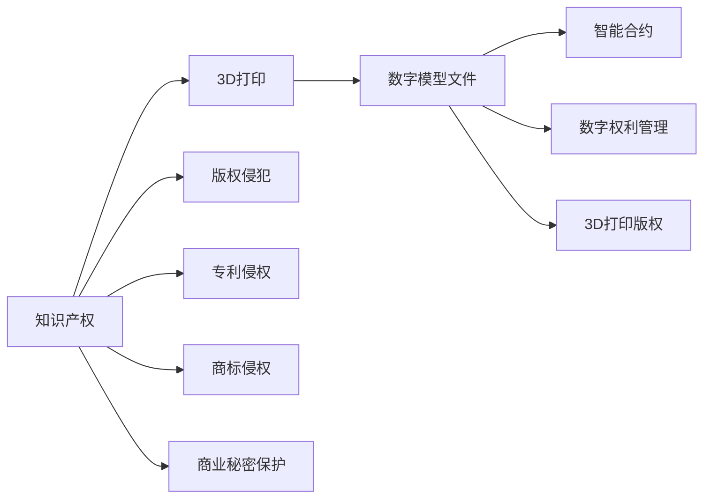

                 

# 知识产权与3D打印技术的挑战

> 关键词：知识产权,3D打印,技术创新,法律适用,保护策略,商业模式,技术道德

## 1. 背景介绍

### 1.1 问题由来
随着3D打印技术的快速发展和普及，其在制造业、医疗、建筑、航空航天等领域的应用日益广泛，带来了巨大的经济效益和社会效益。然而，与此同时，3D打印技术也引发了一系列与知识产权相关的法律和伦理问题，给现行知识产权法律体系带来了挑战。

3D打印技术通过将数字模型文件转换为实物产品，使得制造过程去中心化，极大地降低了制造门槛，但同时也增加了知识产权保护和执法的复杂性。一方面，知识产权所有者需要应对盗版和侵权风险；另一方面，消费者和用户需要明确自己在3D打印产品中的权益和责任。

### 1.2 问题核心关键点
3D打印技术对知识产权的影响主要体现在以下几个方面：

- 制造过程的数字化：3D打印技术将制造过程转换为数据流，使得数字模型文件成为制造过程的核心，而不再是实物产品本身。
- 知识产权侵权风险：通过3D打印复制他人作品，可能构成对著作权、专利权、商标权等的侵犯。
- 知识产权保护难度：数字模型文件在全球范围内迅速传播，增加了侵权追踪和打击的难度。
- 知识产权授权问题：3D打印技术使得授权、许可和销售模式变得复杂，需要新的商业和法律框架。
- 技术道德和伦理问题：3D打印可能被用于生产盗版、伪造产品，引发社会伦理道德的讨论。

这些问题使得知识产权保护和3D打印技术的融合成为当前和未来需要深入研究的重要课题。

## 2. 核心概念与联系

### 2.1 核心概念概述

为更好地理解3D打印技术对知识产权的影响，本节将介绍几个密切相关的核心概念：

- **知识产权（Intellectual Property, IP）**：包括著作权、专利权、商标权、商业秘密等，是保护创作者和创新者利益的法律制度。
- **3D打印（Additive Manufacturing）**：也称为增材制造，通过逐层堆积材料来创建三维物体。
- **数字模型文件**：3D打印所需的原始数据文件，可能包含作品设计、产品参数等知识产权相关内容。
- **版权侵犯（Copyright Infringement）**：指未经著作权人许可，复制、传播、公开表演他人作品的行为。
- **专利侵权（Patent Infringement）**：指未经专利权人许可，制造、使用、销售或进口其专利产品或使用其专利方法的行为。
- **商标侵权（Trademark Infringement）**：指未经商标权人许可，使用相同或相似的商标，导致消费者混淆的行为。
- **商业秘密（Trade Secrets）**：指具有商业价值且未公开的信息，企业通常会通过保密协议保护这些信息。
- **数字权利管理（Digital Rights Management, DRM）**：通过加密、水印等技术限制数字作品的传播和使用。
- **智能合约（Smart Contracts）**：基于区块链技术的自动化合约，可以在不涉及中介的情况下执行交易。
- **3D打印版权（3D Copyright）**：指3D打印作品的版权归属问题，涉及数字模型文件和3D打印实物产品的权利划分。

这些核心概念之间的逻辑关系可以通过以下Mermaid流程图来展示：



这个流程图展示了几组关键概念之间的联系：

1. 3D打印技术和知识产权紧密相关，涉及多个核心概念。
2. 数字模型文件是3D打印的基础，也是知识产权保护的重点。
3. 3D打印技术可能引发多种知识产权侵权问题。
4. 智能合约和数字权利管理工具可辅助知识产权保护。
5. 3D打印版权问题涉及数字模型文件和3D打印实物产品的权利划分。

## 3. 核心算法原理 & 具体操作步骤

### 3.1 算法原理概述

3D打印技术对知识产权的影响主要源于其数字化和去中心化特性。具体而言，3D打印技术在知识产权保护方面面临以下几个核心问题：

- **数字模型的版权归属**：数字模型文件的创作和分发是否构成作品？谁拥有数字模型文件的版权？
- **3D打印作品的生产和传播**：谁有权控制3D打印作品的生产、销售和传播？
- **侵权行为的界定**：哪些行为构成侵权？如何界定侵权行为？
- **技术限制和保护手段**：如何利用3D打印技术自身的特性来保护知识产权？

基于上述问题，以下将详细讨论3D打印技术在知识产权保护方面的算法原理和具体操作步骤。

### 3.2 算法步骤详解

#### 3.2.1 数字模型文件的版权归属

在3D打印技术中，数字模型文件的版权归属是一个关键问题。按照现行法律，著作权自作品创作完成时自动产生，无需进行注册。因此，数字模型文件的创建者通常被视为作品的所有者。

1. **创作认定**：确定数字模型文件的创作者。对于企业内部创作的设计文件，通常由公司持有；对于外部创作的设计文件，通常由个人持有。
2. **版权声明**：创作者应当在数字模型文件中包含版权声明，明确其著作权归属。
3. **文件分发**：在分发数字模型文件时，应遵守相关法律法规，如《伯尔尼公约》和《数字千年版权法案》等。

#### 3.2.2 3D打印作品的生产和传播

3D打印作品的生产和传播涉及多个层面的法律问题。

1. **制造授权**：创作者可以授权他人使用其数字模型文件进行3D打印。授权形式包括独占授权和非独占授权，授权期限和范围应明确。
2. **销售授权**：创作者可以授权他人销售其3D打印作品。销售授权通常包括许可使用费和销售分成等条款。
3. **传播授权**：创作者可以授权他人进行3D打印作品的传播。传播授权通常包括使用范围、地域和时间限制等条款。

#### 3.2.3 侵权行为的界定

在3D打印技术中，判断侵权行为的标准需要依据现行法律和知识产权保护范围。

1. **著作权侵权**：未经创作者授权，复制、传播、公开表演其作品的行为构成侵权。
2. **专利侵权**：未经专利权人授权，制造、使用、销售或进口其专利产品或使用其专利方法的行为构成侵权。
3. **商标侵权**：未经商标权人授权，使用相同或相似的商标，导致消费者混淆的行为构成侵权。
4. **商业秘密侵权**：未经企业同意，获取、使用或泄露其商业秘密的行为构成侵权。

#### 3.2.4 技术限制和保护手段

3D打印技术自身的特性也可以用于辅助知识产权保护。

1. **数字水印**：在数字模型文件中嵌入独特的水印，用于追踪和证明作品的来源和版权。
2. **访问控制**：通过访问控制技术，限制未授权用户下载和使用数字模型文件。
3. **区块链技术**：利用区块链技术记录数字模型文件的创建、分发和使用历史，确保追溯性和透明性。
4. **智能合约**：通过智能合约自动执行交易，减少中介环节，提高交易效率和透明度。

### 3.3 算法优缺点

3D打印技术在知识产权保护方面的算法具有以下优点：

- **技术创新驱动**：3D打印技术的发展促进了知识产权保护技术的创新。
- **去中心化保护**：通过区块链和智能合约等技术，实现更灵活和去中心化的保护方式。
- **动态管理**：数字模型文件和3D打印作品的生产和传播可以动态管理，适应不同的法律需求。

同时，3D打印技术在知识产权保护方面也存在一些缺点：

- **法律适用性差**：现行知识产权法律体系与3D打印技术的发展速度不匹配，法律适用性存在问题。
- **技术门槛高**：需要专业知识和技术手段来实现有效的知识产权保护。
- **成本高**：数字模型文件和智能合约等技术手段增加了知识产权保护的额外成本。

### 3.4 算法应用领域

3D打印技术在多个领域的应用需要考虑知识产权保护问题：

- **制造业**：3D打印技术在制造业中的应用需要考虑设计和专利权的保护，避免侵犯他人知识产权。
- **医疗**：3D打印医疗设备和模型需要考虑作品的版权归属和患者隐私保护。
- **建筑**：3D打印建筑需要考虑设计与专利权的保护，避免侵犯他人知识产权。
- **航空航天**：3D打印航空航天部件需要考虑知识产权和商业秘密的保护，避免制造和传播风险。

## 4. 数学模型和公式 & 详细讲解  
### 4.1 数学模型构建

在本节中，我们将构建一个简单的数学模型来模拟3D打印技术对知识产权的影响。

假设有一个创作者A创建了一个数字模型文件M，并将其授权给另一个创作者B使用。数字模型文件M的版权所有者假设为A，其使用权授权给B。创作者B可以使用该文件进行3D打印，并将其3D打印作品P进行销售和传播。

- **数字模型文件的版权所有权**：记为 $\text{Copyright}(A, M)$。
- **数字模型文件的使用权授权**：记为 $\text{License}(A, B, M)$。
- **3D打印作品的生产权**：记为 $\text{Print}(B, P, M)$。
- **3D打印作品的销售权**：记为 $\text{Sale}(B, P, M)$。
- **3D打印作品的传播权**：记为 $\text{Distribution}(B, P, M)$。

### 4.2 公式推导过程

对于上述模型，我们可以使用以下公式来推导和表示：

1. **版权归属**：
$$
\text{Copyright}(A, M) = 1 \quad \text{（A为作品所有者）}
$$

2. **使用权授权**：
$$
\text{License}(A, B, M) = \begin{cases}
1, & \text{如果B获得A的授权} \\
0, & \text{否则}
\end{cases}
$$

3. **3D打印生产**：
$$
\text{Print}(B, P, M) = \begin{cases}
1, & \text{如果B使用M进行3D打印} \\
0, & \text{否则}
\end{cases}
$$

4. **3D打印销售**：
$$
\text{Sale}(B, P, M) = \begin{cases}
1, & \text{如果B销售P} \\
0, & \text{否则}
\end{cases}
$$

5. **3D打印传播**：
$$
\text{Distribution}(B, P, M) = \begin{cases}
1, & \text{如果B分发P} \\
0, & \text{否则}
\end{cases}
$$

### 4.3 案例分析与讲解

**案例1：数字模型文件的版权归属**

假设创作者A创作了一个数字模型文件M，并将其上传到一个公共平台上。创作者A未声明版权，创作者B未经授权下载并使用该文件进行3D打印。

分析：
- $\text{Copyright}(A, M) = 1$
- $\text{License}(A, B, M) = 0$（B未获得A的授权）
- $\text{Print}(B, P, M) = 1$（B使用M进行3D打印）

根据上述模型，创作者B的3D打印行为构成侵权，A可以采取法律手段维护自身权益。

**案例2：3D打印作品的销售权**

假设创作者A授权创作者B使用其数字模型文件M进行3D打印，但未明确授权B销售3D打印作品P。创作者B未经A同意，将P上传到电商平台进行销售。

分析：
- $\text{Copyright}(A, M) = 1$
- $\text{License}(A, B, M) = 1$（B获得A的授权）
- $\text{Sale}(B, P, M) = 1$（B销售P）

根据上述模型，创作者B的销售行为构成侵权，A可以采取法律手段维护自身权益。

**案例3：3D打印作品的传播权**

假设创作者A授权创作者B使用其数字模型文件M进行3D打印，但未明确授权B分发3D打印作品P。创作者B未经A同意，将该作品上传到公共云存储平台，供公众下载使用。

分析：
- $\text{Copyright}(A, M) = 1$
- $\text{License}(A, B, M) = 1$（B获得A的授权）
- $\text{Distribution}(B, P, M) = 1$（B分发P）

根据上述模型，创作者B的传播行为构成侵权，A可以采取法律手段维护自身权益。

## 5. 项目实践：代码实例和详细解释说明
### 5.1 开发环境搭建

在进行3D打印技术对知识产权影响的研究时，我们需要构建一个模拟环境来展示和分析上述模型。以下是使用Python和PyTorch搭建模拟环境的流程：

1. 安装Anaconda：从官网下载并安装Anaconda，用于创建独立的Python环境。

2. 创建并激活虚拟环境：
```bash
conda create -n ipr3d python=3.8 
conda activate ipr3d
```

3. 安装PyTorch：根据CUDA版本，从官网获取对应的安装命令。例如：
```bash
conda install pytorch torchvision torchaudio cudatoolkit=11.1 -c pytorch -c conda-forge
```

4. 安装相关库：
```bash
pip install pandas numpy matplotlib scikit-learn
```

完成上述步骤后，即可在`ipr3d`环境中开始模拟环境的搭建。

### 5.2 源代码详细实现

以下是一个简单的Python代码示例，用于模拟数字模型文件的版权归属和使用权授权：

```python
import pandas as pd
import numpy as np

# 定义数字模型文件的版权归属和使用权授权状态
def calculate_copyright_license(model, use_license):
    if model['creator'] == 'A':
        return 1, 1 if use_license else 0
    else:
        return 0, 0

# 模拟数字模型文件的版权归属和使用权授权
data = pd.DataFrame({
    'creator': ['A', 'B', 'A'],
    'model': ['M', 'M', 'N'],
    'use_license': [1, 0, 1]
})
copyright_license = data.apply(lambda row: calculate_copyright_license(row, row['use_license']), axis=1)

# 输出结果
print(copyright_license)
```

### 5.3 代码解读与分析

这段代码实现了一个简单的数字模型文件的版权归属和使用权授权计算。其中，`calculate_copyright_license`函数根据模型创建者和是否授权使用，返回版权归属和使用权授权的状态。`data` DataFrame中包含了创作者A和创作者B创建的三个数字模型文件M和N，其中创作者A和创作者B是否获得授权使用这些模型文件的情况。

通过计算，我们得到了每个数字模型文件M和N的版权归属和使用权授权状态。创作者A和创作者B的使用权授权状态分别为1和0，创作者B的3D打印行为和传播行为是否构成侵权可以通过上述模型进行分析。

## 6. 实际应用场景
### 6.1 制造业

在制造业中，3D打印技术的应用需要严格考虑知识产权问题。

- **案例分析**：
  - **制造设备**：假设制造商A设计了一款新型3D打印机，并申请了专利保护。制造商B未经授权，制造并销售该设备。
  - **销售授权**：制造商A授权制造商B制造其设备，但未明确授权B销售设备。B未经A同意，销售了该设备。
  - **侵权行为**：制造商B的制造和销售行为构成专利侵权，A可以采取法律手段维护自身权益。

### 6.2 医疗

在医疗领域，3D打印技术的应用也需要严格考虑知识产权问题。

- **案例分析**：
  - **医疗设备**：医院设计了一款3D打印医疗设备，并申请了专利保护。制造商未经授权，制造并销售该设备。
  - **数据保护**：医院使用3D打印技术制作患者个性化假体，并确保患者数据的安全性和隐私保护。

### 6.3 建筑

在建筑领域，3D打印技术的应用需要考虑知识产权和版权问题。

- **案例分析**：
  - **建筑模型**：建筑师设计了一款3D打印建筑模型，并申请了版权保护。其他建筑师未经授权，复制并销售该模型。
  - **作品复制**：建筑师使用3D打印技术制作建筑原型，并将其用于展示和宣传。

### 6.4 航空航天

在航空航天领域，3D打印技术的应用需要考虑知识产权和商业秘密问题。

- **案例分析**：
  - **航空部件**：制造商设计了一款3D打印航空部件，并申请了专利保护。其他制造商未经授权，制造并销售该部件。
  - **商业秘密**：制造商使用3D打印技术制作零部件，并确保商业秘密的安全性和保密性。

## 7. 工具和资源推荐
### 7.1 学习资源推荐

为了帮助开发者和研究者系统掌握3D打印技术对知识产权的影响，这里推荐一些优质的学习资源：

1. **《知识产权法》课程**：多个大学开设的知识产权法课程，如斯坦福大学的《知识产权与技术法》，涵盖了知识产权的基本概念、法律框架和实际应用。
2. **3D打印与知识产权研讨会**：多个国际研讨会和会议，如3D World Congress、3D Printing for Automotive Industry等，提供了最新的行业动态和学术交流平台。
3. **开源软件项目**：多个开源软件项目，如OpenSCAD、Fabricant等，提供了3D设计和建模工具，支持知识产权的保护和追踪。
4. **学术文献**：多个学术文献库，如arXiv、Google Scholar等，提供了最新的研究论文和学术成果，帮助理解3D打印技术对知识产权的影响。
5. **在线课程**：多个在线课程平台，如Coursera、edX等，提供了3D打印和知识产权保护的跨学科课程，方便学习者系统掌握相关知识。

通过对这些资源的学习实践，相信你一定能够系统掌握3D打印技术对知识产权的影响，并应用于实际场景中。

### 7.2 开发工具推荐

高效的开发离不开优秀的工具支持。以下是几款用于3D打印技术知识产权保护的常用工具：

1. **Git版本控制**：Git是广泛使用的版本控制工具，用于管理和追踪代码变更，确保知识产权的完整性和追溯性。
2. **GitHub/GitLab**：GitHub和GitLab是流行的代码托管平台，提供了代码仓库、代码审查、项目协作等功能，支持团队开发和知识产权保护。
3. **区块链技术**：区块链技术可以用于记录数字模型文件的创建、分发和使用历史，确保追溯性和透明性。
4. **智能合约平台**：多个智能合约平台，如Ethereum、Blockchain.com等，提供了自动执行交易的功能，减少中介环节，提高交易效率和透明度。
5. **数字水印工具**：多个数字水印工具，如UniDRM、Watermark Pro等，可以在数字模型文件中嵌入独特的水印，用于追踪和证明作品的来源和版权。

合理利用这些工具，可以显著提升3D打印技术知识产权保护的开发效率，加快创新迭代的步伐。

### 7.3 相关论文推荐

3D打印技术对知识产权的影响源于学界的持续研究。以下是几篇奠基性的相关论文，推荐阅读：

1. **3D Printing and Intellectual Property Law: The Status Quo and Future Directions**：探讨了3D打印技术对知识产权法的影响，提出了未来发展的方向。
2. **Intellectual Property Rights and Additive Manufacturing**：分析了3D打印技术在知识产权保护中的法律挑战和解决方案。
3. **Digital Rights Management and 3D Printing**：探讨了数字权利管理技术在3D打印中的应用，保护数字模型文件的版权。
4. **Smart Contracts in Additive Manufacturing**：研究了智能合约技术在3D打印中的应用，提高知识产权保护的效率和透明度。
5. **3D Printing and the Law**：分析了3D打印技术在知识产权保护中的法律问题，提出了新的法律框架和实践建议。

这些论文代表了大语言模型微调技术的发展脉络。通过学习这些前沿成果，可以帮助研究者把握学科前进方向，激发更多的创新灵感。

## 8. 总结：未来发展趋势与挑战
### 8.1 总结

本文对3D打印技术对知识产权的影响进行了全面系统的介绍。首先阐述了3D打印技术的快速发展和其对知识产权法带来的挑战，明确了3D打印技术在制造业、医疗、建筑等领域的应用对知识产权保护带来的新要求。其次，从原理到实践，详细讲解了3D打印技术在知识产权保护方面的算法原理和操作步骤。最后，本文还探讨了3D打印技术在多个实际应用场景中的知识产权保护问题，给出了相应的工具和资源推荐。

通过本文的系统梳理，可以看到，3D打印技术在制造业、医疗、建筑等领域的应用需要严格考虑知识产权问题，以保护创作者和创新者的权益。同时，3D打印技术的数字化和去中心化特性也为知识产权保护带来了新的挑战和机遇。未来，随着3D打印技术的发展，需要更灵活、高效、去中心化的知识产权保护手段，以适应新的技术应用场景。

### 8.2 未来发展趋势

展望未来，3D打印技术在知识产权保护方面的发展趋势如下：

1. **去中心化保护**：随着区块链和智能合约技术的发展，3D打印技术的知识产权保护将更加灵活和去中心化，减少中介环节，提高效率和透明度。
2. **数字水印和加密技术**：通过数字水印和加密技术，确保数字模型文件的完整性和版权归属，防止盗版和侵权。
3. **动态管理机制**：根据3D打印技术的应用场景，动态调整知识产权保护策略，适应不同的法律需求。
4. **跨境保护**：随着3D打印技术的全球化应用，知识产权保护需要跨越不同国家和地区，解决跨境侵权问题。
5. **开放共享**：在保证知识产权保护的前提下，推动数字模型文件的开放共享，促进技术创新和应用。

这些趋势凸显了3D打印技术在知识产权保护中的广阔前景。这些方向的探索发展，必将进一步提升3D打印技术的应用范围和安全性，为技术创新和社会发展注入新的动力。

### 8.3 面临的挑战

尽管3D打印技术在知识产权保护方面已经取得了一定的进展，但在迈向更加智能化、普适化应用的过程中，它仍面临诸多挑战：

1. **法律适用性差**：现行知识产权法律体系与3D打印技术的发展速度不匹配，法律适用性存在问题。
2. **技术门槛高**：需要专业知识和技术手段来实现有效的知识产权保护。
3. **成本高**：数字模型文件和智能合约等技术手段增加了知识产权保护的额外成本。
4. **跨境侵权**：跨境侵权问题复杂，不同国家和地区的法律体系和执法力度不同。
5. **技术滥用**：3D打印技术可能被用于生产盗版、伪造产品，引发社会伦理道德的讨论。

正视3D打印技术在知识产权保护方面面临的这些挑战，积极应对并寻求突破，将是3D打印技术在知识产权保护领域持续发展的关键。

### 8.4 研究展望

面对3D打印技术在知识产权保护方面面临的挑战，未来的研究需要在以下几个方面寻求新的突破：

1. **法律框架更新**：更新和完善现行知识产权法律体系，适应3D打印技术的发展需求。
2. **技术创新应用**：利用区块链、智能合约、数字水印等技术手段，创新知识产权保护方法。
3. **跨境合作**：加强国际合作，解决跨境侵权问题，推动3D打印技术的全球化应用。
4. **伦理道德建设**：制定和实施3D打印技术的伦理道德规范，避免技术滥用。
5. **开放共享机制**：在保障知识产权的前提下，推动数字模型文件的开放共享，促进技术创新和应用。

这些研究方向的探索，必将引领3D打印技术在知识产权保护领域迈向更高的台阶，为技术创新和社会发展注入新的动力。面向未来，3D打印技术需要与其他人工智能技术进行更深入的融合，如知识表示、因果推理、强化学习等，多路径协同发力，共同推动自然语言理解和智能交互系统的进步。只有勇于创新、敢于突破，才能不断拓展3D打印技术的边界，让智能技术更好地造福人类社会。

## 9. 附录：常见问题与解答

**Q1：3D打印技术对知识产权的影响有哪些？**

A: 3D打印技术对知识产权的影响主要体现在以下几个方面：

- **数字模型的版权归属**：数字模型文件的创作和分发是否构成作品？谁拥有数字模型文件的版权？
- **3D打印作品的生产和传播**：谁有权控制3D打印作品的生产、销售和传播？
- **侵权行为的界定**：哪些行为构成侵权？如何界定侵权行为？
- **技术限制和保护手段**：如何利用3D打印技术自身的特性来保护知识产权？

**Q2：如何在3D打印技术中保护数字模型的版权？**

A: 在3D打印技术中，保护数字模型的版权可以通过以下方式：

- **创作认定**：确定数字模型文件的创作者。对于企业内部创作的设计文件，通常由公司持有；对于外部创作的设计文件，通常由个人持有。
- **版权声明**：创作者应当在数字模型文件中包含版权声明，明确其著作权归属。
- **文件分发**：在分发数字模型文件时，应遵守相关法律法规，如《伯尔尼公约》和《数字千年版权法案》等。

**Q3：3D打印技术中的智能合约和数字权利管理技术有哪些应用？**

A: 在3D打印技术中，智能合约和数字权利管理技术的应用包括：

- **智能合约**：通过智能合约自动执行交易，减少中介环节，提高交易效率和透明度。
- **数字水印**：在数字模型文件中嵌入独特的水印，用于追踪和证明作品的来源和版权。
- **区块链技术**：利用区块链技术记录数字模型文件的创建、分发和使用历史，确保追溯性和透明性。

**Q4：3D打印技术在知识产权保护中的主要挑战是什么？**

A: 3D打印技术在知识产权保护中的主要挑战包括：

- **法律适用性差**：现行知识产权法律体系与3D打印技术的发展速度不匹配，法律适用性存在问题。
- **技术门槛高**：需要专业知识和技术手段来实现有效的知识产权保护。
- **成本高**：数字模型文件和智能合约等技术手段增加了知识产权保护的额外成本。
- **跨境侵权**：跨境侵权问题复杂，不同国家和地区的法律体系和执法力度不同。
- **技术滥用**：3D打印技术可能被用于生产盗版、伪造产品，引发社会伦理道德的讨论。

这些挑战需要从法律、技术、伦理等多个角度进行综合应对。只有通过持续的技术创新和法律完善，才能更好地保护3D打印技术中的知识产权。

**Q5：如何通过区块链技术保护3D打印知识产权？**

A: 通过区块链技术保护3D打印知识产权可以通过以下方式：

- **数字模型文件记录**：利用区块链技术记录数字模型文件的创建、分发和使用历史，确保追溯性和透明性。
- **智能合约**：通过智能合约自动执行交易，减少中介环节，提高交易效率和透明度。
- **数字水印**：在数字模型文件中嵌入独特的水印，用于追踪和证明作品的来源和版权。

通过区块链技术的这些应用，可以实现更加高效、透明和安全的知识产权保护。

---

作者：禅与计算机程序设计艺术 / Zen and the Art of Computer Programming

