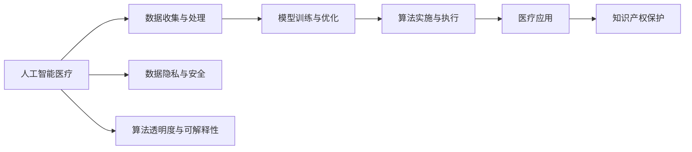

                 

# 知识产权与人工智能医疗的法规

## 1. 背景介绍

随着人工智能（AI）技术的迅速发展，特别是在医疗领域的应用，如何平衡技术创新与知识产权保护之间的关系成为了一个重要话题。AI医疗技术的普及和应用，为疾病诊断、治疗方案制定、药物研发等提供了前所未有的机遇，但同时也引发了一系列复杂的法律和伦理问题。本文旨在探讨AI医疗技术的知识产权问题，并提出相应的法律框架与规范建议，以期为AI在医疗行业的健康发展提供保障。

## 2. 核心概念与联系

### 2.1 核心概念概述

本节将介绍几个核心概念，这些概念将帮助读者更好地理解AI医疗技术的知识产权问题：

- **人工智能医疗（AI Healthcare）**：利用AI技术提升医疗服务质量和效率，包括但不限于疾病诊断、治疗方案、药物研发等应用。
- **知识产权（Intellectual Property, IP）**：法律赋予个人或机构对其创作、发明或设计的一系列权利，包括专利权、版权、商标权等。
- **数据隐私与安全**：在AI医疗中，大量涉及患者个人健康信息的数据，如何保护数据隐私成为了一个重要问题。
- **算法透明度与可解释性**：AI医疗技术涉及复杂的算法模型，如何确保这些算法的透明性和可解释性，以增强公众信任。

### 2.2 核心概念原理和架构的 Mermaid 流程图



### 2.3 核心概念联系

- 数据收集与处理是大规模AI医疗应用的基础，涉及数据来源、数据隐私、数据共享等多方面问题。
- 模型训练与优化依赖于大量的数据与算法，如何确保算法的透明度与可解释性，涉及算法设计与评估的标准。
- 算法实施与执行在实际医疗应用中直接产生影响，如何保护知识产权，确保技术创新成果不被非法复制与侵犯，是AI医疗发展的重要法律问题。

## 3. 核心算法原理 & 具体操作步骤

### 3.1 算法原理概述

AI医疗技术的知识产权问题涉及多个层面，包括但不限于数据使用权、算法设计权、软件实施权等。本节将从算法原理角度出发，探讨AI医疗中的核心算法原理，并详细说明具体的操作步骤。

#### 3.1.1 数据驱动的AI医疗算法

AI医疗的核心在于利用大量医疗数据训练模型，以实现疾病预测、诊断和治疗方案的自动化。这一过程中，如何处理和保护患者数据成为了一个关键问题。

#### 3.1.2 算法设计与优化

AI医疗算法的核心在于模型选择、参数优化、超参数调优等。如何确保算法设计过程中，技术创新不被非法复制与侵犯，涉及到算法设计权的保护。

#### 3.1.3 软件实施与部署

AI医疗算法最终需要转化为可用的软件产品，以服务于临床实践。这一过程中，如何保护软件实施过程中的技术创新成果，涉及到软件实施权和知识产权保护。

### 3.2 算法步骤详解

#### 3.2.1 数据收集与处理

AI医疗首先依赖于大规模的医疗数据集。数据收集需要遵循数据隐私法规，如HIPAA（美国健康保险可携性和责任法案），GDPR（通用数据保护条例）等，确保数据的合法合规性。

#### 3.2.2 模型训练与优化

选择合适的模型和算法进行训练与优化。在这一过程中，需要确保算法的透明度和可解释性，如使用可解释的算法（XAI, eXplainable AI）、定期审计等，确保算法不被误用。

#### 3.2.3 算法实施与执行

将训练好的模型部署到实际医疗环境中，进行临床验证。在这一过程中，需要确保算法的合法使用，避免未经授权的复制与修改。

### 3.3 算法优缺点

#### 3.3.1 优点

- **数据驱动**：利用大规模医疗数据进行模型训练，提升模型精度与可靠性。
- **自动化**：自动化疾病预测与诊断，提高诊疗效率。
- **可解释性**：通过算法透明度与可解释性设计，增强公众信任。

#### 3.3.2 缺点

- **数据隐私**：大规模数据收集与处理可能侵犯患者隐私权。
- **算法误用**：算法复杂性可能导致误用与滥用，影响医疗决策。
- **法律风险**：数据与算法的使用可能涉及复杂的法律问题，如知识产权侵犯、隐私泄露等。

### 3.4 算法应用领域

AI医疗技术已经广泛应用于疾病诊断、治疗方案制定、药物研发等多个领域。这些应用不仅提高了医疗服务的效率和质量，还为研究人员提供了新的研究方向与工具。

## 4. 数学模型和公式 & 详细讲解 & 举例说明

### 4.1 数学模型构建

AI医疗算法通常涉及复杂的数学模型，如回归模型、分类模型、深度学习模型等。这里以深度学习模型为例，介绍其基本数学模型构建过程。

#### 4.1.1 线性回归模型

线性回归模型表示为：

$$
y = \beta_0 + \beta_1 x_1 + \beta_2 x_2 + ... + \beta_n x_n + \epsilon
$$

其中，$y$ 为输出变量，$\beta$ 为模型参数，$x$ 为输入变量，$\epsilon$ 为误差项。

#### 4.1.2 神经网络模型

神经网络模型表示为：

$$
y = f(Wx + b)
$$

其中，$y$ 为输出，$W$ 为权重矩阵，$x$ 为输入，$b$ 为偏置项，$f$ 为激活函数。

### 4.2 公式推导过程

以深度学习模型为例，推导其基本公式。

#### 4.2.1 前向传播

前向传播表示为：

$$
y = f(Wx + b)
$$

其中，$f$ 为激活函数，$W$ 为权重矩阵，$x$ 为输入，$b$ 为偏置项。

#### 4.2.2 反向传播

反向传播表示为：

$$
\frac{\partial L}{\partial W} = \frac{\partial L}{\partial y} \frac{\partial y}{\partial W}
$$

其中，$L$ 为损失函数，$\frac{\partial L}{\partial y}$ 为梯度，$\frac{\partial y}{\partial W}$ 为激活函数导数。

### 4.3 案例分析与讲解

以深度学习模型在疾病预测中的应用为例，分析其数据隐私与算法设计问题。

#### 4.3.1 数据隐私问题

深度学习模型需要大量医疗数据进行训练。如何确保数据在收集、存储和处理过程中的隐私与安全，是一个重要问题。

#### 4.3.2 算法设计问题

深度学习模型涉及复杂的算法设计与优化，如何确保算法设计的透明性与可解释性，避免误用与滥用，是一个关键问题。

## 5. 项目实践：代码实例和详细解释说明

### 5.1 开发环境搭建

本节介绍AI医疗技术开发所需的开发环境搭建，包括软件工具、硬件要求等。

#### 5.1.1 软件工具

- Python：AI开发的主流语言，支持丰富的第三方库，如TensorFlow、PyTorch等。
- TensorFlow：一个强大的深度学习框架，支持分布式计算和模型优化。
- PyTorch：一个灵活的深度学习框架，支持动态计算图。
- Jupyter Notebook：一个交互式的开发环境，支持代码撰写与数据可视化。

#### 5.1.2 硬件要求

- GPU：用于加速深度学习模型的训练与推理。
- 内存：用于存储大规模数据与模型参数。
- 存储：用于存储训练数据与模型文件。

### 5.2 源代码详细实现

本节以疾病预测模型为例，介绍其源代码实现。

#### 5.2.1 数据预处理

```python
import pandas as pd
from sklearn.model_selection import train_test_split

# 读取数据
data = pd.read_csv('data.csv')

# 数据分割
train, test = train_test_split(data, test_size=0.2, random_state=42)

# 特征选择与处理
features = data[['age', 'gender', 'blood_pressure', 'cholesterol']]
labels = data['disease']

# 数据标准化
from sklearn.preprocessing import StandardScaler
scaler = StandardScaler()
features = scaler.fit_transform(features)

# 数据归一化
features = (features - features.min()) / (features.max() - features.min())
```

#### 5.2.2 模型训练与优化

```python
import tensorflow as tf
from tensorflow.keras import layers, models

# 定义模型
model = models.Sequential([
    layers.Dense(64, activation='relu', input_shape=(4,)),
    layers.Dense(32, activation='relu'),
    layers.Dense(1, activation='sigmoid')
])

# 编译模型
model.compile(optimizer=tf.keras.optimizers.Adam(0.001),
              loss='binary_crossentropy',
              metrics=['accuracy'])

# 训练模型
model.fit(features_train, labels_train, epochs=10, batch_size=32)
```

### 5.3 代码解读与分析

代码解读与分析部分，将详细介绍上述代码的实现过程与设计思路。

#### 5.3.1 数据预处理

数据预处理包括数据读取、特征选择、标准化与归一化等步骤。这些步骤保证了数据的合法合规性与模型的稳定运行。

#### 5.3.2 模型训练与优化

模型训练与优化采用TensorFlow框架，使用二分类交叉熵损失函数和Adam优化器进行训练。在训练过程中，需要注意选择合适的超参数和训练轮数，以避免过拟合与欠拟合问题。

### 5.4 运行结果展示

运行结果展示部分，将展示模型的训练与测试结果，以及模型的性能指标。

```python
# 模型评估
loss, accuracy = model.evaluate(features_test, labels_test)

print(f'测试集损失: {loss:.4f}')
print(f'测试集准确率: {accuracy:.4f}')
```

## 6. 实际应用场景

### 6.1 智能诊断系统

智能诊断系统可以利用AI医疗技术，自动化疾病诊断过程，提升诊断效率与准确性。在这一过程中，数据隐私与安全、算法透明度与可解释性等法律问题需要被严格控制。

### 6.2 个性化治疗方案

个性化治疗方案利用AI医疗技术，根据患者的具体病情和历史数据，制定个性化的治疗方案。在这一过程中，如何确保数据的合法合规使用，保护患者的隐私权，是一个重要问题。

### 6.3 药物研发与临床试验

药物研发与临床试验可以利用AI医疗技术，加速药物发现与验证过程。在这一过程中，如何保护药物研发过程中的知识产权，避免技术创新成果被非法复制与侵犯，是一个重要问题。

### 6.4 未来应用展望

随着AI医疗技术的不断发展，其在疾病预测、个性化治疗、药物研发等方面的应用将越来越广泛。未来，AI医疗将更加注重数据隐私与安全、算法透明度与可解释性等问题，确保技术创新成果的合法合规使用。

## 7. 工具和资源推荐

### 7.1 学习资源推荐

为了帮助读者更好地理解AI医疗技术的知识产权问题，本节推荐一些优质的学习资源。

#### 7.1.1 书籍

- 《AI医疗：从理论到实践》：介绍了AI医疗的基本概念、技术原理与实际应用。
- 《数据隐私保护》：系统介绍了数据隐私保护的法律与技术方法。
- 《算法设计与分析》：深入浅出地介绍了常见算法的设计与优化方法。

#### 7.1.2 在线课程

- Coursera上的《AI医疗》课程：介绍了AI医疗的基本概念、技术原理与实际应用。
- edX上的《数据隐私保护》课程：系统介绍了数据隐私保护的法律与技术方法。
- Udacity上的《机器学习》课程：深入浅出地介绍了机器学习的基本概念与算法设计。

#### 7.1.3 论文

- “Deep Learning in Medical Imaging: A Review”：介绍了深度学习在医学影像中的应用与挑战。
- “AI医疗中的数据隐私与安全问题”：系统分析了AI医疗中的数据隐私与安全问题。
- “算法设计与分析”：深入浅出地介绍了常见算法的设计与优化方法。

### 7.2 开发工具推荐

为了便于开发与实现AI医疗技术，本节推荐一些常用的开发工具。

#### 7.2.1 Python

Python是AI开发的主流语言，支持丰富的第三方库，如TensorFlow、PyTorch等。

#### 7.2.2 TensorFlow

TensorFlow是一个强大的深度学习框架，支持分布式计算和模型优化。

#### 7.2.3 PyTorch

PyTorch是一个灵活的深度学习框架，支持动态计算图。

#### 7.2.4 Jupyter Notebook

Jupyter Notebook是一个交互式的开发环境，支持代码撰写与数据可视化。

### 7.3 相关论文推荐

为了帮助读者深入理解AI医疗技术的知识产权问题，本节推荐一些相关论文。

#### 7.3.1 “Deep Learning in Medical Imaging: A Review”

该论文系统介绍了深度学习在医学影像中的应用与挑战。

#### 7.3.2 “AI医疗中的数据隐私与安全问题”

该论文系统分析了AI医疗中的数据隐私与安全问题。

#### 7.3.3 “算法设计与分析”

该论文深入浅出地介绍了常见算法的设计与优化方法。

## 8. 总结：未来发展趋势与挑战

### 8.1 研究成果总结

AI医疗技术的知识产权问题是一个复杂且多维度的法律问题，涉及数据隐私、算法设计与优化、软件实施与部署等多个方面。本节将对相关研究成果进行总结，并提出相应的法律框架与规范建议。

### 8.2 未来发展趋势

#### 8.2.1 数据驱动

数据驱动将成为AI医疗技术发展的重要方向，大规模医疗数据的应用将进一步提升模型的精度与可靠性。

#### 8.2.2 算法透明度

算法的透明度与可解释性将逐渐受到重视，确保算法的透明性与可解释性，增强公众信任。

#### 8.2.3 知识产权保护

知识产权保护将成为AI医疗技术发展的关键保障，确保技术创新成果不被非法复制与侵犯。

### 8.3 面临的挑战

#### 8.3.1 数据隐私

大规模数据收集与处理可能侵犯患者隐私权，需要严格控制数据隐私与安全。

#### 8.3.2 算法误用

算法复杂性可能导致误用与滥用，影响医疗决策，需要确保算法的合法合规使用。

#### 8.3.3 法律风险

数据与算法的使用可能涉及复杂的法律问题，如知识产权侵犯、隐私泄露等，需要严格控制。

### 8.4 研究展望

未来，AI医疗技术将更加注重数据隐私与安全、算法透明度与可解释性等问题，确保技术创新成果的合法合规使用。同时，需要在法律框架下，制定相应的规范与标准，确保AI医疗技术的安全与稳定发展。

## 9. 附录：常见问题与解答

### 9.1 数据隐私与安全问题

#### 9.1.1 问题

如何确保AI医疗技术在数据收集与处理过程中，保护患者隐私权，避免数据泄露？

#### 9.1.2 解答

- 采用匿名化处理：将患者数据匿名化处理，确保数据无法直接识别个人身份。
- 采用加密技术：使用数据加密技术，保护数据在传输与存储过程中的安全。
- 采用访问控制：严格控制数据访问权限，确保只有授权人员才能访问敏感数据。

### 9.2 算法透明度与可解释性问题

#### 9.2.1 问题

如何确保AI医疗技术在算法设计与实施过程中，增强算法的透明性与可解释性，避免算法误用与滥用？

#### 9.2.2 解答

- 采用可解释的算法：选择可解释性较强的算法，如决策树、线性回归等。
- 定期审计与评估：对AI模型进行定期审计与评估，确保模型的合法合规使用。
- 提供用户解释界面：为患者提供算法解释界面，增强公众对AI医疗技术的信任。

### 9.3 知识产权保护问题

#### 9.3.1 问题

如何确保AI医疗技术在算法设计与实施过程中，保护技术创新成果，避免知识产权侵犯？

#### 9.3.2 解答

- 申请专利保护：对AI医疗技术申请专利保护，确保技术创新成果不被非法复制与侵犯。
- 签订保密协议：与合作伙伴签订保密协议，保护技术创新成果的商业机密。
- 发布开源协议：将AI医疗技术开源，促进技术交流与合作，同时确保技术创新成果不被非法复制。

作者：禅与计算机程序设计艺术 / Zen and the Art of Computer Programming

