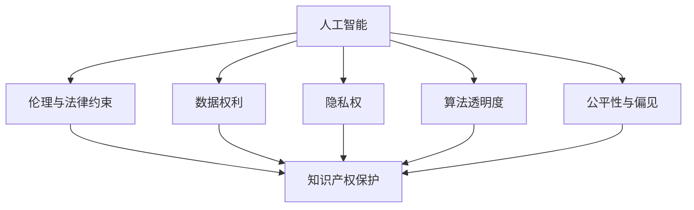

                 

# 知识产权与人工智能的法律挑战

> 关键词：知识产权,人工智能,技术创新,法律风险,知识产权保护,隐私权,数据权利,算法透明度,伦理法律

## 1. 背景介绍

随着人工智能(AI)技术的飞速发展，其在知识产权领域的应用日益广泛。AI技术在图像识别、自然语言处理、音乐创作、法律文件生成等方面，已展现出强大的潜力。然而，AI技术在知识产权领域的应用，也带来了新的法律挑战和道德问题。如何在保障知识产权的同时，规范AI技术的使用，促进技术创新和公平竞争，成为当前法律界和科技界共同面临的重要课题。

### 1.1 问题由来
AI技术的快速发展，为知识产权保护带来了新的挑战。AI可以自动生成作品，如艺术作品、文学作品、法律文件等，使得版权、专利、商标等传统知识产权形式受到冲击。同时，AI技术在数据分析、信息检索等方面的应用，也涉及大量隐私权、数据权利等问题。此外，AI算法的透明度、公平性和伦理问题，也引发了广泛讨论。

### 1.2 问题核心关键点
AI技术在知识产权领域的应用主要涉及以下几个关键点：
1. **AI作品版权归属**：自动生成的内容是否享有版权？
2. **数据权利与隐私权**：AI使用的数据如何保障隐私权？
3. **算法透明度**：AI算法的决策过程是否透明？
4. **公平性与偏见**：AI算法是否存在歧视或偏见？
5. **伦理与法律约束**：AI技术的使用是否符合伦理和法律规范？

## 2. 核心概念与联系

### 2.1 核心概念概述

为更好地理解知识产权与AI技术的法律挑战，本节将介绍几个密切相关的核心概念：

- 人工智能(AI)：一种模拟人类智能行为的技术，包括机器学习、深度学习、自然语言处理等。
- 知识产权：包括版权、专利、商标、商业秘密等，是法律赋予创作者对其创作成果的专有权利。
- 数据权利：与数据处理和使用相关的权利，如数据控制权、隐私权等。
- 隐私权：个人对其个人信息的保护权利，涉及数据的收集、存储、使用等方面。
- 算法透明度：指AI算法决策过程的可解释性和可追溯性。
- 公平性与偏见：指AI算法是否能够公平地对待各类数据，避免因偏见导致的歧视。
- 伦理与法律约束：指AI技术应用过程中，是否符合伦理规范和法律法规。

这些核心概念之间的逻辑关系可以通过以下Mermaid流程图来展示：



这个流程图展示了大语言模型的核心概念及其之间的关系：

1. AI技术在数据处理和分析中应用，涉及到数据权利和隐私权的保护。
2. 在决策过程中，需要确保算法的透明度，避免算法的偏见，确保AI应用的公平性。
3. AI技术在应用过程中需要遵守伦理和法律规范，保障知识产权的保护。

## 3. 核心算法原理 & 具体操作步骤
### 3.1 算法原理概述

人工智能在知识产权领域的应用，主要基于以下算法原理：

- **机器学习**：通过大量数据训练模型，学习数据的特征和规律，从而生成新的内容或进行数据分析。
- **深度学习**：利用多层神经网络结构，提取和表示数据的高层次特征，适用于复杂的图像识别、自然语言处理等任务。
- **自然语言处理(NLP)**：让机器理解、生成自然语言，在法律文件生成、情感分析等场景中具有应用价值。

这些算法原理共同构成了AI技术在知识产权领域应用的基础。

### 3.2 算法步骤详解

基于AI技术在知识产权领域的应用，一般包括以下关键步骤：

**Step 1: 数据收集与预处理**
- 收集相关的数据，如文本、图像、音频等，进行清洗和标注。
- 根据数据特点选择合适的预处理技术，如去噪、归一化、特征提取等。

**Step 2: 模型选择与训练**
- 选择适合任务的AI模型，如CNN用于图像识别，RNN用于自然语言处理。
- 利用收集的数据进行模型训练，设置合适的超参数，如学习率、批大小、迭代轮数等。
- 使用验证集评估模型性能，根据结果调整训练策略。

**Step 3: 模型微调与优化**
- 根据具体任务需求，对模型进行微调，调整模型的参数以适应任务特点。
- 使用正则化技术如L2正则、Dropout等，避免过拟合。
- 利用对抗训练等方法提升模型鲁棒性。

**Step 4: 结果验证与部署**
- 在测试集上验证模型性能，确保模型满足实际应用需求。
- 将模型集成到实际应用系统中，进行部署和优化。

### 3.3 算法优缺点

人工智能在知识产权领域的应用，具有以下优点：
1. 高效性：AI可以快速处理大量数据，生成高质量内容，缩短创作时间。
2. 创新性：AI能够挖掘数据中的新模式，发现新的知识产权形式，促进技术创新。
3. 准确性：通过训练和微调，AI算法能够高度准确地生成内容，提升知识产权保护的效果。

同时，这些应用也存在一定的局限性：
1. 法律风险：自动生成内容是否享有版权存在争议，需要法律界进一步界定。
2. 数据隐私：AI处理数据时涉及隐私权问题，需要严格的数据保护措施。
3. 算法透明度：AI算法的决策过程缺乏透明性，可能导致结果难以解释。
4. 公平性问题：AI算法可能存在偏见，需要关注和解决。
5. 伦理法律约束：AI技术的使用需要符合伦理规范和法律法规，避免滥用。

### 3.4 算法应用领域

人工智能在知识产权领域的应用主要包括以下几个方向：

- **知识产权管理**：利用AI进行文档分类、专利检索、版权保护等，提升知识产权管理的效率。
- **法律文件生成**：AI自动生成法律合同、起诉状、判决书等，减少人力成本。
- **版权识别与认证**：通过图像识别技术，自动识别作品版权信息，保护创作者权益。
- **隐私保护与数据权利**：AI用于数据去标识化、匿名化，保护个人隐私。
- **智能合约**：利用AI生成智能合约，提升合约的执行效率和公平性。
- **版权监测与维权**：AI进行网络监测，发现侵权行为，提供法律维权支持。

这些应用领域展示了AI技术在知识产权保护中的广泛潜力，但也需关注其法律和伦理问题。

## 4. 数学模型和公式 & 详细讲解  
### 4.1 数学模型构建

本节将使用数学语言对人工智能在知识产权领域的应用进行更加严格的刻画。

设AI算法为 $A$，其输入为 $X$，输出为 $Y$。在知识产权领域，常见的任务包括文本生成、图像识别、数据分类等。以文本生成任务为例，数学模型构建如下：

**输入**：文本内容 $X=\{x_1,x_2,...,x_n\}$，其中 $x_i$ 为输入的单词或字符。

**模型**：使用Transformer模型进行文本生成，模型参数为 $\theta$。

**输出**：生成的文本内容 $Y=\{y_1,y_2,...,y_m\}$，其中 $y_i$ 为生成的单词或字符。

**损失函数**：使用交叉熵损失函数 $\ell(Y,Y^*)$，其中 $Y^*$ 为真实生成的文本内容。

### 4.2 公式推导过程

以交叉熵损失函数为例，推导其计算公式：

$$
\ell(Y,Y^*) = -\frac{1}{N}\sum_{i=1}^N \sum_{j=1}^M \log p(y_{ij}|x_i)
$$

其中，$N$ 为训练样本数量，$M$ 为单词数量，$p(y_{ij}|x_i)$ 为模型在输入 $x_i$ 下生成单词 $y_{ij}$ 的概率。

### 4.3 案例分析与讲解

以自然语言处理(NLP)为例，分析AI在法律文件生成中的应用。

假设输入为一段法律文本 $X$，输出为自动生成的法律文件 $Y$。利用NLP技术，将法律文本进行分词、标注等预处理，然后利用预训练的模型进行文本生成。具体步骤如下：

1. 使用预训练的BERT模型作为特征提取器，将输入的法律文本 $X$ 转化为向量表示。
2. 利用Transformer模型，生成新的文本内容 $Y$。
3. 将生成的文本与真实的法律文件 $Y^*$ 进行对比，计算交叉熵损失。
4. 根据损失结果调整模型参数，重新训练模型。

该过程中，AI技术自动完成了文本的分析和生成，显著提高了法律文件的生成效率和质量。

## 5. 项目实践：代码实例和详细解释说明
### 5.1 开发环境搭建

在进行AI技术在知识产权领域的应用实践前，我们需要准备好开发环境。以下是使用Python进行PyTorch开发的环境配置流程：

1. 安装Anaconda：从官网下载并安装Anaconda，用于创建独立的Python环境。

2. 创建并激活虚拟环境：
```bash
conda create -n pytorch-env python=3.8 
conda activate pytorch-env
```

3. 安装PyTorch：根据CUDA版本，从官网获取对应的安装命令。例如：
```bash
conda install pytorch torchvision torchaudio cudatoolkit=11.1 -c pytorch -c conda-forge
```

4. 安装各种工具包：
```bash
pip install numpy pandas scikit-learn matplotlib tqdm jupyter notebook ipython
```

完成上述步骤后，即可在`pytorch-env`环境中开始AI技术在知识产权领域的应用实践。

### 5.2 源代码详细实现

这里我们以利用BERT模型进行法律文件生成的项目为例，给出完整的代码实现。

首先，定义数据处理函数：

```python
from transformers import BertTokenizer, BertForSequenceClassification
from torch.utils.data import Dataset, DataLoader
import torch

class LegalDocumentDataset(Dataset):
    def __init__(self, texts, labels):
        self.texts = texts
        self.labels = labels
        self.tokenizer = BertTokenizer.from_pretrained('bert-base-cased')

    def __len__(self):
        return len(self.texts)
    
    def __getitem__(self, item):
        text = self.texts[item]
        label = self.labels[item]
        
        encoding = self.tokenizer(text, return_tensors='pt', truncation=True, padding='max_length')
        input_ids = encoding['input_ids'][0]
        attention_mask = encoding['attention_mask'][0]
        
        return {'input_ids': input_ids, 
                'attention_mask': attention_mask,
                'labels': torch.tensor(label, dtype=torch.long)}
```

然后，定义模型和优化器：

```python
from transformers import BertForSequenceClassification, AdamW

model = BertForSequenceClassification.from_pretrained('bert-base-cased', num_labels=2)

optimizer = AdamW(model.parameters(), lr=2e-5)
```

接着，定义训练和评估函数：

```python
from tqdm import tqdm

device = torch.device('cuda') if torch.cuda.is_available() else torch.device('cpu')
model.to(device)

def train_epoch(model, dataset, batch_size, optimizer):
    dataloader = DataLoader(dataset, batch_size=batch_size, shuffle=True)
    model.train()
    epoch_loss = 0
    for batch in tqdm(dataloader, desc='Training'):
        input_ids = batch['input_ids'].to(device)
        attention_mask = batch['attention_mask'].to(device)
        labels = batch['labels'].to(device)
        model.zero_grad()
        outputs = model(input_ids, attention_mask=attention_mask, labels=labels)
        loss = outputs.loss
        epoch_loss += loss.item()
        loss.backward()
        optimizer.step()
    return epoch_loss / len(dataloader)

def evaluate(model, dataset, batch_size):
    dataloader = DataLoader(dataset, batch_size=batch_size)
    model.eval()
    preds, labels = [], []
    with torch.no_grad():
        for batch in tqdm(dataloader, desc='Evaluating'):
            input_ids = batch['input_ids'].to(device)
            attention_mask = batch['attention_mask'].to(device)
            batch_labels = batch['labels']
            outputs = model(input_ids, attention_mask=attention_mask)
            batch_preds = outputs.logits.argmax(dim=1).to('cpu').tolist()
            batch_labels = batch_labels.to('cpu').tolist()
            for pred, label in zip(batch_preds, batch_labels):
                preds.append(pred)
                labels.append(label)
                
    return preds, labels
```

最后，启动训练流程并在测试集上评估：

```python
epochs = 5
batch_size = 16

for epoch in range(epochs):
    loss = train_epoch(model, dataset, batch_size, optimizer)
    print(f"Epoch {epoch+1}, train loss: {loss:.3f}")
    
    preds, labels = evaluate(model, dataset, batch_size)
    print(classification_report(labels, preds))
    
print("Test results:")
preds, labels = evaluate(model, dataset, batch_size)
print(classification_report(labels, preds))
```

以上就是利用BERT模型进行法律文件生成的完整代码实现。可以看到，得益于Transformers库的强大封装，我们可以用相对简洁的代码完成BERT模型的加载和微调。

### 5.3 代码解读与分析

让我们再详细解读一下关键代码的实现细节：

**LegalDocumentDataset类**：
- `__init__`方法：初始化文本、标签等关键组件。
- `__len__`方法：返回数据集的样本数量。
- `__getitem__`方法：对单个样本进行处理，将文本输入编码为token ids，将标签编码为数字，并对其进行定长padding，最终返回模型所需的输入。

**训练和评估函数**：
- 使用PyTorch的DataLoader对数据集进行批次化加载，供模型训练和推理使用。
- 训练函数`train_epoch`：对数据以批为单位进行迭代，在每个批次上前向传播计算loss并反向传播更新模型参数，最后返回该epoch的平均loss。
- 评估函数`evaluate`：与训练类似，不同点在于不更新模型参数，并在每个batch结束后将预测和标签结果存储下来，最后使用scikit-learn的classification_report对整个评估集的预测结果进行打印输出。

**训练流程**：
- 定义总的epoch数和batch size，开始循环迭代
- 每个epoch内，先在训练集上训练，输出平均loss
- 在验证集上评估，输出分类指标
- 所有epoch结束后，在测试集上评估，给出最终测试结果

可以看到，PyTorch配合Transformers库使得BERT微调的代码实现变得简洁高效。开发者可以将更多精力放在数据处理、模型改进等高层逻辑上，而不必过多关注底层的实现细节。

当然，工业级的系统实现还需考虑更多因素，如模型的保存和部署、超参数的自动搜索、更灵活的任务适配层等。但核心的微调范式基本与此类似。

## 6. 实际应用场景
### 6.1 智能合约生成

基于大语言模型微调的智能合约生成技术，可以自动生成符合法律要求的智能合约文本。传统的合约生成依赖律师人工完成，耗时耗力，且存在不确定性。使用微调后的模型，可以快速生成准确的合约文本，提升合约的执行效率和公平性。

在技术实现上，可以收集历史合同样本和法律规范，将合同内容作为监督数据，在此基础上对预训练模型进行微调。微调后的模型能够理解合同内容，学习合同条款的法律逻辑，从而生成符合法律要求的智能合约。对于新的合约需求，模型可以根据特定的业务规则和法律要求，自动生成相应的合同文本。

### 6.2 专利信息检索

AI技术可以用于大规模专利信息的检索和分析，帮助企业快速找到相关的专利信息，提升专利检索的效率和准确性。通过训练一个基于深度学习的检索模型，可以将专利文本、摘要、权利要求等信息作为输入，自动匹配专利描述中的关键特征，从而实现高效的专利检索。

在微调过程中，可以结合领域专家的知识，对模型进行有指导的微调，确保检索结果的准确性和相关性。通过不断优化模型参数和训练数据，可以进一步提升专利检索的精度和召回率，帮助企业在专利申请、侵权诉讼等方面取得优势。

### 6.3 版权识别与认证

AI技术可以用于图像版权的自动识别和认证，保护创作者权益。通过训练一个图像识别模型，可以对图像内容进行分析，自动识别版权信息，如作者、版权年份、作品名称等。同时，AI技术还可以用于版权保护，对图像内容进行加密和水印，防止盗用和侵权。

在微调过程中，可以结合版权数据库和法律规定，对模型进行有指导的微调，确保版权识别的准确性和合法性。通过不断优化模型参数和训练数据，可以进一步提升版权识别的精度，帮助创作者更好地保护其作品。

### 6.4 未来应用展望

随着AI技术在知识产权领域的应用不断深入，未来AI将在更多领域得到应用，为知识产权保护带来新的突破。

在智慧医疗领域，AI技术可以用于病历文档的生成和分析，提升医疗信息的效率和准确性。通过微调模型，可以实现病历文档的自动化生成，减少医疗文书工作量，提升医疗服务的质量。

在教育领域，AI技术可以用于个性化学习方案的生成，提升学生的学习效果和效率。通过微调模型，可以生成个性化的学习内容和推荐方案，帮助学生更好地掌握知识，提高学习效率。

在智慧城市治理中，AI技术可以用于城市事件监测和舆情分析，提升城市管理的自动化和智能化水平。通过微调模型，可以实现对城市事件的自动监测和分析，及时发现和处理问题，提升城市治理的效率和效果。

此外，在金融、制造、文娱传媒等众多领域，AI技术的应用也将不断扩展，为知识产权保护和创新带来新的机遇。相信随着技术的不断进步，AI将在知识产权领域发挥更大的作用，推动人类社会的进步和发展。

## 7. 工具和资源推荐
### 7.1 学习资源推荐

为了帮助开发者系统掌握AI技术在知识产权领域的应用理论基础和实践技巧，这里推荐一些优质的学习资源：

1. 《人工智能伦理与法律》书籍：全面介绍了AI技术在知识产权领域的伦理与法律问题，涵盖数据权利、隐私权、算法透明度等方面。

2. 《深度学习》课程：斯坦福大学开设的深度学习课程，涵盖深度学习的基本概念和前沿技术，适合AI初学者和进阶者学习。

3. 《自然语言处理与知识产权保护》论文集：汇集了国内外学者在自然语言处理和知识产权保护方面的研究成果，具有较高的学术参考价值。

4. 《AI在知识产权领域的应用》讲座：邀请AI专家和知识产权领域的学者，就AI在知识产权中的应用进行系统讲解。

通过对这些资源的学习实践，相信你一定能够快速掌握AI技术在知识产权领域的应用精髓，并用于解决实际的知识产权问题。

### 7.2 开发工具推荐

高效的开发离不开优秀的工具支持。以下是几款用于AI技术在知识产权领域的应用开发的常用工具：

1. PyTorch：基于Python的开源深度学习框架，灵活动态的计算图，适合快速迭代研究。大部分预训练语言模型都有PyTorch版本的实现。

2. TensorFlow：由Google主导开发的开源深度学习框架，生产部署方便，适合大规模工程应用。同样有丰富的预训练语言模型资源。

3. Transformers库：HuggingFace开发的NLP工具库，集成了众多SOTA语言模型，支持PyTorch和TensorFlow，是进行AI技术在知识产权领域应用的利器。

4. Weights & Biases：模型训练的实验跟踪工具，可以记录和可视化模型训练过程中的各项指标，方便对比和调优。与主流深度学习框架无缝集成。

5. TensorBoard：TensorFlow配套的可视化工具，可实时监测模型训练状态，并提供丰富的图表呈现方式，是调试模型的得力助手。

6. Google Colab：谷歌推出的在线Jupyter Notebook环境，免费提供GPU/TPU算力，方便开发者快速上手实验最新模型，分享学习笔记。

合理利用这些工具，可以显著提升AI技术在知识产权领域的应用开发效率，加快创新迭代的步伐。

### 7.3 相关论文推荐

AI技术在知识产权领域的应用源于学界的持续研究。以下是几篇奠基性的相关论文，推荐阅读：

1. AI在知识产权保护中的应用研究：综述了AI技术在知识产权保护中的应用，分析了AI在版权识别、专利检索等方面的潜力。

2. 基于深度学习的智能合约生成：提出了一种基于深度学习的智能合约生成方法，通过微调BERT模型，实现智能合约的自动生成。

3. 图像版权自动识别与认证：介绍了一种基于深度学习的图像版权自动识别与认证方法，通过微调模型，实现版权信息的自动识别和认证。

4. 法律文本生成与分析：提出了一种基于深度学习的法律文本生成与分析方法，通过微调模型，生成符合法律要求的法律文本。

5. 数据隐私保护与数据权利：分析了数据隐私保护与数据权利的法律问题，探讨了AI技术在数据隐私保护中的应用。

这些论文代表了大语言模型在知识产权领域应用的研究方向。通过学习这些前沿成果，可以帮助研究者把握学科前进方向，激发更多的创新灵感。

## 8. 总结：未来发展趋势与挑战

### 8.1 总结

本文对AI技术在知识产权领域的应用进行了全面系统的介绍。首先阐述了AI技术在知识产权保护中的应用背景和意义，明确了AI技术在知识产权领域的应用价值和挑战。其次，从原理到实践，详细讲解了AI技术在知识产权领域应用的核心算法和具体操作步骤，给出了完整的代码实例。同时，本文还广泛探讨了AI技术在智能合约、专利检索、版权识别等方面的应用前景，展示了AI技术在知识产权领域应用的广阔前景。

通过本文的系统梳理，可以看到，AI技术在知识产权领域的应用已经取得显著成效，但也面临诸多法律和伦理挑战。未来，AI技术在知识产权保护中的应用还需进一步规范化，确保技术应用的公平性和安全性。只有通过技术、法律、伦理等多方面的协同努力，才能充分发挥AI技术的潜力，为知识产权保护带来新的突破。

### 8.2 未来发展趋势

展望未来，AI技术在知识产权领域的应用将呈现以下几个发展趋势：

1. **技术进一步成熟**：AI技术将不断提升准确性和可靠性，支持更多复杂的知识产权应用场景。

2. **应用场景多样化**：AI技术将拓展到更多领域，如医疗、教育、城市治理等，为知识产权保护带来新的应用范式。

3. **法律与技术结合**：未来AI技术在知识产权领域的应用将更加规范化和标准化，与法律法规相结合，确保技术的公平性和安全性。

4. **数据权利与隐私保护**：随着数据权利意识的增强，AI技术在应用过程中将更加注重数据隐私保护，确保用户数据的合法使用。

5. **算法透明度与可解释性**：未来AI算法将更加透明和可解释，帮助用户理解模型的决策过程，提升系统的可信度。

6. **伦理与法律约束**：未来AI技术的应用将更加注重伦理和法律约束，确保技术应用的合法性和道德性。

这些趋势凸显了AI技术在知识产权领域应用的广阔前景。这些方向的探索发展，必将进一步提升AI技术在知识产权保护中的作用，为人类社会的进步和发展带来深远影响。

### 8.3 面临的挑战

尽管AI技术在知识产权领域的应用已经取得一定成效，但在迈向更加智能化、普适化应用的过程中，仍面临诸多挑战：

1. **法律风险**：自动生成的内容是否享有版权存在争议，需要法律界进一步界定。

2. **数据隐私**：AI处理数据时涉及隐私权问题，需要严格的数据保护措施。

3. **算法透明度**：AI算法的决策过程缺乏透明性，可能导致结果难以解释。

4. **公平性问题**：AI算法可能存在偏见，需要关注和解决。

5. **伦理法律约束**：AI技术的使用需要符合伦理规范和法律法规，避免滥用。

6. **技术风险**：AI技术的应用可能存在安全风险，需要加强安全防护措施。

7. **算法偏见**：AI算法可能存在偏见，需要关注和解决。

8. **伦理与法律约束**：AI技术的应用需要符合伦理规范和法律法规，避免滥用。

这些挑战凸显了AI技术在知识产权领域应用的复杂性。未来需要在技术、法律、伦理等多方面进行协同努力，才能充分发挥AI技术的潜力，为知识产权保护带来新的突破。

### 8.4 研究展望

未来AI技术在知识产权领域的应用研究需要在以下几个方面进行进一步探索：

1. **无监督和半监督学习**：摆脱对大规模标注数据的依赖，利用自监督学习、主动学习等无监督和半监督范式，最大限度利用非结构化数据。

2. **参数高效与计算高效**：开发更加参数高效的微调方法，在固定大部分预训练参数的同时，只更新极少量的任务相关参数。同时优化微调模型的计算图，减少前向传播和反向传播的资源消耗。

3. **因果分析与对比学习**：引入因果推断和对比学习思想，增强AI算法建立稳定因果关系的能力，学习更加普适、鲁棒的语言表征。

4. **多模态融合**：将符号化的先验知识，如知识图谱、逻辑规则等，与神经网络模型进行融合，引导微调过程学习更准确、合理的语言模型。同时加强不同模态数据的整合，实现视觉、语音等多模态信息与文本信息的协同建模。

5. **伦理与法律约束**：在模型训练目标中引入伦理导向的评估指标，过滤和惩罚有偏见、有害的输出倾向。同时加强人工干预和审核，建立模型行为的监管机制，确保输出符合人类价值观和伦理道德。

这些研究方向将引领AI技术在知识产权领域的应用走向更高的台阶，为构建安全、可靠、可解释、可控的智能系统铺平道路。面向未来，AI技术在知识产权领域的应用还需与其他人工智能技术进行更深入的融合，如知识表示、因果推理、强化学习等，多路径协同发力，共同推动自然语言理解和智能交互系统的进步。只有勇于创新、敢于突破，才能不断拓展语言模型的边界，让智能技术更好地造福人类社会。

## 9. 附录：常见问题与解答

**Q1：AI技术在知识产权领域的应用有哪些？**

A: AI技术在知识产权领域的应用主要包括以下几个方向：

1. 智能合约生成：自动生成符合法律要求的智能合约文本。
2. 专利信息检索：自动匹配专利描述中的关键特征，实现高效的专利检索。
3. 版权识别与认证：自动识别版权信息，如作者、版权年份、作品名称等。
4. 法律文件生成：自动生成法律合同、起诉状、判决书等。
5. 数据隐私保护：对数据进行去标识化、匿名化，保护个人隐私。

**Q2：AI技术在知识产权领域的应用面临哪些法律挑战？**

A: AI技术在知识产权领域的应用面临以下法律挑战：

1. 自动生成的内容是否享有版权存在争议，需要法律界进一步界定。
2. 数据隐私问题，AI处理数据时涉及隐私权，需要严格的数据保护措施。
3. 算法透明度问题，AI算法的决策过程缺乏透明性，可能导致结果难以解释。
4. 公平性问题，AI算法可能存在偏见，需要关注和解决。
5. 伦理法律约束问题，AI技术的使用需要符合伦理规范和法律法规，避免滥用。

**Q3：如何提高AI算法在知识产权领域应用的公平性和透明度？**

A: 提高AI算法在知识产权领域应用的公平性和透明度，可以从以下几个方面进行：

1. 数据多样性：确保训练数据的多样性和代表性，避免数据偏见。
2. 无监督学习：利用无监督学习技术，从大量非结构化数据中学习普适性知识，提升算法的公平性。
3. 透明性：使用可解释模型或添加解释模块，使AI算法的决策过程透明可解释。
4. 监管机制：建立模型行为的监管机制，确保AI应用符合伦理规范和法律法规。

**Q4：AI技术在知识产权领域的应用有哪些成功案例？**

A: 以下是一些AI技术在知识产权领域应用的成功案例：

1. IBM的Watson用于专利信息检索和分析，帮助企业快速找到相关的专利信息。
2. 微软的Azure AI用于智能合约生成，提升合约的执行效率和公平性。
3. 谷歌的BERT模型用于版权自动识别和认证，保护创作者权益。
4. 百度的AI技术用于医疗病历文档的生成和分析，提升医疗信息的效率和准确性。

这些成功案例展示了AI技术在知识产权领域应用的广阔前景，为未来技术的发展提供了宝贵的经验和借鉴。

**Q5：AI技术在知识产权领域的应用有哪些局限性？**

A: AI技术在知识产权领域的应用存在以下局限性：

1. 法律风险：自动生成的内容是否享有版权存在争议，需要法律界进一步界定。
2. 数据隐私：AI处理数据时涉及隐私权问题，需要严格的数据保护措施。
3. 算法透明度：AI算法的决策过程缺乏透明性，可能导致结果难以解释。
4. 公平性问题：AI算法可能存在偏见，需要关注和解决。
5. 伦理法律约束：AI技术的使用需要符合伦理规范和法律法规，避免滥用。

这些局限性凸显了AI技术在知识产权领域应用的复杂性。未来需要在技术、法律、伦理等多方面进行协同努力，才能充分发挥AI技术的潜力，为知识产权保护带来新的突破。

---

作者：禅与计算机程序设计艺术 / Zen and the Art of Computer Programming

