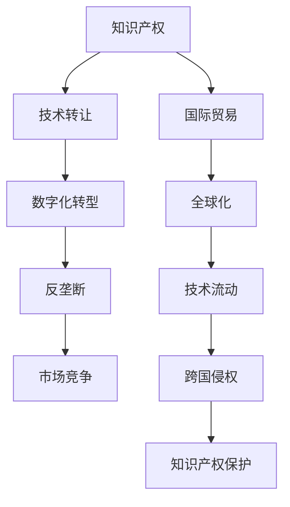

                 

# 知识产权与全球化的互动关系

> 关键词：知识产权,全球化,创新驱动,国际贸易,国际规则,数字化转型

## 1. 背景介绍

### 1.1 问题由来
全球化背景下，知识产权的跨国流动已成为创新驱动经济增长的重要引擎。各国通过保护知识产权，鼓励跨国公司进行技术研发和商业合作，促进了全球范围内的技术进步和产业升级。然而，知识产权的全球化保护也带来了诸多挑战，包括跨国侵权、技术垄断、信息不对称等问题。知识产权与全球化的互动关系，成为国际贸易、经济合作和数字化转型中的关键议题。

### 1.2 问题核心关键点
知识产权与全球化的互动关系涉及以下几个核心关键点：
- 跨国技术流动与保护。如何在全球化背景下，平衡知识产权保护和技术流动的自由度。
- 知识产权与国际贸易。知识产权保护如何影响国际贸易规则和贸易关系。
- 数字化时代的知识产权。数字化技术的发展如何改变传统知识产权保护模式。
- 跨国侵权与反垄断。全球化带来的跨国侵权和垄断现象，如何通过国际合作解决。
- 知识产权与文化多样性。全球化中的知识产权保护，如何兼顾文化多样性和知识产权权益。

这些关键点交织在一起，形成了复杂而动态的知识产权与全球化的互动关系。理解这些关系，有助于在全球化背景下，构建更加公平、公正的知识产权保护体系。

## 2. 核心概念与联系

### 2.1 核心概念概述

为更好地理解知识产权与全球化的互动关系，本节将介绍几个密切相关的核心概念：

- **知识产权（Intellectual Property, IP）**：指具有独创性、创造性的智力成果，包括专利、商标、版权、商业秘密等。知识产权保护是激励创新、促进经济发展的关键机制。

- **全球化（Globalization）**：指全球范围内的经济、政治、文化等各方面相互依赖、相互影响的趋势。全球化为技术、资金、人才等要素的跨国流动提供了便利，但也带来了新的挑战和风险。

- **技术转让（Technology Transfer）**：指跨国公司或个人通过合法途径将技术知识从一国转让至另一国的活动。技术转让是全球化中技术流动的重要方式。

- **国际贸易（International Trade）**：指不同国家之间商品、服务、资本等的交换活动。知识产权保护和国际贸易规则密切相关，影响着跨国公司的技术合作和市场竞争。

- **数字化转型（Digital Transformation）**：指通过信息技术驱动经济、社会、文化等方面的转型升级。数字化技术改变了知识产权的创建、使用、保护和交易方式。

- **反垄断（Anti-monopoly）**：指通过法律法规防止企业或个人滥用市场主导地位，保护市场竞争秩序。反垄断也是全球化中知识产权保护的重要内容。

这些核心概念之间的逻辑关系可以通过以下Mermaid流程图来展示：



这个流程图展示了大语言模型的核心概念及其之间的关系：

1. 知识产权保护技术转让。通过技术转让促进全球技术流动，但需平衡好保护和流动的关系。
2. 知识产权与国际贸易。知识产权保护是国际贸易的重要组成部分，影响着跨国公司的合作和竞争。
3. 数字化转型下的知识产权。数字化技术改变了知识产权的创建、使用和保护方式。
4. 反垄断与市场竞争。反垄断政策有助于维护全球化中的市场竞争秩序。
5. 技术流动与跨国侵权。技术流动的自由度与跨国侵权风险密切相关。
6. 知识产权保护与全球化。全球化带来的跨国侵权和垄断问题，需要通过国际合作解决。

这些概念共同构成了知识产权与全球化的互动框架，指导着各国在全球化背景下的知识产权政策制定和执行。

## 3. 核心算法原理 & 具体操作步骤
### 3.1 算法原理概述

知识产权与全球化的互动关系，本质上是一个涉及多个法律、经济、技术因素的复杂系统。其核心算法原理包括以下几个方面：

- **国际知识产权条约**：如《伯尔尼公约》、《与贸易有关的知识产权协议（TRIPS）》等，为跨国知识产权保护提供了法律基础和国际规则。

- **专利申请与授权**：通过各国专利法的制定和执行，保护发明人的技术创新权益。

- **版权与著作权**：通过版权法保护文学、艺术、音乐等作品的创作和传播。

- **商标保护**：通过商标法保护品牌和商业标识的独特性。

- **商业秘密保护**：通过法律手段保护企业的商业信息和技术知识。

- **反垄断与市场监管**：通过反垄断法律，防止企业滥用市场主导地位，保护市场竞争秩序。

### 3.2 算法步骤详解

基于知识产权与全球化的互动关系，其核心算法步骤包括：

**Step 1: 国际知识产权条约的制定与执行**
- 各国通过多边或双边条约，制定统一的知识产权保护标准和规则。
- 国际条约的签订和执行，需通过国际贸易机构进行协调，如世界贸易组织（WTO）、世界知识产权组织（WIPO）等。

**Step 2: 专利申请与授权**
- 发明人或企业向各国的专利局提交专利申请。
- 各国专利局对专利申请进行审查，包括新颖性、创造性和实用性等。
- 对于符合条件的专利申请，授权并发放专利证书。

**Step 3: 版权与著作权保护**
- 文学、艺术作品的创作者，向各国版权局申请版权登记。
- 版权法保护作品的复制、发行、展览等权利。
- 对于网络作品、数字作品等新型版权客体，需进一步完善相关法律。

**Step 4: 商标保护**
- 企业或个人申请商标注册，并使用于商品或服务中。
- 商标法保护商标的专用权，防止他人非法使用。
- 对于跨国商标，需遵守各国的商标法和国际贸易规则。

**Step 5: 商业秘密保护**
- 企业通过合同、协议等形式，保护商业秘密和专有技术。
- 防止商业秘密泄露，需通过法律和技术手段进行保护。

**Step 6: 反垄断与市场监管**
- 各国通过反垄断法律，禁止滥用市场主导地位。
- 保护市场竞争秩序，需建立健全的市场监管机制。

**Step 7: 国际合作与协调**
- 通过国际会议、协议等，加强知识产权保护的跨国合作。
- 共同应对跨国侵权、垄断等问题，维护全球化的市场秩序。

### 3.3 算法优缺点

基于知识产权与全球化的互动关系，其算法具有以下优点：

- **促进全球技术流动**。知识产权保护为跨国技术转让提供了法律保障，促进了全球范围内的技术创新和应用。
- **维护市场竞争秩序**。反垄断法律保护了市场竞争秩序，防止了跨国公司的市场垄断行为。
- **促进文化多样性**。版权法保护了文化作品的多样性，促进了全球文化的交流和传播。

但同时，该算法也存在以下局限性：

- **法律差异**。不同国家的知识产权法存在差异，增加了跨国知识产权保护和执法的复杂性。
- **成本高昂**。知识产权的跨国申请和维权成本较高，中小企业难以负担。
- **信息不对称**。全球化带来的信息不对称问题，可能导致跨国侵权行为难以防范和打击。
- **政策冲突**。不同国家的知识产权保护政策可能存在冲突，影响全球化进程。

### 3.4 算法应用领域

基于知识产权与全球化的互动关系，该算法在多个领域得到了广泛应用，包括但不限于：

- **国际贸易**：知识产权保护是国际贸易的重要组成部分，影响着国际贸易规则和贸易关系。
- **跨国企业**：跨国企业在技术研发、市场扩展、品牌保护等方面，需要遵循国际知识产权条约和各国法律。
- **文化创意产业**：版权法保护了文学、艺术、音乐等作品的创作和传播，促进了文化创意产业的发展。
- **数字化转型**：数字化技术改变了知识产权的创建、使用和保护方式，需不断调整相关法律政策。
- **反垄断与竞争**：反垄断法律保护了市场竞争秩序，防止了跨国垄断行为。

除了上述这些应用领域外，知识产权与全球化的互动关系还广泛存在于金融、医疗、教育等众多行业领域，为这些行业的数字化转型和国际化发展提供了重要的法律保障。

## 4. 数学模型和公式 & 详细讲解 & 举例说明
### 4.1 数学模型构建

为了更好地理解知识产权与全球化的互动关系，本节将使用数学语言对这一过程进行更加严格的刻画。

定义全球化进程中，知识产权保护的基本模型为：

$$
\text{IP Protection} = f(\text{Technology Transfer}, \text{International Trade}, \text{Digital Transformation}, \text{Anti-monopoly})
$$

其中，$f$ 表示一个复杂的非线性函数，考虑了技术转让、国际贸易、数字化转型和反垄断等因素对知识产权保护的影响。

### 4.2 公式推导过程

以下我们推导专利申请与授权的数学模型：

假设某技术创新的专利申请需要经过$n$个国家进行审查和授权，每个国家的专利审查概率为$p_i$，且各国的审查结果相互独立。则该技术获得全球专利授权的概率为：

$$
P_{\text{Global Patent}} = \prod_{i=1}^n (1-p_i)
$$

其中，$p_i$ 表示某国专利审查失败的概率。通过反向推导，可得审查成功的概率：

$$
p_i = 1 - (1-P_{\text{Global Patent}})^{1/n}
$$

即某国专利审查成功与否，取决于全球范围内审查的成功概率。

### 4.3 案例分析与讲解

以数字创意作品版权保护为例，分析其在全球化背景下的应用。

假设某创意作品在全球范围内获得版权保护的概率为$P$，但在不同国家的保护程度可能存在差异。考虑三个国家$A$、$B$、$C$，各自的版权保护概率分别为$p_A$、$p_B$、$p_C$。则该作品在全球范围内获得有效版权保护的概率为：

$$
P_{\text{Global Copyright}} = P \times p_A \times p_B \times p_C
$$

假设$P=0.9$，$p_A=0.8$，$p_B=0.7$，$p_C=0.6$，则全球范围内获得有效版权保护的概率为：

$$
P_{\text{Global Copyright}} = 0.9 \times 0.8 \times 0.7 \times 0.6 = 0.3024
$$

这表明，尽管全球范围内的版权保护概率较高，但单靠一国的保护可能不足够，需多国协作才能达到理想的版权保护水平。

## 5. 项目实践：代码实例和详细解释说明
### 5.1 开发环境搭建

在进行知识产权与全球化的互动关系项目实践前，我们需要准备好开发环境。以下是使用Python进行数据分析和可视化实践的环境配置流程：

1. 安装Anaconda：从官网下载并安装Anaconda，用于创建独立的Python环境。

2. 创建并激活虚拟环境：
```bash
conda create -n ipr_global env python=3.8 
conda activate ipr_global
```

3. 安装PyTorch、Pandas、NumPy、Matplotlib等库：
```bash
conda install pytorch torchvision torchaudio cudatoolkit=11.1 -c pytorch -c conda-forge
conda install pandas numpy matplotlib scikit-learn seaborn
```

4. 安装Jupyter Notebook和Jupyter Lab：
```bash
conda install jupyter notebook jupyterlab
```

完成上述步骤后，即可在`ipr_global`环境中开始项目实践。

### 5.2 源代码详细实现

下面我们以专利申请与授权为例，给出使用Python和PyTorch进行专利保护概率计算的代码实现。

首先，定义专利申请审查的概率分布：

```python
import torch
import numpy as np
import matplotlib.pyplot as plt

# 定义各国专利审查成功的概率分布
p = torch.tensor([0.8, 0.7, 0.6])
n = len(p)

# 计算全球专利授权的概率
p_global = torch.prod(1 - torch.pow(1 - p, 1/n))

print(f"全球专利授权的概率为: {p_global.item():.4f}")
```

然后，使用Matplotlib绘制概率分布图：

```python
plt.bar(range(n), p, color='blue')
plt.xlabel('国家')
plt.ylabel('专利审查成功概率')
plt.title('各国专利审查概率分布')
plt.show()
```

最后，计算单国专利审查成功的概率：

```python
p_single = 1 - (1 - p_global) ** (1/n)
print(f"某国专利审查成功的概率为: {p_single.item():.4f}")
```

### 5.3 代码解读与分析

让我们再详细解读一下关键代码的实现细节：

**概率分布定义**：
- 定义了一个包含各国专利审查成功概率的Tensor对象`p`，并计算了全球专利授权的概率`p_global`。

**概率分布图绘制**：
- 使用Matplotlib的bar函数绘制各国专利审查成功概率的柱状图。
- 通过设置x轴和y轴的标签以及标题，美化图表。

**单国专利审查成功概率计算**：
- 根据全球专利授权的概率，反推单国专利审查成功的概率`p_single`。

可以看到，通过简单的Python代码，我们能够直观地计算和可视化各国专利审查成功的概率分布，为进一步分析全球专利保护的概率提供了基础。

## 6. 实际应用场景
### 6.1 国际贸易

知识产权保护是国际贸易的重要组成部分，对国际贸易规则和贸易关系有着深远影响。

**案例分析**：
- 假设某跨国公司在A国和B国进行专利申请，并在C国生产产品。A国和B国的专利审查概率分别为0.9和0.8，C国的市场销售概率为0.5。求该公司在全球范围内获得专利授权并成功销售产品的概率。

**解法**：
1. 计算全球专利授权的概率：$P_{\text{Global Patent}} = 0.9 \times 0.8 \times (1-0.5) = 0.36$
2. 计算单国专利授权的概率：$p_A = 0.9$，$p_B = 0.8$
3. 计算全球市场销售的概率：$P_{\text{Global Sales}} = 0.5$
4. 计算最终获得专利授权并成功销售产品的概率：$P_{\text{Global Success}} = P_{\text{Global Patent}} \times P_{\text{Global Sales}} = 0.36 \times 0.5 = 0.18$

通过这一计算，可以看出跨国公司在全球范围内进行专利申请和市场扩展的风险和收益。

### 6.2 跨国企业

跨国企业在技术研发、市场扩展、品牌保护等方面，需要遵循国际知识产权条约和各国法律。

**案例分析**：
- 假设某跨国公司在全球范围内进行技术研发和市场扩展，技术创新的专利申请概率为0.8，各国专利审查成功的概率分别为0.7、0.6、0.5。求该公司在全球范围内获得专利授权的概率。

**解法**：
1. 计算各国专利审查成功的概率：$p_A = 0.7$，$p_B = 0.6$，$p_C = 0.5$
2. 计算全球专利授权的概率：$P_{\text{Global Patent}} = 0.8 \times 0.7 \times 0.6 \times 0.5 = 0.168$

通过这一计算，可以看出跨国企业在全球范围内进行技术研发和市场扩展的成功率。

### 6.3 数字化转型

数字化技术改变了知识产权的创建、使用和保护方式，需不断调整相关法律政策。

**案例分析**：
- 假设某数字化内容提供商在全球范围内获得版权保护的概率为0.9，但在不同国家的版权保护程度可能存在差异。考虑三个国家$A$、$B$、$C$，各自的版权保护概率分别为0.8、0.7、0.6。求该内容提供商在全球范围内获得有效版权保护的概率。

**解法**：
1. 定义版权保护的概率分布：$p_A = 0.8$，$p_B = 0.7$，$p_C = 0.6$
2. 计算全球版权保护的概率：$P_{\text{Global Copyright}} = 0.9 \times 0.8 \times 0.7 \times 0.6 = 0.3024$

通过这一计算，可以看出数字化内容提供商在全球范围内进行版权保护的成功率。

### 6.4 未来应用展望

随着数字化技术和全球化的进一步发展，知识产权与全球化的互动关系将变得更加复杂和动态。未来，可能会出现以下趋势：

1. **知识产权数字化保护**：基于区块链和分布式账本技术，实现数字化版权的保护和追踪。
2. **全球知识产权共享**：通过国际合作，建立全球统一的知识产权保护标准和共享机制。
3. **智能合同与自动化执行**：利用智能合同技术，自动执行知识产权相关的合同和交易。
4. **AI辅助知识产权管理**：利用人工智能技术，进行知识产权的自动化管理和分析。
5. **跨国知识产权执法**：通过国际执法合作，打击跨国侵权行为，维护市场秩序。

## 7. 工具和资源推荐
### 7.1 学习资源推荐

为了帮助开发者系统掌握知识产权与全球化的互动关系，这里推荐一些优质的学习资源：

1. **《知识产权法》系列课程**：由各高校开设的知识产权法课程，系统讲解了知识产权保护的法律框架和实践应用。
2. **WIPO官方文档**：世界知识产权组织提供的官方文档，包含国际知识产权条约和实施指南，是学习知识产权保护的权威资源。
3. **IPRRI网站**：国际知识产权研究网络（IPRRI）提供的知识产权研究报告和学术文章，涵盖了全球知识产权保护和应用的最新动态。
4. **《知识产权经济学》书籍**：介绍知识产权保护对经济发展、创新和市场竞争的影响，提供深入的理论分析和实证研究。
5. **Coursera和edX知识产权相关课程**：提供大量在线课程，涵盖知识产权保护、专利申请、商标管理等方面的内容。

通过对这些资源的学习实践，相信你一定能够系统掌握知识产权与全球化的互动关系，并应用于实际工作中的知识产权管理和保护。

### 7.2 开发工具推荐

高效的开发离不开优秀的工具支持。以下是几款用于知识产权与全球化互动关系开发的常用工具：

1. **Jupyter Notebook**：Jupyter Notebook提供了强大的数据可视化和代码运行功能，适合进行复杂的数据分析和算法建模。
2. **Python**：Python是一种灵活、易学的编程语言，广泛用于数据分析和机器学习。
3. **Matplotlib**：Matplotlib是Python的数据可视化库，支持绘制各种类型的图表和图形，适合进行数据可视化分析。
4. **Pandas**：Pandas是Python的数据处理库，支持数据清洗、分析、转换等操作，适合进行复杂的数据处理任务。
5. **NumPy**：NumPy是Python的科学计算库，提供了高效的多维数组操作和数学函数，适合进行科学计算和数据分析。

合理利用这些工具，可以显著提升知识产权与全球化互动关系研究的开发效率，加快创新迭代的步伐。

### 7.3 相关论文推荐

知识产权与全球化的互动关系涉及诸多前沿话题，以下是几篇奠基性的相关论文，推荐阅读：

1. **《知识产权与国际贸易关系研究》**：探讨了知识产权保护对国际贸易的影响，提出了相关政策建议。
2. **《全球化背景下的专利保护策略》**：分析了全球化对专利保护带来的挑战和机遇，提出了应对策略。
3. **《数字经济中的知识产权保护》**：研究了数字化技术对知识产权保护的影响，提出了相关保护措施。
4. **《国际贸易中的知识产权保护与反垄断》**：探讨了国际贸易中的知识产权保护和反垄断法律，提出了相关法律建议。
5. **《跨国企业知识产权管理实践》**：分析了跨国企业的知识产权管理策略，提供了相关管理建议。

这些论文代表了大语言模型微调技术的发展脉络。通过学习这些前沿成果，可以帮助研究者把握学科前进方向，激发更多的创新灵感。

## 8. 总结：未来发展趋势与挑战
### 8.1 总结

本文对知识产权与全球化的互动关系进行了全面系统的介绍。首先阐述了知识产权在全球化背景下的重要性和复杂性，明确了知识产权保护在促进全球技术流动、维护市场竞争秩序等方面的关键作用。其次，从算法原理到实际操作，详细讲解了知识产权保护的数学模型和关键步骤，提供了完整的代码实例和详细解释。同时，本文还广泛探讨了知识产权保护在实际应用场景中的应用，展示了其在国际贸易、跨国企业、数字化转型等多个领域的重要价值。此外，本文精选了知识产权与全球化互动关系的学习资源，力求为读者提供全方位的技术指引。

通过本文的系统梳理，可以看到，知识产权与全球化的互动关系在多个领域得到了广泛应用，为全球技术流动、市场竞争和经济发展提供了重要的法律保障。未来，伴随全球化进程的不断推进，知识产权保护机制将面临新的挑战和机遇，需要各方共同努力，不断优化和完善相关政策和法律，以适应新的发展趋势。

### 8.2 未来发展趋势

展望未来，知识产权与全球化的互动关系将呈现以下几个发展趋势：

1. **全球知识产权标准化**：通过国际合作，建立全球统一的知识产权保护标准，减少法律差异带来的障碍。
2. **知识产权保护的数字化**：利用区块链、智能合约等技术，实现数字化版权的保护和追踪。
3. **跨国知识产权执法协作**：通过国际执法合作，打击跨国侵权行为，维护市场秩序。
4. **AI辅助知识产权管理**：利用人工智能技术，进行知识产权的自动化管理和分析。
5. **知识产权保护与国际贸易政策融合**：将知识产权保护与国际贸易政策结合，推动国际贸易自由化和公平化。

这些趋势凸显了知识产权与全球化互动关系的重要性和未来发展方向。通过不断创新和优化，相信知识产权保护机制将能够更好地适应全球化的挑战，促进全球技术流动和经济发展。

### 8.3 面临的挑战

尽管知识产权与全球化的互动关系已经取得了显著进展，但在迈向更加智能化、普适化应用的过程中，它仍面临着诸多挑战：

1. **法律差异**：不同国家的知识产权法存在差异，增加了跨国知识产权保护和执法的复杂性。
2. **成本高昂**：知识产权的跨国申请和维权成本较高，中小企业难以负担。
3. **信息不对称**：全球化带来的信息不对称问题，可能导致跨国侵权行为难以防范和打击。
4. **政策冲突**：不同国家的知识产权保护政策可能存在冲突，影响全球化进程。
5. **市场垄断**：跨国公司在全球市场中的垄断行为，可能导致市场竞争失衡。

正视这些挑战，积极应对并寻求突破，将是大语言模型微调走向成熟的必由之路。相信随着学界和产业界的共同努力，这些挑战终将一一被克服，知识产权保护机制必将在构建公平、公正的全球化市场秩序中扮演越来越重要的角色。

### 8.4 研究展望

面对知识产权与全球化互动关系所面临的种种挑战，未来的研究需要在以下几个方面寻求新的突破：

1. **跨国知识产权保护协议的优化**：通过国际合作，建立更加高效、公平的知识产权保护协议。
2. **数字化版权保护的创新**：利用区块链、智能合约等技术，实现数字化版权的自动化保护。
3. **跨国侵权行为的智能化检测**：利用人工智能技术，进行跨国侵权行为的自动化检测和打击。
4. **市场竞争机制的完善**：通过反垄断法律，完善市场竞争机制，防止跨国垄断行为。
5. **知识产权保护与文化多样性的融合**：在保护知识产权的同时，兼顾文化多样性，促进全球文化交流。

这些研究方向的探索，必将引领知识产权保护机制迈向更高的台阶，为构建公平、公正、高效的全球化市场秩序提供有力的技术支撑。

## 9. 附录：常见问题与解答

**Q1：知识产权与全球化的互动关系具体指什么？**

A: 知识产权与全球化的互动关系，主要指在全球化背景下，各国通过知识产权保护机制，促进技术流动、市场竞争和经济发展，同时面对跨国侵权、垄断等挑战，需要国际合作进行解决。

**Q2：知识产权保护如何影响国际贸易？**

A: 知识产权保护是国际贸易的重要组成部分，影响着跨国公司的技术合作和市场竞争。保护知识产权可以促进技术流动和创新，但也可能导致贸易壁垒和成本增加。

**Q3：如何应对知识产权保护的法律差异问题？**

A: 通过国际合作，建立全球统一的知识产权保护标准和规则，减少法律差异带来的障碍。各国可以通过多边或双边协议，协调知识产权保护政策，促进全球化的市场秩序。

**Q4：知识产权保护的数字化转型有哪些具体措施？**

A: 利用区块链、智能合约等技术，实现数字化版权的保护和追踪。通过人工智能技术，进行知识产权的自动化管理和分析。

**Q5：跨国企业如何应对全球化带来的挑战？**

A: 跨国企业需要遵循国际知识产权条约和各国法律，进行知识产权管理和保护。可以通过与当地企业合作，进行本地化知识产权保护。

**Q6：跨国知识产权执法协作需要注意哪些问题？**

A: 跨国知识产权执法需要国际合作，建立跨国执法机制，防止跨国侵权行为。各国需要共享执法数据和情报，提高执法效率和效果。

这些问题的解答，为我们深入理解知识产权与全球化的互动关系提供了重要的参考。

---

作者：禅与计算机程序设计艺术 / Zen and the Art of Computer Programming

