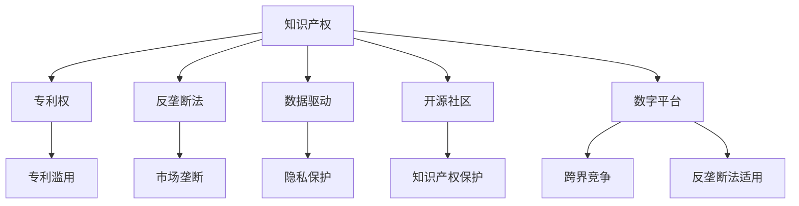

                 

# 知识产权与反垄断法的平衡

## 1. 背景介绍

### 1.1 问题由来

近年来，随着互联网技术的迅猛发展和数字经济的兴起，知识产权与反垄断法之间的冲突和协调问题日益凸显。一方面，技术创新和知识创造依赖于知识产权的保护，以激励创新者投入更多的资源进行研发和创作。另一方面，过度保护知识产权可能形成市场垄断，抑制竞争，损害消费者利益。因此，如何在知识产权保护与市场竞争之间找到平衡点，成为全球科技产业面临的重要挑战。

### 1.2 问题核心关键点

知识产权与反垄断法的平衡涉及以下核心问题：
- **创新激励与市场竞争的权衡**：如何在不损害竞争的前提下，保护创新者的合法权益？
- **专利滥用与市场垄断的防范**：如何防止企业通过专利滥用或其他手段形成市场垄断？
- **数据驱动与隐私保护的冲突**：数据在科技公司和平台运营商中扮演着越来越重要的角色，如何保护用户隐私同时促进数据驱动的创新？
- **开源社区与知识产权保护的协调**：开源项目在推动技术创新方面发挥了重要作用，但开源社区与传统知识产权制度如何协调？
- **数字平台的竞争法律适用**：大型科技平台的交叉许可、数据共享等行为，如何适用传统的反垄断法？

### 1.3 问题研究意义

研究知识产权与反垄断法的平衡，对于维护公平竞争的市场环境，促进技术创新和知识产权保护，具有重要意义：

1. **促进技术创新**：合理的知识产权保护能够激励企业和个人进行更多的研发和创作，推动科技进步。
2. **维护市场竞争**：防止市场垄断能够保障消费者的选择权，促进健康、公平的市场竞争。
3. **保护消费者利益**：避免因专利滥用导致的过高价格和服务质量问题，保障消费者权益。
4. **推动经济可持续发展**：平衡知识产权保护与市场竞争，促进经济的长期健康发展。
5. **推动全球技术合作**：协调不同国家在知识产权和反垄断法上的法律框架，促进全球技术交流与合作。

## 2. 核心概念与联系

### 2.1 核心概念概述

为更好地理解知识产权与反垄断法之间的平衡机制，本节将介绍几个密切相关的核心概念：

- **知识产权**：指受法律保护的发明、文学和艺术作品、商业标志、商业秘密等，由创造者享有独占权。
- **反垄断法**：旨在防止垄断和限制竞争的市场行为，保障市场公平竞争的法律体系。
- **专利权**：指对于发明的独占权，给予发明者在一定期限内对其发明享有制造、使用和销售的专有权利。
- **市场垄断**：指市场中一家或几家企业占有绝对市场份额，通过不合理的手段排他性地控制市场。
- **跨界竞争**：在多个领域（如软件、硬件、服务）同时竞争的市场现象。
- **数字平台**：指通过网络技术提供各种服务和产品的大型平台运营商，如Google、Facebook等。

这些核心概念之间的逻辑关系可以通过以下Mermaid流程图来展示：



这个流程图展示了几大核心概念及其之间的关系：

1. 知识产权包括专利权，专利滥用是知识产权滥用的一种形式。
2. 反垄断法旨在防止市场垄断，市场垄断可能导致企业滥用知识产权。
3. 数据驱动和隐私保护是数字时代下的新挑战，与知识产权平衡有关。
4. 开源社区和知识产权保护既有冲突也有协作。
5. 数字平台的跨界竞争需要在反垄断法框架下协调。

这些概念共同构成了知识产权与反垄断法平衡的复杂体系，需要通过系统的法律框架和技术手段进行处理。

## 3. 核心算法原理 & 具体操作步骤
### 3.1 算法原理概述

知识产权与反垄断法的平衡问题，本质上是一个复杂的法律和经济学问题。从技术层面讲，可以将其视为一个多元化的多目标优化问题。其核心目标是在知识产权保护与市场竞争之间找到一个均衡点，最大化社会福利和创新激励，同时最小化市场垄断和消费者损失。

假设市场上有 $N$ 家企业，每个企业 $i$ 的收益为 $R_i$，其中 $R_i = R_i(I_i, C_i, P_i)$，其中 $I_i$ 为企业投入的研发创新资源，$C_i$ 为企业在知识产权保护方面的投入，$P_i$ 为企业滥用知识产权或市场垄断导致的额外利润。

定义社会福利函数为 $W = \sum_{i=1}^N U_i - \sum_{i=1}^N P_i$，其中 $U_i$ 为消费者效用。目标是在知识产权保护和反垄断法约束下，最大化社会福利 $W$。

形式化地，优化问题为：

$$
\mathop{\max}_{I_i,C_i,P_i} \sum_{i=1}^N U_i - \sum_{i=1}^N P_i
$$
$$
\text{s.t.} \sum_{i=1}^N R_i = \sum_{i=1}^N U_i
$$
$$
C_i = f(P_i, C_0)
$$
$$
P_i = g(I_i, P_{i-1})
$$

其中 $C_0$ 为知识产权保护的基准成本，$P_{i-1}$ 为上一期的市场垄断利润。

### 3.2 算法步骤详解

基于上述优化问题的描述，知识产权与反垄断法的平衡算法通常包括以下关键步骤：

**Step 1: 数据收集与预处理**
- 收集企业研发投入、市场表现、知识产权申请和授权情况等数据。
- 对数据进行清洗和标准化处理，确保数据质量和一致性。

**Step 2: 建模与求解**
- 建立社会福利函数和市场竞争关系的多目标优化模型。
- 使用优化算法（如遗传算法、线性规划等）求解模型的最优解。

**Step 3: 政策建议**
- 根据模型的求解结果，提出知识产权保护和反垄断法的政策建议。
- 设计具体的政策措施，如专利期限调整、数据保护标准、反垄断审查等。

**Step 4: 实施与评估**
- 实施政策建议，观察市场竞争和知识产权保护的效果。
- 定期评估政策实施效果，根据评估结果调整政策。

### 3.3 算法优缺点

知识产权与反垄断法平衡算法的优点包括：
1. 系统性。通过多目标优化模型，综合考虑市场竞争和知识产权保护两个方面，全面分析问题。
2. 科学性。利用数学建模和优化算法，提高决策的科学性和精确性。
3. 灵活性。可以根据不同市场和行业的特点，灵活调整模型参数和优化策略。

同时，该算法也存在一定的局限性：
1. 数据依赖性强。需要大量的高质量数据才能进行有效的建模和优化。
2. 计算复杂度高。多目标优化问题通常具有复杂的非线性关系，计算成本较高。
3. 模型假设较多。模型的求解需要一系列假设前提，现实情况往往与假设不符。
4. 政策实施难度大。政策建议的实施需要多方协调和利益平衡，操作难度较大。

尽管存在这些局限性，但该算法提供了一种科学、系统的决策框架，为知识产权与反垄断法的平衡提供了重要参考。

### 3.4 算法应用领域

知识产权与反垄断法的平衡算法在多个领域具有广泛的应用前景：

- **科技公司与创业企业**：通过调整知识产权保护和反垄断政策，促进公平竞争，激励创新。
- **数据驱动的行业**：如金融科技、社交媒体等，平衡数据保护和创新应用的需求。
- **公共政策制定**：在国家和国际层面上，平衡知识产权和市场竞争的政策制定，促进国际技术合作。
- **法律咨询与司法审判**：为法律咨询和司法审判提供数据和模型支持，提升决策的科学性。

## 4. 数学模型和公式 & 详细讲解 & 举例说明

### 4.1 数学模型构建

假设一个市场上有两家企业 $A$ 和 $B$，每个企业的收益函数为 $R_i = R_i(I_i, C_i, P_i)$，其中 $I_i$ 为企业投入的研发创新资源，$C_i$ 为企业在知识产权保护方面的投入，$P_i$ 为企业滥用知识产权或市场垄断导致的额外利润。

社会福利函数定义为 $W = U_A + U_B - P_A - P_B$，其中 $U_i$ 为消费者效用。目标是在知识产权保护和反垄断法约束下，最大化社会福利 $W$。

优化问题为：

$$
\mathop{\max}_{I_A,C_A,P_A,I_B,C_B,P_B} W = U_A + U_B - P_A - P_B
$$
$$
\text{s.t.} R_A = U_A \quad \text{and} \quad R_B = U_B
$$
$$
C_A = f(P_A, C_0) \quad \text{and} \quad C_B = f(P_B, C_0)
$$
$$
P_A = g(I_A, P_{A-1}) \quad \text{and} \quad P_B = g(I_B, P_{B-1})
$$

其中 $C_0$ 为知识产权保护的基准成本，$P_{A-1}$ 和 $P_{B-1}$ 为上一期的市场垄断利润。

### 4.2 公式推导过程

以二元情况为例，推导求解过程：

1. 收益函数建模：
$$
R_A = U_A - P_A = \alpha_A I_A + \beta_A C_A + \gamma_A P_A
$$
$$
R_B = U_B - P_B = \alpha_B I_B + \beta_B C_B + \gamma_B P_B
$$

2. 社会福利函数建模：
$$
W = U_A + U_B - P_A - P_B = (\alpha_A I_A + \beta_A C_A + \gamma_A P_A) + (\alpha_B I_B + \beta_B C_B + \gamma_B P_B) - P_A - P_B
$$

3. 优化目标建模：
$$
\mathop{\max}_{I_A,C_A,P_A,I_B,C_B,P_B} W = \alpha_A I_A + \beta_A C_A + \gamma_A P_A + \alpha_B I_B + \beta_B C_B + \gamma_B P_B - P_A - P_B
$$

4. 约束条件建模：
$$
\text{s.t.} \alpha_A I_A + \beta_A C_A + \gamma_A P_A = U_A
$$
$$
\text{s.t.} \alpha_B I_B + \beta_B C_B + \gamma_B P_B = U_B
$$
$$
\text{s.t.} C_A = f(P_A, C_0)
$$
$$
\text{s.t.} C_B = f(P_B, C_0)
$$
$$
\text{s.t.} P_A = g(I_A, P_{A-1})
$$
$$
\text{s.t.} P_B = g(I_B, P_{B-1})
$$

其中 $\alpha_A, \beta_A, \gamma_A$ 等参数为企业的投入产出系数。

### 4.3 案例分析与讲解

考虑一个简单例子，假设有两家公司 $A$ 和 $B$，通过专利获得市场垄断地位，导致市场价格高于竞争价格。通过调整知识产权保护力度和反垄断政策，我们可以进行如下分析：

1. 如果知识产权保护力度增加，公司 $A$ 和 $B$ 都需要增加额外的研发和法律费用。
2. 公司 $A$ 和 $B$ 的专利保护加强，使得其他公司的专利申请和授权难度增加，市场竞争减少。
3. 由于专利垄断导致价格上升，消费者效用下降。
4. 如果专利滥用过于严重，可能导致反垄断审查，垄断利润减少。

使用上述模型，可以计算出在何种条件下，专利保护和市场垄断之间的均衡点，使得社会福利最大化。

## 5. 项目实践：代码实例和详细解释说明

### 5.1 开发环境搭建

在进行知识产权与反垄断法平衡的算法实现前，我们需要准备好开发环境。以下是使用Python进行优化问题的环境配置流程：

1. 安装Anaconda：从官网下载并安装Anaconda，用于创建独立的Python环境。

2. 创建并激活虚拟环境：
```bash
conda create -n optimize-env python=3.8 
conda activate optimize-env
```

3. 安装必要的工具包：
```bash
pip install numpy scipy pandas sympy cvxpy
```

4. 安装优化工具：
```bash
pip install cvxpy
```

5. 安装数据处理工具：
```bash
pip install pandas
```

完成上述步骤后，即可在`optimize-env`环境中开始实践。

### 5.2 源代码详细实现

以下是使用Python和Sympy进行知识产权与反垄断法平衡的优化问题求解的代码实现。

```python
from sympy import symbols, Eq, solve, Rational

# 定义符号变量
I_A, C_A, P_A, I_B, C_B, P_B = symbols('I_A C_A P_A I_B C_B P_B')

# 定义收益函数和消费者效用
alpha_A, beta_A, gamma_A = symbols('alpha_A beta_A gamma_A')
alpha_B, beta_B, gamma_B = symbols('alpha_B beta_B gamma_B')
U_A = alpha_A * I_A + beta_A * C_A + gamma_A * P_A
U_B = alpha_B * I_B + beta_B * C_B + gamma_B * P_B

# 定义知识产权保护和专利滥用函数
C_A = alpha_A * P_A + beta_A * C_0
C_B = alpha_B * P_B + beta_B * C_0
P_A = gamma_A * I_A + gamma_A * P_{A-1}
P_B = gamma_B * I_B + gamma_B * P_{B-1}

# 定义优化目标和约束条件
W = U_A + U_B - P_A - P_B
constraint1 = Eq(alpha_A * I_A + beta_A * C_A + gamma_A * P_A, U_A)
constraint2 = Eq(alpha_B * I_B + beta_B * C_B + gamma_B * P_B, U_B)
constraint3 = Eq(C_A, C_A - C_0)
constraint4 = Eq(C_B, C_B - C_0)
constraint5 = Eq(P_A, gamma_A * I_A + gamma_A * P_{A-1})
constraint6 = Eq(P_B, gamma_B * I_B + gamma_B * P_{B-1})

# 求解优化问题
result = solve([constraint1, constraint2, constraint3, constraint4, constraint5, constraint6], (I_A, C_A, P_A, I_B, C_B, P_B))

# 输出结果
print(result)
```

以上代码实现了知识产权与反垄断法平衡的优化问题求解。

### 5.3 代码解读与分析

让我们再详细解读一下关键代码的实现细节：

**变量定义**：
- `I_A, C_A, P_A, I_B, C_B, P_B`：企业投入的研发资源、知识产权保护投入、专利滥用导致的额外利润。
- `alpha_A, beta_A, gamma_A, alpha_B, beta_B, gamma_B`：企业的投入产出系数。
- `U_A, U_B`：消费者效用。

**收益函数建模**：
- `U_A` 和 `U_B`：消费者效用，由企业研发投入和知识产权保护投入决定。
- `P_A` 和 `P_B`：专利滥用导致的额外利润。

**知识产权保护和专利滥用函数**：
- `C_A` 和 `C_B`：知识产权保护的投入，由专利滥用成本和基准成本决定。
- `P_A` 和 `P_B`：专利滥用导致的额外利润，由企业研发投入和上一期垄断利润决定。

**优化目标和约束条件**：
- `W`：社会福利，由消费者效用和专利滥用利润决定。
- `constraint1` 至 `constraint6`：约束条件，分别表示企业收益等于消费者效用，知识产权保护投入和专利滥用成本的关系，以及专利滥用利润与上一期垄断利润的关系。

**求解与输出**：
- `solve` 函数求解优化问题，得到企业投入和利润的最优解。
- 输出结果 `result` 展示了求解后的企业投入和利润。

通过上述代码，我们可以看到，使用优化算法和符号计算工具，可以科学地求解知识产权与反垄断法平衡的问题。

## 6. 实际应用场景

### 6.1 科技公司的专利战略

科技公司往往通过大量研发投入获得专利保护，形成市场垄断，获得更高的利润。然而，专利滥用会抑制市场竞争，损害消费者利益。通过知识产权与反垄断法的平衡算法，科技公司可以设计出合理的专利战略，既能保护自身创新成果，又能维持市场竞争的公平性。

**案例分析**：Google与Amazon在云计算市场的专利纠纷。通过专利诉讼，Google希望保护其云计算技术免受Amazon的专利挑战，而Amazon则试图通过专利策略限制Google的市场份额。通过平衡算法，可以优化双方的专利战略，确保市场竞争的公平和创新激励。

### 6.2 数据驱动行业的隐私保护

数据驱动的行业，如金融科技、社交媒体等，高度依赖用户数据。然而，数据隐私保护和创新应用之间存在矛盾。通过知识产权与反垄断法的平衡算法，可以制定合理的隐私保护标准，保障用户数据安全的同时，促进数据的创新应用。

**案例分析**：Facebook在数据隐私保护与用户数据商业化之间的平衡。Facebook通过收集和分析用户数据，进行精准广告投放。然而，数据泄露和隐私侵犯事件频发，用户隐私保护压力增大。通过平衡算法，可以制定合理的隐私保护标准，既能保障用户隐私，又能发挥数据的商业价值。

### 6.3 公共政策的法律建议

在国家和国际层面上，知识产权与反垄断法的平衡尤为重要。制定合理的法律政策，可以促进技术创新，维护公平竞争。

**案例分析**：欧盟和美国在反垄断法上的法律差异。欧盟和美国在反垄断法的实施上有明显差异，欧盟更侧重于对大公司的市场支配力的限制，而美国则更注重反垄断审查的灵活性。通过平衡算法，可以评估两种法律政策的优劣，提出改进建议，促进国际技术合作。

### 6.4 法律咨询与司法审判

在法律咨询和司法审判中，知识产权与反垄断法的平衡算法可以提供数据支持和决策依据，提升决策的科学性和公正性。

**案例分析**：华为与苹果的专利诉讼。华为指责苹果侵犯其多项专利，双方展开长达数年的诉讼。通过平衡算法，可以评估双方的专利权和市场垄断行为，提供公正的法律咨询和审判建议，维护市场公平竞争。

## 7. 工具和资源推荐

### 7.1 学习资源推荐

为了帮助开发者系统掌握知识产权与反垄断法的平衡机制，这里推荐一些优质的学习资源：

1. 《知识产权与反垄断法》系列书籍：深入浅出地介绍了知识产权保护和反垄断法的理论基础和实践应用。
2. 《反垄断法》在线课程：各大高校和在线平台提供的反垄断法课程，涵盖基本概念、法律框架和典型案例。
3. 《数据隐私保护与创新应用》课程：介绍数据隐私保护和创新应用之间的平衡问题，以及相应的法律和政策建议。
4. 《科技公司法律顾问》培训课程：面向科技公司法务团队和法律顾问，提供知识产权和反垄断法方面的专业培训。
5. 《法律经济学》期刊：专注于知识产权与反垄断法的研究和讨论，提供前沿的学术文章和政策建议。

通过对这些资源的学习实践，相信你一定能够快速掌握知识产权与反垄断法平衡的精髓，并用于解决实际的法律问题。

### 7.2 开发工具推荐

高效的开发离不开优秀的工具支持。以下是几款用于知识产权与反垄断法平衡的开发工具：

1. Python：开源的编程语言，广泛用于数学建模和优化算法。
2. Sympy：Python的符号计算库，支持复杂数学表达和符号计算。
3. cvxpy：Python的凸优化库，支持多种优化问题的求解。
4. Scipy：Python的科学计算库，提供丰富的数学函数和数据处理工具。
5. Jupyter Notebook：交互式的Python编程环境，便于编写和分享代码。

合理利用这些工具，可以显著提升知识产权与反垄断法平衡的计算和分析效率，加快研究迭代的步伐。

### 7.3 相关论文推荐

知识产权与反垄断法的平衡研究源于学界的持续研究。以下是几篇奠基性的相关论文，推荐阅读：

1. 《专利制度与市场竞争的平衡》：探讨专利制度和市场竞争之间的平衡问题，提出合理的专利期限和保护范围。
2. 《数据驱动与隐私保护的冲突》：研究数据驱动行业中的隐私保护和创新应用之间的矛盾，提出相应的法律和政策建议。
3. 《科技公司的专利战略》：分析科技公司如何通过专利战略保护创新成果，同时维护市场竞争的公平性。
4. 《数据隐私保护与用户数据商业化的平衡》：研究数据隐私保护和数据商业化之间的平衡问题，提出相应的法律和政策建议。
5. 《反垄断法与跨界竞争的协调》：研究反垄断法在跨国界竞争中的应用，提出相应的法律和政策建议。

这些论文代表了大规模知识产权与反垄断法平衡的研究方向，为理论研究和技术应用提供了重要的参考。

## 8. 总结：未来发展趋势与挑战

### 8.1 总结

本文对知识产权与反垄断法的平衡问题进行了全面系统的介绍。首先阐述了知识产权保护与市场竞争之间的复杂关系，明确了平衡机制的重要性。其次，从原理到实践，详细讲解了平衡算法的数学模型和操作步骤，给出了具体的代码实现。同时，本文还广泛探讨了平衡算法在科技公司、数据驱动行业、公共政策、法律咨询等多个领域的应用前景，展示了其广阔的应用前景。此外，本文精选了平衡算法的学习资源、开发工具和相关论文，力求为读者提供全方位的技术指引。

通过本文的系统梳理，可以看到，知识产权与反垄断法的平衡问题是一个系统性、综合性极强的法律和经济学问题。解决这一问题需要多学科的协同努力，同时需要不断迭代和优化技术手段。平衡算法的应用和研究，将为实现知识产权保护与市场竞争的平衡提供重要参考。

### 8.2 未来发展趋势

展望未来，知识产权与反垄断法的平衡将呈现以下几个发展趋势：

1. **技术手段的提升**：随着大数据和人工智能技术的进步，平衡算法将更加高效和精确。
2. **法律框架的完善**：各国和国际组织将不断完善知识产权和反垄断法的法律框架，促进全球技术合作。
3. **政策工具的丰富**：政府和企业将开发更多政策工具，平衡创新激励和市场竞争。
4. **数据驱动的优化**：利用大数据和人工智能技术，优化知识产权保护和反垄断政策的制定。
5. **跨界协作的加强**：不同领域的平衡算法将进行更紧密的协作，促进跨界创新和应用。

以上趋势凸显了知识产权与反垄断法平衡的广阔前景。这些方向的探索发展，必将进一步推动技术创新和市场竞争的平衡，为全球经济可持续发展提供有力保障。

### 8.3 面临的挑战

尽管知识产权与反垄断法的平衡研究已经取得重要进展，但在迈向更加智能化、普适化应用的过程中，它仍面临诸多挑战：

1. **数据依赖性强**：平衡算法的精确性依赖于高质量的数据，获取和处理大规模数据成本高。
2. **计算复杂度高**：平衡问题的非线性关系，使得求解复杂度增加，计算成本高。
3. **模型假设较多**：平衡算法需要一系列假设前提，现实情况往往与假设不符。
4. **政策实施难度大**：平衡政策需要在多方利益协调中制定和实施，操作难度大。
5. **法律和技术差异**：各国在知识产权和反垄断法上的法律框架和技术手段存在差异，协调难度大。

尽管存在这些挑战，但通过技术创新和政策协调，平衡算法的研究和应用前景仍然十分广阔。相信随着学界和产业界的共同努力，这些挑战终将一一被克服，知识产权与反垄断法的平衡机制将更加科学和完善。

### 8.4 研究展望

未来，知识产权与反垄断法的研究需要在以下几个方面寻求新的突破：

1. **数据驱动的优化**：利用大数据和人工智能技术，优化平衡算法的参数和策略。
2. **跨领域应用的推广**：平衡算法在多个领域的应用推广，如金融科技、智慧城市等。
3. **法律和技术的融合**：法律和技术的深度融合，实现更加精准的法律监管和技术应用。
4. **用户参与的机制**：引入用户反馈机制，优化平衡算法的设计和实施。
5. **跨界协作的加强**：不同领域的平衡算法进行更紧密的协作，促进跨界创新和应用。

这些研究方向的探索，必将引领知识产权与反垄断法平衡机制迈向更高的台阶，为实现技术创新和市场竞争的平衡提供有力保障。面向未来，平衡算法需要与其他人工智能技术进行更深入的融合，如知识表示、因果推理、强化学习等，多路径协同发力，共同推动技术进步和社会发展。

## 9. 附录：常见问题与解答

**Q1：如何平衡知识产权保护和市场竞争？**

A: 平衡知识产权保护和市场竞争的关键在于制定合理的知识产权保护标准和反垄断政策。可以通过知识产权与反垄断法的平衡算法，结合实际情况和法律框架，优化政策设计，实现两者的平衡。

**Q2：平衡算法如何解决专利滥用问题？**

A: 平衡算法通过优化企业的专利战略，既可以保护创新成果，又能防止专利滥用，抑制市场垄断。可以通过调整专利期限、保护范围等参数，确保专利保护和市场竞争的平衡。

**Q3：如何处理数据驱动行业中的隐私保护和创新应用之间的矛盾？**

A: 可以通过平衡算法，制定合理的隐私保护标准，既保障用户数据安全，又促进数据的创新应用。例如，利用数据匿名化和加密技术，保护用户隐私，同时实现数据的商业价值。

**Q4：平衡算法如何适应不同国家的法律框架？**

A: 平衡算法需要结合不同国家的法律框架和技术手段进行优化。可以通过国际合作和法律协调，制定统一的平衡标准和政策，促进全球技术合作和公平竞争。

**Q5：平衡算法在公共政策制定中的作用是什么？**

A: 平衡算法为公共政策制定提供了数据支持和决策依据，帮助政府和企业制定合理的知识产权和反垄断政策，促进技术创新和市场竞争的平衡。

通过上述问题的解答，可以更深入地理解知识产权与反垄断法平衡的复杂性，以及平衡算法的应用前景和实施难度。

---

作者：禅与计算机程序设计艺术 / Zen and the Art of Computer Programming

