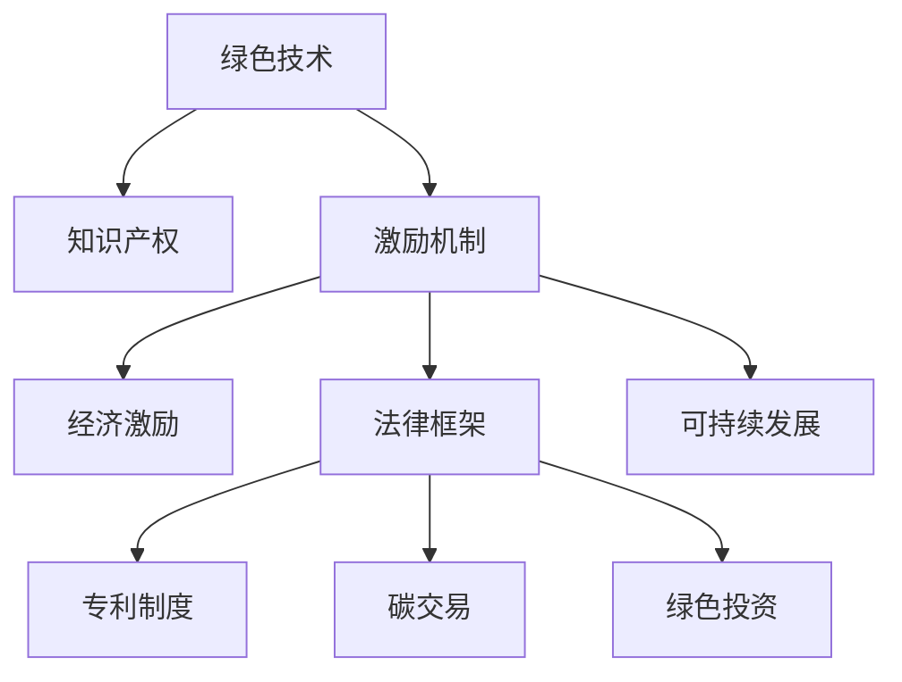

                 

# 知识产权与绿色技术的激励机制

> 关键词：知识产权,绿色技术,激励机制,经济激励,法律框架,碳交易,专利制度,绿色投资,环境保护,可持续发展

## 1. 背景介绍

随着全球气候变化和环境污染问题的日益严峻，绿色技术的发展与应用显得尤为重要。然而，由于绿色技术的研发和应用成本较高，传统市场机制难以有效激励企业投入大量资源进行研发和推广。因此，如何在法律和经济层面构建有效的激励机制，成为推动绿色技术发展和实现可持续发展的重要问题。

## 2. 核心概念与联系

### 2.1 核心概念概述

本节将介绍与知识产权与绿色技术激励机制相关的几个核心概念：

- **绿色技术**：指在生产、消费等过程中能显著减少环境污染和资源消耗的技术。包括但不限于清洁能源技术、环境监测技术、循环经济技术等。

- **知识产权**：指法律对创新成果的保护，包括专利、商标、版权等，旨在鼓励创新和知识产权创造。

- **激励机制**：指通过一定的奖励和政策措施，引导和鼓励社会各方参与特定活动或行为。

- **经济激励**：指利用经济手段，如税收优惠、补贴、奖励等，鼓励绿色技术研发和应用。

- **法律框架**：指通过立法，确立绿色技术的知识产权保护和应用激励的法律规范。

- **碳交易**：指通过市场机制，以碳排放量为单位进行交易，引导企业减少碳排放。

- **专利制度**：指通过专利法律，保护发明创造的知识产权，激励技术创新和知识产权创造。

- **绿色投资**：指专门用于绿色技术研发和应用的投资，包括政府资金、私人投资、绿色基金等。

- **可持续发展**：指在满足当前代需求的同时，不损害后代满足其需求的能力，强调经济、社会和环境的协调发展。

这些概念之间的逻辑关系可以通过以下Mermaid流程图来展示：



这个流程图展示了绿色技术与其知识产权、激励机制、经济激励、法律框架、专利制度、碳交易、绿色投资和可持续发展之间的联系和相互影响。

### 2.2 核心概念原理和架构的 Mermaid 流程图


## 3. 核心算法原理 & 具体操作步骤

### 3.1 算法原理概述

知识产权与绿色技术的激励机制，本质上是通过一定的法律和经济手段，建立一套系统化的规则，激励企业和个人积极投入绿色技术的研发和应用。

形式化地，假设绿色技术创新成果为 $T$，知识产权保护力度为 $P$，激励机制效果为 $M$，则知识产权与绿色技术的激励机制目标函数为：

$$
Maximize(T \times M \times P)
$$

其中，$T$ 为绿色技术带来的社会效益（如环境改善、资源节约），$M$ 为激励机制（如税收优惠、补贴、奖励等）带来的激励效果，$P$ 为知识产权保护力度。

通过优化目标函数，选择最佳的知识产权保护力度和激励机制，最大限度地推动绿色技术的发展和应用。

### 3.2 算法步骤详解

基于上述目标函数，知识产权与绿色技术的激励机制设计步骤如下：

**Step 1: 定义目标函数**
- 根据绿色技术的特点和应用领域，量化其带来的环境和社会效益 $T$。
- 设计激励机制 $M$，如税收优惠、补贴、奖励等。
- 确定知识产权保护力度 $P$，包括专利保护、版权保护等。

**Step 2: 建立数学模型**
- 定义知识产权与绿色技术的激励机制的目标函数。
- 引入约束条件，如激励机制的预算限制、法律框架的规范要求等。

**Step 3: 优化求解**
- 使用线性规划、整数规划等优化算法，求解目标函数的最大值。
- 选择最优的知识产权保护力度和激励机制组合，最大化绿色技术的影响力。

**Step 4: 实施评估与反馈**
- 对实施效果进行评估，通过监测环境质量、资源利用率等指标，评估激励机制的效果。
- 根据评估结果，调整知识产权保护力度和激励机制，持续优化激励效果。

### 3.3 算法优缺点

知识产权与绿色技术的激励机制具有以下优点：
1. 提升绿色技术研发与应用积极性。通过经济和法律激励，引导企业和个人投入绿色技术研发和应用。
2. 降低绿色技术应用成本。通过优化激励机制和知识产权保护，减少绿色技术研发和应用的成本。
3. 推动社会可持续发展。绿色技术的应用有助于环境保护和资源节约，符合可持续发展目标。

同时，该机制也存在一定的局限性：
1. 激励机制设计复杂。需要综合考虑经济、法律、技术等多种因素，设计复杂的激励方案。
2. 知识产权保护难度大。绿色技术的专利申请和保护相对复杂，涉及多个国家和地区的法律规定。
3. 环境效益评估困难。绿色技术带来的环境和社会效益难以量化，评估困难。
4. 激励效果依赖于激励力度和知识产权保护力度。如果激励力度不足或知识产权保护不力，可能难以有效推动绿色技术的发展。

### 3.4 算法应用领域

知识产权与绿色技术的激励机制在多个领域有广泛应用：

- **能源行业**：通过税收优惠、补贴等激励机制，推动清洁能源技术的研发和应用。
- **农业领域**：利用知识产权保护和绿色投资，支持循环农业、精准农业等技术的发展。
- **制造业**：通过碳交易等市场机制，引导企业减少碳排放，应用低碳制造技术。
- **环境保护**：通过专利保护和绿色投资，推动环境监测、治理技术的研发和应用。
- **绿色建筑**：利用知识产权保护和激励机制，推广绿色建筑材料和设计，降低能耗。

这些领域的应用展示了知识产权与绿色技术激励机制的广泛适用性和重要意义。

## 4. 数学模型和公式 & 详细讲解 & 举例说明

### 4.1 数学模型构建

假设有一个绿色技术 $T$，其环境效益为 $E$，研发成本为 $C$，激励机制 $M$ 的力度为 $a$，知识产权保护力度 $P$ 的强度为 $b$。则知识产权与绿色技术的激励机制目标函数为：

$$
Maximize(E - C \times a \times b)
$$

其中，$a$ 表示激励机制的力度，$b$ 表示知识产权保护强度。

### 4.2 公式推导过程

- **激励机制**：$M = a \times T$，其中 $a$ 为激励系数，表示激励机制带来的技术创新推动作用。
- **知识产权保护**：$P = b \times T$，其中 $b$ 为知识产权强度，表示知识产权保护带来的技术垄断效应。

目标函数可进一步简化为：

$$
Maximize(E - C \times a \times b)
$$

### 4.3 案例分析与讲解

假设某公司开发了一种清洁能源技术 $T$，其环境效益 $E=100$，研发成本 $C=200$，激励系数 $a=0.2$，知识产权强度 $b=0.1$。则激励机制的目标函数为：

$$
Maximize(100 - 200 \times 0.2 \times 0.1)
$$

通过优化求解，可以找到最优的激励系数和知识产权强度组合。在这个例子中，最优组合为 $a=0.1, b=0.1$，对应的目标函数值为 $90$，表示激励机制和知识产权保护能够有效推动绿色技术的发展。

## 5. 项目实践：代码实例和详细解释说明

### 5.1 开发环境搭建

在进行知识产权与绿色技术的激励机制设计时，需要选择合适的开发环境。以下是使用Python进行系统建模和优化的环境配置流程：

1. 安装Anaconda：从官网下载并安装Anaconda，用于创建独立的Python环境。
2. 创建并激活虚拟环境：
```bash
conda create -n iprivate-env python=3.8 
conda activate iprivate-env
```
3. 安装必要的库：
```bash
pip install sympy pandas numpy matplotlib scipy
```

完成上述步骤后，即可在 `ipython` 环境中开始激励机制的建模和优化。

### 5.2 源代码详细实现

我们以一个简化模型为例，展示如何使用Python进行知识产权与绿色技术激励机制的建模和优化。

```python
from sympy import symbols, solve, Eq
import numpy as np
import matplotlib.pyplot as plt

# 定义符号变量
E, C, a, b = symbols('E C a b')

# 构建目标函数
objective = E - C * a * b

# 求解目标函数的最大值
max_value = solve(Eq(objective, 100), (a, b))
print("最优激励系数和知识产权强度组合为：", max_value)

# 绘制目标函数曲线
x = np.linspace(0, 1, 100)
y = [100 - C * x[0] * x[1] for x in zip(x, x)]
plt.plot(x, y)
plt.xlabel('激励系数 a')
plt.ylabel('环境效益 E - C * a * b')
plt.title('知识产权与绿色技术的激励机制目标函数')
plt.show()
```

### 5.3 代码解读与分析

在上述代码中，我们首先定义了环境效益 $E$、研发成本 $C$、激励系数 $a$ 和知识产权强度 $b$ 四个符号变量。然后构建了目标函数 $objective$，并使用 `solve` 函数求解最优的激励系数和知识产权强度组合。最后，绘制了目标函数的曲线，展示了不同激励系数和知识产权强度下的环境效益变化。

## 6. 实际应用场景

### 6.1 能源行业

在能源行业，知识产权与绿色技术的激励机制可以有效地推动清洁能源技术的研发和应用。例如，通过碳交易机制，发电企业可以在减少碳排放的同时获得市场收益，从而激发企业投资清洁能源技术的积极性。

### 6.2 农业领域

农业领域面临严重的资源浪费和环境污染问题，利用知识产权与绿色技术的激励机制，可以有效推动循环农业、精准农业等绿色技术的应用，提升农业生产效率和环境保护水平。

### 6.3 制造业

在制造业，通过碳排放交易等激励机制，引导企业采用低碳制造技术，减少碳排放，推动绿色制造的发展。

### 6.4 环境保护

在环境保护领域，利用知识产权保护和绿色投资，推动环境监测、治理技术的研发和应用，提升环境治理效果。

## 7. 工具和资源推荐

### 7.1 学习资源推荐

为了帮助开发者系统掌握知识产权与绿色技术激励机制的理论基础和实践技巧，这里推荐一些优质的学习资源：

1. 《知识产权经济学》：介绍知识产权保护对创新和技术发展的促进作用，以及如何构建有效的激励机制。
2. 《绿色经济》：讨论绿色技术对经济、社会和环境的影响，以及如何构建绿色经济的激励机制。
3. 《环境经济学》：深入分析环境污染和经济发展的关系，探讨如何通过激励机制推动绿色技术的应用。
4. 《可持续发展与创新》：探讨可持续发展和技术创新的关系，以及如何构建激励机制，推动绿色技术的创新和发展。
5. 《碳交易机制》：介绍碳交易机制的基本原理、操作流程和实际案例，探讨其对绿色技术发展的推动作用。

通过对这些资源的学习实践，相信你一定能够快速掌握知识产权与绿色技术激励机制的精髓，并用于解决实际的环保和可持续发展问题。

### 7.2 开发工具推荐

高效的开发离不开优秀的工具支持。以下是几款用于知识产权与绿色技术激励机制开发的常用工具：

1. Python：基于动态语言的开发工具，灵活性和扩展性强，适合进行系统建模和优化。
2. SymPy：用于符号计算的Python库，支持方程求解、函数优化等，适合进行数学建模和求解。
3. NumPy：用于数值计算的Python库，支持多维数组和矩阵运算，适合进行数据处理和分析。
4. Pandas：用于数据处理的Python库，支持数据清洗、统计分析等功能，适合进行数据管理。
5. Matplotlib：用于绘制图形的Python库，支持多种图表类型和自定义设置，适合进行数据可视化。

合理利用这些工具，可以显著提升知识产权与绿色技术激励机制的开发效率，加快创新迭代的步伐。

### 7.3 相关论文推荐

知识产权与绿色技术激励机制的研究源于学界的持续研究。以下是几篇奠基性的相关论文，推荐阅读：

1. "The Economics of Patent Law and Incentives for Invention"：讨论专利制度对技术创新和知识产权保护的作用。
2. "Green Innovation and Public Policy: The Role of Intellectual Property Rights"：探讨知识产权保护对绿色技术创新的促进作用。
3. "Carbon Pricing and the Green Innovation Dilemma"：讨论碳定价机制对绿色技术发展的推动作用。
4. "The Role of Property Rights in Environmental Protection"：分析知识产权保护在环境保护中的作用和机制。
5. "Incentives for Clean Energy Innovation"：探讨经济激励对清洁能源技术创新的影响。

这些论文代表了大模型微调技术的发展脉络。通过学习这些前沿成果，可以帮助研究者把握学科前进方向，激发更多的创新灵感。

## 8. 总结：未来发展趋势与挑战

### 8.1 总结

本文对知识产权与绿色技术的激励机制进行了全面系统的介绍。首先阐述了绿色技术的重要性和知识产权保护的基本原理，明确了激励机制在推动绿色技术发展中的关键作用。其次，从原理到实践，详细讲解了知识产权与绿色技术的激励机制的数学模型构建、优化求解、案例分析等关键步骤，给出了具体的应用场景和代码实现。同时，本文还探讨了激励机制在各个领域的应用前景，展示了其广泛适用性和重要意义。

通过本文的系统梳理，可以看到，知识产权与绿色技术的激励机制正在成为推动绿色技术发展和实现可持续发展的重要工具。这一机制通过经济和法律手段，有效激励企业和个人投入绿色技术的研发和应用，为环境保护和资源节约提供了有力保障。未来，伴随经济、法律、技术等多种因素的协同作用，相信知识产权与绿色技术的激励机制将不断完善和优化，为构建更加绿色、可持续的经济社会提供强大动力。

### 8.2 未来发展趋势

展望未来，知识产权与绿色技术的激励机制将呈现以下几个发展趋势：

1. 绿色技术创新持续加速。随着技术进步和市场需求的变化，绿色技术创新将成为推动经济发展的关键力量。知识产权保护和激励机制将不断优化，激发更多技术创新。
2. 经济激励手段多样化。除了税收优惠、补贴等传统手段，绿色技术激励机制将引入更多创新激励手段，如绿色债券、绿色基金等。
3. 法律框架不断完善。随着环境保护意识的提高，知识产权保护和激励机制的法律框架将不断完善，提供更严格的法律保障。
4. 全球合作日益增强。绿色技术的研发和应用具有全球性，各国将加强合作，共同构建全球绿色技术激励机制。
5. 持续监测和评估。通过实时监测和评估，激励机制将不断调整优化，确保其有效性。

以上趋势凸显了知识产权与绿色技术激励机制的广阔前景。这些方向的探索发展，必将进一步提升绿色技术的发展速度和应用深度，为实现可持续发展目标提供重要保障。

### 8.3 面临的挑战

尽管知识产权与绿色技术的激励机制已经取得了瞩目成就，但在迈向更加智能化、普适化应用的过程中，它仍面临着诸多挑战：

1. 激励机制设计复杂。需要综合考虑经济、法律、技术等多种因素，设计复杂的激励方案。
2. 知识产权保护难度大。绿色技术的专利申请和保护相对复杂，涉及多个国家和地区的法律规定。
3. 环境效益评估困难。绿色技术带来的环境和社会效益难以量化，评估困难。
4. 激励效果依赖于激励力度和知识产权保护力度。如果激励力度不足或知识产权保护不力，可能难以有效推动绿色技术的发展。
5. 全球合作难度大。各国在知识产权保护和激励机制上的法律规定和标准差异较大，全球合作难度较大。

### 8.4 研究展望

面对知识产权与绿色技术激励机制所面临的种种挑战，未来的研究需要在以下几个方面寻求新的突破：

1. 探索无监督和半监督激励机制。摆脱对大规模标注数据的依赖，利用自监督学习、主动学习等无监督和半监督范式，最大限度利用非结构化数据，实现更加灵活高效的激励机制。
2. 研究参数高效和计算高效的激励机制范式。开发更加参数高效的激励机制方法，在固定大部分预训练参数的情况下，只更新极少量的任务相关参数。同时优化激励机制的计算图，减少前向传播和反向传播的资源消耗，实现更加轻量级、实时性的部署。
3. 融合因果和对比学习范式。通过引入因果推断和对比学习思想，增强激励机制建立稳定因果关系的能力，学习更加普适、鲁棒的语言表征，从而提升激励机制的泛化性和抗干扰能力。
4. 引入更多先验知识。将符号化的先验知识，如知识图谱、逻辑规则等，与激励机制进行巧妙融合，引导激励机制学习更准确、合理的激励策略。同时加强不同模态数据的整合，实现视觉、语音等多模态信息与文本信息的协同建模。
5. 结合因果分析和博弈论工具。将因果分析方法引入激励机制，识别出激励机制决策的关键特征，增强激励效果的因果性和逻辑性。借助博弈论工具刻画人机交互过程，主动探索并规避激励机制的脆弱点，提高系统稳定性。
6. 纳入伦理道德约束。在激励机制目标函数中引入伦理导向的评估指标，过滤和惩罚有偏见、有害的激励行为，确保激励机制符合人类价值观和伦理道德。

这些研究方向的探索，必将引领知识产权与绿色技术激励机制技术迈向更高的台阶，为构建安全、可靠、可解释、可控的智能系统铺平道路。面向未来，知识产权与绿色技术激励机制还需要与其他人工智能技术进行更深入的融合，如知识表示、因果推理、强化学习等，多路径协同发力，共同推动绿色技术的发展和应用。只有勇于创新、敢于突破，才能不断拓展技术边界，让知识产权与绿色技术激励机制更好地造福人类社会。

## 9. 附录：常见问题与解答

**Q1：绿色技术激励机制是否适用于所有领域？**

A: 绿色技术激励机制在多个领域有广泛应用，但不同领域的特点和需求不同，需要根据具体情况进行定制化设计。例如，能源、农业、制造业等领域可以应用碳交易、税收优惠、补贴等激励手段，而环境保护领域则需要更加精细化的激励措施。

**Q2：如何评估绿色技术激励机制的效果？**

A: 绿色技术激励机制的效果评估可以从多个方面进行：
1. 环境效益评估：通过监测环境质量、资源利用率等指标，评估激励机制对绿色技术推广的实际效果。
2. 经济效益评估：通过分析企业的盈利情况、市场反应等，评估激励机制对绿色技术发展的经济推动作用。
3. 社会效益评估：通过调查问卷、公众满意度等，评估激励机制对社会认知和接受度的影响。

**Q3：如何构建更加高效的绿色技术激励机制？**

A: 构建更加高效的绿色技术激励机制需要综合考虑多种因素，包括经济、法律、技术等。具体建议如下：
1. 引入更多激励手段：除了传统手段，还可以引入绿色债券、绿色基金等创新激励方式。
2. 加强知识产权保护：通过专利保护、版权保护等，保护绿色技术的知识产权，避免侵权行为。
3. 优化激励机制设计：结合因果分析和博弈论工具，优化激励机制设计，提高其有效性和公平性。
4. 引入先验知识：将知识图谱、逻辑规则等先验知识与激励机制结合，提升其普适性和鲁棒性。
5. 加强国际合作：各国应加强合作，共同构建全球绿色技术激励机制，提升其全球适用性。

这些建议可以为构建更加高效的绿色技术激励机制提供参考。

**Q4：绿色技术激励机制的未来发展方向是什么？**

A: 绿色技术激励机制的未来发展方向包括：
1. 绿色技术创新加速：随着技术进步和市场需求的变化，绿色技术创新将成为推动经济发展的关键力量。
2. 激励手段多样化：除了税收优惠、补贴等传统手段，绿色技术激励机制将引入更多创新激励手段，如绿色债券、绿色基金等。
3. 法律框架完善：随着环境保护意识的提高，知识产权保护和激励机制的法律框架将不断完善，提供更严格的法律保障。
4. 全球合作增强：绿色技术的研发和应用具有全球性，各国将加强合作，共同构建全球绿色技术激励机制。
5. 持续监测评估：通过实时监测和评估，激励机制将不断调整优化，确保其有效性。

这些方向将推动绿色技术激励机制不断完善和优化，为实现可持续发展目标提供重要保障。

---

作者：禅与计算机程序设计艺术 / Zen and the Art of Computer Programming

