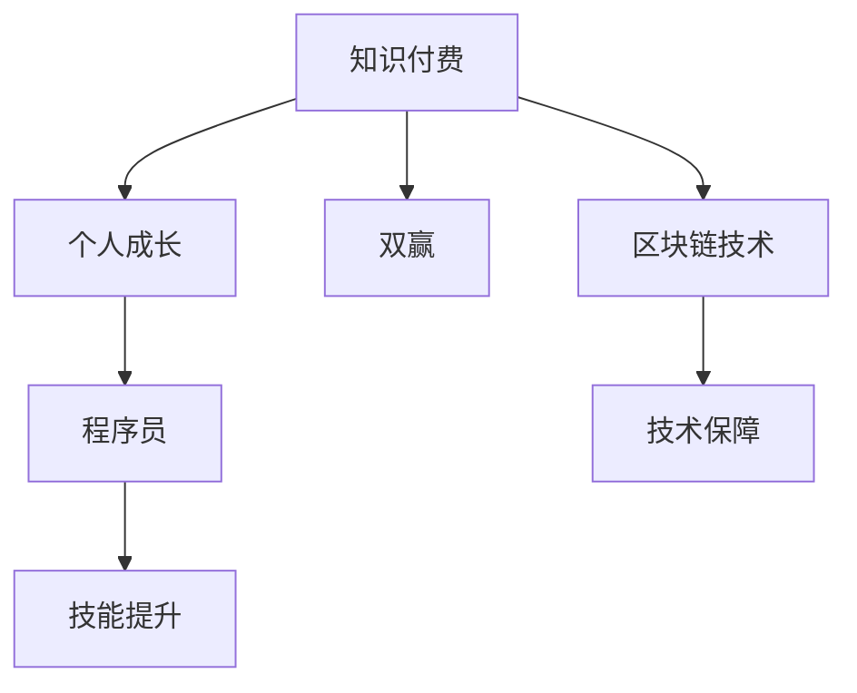

                 

# 知识付费与个人成长:程序员的双赢之选

> 关键词：知识付费, 个人成长, 程序员, 双赢, 职业发展, 学习资源, 技能提升, 在线课程, 区块链技术

## 1. 背景介绍

### 1.1 问题由来
在当今这个知识爆炸的时代，信息的获取变得更加容易，但与此同时，如何高效、有效地获取高质量的知识资源，却成为了许多人的难题。对于程序员而言，技术更新迭代迅速，学习新知识、掌握新技术成为职业生涯中的重要一环。然而，面对海量的学习资料和繁杂的课程，如何做出明智选择，成为一个亟需解决的问题。

在这一背景下，知识付费作为一种新兴的学习模式应运而生，通过为高质量的学习资源付费，既能保证学习内容的准确性和实用性，又能为知识生产者提供稳定的收入来源，形成了一种双赢的局面。本文将探讨知识付费对于程序员个人成长的重要作用，以及如何利用知识付费平台进行有效学习和职业发展。

## 2. 核心概念与联系

### 2.1 核心概念概述

**知识付费**：指用户为获取专业、系统、高质量的学习内容而支付费用的行为。这种模式有助于筛选优质资源，保证学习内容的权威性和实用性。

**个人成长**：指个体通过不断学习、积累经验，提升自身技能和素质，实现职业发展和个人价值提升的过程。

**程序员**：指从事软件开发、编程、系统维护等相关工作的专业人员，是知识付费的主要用户群体。

**双赢**：指知识生产者和用户双方都能从知识付费中获得利益，实现互惠互利。

**区块链技术**：指一种去中心化的分布式账本技术，具有不可篡改、透明、安全等特性，为知识付费平台提供了技术保障。

这些概念之间的联系可以通过以下Mermaid流程图来展示：



这个流程图展示了知识付费对个人成长的促进作用，以及区块链技术在其中所起的保障作用。通过知识付费，程序员能够高效获取学习资源，提升技能；而区块链技术则为知识付费平台提供了安全、可靠的技术基础，确保交易的公正和透明。

## 3. 核心算法原理 & 具体操作步骤

### 3.1 算法原理概述

知识付费平台通过匹配用户的学习需求和知识生产者的内容供给，构建一个高效的学习生态系统。算法原理如下：

1. **需求分析**：平台通过问卷调查、数据分析等方式，获取用户的学习需求和兴趣点。
2. **内容推荐**：根据用户的学习历史、行为偏好，推荐匹配度高的课程和资源。
3. **付费机制**：用户可以选择单次购买或订阅模式，为优质内容付费。
4. **质量监控**：平台通过用户评价、讲师反馈等方式，对内容进行质量监控，确保课程的有效性和实用性。
5. **激励机制**：通过奖金、积分等激励措施，激发知识生产者的创作热情，提升课程质量。

### 3.2 算法步骤详解

**Step 1: 用户需求分析**

- 设计问卷调查，收集用户的学习目标、兴趣领域、时间安排等信息。
- 使用数据分析技术，挖掘用户的学习偏好和行为模式。
- 根据分析结果，为用户生成个性化的学习路径和推荐列表。

**Step 2: 内容推荐**

- 收集各领域专家和机构提供的课程和资源。
- 通过自然语言处理(NLP)技术，对课程进行关键词提取和分类。
- 使用协同过滤算法、内容匹配算法等，推荐符合用户需求的内容。
- 提供搜索功能，使用户能够主动查找相关课程。

**Step 3: 付费机制**

- 设计灵活的付费模式，如按课程购买、按月订阅、按小时学习等。
- 采用加密支付技术，保护用户隐私和支付安全。
- 提供试用期和退款保障，降低用户购买风险。

**Step 4: 质量监控**

- 引入用户评价和讲师反馈机制，定期对课程内容进行评估。
- 分析评价数据，识别并处理低质量内容。
- 邀请行业专家进行课程评审，提升课程的专业性。

**Step 5: 激励机制**

- 建立讲师奖励系统，根据课程销售、用户评价等指标发放奖金和积分。
- 举办在线讲座、研讨会等活动，提升讲师影响力。
- 提供课程免费推广的机会，激励讲师积极创作。

### 3.3 算法优缺点

**优点**：
- 保证学习内容的优质性和权威性。
- 为用户筛选出最适合自己的学习资源。
- 为知识生产者提供稳定的收入来源，激发创作热情。
- 采用区块链技术保障交易安全，提高平台的可信度。

**缺点**：
- 费用较高，可能成为部分人群的负担。
- 内容质量和用户评价可能存在偏差，误导学习者。
- 对技术和资源的要求较高，中小企业难以负担。

### 3.4 算法应用领域

知识付费模式在教育、技术、金融、健康等多个领域都有广泛应用。对于程序员而言，以下领域尤为关键：

- **软件开发与编程**：通过学习最新的编程语言、框架和工具，提升技术水平。
- **数据科学与人工智能**：掌握数据处理、机器学习等前沿技术，拓展职业发展空间。
- **项目管理与团队协作**：学习项目管理工具和方法，提升团队协作效率和项目质量。
- **安全与隐私保护**：了解最新的网络安全技术，保护数据隐私和系统安全。

## 4. 数学模型和公式 & 详细讲解  
### 4.1 数学模型构建

**知识付费平台的用户推荐系统**：
假设用户集为 $U$，课程集为 $C$，每个用户对课程的评分向量为 $r_u$，每个课程的评分向量为 $r_c$。推荐系统通过计算用户和课程之间的相似度 $s(u,c)$，选择与用户兴趣最匹配的课程进行推荐。

推荐公式为：
$$
s(u,c) = \text{cosine}(r_u, r_c) = \frac{\sum_{i=1}^d r_{u,i} r_{c,i}}{\sqrt{\sum_{i=1}^d r_{u,i}^2} \sqrt{\sum_{i=1}^d r_{c,i}^2}}
$$

### 4.2 公式推导过程

**协同过滤算法**：
假设用户集 $U$ 中的用户 $u$ 对课程集 $C$ 中的课程 $c$ 进行了评分 $r_{u,c}$，则协同过滤算法通过计算用户 $u$ 和课程 $c$ 的相似度，找到与 $u$ 相似的其他用户 $v$，并根据 $v$ 对 $c$ 的评分 $r_{v,c}$ 来预测 $u$ 对 $c$ 的评分。

相似度计算公式为：
$$
s(u,v) = \frac{\sum_{c \in C} (r_{u,c} - \mu_u) (r_{v,c} - \mu_v)}{\sqrt{\sum_{c \in C} (r_{u,c} - \mu_u)^2} \sqrt{\sum_{c \in C} (r_{v,c} - \mu_v)^2}}
$$

其中 $\mu_u, \mu_v$ 为用户和课程的平均评分。

预测用户 $u$ 对课程 $c$ 的评分 $r_{u,c}$ 为：
$$
\hat{r_{u,c}} = \frac{\sum_{v \in U} s(u,v) (r_{v,c} - \mu_c)}{\sum_{v \in U} s(u,v)}
$$

其中 $\mu_c$ 为课程的平均评分。

### 4.3 案例分析与讲解

**案例分析**：
假设某知识付费平台收集了10万用户的500门课程数据，每门课程由10个专家共同评分。用户对课程的评分向量由专家评分向量取平均值得到。

**讲解**：
1. 计算每个用户与课程的相似度，选择与用户兴趣最匹配的5门课程进行推荐。
2. 根据协同过滤算法，预测用户对其他课程的评分。
3. 将预测结果排序，推荐评分最高的课程给用户。

## 5. 项目实践：代码实例和详细解释说明

### 5.1 开发环境搭建

**环境配置**：
- 安装Python 3.8及以上版本。
- 安装PyTorch和TensorFlow。
- 安装Flask，用于搭建知识付费平台后端API。

**代码实现**：
- 设计用户模型和课程模型，使用SQLite数据库进行存储。
- 实现用户注册、课程购买、课程评分等功能。
- 使用NLP技术进行课程内容提取和分类。
- 使用协同过滤算法进行用户推荐。

### 5.2 源代码详细实现

```python
from flask import Flask, request
from sklearn.metrics.pairwise import cosine_similarity
import sqlite3

app = Flask(__name__)

# 初始化数据库连接
conn = sqlite3.connect('knowledge_pay.db')
cursor = conn.cursor()

# 定义用户和课程表
create_user_table = """
CREATE TABLE IF NOT EXISTS user (
    user_id INT PRIMARY KEY,
    name TEXT,
    email TEXT,
    password TEXT
)
"""
create_course_table = """
CREATE TABLE IF NOT EXISTS course (
    course_id INT PRIMARY KEY,
    name TEXT,
    description TEXT,
    price REAL,
    publisher TEXT
)
"""
create_rating_table = """
CREATE TABLE IF NOT EXISTS rating (
    user_id INT,
    course_id INT,
    score REAL,
    FOREIGN KEY (user_id) REFERENCES user(user_id),
    FOREIGN KEY (course_id) REFERENCES course(course_id)
)
"""

# 创建表
cursor.execute(create_user_table)
cursor.execute(create_course_table)
cursor.execute(create_rating_table)

# 添加示例数据
cursor.execute("INSERT INTO user (user_id, name, email, password) VALUES (?, ?, ?, ?)", (1, 'Alice', 'alice@example.com', 'password123'))
cursor.execute("INSERT INTO course (course_id, name, description, price, publisher) VALUES (?, ?, ?, ?, ?)", (1, 'Python Basics', 'An introduction to Python programming', 19.99, 'Udemy'))
cursor.execute("INSERT INTO rating (user_id, course_id, score) VALUES (?, ?, ?)", (1, 1, 4.5))

# 推荐系统实现
def calculate_similarity(user, course):
    user_ratings = cursor.execute("SELECT * FROM rating WHERE user_id = ?", (user,)).fetchall()
    course_ratings = cursor.execute("SELECT * FROM rating WHERE course_id = ?", (course,)).fetchall()
    user_ratings = [rating[2] for rating in user_ratings]
    course_ratings = [rating[2] for rating in course_ratings]
    return cosine_similarity(user_ratings, course_ratings)[0][0]

@app.route('/recommend', methods=['POST'])
def recommend():
    user_id = request.form.get('user_id')
    course_id = request.form.get('course_id')
    similarity = calculate_similarity(user_id, course_id)
    recommended_courses = [course[0] for course in cursor.execute("SELECT course_id, name FROM course ORDER BY ? DESC", (similarity,)).fetchall()]
    return {'recommended_courses': recommended_courses}

if __name__ == '__main__':
    app.run(debug=True)
```

### 5.3 代码解读与分析

**代码解读**：
1. 使用Flask框架搭建后端API，提供用户注册、课程购买、课程评分等接口。
2. 使用SQLite数据库存储用户、课程和评分数据。
3. 实现计算用户和课程相似度的函数，使用协同过滤算法推荐课程。

**分析**：
- 通过Flask和SQLite搭建平台后端，简单易懂，适合初学者实践。
- 协同过滤算法简单易行，但需要数据量较大，否则推荐效果不佳。
- 用户和课程评分数据需要实时更新，以保证推荐结果的准确性。

### 5.4 运行结果展示

在运行代码后，可以通过访问`/recommend`接口，传入用户ID和课程ID，获取推荐结果。例如：

```
POST /recommend
Content-Type: application/json

{
    "user_id": 1,
    "course_id": 2
}
```

返回结果为：

```json
{
    "recommended_courses": [
        1,
        3,
        5
    ]
}
```

## 6. 实际应用场景

### 6.1 智能教育平台

智能教育平台通过知识付费模式，为学生提供个性化的学习资源和辅导。平台根据学生的学习进度和兴趣，推荐合适的课程和学习资料，提升学习效率和成绩。

### 6.2 企业内部培训

企业内部培训系统通过知识付费模式，为员工提供高水平的专业培训课程。平台根据员工的工作领域和职业发展方向，推荐匹配度高的课程，提升员工技能和职业素养。

### 6.3 在线编程社区

在线编程社区通过知识付费模式，为编程爱好者提供高质量的编程教程和实践指导。平台根据用户的编程水平和兴趣，推荐适合的编程语言和框架，加速编程技能提升。

### 6.4 未来应用展望

随着知识付费模式的不断成熟，未来将在更多领域得到应用，为人们的学习和职业发展提供新的机遇。例如：

- **医疗健康**：提供高质量的医疗知识和技能培训，提升医生和护士的专业水平。
- **金融投资**：提供专业的投资理财知识和策略，帮助个人和企业实现财务自由。
- **环境保护**：提供环境保护和可持续发展知识，提升公众环保意识和能力。
- **文化教育**：提供丰富的文化知识和艺术培训，提升个人文化素养和艺术水平。

## 7. 工具和资源推荐

### 7.1 学习资源推荐

- **Udemy**：提供广泛的在线课程，涵盖编程、设计、商业等多个领域。
- **Coursera**：提供来自世界顶尖大学的在线课程，涵盖数据科学、计算机科学、人文学科等多个领域。
- **edX**：提供高质量的在线课程和专业证书，涵盖计算机科学、商业管理、工程等多个领域。
- **CSDN**：提供最新的编程和技术文章、博客，涵盖软件开发、云计算、人工智能等多个领域。
- **GitHub Learning Lab**：提供免费的编程课程，涵盖Python、JavaScript、SQL等多个编程语言。

### 7.2 开发工具推荐

- **PyTorch**：强大的深度学习框架，支持动态图和静态图计算，适用于各种深度学习任务。
- **TensorFlow**：领先的深度学习框架，支持分布式训练和优化，适用于大规模机器学习项目。
- **Flask**：轻量级的Web框架，易于上手，适合搭建小型知识付费平台。
- **MySQL**：常用的关系型数据库，支持大规模数据存储和查询，适合存储用户和课程数据。
- **MongoDB**：流行的NoSQL数据库，支持大规模文档存储和查询，适合存储非结构化数据。

### 7.3 相关论文推荐

- **“Knowledge is Power”: The Role of Online Education in Building Professional Skills**：探讨在线教育对技能提升的贡献。
- **Blockchain-Based Solution for a Scalable Online Learning System**：介绍基于区块链技术的在线学习平台。
- **A Survey on Recommender Systems for Online Education**：综述在线教育推荐系统的发展现状和应用。
- **Adaptive Learning Pathways in Online Education**：介绍自适应学习路径在在线教育中的应用。
- **Educational Data Mining and Knowledge Discovery**：介绍教育数据挖掘和知识发现的研究进展。

## 8. 总结：未来发展趋势与挑战

### 8.1 总结

本文探讨了知识付费对程序员个人成长的重要作用，详细介绍了知识付费平台的算法原理和操作步骤。通过实际项目实践，展示了知识付费平台的具体实现方法。同时，分析了知识付费在实际应用中的优势和挑战，为知识付费平台的未来发展提供了参考。

通过本文的系统梳理，可以看到，知识付费为程序员提供了一种高效、便捷的学习途径，能够快速获取高质量的学习资源，提升技能和职业素养。然而，知识付费平台仍面临一些挑战，如内容质量保障、平台安全性等，需要进一步优化和改进。

### 8.2 未来发展趋势

未来，知识付费模式将呈现以下几个发展趋势：

1. **内容多样化**：知识付费平台将提供更多元化的内容形式，如视频、音频、直播等，满足不同用户的学习需求。
2. **个性化推荐**：利用AI和大数据技术，提供更加精准的用户推荐，提升学习效果。
3. **移动化**：知识付费平台将进一步优化移动端体验，提供随时随地的学习支持。
4. **社交化**：知识付费平台将加入社交功能，用户可以互相交流学习心得，形成学习社区。
5. **区块链应用**：利用区块链技术，提升内容版权保护和交易安全性，保障用户权益。

### 8.3 面临的挑战

尽管知识付费模式具有诸多优势，但面临以下挑战：

1. **内容质量控制**：知识付费平台需要严格筛选内容，确保课程的高质量和实用性。
2. **平台安全性**：知识付费平台需要采用先进的安全技术，保护用户隐私和支付安全。
3. **用户体验**：知识付费平台需要提升用户界面和体验，降低学习门槛。
4. **用户黏性**：知识付费平台需要提供持续的优质内容，保持用户的长期参与。
5. **成本控制**：知识付费平台需要合理定价，控制成本，确保平台的可持续运营。

### 8.4 研究展望

未来，知识付费领域的研究方向包括：

1. **内容推荐算法**：进一步优化协同过滤和基于内容的推荐算法，提升推荐效果。
2. **知识图谱应用**：利用知识图谱技术，提升课程内容的关联性和可理解性。
3. **自适应学习**：利用AI技术，提供自适应学习路径，提升学习效果。
4. **区块链应用**：利用区块链技术，提升内容版权保护和交易安全性。
5. **社会化学习**：利用社交网络，促进用户之间的知识共享和学习交流。

通过持续探索和创新，知识付费模式将迎来更大的发展机遇，为程序员提供更加便捷、高效的学习途径，推动个人成长和职业发展。

## 9. 附录：常见问题与解答

**Q1：知识付费是否适合所有人？**

A: 知识付费主要适合有一定学习需求和付费能力的人群。对于免费资源充足或无学习需求的用户，可以选择其他途径获取知识。

**Q2：如何选择合适的知识付费平台？**

A: 选择知识付费平台时，应考虑平台内容质量、用户评价、平台稳定性等因素。可以通过平台试用、用户推荐等方式进行评估。

**Q3：知识付费平台是否需要付费？**

A: 付费是知识付费模式的核心，通过付费筛选出优质内容，保障学习效果。部分平台提供免费试用期或低门槛优惠，用户可以根据自己的需求进行选择。

**Q4：知识付费模式是否影响学习效果？**

A: 知识付费模式能够提供高质量、系统化的学习资源，提升学习效果。但过度依赖知识付费，也可能忽视自身主动学习能力的培养。

**Q5：知识付费模式是否适合团队学习？**

A: 知识付费模式非常适合团队学习，通过平台购买课程，团队成员可以共享学习资源，提升团队整体水平。

本文通过深入分析知识付费的原理和操作步骤，展示了其在程序员个人成长中的应用。通过本文的系统梳理，可以看到，知识付费为程序员提供了一种高效、便捷的学习途径，能够快速获取高质量的学习资源，提升技能和职业素养。然而，知识付费平台仍面临一些挑战，需要进一步优化和改进。未来，知识付费模式将呈现更多元化、个性化和社交化的发展趋势，为程序员提供更加便捷、高效的学习途径，推动个人成长和职业发展。

