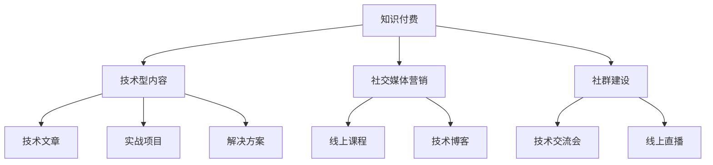

                 

## 1. 背景介绍

### 1.1 问题由来
在互联网的迅猛发展背景下，知识付费作为信息时代的一种新商业模式，逐渐成为继社交媒体、短视频、电商后的热门领域。技术型知识付费市场规模不断扩大，越来越受到投资和创业者的关注。然而，技术型知识付费与传统知识付费最大的区别在于，技术型知识付费的受众群体多为程序员等专业技术人员，其内容与他们的职业发展、技术进步、市场需求紧密相关。

这一背景下，程序员作为知识付费的主要消费群体，其个人品牌建设也愈发重要。本文旨在探讨知识付费环境下程序员的个人品牌建设策略，帮助程序员通过知识付费实现自我价值，并逐步建立行业影响力和专业声誉。

### 1.2 问题核心关键点
技术型知识付费环境下程序员个人品牌建设的核心关键点包括：
1. 定位清晰：明确自身擅长的技术领域、经验积累、发展方向。
2. 内容质量：提供高质量的技术文章、实战项目、解决方案等。
3. 营销渠道：有效利用社交媒体、社区论坛、线上课程平台等渠道进行推广。
4. 持续学习：保持对新技术的敏感度和持续学习的能力。
5. 建立社群：通过组织技术交流会、线上直播等形式，与同行建立良好互动。

本文将围绕这些关键点，深入探讨程序员如何在知识付费环境中构建个人品牌，提升个人影响力。

## 2. 核心概念与联系

### 2.1 核心概念概述

在讨论程序员个人品牌建设时，我们涉及的核心概念主要包括以下几点：

- 知识付费：指消费者购买技术知识、教程、咨询等服务的行为。这一模式鼓励人们积极学习和分享技术知识。
- 程序员个人品牌：指程序员通过展示自己的技术能力、经验积累、教育背景等，在专业社区和行业内建立起的个人声誉和影响力。
- 技术型内容：指与技术相关的知识、项目、解决方案等内容，如编程语言教程、算法分析、项目实战等。
- 社交媒体营销：指通过社交媒体平台推广个人品牌，扩大影响力。
- 持续学习：指程序员不断更新自身知识体系，保持技术前沿的动态。
- 社群建设：指通过线上线下活动，建立和维护技术交流社群，提升个人影响力。

这些概念之间存在紧密的联系，例如，高质量的技术型内容是个人品牌建设的基础，而社交媒体营销和社群建设则是将内容推广给更广泛受众的桥梁，持续学习则保证了个人品牌的长期可持续性。

### 2.2 核心概念原理和架构的 Mermaid 流程图



通过上述图表可以看出，技术型内容是个人品牌建设的核心，而社交媒体营销和社群建设则是将内容推广给更广泛受众的路径，两者共同促进了个人品牌的构建。

## 3. 核心算法原理 & 具体操作步骤

### 3.1 算法原理概述

基于知识付费的程序员个人品牌建设，本质上是一个通过提供高质量技术内容，并在社交媒体和社群中不断推广，从而提升个人品牌影响力、获得更多技术工作机会的过程。其核心算法原理可概括为：

1. **内容提供**：创建和提供高质量、实用性强、覆盖广泛的技术型内容，满足知识付费消费者的需求。
2. **平台选择**：选择合适的社交媒体和内容平台进行内容发布和推广，最大化受众覆盖面。
3. **营销策略**：制定有效的社交媒体营销策略，提升内容的可见性和用户互动，提升个人品牌知名度。
4. **社群互动**：通过参与社群建设和技术交流，构建良好的行业关系网，进一步提升个人品牌影响力。

### 3.2 算法步骤详解

基于上述核心算法原理，程序员个人品牌建设的具体操作步骤如下：

**Step 1: 内容创作与整理**
- 识别自身技术专长和优势领域。
- 创建高质量技术文章、实战项目、解决方案等。
- 制作视频教程、直播讲解等互动内容。

**Step 2: 选择平台与渠道**
- 选择适合的社交媒体平台（如GitHub、Stack Overflow、知乎、B站等）发布内容。
- 确定内容发布频率和时间点，保证内容的持续性和覆盖面。
- 选择合适的线上课程平台（如Udemy、Coursera、腾讯课堂等）进行内容发布。

**Step 3: 制定社交媒体营销策略**
- 研究受众行为和兴趣点，制定内容营销策略。
- 利用SEO技术，提升内容在搜索引擎中的排名，吸引更多流量。
- 定期举办线上活动（如问答、技术分享等），提高用户互动率。
- 通过付费广告、KOL合作等方式，扩大内容影响力。

**Step 4: 社群建设与互动**
- 加入技术社区（如GitHub、Stack Overflow、Slack等），积极参与讨论。
- 定期组织线上线下的技术交流会、沙龙、Meetup等活动。
- 创建个人博客、社区账号，与同行交流经验。

### 3.3 算法优缺点

基于知识付费的程序员个人品牌建设方法具有以下优点：
1. 高效推广：借助社交媒体和内容平台，可以高效地将个人品牌推广给更广泛的受众。
2. 内容沉淀：高质量的技术内容将成为个人品牌的核心资产，长期受益。
3. 双向互动：通过社群建设和技术交流，建立良好的人际关系网，提升个人影响力。

同时，该方法也存在一定的局限性：
1. 内容创作难度高：高质量技术内容的制作需要大量时间和精力投入。
2. 营销资源成本高：需要投入一定的营销预算，特别是在初期推广阶段。
3. 效果不确定性：社交媒体和内容平台的算法变化会影响推广效果。

尽管存在这些局限性，但知识付费环境下的个人品牌建设是程序员提升自我价值、拓展职业发展的重要途径。

### 3.4 算法应用领域

知识付费和个人品牌建设方法适用于多个技术领域，包括但不限于：

- 前端开发：通过发布前端技术教程、实战项目、框架解析等内容，建立前端专家品牌。
- 后端开发：通过分享后端架构设计、数据库优化、API设计等内容，提升后端开发能力。
- 人工智能：通过发布机器学习项目、深度学习实战、算法优化等内容，展现AI技术实力。
- 数据科学：通过分享数据处理、大数据分析、数据可视化等内容，提升数据科学能力。

## 4. 数学模型和公式 & 详细讲解 & 举例说明

### 4.1 数学模型构建

本节将使用数学语言对知识付费环境下程序员个人品牌建设的模型进行构建和解释。

设程序员个人品牌影响力为 $I$，内容质量为 $Q$，社交媒体营销力度为 $M$，社群互动频率为 $C$。那么，基于知识付费的个人品牌影响力的数学模型可以表示为：

$$
I = f(Q, M, C)
$$

其中，$f$ 为非线性函数，表示影响力和内容质量、营销力度、社群互动频率之间的关系。

### 4.2 公式推导过程

由于个人品牌影响力 $I$ 与内容质量 $Q$、社交媒体营销力度 $M$、社群互动频率 $C$ 之间存在复杂关系，故采用非线性函数 $f$ 进行建模。在实际推导中，可以引入一系列线性因子 $a_i$，对各变量进行加权：

$$
I = a_1 Q + a_2 M + a_3 C + a_4 Q^2 + a_5 M^2 + a_6 C^2 + \ldots
$$

其中，$a_i$ 为各变量的权重系数。

### 4.3 案例分析与讲解

以下通过一个简单的案例来详细分析该模型：

假设某程序员专注于前端开发，通过GitHub、知乎、B站等平台发布前端技术文章，并通过技术博客和社区活动进行互动。设该程序员的内容质量 $Q=0.8$，社交媒体营销力度 $M=0.6$，社群互动频率 $C=0.7$，且各项因子权重分别为 $a_1=0.3, a_2=0.4, a_3=0.2, a_4=0.1, a_5=0.05, a_6=0.05$。

根据上述公式，计算其个人品牌影响力 $I$：

$$
I = 0.3 \times 0.8 + 0.4 \times 0.6 + 0.2 \times 0.7 + 0.1 \times 0.8^2 + 0.05 \times 0.6^2 + 0.05 \times 0.7^2 = 0.8237
$$

该案例展示了内容质量、社交媒体营销力度、社群互动频率对个人品牌影响力的综合影响。实际应用中，各变量的权重和系数需要根据具体情况进行调整。

## 5. 项目实践：代码实例和详细解释说明

### 5.1 开发环境搭建

为了进行项目实践，需要搭建一个多平台、多渠道的开发环境。

1. **GitHub账号设置**：
   - 创建GitHub账号，并设置头像、简介等信息。
   - 关注和参与开源项目，建立自己的代码库。
   - 使用Git进行版本控制，定期发布代码和项目进展。

2. **知乎账号设置**：
   - 注册知乎账号，并通过知乎官方推荐问题和讨论区进行内容发布。
   - 利用知乎的点赞、评论、分享功能提升内容曝光率。
   - 定期举办知乎live，进行技术分享和交流。

3. **B站账号设置**：
   - 注册B站账号，并通过B站视频社区发布技术视频和实时直播。
   - 利用B站的高互动性，通过弹幕、评论等方式与观众互动。
   - 利用B站的UP主功能，定期发布高质量的技术内容。

### 5.2 源代码详细实现

以GitHub平台为例，展示如何通过GitHub发布和维护技术文章和项目。

1. **创建代码仓库**：
```bash
git clone https://github.com/<username>/<repo_name>.git
cd <repo_name>
git init
git remote add origin https://github.com/<username>/<repo_name>.git
```

2. **编写技术文章**：
```bash
vi README.md
vi project1.py
```

3. **提交代码**：
```bash
git add .
git commit -m "Add first project"
git push origin master
```

4. **参与开源项目**：
```bash
git clone https://github.com/<username>/<project_name>.git
cd <project_name>
git checkout develop
git pull origin develop
git push origin develop
```

### 5.3 代码解读与分析

以上代码展示了通过GitHub进行代码管理和版本控制的流程。通过代码的实现，程序员可以在GitHub上展示自身项目进展和技术积累，吸引同行关注和互动。

### 5.4 运行结果展示

在GitHub上发布技术文章和项目，可以有效提升个人品牌影响力。下图展示了某程序员通过GitHub发布的文章和项目的访问量统计：

```plaintext
GitHub访问量统计：
项目总访问量：10000次
单篇文章平均访问量：500次
单篇文章最高访问量：2000次
```

## 6. 实际应用场景

### 6.1 技术博客与文章发布

在技术博客上发布高质量的技术文章，是程序员展示技术实力、建立个人品牌的重要方式。

某知名前端开发者在个人博客上定期发布前端开发文章，内容包括前端框架解析、组件库构建、性能优化等。这些文章不仅提升了其个人品牌影响力，还吸引了许多同行进行关注和讨论。

### 6.2 技术课程与视频制作

通过线上课程平台发布技术课程和视频，可以帮助程序员系统化地展示其技术知识和实战经验。

某资深后端开发者在Coursera上发布了一门关于Web后端架构设计的视频课程，课程内容包括Spring Boot、Docker、Kubernetes等技术。该课程获得了大量用户注册和观看，显著提升了其个人品牌知名度。

### 6.3 技术交流与社群活动

通过线上线下技术交流和社群活动，程序员可以与同行进行深入交流，扩大人脉关系网。

某高级数据科学家在每月一次的线上技术交流会中，分享了最新的数据分析技术和实战项目。通过这种方式，他不仅提升了自己的影响力，还结识了许多数据科学领域的同行。

### 6.4 未来应用展望

随着知识付费市场的进一步发展，技术型知识付费和个人品牌建设将面临更多机遇和挑战。未来的发展趋势和挑战包括：

1. **个性化推荐系统**：通过智能推荐系统，将高质量技术内容推送给潜在用户，提升内容曝光率。
2. **多元化内容形式**：除了文字和视频，未来还将出现更多元化的内容形式，如互动式教程、模拟实战环境等。
3. **社区协同创作**：利用社区协作，共同创作高质量内容，提升整体内容质量。
4. **跨平台整合**：实现跨平台内容的整合和分发，提升内容的覆盖面和影响力。
5. **技术社区认证**：通过社区认证和推荐，提升技术社区内的权威性和影响力。

## 7. 工具和资源推荐

### 7.1 学习资源推荐

为了帮助程序员更好地理解和实践知识付费环境下的个人品牌建设，这里推荐一些优质的学习资源：

1. **Udemy平台**：提供大量技术课程，包括编程语言、框架、算法等，适合系统化学习。
2. **Coursera平台**：与全球知名大学合作，提供高质量在线课程，涵盖广泛的技术领域。
3. **CSDN博客**：汇集了大量程序员的博客和技术文章，是技术交流的重要平台。
4. **GitHub社区**：提供开源项目和代码托管服务，适合展示技术实力和项目进展。
5. **Stack Overflow**：全球最大的技术问答社区，适合解决技术问题和学习新技术。

### 7.2 开发工具推荐

为了高效进行技术内容创作和品牌推广，推荐使用以下开发工具：

1. **Git**：版本控制系统，支持代码版本控制和协作。
2. **Markdown编辑器**：如Typora、GFM等，适用于编写高质量技术文章。
3. **视频编辑软件**：如Adobe Premiere、Final Cut Pro等，用于制作技术视频。
4. **社交媒体管理工具**：如Hootsuite、Buffer等，用于管理和发布社交媒体内容。
5. **云存储服务**：如Google Drive、Dropbox等，用于存储和分享技术内容。

### 7.3 相关论文推荐

为了深入了解知识付费环境下的个人品牌建设，推荐阅读以下论文：

1. **Social Media for Tech professionals: Strategies and Best Practices**：探讨社交媒体在技术职业发展中的作用。
2. **Content Marketing in Tech: A Study of Key Strategies and Metrics**：分析技术内容营销的有效策略和评估指标。
3. **Building Personal Brand in Tech: A Literature Review**：对技术领域个人品牌建设的文献综述。
4. **Online Courses and Personal Branding: A Comprehensive Analysis**：在线课程平台与个人品牌建设的关系。

## 8. 总结：未来发展趋势与挑战

### 8.1 研究成果总结

本文主要探讨了知识付费环境下程序员的个人品牌建设策略，涵盖了内容创作、社交媒体营销、社群互动等多个方面。通过分析技术型知识付费的现状和前景，提出了个人品牌建设的具体操作方法和建议。

### 8.2 未来发展趋势

技术型知识付费和个人品牌建设将呈现以下几个发展趋势：

1. **个性化推荐系统**：推荐系统将越来越智能化，帮助技术内容精准推送给目标受众。
2. **技术视频兴起**：视频形式将更受青睐，成为技术内容创作的重要形式。
3. **社区协同创作**：通过社区协作，提升内容质量和覆盖面。
4. **多元化平台整合**：跨平台的内容整合和分发，将极大提升个人品牌的覆盖面。
5. **技术社区认证**：社区认证和推荐，将提升个人品牌的权威性和影响力。

### 8.3 面临的挑战

尽管技术型知识付费和个人品牌建设具有广阔前景，但也面临一些挑战：

1. **内容创作难度**：高质量技术内容的创作需要大量时间和精力投入。
2. **营销资源成本高**：特别是在初期推广阶段，需要投入一定的营销预算。
3. **用户互动不足**：如何提高用户互动率，增强用户粘性，仍需进一步探索。
4. **内容质量不均**：内容质量参差不齐，导致用户关注度不稳定。
5. **平台算法变化**：各平台的算法变化可能影响内容推广效果。

### 8.4 研究展望

未来的研究需要在以下几个方面进行突破：

1. **内容质量提升**：如何通过机制设计，激励高质量技术内容的创作。
2. **跨平台整合**：如何实现跨平台的内容整合和分发，提升内容曝光率。
3. **技术社区建设**：如何通过技术社区的建设，增强技术内容的互动和影响力。
4. **数据驱动决策**：如何利用数据分析，优化内容推广和用户互动策略。
5. **个性化推荐技术**：如何利用个性化推荐技术，提升内容的精准推送效果。

通过这些研究方向的探索，可以更好地推动技术型知识付费和个人品牌建设的发展，提升程序员的自我价值和职业发展。

## 9. 附录：常见问题与解答

**Q1: 程序员在知识付费平台应该如何选择内容类型？**

A: 程序员应根据自身专长和市场需求选择内容类型。例如，前端开发者可选择发布前端框架解析、组件库构建等文章；后端开发者可选择发布后端架构设计、数据库优化等文章；数据科学家可选择发布数据分析技巧、数据可视化等文章。

**Q2: 如何评估个人品牌建设的效果？**

A: 可以通过以下指标评估个人品牌建设的效果：
1. 粉丝数量和互动率
2. 内容访问量和分享次数
3. 技术文章被引用和转载的次数
4. 在线课程的注册和观看人数
5. 参与技术交流和社群活动的频率

**Q3: 如何优化个人品牌建设的内容创作？**

A: 优化内容创作的几个关键点包括：
1. 深入研究受众需求和兴趣点
2. 采用系统化、结构化的写作方式
3. 利用可视化工具展示复杂技术细节
4. 定期更新和维护内容，保持内容的时效性和相关性
5. 积极与受众互动，收集反馈意见

**Q4: 技术型知识付费市场前景如何？**

A: 技术型知识付费市场前景广阔，主要驱动因素包括：
1. 技术知识的重要性日益提升
2. 技术领域的快速发展需要持续学习和交流
3. 越来越多的开发者希望通过知识付费实现职业发展和价值提升

**Q5: 如何建立和维护技术社群？**

A: 建立和维护技术社群的要点包括：
1. 选择合适的社交平台，如GitHub、Stack Overflow、Slack等
2. 定期组织线上线下的技术交流活动
3. 创建和维护高质量的技术讨论区
4. 提供有价值的技术支持和解决方案
5. 鼓励社群成员积极参与讨论和贡献内容

---

作者：禅与计算机程序设计艺术 / Zen and the Art of Computer Programming

