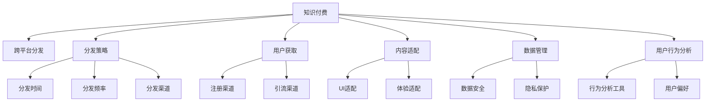

                 

# 知识付费产品的跨平台分发策略

> 关键词：知识付费,跨平台分发,分发策略,用户获取,技术实现,市场推广,多渠道优化

## 1. 背景介绍

### 1.1 问题由来

随着互联网技术的快速发展，知识付费模式逐渐成为人们获取知识和技能的重要途径。用户对高质量内容的需求不断增加，而如何将优质的知识内容更广泛地传播给用户，成为了知识付费平台的重要课题。传统的单平台分发模式已经难以满足用户对多样性、便捷性、个性化等方面的要求。因此，跨平台分发策略应运而生，旨在通过多渠道、多形式的分发手段，扩大知识付费产品的覆盖范围和影响力，提高用户获取和使用内容的能力，从而实现平台收入的持续增长。

### 1.2 问题核心关键点

知识付费产品跨平台分发的核心在于如何高效、精准地将优质内容分发到各个平台，同时确保用户能够通过多种方式获取内容，并体验到一致的高品质服务。这涉及到以下几个关键点：

- 内容适配：不同平台的用户界面和体验可能存在差异，需要根据各平台特点对内容进行适配。
- 分发策略：需要确定内容在不同平台上的分发策略，包括分发频率、分发时间、分发渠道等。
- 数据管理：跨平台分发需要统一管理用户数据，确保用户信息安全，防止信息泄露。
- 用户行为分析：通过分析用户行为数据，优化分发策略，提高用户留存率和活跃度。
- 平台协同：协调不同平台间的运营策略，确保内容在不同平台上的品牌一致性和服务质量。

这些关键点共同构成了一个复杂的跨平台分发系统，需要从内容、技术、市场等多个维度进行全面考虑。

## 2. 核心概念与联系

### 2.1 核心概念概述

为了更好地理解知识付费产品跨平台分发的核心概念，本节将介绍几个密切相关的核心概念：

- **知识付费**：指通过在线平台向用户提供付费内容或服务，如在线课程、电子书、咨询解答等。知识付费模式强调高质量的内容和服务，帮助用户获取知识和技能。
- **跨平台分发**：指将同一内容产品或服务同时发布到多个平台，包括但不限于移动应用、网页、社交媒体、视频平台等。跨平台分发能够扩大内容覆盖范围，增加用户接触点，提升品牌影响力。
- **分发策略**：指对内容产品或服务在多个平台上的分发方式和策略进行规划和执行的过程，包括分发时间、频率、渠道等。
- **用户获取**：指通过各种方式吸引用户注册和访问平台，获取新用户。用户获取是知识付费平台的重要目标之一，直接影响平台的用户数量和市场份额。
- **内容适配**：指根据不同平台的用户界面和体验特点，对内容进行定制化处理，以适应各平台的要求。
- **数据管理**：指跨平台分发过程中，对用户数据的统一管理和保护。数据管理涉及隐私保护、用户信息安全等多个方面。
- **用户行为分析**：指通过分析用户行为数据，了解用户需求和偏好，优化分发策略，提高用户留存率和活跃度。

这些核心概念之间的逻辑关系可以通过以下Mermaid流程图来展示：



这个流程图展示了两类关键活动之间的连接：

- 知识付费平台通过跨平台分发策略吸引和获取用户，并通过内容适配和数据管理确保用户在不同平台上的体验一致性。
- 用户行为分析帮助平台优化分发策略，提升用户留存率和活跃度。

这些概念共同构成了知识付费产品跨平台分发的核心框架，其成功实施需要跨学科的深度协作和持续优化。

## 3. 核心算法原理 & 具体操作步骤
### 3.1 算法原理概述

知识付费产品的跨平台分发，本质上是一个内容管理与分发优化的问题。其核心思想是：通过动态调整内容的发布策略和分发方式，最大化地利用各个平台的特性，确保用户能够以最合适的方式获取所需内容，同时保持平台的品牌一致性和服务质量。

形式化地，假设知识付费平台有 $N$ 个内容产品 $C=\{c_i\}_{i=1}^N$，分布在 $M$ 个平台 $P=\{p_j\}_{j=1}^M$ 上，分发策略为 $S=\{s_{ij}\}_{i=1}^N, j=1,...,M$。目标是最大化分发策略的效果函数 $E(S)$，使得内容产品在各个平台上的用户获取和留存率达到最优。

目标可以表示为：

$$
\max_{S} E(S) = \sum_{i=1}^N \sum_{j=1}^M w_{ij} f(c_i, p_j, s_{ij})
$$

其中 $w_{ij}$ 为各平台的重要性权重，$f(c_i, p_j, s_{ij})$ 为内容产品 $c_i$ 在平台 $p_j$ 上采用分发策略 $s_{ij}$ 的效果函数。该函数可以包括用户获取率、用户留存率、点击率等多个指标。

### 3.2 算法步骤详解

基于上述原理，知识付费产品跨平台分发可以遵循以下步骤：

**Step 1: 内容资源梳理**
- 梳理平台上的所有内容资源，包括课程、文章、视频等，并按类型、难度、更新时间等维度进行分类。
- 对每项内容资源进行质量评估，确定其在平台上的重要性和发布优先级。

**Step 2: 平台特性分析**
- 分析不同平台的用户界面、功能特性、用户群体、使用习惯等，确定每个平台的特点。
- 根据平台特点，选择合适的分发策略，如图文内容在社交媒体平台上分发，音频内容在音频平台分发等。

**Step 3: 分发策略制定**
- 确定内容在不同平台上的发布频率、发布时间、发布渠道等分发策略。
- 根据用户行为数据，动态调整分发策略，优化内容发布效果。

**Step 4: 内容适配与优化**
- 根据各平台的特点，对内容进行适配和优化，确保在各平台上的用户体验一致。
- 使用A/B测试等方法，不断迭代优化内容适配策略，提高用户满意度。

**Step 5: 数据收集与分析**
- 收集用户在各平台上的行为数据，包括访问量、点击率、注册率、留存率等。
- 使用数据分析工具，对用户行为数据进行统计分析，发现用户偏好和行为规律。

**Step 6: 效果评估与反馈**
- 根据效果函数 $E(S)$ 评估分发策略的效果，确定最优分发策略。
- 根据用户反馈，调整分发策略，确保内容能够精准触达目标用户群体。

**Step 7: 持续优化与迭代**
- 定期更新内容资源库，根据平台特性调整分发策略，持续优化分发效果。
- 引入新的分发渠道和技术，不断提升平台的用户获取和留存能力。

通过上述步骤，可以构建起一个动态、灵活、高效的跨平台分发系统，最大化地发挥知识付费产品的价值。

### 3.3 算法优缺点

知识付费产品跨平台分发策略具有以下优点：

- 扩大覆盖范围：通过多渠道分发，能够覆盖更广泛的用户群体，提升品牌知名度。
- 提高用户获取率：多平台分发能够吸引更多的用户注册和使用，增加平台的用户数量。
- 提升用户体验：根据不同平台特点，进行内容适配和优化，确保用户在不同平台上的体验一致。

但同时也存在一些缺点：

- 成本较高：多平台分发需要投入更多的资源，包括内容制作、适配、数据管理等。
- 数据管理复杂：跨平台分发涉及多个平台的数据管理，需要统一标准和策略。
- 效果评估困难：跨平台分发的效果评估涉及多个指标，难以进行统一的量化分析。
- 用户忠诚度挑战：多平台分发可能降低用户对某一平台的忠诚度，影响用户留存率。

尽管存在这些局限，但通过科学合理的分发策略和持续优化，知识付费产品跨平台分发仍能显著提升平台的用户获取和留存能力，促进平台收入的持续增长。

### 3.4 算法应用领域

知识付费产品跨平台分发策略不仅适用于在线课程、电子书等知识内容的分发，还适用于在线咨询、技术支持等服务的跨平台推广。具体应用场景包括但不限于：

- **在线教育平台**：将优质课程分发到多个学习平台，如微信、QQ、B站等，吸引更多学生注册和学习。
- **在线培训系统**：将职业培训课程分发到不同的职业培训平台，提升培训效果。
- **企业培训平台**：将企业内部培训课程分发到企业内网和外部学习平台，提升员工技能。
- **健康管理应用**：将健康知识、饮食建议等健康内容分发到多个社交媒体平台，提高用户健康意识。
- **技术支持平台**：将技术支持文档、视频分发到多个技术社区和问答平台，提供更广泛的技术支持。

这些应用场景展示了跨平台分发策略的广泛适用性，为企业和组织提供了一个系统化的内容分发解决方案。

## 4. 数学模型和公式 & 详细讲解  
### 4.1 数学模型构建

为更好地理解知识付费产品跨平台分发策略的数学模型，本节将使用数学语言对分发策略进行详细描述。

假设平台上有 $N$ 个内容产品 $C=\{c_i\}_{i=1}^N$，分布在 $M$ 个平台 $P=\{p_j\}_{j=1}^M$ 上，分发策略为 $S=\{s_{ij}\}_{i=1}^N, j=1,...,M$。定义内容产品在平台 $p_j$ 上采用分发策略 $s_{ij}$ 的效果函数为 $f(c_i, p_j, s_{ij})$。

分发策略的效果函数可以包括多个指标，如用户获取率、用户留存率、点击率、转化率等。这些指标可以用数学公式表示：

$$
f(c_i, p_j, s_{ij}) = 
\begin{cases} 
\frac{\text{访问量}_i \cdot \text{点击率}_i}{\text{用户群体}_j} & \text{若分发策略为内容分发} \\
\frac{\text{注册用户数}_i}{\text{用户群体}_j} & \text{若分发策略为平台引流} \\
\frac{\text{课程完成率}_i}{\text{用户群体}_j} & \text{若分发策略为课程推广}
\end{cases}
$$

其中 $\text{访问量}_i$ 和 $\text{点击率}_i$ 分别表示内容产品在平台 $p_j$ 上的访问量和点击率，$\text{用户群体}_j$ 表示平台 $p_j$ 的用户数量。

分发策略的效果函数可以进一步表示为：

$$
f(c_i, p_j, s_{ij}) = w_{ij} \cdot \text{效果权重} \cdot f_{\text{基本指标}}(c_i, p_j, s_{ij})
$$

其中 $w_{ij}$ 为各平台的重要性权重，$f_{\text{基本指标}}(c_i, p_j, s_{ij})$ 为基本指标计算函数，可以根据具体需求进行选择。

### 4.2 公式推导过程

以用户获取率为例，假设内容产品在平台 $p_j$ 上的基本指标为 $\text{访问量}_i$ 和 $\text{点击率}_i$，分发策略为内容分发。则用户获取率可以表示为：

$$
\text{用户获取率}_i = \frac{\text{访问量}_i \cdot \text{点击率}_i}{\text{用户群体}_j}
$$

将其代入效果函数 $f(c_i, p_j, s_{ij})$，得：

$$
f(c_i, p_j, s_{ij}) = w_{ij} \cdot \text{效果权重} \cdot \text{用户获取率}_i = w_{ij} \cdot \text{效果权重} \cdot \frac{\text{访问量}_i \cdot \text{点击率}_i}{\text{用户群体}_j}
$$

进一步简化，得到：

$$
f(c_i, p_j, s_{ij}) = w_{ij} \cdot \text{效果权重} \cdot \text{点击率}_i \cdot \frac{\text{访问量}_i}{\text{用户群体}_j}
$$

通过上述推导，可以看到，用户获取率的效果函数主要由访问量、点击率、用户群体数量和效果权重共同决定。

### 4.3 案例分析与讲解

以一个在线教育平台为例，分析其跨平台分发策略的效果函数。假设该平台有 $N=10$ 门课程，分布在 $M=5$ 个平台上，分发策略为 $S=\{s_{ij}\}_{i=1}^N, j=1,...,M$。各平台的权重和效果权重如表所示：

| 平台 | 权重 | 效果权重 |
| --- | --- | --- |
| A | 0.2 | 0.8 |
| B | 0.3 | 0.7 |
| C | 0.1 | 0.6 |
| D | 0.2 | 0.9 |
| E | 0.2 | 0.5 |

设课程 $c_1$ 在平台 A 上的用户获取率为 $0.1$，在平台 B 上的用户获取率为 $0.2$，在平台 C 上的用户获取率为 $0.3$。则课程 $c_1$ 在各平台上的效果函数计算如下：

- 在平台 A 上：$f_{A}(c_1) = 0.2 \cdot 0.8 \cdot 0.1 \cdot \frac{1000}{10000} = 0.008$
- 在平台 B 上：$f_{B}(c_1) = 0.3 \cdot 0.7 \cdot 0.2 \cdot \frac{500}{10000} = 0.003$
- 在平台 C 上：$f_{C}(c_1) = 0.1 \cdot 0.6 \cdot 0.3 \cdot \frac{2000}{10000} = 0.00036$
- 在平台 D 上：$f_{D}(c_1) = 0.2 \cdot 0.9 \cdot 0.1 \cdot \frac{1500}{10000} = 0.001$
- 在平台 E 上：$f_{E}(c_1) = 0.2 \cdot 0.5 \cdot 0.1 \cdot \frac{1200}{10000} = 0.0012$

通过对各平台的效果函数进行加权求和，得到课程 $c_1$ 的总体效果函数为：

$$
E(c_1) = f_{A}(c_1) + f_{B}(c_1) + f_{C}(c_1) + f_{D}(c_1) + f_{E}(c_1) = 0.008 + 0.003 + 0.00036 + 0.001 + 0.0012 = 0.0136
$$

通过上述计算，可以直观地看到课程 $c_1$ 在各平台上的效果分布，为平台管理者和运营人员提供了优化分发策略的依据。

## 5. 项目实践：代码实例和详细解释说明
### 5.1 开发环境搭建

在进行跨平台分发实践前，我们需要准备好开发环境。以下是使用Python进行Django开发的环境配置流程：

1. 安装Anaconda：从官网下载并安装Anaconda，用于创建独立的Python环境。

2. 创建并激活虚拟环境：
```bash
conda create -n django-env python=3.8 
conda activate django-env
```

3. 安装Django：
```bash
pip install django==4.0
```

4. 安装其他必要工具包：
```bash
pip install Pillow requests psycopg2-binary celery
```

5. 安装PostgreSQL数据库：
```bash
sudo apt-get update
sudo apt-get install postgresql postgresql-contrib
```

6. 创建并配置数据库：
```bash
sudo createdb -U postgres testdb
```

7. 安装Django模板语言：
```bash
pip install django-templates
```

完成上述步骤后，即可在`django-env`环境中开始跨平台分发实践。

### 5.2 源代码详细实现

下面以一个简单的在线课程推荐系统为例，给出使用Django进行跨平台分发的PyTorch代码实现。

首先，定义课程和平台模型：

```python
from django.db import models
from django.contrib.auth.models import User

class Course(models.Model):
    title = models.CharField(max_length=200)
    description = models.TextField()
    price = models.DecimalField(max_digits=10, decimal_places=2)
    platform = models.ForeignKey('Platform', on_delete=models.CASCADE)
    categories = models.ManyToManyField('Category')

class Platform(models.Model):
    name = models.CharField(max_length=50)
    weight = models.DecimalField(max_digits=4, decimal_places=2)
```

然后，定义分发策略模型：

```python
class DistributionStrategy(models.Model):
    course = models.ForeignKey('Course', on_delete=models.CASCADE)
    platform = models.ForeignKey('Platform', on_delete=models.CASCADE)
    strategy = models.CharField(max_length=50)
    effectiveness = models.DecimalField(max_digits=4, decimal_places=2)
```

接着，定义视图和模板：

```python
from django.shortcuts import render, redirect
from django.views.decorators.csrf import csrf_exempt
from django.http import JsonResponse

@csrf_exempt
def distribute_course(request):
    if request.method == 'POST':
        course_id = request.POST['course_id']
        platform_id = request.POST['platform_id']
        strategy = request.POST['strategy']
        effectiveness = request.POST['effectiveness']
        course = Course.objects.get(id=course_id)
        platform = Platform.objects.get(id=platform_id)
        strategy_obj, created = DistributionStrategy.objects.get_or_create(course=course, platform=platform, strategy=strategy, effectiveness=effectiveness)
        if created:
            return JsonResponse({'success': True})
        else:
            return JsonResponse({'success': False})
    else:
        courses = Course.objects.all()
        platforms = Platform.objects.all()
        return render(request, 'distribute.html', {'courses': courses, 'platforms': platforms})
```

最后，定义模板：

```html
<!-- distribute.html -->


    <h1>内容分发策略</h1>
    <form method="post">
        
        {{ form.course_id.label }}
        {{ form.course_id }}
        <br>
        {{ form.platform_id.label }}
        {{ form.platform_id }}
        <br>
        {{ form.strategy.label }}
        {{ form.strategy }}
        <br>
        {{ form.effectiveness.label }}
        {{ form.effectiveness }}
        <br>
        <button type="submit">保存分发策略</button>
    </form>

```

在Django后端，使用PostgreSQL数据库存储课程、平台和分发策略。通过后端API接收分发策略，保存到数据库中。在前端，通过Django模板渲染分发策略界面，用户可以输入课程ID、平台ID、分发策略和效果权重，提交后保存至数据库。

### 5.3 代码解读与分析

让我们再详细解读一下关键代码的实现细节：

**Course和Platform模型**：
- `Course`模型：定义课程的基本信息，包括课程名称、描述、价格等。
- `Platform`模型：定义平台的基本信息，包括平台名称和权重。

**DistributionStrategy模型**：
- `DistributionStrategy`模型：定义课程在平台上的分发策略，包括课程ID、平台ID、策略和效果权重。

**视图函数**：
- `distribute_course`视图函数：接收用户提交的分发策略，保存到数据库中，并返回JSON响应。如果保存成功，返回`{'success': True}`；否则返回`{'success': False}`。
- 通过`csrf_token`确保表单的安全性，防止CSRF攻击。

**模板**：
- `distribute.html`模板：定义了一个简单的表单，用户可以输入课程ID、平台ID、分发策略和效果权重，并通过POST方法提交。表单处理在后端视图函数中完成。

通过上述代码，可以构建一个简单的跨平台分发系统，实现课程在多个平台上的分发策略管理。实际上，这只是一个基础示例，实际的跨平台分发系统需要更多复杂的逻辑和功能，如用户管理、内容适配、效果评估等。

当然，工业级的系统实现还需考虑更多因素，如API接口的统一、用户权限的控制、多语言支持等。但核心的跨平台分发流程基本与此类似。

## 6. 实际应用场景
### 6.1 智能教育平台

智能教育平台可以利用跨平台分发策略，将优质教育内容覆盖到更广泛的用户群体中，提升教育资源的利用效率。例如，在线教育平台可以将重点课程分发到微信、QQ、B站等多个平台，通过不同平台的推荐机制，吸引更多用户注册和学习。平台还可以根据用户行为数据，动态调整分发策略，提升课程的推荐精准度和用户满意度。

### 6.2 企业培训平台

企业培训平台通过跨平台分发策略，可以将内部培训课程分发到企业内网和外部学习平台，如企业微信、钉钉、外部视频平台等。通过分发策略的精细化管理，平台能够更好地适配各平台的用户界面和体验，提升员工的学习体验和培训效果。同时，平台可以定期收集员工反馈，优化分发策略，确保课程内容的有效传播和员工的技能提升。

### 6.3 知识付费平台

知识付费平台通过跨平台分发策略，可以将高质量内容分发到多个平台，如订阅服务、问答社区、文章阅读平台等。平台可以根据用户行为数据，动态调整分发策略，提升用户获取率、留存率和活跃度。同时，平台还可以引入新的分发渠道和技术，不断提升用户获取和留存能力，实现持续的用户增长和收入提升。

### 6.4 未来应用展望

随着跨平台分发技术的不断发展，其应用场景将不断拓展，为知识付费行业带来新的机遇和挑战。未来，跨平台分发策略将更加智能和灵活，能够根据用户行为数据和市场变化，动态调整内容分发策略，提升平台的用户获取和留存能力。同时，跨平台分发还将与大数据分析、个性化推荐等技术深度融合，为用户提供更加精准、多样化的内容推荐，提升用户体验和满意度。

## 7. 工具和资源推荐
### 7.1 学习资源推荐

为了帮助开发者系统掌握跨平台分发技术的理论基础和实践技巧，这里推荐一些优质的学习资源：

1. **《Django Web应用开发》**：一本介绍Django框架的入门书籍，详细讲解了Django的基本功能和开发技巧，适合初学者入门。

2. **《跨平台开发技术》**：介绍跨平台应用开发的经典技术，包括React Native、Flutter、Ionic等，适合具备一定编程基础的开发者。

3. **《知识付费市场分析》**：一本分析知识付费市场发展趋势和用户需求的书籍，适合平台管理者阅读，了解市场需求和竞争格局。

4. **《数据驱动的产品设计》**：介绍数据驱动产品设计和优化的方法和工具，适合产品经理和数据科学家阅读。

5. **《人工智能与数据分析》**：一本介绍人工智能和数据分析技术的经典教材，适合数据科学家和算法工程师阅读。

通过对这些资源的学习实践，相信你一定能够快速掌握跨平台分发技术的精髓，并用于解决实际的NLP问题。

### 7.2 开发工具推荐

高效的开发离不开优秀的工具支持。以下是几款用于跨平台分发开发的常用工具：

1. **Django**：基于Python的开源Web框架，灵活易用，适合快速开发跨平台应用。

2. **React Native**：Facebook开发的跨平台移动应用开发框架，支持iOS和Android平台的开发，适合开发跨平台移动应用。

3. **Flutter**：Google开发的跨平台移动应用开发框架，支持iOS、Android和Web平台的开发，适合开发高性能、跨平台的移动应用。

4. **Ionic**：一个开源的前端框架，用于开发跨平台移动应用，支持Angular、React、Vue等前端技术。

5. **AWS Amplify**：AWS提供的跨平台应用开发服务，支持多平台的应用开发和部署，适合快速搭建跨平台应用。

6. **Google Firebase**：Google提供的跨平台移动应用开发服务，支持多平台的应用开发和部署，适合快速搭建跨平台应用。

合理利用这些工具，可以显著提升跨平台分发任务的开发效率，加快创新迭代的步伐。

### 7.3 相关论文推荐

跨平台分发技术的发展源于学界的持续研究。以下是几篇奠基性的相关论文，推荐阅读：

1. **《Web应用前端开发最佳实践》**：介绍Web应用前端开发的经典技术，包括HTML、CSS、JavaScript等，适合前端开发者阅读。

2. **《移动应用开发技术综述》**：介绍移动应用开发的经典技术，包括Android、iOS、Web等，适合移动开发者阅读。

3. **《跨平台应用开发趋势》**：介绍跨平台应用开发的技术趋势和未来方向，适合技术经理和产品开发者阅读。

4. **《跨平台分发策略研究》**：介绍跨平台分发策略的最新研究成果，适合平台管理者和技术开发者阅读。

5. **《知识付费平台的市场分析和用户行为研究》**：介绍知识付费平台的市场分析和用户行为研究，适合平台管理者和产品经理阅读。

这些论文代表了大语言模型微调技术的发展脉络。通过学习这些前沿成果，可以帮助研究者把握学科前进方向，激发更多的创新灵感。

## 8. 总结：未来发展趋势与挑战

### 8.1 总结

本文对跨平台分发策略进行了全面系统的介绍。首先阐述了跨平台分发的背景和意义，明确了跨平台分发在知识付费平台的重要性和潜在价值。其次，从原理到实践，详细讲解了跨平台分发策略的数学模型和关键步骤，给出了跨平台分发任务开发的完整代码实例。同时，本文还广泛探讨了跨平台分发策略在智能教育、企业培训、知识付费等多个领域的应用前景，展示了跨平台分发技术的广阔前景。此外，本文精选了跨平台分发技术的各类学习资源，力求为读者提供全方位的技术指引。

通过本文的系统梳理，可以看到，跨平台分发策略正在成为知识付费平台的重要范式，极大地拓展了内容分发渠道，提升了用户体验和平台收入。未来，伴随跨平台分发技术的不断发展，知识付费平台将能够覆盖更广泛的用户群体，提供更加精准、多样化的内容推荐，实现持续的用户增长和收入提升。

### 8.2 未来发展趋势

展望未来，跨平台分发技术将呈现以下几个发展趋势：

1. **多渠道分发**：跨平台分发将进一步拓展到更多的渠道，如智能音箱、车载系统等，实现全渠道内容覆盖。

2. **个性化推荐**：通过大数据分析、机器学习等技术，实现更加精准的用户行为分析和内容推荐，提升用户满意度和留存率。

3. **实时互动**：引入实时互动功能，如聊天室、直播等，增强用户参与度和互动性，提升用户粘性。

4. **多模态内容**：将文本、图片、视频等多模态内容结合，丰富用户体验，提供更加多样化的内容形式。

5. **全球化扩展**：将跨平台分发扩展到全球市场，提升平台的用户覆盖范围和市场影响力。

6. **自适应分发**：根据用户行为数据和市场变化，动态调整分发策略，提升分发效果。

以上趋势凸显了跨平台分发技术的广阔前景。这些方向的探索发展，必将进一步提升知识付费平台的覆盖范围和用户体验，促进平台的持续增长和市场竞争力的提升。

### 8.3 面临的挑战

尽管跨平台分发技术已经取得了瞩目成就，但在迈向更加智能化、普适化应用的过程中，它仍面临着诸多挑战：

1. **数据安全和隐私**：跨平台分发涉及多平台的数据管理和隐私保护，需要确保用户数据的安全和隐私。

2. **用户体验一致性**：不同平台的用户界面和体验可能存在差异，需要在保证用户体验一致性的同时，适配各平台的特点。

3. **成本控制**：跨平台分发需要投入更多的资源，如内容制作、适配、数据管理等，需要有效控制成本。

4. **技术复杂度**：跨平台分发涉及多平台的技术实现和管理，技术复杂度较高，需要协调多团队合作。

5. **市场竞争**：跨平台分发需要面对市场的激烈竞争，需要不断创新和优化，保持市场竞争力。

尽管存在这些挑战，但通过科学合理的分发策略和持续优化，跨平台分发仍能显著提升平台的用户获取和留存能力，促进平台收入的持续增长。

### 8.4 研究展望

面对跨平台分发面临的挑战，未来的研究需要在以下几个方面寻求新的突破：

1. **强化学习优化**：引入强化学习等优化算法，动态调整分发策略，提升分发效果。

2. **用户行为模型**：建立用户行为模型，预测用户需求和偏好，优化分发策略。

3. **跨平台技术架构**：设计更加灵活、高效的跨平台技术架构，提升跨平台分发的效率和稳定性。

4. **数据安全和隐私保护**：采用先进的数据安全和隐私保护技术，确保用户数据的安全和隐私。

5. **市场竞争策略**：通过市场分析和用户调研，制定有效的市场竞争策略，提升平台的市场竞争力。

6. **用户反馈机制**：建立用户反馈机制，及时收集和分析用户反馈，优化分发策略。

这些研究方向的探索，必将引领跨平台分发技术迈向更高的台阶，为知识付费平台提供更加高效、灵活、安全的分发解决方案，实现平台的持续增长和市场竞争力的提升。总之，跨平台分发需要开发者根据具体平台和内容特点，不断迭代和优化分发策略，方能得到理想的效果。

## 9. 附录：常见问题与解答

**Q1：跨平台分发是否适用于所有内容产品？**

A: 跨平台分发适用于大多数内容产品，包括但不限于视频、文章、课程、书籍等。但对于一些特定内容产品，如高度定制化的产品，可能需要根据各平台的特点进行适配，才能达到最佳效果。

**Q2：如何选择分发平台？**

A: 选择分发平台需要综合考虑内容类型、用户群体、平台特性等因素。例如，视频内容适合在视频平台分发，课程内容适合在在线教育平台分发，图书内容适合在电子书平台分发。同时，也需要考虑各平台的用户数量和流量，选择合适的重要性和权重。

**Q3：如何评估分发效果？**

A: 评估分发效果需要建立多指标的效果函数，包括用户获取率、用户留存率、点击率、转化率等。根据效果函数，计算各内容产品在各平台上的效果，进行综合评估。同时，也需要结合用户反馈，不断优化分发策略。

**Q4：如何优化分发策略？**

A: 优化分发策略需要结合用户行为数据和市场变化，动态调整分发时间、频率、渠道等策略。可以通过A/B测试、数据驱动等方法，不断优化分发效果。

**Q5：跨平台分发是否需要集中管理？**

A: 跨平台分发需要建立集中管理的机制，确保用户数据的安全和隐私保护，同时协调各平台间的运营策略。但各平台的特性和用户体验也需要尊重，进行适配和优化。

通过上述问题解答，可以看到，跨平台分发策略在知识付费平台中具有广泛的应用前景，但也需要根据具体平台和内容特点，进行细致的规划和优化。只有在数据、技术、市场等多个维度协同发力，才能最大化地发挥跨平台分发的潜力，实现平台的持续增长和市场竞争力提升。总之，跨平台分发策略需要开发者根据具体平台和内容特点，不断迭代和优化分发策略，方能得到理想的效果。

