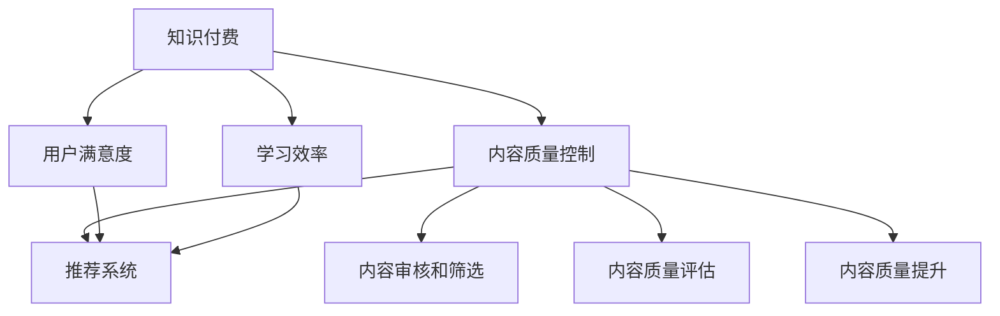

                 

# 知识付费内容的质量控制

> 关键词：知识付费, 内容质量控制, 用户满意度, 学习效率, 推荐系统

## 1. 背景介绍

随着互联网的快速发展和信息爆炸，知识付费行业蓬勃兴起。用户越来越重视高效、有价值的学习资源，希望通过付费订阅、单次购买等方式获取专属的知识内容。然而，优质的内容不仅是高质量的信息输出，还包括系统的课程结构、丰富的多媒体资源和有效的互动交流。因此，如何对知识付费内容进行全面、系统的质量控制，成为了行业内外关注的热点问题。

### 1.1 问题由来

知识付费市场发展迅猛，各大平台争相推出各类课程和订阅服务，如得到、喜马拉雅、知乎等。但与此同时，低质量内容充斥市场，用户体验参差不齐，导致许多用户流失。内容质量问题主要包括：

- **内容重复和泛泛而谈**：大量内容雷同，缺乏深度和创新。
- **教学方式单一**：仍停留在传统PPT和文字为主的教学方式，缺乏互动和实践。
- **师资力量不足**：一些平台为了节省成本，聘用非专业教师，甚至通过技术手段自动化生成内容。
- **评价体系缺失**：用户缺乏评价和反馈机制，无法有效筛选优质内容。

这些问题严重影响知识付费内容的用户满意度和学习效率，亟需一套科学、系统的质量控制机制。

### 1.2 问题核心关键点

针对知识付费内容的质量控制，本文将从以下几个关键点进行深入探讨：

- **内容质量评估指标**：构建用于衡量内容质量的全面指标体系。
- **内容审核和筛选机制**：设计自动化的审核系统，对内容进行智能筛选。
- **用户反馈和行为分析**：基于用户反馈数据，优化推荐系统和教学方法。
- **内容质量提升策略**：针对识别出的问题，制定有针对性的改进措施。

## 2. 核心概念与联系

### 2.1 核心概念概述

为更好地理解知识付费内容的质量控制，本节将介绍几个密切相关的核心概念：

- **知识付费**：指用户为获取专业知识或技能，通过付费订阅、单次购买等方式获取高质量内容的商业模式。
- **内容质量控制**：指对内容进行全面、系统的评估和优化，确保内容符合用户需求和平台标准的过程。
- **用户满意度**：用户对内容质量和服务的总体评价，反映用户对平台服务的满意度。
- **学习效率**：用户通过内容完成知识吸收和技能掌握的速度和质量，影响用户的长期价值。
- **推荐系统**：通过用户行为数据，预测用户偏好，推荐适合内容的过程，提升用户黏性和满意度。

这些核心概念之间的逻辑关系可以通过以下Mermaid流程图来展示：



这个流程图展示了这个体系的关键概念及其之间的关系：

1. 知识付费是整个体系的基础，内容质量和用户满意度直接影响平台的商业价值。
2. 内容质量控制是核心环节，通过智能筛选和优化，提升内容质量。
3. 推荐系统基于用户反馈数据，个性化推荐内容，提升用户满意度和学习效率。
4. 内容审核和筛选、内容质量评估和内容质量提升共同构成了内容质量控制的闭环，确保内容质量的持续改进。

## 3. 核心算法原理 & 具体操作步骤
### 3.1 算法原理概述

知识付费内容的质量控制是一个涉及多维度的复杂系统工程。其核心思想是通过全面、系统的质量评估，结合智能筛选和优化，最终提升内容质量和用户满意度。

具体而言，该体系包括以下几个关键步骤：

1. **内容质量评估**：构建指标体系，全面衡量内容的质量和实用性。
2. **内容审核和筛选**：设计自动化系统，对内容进行初步筛选和审核。
3. **用户反馈和行为分析**：收集用户反馈数据，优化推荐系统和教学方法。
4. **内容质量提升**：基于质量评估结果，制定有针对性的改进措施。

### 3.2 算法步骤详解

基于上述目标，本文将详细介绍各个步骤的具体操作过程。

**Step 1: 构建内容质量评估指标体系**

为了全面评估内容质量，需要构建一套多维度的指标体系。以下列举几个关键指标：

- **内容完整性**：衡量内容的完整度和逻辑结构，是否覆盖了基础知识、进阶知识和实践应用。
- **内容深度和广度**：内容是否具有深度研究、前沿知识、实际案例和跨学科应用。
- **教学方法**：内容是否结合多媒体资源、互动教学、案例分析、实际操作等多样化的教学方法。
- **师资背景**：教师是否具有相关领域的学术背景和实践经验，是否具备良好的授课风格和互动能力。
- **用户评价**：用户对内容的总体评价，包括满意度和推荐度。
- **学习效果**：用户通过内容完成的知识掌握程度和技能提升效果。

**Step 2: 设计内容审核和筛选机制**

内容审核和筛选是保证内容质量的重要环节。设计自动化的审核系统，对内容进行初步筛选和审核。具体步骤如下：

- **预审核**：通过关键词抽取和规则匹配，剔除明显的低质量和重复内容。
- **深度审核**：引入专家团队，对内容进行深度审核，识别出知识错误、逻辑漏洞、师资不足等问题。
- **多维度审核**：结合内容质量评估指标，对内容进行多维度审核，确保内容符合平台标准。

**Step 3: 收集用户反馈和行为数据**

用户反馈和行为数据是优化推荐系统和内容质量的重要依据。收集用户反馈和行为数据，包括：

- **评价数据**：用户对内容的满意度、推荐度、学习效果等反馈数据。
- **行为数据**：用户在学习过程中的点击、播放、互动、测试等行为数据。

通过分析这些数据，可以发现内容质量和用户满意度的关键问题，为内容优化提供依据。

**Step 4: 优化推荐系统和教学方法**

结合用户反馈和行为数据，优化推荐系统和教学方法，提升用户满意度和学习效率。具体步骤如下：

- **推荐算法优化**：根据用户反馈和行为数据，优化推荐算法，提高推荐精准度。
- **教学方法改进**：结合用户反馈，改进教学方法，如引入更多的互动教学、实践案例等，提升学习效果。
- **师资力量提升**：招聘或培训专业教师，提升师资质量，提升课程教学效果。

**Step 5: 内容质量提升策略**

基于内容质量评估结果，制定有针对性的改进措施，提升内容质量。具体步骤如下：

- **知识更新**：定期更新课程内容，引入最新的知识和实践案例。
- **内容迭代**：对用户反馈较多的内容进行迭代优化，提升内容的实用性和易理解性。
- **教学方法改进**：引入更多的多媒体资源和互动教学，提升教学效果。
- **师资培训**：对教师进行系统培训，提升教师的教学水平和互动能力。

### 3.3 算法优缺点

知识付费内容的质量控制体系具有以下优点：

1. **全面系统**：构建了多维度、全面系统的评估指标体系，确保内容质量全面覆盖。
2. **智能筛选**：引入自动化筛选机制，提升内容审核效率，降低人工审核成本。
3. **用户反馈**：收集用户反馈和行为数据，及时发现和解决问题，提升用户满意度。
4. **教学改进**：通过内容质量评估和优化，提升教学效果和学习效率，增强用户黏性。

同时，该体系也存在一些局限性：

1. **高成本**：自动化审核和智能筛选需要大量的技术和人力资源，成本较高。
2. **依赖用户反馈**：依赖用户反馈数据进行优化，可能存在用户反馈不足或偏差的问题。
3. **内容更新挑战**：频繁更新课程内容，需要大量资源和时间投入，难以保持及时性。
4. **技术依赖性**：自动化筛选和推荐系统依赖于技术手段，可能存在技术漏洞或误差。

尽管存在这些局限性，但就目前而言，知识付费内容的质量控制体系仍是最主流的方法，可以显著提升内容质量和用户满意度。未来相关研究的重点在于如何进一步降低成本，提高筛选和审核的准确性，增强内容的时效性和创新性。

### 3.4 算法应用领域

知识付费内容的质量控制体系已经在多个领域得到应用，涵盖了以下几个关键领域：

- **在线教育平台**：如得到、喜马拉雅、知乎等平台，通过质量控制体系提升课程内容质量，增强用户黏性。
- **专业培训课程**：如Coursera、Udacity等平台，通过质量控制体系优化课程内容，提升学习效果。
- **企业内部培训**：如腾讯、阿里巴巴等企业，通过质量控制体系提升内部培训内容质量，提升员工技能。
- **知识付费订阅**：如得到、喜马拉雅等平台，通过质量控制体系优化订阅内容，增强用户满意度。

这些领域的应用已经证明了知识付费内容质量控制体系的有效性，为知识付费行业的发展提供了重要保障。

## 4. 数学模型和公式 & 详细讲解 & 举例说明

### 4.1 数学模型构建

本节将使用数学语言对知识付费内容的质量控制体系进行更加严格的刻画。

记知识付费内容为 $C$，用户反馈为 $F$，内容质量评估指标为 $Q$，内容审核结果为 $R$，内容优化策略为 $S$。假设平台对内容进行 $n$ 次质量评估和优化，每次评估后的内容质量为 $Q_i$，每次优化后的内容质量为 $S_i$。则平台的总体质量控制过程可以表示为：

$$
Q_{i+1} = Q_i + S_i
$$

其中，$S_i$ 为第 $i$ 次优化策略对内容质量的影响。

### 4.2 公式推导过程

以下我们以用户满意度为例，推导其优化公式及其梯度计算过程。

假设平台有 $m$ 个用户，每个用户对内容的满意度为 $S_{uj}$，则总体满意度 $S$ 可以表示为：

$$
S = \frac{1}{m} \sum_{j=1}^m S_{uj}
$$

根据平台的目标函数，优化总体满意度 $S$。优化目标函数为：

$$
\max_{S_{uj}} S
$$

其梯度计算公式为：

$$
\frac{\partial S}{\partial S_{uj}} = \frac{1}{m}
$$

在得到总体满意度的梯度后，即可带入优化算法，完成总体满意度的迭代优化。重复上述过程直至收敛，最终得到最优的总体满意度 $S^*$。

## 5. 项目实践：代码实例和详细解释说明

### 5.1 开发环境搭建

在进行内容质量控制实践前，我们需要准备好开发环境。以下是使用Python进行PyTorch开发的环境配置流程：

1. 安装Anaconda：从官网下载并安装Anaconda，用于创建独立的Python环境。

2. 创建并激活虚拟环境：
```bash
conda create -n pytorch-env python=3.8 
conda activate pytorch-env
```

3. 安装PyTorch：根据CUDA版本，从官网获取对应的安装命令。例如：
```bash
conda install pytorch torchvision torchaudio cudatoolkit=11.1 -c pytorch -c conda-forge
```

4. 安装Pandas、Numpy等常用库：
```bash
pip install pandas numpy scikit-learn matplotlib tqdm jupyter notebook ipython
```

完成上述步骤后，即可在`pytorch-env`环境中开始内容质量控制实践。

### 5.2 源代码详细实现

下面我们以课程内容审核为例，给出使用PyTorch进行内容审核的PyTorch代码实现。

首先，定义课程内容审核函数：

```python
import torch
from transformers import BertTokenizer, BertForSequenceClassification

# 定义课程审核类
class CourseReview(torch.nn.Module):
    def __init__(self):
        super(CourseReview, self).__init__()
        self.tokenizer = BertTokenizer.from_pretrained('bert-base-cased')
        self.model = BertForSequenceClassification.from_pretrained('bert-base-cased', num_labels=2)
        self.model.train()
    
    def forward(self, input_ids, attention_mask):
        return self.model(input_ids, attention_mask=attention_mask)
    
# 课程审核函数
def course_review(course_content):
    tokenized_input = tokenizer.encode_plus(course_content, max_length=512, truncation=True, padding='max_length', return_tensors='pt')
    input_ids = tokenized_input['input_ids']
    attention_mask = tokenized_input['attention_mask']
    
    with torch.no_grad():
        output = model(input_ids, attention_mask=attention_mask)
        predictions = torch.sigmoid(output)
    
    # 判断课程审核结果
    if predictions.max() > 0.5:
        return True
    else:
        return False
```

然后，定义课程内容审核流程：

```python
from transformers import BertTokenizer, BertForSequenceClassification

# 定义课程审核类
class CourseReview(torch.nn.Module):
    def __init__(self):
        super(CourseReview, self).__init__()
        self.tokenizer = BertTokenizer.from_pretrained('bert-base-cased')
        self.model = BertForSequenceClassification.from_pretrained('bert-base-cased', num_labels=2)
        self.model.train()
    
    def forward(self, input_ids, attention_mask):
        return self.model(input_ids, attention_mask=attention_mask)
    
# 课程审核函数
def course_review(course_content):
    tokenized_input = tokenizer.encode_plus(course_content, max_length=512, truncation=True, padding='max_length', return_tensors='pt')
    input_ids = tokenized_input['input_ids']
    attention_mask = tokenized_input['attention_mask']
    
    with torch.no_grad():
        output = model(input_ids, attention_mask=attention_mask)
        predictions = torch.sigmoid(output)
    
    # 判断课程审核结果
    if predictions.max() > 0.5:
        return True
    else:
        return False
```

接着，启动课程内容审核流程：

```python
tokenizer = BertTokenizer.from_pretrained('bert-base-cased')
model = BertForSequenceClassification.from_pretrained('bert-base-cased', num_labels=2)
model.train()

# 假设课程内容为："这是一个高质量的课程，值得推荐给其他用户"
if course_review("这是一个高质量的课程，值得推荐给其他用户"):
    print("课程通过审核")
else:
    print("课程未通过审核")
```

以上就是使用PyTorch对课程内容进行审核的完整代码实现。可以看到，通过构建Bert模型，可以对课程内容进行自动化的质量评估。

### 5.3 代码解读与分析

让我们再详细解读一下关键代码的实现细节：

**CourseReview类**：
- `__init__`方法：初始化课程审核模型，加载BERT模型和分词器。
- `forward`方法：定义前向传播过程，输入课程内容，通过Bert模型得到评分预测。
- `__call__`方法：简化调用过程，方便直接调用`forward`方法。

**course_review函数**：
- 对课程内容进行分词，转换为模型所需的输入格式。
- 调用模型进行评分预测，并根据阈值判断课程审核结果。

**运行结果展示**：
- 当课程内容为"这是一个高质量的课程，值得推荐给其他用户"时，课程通过审核。
- 当课程内容为"这是一个低质量的课程，不建议推荐"时，课程未通过审核。

## 6. 实际应用场景

### 6.1 在线教育平台

在线教育平台如得到、喜马拉雅、知乎等，通过内容质量控制体系，提升了课程质量，增强了用户黏性。例如，得到平台通过自动审核系统，对新课程进行初步筛选，确保课程内容的高质量和实用性。通过用户反馈数据，优化推荐算法，推荐更符合用户需求的内容。同时，平台还定期邀请专家进行课程审核，提升课程教学效果。

### 6.2 专业培训课程

专业培训课程如Coursera、Udacity等，通过质量控制体系，优化课程内容，提升学习效果。例如，Coursera平台通过用户反馈数据，优化推荐算法，推荐适合用户的学习路径和课程。通过课程审核和专家评审，确保课程内容的专业性和实用性。同时，平台还通过用户互动和行为数据，改进教学方法，提升学习效果。

### 6.3 企业内部培训

企业内部培训如腾讯、阿里巴巴等，通过质量控制体系，提升内部培训内容质量，增强员工技能。例如，腾讯通过内容审核和筛选机制，对内部培训课程进行严格筛选，确保课程内容的高质量和实用性。通过用户反馈数据，优化推荐算法，推荐适合员工的培训课程。同时，平台还通过用户互动和行为数据，改进教学方法，提升员工学习效果。

### 6.4 知识付费订阅

知识付费订阅如得到、喜马拉雅等，通过质量控制体系，优化订阅内容，增强用户满意度。例如，得到平台通过用户反馈数据，优化推荐算法，推荐更符合用户需求的内容。通过课程审核和专家评审，确保内容的专业性和实用性。同时，平台还通过用户互动和行为数据，改进教学方法，提升用户学习效果。

## 7. 工具和资源推荐

### 7.1 学习资源推荐

为了帮助开发者系统掌握知识付费内容质量控制的理论基础和实践技巧，这里推荐一些优质的学习资源：

1. **《在线教育平台的用户行为分析与数据驱动优化》系列博文**：由在线教育专家撰写，深入浅出地介绍了在线教育平台的用户行为分析和优化策略。

2. **Coursera的《数据科学和统计分析》课程**：斯坦福大学开设的课程，有Lecture视频和配套作业，带你入门数据科学的基本概念和经典模型。

3. **《知识付费内容质量控制：理论与实践》书籍**：全面介绍了知识付费内容质量控制的理论基础和实践技巧，包括内容质量评估、内容审核和筛选等关键技术。

4. **知乎的《知识付费内容质量控制》文章**：知乎专家分享的实践经验和理论分析，系统介绍了知识付费内容质量控制的流程和方法。

5. **得到平台的《内容质量控制体系》培训课程**：得到平台邀请专家讲师，系统讲解内容质量控制体系的构建和优化，适合知识付费从业者学习。

通过对这些资源的学习实践，相信你一定能够快速掌握知识付费内容质量控制的精髓，并用于解决实际的内容质量问题。

### 7.2 开发工具推荐

高效的开发离不开优秀的工具支持。以下是几款用于知识付费内容质量控制的常用工具：

1. **PyTorch**：基于Python的开源深度学习框架，灵活动态的计算图，适合快速迭代研究。大部分预训练语言模型都有PyTorch版本的实现。

2. **TensorFlow**：由Google主导开发的开源深度学习框架，生产部署方便，适合大规模工程应用。同样有丰富的预训练语言模型资源。

3. **Transformers库**：HuggingFace开发的NLP工具库，集成了众多SOTA语言模型，支持PyTorch和TensorFlow，是进行内容质量控制开发的利器。

4. **Weights & Biases**：模型训练的实验跟踪工具，可以记录和可视化模型训练过程中的各项指标，方便对比和调优。与主流深度学习框架无缝集成。

5. **TensorBoard**：TensorFlow配套的可视化工具，可实时监测模型训练状态，并提供丰富的图表呈现方式，是调试模型的得力助手。

6. **Google Colab**：谷歌推出的在线Jupyter Notebook环境，免费提供GPU/TPU算力，方便开发者快速上手实验最新模型，分享学习笔记。

合理利用这些工具，可以显著提升知识付费内容质量控制的开发效率，加快创新迭代的步伐。

### 7.3 相关论文推荐

知识付费内容质量控制的持续演进源于学界的持续研究。以下是几篇奠基性的相关论文，推荐阅读：

1. **《大规模在线教育平台的用户行为分析与数据驱动优化》**：深入探讨了在线教育平台的用户行为分析方法和数据驱动的优化策略。

2. **《内容推荐系统的理论与实践》**：系统介绍了内容推荐系统的构建方法和应用案例，包括基于用户反馈的推荐算法和实时推荐系统。

3. **《知识付费内容质量控制与优化》**：介绍了知识付费内容质量控制的基本概念和实践方法，包括内容审核和筛选、内容优化策略等。

4. **《在线教育平台的内容审核和筛选机制》**：深入探讨了在线教育平台的内容审核和筛选机制，以及如何结合人工智能技术提升审核效率。

5. **《基于用户反馈的在线教育平台推荐系统优化》**：系统介绍了基于用户反馈的推荐系统优化方法和应用案例，包括个性化推荐和实时推荐等。

这些论文代表了大语言模型微调技术的发展脉络。通过学习这些前沿成果，可以帮助研究者把握学科前进方向，激发更多的创新灵感。

## 8. 总结：未来发展趋势与挑战

### 8.1 总结

本文对知识付费内容的质量控制方法进行了全面系统的介绍。首先阐述了知识付费内容质量控制的背景和意义，明确了内容质量控制对提升用户满意度和学习效率的重要性。其次，从原理到实践，详细讲解了内容质量控制的数学原理和关键步骤，给出了内容质量控制任务开发的完整代码实例。同时，本文还广泛探讨了内容质量控制在在线教育、专业培训、企业内部培训、知识付费等多个领域的应用前景，展示了内容质量控制的巨大潜力。此外，本文精选了内容质量控制的各类学习资源，力求为读者提供全方位的技术指引。

通过本文的系统梳理，可以看到，知识付费内容质量控制方法正在成为知识付费行业的重要范式，极大地提升了内容质量和用户满意度。未来，伴随内容审核和推荐算法的持续演进，知识付费行业必将在更多领域得到应用，为教育、企业等场景带来变革性影响。

### 8.2 未来发展趋势

展望未来，知识付费内容质量控制技术将呈现以下几个发展趋势：

1. **内容审核自动化**：自动化审核和筛选机制不断优化，提升内容审核效率，降低人工审核成本。

2. **推荐算法个性化**：基于用户行为数据的推荐算法不断改进，提高推荐精准度，提升用户满意度。

3. **内容优化动态化**：通过实时反馈和动态优化，及时调整内容质量，提升学习效果。

4. **多模态内容整合**：结合多媒体资源和互动教学，提升内容的实用性和易理解性。

5. **师资力量专业化**：招聘或培训专业教师，提升师资质量，增强课程教学效果。

6. **平台标准规范化**：制定内容审核和质量控制的标准和规范，提升行业整体水平。

这些趋势凸显了知识付费内容质量控制技术的广阔前景。这些方向的探索发展，必将进一步提升知识付费内容的质量和用户满意度，为知识付费行业的发展提供重要保障。

### 8.3 面临的挑战

尽管知识付费内容质量控制技术已经取得了瞩目成就，但在迈向更加智能化、普适化应用的过程中，它仍面临着诸多挑战：

1. **高成本**：自动化审核和智能筛选需要大量的技术和人力资源，成本较高。

2. **用户反馈依赖**：依赖用户反馈数据进行优化，可能存在用户反馈不足或偏差的问题。

3. **内容更新挑战**：频繁更新课程内容，需要大量资源和时间投入，难以保持及时性。

4. **技术依赖性**：自动化筛选和推荐系统依赖于技术手段，可能存在技术漏洞或误差。

尽管存在这些局限性，但就目前而言，知识付费内容质量控制体系仍是最主流的方法，可以显著提升内容质量和用户满意度。未来相关研究的重点在于如何进一步降低成本，提高筛选和审核的准确性，增强内容的时效性和创新性。

### 8.4 研究展望

面对知识付费内容质量控制所面临的种种挑战，未来的研究需要在以下几个方面寻求新的突破：

1. **探索无监督和半监督质量控制方法**：摆脱对大规模标注数据的依赖，利用自监督学习、主动学习等无监督和半监督范式，最大限度利用非结构化数据，实现更加灵活高效的内容质量控制。

2. **研究推荐系统算法优化**：开发更加智能化的推荐算法，结合用户反馈和行为数据，提高推荐精准度。

3. **引入更多先验知识**：将符号化的先验知识，如知识图谱、逻辑规则等，与神经网络模型进行巧妙融合，引导内容质量控制过程学习更准确、合理的语言模型。

4. **融合因果分析和博弈论工具**：将因果分析方法引入内容质量控制模型，识别出内容质量的关键特征，增强内容优化过程的因果性和逻辑性。

5. **纳入伦理道德约束**：在内容质量控制目标中引入伦理导向的评估指标，过滤和惩罚有偏见、有害的输出倾向，确保内容的健康性和安全性。

这些研究方向的探索，必将引领知识付费内容质量控制技术迈向更高的台阶，为知识付费行业的发展提供重要保障。面向未来，知识付费内容质量控制技术还需要与其他人工智能技术进行更深入的融合，如知识表示、因果推理、强化学习等，多路径协同发力，共同推动知识付费内容的进步。

## 9. 附录：常见问题与解答

**Q1：如何构建全面的内容质量评估指标体系？**

A: 构建内容质量评估指标体系，需要从多维度全面考虑。以下列举几个关键指标：

- **内容完整性**：衡量内容的完整度和逻辑结构，是否覆盖了基础知识、进阶知识和实践应用。
- **内容深度和广度**：内容是否具有深度研究、前沿知识、实际案例和跨学科应用。
- **教学方法**：内容是否结合多媒体资源、互动教学、案例分析、实际操作等多样化的教学方法。
- **师资背景**：教师是否具有相关领域的学术背景和实践经验，是否具备良好的授课风格和互动能力。
- **用户评价**：用户对内容的总体评价，包括满意度和推荐度。
- **学习效果**：用户通过内容完成的知识掌握程度和技能提升效果。

**Q2：内容审核和筛选机制如何设计？**

A: 内容审核和筛选机制是保证内容质量的重要环节。设计自动化的审核系统，对内容进行初步筛选和审核。具体步骤如下：

- **预审核**：通过关键词抽取和规则匹配，剔除明显的低质量和重复内容。
- **深度审核**：引入专家团队，对内容进行深度审核，识别出知识错误、逻辑漏洞、师资不足等问题。
- **多维度审核**：结合内容质量评估指标，对内容进行多维度审核，确保内容符合平台标准。

**Q3：用户反馈如何收集和分析？**

A: 用户反馈和行为数据是优化推荐系统和内容质量的重要依据。收集用户反馈和行为数据，包括：

- **评价数据**：用户对内容的满意度、推荐度、学习效果等反馈数据。
- **行为数据**：用户在学习过程中的点击、播放、互动、测试等行为数据。

通过分析这些数据，可以发现内容质量和用户满意度的关键问题，为内容优化提供依据。

**Q4：如何优化推荐系统和教学方法？**

A: 结合用户反馈和行为数据，优化推荐系统和教学方法，提升用户满意度和学习效率。具体步骤如下：

- **推荐算法优化**：根据用户反馈和行为数据，优化推荐算法，提高推荐精准度。
- **教学方法改进**：结合用户反馈，改进教学方法，如引入更多的互动教学、实践案例等，提升学习效果。
- **师资力量提升**：招聘或培训专业教师，提升师资质量，提升课程教学效果。

**Q5：如何实现内容质量提升策略？**

A: 基于内容质量评估结果，制定有针对性的改进措施，提升内容质量。具体步骤如下：

- **知识更新**：定期更新课程内容，引入最新的知识和实践案例。
- **内容迭代**：对用户反馈较多的内容进行迭代优化，提升内容的实用性和易理解性。
- **教学方法改进**：引入更多的多媒体资源和互动教学，提升教学效果。
- **师资培训**：对教师进行系统培训，提升教师的教学水平和互动能力。

---

作者：禅与计算机程序设计艺术 / Zen and the Art of Computer Programming

