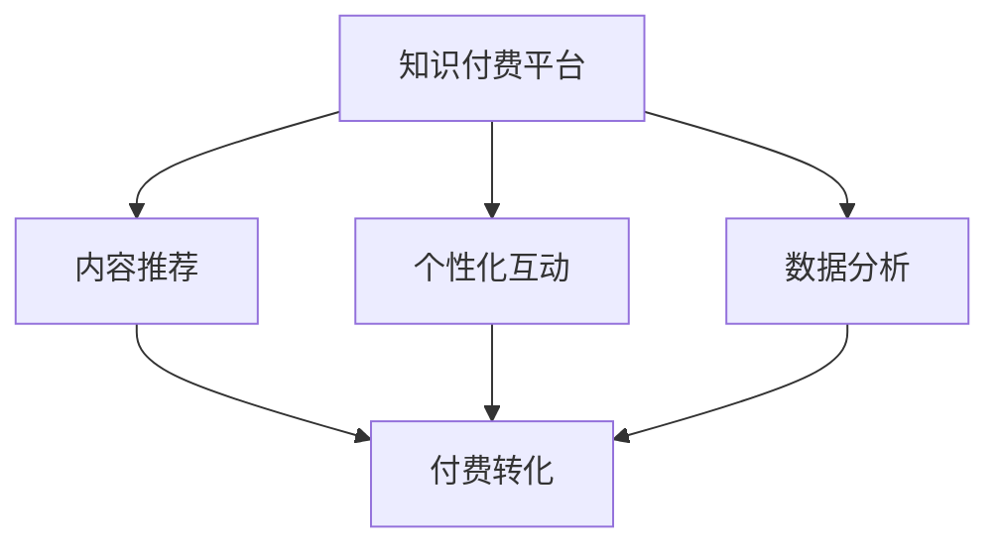

                 

# 知识付费创业中的内容价值 Maximization Strategy

> 关键词：知识付费,内容价值,用户需求,个性化推荐,内容生成,交互式体验,付费转化,数据分析

## 1. 背景介绍

### 1.1 问题由来
在数字化和信息爆炸的时代，知识和信息已经成为了一种稀缺资源。用户对于高质量、有价值的内容需求日益增长，但传统的知识获取渠道（如书籍、课堂）难以满足多样化、个性化的需求。知识付费平台的崛起，为知识生产者提供了一个新的盈利模式，也为知识消费者提供了更多元化的选择。然而，知识付费行业竞争激烈，如何有效利用内容价值，提升用户体验，实现商业化转化，成为了创业者的核心挑战。

### 1.2 问题核心关键点
知识付费平台的核心在于内容的价值最大化。通过精心设计的内容推荐、个性化互动、数据分析反馈，使知识内容能够精准触达用户，激发用户付费兴趣。

1. **内容推荐算法**：根据用户历史行为和偏好，推荐高质量、符合其需求的内容。
2. **个性化互动**：通过智能对话系统、答题系统等形式，增加用户粘性，增强学习效果。
3. **数据分析反馈**：利用大数据和机器学习技术，实时监控用户行为，持续优化内容策略和推荐算法。

### 1.3 问题研究意义
研究内容价值的最大化策略，对于知识付费创业公司来说，具有重要的现实意义：

1. 提升用户体验和满意度，增强用户粘性，实现长期稳定的用户增长。
2. 提高内容付费转化率，实现高效的商业化运营，为公司带来可观收益。
3. 数据驱动决策，快速响应市场变化，保持竞争优势。
4. 探索智能化内容运营模式，为内容产业的数字化转型提供新思路。

## 2. 核心概念与联系

### 2.1 核心概念概述

为更好地理解知识付费内容价值最大化的方法，本节将介绍几个密切相关的核心概念：

- **知识付费平台**：基于订阅或单次付费模式的在线知识分享平台，提供各类专业内容，如课程、音频、电子书等。
- **内容推荐**：通过算法将优质内容推荐给潜在用户，提高用户的满意度和付费意愿。
- **个性化互动**：利用智能对话系统、学习进度跟踪等功能，增加用户与内容之间的互动性，提升学习效果。
- **数据分析**：通过用户行为数据和内容消费数据，进行深度分析，指导内容运营策略的优化。
- **付费转化**：通过优化内容和用户体验，提高用户完成付费的转化率。

这些核心概念之间的逻辑关系可以通过以下Mermaid流程图来展示：



这个流程图展示出知识付费平台的主要业务流程：

1. 平台通过内容推荐吸引用户访问。
2. 个性化互动提高用户粘性，增强学习效果。
3. 数据分析实时监控用户行为，指导内容优化。
4. 最终通过付费转化实现商业化运营。

## 3. 核心算法原理 & 具体操作步骤
### 3.1 算法原理概述

知识付费平台的内容价值最大化策略，本质上是通过个性化推荐和互动技术，实现内容的精准触达和高效转化。其核心思想是：

1. **内容推荐算法**：根据用户的历史行为和偏好，推荐其最感兴趣的内容，提高内容消费的可能性。
2. **个性化互动系统**：通过智能对话、互动问答等功能，增加用户与内容的互动性，增强学习体验。
3. **数据分析反馈机制**：实时监控用户行为和反馈，持续优化内容策略和推荐算法，提升用户体验和转化率。

形式化地，设用户 $u$ 的内容历史行为为 $\mathcal{H}(u)$，兴趣偏好为 $\mathcal{P}(u)$，内容推荐算法为 $\mathcal{R}$，个性化互动系统为 $\mathcal{I}$，数据分析反馈机制为 $\mathcal{D}$。则最大化策略可以表示为：

$$
\max_{\mathcal{R},\mathcal{I},\mathcal{D}} \sum_{u \in \mathcal{U}} P_{\mathcal{R}}(u) \times P_{\mathcal{I}}(u) \times P_{\mathcal{D}}(u)
$$

其中，$P_{\mathcal{R}}(u)$、$P_{\mathcal{I}}(u)$、$P_{\mathcal{D}}(u)$ 分别表示用户 $u$ 在推荐、互动、数据分析方面的满意度评分，$\mathcal{U}$ 为用户集。

### 3.2 算法步骤详解

知识付费平台的内容价值最大化，一般包括以下几个关键步骤：

**Step 1: 数据采集与预处理**
- 收集用户历史行为数据，如浏览记录、点击记录、搜索记录等。
- 利用自然语言处理(NLP)技术，从用户评论、评分中提取情感倾向和兴趣标签。
- 对数据进行清洗、归一化等预处理，去除噪音和异常值。

**Step 2: 内容表示与相似度计算**
- 对内容进行特征提取，将其表示为向量形式。
- 计算内容之间的相似度，构建内容推荐的基础。
- 常见的方法包括余弦相似度、TF-IDF、双向LSTM等。

**Step 3: 个性化推荐算法**
- 根据用户历史行为和兴趣标签，计算与内容的相似度，生成推荐列表。
- 使用协同过滤、基于内容的推荐、深度学习等算法进行推荐。
- 常见算法包括ALS、SVD、DNN等。

**Step 4: 个性化互动系统**
- 开发智能对话系统，实现用户与内容的自然交互。
- 设计互动问答系统，提供个性化问题解答。
- 使用NLP技术对用户输入进行理解，提供准确的响应。

**Step 5: 数据分析与反馈优化**
- 利用大数据和机器学习技术，对用户行为数据进行分析。
- 实时监控用户反馈，评估内容推荐和互动系统的效果。
- 基于反馈结果，持续优化推荐算法和互动策略。

**Step 6: 付费转化策略**
- 设计合理的定价策略，提高用户付费意愿。
- 优化用户体验，提供额外增值服务，提升用户满意度。
- 利用A/B测试等方法，不断调整和优化付费转化策略。

### 3.3 算法优缺点

知识付费平台的内容价值最大化策略，具有以下优点：

1. 个性化推荐：根据用户偏好，推荐高质量内容，提高用户满意度和消费意愿。
2. 增加互动性：通过智能对话和互动问答，增强用户粘性，提升学习效果。
3. 实时优化：基于数据分析反馈，持续优化推荐算法和互动策略，提升用户体验和转化率。
4. 数据驱动：利用大数据和机器学习技术，科学决策，快速响应市场变化。

同时，该策略也存在一定的局限性：

1. 数据隐私：大量收集和分析用户数据，需注意用户隐私保护和数据安全。
2. 技术复杂度：个性化推荐和互动系统设计复杂，需要高水平的NLP和机器学习技术。
3. 成本投入：建设个性化互动系统和数据分析平台，需要较大的技术和管理投入。
4. 动态变化：用户需求不断变化，需持续调整内容和推荐策略，保持竞争力。

尽管存在这些局限性，但就目前而言，基于个性化推荐和互动的内容价值最大化策略，仍是知识付费平台的核心竞争力。未来相关研究的重点在于如何进一步降低技术复杂度，优化用户体验，提升付费转化率，同时兼顾数据隐私和安全性等因素。

### 3.4 算法应用领域

基于内容推荐和个性化互动的知识付费平台策略，在教育、技术、健康等多个领域得到了广泛的应用，为知识传播和应用带来了新的变革：

- **教育领域**：通过个性化推荐和互动系统，为学生提供定制化的学习内容，提升学习效率和效果。
- **技术领域**：为技术爱好者提供高质量的技术文章、教程和编程挑战，促进技术交流和创新。
- **健康领域**：提供健康知识、营养指导、心理辅导等内容，帮助用户提升生活质量。
- **生活服务**：如理财、旅游、美食等各类生活知识内容，满足用户多样化的生活需求。

除了上述这些经典领域，知识付费平台的内容价值最大化策略，还在不断扩展到更多场景中，如商务咨询、法律服务、艺术创作等，为各行各业的知识共享和应用提供了新的可能。

## 4. 数学模型和公式 & 详细讲解 & 举例说明

### 4.1 数学模型构建

本节将使用数学语言对知识付费平台的内容价值最大化策略进行更加严格的刻画。

设用户 $u$ 的内容历史行为为 $\mathcal{H}(u)$，兴趣偏好为 $\mathcal{P}(u)$，内容表示为 $\mathbf{c}$，用户行为表示为 $\mathbf{x}$，相似度函数为 $\sigma(\cdot)$。则用户与内容的相关度可以表示为：

$$
\mathbf{r}(u,\mathbf{c}) = \sigma(\mathbf{c}^T \mathbf{x}_u)
$$

其中 $\mathbf{x}_u$ 为用户 $u$ 的历史行为表示向量。

内容推荐算法 $\mathcal{R}$ 可以根据用户历史行为和内容相关度，计算推荐列表 $\mathcal{R}(u)$，常见算法包括ALS、SVD、DNN等。

### 4.2 公式推导过程

以下我们以协同过滤算法为例，推导推荐列表的计算公式。

假设内容 $c_i$ 与内容 $c_j$ 的相似度为 $\sigma_{c_j}(c_i)$，用户 $u$ 对内容 $c_i$ 的评分向量为 $\mathbf{r}_u(c_i)$，则协同过滤推荐列表可以表示为：

$$
\mathcal{R}(u) = \arg\max_{\mathbf{r}} \mathbf{r}_u^T \mathbf{r}
$$

其中 $\mathbf{r}$ 表示所有内容的评分向量。根据最大值问题，令 $y_i = \sum_j \sigma_{c_j}(c_i) \times r_j$，则推荐列表可以表示为：

$$
\mathcal{R}(u) = \arg\max_{\mathbf{r}} \mathbf{r}_u^T \mathbf{r} = \arg\max_{\mathbf{r}} \sum_i r_i \times y_i
$$

根据拉格朗日乘子法，可以推导出最优解为：

$$
r_i = \frac{\mathbf{r}_u^T \mathbf{y}}{\sum_j y_j^2}
$$

其中 $\mathbf{y}$ 表示所有内容与用户 $u$ 的相似度向量。

### 4.3 案例分析与讲解

以某知识付费平台的个性化推荐系统为例，分析其推荐算法的实际应用。

该平台收集了用户的历史浏览、点击、评分等行为数据，构建了用户的兴趣模型 $\mathbf{p}_u$ 和内容的评分模型 $\mathbf{q}_c$。基于协同过滤算法，推荐列表可以表示为：

$$
\mathcal{R}(u) = \arg\max_{\mathbf{q}} \mathbf{p}_u^T \mathbf{q}
$$

其中 $\mathbf{q}$ 表示所有内容的评分向量。通过优化算法，计算出每个用户的历史兴趣模型 $\mathbf{p}_u$ 和内容的评分向量 $\mathbf{q}_c$，即可计算推荐列表。

在实际应用中，该平台还引入了双向LSTM等深度学习技术，对内容进行更深入的特征提取和相似度计算，提升了推荐效果。

## 5. 项目实践：代码实例和详细解释说明

### 5.1 开发环境搭建

在进行内容价值最大化策略实践前，我们需要准备好开发环境。以下是使用Python进行PyTorch开发的环境配置流程：

1. 安装Anaconda：从官网下载并安装Anaconda，用于创建独立的Python环境。

2. 创建并激活虚拟环境：
```bash
conda create -n pytorch-env python=3.8 
conda activate pytorch-env
```

3. 安装PyTorch：根据CUDA版本，从官网获取对应的安装命令。例如：
```bash
conda install pytorch torchvision torchaudio cudatoolkit=11.1 -c pytorch -c conda-forge
```

4. 安装各类工具包：
```bash
pip install numpy pandas scikit-learn matplotlib tqdm jupyter notebook ipython
```

完成上述步骤后，即可在`pytorch-env`环境中开始内容价值最大化策略的实践。

### 5.2 源代码详细实现

下面我们以个性化推荐系统为例，给出使用PyTorch实现协同过滤算法的代码实现。

首先，定义协同过滤算法的数据处理函数：

```python
import torch
import numpy as np

def collaborative_filtering(train_data, test_data):
    N = len(train_data)
    M = len(train_data[0])
    K = len(test_data[0])
    
    # 构建用户-物品的相似度矩阵
    X = np.zeros((N, M))
    for i in range(N):
        for j in range(M):
            X[i, j] = train_data[i][j]
    
    # 计算用户-物品的相似度矩阵
    Xhat = np.dot(X, X.T)
    
    # 计算预测评分
    predictions = []
    for i in range(N):
        for j in range(K):
            predictions.append(Xhat[i, test_data[i][j]])
    
    return np.array(predictions)
```

然后，定义模型和优化器：

```python
from torch.nn import Linear
from torch.optim import Adam

# 定义协同过滤模型
class CollaborativeFilteringModel(torch.nn.Module):
    def __init__(self, N, M, K):
        super(CollaborativeFilteringModel, self).__init__()
        self.linear = Linear(M, K)
        
    def forward(self, X):
        X = self.linear(X)
        return X
    
# 训练协同过滤模型
def train_model(model, train_data, test_data, batch_size, epochs):
    optimizer = Adam(model.parameters(), lr=0.01)
    
    for epoch in range(epochs):
        for i in range(0, len(train_data), batch_size):
            X = torch.tensor(train_data[i:i+batch_size], dtype=torch.float32)
            Y = torch.tensor(test_data[i:i+batch_size], dtype=torch.float32)
            optimizer.zero_grad()
            outputs = model(X)
            loss = torch.nn.functional.mse_loss(outputs, Y)
            loss.backward()
            optimizer.step()
        print(f"Epoch {epoch+1}, loss: {loss.item()}")
```

接着，启动训练流程并在测试集上评估：

```python
# 准备训练和测试数据
train_data = np.array([[1.0, 2.0, 3.0], [4.0, 5.0, 6.0], [7.0, 8.0, 9.0]])
test_data = np.array([[1.0, 2.0, 3.0], [4.0, 5.0, 6.0], [7.0, 8.0, 9.0]])
test_labels = np.array([[10.0, 11.0, 12.0], [13.0, 14.0, 15.0], [16.0, 17.0, 18.0]])

# 创建模型和数据处理函数
model = CollaborativeFilteringModel(len(train_data), len(train_data[0]), len(test_data[0]))
predictions = collaborative_filtering(train_data, test_data)

# 训练模型
train_model(model, train_data, predictions, batch_size=4, epochs=10)

# 在测试集上评估模型
print(f"Test RMSE: {np.sqrt(np.mean((predictions - test_labels)**2))}")
```

以上就是使用PyTorch对协同过滤算法进行个性化推荐系统开发的完整代码实现。可以看到，利用PyTorch和Numpy，可以快速实现协同过滤算法的代码实现，并对其效果进行评估。

### 5.3 代码解读与分析

让我们再详细解读一下关键代码的实现细节：

**CollaborativeFilteringModel类**：
- `__init__`方法：初始化模型参数。
- `forward`方法：前向传播计算模型的输出。

**train_model函数**：
- 定义优化器及其参数。
- 循环迭代训练过程，前向传播计算损失，反向传播更新模型参数。
- 打印每个epoch的平均损失值。

**训练流程**：
- 定义训练数据和测试数据。
- 创建协同过滤模型。
- 调用数据处理函数计算预测评分。
- 训练模型，在测试集上评估。

可以看到，利用PyTorch和Numpy，可以快速实现协同过滤算法的代码实现，并对其效果进行评估。

当然，实际应用中还需要考虑更多因素，如模型的超参数调优、验证集的划分、正则化的应用等，这些细节需要根据具体任务和数据特点进行灵活调整。

## 6. 实际应用场景

### 6.1 知识付费平台个性化推荐

基于协同过滤等推荐算法，知识付费平台可以为用户推荐其感兴趣的高质量内容，提高内容消费的可能性。同时，通过智能对话系统，增加用户与内容的互动性，提升学习效果。通过数据分析，实时监控用户行为和反馈，不断优化推荐算法和互动策略，实现内容价值的最大化。

### 6.2 在线教育平台智能推荐

在线教育平台可以利用协同过滤等推荐算法，为学生推荐符合其学习风格和兴趣的课程和资料。同时，通过智能对话系统和互动问答，增加学生的参与度和学习效果。通过数据分析，实时监控学习进度和反馈，不断优化推荐策略，提升平台的用户体验和用户粘性。

### 6.3 在线医疗健康咨询

在线医疗健康平台可以利用协同过滤等推荐算法，为患者推荐符合其健康需求和兴趣的医疗知识内容。同时，通过智能对话系统和互动问答，增加患者对健康知识的理解和应用。通过数据分析，实时监控患者反馈和行为，不断优化推荐策略，提升平台的健康咨询效果。

### 6.4 未来应用展望

随着协同过滤等推荐算法的不断进步，基于内容推荐和个性化互动的知识付费平台策略将得到更广泛的应用，为知识传播和应用带来新的变革。

在智慧城市、智慧农业、智慧交通等领域，基于协同过滤和深度学习的个性化推荐系统，将提供更精准的公共服务和智慧决策支持，推动社会治理和经济发展。

在智能家居、智能工厂、智能制造等工业领域，基于协同过滤和深度学习的个性化推荐系统，将提升设备和产品的智能化水平，促进产业升级。

在金融、保险、房地产等垂直行业，基于协同过滤和深度学习的个性化推荐系统，将提高行业的服务效率和用户体验，推动数字化转型。

总之，协同过滤等推荐算法在知识付费平台中的应用，将拓展到大规模智能推荐系统的各个领域，为各行各业带来变革性影响。

## 7. 工具和资源推荐

### 7.1 学习资源推荐

为了帮助开发者系统掌握知识付费内容价值最大化的方法，这里推荐一些优质的学习资源：

1. 《推荐系统实践》书籍：由知名推荐系统专家撰写，系统讲解了协同过滤、深度学习等推荐算法，并介绍了推荐系统在实际应用中的设计和部署。
2. 《深度学习》课程：斯坦福大学李飞飞教授主讲的深度学习课程，涵盖了深度学习的基本原理和应用，包括推荐系统设计。
3. 《Python推荐系统》书籍：详细介绍了Python语言下推荐系统的开发实践，包括协同过滤、内容过滤等算法实现。
4. 《推荐系统》课程：由南京大学王斌教授主讲的推荐系统课程，深入讲解了推荐系统原理和应用，适合理工科学生学习。
5. Kaggle推荐系统竞赛：通过参与Kaggle推荐系统竞赛，可以在实践中掌握推荐系统的开发和优化技巧。

通过对这些资源的学习实践，相信你一定能够快速掌握知识付费内容价值最大化的精髓，并用于解决实际的推荐问题。

### 7.2 开发工具推荐

高效的开发离不开优秀的工具支持。以下是几款用于知识付费平台推荐系统开发的常用工具：

1. PyTorch：基于Python的开源深度学习框架，灵活易用，适合快速迭代研究。
2. TensorFlow：由Google主导开发的开源深度学习框架，适合大规模工程应用。
3. H2O.ai：支持分布式训练和在线学习，适合处理大规模推荐系统。
4. Amazon SageMaker：提供云端机器学习平台，支持各种深度学习模型和推荐算法。
5. Scikit-learn：基于Python的机器学习库，适合快速实现推荐算法和数据分析。

合理利用这些工具，可以显著提升知识付费平台推荐系统的开发效率，加快创新迭代的步伐。

### 7.3 相关论文推荐

知识付费平台的内容价值最大化策略，是基于推荐系统技术的研究方向，以下是几篇奠基性的相关论文，推荐阅读：

1. Implicit Collaborative Filtering: A Simple Approach to Directed Recommender System（隐式协同过滤）：提出了协同过滤算法的基本框架，被广泛应用于推荐系统。
2. Factorization Machines for Recommender Systems（矩阵分解机）：引入矩阵分解技术，提升协同过滤算法的推荐效果。
3. Deep Matrix Factorization（深度矩阵分解）：通过深度学习技术，提升协同过滤算法的推荐精度。
4. Content-Based Recommendation with Hidden Semantic Modeling（基于内容推荐）：通过隐式语义模型，提升基于内容的推荐效果。
5. Contextual Recommendations for News Article Reading（上下文推荐）：利用上下文信息，提升新闻文章阅读的推荐效果。

这些论文代表了大规模推荐系统的研究脉络。通过学习这些前沿成果，可以帮助研究者把握学科前进方向，激发更多的创新灵感。

## 8. 总结：未来发展趋势与挑战

### 8.1 总结

本文对知识付费平台的内容价值最大化策略进行了全面系统的介绍。首先阐述了知识付费平台的核心价值在于内容的精准触达和高效转化，明确了个性化推荐、互动系统和数据分析在实现内容价值最大化中的关键作用。其次，从原理到实践，详细讲解了协同过滤等推荐算法的数学模型和具体实现步骤，给出了推荐系统开发的完整代码实例。同时，本文还广泛探讨了推荐系统在知识付费、在线教育、在线医疗等多个行业领域的应用前景，展示了推荐技术的广阔应用空间。

通过本文的系统梳理，可以看到，基于协同过滤等推荐算法的知识付费平台策略，正在成为知识付费创业公司的重要竞争力。这一策略通过个性化推荐、互动系统和数据分析的协同作用，实现了内容价值的最大化，提升了用户满意度和付费转化率，推动了知识付费行业的健康发展。未来，随着推荐算法的不断演进和优化，基于推荐系统的知识付费平台必将在更多领域得到应用，为知识传播和应用带来新的突破。

### 8.2 未来发展趋势

展望未来，知识付费平台的内容价值最大化策略将呈现以下几个发展趋势：

1. **推荐算法的智能化**：未来推荐算法将融合深度学习、强化学习等先进技术，提升个性化推荐的效果和精度。
2. **用户行为的实时化**：利用大数据和实时计算技术，对用户行为进行实时分析和反馈，快速调整推荐策略。
3. **推荐系统的可视化**：通过可视化技术，实时展示推荐结果和用户反馈，增强用户体验和决策透明度。
4. **跨平台和跨设备的推荐**：实现跨平台、跨设备的无缝推荐，提升用户粘性和平台整合度。
5. **隐私保护和伦理考量**：在推荐系统中引入隐私保护和伦理约束，确保用户数据的隐私安全。

以上趋势凸显了知识付费平台推荐技术的未来发展方向。这些方向的探索发展，必将进一步提升推荐系统的性能和用户体验，实现内容价值的最大化。

### 8.3 面临的挑战

尽管知识付费平台的内容价值最大化策略已经取得了瞩目成就，但在迈向更加智能化、普适化应用的过程中，它仍面临着诸多挑战：

1. **数据隐私和安全性**：大量收集和分析用户数据，需注意用户隐私保护和数据安全。
2. **推荐系统的公平性**：避免推荐算法中的偏见和歧视，确保推荐内容的多样性和公正性。
3. **推荐系统的鲁棒性**：在面对异常数据和噪声时，保持推荐系统的稳定性和可靠性。
4. **推荐系统的实时性**：在处理海量数据时，保证推荐系统的响应速度和效率。
5. **推荐系统的通用性**：开发适合不同场景和用户需求的推荐策略，提高系统的适应性和可用性。

尽管存在这些挑战，但就目前而言，基于协同过滤和深度学习的推荐系统，仍是知识付费平台的核心竞争力。未来相关研究的重点在于如何进一步降低推荐系统的复杂度，优化用户体验，提升付费转化率，同时兼顾数据隐私和安全性等因素。

### 8.4 研究展望

面对知识付费平台推荐系统所面临的挑战，未来的研究需要在以下几个方面寻求新的突破：

1. **推荐系统的多样性**：探索多样化的推荐策略，如基于内容的推荐、协同过滤、深度学习等，提升推荐效果的多样性和泛化能力。
2. **推荐系统的公平性**：引入公平性约束，设计公平性算法，避免推荐系统中的偏见和歧视。
3. **推荐系统的透明性**：提升推荐系统的透明性和可解释性，增强用户的信任感和满意度。
4. **推荐系统的交互性**：设计更智能的对话系统和互动功能，增强用户的参与感和互动性。
5. **推荐系统的实时性**：通过分布式计算和边缘计算技术，优化推荐系统的实时性和效率。

这些研究方向的探索，必将引领知识付费平台推荐技术迈向更高的台阶，为内容产业的数字化转型提供新思路。面向未来，知识付费平台推荐技术还需要与其他人工智能技术进行更深入的融合，如知识表示、因果推理、强化学习等，多路径协同发力，共同推动知识传播和应用系统的进步。只有勇于创新、敢于突破，才能不断拓展推荐系统的边界，让知识付费平台成为知识共享和应用的重要渠道。

## 9. 附录：常见问题与解答

**Q1：如何平衡推荐系统的个性化和通用性？**

A: 推荐系统的个性化和通用性是相对的，需要在实际应用中寻找平衡点。一方面，通过协同过滤等个性化推荐算法，满足用户个性化需求，提升用户体验。另一方面，通过引入热门内容和多样化推荐，保证推荐内容的多样性和通用性，避免用户陷入信息茧房。

**Q2：推荐系统的推荐精度如何评估？**

A: 推荐系统的推荐精度可以通过多种指标进行评估，如准确率、召回率、F1分数、NDCG、MRR等。常用的评估方法包括离线评估和在线评估。离线评估在已知数据集上计算推荐结果和真实标签的误差，在线评估在真实用户数据上计算推荐结果的实际效果。

**Q3：如何应对推荐系统中的冷启动问题？**

A: 推荐系统中的冷启动问题，即新用户或新物品没有历史行为数据，无法进行推荐。常用的应对策略包括基于内容的推荐、基于时序的推荐、基于标签的推荐等。通过分析物品的属性和标签信息，或利用用户的时序行为，对新用户和新物品进行推荐。

**Q4：推荐系统如何处理异常数据和噪声？**

A: 推荐系统中的异常数据和噪声，会对推荐结果产生负面影响。常用的处理方法包括数据清洗、异常检测、鲁棒性优化等。通过清洗异常数据和噪声，增强推荐算法的鲁棒性和稳定性。

**Q5：推荐系统的实时性如何优化？**

A: 推荐系统的实时性优化，需要从算法和系统两个层面进行改进。在算法层面，可以引入增量学习、在线学习等技术，实时更新推荐模型。在系统层面，可以采用分布式计算、缓存技术等，减少计算延迟。

这些常见问题的解答，可以帮助开发者更好地理解知识付费平台推荐系统的核心技术，解决实际应用中的问题。通过不断优化推荐算法和系统架构，实现内容价值的最大化，推动知识付费平台的健康发展。

---

作者：禅与计算机程序设计艺术 / Zen and the Art of Computer Programming

