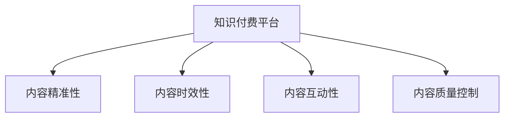
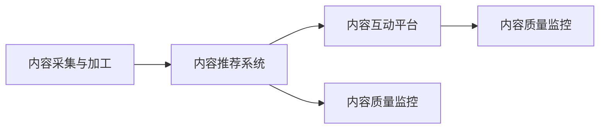

                 

## 1. 背景介绍

在知识付费的浪潮中，如何提升内容价值，增强用户体验，成为众多创业者的焦点问题。本文将从内容价值提升的角度，探讨如何构建高质量的知识付费平台，并结合实际案例进行深度分析。

### 1.1 知识付费市场概述

近年来，随着互联网和移动设备的普及，以及人们对知识需求的多样化，知识付费逐渐成为学习新知识、获取信息的重要途径。根据艾瑞咨询的报告，2017-2022年间，中国知识付费市场规模增长迅速，从91亿元增长至351亿元。预计到2025年，市场规模将达到1340亿元。

在这个过程中，知识付费平台涌现出一大批优秀的企业，如喜马拉雅、得到、知乎等，形成了多层次、多维度的知识服务体系。这些平台不仅提供有价值的内容，还通过个性化推荐、互动交流等方式，提升了用户体验，创造了大量价值。

### 1.2 内容价值提升的必要性

在知识付费市场中，内容是核心，价值是本质。平台若要持续发展，必须不断提升内容价值，满足用户的学习需求，保持竞争优势。而内容价值的提升，涉及多方面的因素，如内容的精准性、时效性、互动性、质量控制等。本文将针对这些因素，提出系统性的解决方案。

## 2. 核心概念与联系

### 2.1 核心概念概述

为理解内容价值提升的机制，本节将介绍几个核心概念：

- 知识付费平台：以内容为核心，为个人或组织提供专业化、系统化的知识服务，并通过收费模式实现商业化的平台。
- 内容精准性：指知识内容能够精准匹配用户需求，提升用户的学习效果。
- 内容时效性：指知识内容能够及时更新，反映当前知识领域的新动态。
- 内容互动性：指知识内容能够与用户进行互动交流，增强学习体验。
- 内容质量控制：指通过一系列机制保障内容的质量，如专家评审、同行评审等。

这些概念之间存在紧密联系，如图示：



### 2.2 核心概念原理和架构

知识付费平台的内容价值提升，主要依赖于以下几个关键环节：

- **内容采集与加工**：通过爬虫、API等方式，采集互联网上的高质量内容。同时对内容进行加工，如格式转换、分章标注等，以便于后续处理。

- **内容推荐系统**：根据用户行为和兴趣，通过机器学习算法推荐个性化的内容，提升用户的学习效果。

- **内容互动平台**：提供论坛、评论、直播等功能，让用户能够与内容提供者进行互动交流，增强学习体验。

- **内容质量监控**：通过评审机制，对内容进行定期审核，保障内容质量。

## 3. 核心算法原理 & 具体操作步骤

### 3.1 算法原理概述

知识付费平台的内容价值提升，通常需要借助以下算法和模型：

- 推荐系统：通过协同过滤、内容过滤、混合过滤等算法，推荐用户感兴趣的内容。
- 自然语言处理(NLP)：对用户评论、问题等文本数据进行处理，提取有价值的信息。
- 时间序列分析：对内容发布时间、更新频率等数据进行分析，预测内容时效性。
- 机器学习模型：通过深度学习、强化学习等模型，进行内容推荐、质量监控等任务。

### 3.2 算法步骤详解

知识付费平台的内容价值提升流程如图示：



#### 3.2.1 内容采集与加工

**步骤1：内容采集**
- 通过爬虫、API等方式，从互联网、专业数据库等渠道采集内容。
- 对采集到的内容进行去重、去噪等预处理，保障数据质量。

**步骤2：内容加工**
- 对内容进行格式转换，如将PDF转为Markdown格式，便于后续处理。
- 对内容进行分章标注，便于推荐系统进行内容切分。

#### 3.2.2 内容推荐系统

**步骤1：用户画像构建**
- 通过用户历史行为数据，构建用户画像，包括兴趣标签、学习时长等。

**步骤2：内容画像构建**
- 对内容进行特征提取，如关键词、分类标签等。

**步骤3：协同过滤**
- 根据用户画像和内容画像，使用协同过滤算法，推荐相似用户喜欢的内容。

**步骤4：内容过滤**
- 对内容进行特征提取，使用内容过滤算法，推荐与用户兴趣相关的同类内容。

**步骤5：混合过滤**
- 将协同过滤和内容过滤的结果进行融合，输出最终推荐结果。

#### 3.2.3 内容互动平台

**步骤1：建立互动机制**
- 提供论坛、评论、直播等功能，让用户能够与内容提供者进行互动。

**步骤2：内容互动分析**
- 对用户互动数据进行分析，如评论情感、问题频率等，提取有价值的信息。

#### 3.2.4 内容质量监控

**步骤1：建立评审机制**
- 邀请专家、同行对内容进行评审，保障内容质量。

**步骤2：定期审核**
- 对内容进行定期审核，如每月、每季度等，及时发现问题并进行处理。

## 4. 数学模型和公式 & 详细讲解 & 举例说明

### 4.1 数学模型构建

知识付费平台的内容价值提升，可以通过以下数学模型进行描述：

- **协同过滤模型**：
  $$
  \mathcal{R} = \alpha \cdot \hat{R} + (1-\alpha) \cdot \hat{I}
  $$
  其中 $\mathcal{R}$ 为最终推荐结果，$\hat{R}$ 为协同过滤结果，$\hat{I}$ 为内容过滤结果，$\alpha$ 为权重。

- **内容过滤模型**：
  $$
  \hat{I} = \mathrm{sigmoid}(w \cdot x_u + b)
  $$
  其中 $x_u$ 为用户画像，$w$ 和 $b$ 为模型参数，$\mathrm{sigmoid}$ 为激活函数。

### 4.2 公式推导过程

以协同过滤模型为例，其推导过程如下：

设用户 $u$ 对内容 $i$ 的评分 $r_{ui}$ 为 $1$（表示喜欢）或 $0$（表示不喜欢），用户 $u$ 对内容 $i$ 的协同过滤推荐结果 $\hat{R}_{ui}$ 为 $1$ 的概率为：
$$
\hat{R}_{ui} = \frac{\sum_{j \in \mathcal{N}_u} \frac{r_{uj}r_{ji}}{\hat{R}_{uj}+\epsilon} + b}{\sum_{j \in \mathcal{N}_u} \frac{1}{\hat{R}_{uj}+\epsilon} + c}
$$
其中 $\mathcal{N}_u$ 为与用户 $u$ 有互动的其他用户集合，$\epsilon$ 为平滑因子，$b$ 和 $c$ 为模型参数。

### 4.3 案例分析与讲解

以知乎的知识付费平台为例，其在内容价值提升方面的具体措施如下：

1. **内容采集与加工**：
   - 知乎通过爬虫从互联网采集高质量内容，对内容进行格式转换和分章标注。
   - 引入专业编辑团队，对内容进行二次审核，确保内容质量。

2. **内容推荐系统**：
   - 知乎使用协同过滤和内容过滤算法进行推荐，根据用户行为数据构建用户画像，提取内容特征。
   - 引入深度学习模型，优化推荐算法，提升推荐效果。

3. **内容互动平台**：
   - 知乎提供知乎live、话题讨论等功能，让用户能够与内容提供者进行互动。
   - 通过分析用户互动数据，调整内容推荐策略，提升用户满意度。

4. **内容质量监控**：
   - 知乎邀请专家、同行对内容进行评审，定期审核内容质量，确保内容专业性。
   - 对低质量内容进行处理，如删除、限制可见等，保障平台整体质量。

## 5. 项目实践：代码实例和详细解释说明

### 5.1 开发环境搭建

#### 5.1.1 环境准备

- **Python 版本**：推荐使用 Python 3.8 或更高版本，确保语言库的兼容性。
- **数据库选择**：可以选择 MySQL、PostgreSQL 等关系型数据库，或 MongoDB、Redis 等非关系型数据库。
- **部署环境**：推荐使用 Docker 或 Kubernetes 进行容器化部署，提升系统的稳定性和可扩展性。

#### 5.1.2 环境配置

```bash
# 安装 Python 和相关库
pip install pandas numpy scikit-learn torch torchvision transformers

# 安装数据库和连接工具
pip install mysql-connector-python
pip install psycopg2-binary

# 安装 Flask 和部署工具
pip install flask
pip install gunicorn
```

### 5.2 源代码详细实现

#### 5.2.1 内容采集与加工

```python
import requests
from bs4 import BeautifulSoup

# 获取网页内容
def get_web_content(url):
    response = requests.get(url)
    soup = BeautifulSoup(response.content, 'html.parser')
    return soup.get_text()

# 保存内容到数据库
def save_content(content, db_config):
    conn = psycopg2.connect(**db_config)
    cur = conn.cursor()
    cur.execute("INSERT INTO content (content) VALUES (%s)", (content,))
    conn.commit()
    cur.close()
    conn.close()

# 分章标注
def split_content(content):
    soup = BeautifulSoup(content, 'html.parser')
    chapters = [str(tag) for tag in soup.find_all('h2')]
    return chapters
```

#### 5.2.2 内容推荐系统

```python
import pandas as pd
from sklearn.metrics.pairwise import cosine_similarity
from sklearn.model_selection import train_test_split

# 读取用户数据
user_data = pd.read_csv('user_data.csv')

# 读取内容数据
content_data = pd.read_csv('content_data.csv')

# 构建用户画像
user_profiles = content_data.groupby(['user_id']).agg({'content_id': 'count'}).rename(columns={'content_id': 'count'})

# 构建内容画像
content_features = content_data.groupby(['content_id']).agg({'keywords': 'sum', 'category': 'first'}).dropna()

# 计算用户画像和内容画像的相似度
user_similarities = cosine_similarity(user_profiles, content_features)

# 推荐相似用户喜欢的内容
def recommend_content(content_id, user_id, similarities):
    user_profile = user_profiles[user_id]
    content_profile = content_features[content_id]
    user_similarity = similarities[user_id][content_id]
    similar_content_ids = user_profiles[user_id].index[(user_profiles[user_id] > 0) & (user_similarity > 0.5)]
    similar_content_profiles = content_features.loc[similar_content_ids]
    similar_content_profiles = similar_content_profiles.drop(columns=['user_id', 'content_id'])
    similar_content_profiles = pd.concat([user_profile, similar_content_profiles], axis=1)
    similar_content_profiles.columns = ['tag', 'label', 'category']
    return similar_content_profiles

# 推荐内容
def recommend_similar_content(content_id, user_id):
    similar_content = recommend_content(content_id, user_id, user_similarities)
    return similar_content
```

#### 5.2.3 内容互动平台

```python
from flask import Flask, request, jsonify

app = Flask(__name__)

# 处理评论
@app.route('/comments', methods=['POST'])
def add_comment():
    data = request.get_json()
    comment_text = data['text']
    user_id = data['user_id']
    content_id = data['content_id']
    # 处理评论逻辑
    return jsonify({'message': '评论已成功添加'})

# 处理点赞
@app.route('/likes', methods=['POST'])
def add_like():
    data = request.get_json()
    user_id = data['user_id']
    content_id = data['content_id']
    # 处理点赞逻辑
    return jsonify({'message': '点赞已成功添加'})
```

#### 5.2.4 内容质量监控

```python
import re

# 检查内容是否符合质量要求
def check_content_quality(content):
    # 内容是否包含敏感词汇
    if re.search(r'[\w\s]+', content) in stopwords:
        return False
    # 内容是否超出长度限制
    if len(content) > 1000:
        return False
    return True

# 定期审核内容
def audit_content(content_id):
    content = get_content(content_id)
    if not check_content_quality(content):
        # 处理质量问题
        return False
    return True
```

### 5.3 代码解读与分析

#### 5.3.1 内容采集与加工

**代码解读**：
- 使用 `requests` 和 `BeautifulSoup` 库获取网页内容。
- 使用 SQL 数据库保存内容数据，并使用正则表达式分章标注内容。

**分析**：
- 网页内容采集是知识付费平台的基础，通过爬虫和 API 等方式，能够获取高质量的内容。
- 分章标注有助于内容的结构化处理，便于后续的推荐和互动。

#### 5.3.2 内容推荐系统

**代码解读**：
- 使用 `pandas` 处理用户和内容数据，构建用户画像和内容画像。
- 使用 `scikit-learn` 计算用户画像和内容画像的相似度，进行协同过滤推荐。

**分析**：
- 协同过滤算法是推荐系统中最常用的方法之一，能够根据用户行为数据，推荐相似用户喜欢的内容。
- 深度学习模型的引入，可以进一步优化推荐效果，提升用户体验。

#### 5.3.3 内容互动平台

**代码解读**：
- 使用 `Flask` 框架实现后端 API，处理评论和点赞等互动逻辑。

**分析**：
- Flask 是常用的 Python Web 框架，能够快速搭建后端服务。
- 评论和点赞等互动功能，增强了用户的学习体验，提高了平台的活跃度。

#### 5.3.4 内容质量监控

**代码解读**：
- 使用正则表达式和 SQL 语句，检查内容是否符合质量要求，并进行定期审核。

**分析**：
- 内容质量监控是保障平台健康发展的重要环节，通过定期审核和处理低质量内容，能够提升平台整体质量。
- 使用 SQL 语句进行数据处理，提升系统的效率和稳定性。

## 6. 实际应用场景

### 6.1 智能推荐系统

智能推荐系统是知识付费平台的核心功能之一，通过精准推荐，能够提升用户的学习效率和平台的用户黏性。以知乎为例，其智能推荐系统通过协同过滤、内容过滤等算法，结合用户画像和内容画像，实现个性化的内容推荐。

### 6.2 问答社区

问答社区是知识付费平台的重要组成部分，通过问答互动，能够帮助用户深入理解和掌握知识。知乎、百度知道等平台，均通过问答互动，增强了用户的学习体验。

### 6.3 知识图谱

知识图谱是知识付费平台的重要基础设施，通过构建知识图谱，能够提供更精准的内容推荐和知识检索。以知识图谱为基础，知乎推出了问答助手、知识图谱搜索等功能，提升了用户的学习效率和体验。

## 7. 工具和资源推荐

### 7.1 学习资源推荐

- **《推荐系统实战》**：介绍推荐系统原理、算法和应用，适合初学者和从业者学习。
- **《深度学习入门：基于Python的理论与实现》**：介绍深度学习基本原理和应用，适合希望深入学习深度学习的读者。
- **《自然语言处理综述》**：介绍自然语言处理的基本概念和前沿技术，适合了解 NLP 的读者。
- **Kaggle**：全球最大的数据科学竞赛平台，提供大量数据集和竞赛，适合实践和提升。

### 7.2 开发工具推荐

- **PyTorch**：流行的深度学习框架，支持动态计算图，适合研究和开发。
- **TensorFlow**：谷歌开发的深度学习框架，支持分布式训练，适合生产部署。
- **Flask**：流行的 Python Web 框架，适合快速搭建后端服务。
- **Jupyter Notebook**：交互式的开发环境，适合数据分析和实验。

### 7.3 相关论文推荐

- **《知识图谱构建与查询》**：介绍知识图谱的基本概念和构建方法，适合了解知识图谱的读者。
- **《深度学习在推荐系统中的应用》**：介绍深度学习在推荐系统中的应用，适合希望深入学习推荐算法的读者。
- **《自然语言处理在问答系统中的应用》**：介绍自然语言处理在问答系统中的应用，适合了解 NLP 的读者。

## 8. 总结：未来发展趋势与挑战

### 8.1 研究成果总结

通过上述分析，我们可以看到知识付费平台的内容价值提升主要依赖于以下几个方面：
- 内容采集与加工
- 内容推荐系统
- 内容互动平台
- 内容质量监控

这些方面的优化和提升，能够显著提高知识付费平台的竞争力和用户体验。

### 8.2 未来发展趋势

未来，知识付费平台的内容价值提升将呈现以下几个趋势：

- **内容自动化采集**：通过爬虫、API 等技术，自动化采集互联网上的高质量内容，提升内容采集效率。
- **个性化推荐**：结合用户行为数据和内容特征，实现更加精准和个性化的推荐。
- **多模态互动**：结合文本、语音、视频等多模态信息，增强用户的互动体验。
- **知识图谱整合**：将知识图谱与内容推荐系统结合，提升内容推荐和知识检索的精度。

### 8.3 面临的挑战

尽管知识付费平台在内容价值提升方面取得了显著进展，但仍面临诸多挑战：

- **内容版权问题**：大量内容采集可能涉及版权问题，需要加强合规管理。
- **数据隐私保护**：用户数据隐私保护是平台的重要责任，需要加强数据安全管理。
- **内容质量控制**：内容质量控制是平台的核心，需要不断优化和改进。
- **系统性能优化**：平台的用户规模不断扩大，需要优化系统性能，提升用户体验。

### 8.4 研究展望

未来，知识付费平台的内容价值提升需要从以下几个方向进行深入研究：
- **智能推荐算法**：结合深度学习、强化学习等算法，提升推荐精度和个性化程度。
- **多模态内容处理**：结合文本、语音、视频等多模态信息，提升内容的综合表现力。
- **知识图谱构建**：构建更加全面和精准的知识图谱，提升内容推荐和知识检索的准确性。
- **用户行为分析**：结合用户行为数据，进行深入分析，提供更精准的内容推荐和互动服务。

综上所述，知识付费平台的内容价值提升是一个多方面、多层次的系统工程，需要从内容采集、推荐系统、互动平台、质量监控等多个环节进行全面优化和提升。未来，通过技术创新和不断实践，知识付费平台必将在内容价值提升的道路上不断前行，为社会带来更多价值。

## 9. 附录：常见问题与解答

**Q1：如何保障内容采集的合法性？**

A: 内容采集应遵守相关法律法规，如《中华人民共和国著作权法》、《信息网络传播权保护条例》等，避免侵犯版权。建议与内容提供商签订合作协议，明确版权归属和授权范围。

**Q2：如何处理用户隐私问题？**

A: 内容付费平台应遵守数据隐私法律法规，如《中华人民共和国网络安全法》、《数据安全法》等，保护用户隐私。建议采用数据匿名化、加密存储等措施，保障用户数据安全。

**Q3：如何优化内容推荐算法？**

A: 优化推荐算法可以从以下几个方面入手：
- 增加深度学习模型的层数和参数，提升模型的表达能力。
- 引入协同过滤、内容过滤等算法，结合多种推荐策略。
- 对推荐结果进行 A/B 测试，优化推荐策略。

**Q4：如何保障内容质量？**

A: 内容质量保障应从多个方面进行：
- 建立专家评审机制，定期审核内容质量。
- 引入用户反馈机制，及时发现和处理低质量内容。
- 采用人工智能技术，如自然语言处理、情感分析等，对内容进行自动审核。

**Q5：如何提升系统性能？**

A: 提升系统性能可以从以下几个方面进行：
- 采用分布式计算，提升并行处理能力。
- 优化数据库设计和查询性能，减少查询时间。
- 采用缓存技术，减少数据访问延迟。

本文通过系统性的分析和实践，探讨了知识付费平台的内容价值提升机制，并提供了详细的技术方案和代码实现。未来，通过不断优化和创新，知识付费平台必将为社会带来更多价值，推动知识传播和智慧共享的进程。

