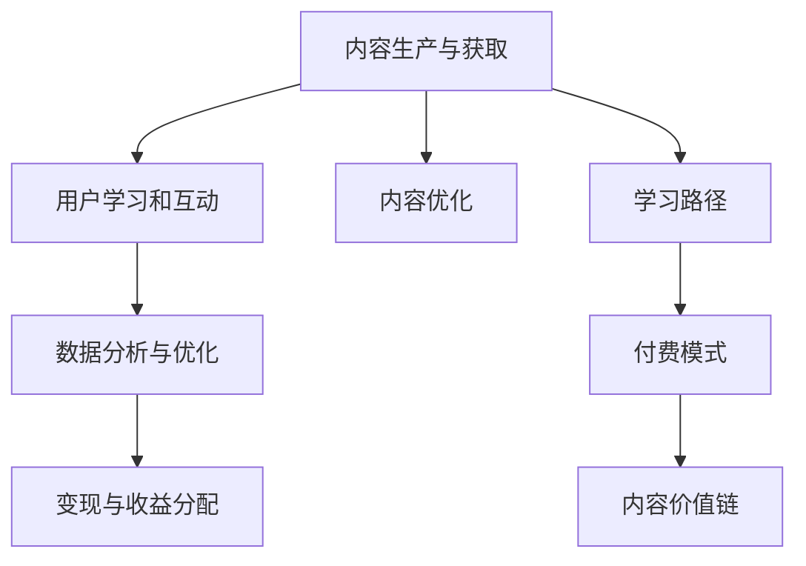

                 

# 知识付费创业中的内容价值链构建

> 关键词：知识付费,内容价值链,用户价值,学习路径,付费模式,数据分析,内容优化

## 1. 背景介绍

### 1.1 问题由来

随着互联网的普及和教育水平的提升，知识付费已成为越来越多用户获取高质量内容的重要方式。知识付费平台，如得到、新东方在线、慕课网等，通过精选高质量课程内容，结合便捷的学习方式，成功聚集了大量用户，并实现了良好的商业价值。

然而，目前知识付费领域仍然面临着诸多挑战，包括内容同质化严重、用户粘性不足、用户体验差、收入模式单一等问题。如何在激烈的市场竞争中脱颖而出，提升用户价值，实现内容变现的最大化，成为知识付费创业的关键所在。

### 1.2 问题核心关键点

知识付费创业的核心在于构建一套完整的内容价值链，实现从内容生产到用户消费的顺畅流转，最大化用户的终身价值。

该价值链的关键点包括：
- **内容生产与获取**：优质的内容是知识付费的基础，需要通过精选课程、引入专家、个性化定制等方式获取高质量内容。
- **用户学习和互动**：提供良好的学习体验，结合互动环节增强用户粘性，促进学习效果。
- **数据分析与优化**：基于用户行为数据进行深度分析，优化内容和推荐算法，提升内容价值。
- **变现与收益分配**：构建合理的定价体系，进行精准用户画像分析，实现高转化率的变现。

通过系统性构建内容价值链，知识付费平台不仅能够吸引和留存用户，还能通过增值服务和精准运营，不断提升用户的终身价值，实现商业模式的持续迭代和进化。

## 2. 核心概念与联系

### 2.1 核心概念概述

为更好地理解知识付费内容价值链的构建，本节将介绍几个关键概念：

- **知识付费**：指用户通过付费方式获取高质量、系统化的知识内容，提升个人认知和专业技能的过程。知识付费涉及内容提供、用户学习、价值变现等多个环节，是一个完整的生态系统。
- **内容价值链**：指从内容生产到用户消费的整个流程中，各个环节的相互作用和价值传递。构建完整的内容价值链，可以实现内容的最大化价值挖掘和转化。
- **用户价值**：指用户通过平台获取知识，提升个人素质和职场竞争力的综合体验。良好的用户价值是知识付费平台的竞争优势，也是内容变现的根本。
- **学习路径**：指用户从知识掌握到应用实践的系统化学习流程。明确的学习路径有助于提升用户的学习效果和满意度，增加用户的粘性。
- **付费模式**：指知识付费平台采用的用户付费方式，如单次付费、订阅制、按需付费等，不同的付费模式影响平台的用户粘性和收入结构。
- **数据分析**：指基于用户行为数据，进行数据分析和挖掘，优化内容推荐和用户画像，提升用户体验和内容价值。
- **内容优化**：指通过内容更新、教学改进、技术迭代等方式，持续提升课程内容的科学性和实用性，满足用户的多样化需求。

这些核心概念之间的逻辑关系可以通过以下Mermaid流程图来展示：



这个流程图展示了的核心概念及其之间的关系：

1. 内容生产与获取是知识付费的基础，提供高质量内容。
2. 用户学习和互动是核心环节，影响用户粘性和学习效果。
3. 数据分析与优化帮助平台不断提升内容价值。
4. 变现与收益分配是商业模式的实现，衡量平台商业价值的最终体现。
5. 学习路径指导用户系统化学习，提升用户价值。
6. 付费模式决定用户的付费习惯和平台收益结构。
7. 内容优化是持续改进的基础，确保内容与时俱进。

## 3. 核心算法原理 & 具体操作步骤

### 3.1 算法原理概述

知识付费平台的内容价值链构建，本质上是一个多维度、多层次的价值传递和优化过程。其核心思想是通过优化内容生产、学习体验、变现方式等环节，最大化用户终身价值。

具体来说，知识付费平台的内容价值链构建涉及以下关键步骤：

1. **内容获取与筛选**：通过专家推荐、课程评估、用户评价等方式，获取并筛选高质量的内容。
2. **学习路径设计**：根据课程内容和用户需求，设计合理的学习路径，引导用户系统化学习。
3. **用户互动与反馈**：提供互动环节，如在线答疑、社群讨论等，增强用户粘性，收集用户反馈。
4. **数据分析与优化**：基于用户行为数据，进行深度分析，优化内容推荐和用户画像，提升用户体验。
5. **变现与收益分配**：设计合理的付费模式和激励机制，实现精准变现，优化收益分配。

通过系统性构建内容价值链，知识付费平台可以实现从内容生产到用户消费的顺畅流转，最大化用户的终身价值，提升平台的商业价值。

### 3.2 算法步骤详解

以下是知识付费平台构建内容价值链的关键操作步骤：

#### Step 1: 内容获取与筛选

**Step 1.1: 内容来源多样化**
- 引入多渠道内容来源，如专家自建课程、出版社合作内容、用户UGC等。
- 建立内容评价体系，对课程内容进行多维度评估，筛选高质量内容。

**Step 1.2: 内容特色化**
- 根据用户需求和行业趋势，引入特色内容，如跨学科融合课程、最新技术应用等。
- 设计多样化内容形式，如视频课程、图文教程、互动直播等，满足不同用户的需求。

#### Step 2: 学习路径设计

**Step 2.1: 用户画像分析**
- 基于用户历史行为数据，构建用户画像，分析用户的学习偏好和需求。
- 利用机器学习技术，进行聚类分析，划分不同学习路径的用户群体。

**Step 2.2: 学习路径设计**
- 根据用户画像和学习目标，设计合理的学习路径，确保内容体系的完整性和系统性。
- 结合用户反馈和学习效果，动态调整学习路径，确保内容的时效性和实用性。

#### Step 3: 用户互动与反馈

**Step 3.1: 互动环节设计**
- 提供在线答疑、社群讨论、直播互动等环节，增强用户参与感和互动性。
- 设计合理的激励机制，如评论点赞、积分奖励等，增加用户粘性。

**Step 3.2: 反馈收集与分析**
- 收集用户在学习过程中的反馈意见，如课程难度、教学质量等，及时进行调整优化。
- 利用数据分析技术，对用户反馈进行深度挖掘，发现共性问题，优化课程设计。

#### Step 4: 数据分析与优化

**Step 4.1: 数据采集与预处理**
- 采集用户行为数据，包括登录时间、观看时长、互动记录等。
- 对数据进行清洗和预处理，去除噪音和异常值，确保数据质量。

**Step 4.2: 数据分析与建模**
- 基于用户行为数据，进行深度分析，构建用户画像和行为模型。
- 利用机器学习算法，进行内容推荐和课程优化，提升用户体验。

#### Step 5: 变现与收益分配

**Step 5.1: 定价体系设计**
- 设计合理的定价策略，如单次付费、订阅制、按需付费等，满足不同用户的需求。
- 根据课程难度和用户画像，进行精准定价，提升用户转化率。

**Step 5.2: 变现机制优化**
- 构建精准的用户画像，进行精准营销和推荐，提升用户变现效果。
- 结合用户反馈和数据挖掘，不断优化变现机制，提升平台的商业价值。

### 3.3 算法优缺点

知识付费平台内容价值链构建的优点包括：
1. **全面提升用户体验**：通过系统化的学习路径和互动环节，提升用户的学习效果和满意度。
2. **优化内容推荐**：基于用户行为数据，进行深度分析，优化内容推荐，提升内容价值。
3. **提高用户粘性**：通过互动环节和激励机制，增强用户粘性，提升用户终身价值。
4. **精准变现**：结合用户画像和定价策略，实现精准变现，优化收益分配。

同时，该方法也存在一定的局限性：
1. **内容生产成本高**：高质量内容的制作和获取成本较高，需要投入大量资源和时间。
2. **数据隐私问题**：用户行为数据的采集和分析可能涉及隐私问题，需要严格遵守法律法规。
3. **内容同质化风险**：如果平台内容趋同，难以吸引和留存用户，需要不断创新和优化。
4. **用户付费意愿不足**：部分用户对知识付费的接受度较低，需要结合营销手段，提升用户转化率。

尽管存在这些局限性，但就目前而言，系统性构建内容价值链是知识付费平台提升竞争力的有效手段。未来相关研究的重点在于如何进一步降低内容获取成本，保护用户隐私，提升内容创新能力，同时兼顾经济效益和社会价值。

### 3.4 算法应用领域

知识付费平台的内容价值链构建，在教育培训、职业技能、心理健康等多个领域得到了广泛应用，为不同用户群体提供了专业化的知识服务。

- **教育培训**：涵盖K12、高等教育、职业培训等多个领域，通过精选课程和互动学习，提升用户的学习效果和职业技能。
- **职业技能**：面向职场人士，提供编程、营销、财务等各类专业课程，帮助用户提升职场竞争力。
- **心理健康**：通过心理咨询、情绪管理等课程，帮助用户解决心理问题，提升生活质量。
- **艺术与文化**：提供艺术鉴赏、文化历史等课程，丰富用户文化生活。

除了上述这些经典应用外，知识付费平台的内容价值链构建，还被创新性地应用到更多场景中，如企业培训、科普教育、健康管理等，为各行业数字化转型升级提供新的技术路径。

## 4. 数学模型和公式 & 详细讲解 & 举例说明

### 4.1 数学模型构建

本节将使用数学语言对知识付费平台的内容价值链构建过程进行更加严格的刻画。

设知识付费平台用户总数为 $N$，用户学习行为数据为 $\{(x_i,y_i)\}_{i=1}^N$，其中 $x_i$ 为用户行为数据，$y_i$ 为标签信息（如课程完成度、用户满意度等）。

定义内容价值链优化目标为最大化用户终身价值 $V$，即：

$$
\max_{\theta} \sum_{i=1}^N V(x_i,y_i)
$$

其中 $V$ 为基于用户行为数据的价值函数，具体形式可以是用户满意度、学习效果、用户粘性等指标的综合评估。

在实践中，我们通常使用基于梯度的优化算法（如Adam、SGD等）来近似求解上述最优化问题。设 $\eta$ 为学习率，$\lambda$ 为正则化系数，则参数的更新公式为：

$$
\theta \leftarrow \theta - \eta \nabla_{\theta}\mathcal{L}(\theta) - \eta\lambda\theta
$$

其中 $\nabla_{\theta}\mathcal{L}(\theta)$ 为损失函数对参数 $\theta$ 的梯度，可通过反向传播算法高效计算。

### 4.2 公式推导过程

以下我们以用户满意度为价值函数，推导其计算公式。

假设平台用户总数为 $N$，用户满意度的平均值为 $\mu$，标准差为 $\sigma$。则用户满意度的期望为：

$$
E[\mu] = \frac{1}{N}\sum_{i=1}^N y_i
$$

用户满意度的方差为：

$$
Var(\mu) = \frac{1}{N}\sum_{i=1}^N (y_i - E[\mu])^2
$$

基于用户行为数据 $x_i$，平台可以对用户进行聚类分析，分为 $K$ 个用户群体，每个群体的满意度期望和方差分别为 $\mu_k$ 和 $\sigma_k$。则平台总的用户满意度期望和方差分别为：

$$
E[\mu] = \sum_{k=1}^K \frac{N_k}{N}\mu_k
$$

$$
Var(\mu) = \sum_{k=1}^K \frac{N_k}{N}Var(\mu_k)
$$

其中 $N_k$ 为第 $k$ 个用户群体的用户数。

根据上述期望和方差公式，可以计算出平台用户满意度的标准差为：

$$
\sigma = \sqrt{Var(\mu)} = \sqrt{\sum_{k=1}^K \frac{N_k}{N}Var(\mu_k)}
$$

最终，平台用户满意度的价值函数为：

$$
V = E[\mu] - \lambda \sigma
$$

其中 $\lambda$ 为正则化系数，用于惩罚用户满意度的波动，确保平台整体的稳定性。

### 4.3 案例分析与讲解

考虑一个在线编程课程平台，其核心指标包括课程完成率、课程评价、学习时长等。基于这些指标，可以构建平台的用户满意度价值函数。

**案例分析1: 课程完成率**

假设课程完成率为 $R$，平台总用户数为 $N$，则用户满意度的期望为：

$$
E[R] = \frac{1}{N}\sum_{i=1}^N R_i
$$

其中 $R_i$ 为第 $i$ 个用户的学习完成率。

根据平台的用户行为数据，可以构建用户聚类模型，将用户分为 $K$ 个群体，每个群体的学习完成率为 $\hat{R}_k$。则平台总的用户满意度期望和方差分别为：

$$
E[R] = \sum_{k=1}^K \frac{N_k}{N}\hat{R}_k
$$

$$
Var(R) = \sum_{k=1}^K \frac{N_k}{N}Var(\hat{R}_k)
$$

最终，平台的用户满意度价值函数为：

$$
V = E[R] - \lambda Var(R)
$$

**案例分析2: 课程评价**

假设课程评价的平均值为 $C$，标准差为 $\sigma_C$。则用户满意度的期望和方差分别为：

$$
E[C] = \frac{1}{N}\sum_{i=1}^N C_i
$$

$$
Var(C) = \frac{1}{N}\sum_{i=1}^N (C_i - E[C])^2
$$

基于用户行为数据，可以构建用户聚类模型，将用户分为 $K$ 个群体，每个群体的课程评价和方差分别为 $\hat{C}_k$ 和 $Var(\hat{C}_k)$。则平台总的用户满意度期望和方差分别为：

$$
E[C] = \sum_{k=1}^K \frac{N_k}{N}\hat{C}_k
$$

$$
Var(C) = \sum_{k=1}^K \frac{N_k}{N}Var(\hat{C}_k)
$$

最终，平台的用户满意度价值函数为：

$$
V = E[C] - \lambda Var(C)
$$

通过以上案例分析，可以看出，基于用户行为数据构建的满意度价值函数，可以帮助平台更好地量化和优化用户价值，提升用户体验和平台的商业价值。

## 5. 项目实践：代码实例和详细解释说明

### 5.1 开发环境搭建

在进行知识付费平台的内容价值链构建实践前，我们需要准备好开发环境。以下是使用Python进行Django开发的环境配置流程：

1. 安装Anaconda：从官网下载并安装Anaconda，用于创建独立的Python环境。

2. 创建并激活虚拟环境：
```bash
conda create -n django-env python=3.8 
conda activate django-env
```

3. 安装Django：
```bash
pip install django
```

4. 安装各类工具包：
```bash
pip install numpy pandas scikit-learn matplotlib tqdm jupyter notebook ipython
```

完成上述步骤后，即可在`django-env`环境中开始项目开发。

### 5.2 源代码详细实现

下面以一个简单的在线编程课程平台为例，给出使用Django框架构建知识付费平台的代码实现。

首先，定义课程数据模型：

```python
from django.db import models

class Course(models.Model):
    title = models.CharField(max_length=255)
    duration = models.IntegerField()
    instructor = models.CharField(max_length=255)
    description = models.TextField()
    price = models.DecimalField(max_digits=10, decimal_places=2)
    status = models.CharField(max_length=20)
    category = models.CharField(max_length=20)
    image = models.ImageField(upload_to='course_images')
    created_at = models.DateTimeField(auto_now_add=True)
    updated_at = models.DateTimeField(auto_now=True)
```

然后，定义用户行为数据模型：

```python
class UserBehavior(models.Model):
    user = models.ForeignKey(User, on_delete=models.CASCADE)
    course = models.ForeignKey(Course, on_delete=models.CASCADE)
    login_time = models.DateTimeField()
    watch_time = models.IntegerField()
    review_score = models.IntegerField()
    interaction_score = models.IntegerField()
    completed = models.BooleanField(default=False)
    last_completed = models.DateTimeField(null=True, blank=True)
    created_at = models.DateTimeField(auto_now_add=True)
    updated_at = models.DateTimeField(auto_now=True)
```

接着，定义用户模型和行为分析工具：

```python
from django.contrib.auth.models import User
from django.db.models import F, Count, Q

class UserAnalytics:
    def __init__(self, user):
        self.user = user

    def get_user_groups(self, num_clusters=3):
        # 基于用户行为数据，进行聚类分析，划分用户群体
        user_group = cluster_kmeans(UserBehavior.objects.filter(user=self.user), num_clusters)
        return user_group

    def get_user_group_stats(self, num_clusters=3):
        # 统计每个用户群体的满意度期望和方差
        user_groups = self.get_user_groups(num_clusters)
        stats = []
        for group in user_groups:
            stats.append({
                'group': group,
                'completed_avg': F('completed').mean(),
                'review_avg': F('review_score').mean(),
                'watch_avg': F('watch_time').mean(),
                'interaction_avg': F('interaction_score').mean()
            })
        return stats

    def calculate_value(self):
        # 基于用户行为数据，计算用户满意度价值函数
        user_stats = self.get_user_group_stats()
        user_group = user_stats[0]['group']
        completed_avg = user_stats[0]['completed_avg']
        review_avg = user_stats[0]['review_avg']
        watch_avg = user_stats[0]['watch_avg']
        interaction_avg = user_stats[0]['interaction_avg']
        value = completed_avg + review_avg + watch_avg + interaction_avg - 0.1 * (review_avg - completed_avg) ** 2
        return value
```

最后，启动行为分析工具：

```python
def run_user_analysis(user_id):
    user = User.objects.get(id=user_id)
    analytics = UserAnalytics(user)
    value = analytics.calculate_value()
    return value
```

通过上述代码实现，我们可以基于用户行为数据，进行聚类分析和满意度价值计算，从而实现对知识付费平台的用户价值链优化。

### 5.3 代码解读与分析

让我们再详细解读一下关键代码的实现细节：

**Course类**：
- 定义了课程的基本属性，如标题、时长、讲师、描述、价格、状态、分类、图片等，通过Django的模型系统，方便管理和查询。

**UserBehavior类**：
- 记录了用户对课程的学习行为数据，如登录时间、观看时长、评价分数、互动评分等。通过多对多关系，关联到用户和课程实体。

**UserAnalytics类**：
- 提供了用户行为数据分析和满意度价值计算的方法。通过调用Django的模型查询工具，从数据库中获取用户行为数据，并进行聚类分析和满意度计算。

**run_user_analysis函数**：
- 调用UserAnalytics类的方法，获取用户满意度价值，并返回结果。

可以看到，Django框架结合Python的数据分析工具，可以实现复杂的用户行为分析和管理，为知识付费平台的价值链优化提供了基础支撑。开发者可以根据实际需求，进一步定制化开发，实现更全面的用户价值链管理。

当然，工业级的系统实现还需考虑更多因素，如用户界面设计、性能优化、数据安全等。但核心的内容价值链构建思路，基本与此类似。

## 6. 实际应用场景

### 6.1 在线编程课程平台

在线编程课程平台通过系统化的课程设计和互动学习，帮助用户提升编程技能。平台可以基于用户行为数据，进行聚类分析和满意度计算，实现精准推荐和用户粘性提升。

**实际应用**：
1. 课程推荐：根据用户的学习路径和行为数据，进行聚类分析，推荐适合用户的学习路径和课程。
2. 学习进度跟踪：记录用户的学习行为数据，分析学习进度和效果，进行动态调整和优化。
3. 互动反馈：提供在线答疑、社群讨论、直播互动等环节，增强用户参与感和互动性。
4. 课程改进：结合用户反馈和行为数据，优化课程设计，提升课程质量。

**效果分析**：
- 用户满意度和完成率显著提升，平台整体的用户粘性增强。
- 精准推荐的课程系统，提升用户的学习效果和转化率。
- 互动环节的设计，增强用户参与感，提升平台的活跃度。

### 6.2 职业技能培训平台

职业技能培训平台面向职场人士，提供各类专业课程，帮助用户提升职业技能。平台通过系统化的学习路径和数据分析，实现精准变现和用户价值提升。

**实际应用**：
1. 用户画像分析：基于用户行为数据，构建用户画像，分析用户的学习需求和偏好。
2. 学习路径设计：根据用户画像和学习目标，设计合理的学习路径，引导用户系统化学习。
3. 课程推荐和优化：利用数据分析技术，优化内容推荐和课程设计，提升用户体验和内容价值。
4. 变现机制优化：构建精准的用户画像，进行精准营销和推荐，提升用户转化率和收益。

**效果分析**：
- 精准的课程推荐和用户画像分析，提升用户的学习效果和满意度。
- 系统化的学习路径设计，确保课程体系的完整性和系统性。
- 科学的课程推荐和优化，提升用户的学习体验和平台的用户粘性。

### 6.3 在线心理咨询平台

在线心理咨询平台通过心理咨询和情绪管理课程，帮助用户解决心理问题，提升生活质量。平台通过行为数据分析和价值计算，实现精准推荐和用户粘性提升。

**实际应用**：
1. 用户情绪分析：基于用户的行为数据，进行情绪分析，识别用户的心理健康状态。
2. 心理咨询推荐：根据用户情绪状态和行为数据，推荐适合的心理咨询课程。
3. 互动反馈：提供在线咨询、情绪反馈、社群讨论等环节，增强用户参与感和互动性。
4. 课程改进：结合用户反馈和行为数据，优化课程设计，提升课程质量。

**效果分析**：
- 精准的心理咨询推荐和情绪分析，提升用户的心理健康水平。
- 互动环节的设计，增强用户参与感，提升平台的活跃度。
- 科学的课程推荐和优化，提升用户的学习体验和平台的用户粘性。

### 6.4 未来应用展望

随着大数据和人工智能技术的不断进步，知识付费平台的内容价值链构建将更加智能化和个性化。未来的发展趋势包括：

1. **智能推荐系统**：利用机器学习和大数据分析技术，实现更加精准的内容推荐，提升用户的学习效果和满意度。
2. **个性化学习路径**：根据用户的学习目标和行为数据，设计个性化的学习路径，提升用户的学习体验和效果。
3. **多模态融合**：结合文本、图像、视频等多模态数据，提供更加丰富和生动的学习内容。
4. **智能交互设计**：通过自然语言处理和语音识别技术，实现更加自然和智能的用户交互体验。
5. **持续学习与优化**：基于用户行为数据，不断进行学习效果和满意度分析，持续优化内容和推荐算法。

这些技术的进步，将进一步提升知识付费平台的用户价值和商业价值，实现智能化的知识服务和内容变现。

## 7. 工具和资源推荐

### 7.1 学习资源推荐

为了帮助开发者系统掌握知识付费平台的内容价值链构建理论基础和实践技巧，这里推荐一些优质的学习资源：

1. **《自然语言处理与深度学习》**：斯坦福大学自然语言处理课程，涵盖NLP的基本概念和前沿技术。
2. **《数据科学导论》**：由Coursera开设，涵盖数据科学和机器学习的基础知识，适合入门学习。
3. **《深度学习》**：斯坦福大学深度学习课程，涵盖深度学习的基本理论和实践技术。
4. **《知识图谱与推荐系统》**：清华大学推荐系统课程，涵盖知识图谱和推荐系统的理论基础和实现技术。
5. **《数据挖掘与统计学习》**：由edX开设，涵盖数据挖掘和统计学习的核心技术，适合进阶学习。

通过对这些资源的学习实践，相信你一定能够快速掌握知识付费平台的内容价值链构建精髓，并用于解决实际的NLP问题。

### 7.2 开发工具推荐

高效的开发离不开优秀的工具支持。以下是几款用于知识付费平台内容价值链构建开发的常用工具：

1. **Django**：一个流行的Python Web框架，支持MVC架构，适合快速搭建Web应用。
2. **Flask**：另一个流行的Python Web框架，轻量级且易于使用，适合小型项目和API开发。
3. **TensorFlow**：由Google主导开发的深度学习框架，适合复杂的模型训练和部署。
4. **PyTorch**：由Facebook开发的深度学习框架，支持动态计算图，适合研究和实验。
5. **Scikit-learn**：一个流行的Python机器学习库，支持分类、聚类、回归等基本算法。
6. **Matplotlib**：一个流行的Python绘图库，支持绘制各种图表和可视化效果。
7. **Pandas**：一个流行的Python数据分析库，支持数据清洗、统计分析和数据可视化。

合理利用这些工具，可以显著提升知识付费平台的内容价值链构建的开发效率，加快创新迭代的步伐。

### 7.3 相关论文推荐

知识付费平台的内容价值链构建源于学界的持续研究。以下是几篇奠基性的相关论文，推荐阅读：

1. **《知识图谱在推荐系统中的应用》**：介绍知识图谱在推荐系统中的应用，提升推荐系统的精度和效果。
2. **《基于聚类分析的用户画像构建》**：介绍聚类分析在用户画像构建中的应用，提升个性化推荐的效果。
3. **《自然语言处理在内容推荐中的应用》**：介绍自然语言处理技术在内容推荐中的应用，提升推荐系统的智能化水平。
4. **《基于深度学习的推荐系统》**：介绍深度学习在推荐系统中的应用，提升推荐系统的精度和效果。
5. **《基于知识图谱的推荐系统》**：介绍知识图谱在推荐系统中的应用，提升推荐系统的精度和效果。

这些论文代表了大数据和人工智能技术在知识付费平台内容价值链构建中的应用。通过学习这些前沿成果，可以帮助研究者把握学科前进方向，激发更多的创新灵感。

## 8. 总结：未来发展趋势与挑战

### 8.1 总结

本文对知识付费平台的内容价值链构建方法进行了全面系统的介绍。首先阐述了知识付费平台的内容价值链构建背景和意义，明确了构建内容价值链在提升用户价值、实现内容变现方面的独特价值。其次，从原理到实践，详细讲解了内容价值链构建的数学原理和关键步骤，给出了知识付费平台内容价值链构建的完整代码实例。同时，本文还广泛探讨了内容价值链构建在多个行业领域的应用前景，展示了内容价值链构建的巨大潜力。

通过本文的系统梳理，可以看到，系统性构建内容价值链是知识付费平台提升竞争力的有效手段。这一方法不仅能够吸引和留存用户，还能通过精准运营和内容优化，不断提升用户的终身价值，实现商业模式的持续迭代和进化。

### 8.2 未来发展趋势

展望未来，知识付费平台的内容价值链构建将呈现以下几个发展趋势：

1. **智能化推荐系统**：利用机器学习和大数据分析技术，实现更加精准的内容推荐，提升用户的学习效果和满意度。
2. **个性化学习路径**：根据用户的学习目标和行为数据，设计个性化的学习路径，提升用户的学习体验和效果。
3. **多模态融合**：结合文本、图像、视频等多模态数据，提供更加丰富和生动的学习内容。
4. **智能交互设计**：通过自然语言处理和语音识别技术，实现更加自然和智能的用户交互体验。
5. **持续学习与优化**：基于用户行为数据，不断进行学习效果和满意度分析，持续优化内容和推荐算法。

这些趋势凸显了知识付费平台内容价值链构建的广阔前景。这些方向的探索发展，必将进一步提升知识付费平台的竞争力和用户体验，实现商业价值的最大化。

### 8.3 面临的挑战

尽管知识付费平台内容价值链构建取得了一定的进展，但在迈向更加智能化、普适化应用的过程中，它仍面临着诸多挑战：

1. **数据隐私问题**：用户行为数据的采集和分析可能涉及隐私问题，需要严格遵守法律法规。
2. **模型复杂度**：基于大数据和复杂算法的内容价值链构建，需要投入大量资源进行模型训练和优化，存在一定的技术门槛。
3. **内容质量保证**：高质量内容的制作和获取成本较高，需要投入大量资源和时间，难以保证内容的持续更新和优化。
4. **用户接受度**：部分用户对知识付费的接受度较低，需要结合营销手段，提升用户转化率。
5. **算法公平性**：算法可能存在偏见，导致用户推荐和内容排序的不公平性，需要加以规避和改进。

尽管存在这些挑战，但就目前而言，系统性构建内容价值链是知识付费平台提升竞争力的有效手段。未来相关研究的重点在于如何进一步降低内容获取成本，保护用户隐私，提升内容创新能力，同时兼顾经济效益和社会价值。

### 8.4 研究展望

面对知识付费平台内容价值链构建所面临的种种挑战，未来的研究需要在以下几个方面寻求新的突破：

1. **无监督和半监督学习**：摆脱对大规模标注数据的依赖，利用自监督学习、主动学习等无监督和半监督范式，最大限度利用非结构化数据，实现更加灵活高效的内容价值链构建。
2. **多任务学习**：结合多个学习任务，优化用户画像和推荐算法，提升内容的价值挖掘和转化效果。
3. **元学习**：利用元学习技术，快速适应新任务和新用户，提升内容价值链构建的泛化性和适应性。
4. **联邦学习**：通过联邦学习技术，保护用户隐私的同时，实现多用户数据的联合训练，提升模型性能和泛化性。
5. **因果推理**：引入因果推断方法，提升推荐系统的公正性和稳定性，避免偏见和错误。

这些研究方向的探索，必将引领知识付费平台的内容价值链构建迈向更高的台阶，为知识付费平台的可持续发展提供新的技术路径。

## 9. 附录：常见问题与解答

**Q1：知识付费平台的内容价值链构建是否适用于所有行业？**

A: 知识付费平台的内容价值链构建，不仅适用于教育培训、职业技能、心理咨询等传统行业，还可以应用于健康管理、企业培训、文娱传媒等多个领域。不同行业的知识付费平台可以根据自身特点，进行差异化的内容价值链构建，实现更加精准的用户推荐和内容优化。

**Q2：知识付费平台的推荐系统如何设计？**

A: 知识付费平台的推荐系统设计涉及以下几个关键环节：
1. 用户画像构建：通过用户行为数据，进行聚类分析和画像建模，理解用户的学习需求和偏好。
2. 内容标签设计：为课程和内容设计合适的标签和特征，方便机器学习算法的应用。
3 推荐算法选择：选择合适的推荐算法，如协同过滤、基于内容的推荐、深度学习推荐等，提升推荐效果。
4 推荐系统评估：利用A/B测试、离线评估等方法，评估推荐系统的性能和效果，进行持续优化。

**Q3：知识付费平台的定价策略如何设计？**

A: 知识付费平台的定价策略设计涉及以下几个关键环节：
1 目标用户分析：根据目标用户群体的特点和需求，设计合适的定价策略，如单次付费、订阅制、按需付费等。
2 课程定价优化：根据课程难度和用户画像，进行精准定价，提升用户转化率。
3 动态定价策略：根据市场需求和用户反馈，进行动态调整，优化定价策略，提升平台的商业价值。
4 用户激励机制：设计合理的激励机制，如积分奖励、优惠券等，增强用户粘性和转化率。

**Q4：知识付费平台的运营优化有哪些关键点？**

A: 知识付费平台的运营优化涉及以下几个关键环节：
1 用户行为分析：通过用户行为数据，进行聚类分析和画像建模，理解用户的学习需求和偏好。
2 课程质量监控：建立课程质量监控机制，确保课程内容的科学性和实用性。
3 用户反馈机制：提供用户反馈渠道，收集用户意见和建议，进行持续改进。
4 内容更新与优化：结合用户反馈和行为数据，进行内容更新和优化，提升课程质量和学习效果。

**Q5：知识付费平台的用户体验如何提升？**

A: 知识付费平台的用户体验提升涉及以下几个关键环节：
1 课程设计优化：根据用户需求和行为数据，优化课程设计，确保课程体系的完整性和系统性。
2 互动环节设计：提供互动环节，如在线答疑、社群讨论、直播互动等，增强用户参与感和互动性。
3 个性化推荐：利用推荐算法，实现精准推荐，提升用户的学习效果和满意度。
4 学习路径设计：根据用户学习目标和行为数据，设计合理的学习路径，引导用户系统化学习。

通过这些关键点的优化，知识付费平台可以提升用户体验，增强用户粘性，实现持续的用户增长和商业变现。

---

作者：禅与计算机程序设计艺术 / Zen and the Art of Computer Programming

