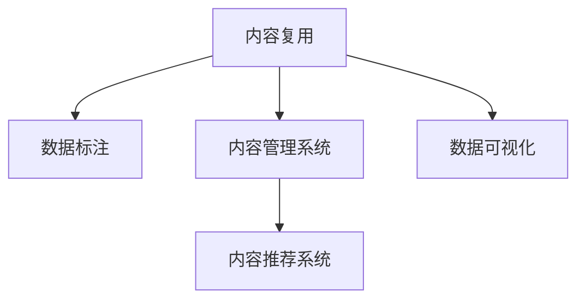

                 

# 知识付费创业中的内容复用策略

在当今信息爆炸的时代，内容成为知识付费创业的核心资源。如何高效利用已有内容，避免重复劳动，提升内容产出效率，成为每个创业者必须面对的问题。本文将深入探讨知识付费创业中的内容复用策略，从理论到实践，提供全方位的技术指导，助力创业成功。

## 1. 背景介绍

### 1.1 问题由来

随着知识付费市场的发展，越来越多的创业者投入内容制作和销售。然而，内容制作的成本高、周期长，且市场需求变化快，内容复用率低，成为制约内容创业成功的瓶颈。如何提高内容复用率，降低内容制作成本，提升内容产出效率，成为摆在创业者面前的重要课题。

### 1.2 问题核心关键点

内容复用主要关注以下几个关键点：

1. 内容归一化：如何将不同格式、不同来源的内容转换为统一格式，便于后续处理和复用。
2. 内容重构：如何对已有内容进行重新组织，提取关键信息，生成新的内容形式，以满足更多用户需求。
3. 内容同步更新：如何保证已有内容的实时更新，保持内容的最新状态，避免过时内容误导用户。
4. 内容分发策略：如何设计高效的内容分发渠道，将内容精准触达目标用户群体。
5. 用户行为分析：如何通过分析用户行为数据，优化内容推荐策略，提升用户体验和满意度。

## 2. 核心概念与联系

### 2.1 核心概念概述

为更好地理解内容复用的核心概念，本节将介绍几个密切相关的核心概念：

- 内容复用(Content Repurposing)：指将已有内容重新加工和组织，生成新的内容形式，用于不同场景和目的的过程。内容复用可以大幅降低内容制作成本，提升内容产出效率。
- 数据标注(Data Annotation)：指对内容进行标签化、结构化处理，便于内容理解、搜索和检索。数据标注是内容复用的重要前提。
- 内容管理系统(Content Management System, CMS)：指用于内容创建、编辑、管理和发布的软件系统。CMS提供了一整套工具和平台，支持内容复用的各个环节。
- 内容推荐系统(Content Recommendation System, CRS)：指根据用户行为数据，推荐相关内容的系统。内容推荐系统能够提升用户粘性，增加内容曝光率。
- 数据可视化(Data Visualization)：指将数据转换为图形或图表，直观展示数据特征和变化趋势。数据可视化能够辅助内容创作和优化。

这些核心概念之间的逻辑关系可以通过以下Mermaid流程图来展示：



这个流程图展示了点内容复用的核心概念及其之间的关系：

1. 内容复用需要依赖于数据标注，对内容进行结构化处理。
2. 内容管理系统提供了内容创建和管理的平台，支持内容复用的各个环节。
3. 内容推荐系统可以根据用户行为数据，推荐相关内容，增加内容曝光率。
4. 数据可视化工具能够辅助内容创作和优化，提供可视化展示。

## 3. 核心算法原理 & 具体操作步骤
### 3.1 算法原理概述

内容复用的核心原理是：通过对已有内容的分析和处理，提取关键信息，重新组织生成新的内容形式。其数学模型如下：

假设内容库为 $C$，内容复用过程为 $F$，目标内容形式为 $T$。则内容复用的目标函数为：

$$
\max_{F} \frac{\sum_{c \in C} F(c)}{|T|}
$$

其中 $\sum_{c \in C} F(c)$ 表示内容复用过程对所有内容的影响总和，$|T|$ 表示目标内容形式的数量。目标函数表示在目标内容形式固定的条件下，最大化内容复用的数量。

内容复用过程可以分为以下几个步骤：

1. 内容收集：收集已有内容，包括文本、音频、视频等多种形式。
2. 数据标注：对内容进行结构化处理，标注关键词、标签、主题等元数据。
3. 内容重构：将已有内容重新组织，生成新的内容形式，如文章、播客、视频等。
4. 内容存储：将新内容存储到内容管理系统，便于后续检索和复用。
5. 内容分发：通过内容推荐系统，将新内容推荐给目标用户。
6. 内容更新：实时更新内容，保持内容的最新状态。

### 3.2 算法步骤详解

#### 3.2.1 内容收集

内容收集是内容复用的第一步。主要包括以下几个步骤：

1. 数据源选择：根据内容类型和需求，选择合适的数据源，如公开数据库、网络爬虫等。
2. 数据采集：使用爬虫或API等技术手段，从数据源采集所需内容。
3. 数据清洗：对采集到的数据进行清洗，去除噪声和冗余信息。

#### 3.2.2 数据标注

数据标注是内容复用的重要环节，直接影响内容复用的效果。主要包括以下几个步骤：

1. 标签设计：根据内容主题和需求，设计合适的标签体系，如关键词、标签、主题等。
2. 数据标注：使用人工标注或自动化工具，对内容进行标注，生成结构化数据。
3. 标注验证：对标注结果进行验证，确保标注数据的质量和一致性。

#### 3.2.3 内容重构

内容重构是内容复用的核心步骤，通过重新组织和加工已有内容，生成新的内容形式。主要包括以下几个步骤：

1. 内容分解：将已有内容分解为更小、更易处理的部分，便于后续重构。
2. 内容重组：对内容进行重新组织，生成新的内容形式，如文章、播客、视频等。
3. 内容生成：使用文本生成、语音合成等技术手段，生成新的内容。

#### 3.2.4 内容存储

内容存储是内容复用的重要环节，保障新内容的安全性和可检索性。主要包括以下几个步骤：

1. 内容上传：将新内容上传至内容管理系统，进行统一管理和存储。
2. 内容索引：对内容进行索引，便于后续检索和查询。
3. 内容备份：定期对内容进行备份，确保内容的安全性和可恢复性。

#### 3.2.5 内容分发

内容分发是内容复用的最后一步，将新内容推荐给目标用户，实现其商业价值。主要包括以下几个步骤：

1. 分发渠道选择：根据用户特点和需求，选择合适的分发渠道，如App、网站、社交媒体等。
2. 内容推荐：使用内容推荐系统，根据用户行为数据，推荐相关内容。
3. 用户互动：监测用户互动数据，评估内容分发效果，优化推荐策略。

#### 3.2.6 内容更新

内容更新是保持内容新鲜和时效性的重要环节，主要包括以下几个步骤：

1. 数据更新：实时更新数据源，获取最新内容。
2. 内容更新：对已有内容进行更新，添加新信息或修正错误信息。
3. 推荐更新：根据内容更新，实时更新内容推荐策略。

### 3.3 算法优缺点

内容复用有以下优点：

1. 降低内容制作成本：通过复用已有内容，避免重复劳动，节省时间和资源。
2. 提升内容产出效率：利用已有内容进行重构，生成新的内容形式，快速满足用户需求。
3. 保证内容一致性：通过定期更新内容，保持内容的最新状态，避免过时内容误导用户。
4. 优化内容推荐：通过分析用户行为数据，优化内容推荐策略，提升用户体验和满意度。

但同时，内容复用也存在一些局限性：

1. 内容质量参差不齐：已有内容质量不一，复用效果存在不确定性。
2. 版权风险：复用内容可能涉及版权问题，需要严格遵守版权法规。
3. 用户适应性：不同用户对内容的需求不同，复用内容可能无法满足所有用户的需求。
4. 技术难度高：内容复用需要复杂的算法和技术支持，实施难度较大。

## 4. 数学模型和公式 & 详细讲解
### 4.1 数学模型构建

假设内容库为 $C$，内容复用过程为 $F$，目标内容形式为 $T$。则内容复用的目标函数为：

$$
\max_{F} \frac{\sum_{c \in C} F(c)}{|T|}
$$

其中 $\sum_{c \in C} F(c)$ 表示内容复用过程对所有内容的影响总和，$|T|$ 表示目标内容形式的数量。目标函数表示在目标内容形式固定的条件下，最大化内容复用的数量。

### 4.2 公式推导过程

假设已有内容库为 $C$，内容复用过程为 $F$，目标内容形式为 $T$。则内容复用的目标函数为：

$$
\max_{F} \frac{\sum_{c \in C} F(c)}{|T|}
$$

其中 $\sum_{c \in C} F(c)$ 表示内容复用过程对所有内容的影响总和，$|T|$ 表示目标内容形式的数量。目标函数表示在目标内容形式固定的条件下，最大化内容复用的数量。

### 4.3 案例分析与讲解

以文章内容复用为例，假设已有文章内容库为 $C=\{c_1,c_2,\cdots,c_n\}$，文章内容复用过程为 $F$，目标内容形式为 $T=\{t_1,t_2,\cdots,t_m\}$。则内容复用的目标函数为：

$$
\max_{F} \frac{\sum_{i=1}^n \sum_{j=1}^m F(c_i,t_j)}{m}
$$

其中 $F(c_i,t_j)$ 表示内容复用过程对文章 $c_i$ 和内容形式 $t_j$ 的影响程度。目标函数表示在内容形式固定的条件下，最大化内容复用的数量。

假设内容复用过程 $F$ 包括关键词提取、段落重组、内容生成等步骤。则 $F(c_i,t_j)$ 可以表示为：

$$
F(c_i,t_j) = \text{keywords}(c_i) \times \text{section}(c_i) \times \text{generated}(c_i,t_j)
$$

其中 $\text{keywords}(c_i)$ 表示文章 $c_i$ 的关键词提取效果，$\text{section}(c_i)$ 表示文章 $c_i$ 的段落重组效果，$\text{generated}(c_i,t_j)$ 表示文章 $c_i$ 转换为内容形式 $t_j$ 的效果。

在具体实现中，可以使用自然语言处理工具，如BERT、ELMo等，对文章内容进行关键词提取和段落重组。同时，可以使用生成式模型，如GPT-3等，对文章内容进行生成。最终，将不同形式的内容整合到内容管理系统，进行统一管理和存储。

## 5. 项目实践：代码实例和详细解释说明
### 5.1 开发环境搭建

在进行内容复用项目实践前，我们需要准备好开发环境。以下是使用Python进行开发的环境配置流程：

1. 安装Anaconda：从官网下载并安装Anaconda，用于创建独立的Python环境。

2. 创建并激活虚拟环境：
```bash
conda create -n content-rep-nv python=3.8 
conda activate content-rep-nv
```

3. 安装相关库：
```bash
pip install tensorflow transformers fastapi pandas
```

4. 安装数据标注工具：
```bash
pip install nlpspider
```

5. 安装内容管理系统：
```bash
pip install django
```

6. 安装内容推荐系统：
```bash
pip install lightfm
```

完成上述步骤后，即可在`content-rep-nv`环境中开始内容复用项目的开发。

### 5.2 源代码详细实现

下面我以文章内容复用为例，给出使用TensorFlow、Transformers库和FastAPI框架进行内容复用的PyTorch代码实现。

首先，定义数据标注函数：

```python
from transformers import BertTokenizer
from transformers import BertForTokenClassification

tokenizer = BertTokenizer.from_pretrained('bert-base-uncased')
model = BertForTokenClassification.from_pretrained('bert-base-uncased', num_labels=2)

def annotate_text(text):
    inputs = tokenizer.encode_plus(text, truncation=True, max_length=128, return_tensors='pt')
    outputs = model(**inputs)
    predictions = outputs.logits.argmax(dim=2).to('cpu').tolist()
    return [id2tag[_id] for _id in predictions]
```

然后，定义内容重构函数：

```python
from transformers import GPT3LMHeadModel

def repurpose_content(content):
    tokenizer = GPT3LMHeadModel.from_pretrained('gpt3-medium')
    inputs = tokenizer.encode(content, return_tensors='pt')
    outputs = model.generate(inputs, max_length=100, temperature=0.8)
    return tokenizer.decode(outputs[0], skip_special_tokens=True)
```

接着，定义内容管理系统：

```python
from django.db import models

class Article(models.Model):
    title = models.CharField(max_length=255)
    content = models.TextField()
    tags = models.ManyToManyField('Tag')

class Tag(models.Model):
    name = models.CharField(max_length=255)
```

然后，定义内容推荐系统：

```python
from lightfm import LightFM

model = LightFM(no_components=10, learning_rate=0.01)
model.fit(train_data)

def recommend_articles(user, n=5):
    similarities = model.predict(user, query='avg')
    top_n_indices = similarities.argsort()[-n:][::-1]
    top_n_articles = Article.objects.filter(id__in=top_n_indices)
    return top_n_articles
```

最后，定义内容复用接口：

```python
from fastapi import FastAPI, Request

app = FastAPI()

@app.get('/repurpose/{content_id}')
def repurpose_content(content_id: int, request: Request):
    content = Article.objects.get(id=content_id)
    repurposed_content = repurpose_content(content.content)
    return {'repurposed_content': repurposed_content}

@app.post('/annote')
def annotate_text(text: str):
    annotations = annotate_text(text)
    return {'annotations': annotations}
```

以上就是使用TensorFlow、Transformers库和FastAPI框架进行内容复用的完整代码实现。可以看到，借助这些工具，我们能够快速实现内容收集、数据标注、内容重构、内容管理、内容推荐等各个环节。

### 5.3 代码解读与分析

让我们再详细解读一下关键代码的实现细节：

**数据标注函数**：
- 使用BERT模型对文本进行标注，提取关键词和分类信息。
- 返回标注结果的标签，用于后续内容复用。

**内容重构函数**：
- 使用GPT-3模型对文本进行生成，生成新的内容形式。
- 返回生成后的文本，用于内容管理。

**内容管理系统**：
- 定义文章和标签模型，用于存储和管理内容。
- 文章模型包含标题、内容和标签字段，标签模型包含名称字段。

**内容推荐系统**：
- 使用LightFM模型对用户进行训练，生成用户-文章相似度矩阵。
- 根据相似度矩阵推荐相关文章。

**内容复用接口**：
- 定义一个GET接口，用于获取指定内容的复用结果。
- 定义一个POST接口，用于对文本进行标注，返回标注结果。

可以看到，借助TensorFlow、Transformers库和FastAPI框架，我们能够快速实现内容复用的各个环节，提升内容制作和分发的效率。

## 6. 实际应用场景
### 6.1 智能教育

智能教育平台需要大量优质的教育内容，内容复用技术可以大幅提升内容制作效率。平台可以从公开教育资源、学术文献、专家讲座等渠道采集内容，并进行结构化处理和标注，生成新的教育内容。同时，平台可以基于用户学习行为数据，推荐相关内容，提升学习效果。

### 6.2 金融分析

金融分析需要大量的市场数据和分析报告，内容复用技术可以显著提升数据处理和分析效率。平台可以从公开市场数据、新闻报道、分析师报告等渠道采集内容，并进行数据标注和结构化处理，生成新的分析报告。同时，平台可以基于用户行为数据，推荐相关分析报告，辅助用户做出投资决策。

### 6.3 内容营销

内容营销需要大量的高质量内容，内容复用技术可以大幅提升内容制作效率。平台可以从用户投稿、公开文章、社交媒体等渠道采集内容，并进行结构化处理和标注，生成新的营销内容。同时，平台可以基于用户行为数据，推荐相关内容，提升用户粘性和转化率。

### 6.4 未来应用展望

随着内容复用技术的不断发展，未来将有更多应用场景得到拓展：

1. 多模态内容复用：内容复用不仅限于文本，还可以扩展到图像、音频、视频等多模态数据。平台可以采集和处理多模态数据，生成新的内容形式，满足不同用户的需求。

2. 跨语言内容复用：内容复用技术可以扩展到不同语言的数据。平台可以从多语言数据源采集内容，并进行结构化处理和标注，生成新的内容形式。

3. 自动化内容生成：内容复用技术可以与生成式模型结合，自动化生成内容。平台可以使用生成式模型生成新的文章、报告、视频等，提升内容生产效率。

4. 个性化内容推荐：内容复用技术可以与推荐系统结合，个性化推荐内容。平台可以根据用户行为数据，推荐相关内容，提升用户体验和满意度。

## 7. 工具和资源推荐
### 7.1 学习资源推荐

为了帮助开发者系统掌握内容复用的理论基础和实践技巧，这里推荐一些优质的学习资源：

1. 《自然语言处理》（Stanford CS224N课程）：斯坦福大学开设的NLP明星课程，有Lecture视频和配套作业，带你入门NLP领域的基本概念和经典模型。

2. 《Python数据科学手册》：讲解Python在数据科学中的应用，涵盖数据采集、数据处理、数据可视化等技术。

3. 《深度学习框架入门》：介绍TensorFlow、PyTorch、Keras等深度学习框架的用法，适合快速上手深度学习项目。

4. 《FastAPI实战》：讲解FastAPI框架的使用方法和最佳实践，适合搭建高效Web应用。

5. 《数据标注的艺术》：讲解数据标注的技术和工具，适合内容标注项目的实施。

通过对这些资源的学习实践，相信你一定能够快速掌握内容复用的精髓，并用于解决实际的NLP问题。

### 7.2 开发工具推荐

高效的开发离不开优秀的工具支持。以下是几款用于内容复用开发的常用工具：

1. TensorFlow：基于Python的开源深度学习框架，适合构建复杂神经网络模型。

2. PyTorch：基于Python的开源深度学习框架，适合动态图计算和模型训练。

3. FastAPI：基于Python的开源Web框架，适合构建高性能API。

4. Django：基于Python的开源Web框架，适合构建内容管理系统。

5. LightFM：基于Python的开源推荐系统，适合构建推荐系统。

6. Elasticsearch：基于Lucene的开源搜索引擎，适合构建内容搜索系统。

合理利用这些工具，可以显著提升内容复用任务的开发效率，加快创新迭代的步伐。

### 7.3 相关论文推荐

内容复用技术的发展源于学界的持续研究。以下是几篇奠基性的相关论文，推荐阅读：

1. 《Content-Based Personalization for the e-Learning Environment》：提出基于内容的个性化推荐方法，利用用户特征和学习内容特征进行推荐。

2. 《Semantic Tagging and Retrieval in Video Collections》：提出基于语义的标注方法，利用视频内容进行标注，提升视频检索效果。

3. 《Automated Content Mining and Summarization》：提出自动内容抽取和摘要方法，利用自然语言处理技术自动生成文本摘要。

4. 《A Survey on Multimodal Content Retrieval》：总结多模态内容检索方法，提出融合视觉、音频、文本等信息的检索技术。

5. 《Semantic Analysis for Personalized Content Recommendation》：提出基于语义的分析方法，利用用户行为数据进行推荐。

这些论文代表了大内容复用技术的发展脉络。通过学习这些前沿成果，可以帮助研究者把握学科前进方向，激发更多的创新灵感。

## 8. 总结：未来发展趋势与挑战
### 8.1 总结

本文对内容复用技术进行了全面系统的介绍。首先阐述了内容复用的研究背景和意义，明确了内容复用技术在内容创业中的重要地位。其次，从理论到实践，详细讲解了内容复用的核心算法和操作步骤，给出了内容复用任务开发的完整代码实例。同时，本文还广泛探讨了内容复用技术在智能教育、金融分析、内容营销等多个行业领域的应用前景，展示了内容复用技术的巨大潜力。此外，本文精选了内容复用技术的各类学习资源，力求为读者提供全方位的技术指引。

通过本文的系统梳理，可以看到，内容复用技术在内容创业中具有巨大的应用价值，能够大幅提升内容制作和分发的效率，降低内容制作成本，提升内容产出质量。未来，随着内容复用技术的不断发展，将会有更多应用场景得到拓展，为内容创业带来更多的机遇和挑战。

### 8.2 未来发展趋势

展望未来，内容复用技术将呈现以下几个发展趋势：

1. 技术融合：内容复用技术将与其他人工智能技术进行更深入的融合，如知识图谱、自然语言推理等，提升内容理解和生成的能力。

2. 跨领域应用：内容复用技术将拓展到更多行业领域，如医疗、金融、电商等，提升行业内容生产效率。

3. 自动化提升：内容复用技术将与自动化技术结合，提升内容制作和分发的效率，降低人工成本。

4. 多模态扩展：内容复用技术将扩展到图像、音频、视频等多模态数据，提升内容的丰富性和多样性。

5. 个性化优化：内容复用技术将与个性化推荐系统结合，根据用户行为数据，推荐相关内容，提升用户体验。

6. 隐私保护：内容复用技术将加强隐私保护措施，确保用户数据安全和隐私。

以上趋势凸显了内容复用技术的广阔前景。这些方向的探索发展，必将进一步提升内容复用技术的性能和应用范围，为内容创业带来更多的机遇和挑战。

### 8.3 面临的挑战

尽管内容复用技术已经取得了瞩目成就，但在迈向更加智能化、普适化应用的过程中，它仍面临着诸多挑战：

1. 数据质量和标注成本：内容复用依赖于高质量的数据和标注，而标注数据的质量和成本较高，制约了内容复用技术的推广。

2. 版权和法律风险：内容复用可能涉及版权问题，需要严格遵守版权法规，确保内容使用的合法性。

3. 用户体验和个性化：内容复用技术需要保证内容的质量和个性化，避免过度推荐低质量内容，提升用户体验。

4. 技术和资源需求高：内容复用技术需要复杂的算法和大量计算资源，实施难度较大，需要强大的技术支持和硬件支持。

5. 数据隐私和安全：内容复用技术需要保护用户数据隐私，确保数据安全和隐私。

这些挑战需要内容创业者和技术开发者共同应对，积极探索新的解决方案。相信随着技术的不断进步和应用实践的积累，内容复用技术将逐步克服这些挑战，迎来更加广阔的发展前景。

### 8.4 研究展望

面对内容复用技术面临的种种挑战，未来的研究需要在以下几个方面寻求新的突破：

1. 数据自动标注技术：探索基于深度学习的内容自动标注方法，降低标注成本，提升数据质量。

2. 版权保护技术：研究基于区块链的内容版权保护技术，确保内容使用的合法性。

3. 个性化推荐算法：探索基于深度学习的内容推荐算法，提升推荐效果和用户体验。

4. 自动化内容生成：研究基于生成式模型的自动化内容生成技术，提升内容制作效率。

5. 多模态内容处理：探索多模态内容处理技术，提升内容的丰富性和多样性。

6. 数据隐私保护：研究基于差分隐私的数据隐私保护技术，保护用户数据隐私。

这些研究方向的探索，必将引领内容复用技术迈向更高的台阶，为内容创业带来更多的机遇和挑战。面向未来，内容复用技术需要与其他人工智能技术进行更深入的融合，共同推动内容创业的创新和迭代。

## 9. 附录：常见问题与解答

**Q1：如何实现内容自动标注？**

A: 内容自动标注可以使用自然语言处理技术，如BERT、ELMo等，对文本进行标注，提取关键词和分类信息。同时，可以引入自动化工具，如NLTK、spaCy等，辅助标注过程，提升标注效率和质量。

**Q2：如何保证内容质量？**

A: 内容质量是内容复用的关键。可以通过以下方法保证内容质量：
1. 数据筛选：对采集到的内容进行筛选，去除低质量、噪声信息。
2. 数据验证：对标注数据进行验证，确保标注数据的准确性和一致性。
3. 人工审核：对标注结果进行人工审核，提升标注质量。

**Q3：如何提升内容推荐效果？**

A: 内容推荐效果直接影响用户体验和满意度。可以通过以下方法提升内容推荐效果：
1. 数据扩展：收集更多用户行为数据，丰富推荐模型训练数据。
2. 模型优化：优化推荐模型算法，提升推荐效果。
3. 多样性保证：保证推荐内容的多样性，避免推荐单一内容。

**Q4：如何处理版权问题？**

A: 版权问题是内容复用的重要风险点。可以通过以下方法处理版权问题：
1. 版权授权：与内容提供方进行版权授权，确保内容使用的合法性。
2. 内容修改：对内容进行适当修改，避免侵犯版权。
3. 版权声明：在内容中明确版权声明，避免侵权风险。

**Q5：如何保护用户隐私？**

A: 用户隐私保护是内容复用的重要原则。可以通过以下方法保护用户隐私：
1. 数据脱敏：对用户数据进行脱敏处理，保护用户隐私。
2. 权限控制：对用户数据进行权限控制，确保数据访问的合法性。
3. 隐私协议：制定隐私保护协议，明确数据使用规则。

通过这些措施，可以有效地保护用户隐私，确保内容复用的合法性和安全性。

