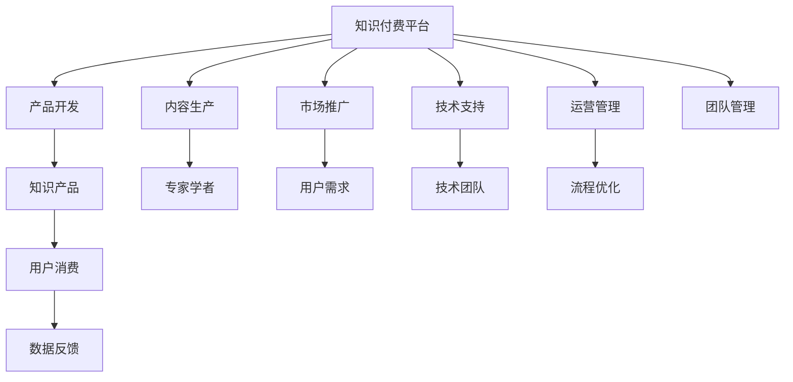

                 

## 1. 背景介绍

随着知识经济时代的到来，知识付费逐渐成为各行各业的重要发展趋势。知识付费平台不仅满足了人们对知识的渴求，也为创业者开辟了新的盈利模式。然而，知识付费创业并不仅仅是一个简单的商业模式，其背后涉及到的产品、运营、市场、技术等多个方面的问题同样不容忽视。而如何高效地组建和管理一支优秀的团队，则是知识付费创业成功的关键。

## 2. 核心概念与联系

### 2.1 核心概念概述

1. **知识付费**：是指用户通过付费获取知识、技能和信息的服务模式，如在线课程、电子书、音频、视频、咨询等。

2. **团队管理**：指管理者通过科学的组织方式和管理手段，充分调动团队成员的积极性，实现团队目标的过程。

3. **知识付费创业**：指以知识为基础，通过创新商业模式，提供知识产品和服务，并以此获取收益的创业活动。

### 2.2 核心概念原理和架构的 Mermaid 流程图



## 3. 核心算法原理 & 具体操作步骤

### 3.1 算法原理概述

知识付费创业中的团队管理涉及到产品、内容、市场、技术等多个环节，因此需要一个多学科交叉的管理架构。团队的每个成员都需要根据自身的专业技能和兴趣，选择相应的岗位，并以此来贡献自己的价值。团队管理的核心在于明确目标、建立信任、优化流程、有效沟通和激励机制。

### 3.2 算法步骤详解

1. **目标设定**：首先，需要明确公司的长远目标和短期目标，以及团队的具体任务和目标。这是团队管理的核心，所有的管理活动都应该围绕目标进行。

2. **岗位设置**：根据目标设定，确定团队中各个岗位的职责和分工。每个岗位需要根据自身职能，明确工作内容和绩效指标。

3. **人员招聘**：找到符合岗位要求的优秀人才，并进行面试、评估和培训。团队管理需要定期评估人员表现，及时调整岗位和职责。

4. **流程优化**：建立高效的流程和工具，提升团队的协作效率。如使用项目管理软件（如Jira）、版本控制工具（如Git）、文档协作工具（如Confluence）等。

5. **沟通机制**：建立有效沟通机制，如每日站会、周报、例会等。定期进行团队沟通，了解每个人的工作进展和问题，及时解决问题。

6. **激励机制**：设计合理的激励机制，激发团队成员的工作积极性和创造力。如绩效奖金、股权激励、职业培训等。

7. **绩效评估**：定期进行绩效评估，了解每个成员的表现，并给出相应的反馈和改进建议。

8. **文化建设**：建立良好的企业文化，提升团队凝聚力和归属感。

### 3.3 算法优缺点

**优点**：

1. **目标明确**：明确的团队目标和职责分工，可以帮助团队成员更好地理解自己的角色和任务。

2. **协作高效**：通过流程优化和沟通机制的建立，团队成员可以高效协作，提升工作效率。

3. **激励充分**：合理的激励机制可以激发团队成员的积极性和创造力，增强团队凝聚力。

**缺点**：

1. **管理复杂**：知识付费创业涉及多个环节，团队管理较为复杂，需要较多的时间和精力。

2. **人才竞争**：在知识付费领域，人才竞争激烈，招聘优质人才需要投入更多资源。

3. **风险管理**：团队管理需要处理各种不确定性和风险，如市场变化、技术变化等。

### 3.4 算法应用领域

知识付费创业中的团队管理不仅适用于知识付费平台，还适用于其他以知识为基础的创业领域，如在线教育、咨询、内容创作等。任何需要依赖知识、技术和创新思维的创业领域，都需要高效的团队管理作为支撑。

## 4. 数学模型和公式 & 详细讲解 & 举例说明

### 4.1 数学模型构建

我们可以使用加权图模型来描述知识付费创业中的团队管理。每个团队成员可以看作图中的节点，每个岗位的职责和关系可以看作图中的边。通过权重的调整，可以表示每个成员在团队中的重要性和贡献。

### 4.2 公式推导过程

假设团队中有 $n$ 个成员，每个成员 $i$ 的权重为 $w_i$，则加权图模型可以表示为：

$$
G(V,E,W) = (V, E, W)
$$

其中 $V$ 是节点集合，$E$ 是边集合，$W$ 是权重集合。

假设团队中有一个任务 $T$，每个成员对任务的贡献为 $c_i$，则任务总贡献为：

$$
C = \sum_{i=1}^{n} c_i
$$

假设每个成员的权重为 $w_i$，则任务总权重为：

$$
W_T = \sum_{i=1}^{n} w_i
$$

则任务的重要度为：

$$
I_T = \frac{C}{W_T}
$$

### 4.3 案例分析与讲解

假设一个知识付费创业团队中有三个成员，分别是产品开发经理（$w_1=0.5$）、内容生产经理（$w_2=0.3$）和技术支持经理（$w_3=0.2$）。他们各自对某个任务（如上线一个新课程）的贡献为：产品开发经理 $c_1=0.8$，内容生产经理 $c_2=0.7$，技术支持经理 $c_3=0.9$。则该任务的重要度为：

$$
I_T = \frac{0.8+0.7+0.9}{0.5+0.3+0.2} = 2.4
$$

这个数值表示该任务在团队中的重要程度，可以用来指导资源分配和管理。

## 5. 项目实践：代码实例和详细解释说明

### 5.1 开发环境搭建

1. **安装Python**：首先需要在团队成员的计算机上安装Python 3.7或以上版本。可以使用pip来安装Python包。

2. **安装团队管理工具**：如Jira、Git、Confluence等项目管理工具。

3. **配置代码仓库**：使用Git进行代码版本控制，建立团队代码仓库。

### 5.2 源代码详细实现

以下是一个简单的Python代码实现，用于团队任务管理：

```python
import jira

class TeamManagement:
    def __init__(self, jira_url, jira_user, jira_password):
        self.jira = jira.Jira(scheme='https', server=jira_url, basic_auth=(jira_user, jira_password))
        
    def get_task_info(self, task_id):
        task = self.jira.get_issue(task_id)
        return task.fields

    def add_task(self, task_name, description, assignee, priority):
        task = self.jira.create_issue(
            project='KnowledgePaid',
            summary=task_name,
            description=description,
            assignee=assignee,
            priority=priority
        )
        return task.key

    def update_task(self, task_id, status):
        task = self.jira.get_issue(task_id)
        task.update(status={'self': task_id, 'status': status})
```

### 5.3 代码解读与分析

该代码使用了Jira API，通过Python代码实现团队任务管理的功能。团队成员可以通过Jira来创建任务、获取任务信息和更新任务状态。

### 5.4 运行结果展示

以下是一个使用该代码创建任务和更新任务状态的示例：

```python
team_manager = TeamManagement('https://jira.example.com', 'user', 'password')

# 创建任务
task_id = team_manager.add_task('发布新课程', '发布上线新课程的详细计划', '张三', '高')

# 获取任务信息
task_info = team_manager.get_task_info(task_id)
print(task_info)

# 更新任务状态
team_manager.update_task(task_id, '待处理')
```

## 6. 实际应用场景

### 6.1 智能课程制作

在知识付费创业中，智能课程制作是一个重要的环节。一个课程从选题、脚本编写、录制、后期制作到发布，需要多方协作。团队管理可以确保各个环节的高效协同。

### 6.2 市场推广

知识付费创业需要市场推广来获取用户，团队管理可以确保推广活动的顺利进行。如通过Jira进行推广任务管理，确保每个推广活动的节点按时完成。

### 6.3 客户服务

在知识付费创业中，客户服务是一个关键的环节。团队管理可以确保客户服务的顺利进行，如通过Jira进行客户服务任务管理，确保每个客户问题及时解决。

### 6.4 未来应用展望

未来，知识付费创业中的团队管理将更加智能化和自动化。通过AI和大数据技术，可以实现任务自动分配、自动优化和自动反馈。例如，使用AI算法对任务完成情况进行预测，及时发现问题并进行调整。

## 7. 工具和资源推荐

### 7.1 学习资源推荐

1. **《项目管理与团队管理》**：一本关于项目管理与团队管理的经典书籍，可以提供系统的理论知识。

2. **Coursera的《项目管理》课程**：由斯坦福大学教授讲解的项目管理课程，系统介绍了项目管理的各个环节。

3. **Udemy的《团队管理》课程**：由知名企业高管讲解的团队管理课程，结合实际案例讲解团队管理技巧。

### 7.2 开发工具推荐

1. **Jira**：一个强大的项目管理工具，可以用于任务管理、问题跟踪和团队协作。

2. **Git**：一个流行的版本控制系统，可以用于代码版本控制和团队协作。

3. **Confluence**：一个文档协作工具，可以用于团队内部文档管理和知识共享。

### 7.3 相关论文推荐

1. **《基于多层次聚类的团队管理》**：探讨如何通过聚类算法对团队成员进行分组，提升团队协作效率。

2. **《知识图谱在知识付费中的作用》**：探讨如何通过知识图谱提升知识付费平台的知识组织和推荐效果。

## 8. 总结：未来发展趋势与挑战

### 8.1 研究成果总结

知识付费创业中的团队管理是一个多学科交叉的领域，涉及项目管理、团队协作、知识管理等多个方面。通过科学的管理方法，可以提升团队效率和协作效果，实现团队目标。

### 8.2 未来发展趋势

未来，知识付费创业中的团队管理将更加智能化、自动化和可视化。通过AI和大数据技术，可以实现任务自动分配、自动优化和自动反馈，提升团队协作效率和客户满意度。

### 8.3 面临的挑战

知识付费创业中的团队管理仍面临一些挑战，如人才招聘、激励机制、文化建设等。如何在快速变化的市场环境下，持续提升团队能力，是每个创业者需要面对的问题。

### 8.4 研究展望

未来，需要进一步研究如何通过AI和大数据技术，优化团队管理流程，提升团队协作效率和客户满意度。同时，需要关注团队成员的心理健康和职业发展，增强团队凝聚力和归属感。

## 9. 附录：常见问题与解答

### Q1: 知识付费创业中的团队管理主要涉及哪些方面？

A: 知识付费创业中的团队管理主要涉及任务管理、人员管理、流程管理、沟通管理、激励管理等多个方面。每个环节都需要高效、科学的管理方式。

### Q2: 如何提高知识付费创业中的团队管理效率？

A: 提高团队管理效率需要从多个方面入手，如选择合适的管理工具、建立高效的沟通机制、设计合理的激励机制等。同时，也需要团队成员的积极参与和合作。

### Q3: 知识付费创业中的团队管理面临哪些挑战？

A: 知识付费创业中的团队管理面临多个挑战，如人才招聘、激励机制、文化建设等。需要根据具体情况，灵活应对。

### Q4: 未来知识付费创业中的团队管理将如何发展？

A: 未来知识付费创业中的团队管理将更加智能化、自动化和可视化。通过AI和大数据技术，可以实现任务自动分配、自动优化和自动反馈，提升团队协作效率和客户满意度。

