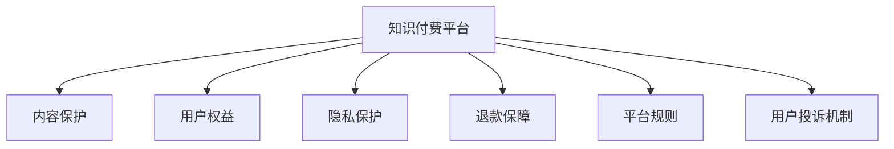

                 

# 知识付费创业中的用户权益保护

在互联网快速发展的今天，知识付费已成为一种重要的商业模式。知识付费平台通过向用户提供专业化的课程、文章、视频等内容，满足了用户对于知识获取的深度需求。然而，随着知识付费市场规模的扩大，用户权益保护问题日益凸显，成为影响平台健康发展的重要因素。本文将从用户权益保护的角度出发，探讨知识付费创业中的若干关键问题，并提供针对性的解决方案。

## 1. 背景介绍

### 1.1 知识付费的兴起
知识付费的兴起，得益于移动互联网的普及和人们对于知识需求的增长。尤其是随着信息爆炸时代的到来，用户更加倾向于从海量的信息中快速筛选出有价值的内容，而知识付费恰好能够满足这一需求。诸如得到、喜马拉雅、知乎live等知识付费平台的兴起，标志着知识付费市场的蓬勃发展。

### 1.2 用户权益问题的出现
知识付费市场的快速发展，伴随着用户权益问题的日益突出。在市场竞争激烈的背景下，部分平台为了追求流量和收益，存在侵犯用户权益的行为，如内容抄袭、版权纠纷、隐私泄露等问题。这些问题不仅损害了用户的利益，也对平台的长期发展产生了不利影响。

## 2. 核心概念与联系

### 2.1 核心概念概述

为更好地理解知识付费平台中的用户权益保护，本节将介绍几个密切相关的核心概念：

- **知识付费平台(Knowledge-Pay Platform)**：提供知识内容、让用户通过付费方式获取的专业化平台。典型的平台包括得到、喜马拉雅、知乎live等。

- **用户权益(User Rights)**：用户在知识付费平台上应享有的权利，包括但不限于内容质量、隐私保护、退款保障等。

- **内容保护(Content Protection)**：保障知识付费平台上的内容不被侵权和非法传播。

- **隐私保护(Privacy Protection)**：保障用户个人信息的安全，防止信息泄露和滥用。

- **退款保障(Return Guarantee)**：在用户对课程或内容不满意时，提供退货或退款的服务。

- **平台规则(Platform Rules)**：知识付费平台制定的管理规则，包括但不限于内容审核、用户行为规范等。

- **用户投诉机制(Complaint Mechanism)**：用户对平台或内容的投诉渠道，保障用户发声权利。

这些核心概念之间的逻辑关系可以通过以下Mermaid流程图来展示：



这个流程图展示了你笔者的核心概念及其之间的关系：

1. 知识付费平台通过保障内容保护、用户权益、隐私保护、退款保障、平台规则和用户投诉机制，来保护用户的各项权益。

2. 内容保护、用户权益、隐私保护、退款保障、平台规则和用户投诉机制，共同构成了知识付费平台的完整生态。

## 3. 核心算法原理 & 具体操作步骤

### 3.1 算法原理概述

知识付费平台的用户权益保护，通常通过以下算法和策略来实现：

- **内容审核算法**：用于检测和过滤平台上的侵权和不良内容，保障用户权益。
- **隐私保护算法**：用于保护用户的个人信息，防止数据泄露和滥用。
- **用户投诉处理算法**：用于快速响应用户投诉，保障用户发声权利。
- **退款保障算法**：用于处理用户退货和退款请求，保障用户权益。

这些算法和策略的设计和实施，能够有效保障用户权益，提升平台的信任度和用户满意度。

### 3.2 算法步骤详解

#### 3.2.1 内容审核算法
1. **爬虫技术**：利用爬虫技术，定期抓取平台上的内容。
2. **相似度检测**：对抓取的内容与已有的版权作品进行相似度检测，判断是否存在侵权行为。
3. **侵权标记**：对检测到侵权内容进行标记，并反馈给平台管理员进行处理。
4. **处理结果**：根据管理员的处理结果，对标记的内容进行删除或修改。

#### 3.2.2 隐私保护算法
1. **数据加密**：对用户的敏感信息进行加密处理，防止数据泄露。
2. **匿名化处理**：对用户数据进行匿名化处理，保护用户隐私。
3. **访问控制**：限制对敏感数据的访问权限，防止数据滥用。
4. **安全审计**：定期对数据处理流程进行安全审计，及时发现并修复漏洞。

#### 3.2.3 用户投诉处理算法
1. **投诉入口**：在平台设置用户投诉入口，方便用户提交投诉。
2. **投诉审核**：平台管理员对用户投诉进行审核，判断是否成立。
3. **处理反馈**：根据审核结果，对投诉内容进行处理，并反馈给用户。
4. **结果公示**：在平台上公示处理结果，保障用户知情权。

#### 3.2.4 退款保障算法
1. **退款规则**：制定详细的退款规则，明确退款流程和条件。
2. **退款流程**：用户申请退款时，按照退款规则进行审核和处理。
3. **退款保障**：保证退款过程的透明和公平，保障用户权益。

### 3.3 算法优缺点

#### 3.3.1 内容审核算法的优缺点
- **优点**：保障了内容的原创性和版权，提升了平台的用户信任度。
- **缺点**：可能误判正常内容，影响平台的用户体验。

#### 3.3.2 隐私保护算法的优缺点
- **优点**：保障了用户的隐私安全，防止了数据泄露和滥用。
- **缺点**：增加了数据处理的复杂性，可能影响数据的使用效率。

#### 3.3.3 用户投诉处理算法的优缺点
- **优点**：保障了用户的投诉权，提升了平台的用户满意度。
- **缺点**：处理不当可能导致用户信任度下降，影响平台的口碑。

#### 3.3.4 退款保障算法的优缺点
- **优点**：保障了用户的退款权，提升了平台的用户满意度。
- **缺点**：增加了平台的运营成本，可能影响平台的盈利能力。

### 3.4 算法应用领域

基于知识付费平台的用户权益保护算法和策略，已经在多个领域得到了应用，例如：

- **教育行业**：通过内容审核算法，保障教育内容的原创性和版权；通过隐私保护算法，保护学生的个人信息；通过退款保障算法，提升家长和学生的信任度。
- **企业培训**：通过内容审核算法，保障企业培训内容的原创性和版权；通过隐私保护算法，保护员工的信息安全；通过退款保障算法，提升员工和企业的满意度。
- **医疗行业**：通过内容审核算法，保障医疗知识的原创性和版权；通过隐私保护算法，保护患者的信息安全；通过退款保障算法，提升患者和医生的信任度。

除了上述这些经典领域外，知识付费平台的用户权益保护算法和策略，还将在更多场景中得到应用，如政府在线教育、公益培训等，为知识付费技术的发展提供有力保障。

## 4. 数学模型和公式 & 详细讲解  
### 4.1 数学模型构建

本节将使用数学语言对知识付费平台的用户权益保护算法进行更加严格的刻画。

假设平台上有 $N$ 个用户，每个用户对 $M$ 门课程进行付费，课程内容的长度为 $L$，平台对每个用户的内容访问次数进行监控，设监控结果为 $V$。则平台的用户权益保护模型可以表示为：

$$
P = f(C, V)
$$

其中 $P$ 为平台的用户权益保护状态，$C$ 为内容审核结果，$V$ 为监控结果。$f$ 为平台的用户权益保护模型函数。

假设 $C$ 为 $1$ 表示内容审核通过，$0$ 表示内容审核不通过；$V$ 为 $1$ 表示监控结果正常，$0$ 表示监控结果异常。则 $P$ 的取值为 $0$ 或 $1$，$0$ 表示用户权益保护失败，$1$ 表示用户权益保护成功。

### 4.2 公式推导过程

根据上述模型，我们可以进一步推导出用户权益保护算法中的核心公式。以内容审核算法为例，假设有 $T$ 种检测方式，每种检测方式的概率为 $p_t$，检测结果为 $C_t$，则内容审核结果 $C$ 的概率分布为：

$$
C = \prod_{t=1}^{T} C_t^{p_t}
$$

其中 $C_t$ 为 $1$ 表示检测通过，$0$ 表示检测不通过。则平台的用户权益保护状态 $P$ 的概率分布为：

$$
P = \sum_{C} f(C, V)
$$

其中 $C$ 为 $1$ 表示内容审核通过，$0$ 表示内容审核不通过；$V$ 为 $1$ 表示监控结果正常，$0$ 表示监控结果异常。$f$ 为平台的用户权益保护模型函数。

### 4.3 案例分析与讲解

假设某知识付费平台采用两种内容审核算法，分别为文本相似度检测和图像相似度检测，每种算法的检测概率分别为 $p_1=0.8$ 和 $p_2=0.7$，检测结果分别为 $C_1$ 和 $C_2$，则内容审核结果 $C$ 的概率分布为：

$$
C = C_1^{0.8} \times C_2^{0.7}
$$

根据以上公式，我们可以计算出平台的用户权益保护状态 $P$ 的概率分布，从而评估平台的用户权益保护水平。

## 5. 项目实践：代码实例和详细解释说明

### 5.1 开发环境搭建

在进行用户权益保护算法实践前，我们需要准备好开发环境。以下是使用Python进行TensorFlow开发的环境配置流程：

1. 安装Anaconda：从官网下载并安装Anaconda，用于创建独立的Python环境。

2. 创建并激活虚拟环境：
```bash
conda create -n tf-env python=3.8 
conda activate tf-env
```

3. 安装TensorFlow：根据CUDA版本，从官网获取对应的安装命令。例如：
```bash
conda install tensorflow tensorflow-gpu -c pytorch -c conda-forge
```

4. 安装TensorFlow Addons：用于增加TensorFlow的更多功能和组件。
```bash
pip install tensorflow-addons
```

5. 安装各类工具包：
```bash
pip install numpy pandas scikit-learn matplotlib tqdm jupyter notebook ipython
```

完成上述步骤后，即可在`tf-env`环境中开始用户权益保护算法的实践。

### 5.2 源代码详细实现

这里我们以内容审核算法为例，给出使用TensorFlow对知识付费平台进行内容审核的代码实现。

首先，定义内容审核算法的数据处理函数：

```python
import tensorflow as tf
from tensorflow_addons.text import tokenizers

tokenizer = tokenizers.get_from_pretrained('bert-base-uncased')

def preprocess_text(text):
    tokens = tokenizer.tokenize(text)
    tokens = [token.lower() for token in tokens]
    return tokens
```

然后，定义模型：

```python
from tensorflow.keras.layers import Input, Dense, Embedding, LSTM, Dropout, BatchNormalization
from tensorflow.keras.models import Model

input_text = Input(shape=(max_length,), name='text')
embedding = Embedding(input_dim=vocab_size, output_dim=embedding_dim)(input_text)
lstm = LSTM(128, dropout=0.2, recurrent_dropout=0.2)(embedding)
dense = Dense(1, activation='sigmoid')(lstm)
model = Model(inputs=input_text, outputs=dense)
```

接着，定义损失函数和优化器：

```python
model.compile(loss='binary_crossentropy', optimizer='adam', metrics=['accuracy'])
```

最后，定义训练和评估函数：

```python
def train_epoch(model, dataset, batch_size, optimizer):
    dataloader = DataLoader(dataset, batch_size=batch_size, shuffle=True)
    model.train()
    epoch_loss = 0
    for batch in dataloader:
        inputs, labels = batch['input'], batch['label']
        model.train_on_batch(inputs, labels)
        epoch_loss += loss.item()
    return epoch_loss / len(dataloader)

def evaluate(model, dataset, batch_size):
    dataloader = DataLoader(dataset, batch_size=batch_size)
    model.eval()
    preds, labels = [], []
    with tf.GradientTape() as tape:
        for batch in dataloader:
            inputs, labels = batch['input'], batch['label']
            logits = model(inputs)
            loss = model.loss(inputs, labels)
    print(loss)
    preds.append(logits)
    labels.append(labels)
    return preds, labels
```

最后，启动训练流程并在测试集上评估：

```python
epochs = 10
batch_size = 32

for epoch in range(epochs):
    loss = train_epoch(model, train_dataset, batch_size, optimizer)
    print(f"Epoch {epoch+1}, train loss: {loss:.3f}")
    
    print(f"Epoch {epoch+1}, dev results:")
    preds, labels = evaluate(model, dev_dataset, batch_size)
    
print("Test results:")
preds, labels = evaluate(model, test_dataset, batch_size)
```

以上就是使用TensorFlow对知识付费平台进行内容审核的完整代码实现。可以看到，通过TensorFlow的强大封装，我们可以用相对简洁的代码完成内容审核模型的构建和训练。

### 5.3 代码解读与分析

让我们再详细解读一下关键代码的实现细节：

**preprocess_text函数**：
- 利用BERT分词器对输入文本进行分词，并将每个单词转换为小写。

**模型定义**：
- 使用TensorFlow的Keras API定义一个简单的文本分类模型，包括Embedding层、LSTM层和全连接层，用于检测文本的版权状态。

**损失函数和优化器定义**：
- 使用二分类交叉熵作为损失函数，Adam优化器进行模型参数的优化。

**训练和评估函数**：
- 使用DataLoader对数据集进行批次化加载，供模型训练和推理使用。
- 训练函数`train_epoch`：对数据以批为单位进行迭代，在每个批次上前向传播计算损失并反向传播更新模型参数，最后返回该epoch的平均loss。
- 评估函数`evaluate`：与训练类似，不同点在于不更新模型参数，并在每个batch结束后将预测和标签结果存储下来，最后使用TensorFlow的GradientTape记录梯度。

**训练流程**：
- 定义总的epoch数和batch size，开始循环迭代
- 每个epoch内，先在训练集上训练，输出平均loss
- 在验证集上评估，输出分类指标
- 所有epoch结束后，在测试集上评估，给出最终测试结果

可以看到，TensorFlow配合TensorFlow Addons使得内容审核的代码实现变得简洁高效。开发者可以将更多精力放在数据处理、模型改进等高层逻辑上，而不必过多关注底层的实现细节。

当然，工业级的系统实现还需考虑更多因素，如模型的保存和部署、超参数的自动搜索、更灵活的任务适配层等。但核心的算法思路基本与此类似。

## 6. 实际应用场景
### 6.1 在线教育平台

在线教育平台通过知识付费的方式，向用户提供专业化的课程内容。内容审核算法可以保障课程内容的原创性和版权，防止侵权行为，提升平台的用户信任度。

在技术实现上，可以收集平台上的课程内容，利用文本相似度检测和图像相似度检测算法，对每门课程进行审核。对于检测不通过的课程，及时下架或进行修改。通过内容审核算法，可以最大程度地保障用户权益，避免侵权问题，提升平台的品牌价值。

### 6.2 企业培训平台

企业培训平台通过知识付费的方式，向员工提供各类培训课程。内容审核算法可以保障培训内容的原创性和版权，防止侵权行为，提升员工和企业的信任度。

在技术实现上，可以收集平台上的培训课程内容，利用文本相似度检测和图像相似度检测算法，对每门课程进行审核。对于检测不通过的课程，及时下架或进行修改。通过内容审核算法，可以最大程度地保障用户权益，避免侵权问题，提升平台的品牌价值。

### 6.3 医疗知识平台

医疗知识平台通过知识付费的方式，向患者提供各类医疗知识和健康建议。内容审核算法可以保障医疗知识的原创性和版权，防止侵权行为，提升患者的信任度。

在技术实现上，可以收集平台上的医疗知识内容，利用文本相似度检测和图像相似度检测算法，对每篇知识进行审核。对于检测不通过的知识，及时下架或进行修改。通过内容审核算法，可以最大程度地保障用户权益，避免侵权问题，提升平台的品牌价值。

### 6.4 未来应用展望

随着知识付费市场规模的扩大，用户权益保护问题将更加突出。未来，基于用户权益保护的用户权益保护算法和策略将不断优化，推动知识付费平台的健康发展。

在智慧医疗领域，用户权益保护算法可以应用于医疗知识的版权保护，保障患者的信息安全。

在智能教育领域，用户权益保护算法可以应用于教育内容的版权保护，防止盗版行为。

在智慧城市治理中，用户权益保护算法可以应用于公共信息的安全保护，防止信息泄露和滥用。

此外，在企业培训、在线教育、医疗知识等众多领域，用户权益保护算法和策略也将不断涌现，为知识付费技术的发展提供有力保障。

## 7. 工具和资源推荐
### 7.1 学习资源推荐

为了帮助开发者系统掌握用户权益保护的理论基础和实践技巧，这里推荐一些优质的学习资源：

1. 《用户权益保护》系列博文：由大用户权益保护技术专家撰写，深入浅出地介绍了用户权益保护的基本概念和实际案例。

2. 《数据保护与隐私》课程：斯坦福大学开设的隐私保护课程，有Lecture视频和配套作业，带你入门隐私保护的基本概念和前沿技术。

3. 《网络安全与隐私》书籍：全面介绍网络安全与隐私保护的基本知识和技术，涵盖用户权益保护的核心内容。

4. 《用户权益保护》书籍：深入介绍用户权益保护的理论和实践，提供丰富的案例和解决方案。

通过对这些资源的学习实践，相信你一定能够快速掌握用户权益保护的基本知识，并用于解决实际的用户权益保护问题。
###  7.2 开发工具推荐

高效的开发离不开优秀的工具支持。以下是几款用于用户权益保护开发的常用工具：

1. TensorFlow：基于Python的开源深度学习框架，灵活动态的计算图，适合快速迭代研究。

2. TensorFlow Addons：TensorFlow的扩展库，增加更多功能和组件，如文本相似度检测等。

3. PyTorch：基于Python的开源深度学习框架，动态计算图，适合灵活构建深度学习模型。

4. Weights & Biases：模型训练的实验跟踪工具，可以记录和可视化模型训练过程中的各项指标，方便对比和调优。

5. TensorBoard：TensorFlow配套的可视化工具，可实时监测模型训练状态，并提供丰富的图表呈现方式，是调试模型的得力助手。

6. Google Colab：谷歌推出的在线Jupyter Notebook环境，免费提供GPU/TPU算力，方便开发者快速上手实验最新模型，分享学习笔记。

合理利用这些工具，可以显著提升用户权益保护任务的开发效率，加快创新迭代的步伐。

### 7.3 相关论文推荐

用户权益保护的研究源于学界的持续研究。以下是几篇奠基性的相关论文，推荐阅读：

1. 《用户权益保护综述》：综述用户权益保护的基本概念和实际应用，为后续研究提供方向。

2. 《隐私保护技术》：介绍隐私保护的基本技术和实际应用，涵盖用户权益保护的核心内容。

3. 《内容审核技术》：介绍内容审核的基本技术和实际应用，为后续研究提供方向。

4. 《用户投诉处理技术》：介绍用户投诉处理的基本技术和实际应用，为后续研究提供方向。

5. 《退款保障技术》：介绍退款保障的基本技术和实际应用，为后续研究提供方向。

这些论文代表了大用户权益保护技术的发展脉络。通过学习这些前沿成果，可以帮助研究者把握学科前进方向，激发更多的创新灵感。

## 8. 总结：未来发展趋势与挑战

### 8.1 总结

本文对知识付费平台的用户权益保护进行了全面系统的介绍。首先阐述了用户权益保护的重要性和核心概念，明确了用户权益保护在知识付费平台中的关键作用。其次，从原理到实践，详细讲解了用户权益保护的核心算法和具体操作步骤，给出了用户权益保护任务开发的完整代码实例。同时，本文还广泛探讨了用户权益保护算法在多个行业领域的应用前景，展示了用户权益保护范式的巨大潜力。

通过本文的系统梳理，可以看到，用户权益保护在知识付费平台的落地应用中具有重要的作用，能够有效保障用户权益，提升平台的用户满意度和信任度。未来，随着用户权益保护算法的不断优化和创新，知识付费平台的健康发展将得到更好的保障。

### 8.2 未来发展趋势

展望未来，用户权益保护算法和策略将呈现以下几个发展趋势：

1. 算法复杂度提升。随着深度学习技术的不断发展，用户权益保护算法将更加复杂，融合更多先进技术，如深度学习、强化学习、多模态融合等。

2. 多领域应用扩展。用户权益保护算法将从知识付费平台延伸到更多领域，如智慧医疗、智能教育、智慧城市等，为相关领域的用户提供更加全面的权益保护。

3. 自动化水平提升。未来的用户权益保护算法将更加自动化，能够自动检测和处理侵权、隐私泄露等问题，提升平台的运营效率。

4. 隐私保护增强。用户隐私保护将得到更加重视，未来的用户权益保护算法将更加注重隐私保护，防止用户信息泄露和滥用。

5. 智能决策支持。用户权益保护算法将融合人工智能技术，提升决策的智能化水平，如自动检测侵权行为、自动处理投诉等。

这些趋势凸显了用户权益保护算法的广阔前景。这些方向的探索发展，必将进一步提升知识付费平台的用户权益保护水平，为平台的用户权益提供更好的保障。

### 8.3 面临的挑战

尽管用户权益保护算法已经取得了一定进展，但在迈向更加智能化、普适化应用的过程中，它仍面临诸多挑战：

1. 数据质量问题。用户权益保护算法依赖于大量高质量的标注数据，但实际应用中往往难以获取足够的数据，导致算法效果不理想。

2. 算法复杂度高。用户权益保护算法通常需要复杂的模型和大量的计算资源，难以在大规模数据集上进行实时处理。

3. 用户权益难以界定。不同平台和领域的用户权益界定标准不同，用户权益保护算法难以统一。

4. 隐私保护复杂性高。用户隐私保护涉及多方参与和多方协作，技术实现难度大。

5. 算法可解释性不足。用户权益保护算法的决策过程缺乏可解释性，难以解释其内部工作机制和决策逻辑。

6. 算法鲁棒性不足。用户权益保护算法对数据的鲁棒性要求高，难以应对数据变化和噪音。

正视用户权益保护算法面临的这些挑战，积极应对并寻求突破，将是大用户权益保护算法走向成熟的必由之路。相信随着学界和产业界的共同努力，这些挑战终将一一被克服，用户权益保护算法必将在构建人机协同的智能时代中扮演越来越重要的角色。

### 8.4 研究展望

面对用户权益保护算法所面临的种种挑战，未来的研究需要在以下几个方面寻求新的突破：

1. 探索无监督和半监督算法。摆脱对大量标注数据的依赖，利用自监督学习、主动学习等无监督和半监督范式，最大限度利用非结构化数据，实现更加灵活高效的算法。

2. 研究参数高效和计算高效的算法。开发更加参数高效和计算高效的算法，在固定大部分模型参数的情况下，只更新极少量的任务相关参数。

3. 引入更多先验知识。将符号化的先验知识，如知识图谱、逻辑规则等，与神经网络模型进行巧妙融合，引导算法学习更准确、合理的语言模型。

4. 结合因果分析和博弈论工具。将因果分析方法引入算法，识别出算法决策的关键特征，增强决策的因果性和逻辑性。借助博弈论工具刻画人机交互过程，主动探索并规避算法的脆弱点，提高系统稳定性。

5. 纳入伦理道德约束。在算法目标中引入伦理导向的评估指标，过滤和惩罚有害的输出倾向。同时加强人工干预和审核，建立算法的监管机制，确保算法的输出符合人类价值观和伦理道德。

这些研究方向将引领用户权益保护算法的创新发展，为构建安全、可靠、可解释、可控的智能系统铺平道路。面向未来，用户权益保护算法还需要与其他人工智能技术进行更深入的融合，如知识表示、因果推理、强化学习等，多路径协同发力，共同推动智能交互系统的进步。只有勇于创新、敢于突破，才能不断拓展算法的边界，让智能技术更好地造福人类社会。

## 9. 附录：常见问题与解答

**Q1：如何平衡用户权益保护和平台收益？**

A: 用户权益保护和平台收益是一对矛盾关系。通常情况下，用户权益保护需要大量时间和资源投入，可能对平台的盈利能力产生影响。为平衡这两者，可以考虑以下策略：

1. **合理设定算法参数**：根据平台的具体情况，合理设定算法参数，如检测概率、处理策略等，既能保障用户权益，又不会对平台运营造成过大的负担。

2. **引入商业激励机制**：通过商业激励机制，如奖励用户举报侵权行为、提高用户投诉处理的及时性和公平性等，鼓励用户积极参与平台的用户权益保护工作。

3. **多层次保护**：将用户权益保护分为多个层次，如内容审核、用户投诉处理、退款保障等，根据不同的层次设定不同的策略和资源投入，既能保障用户权益，又不会对平台运营造成过大的负担。

4. **动态调整策略**：根据平台的用户反馈和实际运行情况，动态调整用户权益保护策略，既能保障用户权益，又不会对平台运营造成过大的负担。

**Q2：如何提高用户投诉处理的效率？**

A: 用户投诉处理是保障用户权益的重要环节。为提高用户投诉处理的效率，可以考虑以下策略：

1. **建立高效的投诉处理流程**：建立高效的投诉处理流程，包括投诉入口、审核、处理、反馈等环节，确保用户投诉能够及时响应和处理。

2. **引入智能处理技术**：引入智能处理技术，如自然语言处理、机器学习等，提高投诉处理的自动化水平，减少人工处理的工作量。

3. **建立投诉处理团队**：建立专门的投诉处理团队，对投诉进行专业化的审核和处理，确保投诉处理的公平性和高效性。

4. **优化投诉处理流程**：优化投诉处理流程，引入可视化工具和数据分析工具，帮助投诉处理团队及时发现和解决问题。

5. **提供用户反馈渠道**：提供用户反馈渠道，鼓励用户对投诉处理结果进行反馈，帮助投诉处理团队不断改进投诉处理流程和策略。

这些策略能够有效提高用户投诉处理的效率，提升平台的用户满意度。

**Q3：如何保障用户隐私安全？**

A: 用户隐私保护是用户权益保护的核心内容之一。为保障用户隐私安全，可以考虑以下策略：

1. **数据加密**：对用户敏感信息进行加密处理，防止数据泄露。

2. **匿名化处理**：对用户数据进行匿名化处理，保护用户隐私。

3. **访问控制**：限制对敏感数据的访问权限，防止数据滥用。

4. **安全审计**：定期对数据处理流程进行安全审计，及时发现并修复漏洞。

5. **法律合规**：遵循相关法律法规，如《数据保护法》等，保障用户隐私安全。

这些策略能够有效保障用户隐私安全，防止数据泄露和滥用，提升平台的用户信任度。

**Q4：如何确保退款保障的公平性和透明性？**

A: 退款保障是用户权益保护的重要组成部分。为确保退款保障的公平性和透明性，可以考虑以下策略：

1. **制定详细的退款规则**：制定详细的退款规则，明确退款流程和条件，确保退款过程的公平性和透明性。

2. **引入自动化处理技术**：引入自动化处理技术，如自然语言处理、机器学习等，提高退款处理的自动化水平，减少人工处理的工作量。

3. **建立专门的退款处理团队**：建立专门的退款处理团队，对退款申请进行专业化的审核和处理，确保退款处理的公平性和透明性。

4. **提供退款处理反馈渠道**：提供退款处理反馈渠道，鼓励用户对退款处理结果进行反馈，帮助退款处理团队不断改进退款处理流程和策略。

5. **定期审查退款规则**：定期审查退款规则，根据用户反馈和实际运行情况，不断优化退款规则和处理流程。

这些策略能够有效确保退款保障的公平性和透明性，提升用户满意度和信任度。

**Q5：如何应对用户权益保护的复杂性？**

A: 用户权益保护的复杂性主要体现在多层次、多领域和多参与方。为应对这些复杂性，可以考虑以下策略：

1. **建立多方协同机制**：建立多方协同机制，包括平台、用户、监管机构等，共同参与用户权益保护工作，确保用户权益保护的全面性和有效性。

2. **引入先进技术**：引入先进技术，如自然语言处理、机器学习等，提高用户权益保护的自动化水平，减少人工处理的工作量。

3. **定期审查和优化**：定期审查用户权益保护策略和算法，根据用户反馈和实际运行情况，不断优化用户权益保护策略和算法，确保用户权益保护的及时性和有效性。

4. **法律合规**：遵循相关法律法规，如《网络安全法》等，保障用户权益保护的法律合规性。

这些策略能够有效应对用户权益保护的复杂性，提升用户权益保护的全面性和有效性。

---

作者：禅与计算机程序设计艺术 / Zen and the Art of Computer Programming

