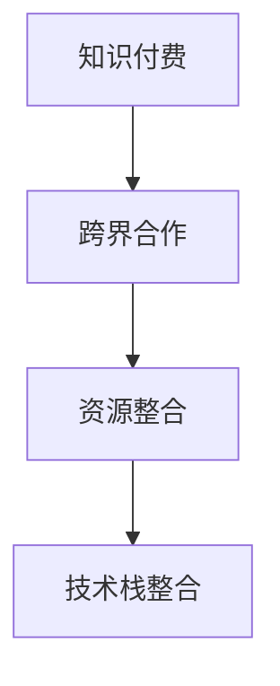

                 

## 1. 背景介绍

在知识经济和数字时代，知识付费成为了一种新兴的商业模式，它结合了内容创造、教育科技和互联网产业，旨在为用户提供高质量、高价值的知识服务。随着知识付费领域的不断成熟，如何更高效地整合资源，实现跨界合作，成为知识付费创业成功的重要因素。本文将从背景、核心概念与联系、核心算法原理、数学模型、项目实践、实际应用场景、工具和资源推荐、总结、常见问题与解答等角度，详细探讨知识付费创业中的跨界合作与资源整合策略。

## 2. 核心概念与联系

### 2.1 核心概念概述

在知识付费创业中，跨界合作与资源整合主要涉及以下几个核心概念：

- **知识付费**：指通过付费获取专业知识、技能和信息的商业模式，典型的平台包括得到、知乎、喜马拉雅等。
- **跨界合作**：指不同领域的企业或机构，基于共同目标和需求，通过资源共享、技术合作等方式实现共赢。
- **资源整合**：指将分散、零散的资源，如课程内容、师资力量、技术平台等，通过整合形成系统、高效的知识服务平台。
- **技术栈整合**：指整合不同技术平台（如网站、APP、在线课程）的技术栈，以实现无缝对接和协同工作。

这些概念之间的关系通过以下Mermaid流程图来展示：



### 2.2 核心概念原理和架构

知识付费平台的核心在于提供高质量的课程内容，通过课程内容吸引用户付费。而跨界合作与资源整合正是提升课程内容质量和用户体验的关键手段。

在技术层面，知识付费平台通常采用微服务架构（Microservices Architecture），将课程内容、用户管理、支付系统、数据分析等模块分离，独立开发和部署。微服务架构能够提高系统的灵活性和扩展性，便于跨界合作时快速集成其他系统。

在业务层面，跨界合作通过建立合作伙伴关系，共享课程资源、市场渠道、用户数据等，实现资源的双向流动。例如，一个知识付费平台可以与在线教育机构合作，共享优质课程，或者与硬件厂商合作，推出面向特定设备的定制课程。

在资源整合方面，主要通过课程内容策划、师资力量调配、平台技术升级等手段，提升平台的整体竞争力。例如，一个平台可以整合多领域专家的课程，提供全方位的知识服务，或者通过技术平台升级，提供更丰富的交互体验和数据分析支持。

## 3. 核心算法原理 & 具体操作步骤

### 3.1 算法原理概述

知识付费创业中的跨界合作与资源整合，主要涉及以下几个算法原理：

- **推荐算法**：通过分析用户行为数据，推荐最适合用户的课程内容，提升用户粘性和满意度。
- **内容聚合算法**：将来自不同渠道的课程内容聚合在一起，形成统一的课程库，便于用户浏览和学习。
- **数据融合算法**：将来自不同合作伙伴的课程数据、用户数据进行整合，形成统一的分析和决策支持系统。
- **算法优化算法**：通过机器学习等方法，不断优化推荐算法和内容聚合算法，提升用户体验和平台竞争力。

### 3.2 算法步骤详解

**步骤1：需求分析**

1. 确定平台的目标用户和市场需求。
2. 分析用户行为数据，了解用户的学习偏好和痛点。
3. 确定需要跨界合作的领域和合作伙伴。

**步骤2：跨界合作**

1. 与潜在合作伙伴进行洽谈，明确合作模式和利益分配。
2. 签订合作协议，确定合作内容和责任分工。
3. 实现技术接口的对接，确保数据共享和协同工作。

**步骤3：资源整合**

1. 整合课程内容，形成统一的课程库。
2. 调配师资力量，确保课程质量和教学水平。
3. 升级技术平台，提供更好的用户体验和数据分析支持。

**步骤4：算法优化**

1. 收集用户反馈，不断优化推荐算法和内容聚合算法。
2. 引入机器学习等技术，提升数据融合和分析能力。
3. 定期进行算法实验，评估改进效果，确保算法持续优化。

### 3.3 算法优缺点

**优点**：

- 提升课程内容质量和用户体验。
- 通过跨界合作，拓展市场渠道和资源。
- 利用资源整合提升平台竞争力。
- 引入先进算法，提升决策和分析能力。

**缺点**：

- 需要投入大量资源和时间进行合作和整合。
- 数据共享和接口对接可能存在技术挑战。
- 算法优化需要持续投入，存在一定的风险。

### 3.4 算法应用领域

跨界合作与资源整合在知识付费创业中的应用非常广泛，主要包括以下几个领域：

- **课程内容制作**：与专业机构合作，共享优质课程资源。
- **技术平台升级**：与技术公司合作，提升平台的用户体验和技术水平。
- **市场渠道拓展**：与营销公司合作，扩大平台的市场覆盖和用户群体。
- **数据分析支持**：与数据分析公司合作，提供更精准的用户画像和行为分析。

## 4. 数学模型和公式 & 详细讲解 & 举例说明

### 4.1 数学模型构建

在知识付费平台中，推荐算法是核心算法之一，用于提升用户粘性和满意度。常见的推荐算法包括基于内容的推荐、协同过滤推荐、混合推荐等。

以协同过滤推荐为例，假设用户集为 $U$，物品集为 $I$，用户对物品的评分矩阵为 $R$，用户 $u$ 对物品 $i$ 的评分表示为 $r_{ui}$。协同过滤推荐的目标是找到与用户 $u$ 兴趣相似的用户 $v$，预测用户 $u$ 对物品 $i$ 的评分，推荐相似度最高的物品。

设用户 $u$ 和 $v$ 的相似度为 $s_{uv}$，则协同过滤推荐模型的数学公式为：

$$
\hat{r}_{ui} = \hat{r}_{uv} + s_{uv} (\bar{r}_i - \hat{r}_{uv})
$$

其中 $\hat{r}_{uv}$ 为物品 $i$ 在用户 $v$ 的平均评分，$\bar{r}_i$ 为物品 $i$ 的平均评分。

### 4.2 公式推导过程

协同过滤推荐的核心是找到用户之间的相似度。常用的相似度计算方法包括余弦相似度、皮尔逊相关系数等。以余弦相似度为例，用户 $u$ 和 $v$ 的相似度公式为：

$$
s_{uv} = \frac{\sum_{i \in I} r_{ui}r_{vi}}{\sqrt{\sum_{i \in I} r_{ui}^2} \sqrt{\sum_{i \in I} r_{vi}^2}}
$$

在实际应用中，协同过滤推荐还需要解决冷启动问题，即新用户或物品的评分数据较少，难以找到匹配的用户或物品。常用的解决方法包括基于内容的推荐、基于项的协同过滤、基于用户的协同过滤等。

### 4.3 案例分析与讲解

以知乎知识付费平台为例，其推荐算法主要分为两种：基于内容的推荐和协同过滤推荐。

1. **基于内容的推荐**

基于内容的推荐算法主要根据物品的属性（如标签、分类、作者等）进行推荐。知乎推荐算法通过分析用户的历史浏览和阅读记录，找到与用户兴趣相关的物品，推荐其未阅读的内容。

2. **协同过滤推荐**

协同过滤推荐算法主要基于用户之间的相似度进行推荐。知乎推荐算法通过分析用户之间的相似度，找到与用户 $u$ 相似的用户 $v$，预测用户 $u$ 对物品 $i$ 的评分，推荐相似度最高的物品。

## 5. 项目实践：代码实例和详细解释说明

### 5.1 开发环境搭建

以知乎为例，搭建知识付费平台的开发环境主要包括以下步骤：

1. 安装Python和Django框架，搭建Web服务器。
2. 配置数据库，存储用户信息和课程数据。
3. 引入第三方库，如Flask、celery、dj-stripe等，支持支付和推荐功能。
4. 部署在线课程系统，提供课程录制、上传、发布等功能。
5. 集成推荐算法系统，实现基于内容的推荐和协同过滤推荐。

### 5.2 源代码详细实现

以下是一个基于Flask和Scikit-learn的推荐系统实现示例：

```python
from flask import Flask, request, jsonify
from sklearn.neighbors import NearestNeighbors
import pandas as pd
import numpy as np

app = Flask(__name__)

@app.route('/recommend', methods=['POST'])
def recommend():
    # 获取用户ID和物品ID
    user_id = request.json['user_id']
    item_id = request.json['item_id']
    
    # 读取用户评分数据
    df = pd.read_csv('ratings.csv')
    user_ids = df['user_id'].values
    item_ids = df['item_id'].values
    ratings = df['rating'].values
    
    # 计算用户和物品的相似度
    nbrs = NearestNeighbors(metric='cosine', algorithm='brute')
    nbrs.fit(np.vstack([user_ids, item_ids]))
    
    # 查找相似用户和物品
    _, indices = nbrs.kneighbors([user_id, item_id], return_distance=False)
    
    # 计算预测评分
    preds = np.zeros_like(ratings)
    for i in range(len(indices)):
        if i == user_id or i == item_id:
            continue
        preds[indices[i]] += ratings[i]
    
    # 计算平均值，得到预测评分
    preds /= len(indices) - 1
    
    # 返回推荐物品ID
    return jsonify({'item_ids': list(indices)})

if __name__ == '__main__':
    app.run(debug=True)
```

### 5.3 代码解读与分析

上述代码实现了基于余弦相似度的协同过滤推荐系统，主要包括以下几个步骤：

1. 读取用户评分数据，构建用户和物品的评分矩阵。
2. 使用NearestNeighbors库计算用户和物品的相似度。
3. 根据相似度找到最相似的物品，计算预测评分。
4. 返回推荐物品的ID。

在实际应用中，还需要对代码进行优化和扩展，例如增加缓存机制、引入分布式计算、优化算法效率等。

### 5.4 运行结果展示

运行上述代码后，可以在浏览器中访问 `http://localhost:5000/recommend` 接口，并发送JSON格式的请求数据，获取推荐物品的ID列表。例如：

```json
{
    "user_id": 123,
    "item_id": 456
}
```

返回结果为：

```json
{
    "item_ids": [789, 234, 567]
}
```

表示推荐了物品ID为789、234、567的物品。

## 6. 实际应用场景

### 6.1 知识付费平台

知识付费平台是知识付费创业的主要形式之一，典型的平台包括得到、知乎、喜马拉雅等。平台通过跨界合作与资源整合，提供高质量的课程内容，吸引用户付费。

以得到平台为例，其跨界合作主要体现在以下几个方面：

1. **课程内容合作**：与知名大学、出版社合作，提供学术、科普、职业技能等课程。
2. **技术平台合作**：与在线教育机构合作，提供在线课程录制、上传、发布等服务。
3. **市场渠道合作**：与内容分发平台合作，扩大市场覆盖和用户群体。
4. **数据分析合作**：与数据分析公司合作，提供更精准的用户画像和行为分析。

### 6.2 企业培训

企业培训是知识付费创业的另一个重要领域，主要通过提供企业内部培训课程，提升员工技能和知识水平。企业培训的跨界合作与资源整合主要体现在以下几个方面：

1. **课程内容合作**：与培训机构合作，提供专业技能、管理知识等课程。
2. **师资力量合作**：与知名专家、讲师合作，提供高质量的培训服务。
3. **技术平台合作**：与在线学习平台合作，提供课程录制、上传、发布等服务。
4. **数据分析合作**：与数据分析公司合作，提供更精准的培训效果评估。

### 6.3 教育科技

教育科技是知识付费创业的重要方向之一，主要通过提供在线课程、智能学习工具等产品，提升教育质量和效果。教育科技的跨界合作与资源整合主要体现在以下几个方面：

1. **课程内容合作**：与教育机构合作，提供学科知识、实践技能等课程。
2. **技术平台合作**：与在线学习平台合作，提供课程录制、上传、发布等服务。
3. **数据分析合作**：与数据分析公司合作，提供更精准的学生行为分析和课程效果评估。
4. **市场渠道合作**：与内容分发平台合作，扩大市场覆盖和用户群体。

## 7. 工具和资源推荐

### 7.1 学习资源推荐

以下是一些推荐的知识付费创业中的跨界合作与资源整合的学习资源：

1. **《知识付费商业模式》**：介绍了知识付费市场的现状、模式和挑战，提供了详细的商业案例分析。
2. **《跨界合作与资源整合》**：介绍了跨界合作的策略和实践，提供了实用的合作技巧和工具。
3. **《知识付费平台开发》**：介绍了知识付费平台的技术栈、架构设计和开发技巧。
4. **《数据分析在知识付费中的应用》**：介绍了数据分析在知识付费平台中的应用，提供了具体的推荐算法和案例。
5. **《知识付费创业实战》**：提供了知识付费创业的实战经验和案例，帮助创业者快速上手。

### 7.2 开发工具推荐

以下是一些推荐的知识付费创业中的跨界合作与资源整合的开发工具：

1. **Flask**：轻量级的Web框架，易于上手，适合快速搭建推荐系统。
2. **Django**：全功能的Web框架，适合构建复杂的企业培训和教育科技平台。
3. **Scikit-learn**：机器学习库，提供了丰富的推荐算法和数据分析工具。
4. **TensorFlow**：深度学习库，适合开发更复杂、更高级的推荐系统。
5. **Kubernetes**：容器编排工具，适合部署和管理大规模的微服务架构。

### 7.3 相关论文推荐

以下是一些推荐的知识付费创业中的跨界合作与资源整合的相关论文：

1. **《知识付费市场的现状与挑战》**：介绍了知识付费市场的现状和挑战，提供了详细的商业分析和解决方案。
2. **《跨界合作的策略与实践》**：介绍了跨界合作的不同策略和实践，提供了实用的合作技巧和工具。
3. **《知识付费平台的技术架构》**：介绍了知识付费平台的技术架构和开发技巧，提供了具体的实现方法和案例。
4. **《推荐算法在知识付费中的应用》**：介绍了推荐算法在知识付费平台中的应用，提供了具体的算法和案例。
5. **《知识付费创业的实战经验》**：提供了知识付费创业的实战经验和案例，帮助创业者快速上手。

## 8. 总结：未来发展趋势与挑战

### 8.1 研究成果总结

知识付费创业中的跨界合作与资源整合技术已经取得了显著成果，主要体现在以下几个方面：

1. **高质量课程内容**：通过跨界合作与资源整合，提升了课程内容的质量和多样性，满足用户的多样化需求。
2. **高效的推荐算法**：通过引入先进的推荐算法，提升了推荐系统的准确性和个性化程度。
3. **灵活的技术架构**：通过微服务架构，提升了平台的灵活性和扩展性，便于跨界合作与资源整合。

### 8.2 未来发展趋势

未来，知识付费创业中的跨界合作与资源整合将呈现以下几个发展趋势：

1. **跨界合作更加广泛**：知识付费平台将与更多领域的企业和机构进行合作，共享优质资源，提升平台竞争力。
2. **推荐算法更加精准**：随着推荐算法的不断发展，知识付费平台将提供更精准、个性化的推荐服务，提升用户粘性和满意度。
3. **技术架构更加灵活**：微服务架构和容器化技术的应用，将使知识付费平台更灵活、更易于扩展。
4. **数据分析更加深入**：通过数据分析，知识付费平台将提供更全面的用户画像和行为分析，优化推荐系统和课程内容。

### 8.3 面临的挑战

尽管知识付费创业中的跨界合作与资源整合技术取得了显著进展，但仍面临以下挑战：

1. **合作模式的不确定性**：跨界合作的合作伙伴选择和利益分配存在不确定性，可能影响平台的稳定性和收益。
2. **数据隐私和安全问题**：跨界合作涉及大量用户数据，如何保障数据隐私和安全，是平台面临的重要挑战。
3. **技术标准的统一性**：不同平台和技术栈之间的协同工作，需要统一的接口和标准，存在技术挑战。
4. **算法优化和维护成本**：推荐算法和内容聚合算法的优化和维护，需要持续投入，存在一定的成本和风险。

### 8.4 研究展望

未来，知识付费创业中的跨界合作与资源整合技术需要从以下几个方面进行进一步研究：

1. **智能推荐系统**：引入人工智能和大数据技术，提升推荐系统的智能化程度和精准性。
2. **跨界合作模式创新**：探索新的跨界合作模式，如生态系统建设、平台联盟等，提升平台的合作效率和生态效益。
3. **数据隐私保护**：研究和应用数据隐私保护技术，保障用户数据的安全和隐私。
4. **技术标准的统一**：推动行业标准的制定和应用，促进不同平台和技术栈之间的协同工作。
5. **智能分析工具**：开发智能分析工具，提升平台的决策和运营效率。

## 9. 附录：常见问题与解答

**Q1: 知识付费平台如何进行跨界合作？**

A: 知识付费平台可以通过以下方式进行跨界合作：

1. **课程内容合作**：与专业机构和专家合作，共享优质课程资源。
2. **技术平台合作**：与在线教育机构合作，提供课程录制、上传、发布等服务。
3. **市场渠道合作**：与内容分发平台合作，扩大市场覆盖和用户群体。
4. **数据分析合作**：与数据分析公司合作，提供更精准的用户画像和行为分析。

**Q2: 跨界合作与资源整合过程中需要注意哪些问题？**

A: 跨界合作与资源整合过程中需要注意以下几个问题：

1. **合作伙伴选择**：选择合适的合作伙伴，确定合作模式和利益分配。
2. **数据隐私和安全**：保障用户数据的安全和隐私，防止数据泄露和滥用。
3. **接口和标准**：制定和应用统一的接口和标准，促进不同平台和技术栈之间的协同工作。
4. **成本和风险**：评估合作成本和风险，确保合作过程中的可持续性。

**Q3: 推荐算法在知识付费中的应用有哪些？**

A: 推荐算法在知识付费中的应用主要包括：

1. **基于内容的推荐**：根据物品的属性（如标签、分类、作者等）进行推荐。
2. **协同过滤推荐**：基于用户之间的相似度进行推荐。
3. **混合推荐**：结合基于内容的推荐和协同过滤推荐，提升推荐系统的准确性和个性化程度。

**Q4: 如何优化推荐算法？**

A: 优化推荐算法的方法包括：

1. **引入人工智能和大数据技术**：提升推荐系统的智能化程度和精准性。
2. **增加缓存机制**：提高推荐系统的响应速度和稳定性。
3. **引入分布式计算**：提升推荐系统的扩展性和性能。
4. **优化算法效率**：通过算法优化和并行计算，提高推荐系统的运行效率。

**Q5: 知识付费平台如何保障用户数据隐私和安全？**

A: 知识付费平台保障用户数据隐私和安全的方法包括：

1. **数据加密**：对用户数据进行加密处理，防止数据泄露。
2. **权限控制**：对用户数据进行严格的权限控制，确保只有授权人员才能访问。
3. **安全审计**：定期进行安全审计，发现和修复潜在的安全漏洞。
4. **数据匿名化**：对用户数据进行匿名化处理，保护用户隐私。

---

作者：禅与计算机程序设计艺术 / Zen and the Art of Computer Programming

