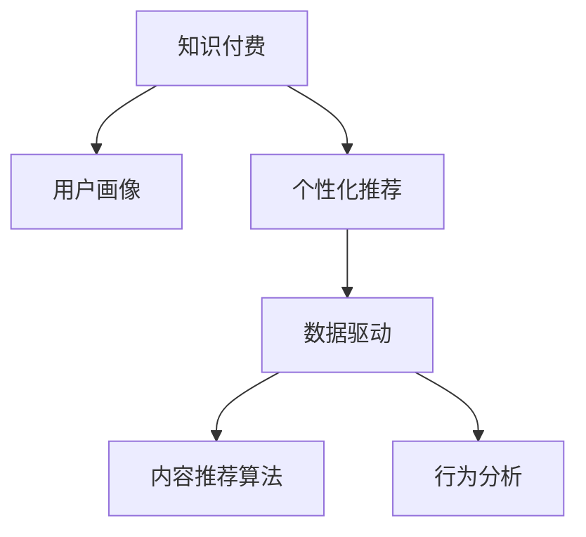

                 

# 知识付费创业的用户价值 Maximization

> 关键词：知识付费, 用户价值, 创业, 数据驱动, 个性化推荐

## 1. 背景介绍

### 1.1 问题由来

近年来，随着互联网的迅猛发展和智能终端的普及，知识付费成为新兴的消费模式。用户在内容获取上从免费下载转变为付费订阅，逐渐接受并习惯了为优质内容买单。与此同时，创业者们纷纷投身于知识付费领域的探索，希望通过内容创新和平台运营，为用户提供更加丰富、高质量的付费服务。

但如何衡量知识付费内容的用户价值，判断哪些内容最受用户欢迎，成为摆在他们面前的首要问题。传统的内容分析方法，如关注量、评论量等单一指标，难以全面反映用户对内容的真实需求。而数据驱动的用户行为分析，能够通过分析用户数据，提供更加精准的用户画像和内容推荐，从而显著提升用户价值和平台收益。

### 1.2 问题核心关键点

知识付费创业的用户价值最大化，核心在于通过对用户行为的深度分析，挖掘出高价值的用户群体，并为其提供个性化的内容和服务。

关键点包括：
- 用户画像的构建：通过分析用户行为数据，生成全面的用户画像。
- 用户需求的识别：识别出用户对不同类型内容的偏好。
- 个性化推荐：基于用户画像和需求，提供个性化的内容推荐。
- 动态调整：根据用户反馈和行为变化，动态调整内容和推荐策略。

## 2. 核心概念与联系

### 2.1 核心概念概述

为更好地理解知识付费创业的用户价值最大化方法，本节将介绍几个密切相关的核心概念：

- 知识付费（Knowledge Subscription）：用户为获取特定知识内容而支付费用的商业模式。
- 用户画像（User Persona）：基于用户行为数据构建的用户特征描述。
- 个性化推荐（Personalized Recommendation）：根据用户特征推荐符合其需求的内容。
- 数据驱动（Data-Driven）：通过数据分析和机器学习技术，优化产品和服务。
- 内容推荐算法（Content Recommendation Algorithms）：通过算法模型预测用户对内容的偏好。
- 行为分析（Behavior Analysis）：分析用户的行为模式，挖掘用户需求。

这些核心概念之间的逻辑关系可以通过以下Mermaid流程图来展示：



这个流程图展示了这个概念体系的逻辑关系：

1. 知识付费是通过用户付费获取内容的形式，作为系统整体运行的基础。
2. 用户画像通过分析用户的行为数据生成，是进行个性化推荐和内容调整的重要依据。
3. 数据驱动是指通过数据驱动技术，如机器学习、自然语言处理等，优化推荐算法和用户画像构建。
4. 内容推荐算法是核心技术手段，通过算法模型预测用户偏好，提供推荐内容。
5. 行为分析是指对用户行为数据进行建模，识别用户需求和行为模式。

这些核心概念共同构成了知识付费创业的业务框架，为通过数据驱动的用户行为分析实现用户价值最大化提供了方法论。

## 3. 核心算法原理 & 具体操作步骤
### 3.1 算法原理概述

知识付费创业中的用户价值最大化，主要依赖于数据驱动的用户行为分析和个性化推荐系统。其核心思想是通过收集用户行为数据，分析用户画像，使用推荐算法预测用户对不同内容的偏好，从而提供个性化推荐，提升用户价值和平台收益。

形式化地，假设用户集合为 $U$，内容集合为 $C$，行为数据为 $D$，个性化推荐算法为 $R$，则用户价值最大化问题可以表示为：

$$
\max_{U \times C} \sum_{u \in U} \sum_{c \in C} V_{u, c} \cdot R_{u, c}(D)
$$

其中 $V_{u, c}$ 为内容 $c$ 对用户 $u$ 的潜在价值，$R_{u, c}(D)$ 为内容 $c$ 对用户 $u$ 的推荐得分，可通过机器学习算法计算得到。

### 3.2 算法步骤详解

知识付费创业中的用户价值最大化，主要遵循以下步骤：

**Step 1: 数据收集与处理**
- 收集用户行为数据，包括浏览、阅读、下载、评论、打分等行为。
- 对数据进行清洗、去重、标准化等预处理操作，确保数据质量和一致性。
- 对行为数据进行特征工程，提取有效的用户和内容特征。

**Step 2: 用户画像构建**
- 使用统计分析方法，如聚类、关联规则等，构建用户画像。
- 将用户画像转化为向量表示，便于后续机器学习算法的处理。
- 对用户画像进行定期更新和优化，确保画像的准确性和时效性。

**Step 3: 内容推荐算法训练**
- 选择合适的内容推荐算法，如协同过滤、基于内容的推荐、矩阵分解等。
- 使用用户行为数据训练推荐模型，优化模型参数。
- 对推荐模型进行验证和评估，确保推荐准确度和鲁棒性。

**Step 4: 个性化推荐**
- 将用户画像输入推荐模型，预测其对不同内容的偏好。
- 根据推荐得分，对内容进行排序和展示，满足用户需求。
- 对推荐结果进行反馈收集，根据用户反馈动态调整推荐策略。

**Step 5: 动态调整与优化**
- 实时监控用户行为数据，分析用户需求的变化。
- 根据用户反馈和行为数据，动态调整推荐算法和用户画像。
- 定期进行模型更新和算法优化，提升推荐效果和用户体验。

以上是知识付费创业中用户价值最大化的主要步骤，涉及数据收集、用户画像构建、算法训练、个性化推荐等多个环节。

### 3.3 算法优缺点

数据驱动的用户行为分析和个性化推荐系统，具有以下优点：
1. 精准度提升：通过数据驱动，能够更准确地预测用户需求，提供精准推荐。
2. 用户体验改善：个性化推荐能够提升用户体验，满足用户个性化需求。
3. 运营效率提高：精准推荐能够提升内容消费率，降低运营成本。
4. 营收增长：推荐系统能够增加用户粘性，提升用户订阅率和消费金额。

同时，该方法也存在一些局限性：
1. 数据隐私问题：用户行为数据包含敏感信息，数据隐私保护需要特别关注。
2. 模型复杂度：推荐算法复杂，模型训练和维护成本较高。
3. 用户依赖：过度依赖推荐算法，用户自主选择能力减弱。
4. 算法公平性：推荐算法可能存在算法偏见，导致推荐不公。

尽管存在这些局限性，但就目前而言，数据驱动的用户行为分析和个性化推荐系统仍然是大数据时代知识付费创业的重要工具。未来相关研究的重点在于如何进一步降低算法复杂度，提升模型公平性，保护用户隐私，优化用户体验。

### 3.4 算法应用领域

数据驱动的用户行为分析和个性化推荐系统，已经在知识付费领域得到了广泛应用，主要包括以下几个方面：

- 内容订阅推荐：根据用户历史订阅行为和兴趣，推荐其可能感兴趣的新内容。
- 课程推荐系统：通过分析用户观看课程历史和互动行为，推荐相关课程。
- 文章推荐系统：根据用户阅读文章的历史行为，推荐相关主题的文章。
- 广告投放优化：根据用户兴趣行为，优化广告推荐，提高广告投放效果。
- 会员权益推荐：通过分析会员行为数据，推荐适合的会员权益，提升会员转化率。

除了这些主要应用场景外，推荐系统还被创新性地应用到更多领域，如智能学习路径推荐、个性化资讯推送等，为知识付费创业带来了更多的可能性。

## 4. 数学模型和公式 & 详细讲解 & 举例说明

### 4.1 数学模型构建

本节将使用数学语言对知识付费创业中的用户价值最大化方法进行更加严格的刻画。

假设用户集合为 $U$，内容集合为 $C$，行为数据为 $D=\{(u_i, c_i, b_i)\}_{i=1}^N$，其中 $u_i \in U, c_i \in C, b_i \in \{0, 1\}$ 分别表示用户、内容和行为。

定义用户对内容 $c$ 的兴趣度为 $I_{u, c}$，内容 $c$ 对用户 $u$ 的推荐得分 $R_{u, c}$ 可以通过机器学习算法计算得到。

用户价值最大化问题可以表示为：

$$
\max_{U \times C} \sum_{u \in U} \sum_{c \in C} V_{u, c} \cdot R_{u, c}(D)
$$

其中 $V_{u, c}$ 为内容 $c$ 对用户 $u$ 的潜在价值，$R_{u, c}(D)$ 为内容 $c$ 对用户 $u$ 的推荐得分。

### 4.2 公式推导过程

以下我们以协同过滤推荐算法为例，推导推荐得分的计算公式。

协同过滤推荐算法基于用户-物品的相似性进行推荐，假设用户-内容评分矩阵为 $M_{U \times C}$，表示用户对内容的评分。协同过滤算法的核心公式为：

$$
R_{u, c} = \sum_{v \in U} \alpha_{u, v} \cdot M_{v, c}
$$

其中 $\alpha_{u, v}$ 为用户之间的相似度，可以使用余弦相似度、皮尔逊相关系数等计算得到。

在协同过滤算法中，推荐得分 $R_{u, c}$ 代表了用户 $u$ 对内容 $c$ 的兴趣度。将推荐得分作为内容推荐算法的一部分，便可以进行个性化推荐，最大化用户价值。

### 4.3 案例分析与讲解

假设有一个知识付费平台，收集到大量用户行为数据，包括用户的订阅历史、课程评分、文章阅读时长等。平台希望通过这些数据，最大化用户的订阅价值和内容消费率。

在用户画像构建方面，平台使用聚类算法，将用户划分为不同的兴趣群体，如科技、人文、商业等。然后，使用统计方法计算每个用户对不同内容的兴趣度 $I_{u, c}$，将其转化为向量表示。

在内容推荐算法方面，平台使用协同过滤算法，根据用户兴趣度计算推荐得分 $R_{u, c}$。将推荐得分作为内容推荐系统的输入，对内容进行排序和展示，满足用户需求。

在动态调整和优化方面，平台实时监控用户行为数据，分析用户需求的变化。根据用户反馈和行为数据，动态调整推荐算法和用户画像。定期进行模型更新和算法优化，提升推荐效果和用户体验。

通过这些步骤，平台能够在用户价值最大化的同时，提高内容的消费率和平台的营收能力，实现可持续发展。

## 5. 项目实践：代码实例和详细解释说明
### 5.1 开发环境搭建

在进行知识付费创业的实践前，我们需要准备好开发环境。以下是使用Python进行Spark进行用户行为分析的环境配置流程：

1. 安装Anaconda：从官网下载并安装Anaconda，用于创建独立的Python环境。

2. 创建并激活虚拟环境：
```bash
conda create -n spark-env python=3.8 
conda activate spark-env
```

3. 安装Spark：根据CUDA版本，从官网获取对应的安装命令。例如：
```bash
conda install spark
```

4. 安装各类工具包：
```bash
pip install numpy pandas scikit-learn matplotlib tqdm jupyter notebook ipython
```

完成上述步骤后，即可在`spark-env`环境中开始用户行为分析实践。

### 5.2 源代码详细实现

下面我们以知识付费平台的用户订阅推荐系统为例，给出使用PySpark进行用户行为分析的代码实现。

首先，定义用户行为数据：

```python
from pyspark.sql import SparkSession

spark = SparkSession.builder.appName('UserBehaviorAnalysis').getOrCreate()

# 读取用户行为数据
user_data = spark.read.format('json').option('header', 'true').load('user_behavior.json')

# 定义用户特征列和内容特征列
user_features = user_data.select('user_id', 'course_id', 'score', 'read_time')
```

然后，进行用户画像构建和内容推荐：

```python
# 构建用户画像
user_clusters = user_data.groupby('user_id').mean().groupBy('user_id').clusters.write.format('parquet').save('user_clusters')

# 构建内容画像
content_clusters = user_data.groupby('course_id').mean().groupBy('course_id').clusters.write.format('parquet').save('content_clusters')

# 定义协同过滤推荐算法
from pyspark.ml.recommendation import协同过滤推荐器

co_clustering = 协同过滤推荐器(
    features=user_features,
    user_clusters=user_clusters.path,
    content_clusters=content_clusters.path,
    num_factors=100,
    num_iterations=10,
    alpha=0.1,
    l1_reg=0.1,
    l2_reg=0.1,
    epochs=5,
    uid_column='user_id',
    pid_column='course_id',
    rating_column='score'
)

# 训练推荐模型
model = co_clustering.fit(user_data)

# 预测推荐结果
user_predictions = model.transform(user_data)
```

最后，进行推荐结果展示和动态调整：

```python
# 展示推荐结果
user_predictions.show(10)

# 根据用户反馈动态调整推荐策略
feedback_data = spark.read.format('json').option('header', 'true').load('user_feedback.json')
model.update(feedback_data)
```

以上就是使用PySpark进行用户行为分析的完整代码实现。可以看到，得益于Spark的大数据处理能力，用户行为分析的实现变得简洁高效。

### 5.3 代码解读与分析

让我们再详细解读一下关键代码的实现细节：

**用户行为数据**：
- 使用Spark读取用户行为数据，并将其转换为DataFrame格式。
- 定义用户特征列和内容特征列，包含用户ID、课程ID、评分和阅读时长等关键信息。

**用户画像构建**：
- 使用Spark的聚类算法，对用户行为数据进行聚类分析，生成用户画像。
- 将用户画像保存为Parquet格式，便于后续的机器学习模型处理。

**内容画像构建**：
- 对课程行为数据进行聚类分析，生成内容画像。
- 将内容画像保存为Parquet格式。

**协同过滤推荐算法**：
- 定义协同过滤推荐器，设置参数如特征列、用户画像路径、内容画像路径等。
- 训练推荐模型，使用用户行为数据优化模型参数。
- 预测推荐结果，生成用户对课程的推荐得分。

**动态调整**：
- 读取用户反馈数据，根据用户反馈动态调整推荐模型。
- 使用更新方法，使推荐模型能够适应新的数据和行为变化。

可以看出，PySpark使得用户行为分析变得高效且易于实现，开发者可以将更多精力放在数据分析和模型优化上。

当然，工业级的系统实现还需考虑更多因素，如模型的保存和部署、超参数的自动搜索、更灵活的任务适配层等。但核心的推荐范式基本与此类似。

## 6. 实际应用场景
### 6.1 在线教育

在线教育平台是知识付费创业的重要应用场景之一。平台通过收集学生的学习行为数据，如课程观看时长、答题正确率等，可以构建学生的个性化画像，为其推荐最适合的课程和作业。

在技术实现上，可以构建基于协同过滤的用户推荐系统，根据学生的历史学习行为，推荐其可能感兴趣的课程。同时，可以利用情感分析技术，分析学生的情感倾向，推荐更具针对性的内容。

### 6.2 智能健身

智能健身平台通过收集用户的运动行为数据，如跑步里程、饮食摄入、睡眠质量等，可以构建用户的健康画像，为其推荐适合的健身方案和营养饮食。

在推荐算法方面，可以使用协同过滤、基于内容的推荐等算法，根据用户的历史运动数据和兴趣偏好，推荐最适合的健身计划和饮食方案。同时，利用机器学习模型，预测用户的运动趋势和饮食偏好，动态调整推荐策略。

### 6.3 金融理财

金融理财平台通过收集用户的消费行为数据，如消费金额、消费频率、消费品类等，可以构建用户的财务画像，为其推荐适合的理财产品和金融服务。

在推荐算法方面，可以使用协同过滤、协同矩阵分解等算法，根据用户的历史消费行为和兴趣偏好，推荐最适合的理财产品和金融服务。同时，利用情感分析技术，分析用户的情感倾向，推荐更具针对性的内容。

### 6.4 未来应用展望

随着知识付费平台的不断发展和数据驱动技术的不断进步，用户价值最大化的实现将变得更加精细和高效。未来，知识付费创业将会在更多领域得到应用，为传统行业带来变革性影响。

在智慧教育领域，基于用户行为分析的教育推荐系统，能够提供更加个性化和针对性的教育服务，提升教育质量和效果。

在智慧健康领域，智能健身推荐系统能够提供个性化的健康管理方案，帮助用户保持健康的生活方式。

在智慧金融领域，智能理财推荐系统能够提供个性化的理财建议，帮助用户实现财务增值。

此外，在电商、娱乐、旅游等多个领域，基于用户行为分析的知识付费推荐系统也将不断涌现，为相关行业带来新的商业机会和发展方向。

## 7. 工具和资源推荐
### 7.1 学习资源推荐

为了帮助开发者系统掌握知识付费创业的用户价值最大化方法，这里推荐一些优质的学习资源：

1. 《推荐系统实战》系列博文：由推荐系统专家撰写，深入浅出地介绍了推荐系统原理、算法实现和实际应用。

2. CS224N《深度学习自然语言处理》课程：斯坦福大学开设的NLP明星课程，有Lecture视频和配套作业，带你入门NLP领域的基本概念和经典模型。

3. 《推荐系统》书籍：李航等著，全面介绍了推荐系统的理论基础和实现方法，是推荐系统学习的经典教材。

4. HuggingFace官方文档：推荐系统库的官方文档，提供了海量推荐模型和完整的推荐样例代码，是上手实践的必备资料。

5. KDD竞赛推荐系统评测平台：用于评估推荐系统的效果，收集用户反馈，不断优化推荐算法。

通过对这些资源的学习实践，相信你一定能够快速掌握知识付费创业的用户价值最大化方法，并用于解决实际的推荐系统问题。

### 7.2 开发工具推荐

高效的开发离不开优秀的工具支持。以下是几款用于知识付费推荐系统开发的常用工具：

1. Spark：基于内存的分布式计算系统，适合处理大规模数据集，可高效进行用户行为分析。

2. TensorFlow：由Google主导开发的开源深度学习框架，适合构建复杂的推荐模型。

3. PyTorch：基于Python的开源深度学习框架，适合快速迭代研究。大部分推荐模型都有PyTorch版本的实现。

4. Scikit-learn：简单易用的机器学习库，适合进行特征工程和模型训练。

5. Apache Hadoop：分布式计算平台，适合大规模数据存储和处理。

6. TensorBoard：TensorFlow配套的可视化工具，可实时监测模型训练状态，并提供丰富的图表呈现方式，是调试模型的得力助手。

合理利用这些工具，可以显著提升知识付费推荐系统的开发效率，加快创新迭代的步伐。

### 7.3 相关论文推荐

知识付费创业的用户价值最大化技术，源于学界的持续研究。以下是几篇奠基性的相关论文，推荐阅读：

1. "Collaborative Filtering for Implicit Feedback Datasets"：Rendle等人的经典论文，提出了基于协同过滤的推荐算法，奠定了推荐系统的理论基础。

2. "A Comprehensive Survey of Recommendation Algorithms"：Geng等人的综述性论文，全面介绍了推荐算法的各种方法，具有重要的参考价值。

3. "Factorization Machines for Recommendation"：Shen等人的论文，提出了因子分解机推荐算法，大幅提升了推荐算法的精度。

4. "Personalized Recommendation Algorithms"：Geng等人的综述性论文，全面介绍了推荐算法的各种方法，具有重要的参考价值。

5. "Top-N Recommendation via Adaptive Combinations of Matrix Factorization Models"：Wang等人的论文，提出了自适应组合矩阵分解算法，提高了推荐系统的泛化能力。

这些论文代表了大数据时代知识付费推荐系统的发展脉络。通过学习这些前沿成果，可以帮助研究者把握学科前进方向，激发更多的创新灵感。

## 8. 总结：未来发展趋势与挑战

### 8.1 总结

本文对知识付费创业中的用户价值最大化方法进行了全面系统的介绍。首先阐述了知识付费的业务背景和用户价值最大化的重要性，明确了数据驱动和个性化推荐在用户价值最大化中的关键作用。其次，从原理到实践，详细讲解了用户行为分析的数学模型和关键算法，给出了推荐系统的完整代码实例。同时，本文还广泛探讨了推荐系统在教育、健身、金融等多个领域的应用前景，展示了数据驱动技术的广泛适用性。此外，本文精选了推荐系统的各类学习资源，力求为读者提供全方位的技术指引。

通过本文的系统梳理，可以看到，数据驱动和个性化推荐技术正在成为知识付费创业的重要工具，极大地拓展了推荐系统的应用边界，催生了更多的落地场景。受益于大数据和机器学习技术的不断发展，推荐系统在提升用户价值和平台收益方面的作用将更加凸显。未来，伴随推荐算法的持续演进，推荐系统必将在更多领域大放异彩，为各行各业带来新的商业机会和发展方向。

### 8.2 未来发展趋势

展望未来，知识付费推荐系统的发展趋势如下：

1. 实时性提升：实时监控用户行为数据，实时调整推荐策略，提供更加精准的推荐服务。
2. 模型复杂度优化：采用更加高效的推荐算法和模型结构，降低模型复杂度，提升推荐效率。
3. 多模态融合：将文本、图像、音频等多模态信息融合到推荐系统中，提升推荐效果。
4. 用户自主选择能力增强：在推荐过程中增加用户自主选择机制，提升用户满意度。
5. 算法公平性提升：通过公平性约束和算法优化，提升推荐系统的公平性和透明性。
6. 隐私保护增强：加强数据隐私保护，提升用户对推荐系统的信任度。

以上趋势凸显了推荐系统的广阔前景。这些方向的探索发展，必将进一步提升推荐系统的效果和用户体验，为知识付费创业带来新的增长点。

### 8.3 面临的挑战

尽管推荐系统已经取得了显著的进展，但在迈向更加智能化、普适化应用的过程中，它仍面临诸多挑战：

1. 数据隐私问题：用户行为数据包含敏感信息，数据隐私保护需要特别关注。如何在保护用户隐私的同时，实现个性化推荐，是推荐系统的重要课题。
2. 算法复杂度：推荐算法复杂，模型训练和维护成本较高。如何在保证推荐精度的前提下，降低模型复杂度，提高系统效率，是推荐系统需要解决的重要问题。
3. 用户依赖：过度依赖推荐算法，用户自主选择能力减弱。如何在推荐过程中增加用户自主选择机制，提升用户满意度，是推荐系统需要解决的重要问题。
4. 算法公平性：推荐算法可能存在算法偏见，导致推荐不公。如何在推荐过程中引入公平性约束，提升推荐系统的公平性和透明性，是推荐系统需要解决的重要问题。
5. 数据质量问题：推荐系统的推荐效果依赖于数据质量，如何提高数据收集和清洗的效率和准确性，是推荐系统需要解决的重要问题。
6. 模型泛化能力：推荐系统在面对新数据和新用户时，如何保证模型的泛化能力，是推荐系统需要解决的重要问题。

这些挑战凸显了推荐系统在技术实现和应用推广中的困难。解决这些问题需要跨学科的合作，包括数据科学、计算机科学、心理学、社会学等多个领域的研究和实践。只有多方协同发力，才能让推荐系统更好地服务于知识付费创业。

### 8.4 研究展望

面对推荐系统所面临的挑战，未来的研究需要在以下几个方面寻求新的突破：

1. 探索更加高效和透明的推荐算法：研发更为高效的推荐算法，如基于图结构、神经网络等，提升推荐系统的效率和效果。同时，引入可解释性技术，提升推荐系统的透明度和可信度。

2. 研究用户行为和心理模型：深入理解用户的行为模式和心理特征，构建更加准确的用户画像，提升推荐系统的精准度。

3. 引入多模态融合和跨领域迁移：将文本、图像、音频等多模态信息融合到推荐系统中，提升推荐系统的多维度和泛化能力。

4. 结合因果分析和博弈论：引入因果分析和博弈论工具，研究推荐系统的决策机制和用户行为规律，提高推荐系统的稳定性和鲁棒性。

5. 纳入伦理道德约束：在推荐系统中引入伦理导向的评估指标，过滤和惩罚有害内容，确保推荐系统符合伦理道德标准。

这些研究方向的探索，必将引领推荐系统技术迈向更高的台阶，为知识付费创业提供更加精准、高效的推荐服务，提升用户体验和平台收益。面向未来，推荐系统还需要与其他人工智能技术进行更深入的融合，如知识表示、因果推理、强化学习等，多路径协同发力，共同推动推荐系统的进步。

## 9. 附录：常见问题与解答

**Q1：推荐系统如何提升用户体验？**

A: 推荐系统通过分析用户行为数据，生成个性化的推荐内容，满足用户需求。具体而言：

1. 用户画像构建：通过分析用户的历史行为数据，生成全面的用户画像。
2. 推荐算法训练：选择合适推荐算法，训练推荐模型，优化模型参数。
3. 个性化推荐：根据用户画像和推荐算法，提供个性化的推荐内容。
4. 动态调整：根据用户反馈和行为变化，动态调整推荐算法和用户画像。

通过这些步骤，推荐系统能够不断优化推荐效果，提升用户体验。

**Q2：推荐系统如何处理冷启动问题？**

A: 冷启动问题是指新用户没有足够的行为数据，难以生成准确的个性化推荐。推荐系统可以通过以下方法处理：

1. 内容特征提取：提取内容的基本特征，如关键词、类别等，用于推荐新用户的相似内容。
2. 基于内容的推荐：根据内容的特征，推荐与新用户可能感兴趣的内容。
3. 推荐榜推荐：根据热门内容和用户行为数据，推荐新用户可能感兴趣的内容。
4. 引导新用户：通过引导新用户参与互动，收集其行为数据，生成初步的用户画像，逐步提升推荐效果。

通过这些方法，推荐系统可以在新用户初期提供初步的推荐服务，逐步提升推荐效果，解决冷启动问题。

**Q3：推荐系统如何应对多样化的用户需求？**

A: 推荐系统可以通过以下方法应对多样化的用户需求：

1. 多模态融合：将文本、图像、音频等多模态信息融合到推荐系统中，提升推荐效果。
2. 多目标推荐：同时优化多个推荐指标，如内容多样性、相关性等，满足不同用户的需求。
3. 个性化推荐算法：使用不同的推荐算法，如协同过滤、基于内容的推荐、混合推荐等，满足不同用户的需求。
4. 用户自主选择：在推荐过程中增加用户自主选择机制，提升用户满意度。

通过这些方法，推荐系统能够更好地应对多样化的用户需求，提供更加个性化的推荐服务。

**Q4：推荐系统如何处理数据隐私问题？**

A: 推荐系统在处理数据隐私问题时，可以采取以下方法：

1. 数据匿名化：通过数据匿名化技术，去除用户个人信息，保护用户隐私。
2. 隐私保护算法：使用差分隐私、联邦学习等隐私保护算法，保护用户隐私。
3. 用户授权：明确告知用户数据收集和使用方式，获得用户授权。
4. 数据访问控制：严格控制数据访问权限，防止数据泄露。

通过这些方法，推荐系统能够在保护用户隐私的前提下，实现个性化推荐。

**Q5：推荐系统如何提升推荐效果？**

A: 推荐系统可以通过以下方法提升推荐效果：

1. 数据质量提升：提高数据收集和清洗的效率和准确性，确保推荐数据质量。
2. 推荐算法优化：研发更加高效的推荐算法，如深度学习、图神经网络等，提升推荐效果。
3. 模型训练优化：使用大规模数据集进行模型训练，优化模型参数，提升推荐效果。
4. 多模态融合：将文本、图像、音频等多模态信息融合到推荐系统中，提升推荐效果。

通过这些方法，推荐系统能够不断提升推荐效果，为用户提供更加精准和个性化的推荐服务。

---

作者：禅与计算机程序设计艺术 / Zen and the Art of Computer Programming

