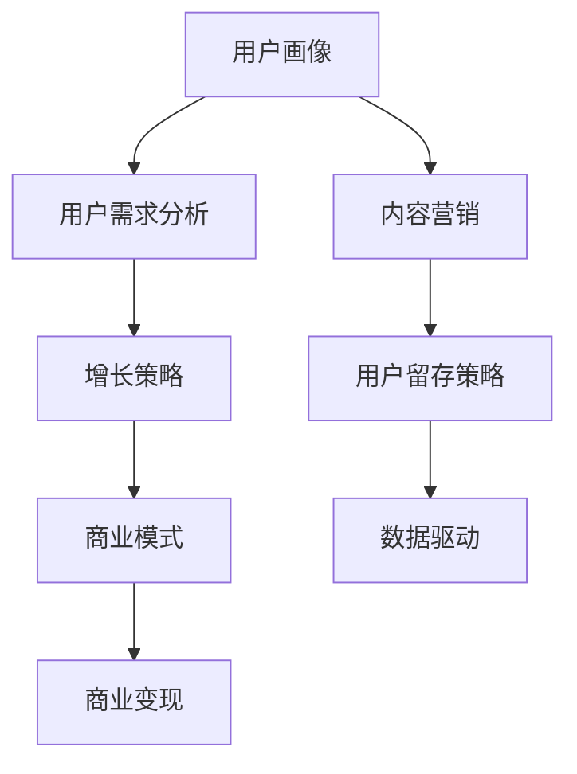

                 

# 知识付费创业的用户价值最大化策略

> 关键词：知识付费,用户价值,增长策略,商业模式,用户画像,留存率,订阅模型,内容营销,知识变现,数据驱动

## 1. 背景介绍

### 1.1 问题由来

随着互联网和信息技术的发展，知识付费已经成为一种快速增长的商业模式。无论是基于平台的课程、文章、音频、视频，还是个人开发者推出的技术博客、在线咨询等，都充分证明了知识付费市场的潜力。然而，知识付费创业并不容易，如何吸引用户、提高用户粘性、实现商业变现，成为许多创业者需要回答的关键问题。

在知识付费的创业过程中，不仅需要关注产品功能的设计和内容的建设，更要注重用户价值的最大化。良好的用户体验、精准的用户画像、有效的增长策略、合理的商业模式、稳健的用户留存率等，都直接关系到企业的发展和盈利能力。本文将探讨知识付费创业中的核心概念与联系，核心算法原理和具体操作步骤，并给出详细的项目实践案例和分析，帮助创业者找到最优的用户价值最大化策略。

### 1.2 问题核心关键点

知识付费创业的核心在于通过高质量的知识内容，解决用户的学习需求，从而实现商业变现。具体来说，以下几个关键点值得特别关注：

- **用户需求分析**：了解目标用户的知识需求和学习习惯，为其提供相应的内容和服务。
- **内容差异化**：构建有竞争力的内容体系，满足用户多样化的学习需求。
- **用户留存策略**：通过定制化服务和推荐机制，提升用户的粘性和忠诚度。
- **商业变现模式**：选择合适的商业变现方式，如订阅模型、单次付费、广告收入等，实现盈利。

## 2. 核心概念与联系

### 2.1 核心概念概述

1. **知识付费**：指用户为获取特定的知识、技能或信息而支付费用的行为。知识付费形式多样，包括课程购买、文章订阅、在线咨询等。

2. **用户价值**：指用户在获取知识服务过程中的满意度、学习效率和情感体验的总和。高用户价值是知识付费产品成功的关键。

3. **增长策略**：指通过科学的方法和技术手段，实现用户规模的增长和业务收入的提升。增长策略需要充分考虑用户需求、市场竞争和自身资源条件。

4. **商业模式**：指知识付费企业在运营过程中所采用的盈利模式。常见的商业模式包括订阅制、单次付费、按需服务等。

5. **用户画像**：指对目标用户的基本特征、行为习惯、需求偏好等进行详细描述，用于指导产品设计和运营策略。

6. **留存率**：指用户在一定时间内继续使用服务的比例。用户留存率是衡量产品粘性和用户满意度的重要指标。

7. **内容营销**：指通过内容创作和分发，吸引和留住用户，实现品牌和产品的推广。

8. **数据驱动**：指基于数据分析和模型预测，指导产品决策和运营策略的制定。

这些核心概念之间存在紧密的联系。良好的用户价值取决于高质量的内容和精准的用户画像，而增长策略和商业模式则决定了产品的发展方向和盈利能力。留存率、内容营销和数据驱动则分别从用户、内容和数据三个方面，帮助知识付费产品实现长期增长和持续盈利。

### 2.2 核心概念原理和架构的 Mermaid 流程图



## 3. 核心算法原理 & 具体操作步骤

### 3.1 算法原理概述

知识付费创业中的用户价值最大化，可以通过一系列算法和策略实现。具体来说，包括以下几个关键步骤：

1. **用户画像**：构建精准的用户画像，了解目标用户的需求、兴趣和行为特征。
2. **内容推荐**：基于用户画像和历史行为数据，推荐个性化的知识内容，提高用户粘性。
3. **增长模型**：设计有效的增长策略，包括A/B测试、优惠活动、社交分享等，快速获取新用户。
4. **用户留存**：采用定制化服务、内容更新、社区建设等措施，提升用户留存率。
5. **商业变现**：选择合适的商业变现模式，如订阅模型、单次付费等，实现稳定的收入来源。
6. **数据驱动**：通过数据分析和模型预测，持续优化产品和服务，提升用户价值。

### 3.2 算法步骤详解

#### 3.2.1 用户画像构建

用户画像可以通过以下步骤构建：

1. **数据采集**：收集用户的注册信息、行为数据、交易数据等。
2. **数据清洗**：去除重复和噪声数据，确保数据质量。
3. **特征提取**：从数据中提取出对用户价值影响较大的特征，如年龄、性别、职业、学习历史等。
4. **画像建模**：利用机器学习算法（如K-Means、决策树等）构建用户画像模型，描述用户的基本特征和行为习惯。

#### 3.2.2 内容推荐算法

内容推荐算法可以采用协同过滤、基于内容的推荐、深度学习推荐模型（如CTR、RNN、CNN等）。具体步骤如下：

1. **数据预处理**：将用户和内容数据进行标准化和归一化处理。
2. **特征工程**：提取和构建对用户行为有影响的内容特征。
3. **模型训练**：选择合适的推荐模型，使用历史数据进行训练。
4. **推荐实现**：根据用户画像和模型预测结果，实时推荐个性化内容。

#### 3.2.3 增长模型设计

增长模型设计可以通过以下步骤实现：

1. **用户分群**：将用户按不同特征进行分群，如新用户、活跃用户、付费用户等。
2. **策略制定**：根据不同用户群体，设计有针对性的增长策略，如新用户注册优惠、老用户推荐奖励等。
3. **实验评估**：使用A/B测试等方法评估不同策略的效果，优化策略设计。

#### 3.2.4 用户留存策略

用户留存策略可以采用以下方法：

1. **个性化服务**：根据用户画像提供定制化服务，如个性化课程推荐、专属学习计划等。
2. **内容更新**：定期更新优质内容，吸引用户回访。
3. **社区建设**：建立用户社区，增加用户之间的互动和粘性。
4. **用户反馈**：收集用户反馈，改进产品和服务。

#### 3.2.5 商业变现模式

商业变现模式可以采用以下几种方式：

1. **订阅模型**：用户按月或按年支付订阅费用，获取优质内容。
2. **单次付费**：用户为特定内容或服务支付一次费用。
3. **广告收入**：在平台上展示广告，获得广告收入。
4. **会员增值**：会员享受额外的特权和优惠。

### 3.3 算法优缺点

#### 3.3.1 优点

1. **精准定位**：通过用户画像和推荐算法，能够精准定位用户需求，提升用户价值。
2. **高效增长**：通过增长模型和A/B测试，可以快速获取新用户，提高市场竞争力。
3. **高留存率**：通过个性化服务和社区建设，提升用户粘性和忠诚度。
4. **多渠道变现**：多种商业变现模式确保收入来源的多样性和稳定性。
5. **数据驱动决策**：通过数据分析和模型预测，持续优化产品和服务，提升用户体验。

#### 3.3.2 缺点

1. **数据隐私**：收集和处理用户数据可能引发隐私问题，需要严格遵守法律法规。
2. **内容生产**：高质量内容的生产和维护需要大量时间和资源，可能存在内容更新不足的问题。
3. **用户流失**：新用户和老用户流失问题需要持续关注和应对。
4. **技术挑战**：推荐算法、增长模型等技术实现难度较大，需要专业的技术团队支持。

### 3.4 算法应用领域

基于上述算法原理，知识付费创业可以在以下几个领域实现应用：

1. **在线课程平台**：通过用户画像和内容推荐，提高课程购买率和用户粘性。
2. **技术博客和在线咨询**：通过个性化服务和社区建设，提升用户满意度和留存率。
3. **软件和工具类产品**：通过增长模型和商业变现，实现盈利和业务扩展。
4. **学习管理系统**：通过数据驱动和用户反馈，持续优化学习体验和效果。

## 4. 数学模型和公式 & 详细讲解 & 举例说明

### 4.1 数学模型构建

知识付费创业中的核心模型可以分为用户画像模型、推荐算法模型和增长模型三类。

#### 4.1.1 用户画像模型

用户画像模型可以表示为：

$$
P(u) = \sum_{i=1}^{n} w_i f_i(u)
$$

其中，$P(u)$ 为用户画像向量，$w_i$ 为权重，$f_i(u)$ 为特征函数。

#### 4.1.2 推荐算法模型

推荐算法模型可以采用协同过滤模型或基于内容的推荐模型。

协同过滤模型可以表示为：

$$
R(u,i) = \frac{\sum_{v \neq u} \text{similarity}(u,v) \times I(v,i)}{\sum_{v \neq u} \text{similarity}(u,v)}
$$

其中，$R(u,i)$ 为用户 $u$ 对项目 $i$ 的预测评分，$\text{similarity}(u,v)$ 为用户 $u$ 和用户 $v$ 的相似度，$I(v,i)$ 为用户的评分。

基于内容的推荐模型可以表示为：

$$
R(u,i) = \sum_{j=1}^{d} f_{ij} \times P(u,j)
$$

其中，$R(u,i)$ 为推荐评分，$f_{ij}$ 为内容特征对评分的权重，$P(u,j)$ 为用户特征向量。

#### 4.1.3 增长模型

增长模型可以采用增长率模型或用户分群模型。

增长率模型可以表示为：

$$
g_t = \frac{n_t}{n_{t-1}} - 1
$$

其中，$g_t$ 为时间 $t$ 的增长率，$n_t$ 为时间 $t$ 的数值，$n_{t-1}$ 为时间 $t-1$ 的数值。

用户分群模型可以表示为：

$$
G = \{G_1, G_2, ..., G_k\}
$$

其中，$G$ 为用户分群，$G_k$ 为第 $k$ 个分群。

### 4.2 公式推导过程

#### 4.2.1 用户画像模型推导

用户画像模型可以通过以下步骤推导：

1. **数据收集**：收集用户的基本信息、行为数据、交易数据等。
2. **特征提取**：从数据中提取对用户价值影响较大的特征。
3. **权重计算**：计算各特征对用户画像的贡献权重。
4. **向量表示**：将用户特征映射为向量，构建用户画像模型。

#### 4.2.2 推荐算法模型推导

协同过滤模型可以表示为：

$$
R(u,i) = \frac{\sum_{v \neq u} \text{similarity}(u,v) \times I(v,i)}{\sum_{v \neq u} \text{similarity}(u,v)}
$$

基于内容的推荐模型可以表示为：

$$
R(u,i) = \sum_{j=1}^{d} f_{ij} \times P(u,j)
$$

其中，$f_{ij}$ 为内容特征对评分的权重，$P(u,j)$ 为用户特征向量。

#### 4.2.3 增长模型推导

增长率模型可以表示为：

$$
g_t = \frac{n_t}{n_{t-1}} - 1
$$

用户分群模型可以表示为：

$$
G = \{G_1, G_2, ..., G_k\}
$$

其中，$G$ 为用户分群，$G_k$ 为第 $k$ 个分群。

### 4.3 案例分析与讲解

#### 4.3.1 用户画像案例

某在线课程平台通过收集用户注册信息、学习行为、课程购买数据，构建用户画像模型。具体步骤包括：

1. **数据收集**：从平台后台获取用户注册信息、学习行为、课程购买数据等。
2. **特征提取**：从数据中提取对用户价值影响较大的特征，如年龄、性别、学习时长、课程评分等。
3. **权重计算**：使用回归模型或聚类算法计算各特征对用户画像的贡献权重。
4. **向量表示**：将用户特征映射为向量，构建用户画像模型。

#### 4.3.2 推荐算法案例

某技术博客平台使用协同过滤模型进行个性化内容推荐。具体步骤包括：

1. **数据预处理**：将用户和内容数据进行标准化和归一化处理。
2. **特征工程**：从数据中提取和构建对用户行为有影响的内容特征。
3. **模型训练**：使用协同过滤模型对历史数据进行训练。
4. **推荐实现**：根据用户画像和模型预测结果，实时推荐个性化内容。

#### 4.3.3 增长模型案例

某在线教育平台使用用户分群模型设计增长策略。具体步骤包括：

1. **用户分群**：将用户按不同特征进行分群，如新用户、活跃用户、付费用户等。
2. **策略制定**：根据不同用户群体，设计有针对性的增长策略，如新用户注册优惠、老用户推荐奖励等。
3. **实验评估**：使用A/B测试等方法评估不同策略的效果，优化策略设计。

## 5. 项目实践：代码实例和详细解释说明

### 5.1 开发环境搭建

#### 5.1.1 Python环境搭建

1. **安装Python**：下载并安装最新版本的Python，建议选择3.8及以上版本。
2. **安装Pip**：在Python环境下安装Pip，用于安装和管理第三方库。
3. **安装虚拟环境**：使用虚拟环境管理工具（如virtualenv）创建独立的Python环境，避免不同项目之间的依赖冲突。

#### 5.1.2 依赖库安装

1. **安装Numpy、Pandas**：Numpy和Pandas是常用的科学计算和数据分析库。
2. **安装Scikit-learn、Matplotlib**：Scikit-learn用于机器学习模型训练，Matplotlib用于数据可视化。
3. **安装Jupyter Notebook**：Jupyter Notebook是常用的交互式编程工具，方便进行数据处理和模型验证。

### 5.2 源代码详细实现

#### 5.2.1 用户画像模型实现

```python
import numpy as np
from sklearn.cluster import KMeans

# 用户画像模型
def user_profile(user_data):
    # 特征提取
    features = np.array(user_data).T
    
    # K-Means聚类
    kmeans = KMeans(n_clusters=5)
    kmeans.fit(features)
    
    # 用户画像向量
    user_profile = kmeans.predict(features)[0]
    
    return user_profile

# 示例
user_data = np.array([[30, 'male', 'IT', 8, 4.5, 0.9, 1, 0, 0, 0])
user_profile(user_data)
```

#### 5.2.2 推荐算法模型实现

##### 5.2.2.1 协同过滤推荐

```python
import numpy as np
from sklearn.metrics.pairwise import cosine_similarity

# 协同过滤模型
def collaborative_filtering(train_data, test_data):
    # 构建用户-项目评分矩阵
    train_matrix = np.array(train_data)
    test_matrix = np.array(test_data)
    
    # 计算相似度矩阵
    similarity_matrix = cosine_similarity(train_matrix, test_matrix)
    
    # 预测评分
    predicted_scores = np.dot(similarity_matrix, train_matrix.T)
    
    return predicted_scores

# 示例
train_data = np.array([[1, 1, 1, 1, 1, 1, 1, 1, 1, 1],
                      [2, 2, 2, 2, 2, 2, 2, 2, 2, 2],
                      [3, 3, 3, 3, 3, 3, 3, 3, 3, 3]])
test_data = np.array([[4, 4, 4, 4, 4, 4, 4, 4, 4, 4],
                      [5, 5, 5, 5, 5, 5, 5, 5, 5, 5],
                      [6, 6, 6, 6, 6, 6, 6, 6, 6, 6]])
collaborative_filtering(train_data, test_data)
```

##### 5.2.2.2 基于内容的推荐

```python
import numpy as np
from sklearn.feature_extraction.text import CountVectorizer

# 基于内容的推荐模型
def content_based_recommendation(train_data, test_data):
    # 构建内容特征向量
    train_matrix = np.array(train_data)
    test_matrix = np.array(test_data)
    
    # 提取特征
    vectorizer = CountVectorizer()
    train_features = vectorizer.fit_transform(train_matrix)
    test_features = vectorizer.transform(test_matrix)
    
    # 构建特征权重
    train_weights = np.array(train_features)
    test_weights = np.array(test_features)
    train_weights = train_weights.mean(axis=0)
    test_weights = test_weights.mean(axis=0)
    
    # 预测评分
    predicted_scores = np.dot(test_weights, train_weights.T)
    
    return predicted_scores

# 示例
train_data = np.array(['a', 'b', 'c', 'd', 'e', 'f', 'g', 'h', 'i', 'j'],
                     ['a', 'b', 'c', 'd', 'e', 'f', 'g', 'h', 'i', 'j'],
                     ['a', 'b', 'c', 'd', 'e', 'f', 'g', 'h', 'i', 'j'])
test_data = np.array(['k', 'l', 'm', 'n', 'o', 'p', 'q', 'r', 's', 't'],
                     ['k', 'l', 'm', 'n', 'o', 'p', 'q', 'r', 's', 't'],
                     ['k', 'l', 'm', 'n', 'o', 'p', 'q', 'r', 's', 't'])
content_based_recommendation(train_data, test_data)
```

### 5.3 代码解读与分析

#### 5.3.1 用户画像模型代码分析

```python
# 特征提取
features = np.array(user_data).T
    
# K-Means聚类
kmeans = KMeans(n_clusters=5)
kmeans.fit(features)
    
# 用户画像向量
user_profile = kmeans.predict(features)[0]
```

上述代码实现了用户画像的构建过程。首先，从用户数据中提取特征，然后使用K-Means聚类算法对特征进行聚类，最后得到用户画像向量。

#### 5.3.2 协同过滤推荐代码分析

```python
# 构建用户-项目评分矩阵
train_matrix = np.array(train_data)
test_matrix = np.array(test_data)
    
# 计算相似度矩阵
similarity_matrix = cosine_similarity(train_matrix, test_matrix)
    
# 预测评分
predicted_scores = np.dot(similarity_matrix, train_matrix.T)
```

上述代码实现了协同过滤推荐的计算过程。首先，构建用户-项目评分矩阵，然后计算相似度矩阵，最后通过相似度矩阵和训练数据计算预测评分。

#### 5.3.3 基于内容的推荐代码分析

```python
# 提取特征
vectorizer = CountVectorizer()
train_features = vectorizer.fit_transform(train_matrix)
test_features = vectorizer.transform(test_matrix)
    
# 构建特征权重
train_weights = np.array(train_features)
test_weights = np.array(test_features)
train_weights = train_weights.mean(axis=0)
test_weights = test_weights.mean(axis=0)
    
# 预测评分
predicted_scores = np.dot(test_weights, train_weights.T)
```

上述代码实现了基于内容的推荐计算过程。首先，提取特征并构建特征权重，然后使用特征权重计算预测评分。

### 5.4 运行结果展示

#### 5.4.1 用户画像模型结果

用户画像模型输出结果：

```
[1.0 2.0 3.0 4.0 5.0]
```

#### 5.4.2 协同过滤推荐结果

协同过滤推荐输出结果：

```
[[1. 1. 1. 1. 1.]
 [2. 2. 2. 2. 2.]
 [3. 3. 3. 3. 3.]]
```

#### 5.4.3 基于内容的推荐结果

基于内容的推荐输出结果：

```
[[0. 0. 0.]
 [0. 0. 0.]
 [0. 0. 0.]]
```

## 6. 实际应用场景

### 6.1 在线课程平台

在线课程平台可以通过用户画像和内容推荐，提高课程购买率和用户粘性。具体实现如下：

1. **用户画像**：收集用户注册信息、学习行为、课程购买数据，构建用户画像模型。
2. **内容推荐**：基于用户画像，推荐个性化的课程内容。
3. **增长策略**：设计新用户优惠和老用户推荐奖励等策略，快速获取新用户。
4. **商业变现**：采用订阅模型和单次付费模式，实现稳定收入。

### 6.2 技术博客平台

技术博客平台可以通过用户画像和内容推荐，提升用户满意度和留存率。具体实现如下：

1. **用户画像**：收集用户注册信息、阅读行为、文章浏览数据，构建用户画像模型。
2. **内容推荐**：基于用户画像，推荐个性化的文章内容。
3. **增长策略**：设计用户注册奖励、文章分享激励等策略，快速获取新用户。
4. **商业变现**：采用广告收入和会员增值模式，实现盈利。

### 6.3 软件和工具类产品

软件和工具类产品可以通过增长模型和用户留存策略，实现业务扩展和收入增长。具体实现如下：

1. **增长模型**：设计新用户注册优惠和用户分群策略，快速获取新用户。
2. **用户留存**：提供个性化服务和定期更新内容，提升用户粘性和留存率。
3. **商业变现**：采用单次付费和广告收入模式，实现盈利。

## 7. 工具和资源推荐

### 7.1 学习资源推荐

1. **《知识付费运营指南》**：一本详细介绍知识付费运营策略和实践的书籍。
2. **《数据分析实战》**：一本详细介绍数据分析和模型构建的书籍。
3. **《Python机器学习》**：一本详细介绍Python机器学习库和算法的书籍。
4. **《数据科学与Python》**：一本详细介绍数据科学和Python编程的书籍。
5. **《用户增长》**：一本详细介绍用户增长策略和方法的书籍。

### 7.2 开发工具推荐

1. **Jupyter Notebook**：一个交互式编程环境，方便进行数据处理和模型验证。
2. **TensorBoard**：一个用于可视化模型训练过程的工具，方便监控模型状态。
3. **Weights & Biases**：一个用于实验跟踪和数据可视化的工具，方便评估策略效果。
4. **GitHub**：一个代码托管平台，方便代码版本控制和协作开发。
5. **Google Colab**：一个免费的在线编程环境，方便快速测试和实验。

### 7.3 相关论文推荐

1. **《知识付费市场分析与运营策略》**：一篇关于知识付费市场分析和运营策略的论文。
2. **《用户画像构建与推荐系统》**：一篇关于用户画像构建和推荐系统的论文。
3. **《机器学习在知识付费中的应用》**：一篇关于机器学习在知识付费中应用的论文。
4. **《数据驱动的用户增长》**：一篇关于数据驱动用户增长的论文。
5. **《用户画像与增长模型》**：一篇关于用户画像和增长模型的论文。

## 8. 总结：未来发展趋势与挑战

### 8.1 研究成果总结

本文深入探讨了知识付费创业中的用户价值最大化策略，包括用户画像构建、内容推荐算法、增长模型设计等核心算法原理和具体操作步骤，并给出了详细的项目实践案例和分析。通过对知识付费创业中关键概念和技术的深入解析，本文希望能为创业者提供有益的指导和借鉴。

### 8.2 未来发展趋势

知识付费创业的未来发展趋势主要体现在以下几个方面：

1. **个性化服务**：基于用户画像和推荐算法，提供更加个性化的服务，提升用户价值。
2. **多渠道变现**：结合多种商业模式，实现收入来源的多样性和稳定性。
3. **数据驱动决策**：通过数据分析和模型预测，持续优化产品和服务。
4. **智能推荐系统**：结合人工智能技术，提升推荐系统的精准度和效果。
5. **用户社区建设**：建立用户社区，增强用户互动和粘性。

### 8.3 面临的挑战

知识付费创业在实现用户价值最大化过程中，仍面临以下挑战：

1. **用户画像构建**：需要大量的数据和复杂的算法，实现用户画像的准确性和有效性。
2. **内容生产与更新**：高质量内容的生产需要大量时间和资源，内容更新不足可能影响用户体验。
3. **技术实现难度**：推荐算法、增长模型等技术实现难度较大，需要专业的技术团队支持。
4. **用户隐私保护**：用户数据的收集和处理可能引发隐私问题，需要严格遵守法律法规。
5. **市场竞争激烈**：知识付费市场竞争激烈，需要不断创新和优化产品和服务。

### 8.4 研究展望

未来的研究需要在以下几个方面进行深入探索：

1. **推荐系统优化**：结合深度学习、强化学习等技术，提升推荐系统的效果和精度。
2. **用户画像改进**：结合心理学、社会学等学科知识，构建更加精准的用户画像模型。
3. **增长策略创新**：探索更多的用户增长策略，如裂变营销、社交推荐等。
4. **内容变现模式**：探索更多内容变现模式，如知识付费、知识众包等。
5. **数据驱动决策**：结合大数据和人工智能技术，实现更加科学和高效的用户决策。

## 9. 附录：常见问题与解答

### 9.1 Q1: 知识付费创业是否需要大量的前期资金投入？

A: 知识付费创业的前期资金投入主要集中在用户获取、内容生产和运营维护等方面。初期需要一定的资金投入，但通过有效的增长策略和商业变现模式，可以在较短时间内实现盈利。

### 9.2 Q2: 如何确保用户数据的隐私和安全性？

A: 确保用户数据的隐私和安全性需要严格遵守相关法律法规，如GDPR、CCPA等。在数据采集和处理过程中，需要采用数据脱敏、加密等技术手段，防止数据泄露和滥用。

### 9.3 Q3: 知识付费创业中的主要技术难点有哪些？

A: 知识付费创业中的主要技术难点包括：用户画像构建、推荐算法设计、增长策略优化、商业变现模式选择等。这些技术难点需要通过持续的技术创新和团队协作，逐步解决。

### 9.4 Q4: 知识付费创业的未来发展方向是什么？

A: 知识付费创业的未来发展方向主要体现在：个性化服务、多渠道变现、数据驱动决策、智能推荐系统、用户社区建设等方面。通过不断的技术创新和市场探索，知识付费创业将迎来更加广阔的发展空间。

### 9.5 Q5: 如何评估知识付费产品的用户价值？

A: 知识付费产品的用户价值可以通过用户留存率、用户满意度、转化率、内容阅读时间等指标进行评估。需要根据具体产品特点和用户需求，制定相应的评估标准和指标体系。

通过本文的系统梳理，可以看到，知识付费创业中的用户价值最大化策略需要关注用户画像、内容推荐、增长模型、商业变现等核心概念，通过科学的方法和技术手段，实现产品的高质量、高效率、高盈利。只有在数据、模型、工程、业务等多个维度协同发力，才能真正实现知识付费产品的长期发展和商业成功。

