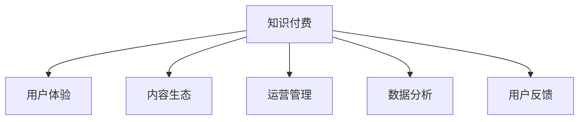

                 

# 知识付费创业者的自我提升策略

在互联网快速发展的时代，知识付费成为人们获取知识与技能的重要方式。然而，对于创业者和企业来说，如何有效地提升自身价值、把握市场机遇、创造持续的盈利模式，成为一项极具挑战性的任务。本文将深入探讨知识付费创业者的自我提升策略，从行业现状、核心概念、算法原理、项目实践、实际应用场景等方面展开分析，力求为知识付费创业者提供全方位的指导。

## 1. 背景介绍

### 1.1 问题由来
随着互联网普及和人们学习需求的增加，知识付费成为一种趋势，旨在帮助用户高效、系统地获取知识和技能，同时为创业者提供可持续发展的平台。然而，知识付费行业也面临诸多挑战，如内容质量参差不齐、用户体验不佳、盈利模式不清晰等。创业者需要在快速变化的市场中不断创新，才能脱颖而出。

### 1.2 问题核心关键点
为了在知识付费领域取得成功，创业者需要掌握以下几个关键点：
1. **用户需求分析**：准确把握用户的学习需求和痛点。
2. **优质内容生产**：构建高品质的内容体系，吸引用户订阅。
3. **高效运营管理**：优化平台运营，提升用户留存率。
4. **精准市场营销**：制定科学的市场营销策略，提升品牌知名度。
5. **盈利模式创新**：探索多样化的盈利模式，实现可持续发展。

### 1.3 问题研究意义
深入研究知识付费创业者的自我提升策略，有助于创业者更有效地应对市场变化，提升自身的核心竞争力，从而在激烈的竞争中站稳脚跟。同时，研究还能为行业内其他企业提供参考，推动知识付费行业的健康发展。

## 2. 核心概念与联系

### 2.1 核心概念概述

为更好地理解知识付费创业者的自我提升策略，本节将介绍几个密切相关的核心概念：

- **知识付费**：通过在线付费形式，提供高价值知识内容和服务的商业模式。常见形式包括课程、电子书、直播等。
- **用户体验**：用户在使用知识付费平台时的感受和满意度，直接影响用户的留存率和续费率。
- **内容生态**：知识付费平台中内容生产、消费和传播的生态系统，高质量的内容是吸引用户的重要因素。
- **运营管理**：知识付费平台的日常运营管理，包括用户管理、内容审核、营销推广等。
- **数据分析**：利用数据驱动决策，优化平台策略，提升运营效率。
- **用户反馈**：收集用户反馈，改进产品和服务，提升用户满意度。

这些核心概念之间的逻辑关系可以通过以下Mermaid流程图来展示：



这个流程图展示了几项关键概念之间的联系：

1. 知识付费平台通过提供高质量的内容吸引用户。
2. 用户体验直接影响用户的忠诚度。
3. 内容生态的形成依赖于优质内容的生产和传播。
4. 运营管理保障平台的平稳运行。
5. 数据分析和用户反馈为平台优化提供依据。

这些概念共同构成了知识付费平台的运营框架，使平台能够在激烈的市场竞争中取得成功。

## 3. 核心算法原理 & 具体操作步骤

### 3.1 算法原理概述

知识付费创业者的自我提升策略，本质上是一个综合性的优化过程。其核心思想是通过优化用户体验、构建优质内容、优化运营管理、探索盈利模式等手段，最大化平台价值和用户满意度。

形式化地，设知识付费平台 $P$ 的目标为最大化平台价值 $V$，可表示为：

$$
V = \max_{U, C, O, R} f(U, C, O, R)
$$

其中 $U$ 为用户体验，$C$ 为内容生态，$O$ 为运营管理，$R$ 为盈利模式。

通过优化这些关键维度，平台能够提升用户价值，实现可持续发展。

### 3.2 算法步骤详解

知识付费创业者的自我提升策略可以分为以下几个关键步骤：

**Step 1: 用户需求分析**
- 通过市场调研、用户访谈等方式，深入了解用户的学习需求和痛点。
- 使用问卷调查、数据分析等手段，定量分析用户行为和反馈。
- 根据分析结果，明确平台的内容定位和用户目标群体。

**Step 2: 优质内容生产**
- 构建高品质的内容体系，包括课程设计、内容制作、教师培训等。
- 引入专家学者、行业精英，提升内容的权威性和实用性。
- 加强内容审核，确保内容质量和合规性。

**Step 3: 高效运营管理**
- 建立完善的用户管理系统，提供个性化推荐、订阅管理等功能。
- 优化平台界面设计，提升用户体验和操作便捷性。
- 加强内容生态建设，引入优质内容提供商和推荐算法。

**Step 4: 精准市场营销**
- 制定科学的市场营销策略，包括内容推广、用户裂变、合作伙伴推广等。
- 利用社交媒体、搜索引擎优化等手段，提升品牌知名度。
- 定期进行市场分析，及时调整营销策略。

**Step 5: 盈利模式创新**
- 探索多样化的盈利模式，如订阅收费、按需付费、会员制等。
- 开发周边产品，如电子书、学习工具等，增加收入来源。
- 进行平台合作，引入付费广告、赞助等商业合作模式。

以上是知识付费创业者自我提升策略的一般流程。在实际应用中，还需要针对具体平台的特点，对各环节进行优化设计，如改进推荐算法、引入数据驱动决策、引入机器学习技术等，以进一步提升平台的用户价值和运营效率。

### 3.3 算法优缺点

知识付费创业者的自我提升策略具有以下优点：
1. 针对性强。通过市场调研和用户分析，能够准确把握用户需求，构建符合市场需求的内容体系。
2. 数据驱动。利用数据驱动决策，优化运营策略，提升平台效率。
3. 持续迭代。通过用户反馈和市场分析，不断调整优化策略，保持平台竞争力。

同时，该策略也存在一定的局限性：
1. 成本投入高。高质量内容的生产和运营管理需要大量的人力物力资源。
2. 市场风险大。市场需求变化快，需要持续投入和调整。
3. 用户流失率高。用户留存率受用户体验和内容质量影响较大。

尽管存在这些局限性，但就目前而言，基于用户需求分析和优质内容生产的策略仍是大规模知识付费创业者的主流范式。未来相关研究的重点在于如何进一步降低运营成本，提高市场响应速度，同时兼顾用户满意度和内容质量。

### 3.4 算法应用领域

基于知识付费创业者的自我提升策略，在教育培训、职业技能、生活知识等多个领域已经得到了广泛的应用，成为知识传播和教育培训的重要手段。

1. **教育培训**：如在线课程、直播讲座等，为学生提供系统化的学习内容。
2. **职业技能**：如编程课程、设计课程等，为职场人士提供技能提升的途径。
3. **生活知识**：如健康管理、家庭理财等，提升用户的生活质量。

除了这些经典领域外，知识付费创业者的策略还被创新性地应用到更多场景中，如智能助理、个性化推荐、社区互动等，为知识付费平台带来了新的活力。

## 4. 数学模型和公式 & 详细讲解 & 举例说明

### 4.1 数学模型构建

本节将使用数学语言对知识付费创业者的自我提升策略进行更加严格的刻画。

设知识付费平台的用户数量为 $N$，内容质量为 $C$，用户满意度为 $S$，内容生态健康度为 $E$，盈利模式成熟度为 $M$。定义平台价值 $V$ 为：

$$
V = f(N, C, S, E, M)
$$

其中 $f$ 为价值函数，可通过市场调研和数据分析进行建模。

### 4.2 公式推导过程

以下我们以用户满意度 $S$ 为例，推导其影响因素和优化方法。

设平台的用户满意度 $S$ 可分解为用户满意度的各项指标之和，如课程质量 $C_1$、内容更新频率 $C_2$、用户互动 $I$、售后服务 $A$ 等：

$$
S = S_1 + S_2 + S_3 + S_4
$$

其中：

$$
S_1 = \alpha_1 C_1
$$
$$
S_2 = \alpha_2 C_2
$$
$$
S_3 = \alpha_3 I
$$
$$
S_4 = \alpha_4 A
$$

其中 $\alpha_1, \alpha_2, \alpha_3, \alpha_4$ 为相应的权重系数，可从用户反馈和数据分析中得到。

通过最大化用户满意度 $S$，可以提升平台整体价值 $V$：

$$
V = \max_{C_1, C_2, I, A} f(N, C_1, C_2, I, A)
$$

在实践中，我们通常使用机器学习技术（如决策树、随机森林等）来近似求解上述最优化问题。

### 4.3 案例分析与讲解

以Coursera平台为例，分析其如何通过优化用户体验和内容生态，提升平台价值。

Coursera平台通过以下几个步骤提升用户体验：
1. **个性化推荐**：利用用户行为数据，提供个性化的课程推荐，提升课程点击率和订阅率。
2. **课程质量控制**：引入第三方机构审核课程质量，确保课程内容的高品质。
3. **互动性增强**：引入论坛、问答等互动功能，增加用户参与度。

在内容生态方面，Coursera平台通过以下几个步骤提升内容健康度：
1. **内容多样化**：引入多领域的优质课程，满足不同用户的需求。
2. **内容更新**：定期更新课程内容，保持课程的时效性和相关性。
3. **合作伙伴拓展**：与高校、企业合作，引入更多的优质内容提供商。

通过上述措施，Coursera平台实现了用户满意度和平台价值的显著提升。

## 5. 项目实践：代码实例和详细解释说明

### 5.1 开发环境搭建

在进行知识付费平台开发前，我们需要准备好开发环境。以下是使用Python进行Flask开发的环境配置流程：

1. 安装Anaconda：从官网下载并安装Anaconda，用于创建独立的Python环境。

2. 创建并激活虚拟环境：
```bash
conda create -n flask-env python=3.8 
conda activate flask-env
```

3. 安装Flask：
```bash
pip install flask
```

4. 安装各类工具包：
```bash
pip install numpy pandas scikit-learn matplotlib tqdm jupyter notebook ipython
```

完成上述步骤后，即可在`flask-env`环境中开始知识付费平台的开发。

### 5.2 源代码详细实现

下面我们以知识付费平台的内容推荐系统为例，给出使用Flask构建个性化推荐功能的代码实现。

首先，定义推荐系统的基础框架：

```python
from flask import Flask, request, jsonify

app = Flask(__name__)

@app.route('/recommend', methods=['POST'])
def recommend():
    user_id = request.json.get('user_id')
    content = request.json.get('content')
    # 调用推荐算法模块，获取推荐结果
    recommendations = get_recommendations(user_id, content)
    return jsonify(recommendations)
```

然后，定义推荐算法模块，实现基于用户行为数据的推荐算法：

```python
def get_recommendations(user_id, content):
    # 根据用户行为数据，获取推荐的课程列表
    # 调用推荐算法库，如LightFM、Surprise等
    # 返回推荐结果
    recommendations = []
    # ...
    return recommendations
```

最后，启动Flask服务并测试：

```python
if __name__ == '__main__':
    app.run(debug=True)
```

以上就是使用Flask构建知识付费平台推荐系统的完整代码实现。可以看到，通过Flask，我们可以快速搭建一个基础的推荐系统，满足用户个性化的内容需求。

### 5.3 代码解读与分析

让我们再详细解读一下关键代码的实现细节：

**推荐系统基础框架**：
- 使用Flask框架，定义推荐接口`/recommend`，接收用户ID和内容数据作为输入，返回推荐结果。
- 使用`request.json`获取前端发送的JSON数据，包含用户ID和内容数据。

**推荐算法模块**：
- 定义`get_recommendations`函数，根据用户行为数据和内容数据，调用推荐算法库，获取推荐结果。
- 这里采用了基于协同过滤的推荐算法，如LightFM、Surprise等，可以根据用户历史行为和相似用户推荐课程。

**启动Flask服务**：
- 通过`if __name__ == '__main__':`判断条件，确保Flask服务在运行脚本时启动。
- `app.run(debug=True)`启动Flask服务，并开启调试模式。

可以看到，Flask使得构建知识付费平台推荐系统的代码实现变得简洁高效。开发者可以将更多精力放在推荐算法的设计和优化上，而不必过多关注底层的实现细节。

当然，工业级的系统实现还需考虑更多因素，如用户数据的安全性、推荐结果的多样性、算法的实时性等。但核心的个性化推荐范式基本与此类似。

## 6. 实际应用场景

### 6.1 智能学习社区

基于知识付费创业者的策略，智能学习社区可以为用户提供一站式的学习解决方案。社区平台不仅提供课程内容，还包括互动论坛、学习计划、智能导师等，帮助用户系统化地学习新知识。

在技术实现上，可以收集用户的学习行为数据，如课程观看时长、讨论频率等，结合推荐算法，为每位用户定制个性化的学习计划和课程推荐。通过智能导师，社区平台还可以实时跟踪用户的学习进度，提供个性化反馈和辅导。

### 6.2 职业技能培训

对于职场人士来说，时间紧迫、内容庞杂是学习的主要障碍。知识付费创业者的策略可以帮助企业构建灵活、高效的职业技能培训平台，提升员工的职业技能。

在技术实现上，企业可以通过员工行为数据，分析员工的培训需求和学习习惯，推荐适合的培训课程。同时，引入在线直播、互动式学习等灵活的教学方式，提升培训效果。企业还可以通过考试和测评系统，对员工的学习成果进行评估，激励员工持续学习。

### 6.3 生活知识普及

生活知识普及平台通过知识付费创业者的策略，为用户提供贴近生活的实用知识，如健康管理、家庭理财、日常小技巧等。这些平台不仅提供内容，还包括互动问答、社区讨论等形式，增加用户参与度。

在技术实现上，平台可以引入专家讲座、知识分享等形式，吸引用户参与。同时，利用社交媒体、搜索引擎优化等手段，提升平台的知名度和用户粘性。平台还可以通过互动问答和社区讨论，增加用户之间的互动，形成知识分享的良性循环。

### 6.4 未来应用展望

随着知识付费创业者的策略不断演进，基于这些策略的知识付费平台将拓展到更多场景，为各个领域提供专业的知识服务。

在教育培训领域，知识付费平台将提供更多个性化的学习路径，提升学生的学习效率。在职业技能领域，企业将利用知识付费平台，为员工提供灵活、高效的技能培训。在生活知识领域，平台将提供更多实用的生活指南，提升用户的生活质量。

同时，随着知识付费策略的不断优化，平台的用户体验将更加完善，盈利模式将更加多元化，进一步推动知识付费行业的发展。

## 7. 工具和资源推荐

### 7.1 学习资源推荐

为了帮助开发者系统掌握知识付费创业者的自我提升策略，这里推荐一些优质的学习资源：

1. **《知识付费：商业模式与运营策略》**：系统介绍知识付费的商业模式、用户需求分析、内容生产与运营等关键环节。
2. **Coursera平台案例分析**：分析Coursera平台的用户推荐和内容生态建设，提供详细的策略和实现方案。
3. **Udacity课程推荐系统**：探讨在线教育平台的个性化推荐系统，提供丰富的推荐算法和实践案例。
4. **知识付费数据科学**：深入讲解知识付费平台的数据科学应用，如用户行为分析、推荐系统构建等。
5. **社交媒体营销**：分析社交媒体在知识付费平台中的作用，提供切实可行的营销策略。

通过对这些资源的学习实践，相信你一定能够快速掌握知识付费创业者的核心策略，并用于解决实际的运营问题。

### 7.2 开发工具推荐

高效的开发离不开优秀的工具支持。以下是几款用于知识付费平台开发常用的工具：

1. **Flask**：基于Python的轻量级Web框架，简单易用，适合快速迭代。
2. **TensorFlow**：谷歌主导的深度学习框架，生产部署方便，适合大规模工程应用。
3. **Keras**：高级神经网络API，易于上手，适合快速原型开发。
4. **Jupyter Notebook**：交互式编程环境，支持代码和注释的混合编写，适合数据分析和模型调试。
5. **Docker**：容器化工具，支持跨平台部署，方便系统管理和扩展。

合理利用这些工具，可以显著提升知识付费平台的开发效率，加快创新迭代的步伐。

### 7.3 相关论文推荐

知识付费创业者的自我提升策略源于学界的持续研究。以下是几篇奠基性的相关论文，推荐阅读：

1. **《知识付费平台的用户需求分析》**：探讨用户需求的多维分析方法，提升平台的精准定位。
2. **《个性化推荐系统在知识付费平台中的应用》**：分析推荐系统的构建和优化，提升用户满意度。
3. **《智能学习社区的用户行为分析》**：利用数据分析和机器学习技术，提升智能学习社区的用户体验。
4. **《面向职业培训的在线教育平台》**：研究在线教育平台的用户管理和课程推荐，提升培训效果。
5. **《生活知识普及平台的内容建设》**：分析生活知识普及平台的内容策略和用户互动，提升平台活跃度。

这些论文代表了大语言模型微调技术的发展脉络。通过学习这些前沿成果，可以帮助研究者把握学科前进方向，激发更多的创新灵感。

## 8. 总结：未来发展趋势与挑战

### 8.1 总结

本文对知识付费创业者的自我提升策略进行了全面系统的介绍。首先阐述了知识付费行业的现状和重要性，明确了策略在提升平台价值和用户满意度方面的独特价值。其次，从原理到实践，详细讲解了用户需求分析、优质内容生产、高效运营管理、精准市场营销和盈利模式创新等关键步骤，给出了知识付费平台开发的完整代码实例。同时，本文还广泛探讨了策略在智能学习社区、职业技能培训、生活知识普及等多个行业领域的应用前景，展示了策略的广泛潜力。

通过本文的系统梳理，可以看到，知识付费创业者的自我提升策略正在成为知识付费平台的重要范式，极大地拓展了平台的运营边界，催生了更多的落地场景。受益于高质量的内容和数据驱动的决策，知识付费平台能够更好地服务用户，推动知识的传播与积累。未来，伴随策略的不断优化和创新，知识付费行业将持续发展，为社会进步和经济发展做出更大的贡献。

### 8.2 未来发展趋势

展望未来，知识付费创业者的自我提升策略将呈现以下几个发展趋势：

1. **内容创新与多样化**：内容是知识付费平台的核心竞争力，未来将更加注重内容创新和多样化，引入更多优质资源和专家学者。
2. **技术驱动与智能化**：利用人工智能技术，如自然语言处理、推荐系统等，提升平台的用户体验和运营效率。
3. **用户参与与社区化**：增强用户参与度和社区互动，形成知识分享的良性循环，提升平台的活跃度和用户粘性。
4. **全球化与国际化**：拓展全球市场，引入多语言和多文化的内容，提升平台的国际化水平。
5. **政策合规与安全性**：加强内容审核和用户隐私保护，确保平台运营的合法合规性。

这些趋势凸显了知识付费创业者自我提升策略的广阔前景。这些方向的探索发展，必将进一步提升平台的用户价值和运营效率，为知识付费行业带来新的活力。

### 8.3 面临的挑战

尽管知识付费创业者的自我提升策略已经取得了瞩目成就，但在迈向更加智能化、普适化应用的过程中，它仍面临诸多挑战：

1. **成本投入高**：高质量内容的生产和运营管理需要大量的人力物力资源。
2. **市场风险大**：市场需求变化快，需要持续投入和调整。
3. **用户流失率高**：用户留存率受用户体验和内容质量影响较大。
4. **技术壁垒高**：平台运营和内容推荐等环节需要一定的技术储备。
5. **竞争激烈**：市场竞争激烈，需要不断创新才能脱颖而出。

尽管存在这些挑战，但就目前而言，基于用户需求分析和优质内容生产的策略仍是大规模知识付费创业者的主流范式。未来相关研究的重点在于如何进一步降低运营成本，提高市场响应速度，同时兼顾用户满意度和内容质量。

### 8.4 研究展望

面对知识付费创业者自我提升策略所面临的种种挑战，未来的研究需要在以下几个方面寻求新的突破：

1. **引入更多先验知识**：将符号化的先验知识，如知识图谱、逻辑规则等，与神经网络模型进行巧妙融合，提升推荐系统的准确性和泛化能力。
2. **多模态数据融合**：将文本、图像、视频等多模态数据整合，提升内容的多样性和用户体验。
3. **模型压缩与优化**：在保证推荐精度的情况下，优化模型结构，减小计算资源消耗，提高平台的实时响应能力。
4. **用户行为分析**：利用机器学习技术，深入分析用户行为，提升推荐系统和个性化服务的精准度。
5. **用户隐私保护**：加强用户隐私保护，确保数据安全，提升用户信任度。

这些研究方向将推动知识付费行业迈向更加智能化、普适化的未来，为更多用户提供优质的知识服务。

## 9. 附录：常见问题与解答

**Q1：知识付费平台的盈利模式有哪些？**

A: 知识付费平台的盈利模式主要包括以下几种：
1. **订阅收费**：用户支付月度或年度费用，获取平台上的所有内容。
2. **按需付费**：用户根据具体课程内容支付费用，获取该课程的访问权。
3. **会员制**：用户支付会员费用，享受特定权益，如优先购买、专属课程等。
4. **广告收入**：平台通过展示广告，获取收入。
5. **课程销售**：平台销售课程电子书、工作手册等衍生产品，增加收入来源。

**Q2：如何提升知识付费平台的用户留存率？**

A: 提升知识付费平台的用户留存率，可以从以下几个方面入手：
1. **优质内容**：持续推出高质量的课程和内容，吸引用户订阅。
2. **互动性增强**：提供社区讨论、在线答疑等功能，增加用户参与度。
3. **个性化推荐**：利用推荐算法，提供个性化的课程推荐，提升用户满意度。
4. **用户体验**：优化平台界面设计，提升用户体验。
5. **用户粘性**：通过奖励机制、积分系统等，增加用户粘性。

**Q3：知识付费平台如何应对市场变化？**

A: 知识付费平台应对市场变化，需要从以下几个方面进行：
1. **市场调研**：持续进行市场调研，了解市场需求和趋势变化。
2. **内容更新**：根据市场变化，及时更新课程内容，保持内容的时效性。
3. **用户反馈**：收集用户反馈，改进产品和服务，提升用户满意度。
4. **灵活营销**：根据市场变化，及时调整市场营销策略，提升品牌知名度。
5. **数据分析**：利用数据驱动决策，优化运营策略，提升运营效率。

**Q4：知识付费平台如何进行用户需求分析？**

A: 知识付费平台进行用户需求分析，可以从以下几个方面入手：
1. **问卷调查**：通过问卷调查，了解用户的学习需求和痛点。
2. **数据分析**：利用用户行为数据，分析用户的学习习惯和偏好。
3. **用户访谈**：通过用户访谈，深入了解用户的真实需求和反馈。
4. **市场调研**：分析市场趋势和竞争对手，了解用户需求变化。
5. **社区讨论**：通过社区讨论，获取用户真实反馈和建议。

通过以上方法，平台可以准确把握用户需求，提供符合用户期望的内容和服务，提升用户体验和满意度。

---

作者：禅与计算机程序设计艺术 / Zen and the Art of Computer Programming

