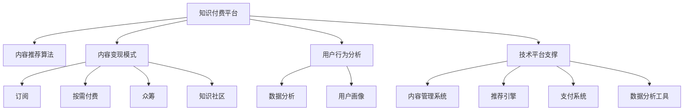

                 

## 1. 背景介绍

### 1.1 问题由来

近年来，随着知识付费平台的兴起，内容变现成为互联网行业的重要趋势。知识付费的兴起，源于人们对知识价值和学习的深度认同，更反映出信息过载时代个体对精准化、个性化知识的迫切需求。

在知识付费领域，内容创作者、平台运营商、用户三方构成了一个生态系统。内容创作者生产知识，平台运营商负责内容分发和变现，用户则是知识内容的消费者。然而，这一系统面临诸多挑战，如内容同质化严重、内容推荐算法粗糙、付费转化率低等问题。如何通过高效的知识变现模式，优化内容创作和分发，提升用户体验，是亟待解决的关键问题。

### 1.2 问题核心关键点

知识付费创业的关键在于如何将知识有效地变现，即实现高质量内容与用户的精准匹配，同时提高内容消费的转化率和粘性。具体问题包括：

1. **内容推荐算法**：如何利用大数据、人工智能等技术，构建精准推荐模型，将高质量知识推荐给真正需要它的人。
2. **内容变现模式**：除了传统订阅模式，还可以探索哪些创新的变现途径，如按需付费、众筹、知识社区等。
3. **用户行为分析**：如何通过数据挖掘和行为分析，提升用户对知识的付费意愿和满意度。
4. **商业模式设计**：如何设计可持续、可盈利的商业模式，吸引内容创作者和用户。
5. **技术平台支撑**：如何构建高效、易用的知识付费平台，支持内容创作、分发、变现等环节。

## 2. 核心概念与联系

### 2.1 核心概念概述

为更好地理解知识付费创业的核心概念，本节将介绍几个密切相关的核心概念：

- **知识付费平台**：一个连接内容创作者和用户的在线平台，提供内容分发、交易、订阅等功能。
- **内容推荐算法**：利用机器学习和数据分析技术，构建精准推荐模型，将合适的内容推荐给用户。
- **内容变现模式**：如订阅模式、按需付费、众筹、知识社区等，通过不同的方式实现知识的经济价值。
- **用户行为分析**：通过数据挖掘和行为分析，了解用户需求和行为特征，指导内容推荐和平台优化。
- **技术平台支撑**：包括内容管理系统、推荐引擎、支付系统、数据分析工具等，为知识付费平台提供技术支持。

这些核心概念之间的逻辑关系可以通过以下Mermaid流程图来展示：



这个流程图展示的知识付费平台的核心概念及其之间的关系：

1. 知识付费平台通过内容推荐算法，精准分发内容，满足用户需求。
2. 平台利用不同的变现模式，实现内容经济的有效流转。
3. 通过用户行为分析，平台不断优化内容推荐和分发策略。
4. 技术平台支撑确保了知识付费平台的稳定运行和高效运作。

## 3. 核心算法原理 & 具体操作步骤

### 3.1 算法原理概述

知识付费创业的核心在于构建高效、精准的知识变现体系。其核心思想是：利用数据驱动和算法推荐，将高质量知识推荐给有需求的用户，并通过多元化的变现模式实现知识的经济价值。

形式化地，假设内容集合为 $C$，用户集合为 $U$。知识付费平台的推荐算法可以表示为：

$$
\pi: C \times U \rightarrow \{1,0\}
$$

其中 $\pi$ 表示推荐模型，对于每个用户 $u \in U$，模型会推荐一个内容集合 $C_u$，使得用户 $u$ 从中获得最大收益。推荐模型的目标是最大化整体收益：

$$
\max_{\pi} \sum_{u \in U} u(C_u)
$$

其中 $u(C_u)$ 为用户 $u$ 消费内容集合 $C_u$ 的收益。

通过优化推荐模型，平台可以实现内容与用户的精准匹配，提升用户体验和付费转化率。同时，通过分析用户行为数据，平台还可以发现用户的付费意愿和需求，为内容变现提供数据支撑。

### 3.2 算法步骤详解

基于推荐算法的知识付费平台推荐过程一般包括以下几个关键步骤：

**Step 1: 数据准备**
- 收集和清洗用户行为数据，如浏览、购买、评分等。
- 收集和清洗内容属性数据，如标题、摘要、标签等。
- 建立用户画像，包括兴趣偏好、消费能力、历史行为等。

**Step 2: 特征工程**
- 对用户和内容数据进行特征提取，如用户标签、内容标签、用户行为等。
- 构建用户与内容的特征矩阵，用于后续的推荐模型训练。

**Step 3: 模型训练**
- 选择适合的推荐算法模型，如协同过滤、基于内容的推荐、深度学习等。
- 使用特征矩阵和标注数据，训练推荐模型。

**Step 4: 推荐和反馈**
- 将训练好的模型应用到实时数据中，推荐符合用户偏好的内容。
- 收集用户反馈数据，如浏览时间、点击率、购买率等，用于模型优化。

**Step 5: 数据分析和优化**
- 利用用户反馈数据，优化推荐模型和变现策略。
- 进行A/B测试，不断迭代推荐算法和内容变现模式。

### 3.3 算法优缺点

基于推荐算法的知识付费创业方法具有以下优点：
1. 精准推荐：通过数据驱动的推荐算法，可以实现高质量内容的精准分发，提升用户满意度和付费意愿。
2. 高效变现：通过多元化的变现模式，如订阅、按需付费、众筹等，实现内容的经济价值。
3. 用户行为分析：通过分析用户行为数据，了解用户需求和行为特征，指导内容推荐和平台优化。
4. 数据驱动：利用大数据和人工智能技术，实现内容的动态优化和个性化推荐。

同时，该方法也存在一定的局限性：
1. 数据依赖：推荐算法的效果很大程度上依赖于数据的丰富性和准确性，高质量数据获取成本较高。
2. 模型复杂：深度学习等复杂的推荐算法需要较高的计算资源和算法技术门槛，对平台技术团队的要求较高。
3. 用户体验单一：推荐的单一模式可能难以满足所有用户的需求，用户可能会感到疲劳。
4. 内容同质化：若内容推荐算法不当，可能导致内容同质化，影响用户体验。

尽管存在这些局限性，但就目前而言，基于推荐算法的知识付费创业方法仍是一种高效、可行的内容变现途径。未来相关研究的重点在于如何进一步降低推荐算法对数据的依赖，提高模型的可解释性和易用性，同时兼顾用户体验和内容多样性。

### 3.4 算法应用领域

基于推荐算法的知识付费创业方法在多个领域得到了广泛应用，例如：

- 在线教育：通过推荐个性化课程和学习资源，提升学习效果。
- 健康咨询：推荐健康知识和个性化健康建议，满足用户健康需求。
- 职场技能培训：推荐职业培训课程和资源，提升职业技能。
- 文化娱乐：推荐音乐、电影、书籍等文化内容，满足用户娱乐需求。
- 财经资讯：推荐财经新闻、分析报告等金融知识，提升用户投资决策能力。

除了上述这些经典领域外，知识付费创业方法也被创新性地应用到更多场景中，如知识社区、企业内训、科研知识共享等，为知识付费市场带来了新的发展空间。

## 4. 数学模型和公式 & 详细讲解 & 举例说明

### 4.1 数学模型构建

本节将使用数学语言对基于推荐算法的知识付费创业模型进行更加严格的刻画。

记用户集合为 $U$，内容集合为 $C$。用户对内容 $c \in C$ 的评分（即收益）为 $r_{uc}$。构建用户与内容的评分矩阵 $R \in \mathbb{R}^{N \times M}$，其中 $N$ 为内容数量，$M$ 为用户数量，$r_{uc}$ 表示用户 $u$ 对内容 $c$ 的评分。

定义用户-内容矩阵 $X \in \mathbb{R}^{M \times F}$ 和内容特征矩阵 $Y \in \mathbb{R}^{N \times D}$，其中 $X$ 和 $Y$ 分别表示用户和内容的特征向量，$F$ 为用户的特征维度，$D$ 为内容的特征维度。

推荐模型 $\pi$ 的目标是最小化预测评分与真实评分的差异，即：

$$
\min_{\pi} \sum_{u=1}^{M} \sum_{c=1}^{N} (r_{uc} - \pi(r_{uc}))^2
$$

其中 $\pi(r_{uc})$ 为推荐模型对内容 $c$ 的评分预测。

### 4.2 公式推导过程

以下我们以协同过滤算法为例，推导推荐模型的评分预测公式。

协同过滤算法基于用户历史评分数据构建相似度矩阵，通过寻找相似用户和相似内容，预测用户对新内容的评分。假设用户 $u$ 和内容 $c$ 的评分 $r_{uc}$ 已知，协同过滤算法的目标是找到与用户 $u$ 和内容 $c$ 相似的用户和内容，从而预测用户 $u$ 对内容 $c$ 的评分。

协同过滤算法的评分预测公式为：

$$
\pi(r_{uc}) = \alpha \sum_{u' \in U} \sum_{c' \in C} \frac{r_{u'c'}}{\sqrt{(\sum_{c'' \in C} r_{u'c''}^2)(\sum_{u'' \in U} r_{u''c'}^2)} \times \frac{r_{u'c'}}{\sqrt{(\sum_{u'' \in U} r_{u''c'}^2)(\sum_{c'' \in C} r_{u'c''}^2)} \times \alpha
$$

其中 $\alpha$ 为超参数，控制相似度矩阵的权重。协同过滤算法通过寻找用户和内容的相似度，进行评分预测，实现内容的推荐。

在得到推荐模型的评分预测公式后，即可将其应用到实时数据中，进行内容推荐和用户行为分析。

### 4.3 案例分析与讲解

假设某知识付费平台收集了用户对课程的评分数据 $R \in \mathbb{R}^{1000 \times 100}$，其中 $1000$ 为课程数量，$100$ 为用户数量。用户对课程的评分矩阵为 $X \in \mathbb{R}^{100 \times 50}$ 和 $Y \in \mathbb{R}^{1000 \times 50}$，其中 $50$ 为特征维度。

采用协同过滤算法进行评分预测，可以计算出用户与课程的相似度矩阵 $S \in \mathbb{R}^{100 \times 1000}$。基于相似度矩阵，可以构建用户对新课程的评分预测，从而推荐符合用户兴趣的课程。

具体实现步骤如下：
1. 将评分数据标准化，去除异常值。
2. 利用用户特征和课程特征进行协同过滤，计算用户与课程的相似度矩阵。
3. 根据相似度矩阵，预测用户对新课程的评分。
4. 根据预测评分，推荐新课程给用户。

通过上述步骤，知识付费平台可以实现内容的高效推荐和用户行为分析，提升用户体验和付费转化率。

## 5. 项目实践：代码实例和详细解释说明

### 5.1 开发环境搭建

在进行知识付费创业实践前，我们需要准备好开发环境。以下是使用Python进行知识付费平台开发的典型环境配置流程：

1. 安装Python：从官网下载并安装最新版本的Python。
2. 安装必要的依赖库：如TensorFlow、Scikit-learn、Pandas等，用于数据处理和模型训练。
3. 安装Web框架：如Flask、Django等，用于构建知识付费平台的用户界面和后台管理。
4. 安装数据库：如MySQL、PostgreSQL等，用于存储用户行为数据和内容信息。
5. 安装支付系统：如PayPal、Alipay等，用于支付功能实现。
6. 安装推荐引擎：如TensorFlow Recommenders、Surprise等，用于构建推荐模型。

完成上述步骤后，即可在本地搭建一个知识付费平台，开始系统开发。

### 5.2 源代码详细实现

下面以构建一个简单的知识付费推荐系统为例，给出使用Python和TensorFlow Recommenders库进行推荐系统开发的PyTorch代码实现。

首先，定义数据处理函数：

```python
import pandas as pd
from sklearn.preprocessing import StandardScaler
from tensorflow_recommenders import Recommender

class RecommendationSystem:
    def __init__(self, path):
        self.data = pd.read_csv(path)
        self.scaler = StandardScaler()
        self.data['rating'] = self.scaler.fit_transform(self.data['rating'].values.reshape(-1, 1))
        self.data.drop(columns=['user_id', 'item_id'], inplace=True)

    def build_recommender(self):
        recommender = Recommender.SVD(ranker='ALS')
        recommender.build(self.data)

    def recommend_items(self, user_id, num_recommendations=5):
        predictions = self.recommender.predict(user_id, num_recommendations=num_recommendations)
        return self.data.iloc[predictions.index].copy()

# 构建推荐系统实例
rs = RecommendationSystem('data.csv')
rs.build_recommender()

# 推荐前10条内容给用户1
recommendations = rs.recommend_items(1)
print(recommendations)
```

然后，定义用户界面和后台管理：

```python
from flask import Flask, render_template, request

app = Flask(__name__)

@app.route('/')
def index():
    return render_template('index.html')

@app.route('/recommend', methods=['POST'])
def recommend():
    user_id = request.form.get('user_id')
    recommendations = rs.recommend_items(int(user_id))
    return render_template('recommend.html', recommendations=pd.DataFrame(recommendations))

if __name__ == '__main__':
    app.run(debug=True)
```

在HTML模板中，可以显示推荐结果：

```html
<!DOCTYPE html>
<html>
<head>
    <title>推荐系统</title>
</head>
<body>
    <h1>推荐内容</h1>
    <table>
        <thead>
            <tr>
                <th>内容ID</th>
                <th>内容名</th>
                <th>评分</th>
            </tr>
        </thead>
        <tbody>
            
                <tr>
                    <td>{{ item['item_id'] }}</td>
                    <td>{{ item['item_name'] }}</td>
                    <td>{{ item['rating'] }}</td>
                </tr>
            
        </tbody>
    </table>
</body>
</html>
```

在推荐系统界面输入用户ID，服务器会调用后端API，使用TensorFlow Recommenders库构建推荐模型，并返回推荐结果。用户界面显示推荐内容列表，供用户选择。

### 5.3 代码解读与分析

让我们再详细解读一下关键代码的实现细节：

**RecommendationSystem类**：
- `__init__`方法：从CSV文件中加载数据，并进行标准化处理。
- `build_recommender`方法：构建协同过滤推荐模型。
- `recommend_items`方法：根据用户ID，使用推荐模型预测并返回推荐结果。

**Flask应用**：
- `index`方法：渲染用户界面模板。
- `recommend`方法：接收用户提交的用户ID，调用推荐系统API返回推荐内容。
- `app.run`方法：启动Web应用，监听端口，等待请求。

**HTML模板**：
- 显示推荐内容列表，用户可以自行选择查看。

可以看到，使用Python和TensorFlow Recommenders库，可以轻松构建一个简单的知识付费推荐系统。开发者可以在此基础上，进一步扩展功能，如添加搜索、用户注册、支付功能等。

## 6. 实际应用场景

### 6.1 在线教育

在线教育平台可以利用推荐算法，为学生推荐符合其学习进度和兴趣的课程和资源。平台可以根据学生的学习行为和评分数据，构建个性化推荐模型，推荐适合的学习内容和作业练习，提升学习效果。

在技术实现上，可以采用协同过滤、基于内容的推荐、深度学习等方法，根据学生的学习行为和评分数据，构建个性化推荐模型，推荐适合的学习内容和作业练习，提升学习效果。

### 6.2 健康咨询

健康咨询平台可以利用推荐算法，为患者推荐合适的健康知识和个性化健康建议。平台可以根据患者的健康数据和行为数据，构建个性化推荐模型，推荐适合的健康知识和健康建议，满足患者健康需求。

在技术实现上，可以采用协同过滤、基于内容的推荐、深度学习等方法，根据患者的健康数据和行为数据，构建个性化推荐模型，推荐适合的健康知识和健康建议，满足患者健康需求。

### 6.3 职场技能培训

职场技能培训平台可以利用推荐算法，为员工推荐合适的培训课程和职业发展资源。平台可以根据员工的职业需求和行为数据，构建个性化推荐模型，推荐适合的培训课程和职业发展资源，提升员工职业技能。

在技术实现上，可以采用协同过滤、基于内容的推荐、深度学习等方法，根据员工的职业需求和行为数据，构建个性化推荐模型，推荐适合的培训课程和职业发展资源，提升员工职业技能。

### 6.4 未来应用展望

随着推荐算法和大数据技术的发展，知识付费创业方法将在更多领域得到应用，为传统行业带来变革性影响。

在智慧教育领域，基于推荐算法的知识付费平台可以为学生提供个性化的学习体验，提升学习效果。平台可以根据学生的学习行为和评分数据，构建个性化推荐模型，推荐适合的学习内容和作业练习，提升学习效果。

在智慧医疗领域，基于推荐算法的健康咨询平台可以为患者提供个性化的健康建议，提升健康水平。平台可以根据患者的健康数据和行为数据，构建个性化推荐模型，推荐适合的健康知识和健康建议，满足患者健康需求。

在智慧金融领域，基于推荐算法的财经资讯平台可以为投资者提供个性化的财经信息，提升投资决策能力。平台可以根据投资者的投资行为和评分数据，构建个性化推荐模型，推荐适合的财经新闻和分析报告，提升投资决策能力。

此外，在智能家居、智慧旅游、智慧城市等多个领域，基于推荐算法的知识付费创业方法也将不断涌现，为各行各业带来新的发展机遇。相信随着推荐算法和大数据技术的发展，基于推荐算法的知识付费平台将迎来更广阔的应用前景。

## 7. 工具和资源推荐

### 7.1 学习资源推荐

为了帮助开发者系统掌握推荐算法的理论基础和实践技巧，这里推荐一些优质的学习资源：

1. 《推荐系统实践》系列博文：由推荐系统专家撰写，深入浅出地介绍了推荐算法原理和应用，涵盖协同过滤、深度学习、混合推荐等方向。

2. 《推荐系统算法》课程：由清华大学开设的推荐系统课程，包括协同过滤、基于内容的推荐、矩阵分解等算法原理和实现。

3. 《Recommender Systems in Practice》书籍：推荐系统领域的经典书籍，涵盖了推荐算法、评估指标、推荐系统架构等。

4. Coursera《Recommender Systems Specialization》课程：由台湾国立清华大学开设的推荐系统课程，系统讲解推荐系统理论和实践。

5. Kaggle推荐系统竞赛：参加Kaggle的推荐系统竞赛，在实战中学习推荐算法，积累推荐系统开发经验。

通过对这些资源的学习实践，相信你一定能够快速掌握推荐算法的精髓，并用于解决实际的推荐问题。

### 7.2 开发工具推荐

高效的开发离不开优秀的工具支持。以下是几款用于知识付费推荐系统开发的常用工具：

1. TensorFlow Recommenders：Google开源的推荐系统库，提供了协同过滤、矩阵分解等推荐算法，适合构建高质量推荐系统。

2. Surprise：Python推荐系统库，支持多种推荐算法，易于使用和扩展。

3. PyTorch：开源深度学习框架，灵活高效，适合构建深度学习推荐模型。

4. Scikit-learn：开源机器学习库，包含多种数据预处理和特征工程工具，方便推荐系统开发。

5. Pandas：开源数据处理库，支持大规模数据处理和分析，适合推荐系统数据清洗和处理。

6. TensorBoard：TensorFlow配套的可视化工具，可以实时监测推荐系统训练状态，可视化评估指标。

合理利用这些工具，可以显著提升知识付费推荐系统的开发效率，加快创新迭代的步伐。

### 7.3 相关论文推荐

推荐算法和大数据技术的发展源于学界的持续研究。以下是几篇奠基性的相关论文，推荐阅读：

1. BPR: Bayesian Personalized Ranking from Raw Data：提出基于协同过滤的推荐算法，利用用户与内容的评分数据，进行推荐排序。

2. Collaborative Filtering for Implicit Feedback Datasets：提出基于矩阵分解的推荐算法，通过用户与内容的交互矩阵，进行推荐预测。

3. Deep Matrix Factorization：提出基于深度神经网络的推荐算法，通过深度学习模型，进行用户和内容的表示学习。

4. Context-aware Recommendation: From Individual to Group Level：提出基于上下文的推荐算法，考虑用户行为和内容属性，进行推荐预测。

5. A Survey on Deep Learning for Recommendation Systems：综述了深度学习在推荐系统中的应用，包括深度神经网络、自编码器、变分自编码器等。

这些论文代表了大数据推荐系统的发展脉络。通过学习这些前沿成果，可以帮助研究者把握学科前进方向，激发更多的创新灵感。

## 8. 总结：未来发展趋势与挑战

### 8.1 总结

本文对基于推荐算法的知识付费创业方法进行了全面系统的介绍。首先阐述了知识付费创业的背景和核心问题，明确了推荐算法在内容推荐和用户行为分析中的独特价值。其次，从原理到实践，详细讲解了推荐算法的数学模型和具体实现，给出了推荐系统开发的完整代码实例。同时，本文还广泛探讨了推荐算法在在线教育、健康咨询、职场培训等多个行业领域的应用前景，展示了推荐算法的广泛应用。此外，本文精选了推荐算法的各类学习资源，力求为开发者提供全方位的技术指引。

通过本文的系统梳理，可以看到，基于推荐算法的知识付费创业方法正在成为NLP领域的重要范式，极大地拓展了内容创作和分发的智能化水平，提升了用户体验和付费转化率。未来，伴随推荐算法和大数据技术的发展，基于推荐算法的知识付费平台将迎来更广阔的应用前景。

### 8.2 未来发展趋势

展望未来，推荐算法和大数据技术的发展将带来知识付费创业的更多可能性：

1. 推荐算法的智能化：基于深度学习和强化学习等智能算法，推荐算法将更加精准和个性化。智能推荐系统将根据用户的实时行为，动态优化推荐结果，提升用户满意度。

2. 推荐算法的融合化：推荐算法将与其他人工智能技术进行融合，如知识表示、因果推理、自然语言处理等，构建更加全面、灵活的推荐系统。

3. 推荐算法的多模态化：推荐系统将引入多模态数据，如文本、图片、视频等，进行联合建模，提升推荐效果和用户体验。

4. 推荐算法的可解释性：推荐算法将通过可解释的模型和方法，提升推荐系统的透明度和可信度，满足用户和监管机构的需求。

5. 推荐算法的公平性：推荐算法将通过公平性约束，避免推荐偏见和歧视，保障用户的权益和隐私。

以上趋势凸显了推荐算法和大数据技术的广阔前景。这些方向的探索发展，必将进一步提升知识付费平台的智能化水平，为推荐系统带来更多创新和突破。

### 8.3 面临的挑战

尽管基于推荐算法的知识付费创业方法已经取得了显著成果，但在迈向更加智能化、普适化应用的过程中，它仍面临诸多挑战：

1. 数据获取和处理：推荐算法需要大量的用户行为数据和内容数据，数据获取和处理成本较高。如何高效、可靠地获取高质量数据，是一个重要挑战。

2. 算法复杂性：深度学习和强化学习等复杂算法需要较高的技术门槛和计算资源，推广应用存在难度。如何降低算法复杂性，提高算法易用性，需要进一步研究。

3. 推荐系统鲁棒性：推荐算法面对异常数据和恶意攻击时，可能出现模型失效等问题。如何提高推荐系统的鲁棒性和稳定性，需要持续改进。

4. 推荐系统的公平性：推荐算法可能存在推荐偏见和歧视，导致用户权益受损。如何设计公平、透明、可解释的推荐算法，是一个重要研究方向。

5. 推荐系统的可解释性：推荐系统通常被视为"黑盒"，缺乏对推荐结果的可解释性，用户难以理解和信任推荐结果。如何提升推荐系统的可解释性，满足用户和监管机构的需求，是亟待解决的问题。

6. 推荐系统的隐私保护：推荐算法需要收集用户行为数据，如何保护用户隐私，防止数据泄露和滥用，是一个重要挑战。

正视推荐算法和大数据技术面临的这些挑战，积极应对并寻求突破，将使知识付费创业方法迈向成熟的阶段。相信随着学界和产业界的共同努力，这些问题终将一一被克服，知识付费创业方法将带来更多智能、普适的推荐体验。

### 8.4 研究展望

面对推荐算法和大数据技术面临的挑战，未来的研究需要在以下几个方面寻求新的突破：

1. 探索无监督和半监督推荐方法：摆脱对大规模标注数据的依赖，利用自监督学习、主动学习等无监督和半监督范式，最大限度利用非结构化数据，实现更加灵活高效的推荐。

2. 研究参数高效和计算高效的推荐范式：开发更加参数高效的推荐方法，在固定大部分用户和内容表示的同时，只更新极少量的推荐结果。同时优化推荐算法的计算图，减少前向传播和反向传播的资源消耗，实现更加轻量级、实时性的部署。

3. 引入因果分析和博弈论工具：将因果分析方法引入推荐系统，识别出推荐决策的关键特征，增强推荐系统的可解释性和稳定性。借助博弈论工具刻画人机交互过程，主动探索并规避推荐系统的脆弱点，提高系统稳定性。

4. 纳入伦理道德约束：在推荐系统训练目标中引入伦理导向的评估指标，过滤和惩罚有偏见、有害的输出倾向。同时加强人工干预和审核，建立推荐系统的监管机制，确保推荐系统符合人类价值观和伦理道德。

这些研究方向的探索，必将引领推荐算法和大数据技术的进一步发展，为知识付费创业方法带来更多创新和突破。面向未来，推荐算法和大数据技术需要与其他人工智能技术进行更深入的融合，如知识表示、因果推理、自然语言处理等，多路径协同发力，共同推动知识付费平台的智能化进步。只有勇于创新、敢于突破，才能不断拓展推荐算法的边界，让智能技术更好地服务于知识付费市场。

## 9. 附录：常见问题与解答

**Q1：推荐算法是否适用于所有知识付费领域？**

A: 推荐算法在大多数知识付费领域都能取得不错的效果，特别是对于数据量较大的领域。但对于一些特定领域的知识付费，如医学、法律等，推荐算法的效果可能受限。此时需要在特定领域语料上进一步预训练，再进行推荐。

**Q2：如何提高推荐算法的准确性？**

A: 提高推荐算法的准确性，可以从以下几个方面入手：
1. 数据预处理：对数据进行标准化、归一化处理，去除异常值，提高数据质量。
2. 特征工程：通过特征提取和选择，提高特征的有效性和多样性。
3. 模型优化：选择适合的推荐算法，优化模型参数，提高模型的泛化能力。
4. 在线学习：利用在线学习算法，不断更新模型，适应新的数据和行为特征。
5. 多样性控制：控制推荐结果的多样性，避免推荐单一内容，提高用户体验。

**Q3：推荐算法面临哪些技术挑战？**

A: 推荐算法面临的技术挑战主要包括以下几点：
1. 数据稀疏性：用户和内容的交互数据稀疏，可能导致推荐算法失效。
2. 冷启动问题：新用户和内容的推荐难度大，需要特殊处理。
3. 动态数据变化：用户和内容行为随时间变化，需要动态更新模型。
4. 推荐系统鲁棒性：面对异常数据和恶意攻击，推荐系统需要具备鲁棒性。
5. 推荐系统可解释性：推荐系统通常被视为"黑盒"，缺乏对推荐结果的可解释性。

尽管存在这些挑战，但通过技术创新和算法优化，推荐算法仍然可以实现高质量内容的推荐，提升知识付费平台的用户体验和付费转化率。

**Q4：推荐算法的商业化应用需要注意哪些问题？**

A: 推荐算法的商业化应用需要注意以下几个问题：
1. 用户隐私保护：推荐算法需要收集用户行为数据，如何保护用户隐私，防止数据泄露和滥用，是一个重要问题。
2. 推荐系统公平性：推荐算法可能存在推荐偏见和歧视，导致用户权益受损，需要设计公平、透明的推荐算法。
3. 推荐系统可解释性：推荐系统通常被视为"黑盒"，缺乏对推荐结果的可解释性，需要提升推荐系统的可解释性，满足用户和监管机构的需求。
4. 推荐系统鲁棒性：推荐算法面对异常数据和恶意攻击时，可能出现模型失效等问题，需要提高推荐系统的鲁棒性和稳定性。

通过合理设计和应用推荐算法，知识付费平台可以实现高效的内容推荐和用户行为分析，提升用户体验和付费转化率，实现商业化成功。

---

作者：禅与计算机程序设计艺术 / Zen and the Art of Computer Programming

