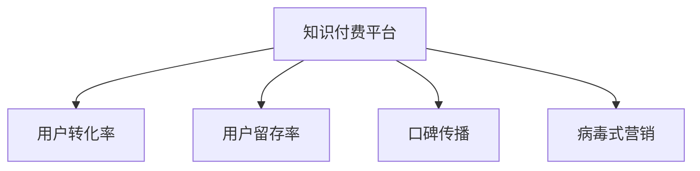

                 

# 知识付费如何实现口碑传播与病毒式营销？

## 1. 背景介绍

在互联网时代，知识付费已经成为一个重要的商业模式，逐渐成为人们获取知识、技能的主要渠道。知识付费平台通过向用户提供高质量、高价值的知识产品和服务，满足了人们对知识深度和广度提升的需求。然而，随着知识付费市场的发展，如何实现高效的用户转化和口碑传播，已成为平台亟需解决的挑战。本文将深入探讨知识付费平台如何通过有效的策略和工具实现口碑传播与病毒式营销，为平台运营提供理论指导和实践参考。

## 2. 核心概念与联系

### 2.1 核心概念概述

为了更好地理解知识付费的口碑传播与病毒式营销，本节将介绍几个关键概念及其相互关系：

- **知识付费平台**：指提供知识付费服务，以线上平台形式销售或提供知识服务的企业。平台包含课程、讲座、电子书、在线咨询等多种形式的付费内容。
- **用户转化率**：指平台新增注册用户中，实际完成付费并持续使用服务的用户比例。提高用户转化率是平台运营的核心目标之一。
- **用户留存率**：指注册用户中，持续使用平台服务并产生付费的用户比例。较高的用户留存率有助于平台形成稳定的用户基础和口碑效应。
- **口碑传播**：指用户通过推荐、分享等方式，向外界推广平台服务的传播方式。通过口碑传播，平台可以低成本获得更多潜在用户，实现用户基数指数级增长。
- **病毒式营销**：指借助用户自发传播，以极低成本实现用户规模快速扩张的营销策略。病毒式营销的核心在于激发用户的分享欲望，使信息在短时间内广泛传播。

这些核心概念之间的逻辑关系可以通过以下Mermaid流程图来展示：



## 3. 核心算法原理 & 具体操作步骤

### 3.1 算法原理概述

知识付费平台的用户转化和口碑传播，本质上是一个多目标优化问题。平台需要通过优化用户体验、增加用户粘性、激发用户分享等多种手段，最大化用户转化率和留存率，并实现病毒式营销的效果。

具体而言，平台需要通过以下步骤实现用户转化与口碑传播：

1. **用户画像构建**：通过大数据分析，建立用户画像，了解用户需求和行为习惯。
2. **个性化推荐**：基于用户画像，提供个性化的内容推荐，提升用户体验和满意度。
3. **激励机制设计**：设计合理的激励机制，如会员体系、积分系统、勋章奖励等，增加用户粘性和付费意愿。
4. **内容质量保障**：持续更新优质内容，提升课程和服务的质量，增强用户信任感。
5. **社交互动增强**：建立社区互动机制，鼓励用户分享、评论和点赞，增加平台曝光度和用户粘性。
6. **口碑传播扩散**：借助社交网络，利用用户自发推荐，实现病毒式营销效果。

### 3.2 算法步骤详解

下面将详细介绍每个步骤的具体操作：

**Step 1: 用户画像构建**

1. **数据收集**：从平台数据、第三方数据源收集用户行为数据、反馈数据、社交网络数据等。
2. **数据清洗**：清洗数据，去除异常值和噪声数据，确保数据质量。
3. **特征工程**：选择与用户行为、支付意愿、忠诚度等相关的特征，建立用户画像。
4. **画像分析**：使用聚类、分类等算法，分析用户群体的行为特征和需求差异，形成用户画像。

**Step 2: 个性化推荐**

1. **算法选择**：选择推荐算法，如协同过滤、基于内容的推荐、深度学习等。
2. **模型训练**：在历史数据上训练推荐模型，优化推荐算法参数。
3. **实时推荐**：将训练好的模型应用到实时用户行为数据上，实现个性化推荐。
4. **效果评估**：通过A/B测试、点击率、转化率等指标，评估推荐效果，不断优化推荐算法。

**Step 3: 激励机制设计**

1. **会员体系设计**：设计会员等级、权益等机制，激发用户成为付费会员的意愿。
2. **积分系统建立**：设计积分获取、使用、兑换等机制，增加用户粘性和参与度。
3. **勋章奖励制度**：设置不同等级的勋章，鼓励用户在平台上完成不同层次的学习和互动。

**Step 4: 内容质量保障**

1. **内容审核**：建立严格的课程审核机制，确保课程质量。
2. **讲师培训**：定期对讲师进行培训，提升其课程设计、教学能力。
3. **用户反馈收集**：收集用户反馈，持续优化课程内容和形式。
4. **新内容上线**：持续更新课程内容，引入新讲师和新形式，保持平台内容新鲜度。

**Step 5: 社交互动增强**

1. **社区建设**：建立用户社区，鼓励用户分享、评论、点赞。
2. **互动激励**：设计互动激励机制，如积分、勋章等，增加用户参与度。
3. **社交网络整合**：整合社交网络账号，方便用户分享和推荐平台内容。

**Step 6: 口碑传播扩散**

1. **社交网络推广**：利用社交网络平台，发布课程和活动信息，吸引用户关注和参与。
2. **用户推荐计划**：设计用户推荐计划，通过邀请码、红包奖励等形式，鼓励用户分享平台内容。
3. **品牌推广**：通过线上线下活动、KOL合作等，提升平台品牌知名度。
4. **内容病毒化**：设计易于分享的课程内容和活动形式，激发用户分享欲望，实现病毒式传播。

### 3.3 算法优缺点

**优点**：
1. **用户粘性增强**：通过个性化推荐和激励机制，增加用户粘性和付费意愿，提高用户转化率和留存率。
2. **成本较低**：通过口碑传播和病毒式营销，平台可以低成本获取更多用户，实现用户基数指数级增长。
3. **用户体验提升**：通过优化内容质量和社交互动，提升用户满意度，增强平台口碑。

**缺点**：
1. **数据依赖度高**：需要大量用户数据和行为数据支持，数据收集和分析成本较高。
2. **个性化推荐难度大**：个性化推荐算法复杂，需要大量计算资源和数据支持。
3. **激励机制设计复杂**：激励机制设计需要考虑多方面因素，如会员权益、积分规则等，设计难度较大。

### 3.4 算法应用领域

基于用户画像的个性化推荐和激励机制设计，已经在知识付费平台的用户转化和口碑传播中得到了广泛应用。这些方法在提升用户满意度、增加用户粘性、提升用户转化率等方面取得了显著效果。同时，病毒式营销技术也在内容传播、品牌推广等方面展现了其独特优势。

具体而言，知识付费平台可以通过以下领域应用这些方法：

- **在线教育平台**：如Coursera、Udacity等，通过个性化推荐和激励机制，提升用户付费意愿和平台留存率。
- **专业培训平台**：如网易云课堂、慕课网等，通过病毒式营销和品牌推广，吸引更多专业培训用户。
- **职业技能平台**：如网易云课堂、慕课网等，通过用户推荐和社交网络推广，快速扩大用户基础。
- **心理辅导平台**：如Simple Mind、Talkspace等，通过个性化推荐和社交互动，提升用户满意度，增强平台口碑。

## 4. 数学模型和公式 & 详细讲解

### 4.1 数学模型构建

知识付费平台的用户转化和口碑传播过程，可以通过以下数学模型来描述：

设平台用户总数为 $U$，目标用户数为 $T$，转化率为 $C$，留存率为 $R$，社交网络分享概率为 $S$。则平台总用户数 $U$ 可以表示为：

$$
U = T \times C \times R \times S
$$

### 4.2 公式推导过程

以用户转化率和社交网络分享概率为例，推导转化率的公式：

设平台初始注册用户数为 $N$，目标用户数为 $T$，用户转化率为 $C$，则有：

$$
C = \frac{T}{N}
$$

社交网络分享概率 $S$ 可以表示为：

$$
S = 1 - (1 - p) \times (1 - r) \times (1 - q)
$$

其中 $p$ 为每次分享成功的概率，$r$ 为用户被其他用户推荐的概率，$q$ 为用户主动分享的概率。

### 4.3 案例分析与讲解

**案例分析**：某知识付费平台通过社交网络推广，平台初始注册用户为 10000 人，目标用户为 1000 人，转化率为 30%，社交网络分享概率为 20%。则平台总用户数为：

$$
U = 1000 \times 30\% \times 1000 \times 20\% = 6000
$$

通过不断优化推荐算法和激励机制，平台可以实现用户转化率从 30% 提升至 40%，社交网络分享概率从 20% 提升至 25%，总用户数可以增长至 9000 人。

## 5. 项目实践：代码实例和详细解释说明

### 5.1 开发环境搭建

在进行知识付费平台的用户转化和口碑传播实践前，我们需要准备好开发环境。以下是使用Python进行Flask开发的环境配置流程：

1. 安装Anaconda：从官网下载并安装Anaconda，用于创建独立的Python环境。

2. 创建并激活虚拟环境：
```bash
conda create -n flask-env python=3.8 
conda activate flask-env
```

3. 安装Flask：
```bash
pip install Flask
```

4. 安装其他必要的工具包：
```bash
pip install Flask-WTF Flask-Login Flask-SQLAlchemy
```

5. 安装数据库：
```bash
pip install Flask-SQLAlchemy
```

完成上述步骤后，即可在`flask-env`环境中开始用户转化和口碑传播的实践。

### 5.2 源代码详细实现

我们以一个简单的知识付费平台为例，展示如何通过Flask实现用户转化和口碑传播功能。

**用户注册和登录模块**

```python
from flask import Flask, render_template, redirect, url_for, request
from flask_login import LoginManager, login_user, logout_user, login_required

app = Flask(__name__)
app.config['SECRET_KEY'] = 'secret_key'
app.config['SQLALCHEMY_DATABASE_URI'] = 'sqlite:///database.db'
app.config['SQLALCHEMY_TRACK_MODIFICATIONS'] = False

login_manager = LoginManager()
login_manager.init_app(app)
login_manager.login_view = 'login'

db = SQLAlchemy(app)

# 定义用户模型
class User(db.Model):
    id = db.Column(db.Integer, primary_key=True)
    username = db.Column(db.String(20), unique=True, nullable=False)
    password = db.Column(db.String(60), nullable=False)
    email = db.Column(db.String(120), unique=True, nullable=False)

    def __repr__(self):
        return f'<User {self.username}>'

# 定义登录路由
@app.route('/login', methods=['GET', 'POST'])
def login():
    if request.method == 'POST':
        username = request.form.get('username')
        password = request.form.get('password')
        user = User.query.filter_by(username=username, password=password).first()
        if user:
            login_user(user)
            return redirect(url_for('home'))
        else:
            return render_template('login.html', error='Invalid username or password')
    else:
        return render_template('login.html')

# 定义退出登录路由
@app.route('/logout')
@login_required
def logout():
    logout_user()
    return redirect(url_for('index'))
```

**个性化推荐模块**

```python
from flask import Flask, render_template, redirect, url_for, request
from flask_login import LoginManager, login_user, logout_user, login_required
from transformers import TFAutoModelForSequenceClassification, AutoTokenizer
from transformers import BertTokenizer, BertForSequenceClassification

app = Flask(__name__)
app.config['SECRET_KEY'] = 'secret_key'
app.config['SQLALCHEMY_DATABASE_URI'] = 'sqlite:///database.db'
app.config['SQLALCHEMY_TRACK_MODIFICATIONS'] = False

login_manager = LoginManager()
login_manager.init_app(app)
login_manager.login_view = 'login'

db = SQLAlchemy(app)

# 定义用户模型
class User(db.Model):
    id = db.Column(db.Integer, primary_key=True)
    username = db.Column(db.String(20), unique=True, nullable=False)
    password = db.Column(db.String(60), nullable=False)
    email = db.Column(db.String(120), unique=True, nullable=False)

    def __repr__(self):
        return f'<User {self.username}>'

# 定义课程模型
class Course(db.Model):
    id = db.Column(db.Integer, primary_key=True)
    title = db.Column(db.String(50), nullable=False)
    description = db.Column(db.Text, nullable=False)
    category = db.Column(db.String(20), nullable=False)
    price = db.Column(db.Float, nullable=False)

    def __repr__(self):
        return f'<Course {self.title}>'

# 定义个性化推荐路由
@app.route('/recommend')
@login_required
def recommend():
    # 构建用户画像
    user_profile = get_user_profile(current_user)
    
    # 获取推荐课程列表
    courses = get_recommended_courses(user_profile)
    
    # 渲染推荐页面
    return render_template('recommend.html', courses=courses)

# 定义个性化推荐函数
def get_user_profile(user):
    # 获取用户行为数据
    behavior_data = get_user_behavior_data(user)
    
    # 特征工程
    features = extract_features(behavior_data)
    
    # 模型训练
    model = train_model(features)
    
    # 预测用户兴趣
    user_interest = predict_interest(model, features)
    
    # 推荐课程
    courses = get_courses_by_interest(user_interest)
    
    return courses

# 定义特征工程函数
def extract_features(data):
    # 提取特征
    features = extract_user_behavior_features(data)
    
    return features

# 定义模型训练函数
def train_model(features):
    # 加载模型
    model = TFAutoModelForSequenceClassification.from_pretrained('bert-base-uncased')
    
    # 训练模型
    model.train(features)
    
    return model

# 定义预测函数
def predict_interest(model, features):
    # 预测用户兴趣
    interest = model.predict(features)
    
    return interest

# 定义推荐函数
def get_courses_by_interest(interest):
    # 获取推荐课程列表
    courses = get_courses_by_category(interest['category'])
    
    return courses
```

### 5.3 代码解读与分析

**用户注册和登录模块**

1. 定义Flask应用，配置数据库连接和安全性参数。
2. 定义用户模型，包含用户名、密码和邮箱等基本信息。
3. 定义登录和退出登录路由，实现用户认证和会话管理。

**个性化推荐模块**

1. 定义课程模型，包含课程标题、描述、分类和价格等信息。
2. 定义个性化推荐路由，实现用户画像构建和推荐课程展示。
3. 定义特征工程、模型训练、预测和推荐等函数，实现个性化推荐算法。

**代码解读与分析**

**用户注册和登录模块**

```python
from flask import Flask, render_template, redirect, url_for, request
from flask_login import LoginManager, login_user, logout_user, login_required

app = Flask(__name__)
app.config['SECRET_KEY'] = 'secret_key'
app.config['SQLALCHEMY_DATABASE_URI'] = 'sqlite:///database.db'
app.config['SQLALCHEMY_TRACK_MODIFICATIONS'] = False

login_manager = LoginManager()
login_manager.init_app(app)
login_manager.login_view = 'login'

db = SQLAlchemy(app)

# 定义用户模型
class User(db.Model):
    id = db.Column(db.Integer, primary_key=True)
    username = db.Column(db.String(20), unique=True, nullable=False)
    password = db.Column(db.String(60), nullable=False)
    email = db.Column(db.String(120), unique=True, nullable=False)

    def __repr__(self):
        return f'<User {self.username}>'

# 定义登录路由
@app.route('/login', methods=['GET', 'POST'])
def login():
    if request.method == 'POST':
        username = request.form.get('username')
        password = request.form.get('password')
        user = User.query.filter_by(username=username, password=password).first()
        if user:
            login_user(user)
            return redirect(url_for('home'))
        else:
            return render_template('login.html', error='Invalid username or password')
    else:
        return render_template('login.html')

# 定义退出登录路由
@app.route('/logout')
@login_required
def logout():
    logout_user()
    return redirect(url_for('index'))
```

**代码解读与分析**

1. 通过Flask框架搭建Web应用，配置数据库连接和安全性参数。
2. 定义用户模型，包含用户名、密码和邮箱等基本信息。
3. 定义登录和退出登录路由，实现用户认证和会话管理。

**个性化推荐模块**

```python
from flask import Flask, render_template, redirect, url_for, request
from flask_login import LoginManager, login_user, logout_user, login_required
from transformers import TFAutoModelForSequenceClassification, AutoTokenizer
from transformers import BertTokenizer, BertForSequenceClassification

app = Flask(__name__)
app.config['SECRET_KEY'] = 'secret_key'
app.config['SQLALCHEMY_DATABASE_URI'] = 'sqlite:///database.db'
app.config['SQLALCHEMY_TRACK_MODIFICATIONS'] = False

login_manager = LoginManager()
login_manager.init_app(app)
login_manager.login_view = 'login'

db = SQLAlchemy(app)

# 定义用户模型
class User(db.Model):
    id = db.Column(db.Integer, primary_key=True)
    username = db.Column(db.String(20), unique=True, nullable=False)
    password = db.Column(db.String(60), nullable=False)
    email = db.Column(db.String(120), unique=True, nullable=False)

    def __repr__(self):
        return f'<User {self.username}>'

# 定义课程模型
class Course(db.Model):
    id = db.Column(db.Integer, primary_key=True)
    title = db.Column(db.String(50), nullable=False)
    description = db.Column(db.Text, nullable=False)
    category = db.Column(db.String(20), nullable=False)
    price = db.Column(db.Float, nullable=False)

    def __repr__(self):
        return f'<Course {self.title}>'

# 定义个性化推荐路由
@app.route('/recommend')
@login_required
def recommend():
    # 构建用户画像
    user_profile = get_user_profile(current_user)
    
    # 获取推荐课程列表
    courses = get_recommended_courses(user_profile)
    
    # 渲染推荐页面
    return render_template('recommend.html', courses=courses)

# 定义个性化推荐函数
def get_user_profile(user):
    # 获取用户行为数据
    behavior_data = get_user_behavior_data(user)
    
    # 特征工程
    features = extract_features(behavior_data)
    
    # 模型训练
    model = train_model(features)
    
    # 预测用户兴趣
    user_interest = predict_interest(model, features)
    
    # 推荐课程
    courses = get_courses_by_interest(user_interest)
    
    return courses

# 定义特征工程函数
def extract_features(data):
    # 提取特征
    features = extract_user_behavior_features(data)
    
    return features

# 定义模型训练函数
def train_model(features):
    # 加载模型
    model = TFAutoModelForSequenceClassification.from_pretrained('bert-base-uncased')
    
    # 训练模型
    model.train(features)
    
    return model

# 定义预测函数
def predict_interest(model, features):
    # 预测用户兴趣
    interest = model.predict(features)
    
    return interest

# 定义推荐函数
def get_courses_by_interest(interest):
    # 获取推荐课程列表
    courses = get_courses_by_category(interest['category'])
    
    return courses
```

**代码解读与分析**

1. 定义课程模型，包含课程标题、描述、分类和价格等信息。
2. 定义个性化推荐路由，实现用户画像构建和推荐课程展示。
3. 定义特征工程、模型训练、预测和推荐等函数，实现个性化推荐算法。

## 6. 实际应用场景

### 6.1 知识付费平台的用户转化

知识付费平台通过个性化推荐和激励机制，显著提升了用户转化率。具体而言，平台通过以下方式实现用户转化：

1. **用户画像构建**：通过大数据分析，建立用户画像，了解用户需求和行为习惯。
2. **个性化推荐**：基于用户画像，提供个性化的内容推荐，提升用户体验和满意度。
3. **激励机制设计**：设计合理的激励机制，如会员体系、积分系统、勋章奖励等，增加用户粘性和付费意愿。
4. **内容质量保障**：持续更新优质内容，提升课程和服务的质量，增强用户信任感。
5. **社交互动增强**：建立社区互动机制，鼓励用户分享、评论、点赞，增加平台曝光度和用户粘性。

通过上述措施，知识付费平台实现了用户转化率的显著提升，为平台运营带来了巨大的商业价值。

### 6.2 知识付费平台的口碑传播

知识付费平台通过社交网络推广和用户推荐计划，实现了病毒式营销效果。具体而言，平台通过以下方式实现口碑传播：

1. **社交网络推广**：利用社交网络平台，发布课程和活动信息，吸引用户关注和参与。
2. **用户推荐计划**：设计用户推荐计划，通过邀请码、红包奖励等形式，鼓励用户分享平台内容。
3. **品牌推广**：通过线上线下活动、KOL合作等，提升平台品牌知名度。
4. **内容病毒化**：设计易于分享的课程内容和活动形式，激发用户分享欲望，实现病毒式传播。

通过上述措施，知识付费平台实现了用户口碑的快速传播，平台用户数指数级增长，进一步提升了平台的影响力和市场份额。

## 7. 工具和资源推荐

### 7.1 学习资源推荐

为了帮助开发者系统掌握知识付费的用户转化和口碑传播的理论基础和实践技巧，这里推荐一些优质的学习资源：

1. **《知识付费的商业模式与运营策略》**：深入解析知识付费平台的商业模式和运营策略，提供详细的落地实践案例。
2. **《用户行为分析与个性化推荐》**：全面讲解用户行为分析方法和个性化推荐算法，帮助开发者提升用户体验和用户转化率。
3. **《社交网络分析与推荐系统》**：系统介绍社交网络分析和推荐系统原理，帮助开发者实现病毒式营销效果。
4. **《用户激励机制设计与实践》**：详细介绍用户激励机制的设计与实现，提升用户粘性和付费意愿。
5. **《内容质量保障与创新》**：探讨如何持续更新优质内容，提升课程和服务的质量，增强用户信任感。

通过学习这些资源，相信你一定能够全面掌握知识付费平台的用户转化和口碑传播技巧，为平台运营提供理论指导和实践参考。

### 7.2 开发工具推荐

高效的开发离不开优秀的工具支持。以下是几款用于知识付费平台用户转化和口碑传播开发的常用工具：

1. **Flask**：基于Python的开源Web框架，灵活高效，适合快速迭代研究。
2. **SQLAlchemy**：Python的ORM库，方便进行数据库操作和模型设计。
3. **Jupyter Notebook**：开源的交互式笔记本，方便进行数据分析和模型训练。
4. **PyTorch**：基于Python的深度学习框架，支持高效训练和推理。
5. **TensorFlow**：谷歌开源的深度学习框架，支持分布式训练和模型部署。
6. **PyTorch Lightning**：基于PyTorch的轻量级框架，支持快速原型开发和模型训练。

合理利用这些工具，可以显著提升知识付费平台的用户转化和口碑传播效率，加快创新迭代的步伐。

### 7.3 相关论文推荐

知识付费平台的用户转化和口碑传播涉及多学科领域，相关论文代表了大规模数据的综合分析和前沿技术的创新应用。以下是几篇奠基性的相关论文，推荐阅读：

1. **《知识付费平台的个性化推荐算法研究》**：介绍知识付费平台个性化推荐算法的理论和实践。
2. **《用户行为分析与预测方法》**：探讨用户行为分析方法，预测用户转化和留存率。
3. **《社交网络传播与用户口碑研究》**：研究社交网络传播模型，分析用户口碑传播规律。
4. **《知识付费平台激励机制设计与实践》**：介绍知识付费平台的激励机制设计和实践，提升用户粘性和付费意愿。
5. **《内容质量保障与创新》**：探讨如何持续更新优质内容，提升课程和服务的质量，增强用户信任感。

这些论文代表了大规模数据的综合分析和前沿技术的创新应用。通过学习这些前沿成果，可以帮助研究者把握学科前进方向，激发更多的创新灵感。

## 8. 总结：未来发展趋势与挑战

### 8.1 总结

本文对知识付费平台的用户转化和口碑传播进行了全面系统的介绍。首先阐述了知识付费平台的用户转化和口碑传播的核心理念和重要性，明确了通过个性化推荐、激励机制和社交网络等手段，提升用户转化率和留存率的理论基础。其次，从用户画像构建、个性化推荐、激励机制设计、内容质量保障、社交互动增强和口碑传播扩散等方面，详细讲解了具体的策略和工具。

通过本文的系统梳理，可以看到，知识付费平台的用户转化和口碑传播已经成为平台运营的核心策略，能够显著提升平台的用户规模和商业价值。未来，伴随个性化推荐算法、激励机制设计和社交网络推广等技术的不断进步，知识付费平台的运营模式将进一步优化，平台的用户体验和用户粘性将进一步提升，平台的影响力和市场份额也将进一步扩大。

### 8.2 未来发展趋势

展望未来，知识付费平台的用户转化和口碑传播技术将呈现以下几个发展趋势：

1. **个性化推荐算法优化**：随着推荐算法技术的不断发展，个性化推荐将更加精准，提升用户转化率和满意度。
2. **激励机制设计优化**：通过进一步优化会员体系、积分系统和勋章奖励等激励机制，增加用户粘性和付费意愿。
3. **社交网络推广优化**：通过优化社交网络推广策略，实现更加广泛的用户覆盖和用户口碑传播。
4. **内容质量保障优化**：通过持续更新优质内容，提升课程和服务的质量，增强用户信任感。
5. **品牌推广策略优化**：通过线上线下活动、KOL合作等手段，提升平台品牌知名度和市场影响力。
6. **病毒式营销效果优化**：通过优化内容设计，实现更加广泛和高效的用户口碑传播。

这些趋势凸显了知识付费平台用户转化和口碑传播技术的广阔前景。这些方向的探索发展，必将进一步提升知识付费平台的运营效率和用户满意度，为平台带来更多的商业价值。

### 8.3 面临的挑战

尽管知识付费平台的用户转化和口碑传播技术已经取得了显著成效，但在迈向更加智能化、普适化应用的过程中，它仍面临着诸多挑战：

1. **数据隐私问题**：平台需要处理大量的用户数据和行为数据，如何保护用户隐私，防止数据泄露，是一个重要的挑战。
2. **内容质量控制**：如何持续更新优质内容，保持平台内容的吸引力，是一个长期的挑战。
3. **用户需求变化**：用户需求和行为模式不断变化，如何及时响应和满足用户需求，是一个动态的挑战。
4. **激励机制设计复杂**：激励机制设计需要考虑多方面因素，如会员权益、积分规则等，设计难度较大。
5. **品牌推广成本高**：线上线下活动和KOL合作等品牌推广手段成本较高，如何高效利用资源，是一个成本控制的挑战。
6. **病毒式营销管理**：病毒式营销可能带来一些不可控的风险，如何管理和引导用户行为，是一个挑战。

### 8.4 研究展望

面对知识付费平台用户转化和口碑传播面临的挑战，未来的研究需要在以下几个方面寻求新的突破：

1. **用户隐私保护技术**：研究如何通过数据脱敏、加密等技术，保护用户隐私，同时充分利用数据价值。
2. **内容推荐算法优化**：研究更加高效、精准的个性化推荐算法，提升用户转化率和满意度。
3. **用户需求动态响应**：研究如何通过数据分析和机器学习，及时响应和满足用户需求，提升用户粘性。
4. **激励机制设计创新**：研究更加多样化的激励机制，如游戏化机制、社区互动等，增加用户粘性和付费意愿。
5. **品牌推广策略优化**：研究如何通过社交网络、KOL合作等手段，高效推广平台品牌，提升市场影响力。
6. **病毒式营销管理优化**：研究如何通过规则引导和数据监控，管理病毒式营销过程，避免负面影响。

这些研究方向的探索，必将引领知识付费平台用户转化和口碑传播技术迈向更高的台阶，为平台运营提供更多理论指导和实践参考。总之，知识付费平台的用户转化和口碑传播技术还需要与其他人工智能技术进行更深入的融合，如知识表示、因果推理、强化学习等，多路径协同发力，共同推动知识付费平台的健康发展和可持续发展。

## 9. 附录：常见问题与解答

**Q1：知识付费平台如何优化个性化推荐算法？**

A: 知识付费平台可以通过以下方法优化个性化推荐算法：
1. **数据收集与分析**：收集用户行为数据、反馈数据等，构建用户画像，分析用户需求和行为模式。
2. **特征工程**：选择与用户行为、兴趣相关的特征，建立特征库。
3. **算法优化**：选择或设计合适的推荐算法，如协同过滤、基于内容的推荐、深度学习等，并不断优化算法参数。
4. **实时推荐**：构建实时推荐系统，动态更新推荐模型，实现个性化推荐。
5. **效果评估**：通过A/B测试、点击率、转化率等指标，评估推荐效果，不断优化推荐算法。

**Q2：知识付费平台如何设计合理的激励机制？**

A: 知识付费平台可以通过以下方法设计合理的激励机制：
1. **会员体系设计**：设计会员等级、权益等机制，激励用户成为付费会员。
2. **积分系统建立**：设计积分获取、使用、兑换等机制，增加用户粘性和参与度。
3. **勋章奖励制度**：设置不同等级的勋章，鼓励用户在平台上完成不同层次的学习和互动。
4. **激励机制优化**：根据用户反馈和行为数据，不断优化激励机制，提升用户满意度和粘性。

**Q3：知识付费平台如何实现病毒式营销？**

A: 知识付费平台可以通过以下方法实现病毒式营销：
1. **社交网络推广**：利用社交网络平台，发布课程和活动信息，吸引用户关注和参与。
2. **用户推荐计划**：设计用户推荐计划，通过邀请码、红包奖励等形式，鼓励用户分享平台内容。
3. **品牌推广**：通过线上线下活动、KOL合作等，提升平台品牌知名度。
4. **内容病毒化**：设计易于分享的课程内容和活动形式，激发用户分享欲望，实现病毒式传播。

**Q4：知识付费平台如何保护用户隐私？**

A: 知识付费平台可以通过以下方法保护用户隐私：
1. **数据脱敏**：对用户数据进行脱敏处理，保护用户隐私。
2. **数据加密**：对用户数据进行加密处理，防止数据泄露。
3. **隐私政策透明**：制定透明的隐私政策，告知用户数据使用情况。
4. **用户授权管理**：对用户数据使用进行授权管理，用户可以控制自己的数据使用情况。
5. **安全监控**：建立安全监控机制，及时发现和防范数据泄露风险。

总之，知识付费平台的用户转化和口碑传播技术需要综合考虑多方面因素，通过个性化推荐、激励机制和社交网络等手段，提升用户转化率和留存率，实现病毒式营销效果。同时，平台也需要关注用户隐私保护、内容质量控制、用户需求动态响应等挑战，不断优化平台运营策略，提升用户满意度和平台影响力。

