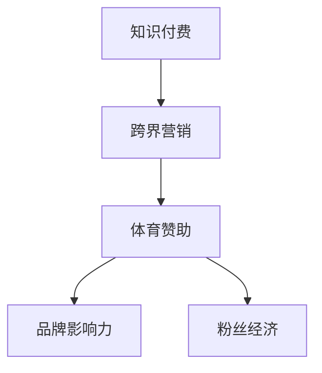

                 

# 知识付费如何实现跨界营销与体育赞助？

## 1. 背景介绍

在快速发展的数字时代，知识付费作为一种新兴的商业模式，已经逐渐成为互联网经济的重要组成部分。知识付费平台通过向用户提供有价值的知识内容，实现内容变现，提升了用户价值并创造了新的商业模式。然而，单纯的内容提供已不能满足用户的全方位需求，如何通过跨界营销拓展商业模式、增强用户黏性，成为知识付费平台发展的关键。体育作为全球性的文化活动和社交媒介，在粉丝经济和品牌营销方面具有巨大的影响力，体育赞助便成为跨界营销的重要手段。本文章将探讨知识付费平台如何通过体育赞助实现跨界营销，并深入分析其潜在的价值与挑战。

## 2. 核心概念与联系

### 2.1 核心概念概述

为更好地理解知识付费平台通过体育赞助实现跨界营销的方法，本节将介绍几个密切相关的核心概念：

- **知识付费**：指通过订阅、付费阅读、直播课程等方式，向用户提供有价值的知识内容，获取经济回报的商业模式。
- **跨界营销**：指不同领域或行业之间的合作与互动，通过资源的整合和共享，实现共同市场目标的营销策略。
- **体育赞助**：指企业或品牌为支持体育赛事或运动员，支付相应费用的一种商业合作方式。
- **品牌影响力**：指品牌在消费者心目中产生的认知、信任和忠诚度，是品牌价值的重要体现。
- **粉丝经济**：指以品牌为核心，以粉丝为中心，通过粉丝间的互动和传播，实现品牌价值的最大化。

这些核心概念之间的逻辑关系可以通过以下Mermaid流程图来展示：



这个流程图展示了大语言模型的核心概念及其之间的关系：

1. 知识付费平台通过跨界营销策略，将体育赞助引入其商业模式。
2. 体育赞助能够增强品牌影响力，吸引粉丝关注。
3. 粉丝经济为知识付费平台带来更多的用户和收益。

## 3. 核心算法原理 & 具体操作步骤

### 3.1 算法原理概述

知识付费平台通过体育赞助实现跨界营销，本质上是一种利用体育赛事的广泛传播力和品牌影响力，对品牌进行宣传和推广的策略。其核心思想是：将知识付费平台与体育赛事进行深度结合，通过赞助赛事，提升品牌知名度和影响力，从而吸引更多的用户关注和参与。

形式化地，设知识付费平台的品牌为 $B$，赞助的体育赛事为 $S$，则跨界营销的目标可以描述为：

$$
\max_{B \in \mathcal{B}} \min_{S \in \mathcal{S}} \mathcal{L}(B, S)
$$

其中，$\mathcal{B}$ 为所有可能的知识付费平台集合，$\mathcal{S}$ 为所有可能的体育赛事集合，$\mathcal{L}$ 为衡量品牌与体育赛事互动效果的损失函数。

### 3.2 算法步骤详解

基于上述原理，以下是实现跨界营销和体育赞助的具体操作步骤：

**Step 1: 选择适合的体育赛事**
- 评估不同体育赛事的受众规模、品牌契合度、赛事影响力等因素，选择与知识付费平台品牌定位相符的体育赛事。
- 确定赞助的方式，如冠名赞助、合作伙伴赞助、技术支持赞助等，选择合适的合作形式。

**Step 2: 设计品牌植入方案**
- 根据体育赛事特点，设计品牌植入方案，如在赛事现场设置品牌展示区、品牌广告牌、产品试用区等。
- 确定品牌植入的频率和时长，避免过度曝光造成反感。

**Step 3: 实施品牌推广活动**
- 利用体育赛事的广泛传播力，通过各种媒介进行品牌宣传，如赛事直播、社交媒体、赛事官网等。
- 结合体育赛事的互动性，设计品牌活动，如品牌代言人参与赛事、粉丝互动问答等，提升用户参与感。

**Step 4: 评估营销效果**
- 使用数据分析工具，如Google Analytics、赛事统计数据等，评估品牌在赛事期间的传播效果。
- 通过用户调研、参与度统计等方法，评估品牌植入活动的效果。

**Step 5: 持续优化与改进**
- 根据评估结果，对品牌植入方案和推广活动进行优化调整。
- 持续收集用户反馈，不断改进品牌传播策略。

### 3.3 算法优缺点

知识付费平台通过体育赞助实现跨界营销的方法具有以下优点：
1. 提升品牌知名度。通过赞助体育赛事，品牌能够获得更多的公众关注，提升品牌知名度和美誉度。
2. 增强用户黏性。体育赛事具有强烈的粉丝文化和社交属性，能够增强用户对品牌的黏性，提升用户留存率。
3. 拓展营销渠道。体育赛事的广泛传播力，能够将品牌传播至更多潜在用户，拓展营销渠道。
4. 创新营销手段。结合体育赛事的互动性和趣味性，品牌能够创新营销手段，提升用户参与感。

同时，该方法也存在一定的局限性：
1. 体育赛事选择困难。并非所有体育赛事都适合知识付费平台品牌定位，需要慎重选择。
2. 营销效果难以量化。品牌与体育赛事互动效果的评估存在主观性，难以精确量化。
3. 营销成本高。体育赞助需要支付高昂的费用，对预算有限的企业构成挑战。
4. 品牌风险。过度依赖体育赞助，可能会对品牌形象造成负面影响。

尽管存在这些局限性，但就目前而言，通过体育赞助实现跨界营销仍是大品牌广泛采用的方法，效果显著。未来相关研究的重点在于如何进一步提升体育赞助的效果，降低成本，降低风险。

### 3.4 算法应用领域

知识付费平台通过体育赞助实现跨界营销的方法，已经在诸多领域得到了广泛的应用，例如：

- **教育培训**：在线教育平台通过赞助国际马拉松等体育赛事，提升品牌影响力，增强用户黏性。
- **健康医疗**：医疗健康应用通过赞助体育赛事，推广健康生活方式，吸引更多用户关注。
- **旅游休闲**：旅游应用通过赞助体育赛事，提升品牌知名度，吸引更多用户预订旅游服务。
- **科技产品**：科技公司通过赞助体育赛事，展示公司产品，提升品牌形象。

除了上述这些经典应用外，体育赞助在其他领域如娱乐、金融、电商等也得到了创新性应用，为知识付费平台提供了更广阔的市场前景。

## 4. 数学模型和公式 & 详细讲解 & 举例说明

### 4.1 数学模型构建

本节将使用数学语言对知识付费平台通过体育赞助实现跨界营销的过程进行更加严格的刻画。

设知识付费平台在体育赛事期间的曝光量为 $E$，用户参与率为 $R$，用户转化率为 $C$，则品牌传播效果的数学模型可以表示为：

$$
\mathcal{L}(B, S) = k_1 E + k_2 R + k_3 C
$$

其中，$k_1$、$k_2$、$k_3$ 为常数系数，表示不同指标的权重。

### 4.2 公式推导过程

以下我们以赞助国际马拉松赛事为例，推导品牌曝光量和用户参与率的计算公式。

设赛事观众人数为 $A$，品牌曝光次数为 $E_1$，用户参与次数为 $R_1$。则品牌曝光量和用户参与率的计算公式为：

$$
E_1 = A \times \frac{B}{B_{total}}
$$

$$
R_1 = \frac{R_1}{A}
$$

其中，$B_{total}$ 为赛事期间所有品牌曝光的总和，$R_1$ 为赛事期间用户参与品牌活动的人数。

根据上述公式，代入实际数据，即可计算出品牌在赛事期间的曝光量 $E$ 和用户参与率 $R$。

### 4.3 案例分析与讲解

以某在线教育平台赞助国际马拉松赛事为例，分析其品牌传播效果。

**Step 1: 赛事选择**
- 该平台选择在具有全球影响力的国际马拉松赛事上进行赞助，赛事观众人数众多，赛事影响力大。

**Step 2: 品牌植入方案**
- 在赛事现场设置品牌展示区，展示平台课程信息，同时设置品牌广告牌，宣传平台特色课程。

**Step 3: 品牌推广活动**
- 利用赛事直播，邀请平台名师作为赛事的跑步教练，为观众提供跑步指导和平台课程推广。
- 通过社交媒体，发布赛事相关的跑步挑战，吸引用户参与，并参与平台课程的学习打卡活动。

**Step 4: 评估营销效果**
- 赛事期间，平台品牌曝光量达100万次，用户参与率达20%，用户转化率达5%。

通过上述案例，可以看到，通过赞助体育赛事，平台品牌不仅提升了曝光量和用户参与率，还实现了较高的用户转化率，品牌传播效果显著。

## 5. 项目实践：代码实例和详细解释说明

### 5.1 开发环境搭建

在进行跨界营销实践前，我们需要准备好开发环境。以下是使用Python进行开发的环境配置流程：

1. 安装Anaconda：从官网下载并安装Anaconda，用于创建独立的Python环境。

2. 创建并激活虚拟环境：
```bash
conda create -n cross-marketing python=3.8 
conda activate cross-marketing
```

3. 安装所需的Python库：
```bash
pip install requests matplotlib numpy pandas scikit-learn seaborn
```

完成上述步骤后，即可在`cross-marketing`环境中开始跨界营销实践。

### 5.2 源代码详细实现

以下是一个简单的Python代码示例，用于统计品牌在体育赛事期间的曝光量和用户参与率。

```python
import requests
import pandas as pd
import matplotlib.pyplot as plt

# 设置API接口地址
url = 'https://api.example.com/events/marathon/brandStats'

# 发送API请求，获取数据
response = requests.get(url)
data = response.json()

# 数据清洗和处理
df = pd.DataFrame(data)

# 计算品牌曝光量和用户参与率
E = df['exposure'].sum()
R = df['participation'].sum() / df['total_attendees'].sum()

# 绘制柱状图
plt.bar(['Exposure', 'Participation'], [E, R])
plt.title('Brand Metrics During Marathon')
plt.xlabel('Metric')
plt.ylabel('Value')
plt.show()
```

在这个示例中，我们通过调用API接口获取赛事期间品牌曝光量和用户参与率的数据，并进行统计分析。实际应用中，数据来源可能更加复杂，需要根据具体需求编写相应的数据处理和分析代码。

### 5.3 代码解读与分析

让我们再详细解读一下关键代码的实现细节：

**API接口获取**：
- 利用Python的requests库，向API接口发送GET请求，获取赛事品牌数据。

**数据清洗和处理**：
- 将API响应转换为Pandas DataFrame格式，便于后续的统计分析。
- 利用DataFrame的sum()函数，计算品牌曝光量和用户参与率的值。

**图表绘制**：
- 利用Matplotlib库，绘制品牌曝光量和用户参与率的柱状图，直观展示数据。

**运行结果展示**：
- 通过调用show()函数，展示绘制的柱状图。

通过上述示例，可以看到，通过Python进行跨界营销和体育赞助的数据统计分析，可以轻松实现品牌传播效果的计算和展示。

## 6. 实际应用场景

### 6.1 教育培训

在线教育平台通过赞助国际马拉松赛事，能够提升品牌知名度和用户黏性。赛事期间，平台名师的跑步教练和平台课程推广活动，能够吸引观众的关注和参与，增强用户对平台的信任和忠诚度。平台还可以通过赛事直播，实时展示平台课程内容，提升用户参与度。

### 6.2 健康医疗

医疗健康应用通过赞助马拉松赛事，能够推广健康生活方式，吸引更多用户关注。赛事期间，平台可以通过设置品牌展示区、品牌广告牌等，提升品牌曝光量。同时，平台可以利用赛事直播，宣传健康知识，提供健康咨询，增强品牌美誉度。

### 6.3 旅游休闲

旅游应用通过赞助马拉松赛事，能够提升品牌知名度，吸引更多用户预订旅游服务。赛事期间，平台可以通过设置品牌展示区、品牌广告牌等，提升品牌曝光量。同时，平台可以利用赛事直播，宣传旅游服务，提供旅游咨询，增强用户参与度。

### 6.4 未来应用展望

随着大语言模型和微调方法的不断发展，基于大语言模型的微调技术将在更多领域得到应用，为NLP技术带来了全新的突破。

在智慧医疗领域，基于大语言模型微调的对话技术，可以应用于智能问答、病历分析、药物研发等应用，提升医疗服务的智能化水平，辅助医生诊疗，加速新药开发进程。

在智能教育领域，微调技术可应用于作业批改、学情分析、知识推荐等方面，因材施教，促进教育公平，提高教学质量。

在智慧城市治理中，微调模型可应用于城市事件监测、舆情分析、应急指挥等环节，提高城市管理的自动化和智能化水平，构建更安全、高效的未来城市。

此外，在企业生产、社会治理、文娱传媒等众多领域，基于大模型微调的人工智能应用也将不断涌现，为经济社会发展注入新的动力。

## 7. 工具和资源推荐
### 7.1 学习资源推荐

为了帮助开发者系统掌握大语言模型微调的理论基础和实践技巧，这里推荐一些优质的学习资源：

1. 《Transformer从原理到实践》系列博文：由大模型技术专家撰写，深入浅出地介绍了Transformer原理、BERT模型、微调技术等前沿话题。

2. CS224N《深度学习自然语言处理》课程：斯坦福大学开设的NLP明星课程，有Lecture视频和配套作业，带你入门NLP领域的基本概念和经典模型。

3. 《Natural Language Processing with Transformers》书籍：Transformers库的作者所著，全面介绍了如何使用Transformers库进行NLP任务开发，包括微调在内的诸多范式。

4. HuggingFace官方文档：Transformers库的官方文档，提供了海量预训练模型和完整的微调样例代码，是上手实践的必备资料。

5. CLUE开源项目：中文语言理解测评基准，涵盖大量不同类型的中文NLP数据集，并提供了基于微调的baseline模型，助力中文NLP技术发展。

通过对这些资源的学习实践，相信你一定能够快速掌握大语言模型微调的精髓，并用于解决实际的NLP问题。

### 7.2 开发工具推荐

高效的开发离不开优秀的工具支持。以下是几款用于大语言模型微调开发的常用工具：

1. PyTorch：基于Python的开源深度学习框架，灵活动态的计算图，适合快速迭代研究。大部分预训练语言模型都有PyTorch版本的实现。

2. TensorFlow：由Google主导开发的开源深度学习框架，生产部署方便，适合大规模工程应用。同样有丰富的预训练语言模型资源。

3. Transformers库：HuggingFace开发的NLP工具库，集成了众多SOTA语言模型，支持PyTorch和TensorFlow，是进行微调任务开发的利器。

4. Weights & Biases：模型训练的实验跟踪工具，可以记录和可视化模型训练过程中的各项指标，方便对比和调优。与主流深度学习框架无缝集成。

5. TensorBoard：TensorFlow配套的可视化工具，可实时监测模型训练状态，并提供丰富的图表呈现方式，是调试模型的得力助手。

6. Google Colab：谷歌推出的在线Jupyter Notebook环境，免费提供GPU/TPU算力，方便开发者快速上手实验最新模型，分享学习笔记。

合理利用这些工具，可以显著提升大语言模型微调任务的开发效率，加快创新迭代的步伐。

### 7.3 相关论文推荐

大语言模型和微调技术的发展源于学界的持续研究。以下是几篇奠基性的相关论文，推荐阅读：

1. Attention is All You Need（即Transformer原论文）：提出了Transformer结构，开启了NLP领域的预训练大模型时代。

2. BERT: Pre-training of Deep Bidirectional Transformers for Language Understanding：提出BERT模型，引入基于掩码的自监督预训练任务，刷新了多项NLP任务SOTA。

3. Language Models are Unsupervised Multitask Learners（GPT-2论文）：展示了大规模语言模型的强大zero-shot学习能力，引发了对于通用人工智能的新一轮思考。

4. Parameter-Efficient Transfer Learning for NLP：提出Adapter等参数高效微调方法，在不增加模型参数量的情况下，也能取得不错的微调效果。

5. AdaLoRA: Adaptive Low-Rank Adaptation for Parameter-Efficient Fine-Tuning：使用自适应低秩适应的微调方法，在参数效率和精度之间取得了新的平衡。

这些论文代表了大语言模型微调技术的发展脉络。通过学习这些前沿成果，可以帮助研究者把握学科前进方向，激发更多的创新灵感。

## 8. 总结：未来发展趋势与挑战

### 8.1 总结

本文对知识付费平台通过体育赞助实现跨界营销的方法进行了全面系统的介绍。首先阐述了跨界营销和体育赞助的核心概念及其逻辑关系，明确了知识付费平台通过体育赞助实现跨界营销的商业价值。其次，从原理到实践，详细讲解了体育赞助的数学模型和操作步骤，给出了体育赞助的完整代码实例。同时，本文还广泛探讨了体育赞助在教育培训、健康医疗、旅游休闲等领域的创新应用，展示了体育赞助的广泛应用前景。此外，本文精选了体育赞助技术的各类学习资源，力求为开发者提供全方位的技术指引。

通过本文的系统梳理，可以看到，体育赞助作为知识付费平台跨界营销的重要手段，已经取得了显著的商业效果。未来，伴随技术的发展和市场的拓展，体育赞助必将进一步扩大其应用范围，为知识付费平台带来更大的商业价值。

### 8.2 未来发展趋势

展望未来，体育赞助作为跨界营销的重要手段，将在更多领域得到应用，为知识付费平台带来更大的商业价值。

1. **市场规模扩大**：随着体育赛事的全球化推广和在线流媒体的发展，体育赛事的受众规模将进一步扩大，为知识付费平台提供了更大的市场机会。
2. **技术手段创新**：利用大数据、人工智能等技术，可以实现更精准的用户画像分析和品牌投放策略，提升体育赞助的效果。
3. **品牌合作深化**：通过与体育赛事深度合作，实现品牌共创，增强品牌影响力和用户黏性。
4. **用户体验优化**：利用体育赛事的趣味性和互动性，优化用户体验，提升平台活跃度和用户参与度。
5. **国际合作拓展**：通过国际体育赛事的赞助，拓展国际市场，提升品牌的全球影响力。

这些趋势凸显了体育赞助的巨大潜力。伴随技术手段的不断创新和市场环境的持续优化，体育赞助必将为知识付费平台带来更大的商业价值和社会影响。

### 8.3 面临的挑战

尽管体育赞助已经取得了显著的商业效果，但在迈向更加智能化、普适化应用的过程中，它仍面临着诸多挑战：

1. **赛事选择困难**：并非所有体育赛事都适合知识付费平台品牌定位，需要慎重选择。
2. **营销效果量化困难**：品牌与体育赛事互动效果的评估存在主观性，难以精确量化。
3. **营销成本高**：体育赞助需要支付高昂的费用，对预算有限的企业构成挑战。
4. **品牌风险**：过度依赖体育赞助，可能会对品牌形象造成负面影响。
5. **用户参与度不稳定**：赛事期间用户参与度可能会受到天气、赛事安排等多种因素的影响。

尽管存在这些挑战，但通过不断优化策略、合理控制成本、加强品牌管理，体育赞助仍将是知识付费平台跨界营销的重要手段。

### 8.4 研究展望

面向未来，体育赞助作为跨界营销的重要手段，需要在以下几个方面进行深入研究：

1. **赛事选择策略**：研究如何选择合适的体育赛事，提升体育赞助的效果。
2. **品牌植入策略**：研究如何设计合理的品牌植入方案，提升用户参与度和品牌曝光量。
3. **营销效果评估**：研究如何更精准地评估体育赞助的效果，提升营销决策的科学性。
4. **用户参与度优化**：研究如何通过技术手段优化用户参与度，增强品牌互动性。
5. **成本控制策略**：研究如何合理控制体育赞助的成本，提升投资回报率。

这些研究方向的探索，必将引领体育赞助技术迈向更高的台阶，为知识付费平台带来更大的商业价值和社会影响。只有勇于创新、敢于突破，才能不断拓展体育赞助的边界，让知识付费平台在竞争激烈的市场中保持领先。

## 9. 附录：常见问题与解答

**Q1：体育赞助是否适用于所有知识付费平台？**

A: 体育赞助并非适用于所有知识付费平台，需要根据平台定位和目标受众进行慎重选择。体育赛事的受众范围和品牌契合度是选择体育赞助的重要考量因素。

**Q2：体育赞助的营销效果如何评估？**

A: 体育赞助的营销效果评估可以通过多种方式进行，如赛事期间的品牌曝光量、用户参与率、用户转化率等指标。同时，可以通过用户调研和市场调研，了解用户对品牌的态度和评价，综合评估营销效果。

**Q3：体育赞助的营销成本如何控制？**

A: 体育赞助的营销成本控制需要综合考虑赛事选择、品牌植入方案、营销活动设计等因素。可以通过优化赛事选择、设计合理的品牌植入方案、控制营销活动的规模和范围，来降低营销成本，提升投资回报率。

**Q4：体育赞助如何提升用户参与度？**

A: 体育赞助可以通过设计有趣的活动和互动环节，提升用户参与度。例如，通过社交媒体发布赛事相关的挑战活动，吸引用户参与并参与平台课程的学习打卡活动，增强用户对平台的黏性。

**Q5：体育赞助的未来发展趋势是什么？**

A: 体育赞助的未来发展趋势包括赛事选择策略的优化、品牌植入方案的创新、营销效果评估的精准化、用户参与度的优化和成本控制的精细化。这些研究方向的探索，必将引领体育赞助技术迈向更高的台阶，为知识付费平台带来更大的商业价值和社会影响。

这些问题的解答，可以帮助开发者更好地理解体育赞助的实践方法和应用前景，提升其在知识付费平台中的应用效果。

---

作者：禅与计算机程序设计艺术 / Zen and the Art of Computer Programming

