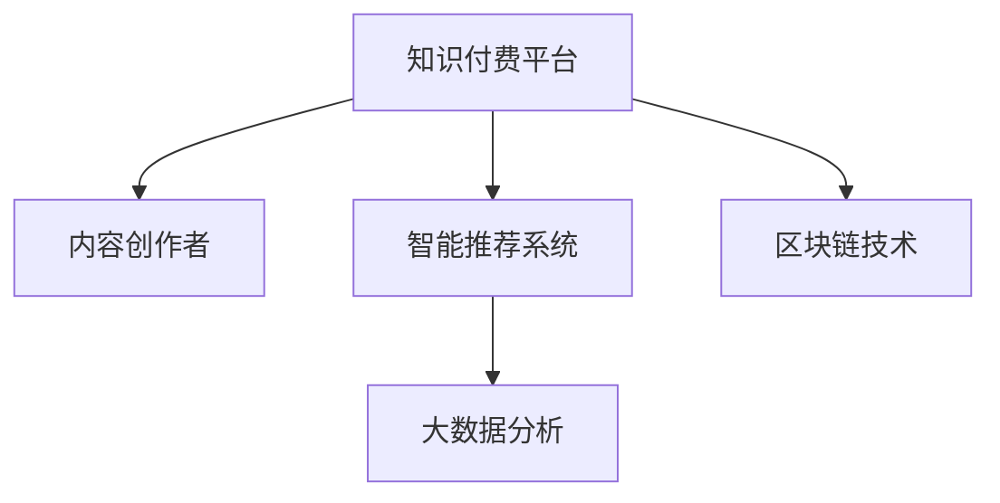

                 

# 知识付费如何实现跨界融合与生态共建？

在快速发展的互联网时代，知识付费正成为连接教育资源和用户需求的新型模式。这不仅改变了人们的学习方式，也催生了跨界融合与生态共建的新机遇。本文将从背景介绍、核心概念、算法原理、项目实践、应用场景、工具资源、总结展望和常见问题等维度，全面剖析知识付费的实现机制，探析其跨界融合与生态共建的路径。

## 1. 背景介绍

### 1.1 问题由来
随着知识经济的兴起，社会对于知识的渴求日益高涨。传统的教育方式，如学校、公开课等，已难以满足个性化、终身化学习的需要。知识付费平台的兴起，正是为了解决这一问题。它通过将碎片化的知识片段化，提供定制化、结构化的内容，使得用户能够随时随地获取有价值的学习资源。

知识付费不仅改变了教育领域，还带动了相关产业链的发展，如内容创作、平台运营、智能推荐、支付系统等。这种跨行业的合作模式，需要构建高效的生态系统，实现知识、技术、用户等多方的协同。

### 1.2 问题核心关键点
知识付费的核心在于知识的精准分发和高效利用。平台需要借助算法和大数据技术，对用户行为进行分析，生成个性化的学习推荐，提高内容的使用效率。同时，平台也需要与内容创作者、支付系统、技术服务商等各方协同合作，构建完整的生态闭环。

此外，知识付费还需面对版权保护、内容质量、用户支付意愿等挑战，如何平衡各方利益，保障用户权益，成为亟待解决的问题。

### 1.3 问题研究意义
研究知识付费的跨界融合与生态共建，对于推动教育技术发展、优化知识传播路径、提升教育资源利用效率具有重要意义。通过深入分析知识付费的实现机制，可以揭示其成功要素，为未来的知识共享平台提供参考。

## 2. 核心概念与联系

### 2.1 核心概念概述
以下是知识付费领域中的几个关键概念：

- **知识付费平台**：提供知识内容交易服务的第三方平台，如喜马拉雅、得到等。
- **内容创作者**：生产高质量内容的专业人士或团队，如专家、学者、作者等。
- **智能推荐系统**：利用算法分析用户行为，生成个性化推荐的学习路径。
- **大数据分析**：通过收集和分析用户数据，提升推荐系统精准度。
- **区块链技术**：用于版权保护和交易透明性，确保内容创作者权益。

这些概念之间的逻辑关系可以通过以下Mermaid流程图来展示：



这个流程图展示出知识付费平台与内容创作者、智能推荐系统、大数据分析、区块链技术的相互作用关系：

1. **知识付费平台**为**内容创作者**提供展示和变现的渠道。
2. **智能推荐系统**利用**大数据分析**，提升推荐精准度，提升用户体验。
3. **区块链技术**保障**内容创作者**的版权和收益，增强平台信任度。

## 3. 核心算法原理 & 具体操作步骤

### 3.1 算法原理概述
知识付费平台的实现，主要依赖于算法和大数据技术。其核心思想是：通过分析用户行为和内容属性，生成个性化的推荐路径，提高内容的使用效率。

形式化地，假设知识付费平台为 $P$，用户为 $U$，内容为 $C$，智能推荐系统为 $R$。则知识付费平台的目标是最大化用户价值，即：

$$
\max_{P} \sum_{u \in U} \sum_{c \in C} R_{u, c} \cdot V_{u, c}
$$

其中 $R_{u, c}$ 表示用户 $u$ 对内容 $c$ 的兴趣程度，$V_{u, c}$ 表示用户 $u$ 对内容 $c$ 的价值评估。

### 3.2 算法步骤详解

知识付费平台的核心算法步骤如下：

**Step 1: 数据收集与处理**
- 收集用户行为数据，如浏览时间、购买记录、评分等。
- 收集内容属性数据，如标题、摘要、分类、时长等。
- 进行数据清洗和特征工程，如缺失值填补、归一化等。

**Step 2: 用户画像构建**
- 通过机器学习算法，对用户行为数据进行建模，生成用户画像，如兴趣偏好、学习习惯等。
- 利用自然语言处理技术，对内容属性数据进行文本分析和情感分析，生成内容标签。

**Step 3: 内容推荐**
- 根据用户画像和内容标签，构建用户-内容交互矩阵。
- 利用协同过滤、内容推荐算法，生成个性化推荐列表。
- 结合时序特征、内容评分等，动态调整推荐策略。

**Step 4: 反馈与优化**
- 收集用户反馈数据，如点击率、完成率、满意度等。
- 利用在线学习算法，实时调整推荐模型，提升推荐效果。
- 进行A/B测试，对比不同推荐策略的效果。

### 3.3 算法优缺点

知识付费平台的推荐算法具有以下优点：
1. **个性化推荐**：通过分析用户行为，生成个性化推荐内容，提高用户满意度。
2. **高效利用**：通过算法优化，提升内容的使用效率，减少资源浪费。
3. **数据驱动**：基于数据驱动的决策，提升推荐系统的透明度和可解释性。

同时，该算法也存在以下局限性：
1. **隐私保护**：用户数据隐私保护是重要挑战，需采取匿名化、加密等措施。
2. **数据质量**：推荐效果依赖于数据质量，需不断优化数据收集和处理流程。
3. **冷启动问题**：新用户和老用户的行为差异大，需额外处理冷启动问题。
4. **动态变化**：用户兴趣随时间变化，推荐系统需具备动态适应能力。

尽管存在这些局限性，但就目前而言，基于推荐算法的知识付费平台仍是大势所趋。未来相关研究的重点在于如何进一步优化推荐算法，提升推荐精度和效率，同时兼顾隐私保护和数据安全等因素。

### 3.4 算法应用领域

知识付费平台的推荐算法不仅适用于平台内部的内容推荐，还广泛应用于以下领域：

- **教育领域**：如K-12在线教育、职业教育、远程培训等。通过推荐个性化学习路径，提升学习效率。
- **医疗领域**：如健康咨询、医疗讲座、疾病管理等。通过推荐高质量的医疗内容，辅助医疗决策。
- **职场领域**：如职业培训、职业技能认证、职业规划等。通过推荐相关课程和资源，提升职业竞争力。
- **娱乐领域**：如音乐、电影、阅读等。通过推荐用户感兴趣的内容，提升用户体验。

除了这些经典应用外，知识付费平台的推荐算法还被创新性地应用到更多场景中，如智慧城市、公共文化服务、企业培训等，为社会生活各个方面带来新的变革。

## 4. 数学模型和公式 & 详细讲解 & 举例说明

### 4.1 数学模型构建

知识付费平台的推荐算法，可以形式化为如下优化问题：

假设用户 $u$ 对内容 $c$ 的评分向量为 $r_{uc} = [r_{uc1}, r_{uc2}, ..., r_{ucn}]$，内容 $c$ 的评分向量为 $v_{uc} = [v_{uc1}, v_{uc2}, ..., v_{ucn}]$，用户 $u$ 对内容 $c$ 的评分预测值为 $\hat{r}_{uc} = \sum_{i=1}^n r_{ui}v_{ci}$，其中 $r_{ui}$ 为用户 $u$ 对内容 $i$ 的评分，$v_{ci}$ 为内容 $i$ 的评分向量，$n$ 为用户数。

则推荐算法可表示为：

$$
\min_{\hat{r}_{uc}} \sum_{uc} (\hat{r}_{uc} - r_{uc})^2
$$

### 4.2 公式推导过程

以下我们将对推荐算法的核心公式进行详细推导。

假设用户 $u$ 对内容 $c$ 的评分向量为 $r_{uc} = [r_{uc1}, r_{uc2}, ..., r_{ucn}]$，内容 $c$ 的评分向量为 $v_{uc} = [v_{uc1}, v_{uc2}, ..., v_{ucn}]$，用户 $u$ 对内容 $c$ 的评分预测值为 $\hat{r}_{uc} = \sum_{i=1}^n r_{ui}v_{ci}$，其中 $r_{ui}$ 为用户 $u$ 对内容 $i$ 的评分，$v_{ci}$ 为内容 $i$ 的评分向量，$n$ 为用户数。

推荐算法可表示为：

$$
\min_{\hat{r}_{uc}} \sum_{uc} (\hat{r}_{uc} - r_{uc})^2
$$

根据最小二乘法的原理，求解上述优化问题，得到：

$$
\hat{r}_{uc} = \sum_{i=1}^n r_{ui}v_{ci}
$$

### 4.3 案例分析与讲解

我们以某知识付费平台的推荐算法为例，进一步讲解其实现机制。

假设平台上有用户 $u_1, u_2, ..., u_m$，内容 $c_1, c_2, ..., c_n$，分别记录了用户对内容的评分 $r_{ui}$ 和内容评分向量 $v_{ci}$。根据上述公式，推荐算法可进行如下计算：

1. 对于每个用户 $u_i$，计算其对所有内容 $c_j$ 的评分预测值 $\hat{r}_{uij} = \sum_{k=1}^n r_{uik}v_{kj}$。
2. 对每个用户 $u_i$，按评分预测值 $\hat{r}_{uij}$ 进行排序，得到推荐列表 $L_i$。
3. 对每个用户 $u_i$，根据用户行为数据（如点击、购买等），调整推荐策略，动态调整推荐列表 $L_i$。

通过上述计算，平台可以为用户生成个性化的推荐内容，提升用户体验和学习效率。

## 5. 项目实践：代码实例和详细解释说明

### 5.1 开发环境搭建

在进行知识付费平台的推荐算法实践前，我们需要准备好开发环境。以下是使用Python进行PyTorch开发的环境配置流程：

1. 安装Anaconda：从官网下载并安装Anaconda，用于创建独立的Python环境。

2. 创建并激活虚拟环境：
```bash
conda create -n knowledge-env python=3.8 
conda activate knowledge-env
```

3. 安装PyTorch：根据CUDA版本，从官网获取对应的安装命令。例如：
```bash
conda install pytorch torchvision torchaudio cudatoolkit=11.1 -c pytorch -c conda-forge
```

4. 安装Pandas、Scikit-learn、Tensorflow等第三方库：
```bash
pip install pandas scikit-learn tensorflow
```

完成上述步骤后，即可在`knowledge-env`环境中开始推荐算法的开发实践。

### 5.2 源代码详细实现

下面以协同过滤算法为例，给出使用PyTorch实现知识付费平台推荐算法的PyTorch代码实现。

首先，定义协同过滤算法的用户和内容评分矩阵：

```python
import torch
from torch.nn import nn

class CollaborativeFiltering(nn.Module):
    def __init__(self, n_users, n_contents):
        super(CollaborativeFiltering, self).__init__()
        self.user_bias = nn.Linear(n_users, 1)
        self.content_bias = nn.Linear(n_contents, 1)
        self.user_features = nn.Linear(n_users, 10)
        self.content_features = nn.Linear(n_contents, 10)
        self.interaction = nn.Linear(10, 1)
    
    def forward(self, user, content):
        user_bias = self.user_bias(user)
        content_bias = self.content_bias(content)
        user_features = self.user_features(user)
        content_features = self.content_features(content)
        interaction = self.interaction(torch.cat([user_features, content_features], dim=1))
        return user_bias + content_bias + interaction
```

然后，定义损失函数和优化器：

```python
from torch.optim import Adam

# 假设训练集为user和内容的评分矩阵
user = torch.randn(1000, 1000)
content = torch.randn(1000, 1000)
target = torch.randn(1000, 1000)

model = CollaborativeFiltering(1000, 1000)
loss_fn = nn.MSELoss()
optimizer = Adam(model.parameters(), lr=0.001)
```

接着，定义训练函数：

```python
def train_epoch(model, data, optimizer):
    model.train()
    loss = 0
    for user, content in data:
        pred = model(user, content)
        loss += loss_fn(pred, target[user])
        optimizer.zero_grad()
        loss.backward()
        optimizer.step()
    return loss / len(data)

# 假设训练集为user和内容的评分矩阵
user = torch.randn(1000, 1000)
content = torch.randn(1000, 1000)
target = torch.randn(1000, 1000)

loss_fn = nn.MSELoss()
optimizer = Adam(model.parameters(), lr=0.001)

for epoch in range(10):
    loss = train_epoch(model, (user, content), optimizer)
    print(f'Epoch {epoch+1}, loss: {loss:.4f}')
```

### 5.3 代码解读与分析

让我们再详细解读一下关键代码的实现细节：

**CollaborativeFiltering类**：
- `__init__`方法：定义了用户和内容的偏置项、特征向量、交互项等关键组件，构成协同过滤模型的核心。
- `forward`方法：前向传播计算推荐分数，输入为用户和内容的评分矩阵，输出为预测评分向量。

**训练函数**：
- `train_epoch`方法：对数据集进行批次化处理，计算模型预测与真实评分的误差，并使用梯度下降算法更新模型参数。

通过上述代码，可以构建一个简单的协同过滤推荐系统，并通过训练数据不断优化模型参数，提升推荐效果。

当然，工业级的系统实现还需考虑更多因素，如模型保存和部署、超参数自动搜索、更灵活的任务适配层等。但核心的推荐算法基本与此类似。

## 6. 实际应用场景

### 6.1 智能教育

知识付费平台在智能教育领域具有广阔的应用前景。平台可以根据学生的学习记录和行为数据，生成个性化的学习路径和推荐内容，提升学习效率和效果。例如，可以为学生推荐适合的学习材料、习题、视频课程等，形成动态的学习计划，帮助学生更好地掌握知识。

### 6.2 医疗健康

在医疗健康领域，知识付费平台可以通过推荐高质量的健康咨询、医疗讲座、疾病管理等内容，辅助医生诊疗，提升医疗服务质量。例如，可以向医生推荐最新的医学研究成果、临床指南、病例分析等，帮助医生提升诊断能力和科研水平。

### 6.3 职场培训

在职场培训领域，平台可以推荐职业培训课程、技能认证课程、职业技能提升资料等，帮助员工提升职业技能，适应职业发展的需求。例如，可以为员工推荐相关的职业培训课程、行业资讯、专家讲座等，助力员工职业成长。

### 6.4 数字娱乐

在数字娱乐领域，平台可以推荐用户感兴趣的电影、音乐、书籍等，提升用户体验和满意度。例如，可以为用户推荐高分电影、经典音乐、热门书籍等，丰富用户的娱乐生活。

### 6.5 智慧城市

在智慧城市建设中，平台可以通过推荐高质量的公共服务、文化活动、旅游指南等，提升市民的生活质量和城市管理的智能化水平。例如，可以向市民推荐本地的文化活动、旅游线路、公共服务信息等，助力智慧城市建设。

### 6.6 未来应用展望

随着知识付费平台的发展，其推荐算法将不断优化，应用领域将进一步拓展。未来，知识付费平台将在更多领域发挥作用，为社会生活带来新的变革：

1. **智慧农业**：推荐适合农作物的种植技术、病虫害防治、农机设备等，助力农业现代化。
2. **环保节能**：推荐节能减排、环保科技、可持续发展等相关内容，推动绿色发展。
3. **公共安全**：推荐应急避险、防灾减灾、安全防范等内容，提升公共安全意识。

知识付费平台的跨界融合与生态共建，将进一步推动技术进步和社会发展，构建更加智能、高效、公正的数字化生态。

## 7. 工具和资源推荐

### 7.1 学习资源推荐

为了帮助开发者系统掌握知识付费平台的推荐算法，这里推荐一些优质的学习资源：

1. **《推荐系统实践》**：本书由推荐系统专家编写，深入浅出地介绍了推荐算法的原理、实现和优化技巧。
2. **《深度学习与推荐系统》**：斯坦福大学的在线课程，涵盖推荐系统的经典算法和最新进展。
3. **《推荐系统理论与算法》**：国内推荐系统权威教材，全面系统地介绍了推荐系统的理论基础和算法实现。
4. **Kaggle推荐系统竞赛**：通过参与推荐系统竞赛，可以积累实战经验，提升算法能力。
5. **Amazon Rating Challenge**：亚马逊的评分数据集，用于研究和优化推荐算法。

通过对这些资源的学习实践，相信你一定能够快速掌握知识付费平台的推荐算法的精髓，并用于解决实际的推荐问题。

### 7.2 开发工具推荐

高效的开发离不开优秀的工具支持。以下是几款用于知识付费平台开发的常用工具：

1. **PyTorch**：基于Python的开源深度学习框架，灵活动态的计算图，适合快速迭代研究。
2. **TensorFlow**：由Google主导开发的开源深度学习框架，生产部署方便，适合大规模工程应用。
3. **Pandas**：数据处理和分析工具，支持高效的数据清洗和特征工程。
4. **Scikit-learn**：机器学习库，提供了丰富的推荐算法实现。
5. **TensorBoard**：TensorFlow配套的可视化工具，可实时监测模型训练状态，并提供丰富的图表呈现方式。
6. **Wealth & Biases**：模型训练的实验跟踪工具，可以记录和可视化模型训练过程中的各项指标。

合理利用这些工具，可以显著提升知识付费平台的开发效率，加快创新迭代的步伐。

### 7.3 相关论文推荐

知识付费平台的推荐算法的研究源于学界的持续研究。以下是几篇奠基性的相关论文，推荐阅读：

1. **《Matrix Factorization Techniques for Recommender Systems》**：经典协同过滤算法，展示了矩阵分解在推荐系统中的应用。
2. **《Neural Collaborative Filtering》**：神经网络在推荐系统中的应用，展示了深度学习在推荐算法中的潜力。
3. **《Hybrid Recommender Systems: Survey and Trends》**：介绍了混合推荐系统的各种组合方式，探讨了不同推荐算法之间的互补性。
4. **《Attention is All You Need》**：提出了Transformer结构，展示了自注意力机制在推荐系统中的应用。
5. **《Adversarial Feature Augmentation for Recommendation System》**：通过对抗训练，提升了推荐系统的鲁棒性和抗干扰能力。

这些论文代表了大语言模型微调技术的发展脉络。通过学习这些前沿成果，可以帮助研究者把握学科前进方向，激发更多的创新灵感。

## 8. 总结：未来发展趋势与挑战

### 8.1 总结

本文对知识付费平台的推荐算法进行了全面系统的介绍。首先阐述了知识付费平台的背景和意义，明确了推荐算法的核心思想和实现机制。其次，从原理到实践，详细讲解了推荐算法的数学模型和实现步骤，给出了推荐算法开发的完整代码实例。同时，本文还广泛探讨了推荐算法在教育、医疗、职场、娱乐等多个领域的应用前景，展示了知识付费平台的广泛潜力。

通过本文的系统梳理，可以看到，知识付费平台的推荐算法正在成为推荐系统的重要范式，极大地拓展了推荐算法的应用边界，催生了更多的落地场景。受益于深度学习和大数据技术的发展，知识付费平台推荐算法将在更多的应用领域发挥重要作用，推动社会生活的智能化、高效化发展。

### 8.2 未来发展趋势

展望未来，知识付费平台的推荐算法将呈现以下几个发展趋势：

1. **个性化推荐**：通过更精确的用户画像和内容标签，提升推荐精准度，满足用户的个性化需求。
2. **跨领域融合**：推荐算法将与其他领域的技术（如自然语言处理、计算机视觉等）进行融合，拓展推荐系统的功能。
3. **实时化**：通过实时数据采集和处理，提升推荐系统的动态响应能力，提供更加及时的内容推荐。
4. **多模态融合**：结合文本、图像、视频等多种模态数据，提升推荐系统的智能化水平。
5. **隐私保护**：通过匿名化、加密等技术，保障用户数据隐私，增强推荐系统的安全性。
6. **公平性**：通过公平性算法，减少推荐系统中的偏见和歧视，提升推荐系统的公平性。

以上趋势凸显了知识付费平台推荐算法的广阔前景。这些方向的探索发展，必将进一步提升推荐系统的性能和应用范围，为社会生活各个方面带来新的变革。

### 8.3 面临的挑战

尽管知识付费平台的推荐算法已经取得了瞩目成就，但在迈向更加智能化、普适化应用的过程中，它仍面临着诸多挑战：

1. **数据隐私**：用户数据的隐私保护是重要挑战，需采取匿名化、加密等措施。
2. **数据质量**：推荐效果依赖于数据质量，需不断优化数据收集和处理流程。
3. **计算资源**：推荐系统需处理大规模数据，计算资源消耗大，需优化算法和架构。
4. **冷启动问题**：新用户和老用户的行为差异大，需额外处理冷启动问题。
5. **算法公平性**：推荐系统中的偏见和歧视问题需引起重视，需进一步优化算法。
6. **多模态融合**：不同模态数据的整合和协同建模是重要难题，需开发新的技术手段。

正视推荐算法面临的这些挑战，积极应对并寻求突破，将是大语言模型微调技术走向成熟的必由之路。相信随着学界和产业界的共同努力，这些挑战终将一一被克服，推荐系统必将在构建智能生态中扮演越来越重要的角色。

### 8.4 研究展望

面向未来，知识付费平台的推荐算法研究还需要在以下几个方面寻求新的突破：

1. **跨领域融合**：推荐算法需与其他领域的技术（如自然语言处理、计算机视觉等）进行融合，拓展推荐系统的功能。
2. **实时化**：通过实时数据采集和处理，提升推荐系统的动态响应能力，提供更加及时的内容推荐。
3. **多模态融合**：结合文本、图像、视频等多种模态数据，提升推荐系统的智能化水平。
4. **隐私保护**：通过匿名化、加密等技术，保障用户数据隐私，增强推荐系统的安全性。
5. **公平性**：通过公平性算法，减少推荐系统中的偏见和歧视，提升推荐系统的公平性。
6. **多任务学习**：结合多个任务进行联合训练，提升推荐系统的综合性能。

这些研究方向的探索，必将引领推荐系统的技术进步，为构建智能生态带来新的突破。面向未来，推荐系统需要与其他技术进行深度融合，共同推动社会生活的智能化发展。只有勇于创新、敢于突破，才能不断拓展推荐系统的边界，让推荐技术更好地服务社会。

## 9. 附录：常见问题与解答

**Q1：知识付费平台如何保障用户数据隐私？**

A: 知识付费平台通过多种手段保障用户数据隐私：

1. 数据匿名化：在数据收集和处理过程中，对用户数据进行匿名化处理，确保数据无法直接识别用户身份。
2. 加密技术：对敏感数据进行加密存储和传输，防止数据泄露。
3. 访问控制：通过严格的访问控制和权限管理，防止数据被未授权访问。
4. 数据使用透明：明确告知用户数据的使用目的和范围，确保用户知情同意。

这些措施可以最大限度地保障用户数据隐私，提升用户对平台的信任度。

**Q2：知识付费平台的推荐算法如何优化？**

A: 知识付费平台的推荐算法优化主要包括以下几个方面：

1. 数据增强：通过数据增强技术，丰富训练集，提升模型泛化能力。
2. 模型集成：通过模型集成技术，结合多个模型的优势，提升推荐效果。
3. 超参数调优：通过超参数调优，找到最优的模型参数配置，提升模型性能。
4. 实时更新：通过在线学习算法，实时更新模型参数，保持推荐系统的动态适应能力。
5. 多任务学习：通过多任务学习，提升模型的综合性能，拓展推荐系统的应用场景。

通过这些优化措施，可以不断提升知识付费平台的推荐算法效果，提升用户体验。

**Q3：知识付费平台的推荐算法如何应对冷启动问题？**

A: 知识付费平台的推荐算法应对冷启动问题，可以采取以下几种策略：

1. 利用用户兴趣先验：根据用户的注册信息、历史行为等先验信息，生成初始推荐列表。
2. 引入热门内容推荐：推荐平台的热门内容和经典作品，帮助新用户快速找到感兴趣的资源。
3. 交叉推荐：通过跨领域推荐，推荐用户在其他领域感兴趣的内容，加速内容发现。
4. 采用启发式推荐：根据用户行为特征，采用启发式规则生成推荐列表。

这些策略可以有效地解决新用户的冷启动问题，帮助其快速融入平台，提升用户体验。

通过本文的系统梳理，可以看到，知识付费平台的推荐算法正在成为推荐系统的重要范式，极大地拓展了推荐算法的应用边界，催生了更多的落地场景。受益于深度学习和大数据技术的发展，知识付费平台推荐算法将在更多的应用领域发挥重要作用，推动社会生活的智能化、高效化发展。面向未来，推荐系统需要与其他技术进行深度融合，共同推动社会生活的智能化发展。只有勇于创新、敢于突破，才能不断拓展推荐系统的边界，让推荐技术更好地服务社会。

