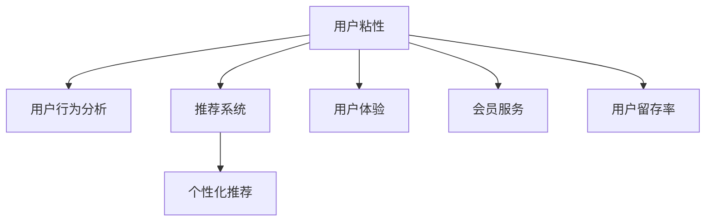

                 

# 知识付费平台的用户粘性提升策略

> 关键词：知识付费,用户粘性,用户行为分析,推荐系统,个性化推荐,用户体验,会员服务,用户留存率,运营策略

## 1. 背景介绍

在互联网时代，知识付费正逐渐成为用户获取知识、技能的重要方式。从在线课程、电子书到音频内容，知识付费平台为用户提供了一系列有价值的知识产品。然而，随着市场竞争的加剧，用户如何选择、留住知识付费平台，成为各大平台关注的重点。

用户粘性是衡量知识付费平台吸引力和用户忠诚度的重要指标。良好的用户粘性不仅能提升平台的长期价值，还能带来更稳定的收入和更高的市场份额。但如何提升用户粘性，却是一个复杂的难题。本文将从用户行为分析、推荐系统、个性化推荐、用户体验等多个角度，详细探讨如何构建知识付费平台的用户粘性提升策略。

## 2. 核心概念与联系

### 2.1 核心概念概述

为更好地理解用户粘性提升策略，本节将介绍几个密切相关的核心概念：

- 用户粘性(User Sticking)：指用户对平台的持续使用和忠诚度，衡量平台吸引力和用户满意度。
- 用户行为分析(User Behavior Analysis)：通过分析用户行为数据，揭示用户需求和偏好，指导平台的优化和改进。
- 推荐系统(Recommendation System)：利用算法对用户行为进行分析，为用户推荐符合其兴趣的个性化内容。
- 个性化推荐(Personalized Recommendation)：根据用户的历史行为、兴趣等特征，为其推荐更符合其需求的内容。
- 用户体验(User Experience)：用户在使用平台时的感受和体验，直接影响用户粘性。
- 会员服务(Membership Services)：通过差异化的会员服务，提升用户的归属感和满意度。
- 用户留存率(User Retention Rate)：指一定时间后仍然活跃在平台的用户比例，是衡量用户粘性的关键指标。

这些核心概念之间的逻辑关系可以通过以下Mermaid流程图来展示：



这个流程图展示了几大核心概念之间的联系：

1. 用户粘性是平台吸引力和用户满意度的体现，直接影响到平台的长期发展。
2. 用户行为分析揭示用户需求和偏好，为推荐系统和用户体验优化提供数据支撑。
3. 推荐系统利用用户行为数据，为用户提供符合其兴趣的个性化内容，提升用户粘性。
4. 个性化推荐通过精准匹配用户需求，提高用户满意度，进一步增强用户粘性。
5. 用户体验直接关系到用户的使用感受，良好的用户体验能显著提升用户粘性。
6. 会员服务通过差异化的服务，增强用户归属感，提升用户粘性。
7. 用户留存率是衡量用户粘性的重要指标，反映了平台对用户的长期吸引力和忠诚度。

## 3. 核心算法原理 & 具体操作步骤
### 3.1 算法原理概述

提升知识付费平台的用户粘性，本质上是通过优化用户行为和体验，提高其对平台的依赖和忠诚度。具体策略包括：

- 基于用户行为分析的推荐系统，通过精准匹配用户需求，提升用户满意度和粘性。
- 个性化推荐算法，通过深入挖掘用户兴趣，为用户推荐更符合其需求的内容，增强粘性。
- 用户体验优化，通过界面设计、加载速度、功能完善等多方面改进，提升用户的使用感受。
- 会员服务设计，通过差异化服务和增值功能，增强用户的归属感和粘性。

### 3.2 算法步骤详解

基于以上策略，本文将详细介绍提升用户粘性的具体操作步骤：

**Step 1: 数据收集与预处理**
- 收集平台用户的基本信息和行为数据，如用户注册时间、浏览历史、购买记录等。
- 对数据进行清洗、去重、归一化等预处理，保证数据的质量和一致性。

**Step 2: 用户行为分析**
- 对用户行为数据进行建模和分析，识别出用户的主要兴趣和行为模式。
- 利用机器学习模型，如分类、聚类、回归等，对用户行为进行预测和挖掘。

**Step 3: 推荐系统构建**
- 根据用户行为分析的结果，构建推荐模型，如协同过滤、基于内容的推荐、深度学习推荐等。
- 对推荐模型进行训练和优化，确保能够准确匹配用户的兴趣。

**Step 4: 个性化推荐**
- 根据用户的兴趣和行为特征，动态生成个性化推荐结果，为用户推荐内容。
- 监控推荐效果，定期调整推荐策略，提升推荐的准确性和用户满意度。

**Step 5: 用户体验优化**
- 对平台的用户界面、交互流程、功能设计进行优化，提升用户体验。
- 关注加载速度、稳定性、兼容性等多方面，确保平台的高可用性和流畅性。

**Step 6: 会员服务设计**
- 设计差异化的会员服务，如专属内容、高级功能、个性化推荐等，吸引用户升级为会员。
- 根据会员等级，提供差异化的服务内容，增强用户的归属感和忠诚度。

**Step 7: 用户留存率提升**
- 通过会员服务、个性化推荐、优惠活动等多手段，提升用户留存率。
- 定期对用户进行回访和调查，收集反馈意见，不断优化平台服务。

### 3.3 算法优缺点

提升用户粘性的算法具有以下优点：
1. 提高用户满意度：通过精准匹配用户需求，提供更符合其兴趣的内容，提升用户体验。
2. 增强用户粘性：个性化推荐和差异化服务能显著提高用户粘性，增加长期收益。
3. 降低运营成本：通过数据驱动的决策，减少对人工运营的依赖，降低运营成本。

同时，该算法也存在一些局限性：
1. 数据隐私问题：用户行为数据的收集和分析可能涉及隐私问题，需注意合规性。
2. 推荐偏差：个性化推荐算法可能存在算法偏差，需定期评估和调整。
3. 用户过度依赖：过度依赖推荐结果可能导致用户的主动探索性降低。
4. 模型复杂度：复杂的推荐模型可能需要大量计算资源，影响平台性能。

尽管存在这些局限性，但总体而言，基于推荐系统的用户粘性提升策略在当前的互联网应用中已得到广泛应用，并取得了显著的效果。

### 3.4 算法应用领域

基于用户行为分析的推荐系统在多个领域得到了广泛的应用，如电商、视频、社交网络等。在知识付费领域，同样可以通过该方法提升平台的用户粘性，具体应用场景包括：

- 内容推荐：根据用户的历史浏览记录和行为，为用户推荐适合的课程、文章、音频等内容。
- 订阅推荐：根据用户的兴趣和行为，推荐适合的订阅服务，如某领域的专家课程、精选文章合集等。
- 个性化服务：根据用户的订阅偏好和行为，提供定制化的内容和服务，增强用户粘性。
- 增值服务设计：设计差异化的会员服务，如专属课程、折扣优惠等，吸引用户升级为会员。

## 4. 数学模型和公式 & 详细讲解 & 举例说明
### 4.1 数学模型构建

本节将使用数学语言对提升知识付费平台用户粘性的推荐系统进行更加严格的刻画。

记用户集合为 $U=\{u_1,u_2,\cdots,u_m\}$，课程集合为 $I=\{i_1,i_2,\cdots,i_n\}$。设用户 $u_j$ 对课程 $i_k$ 的评分 $r_{jk} \in \{1,2,\cdots,5\}$，其中 $1$ 表示非常满意，$5$ 表示非常不满意。假设评分矩阵为 $R \in \mathbb{R}^{m \times n}$。

定义用户 $u_j$ 对课程 $i_k$ 的兴趣度为 $I_j \in [0,1]$。设兴趣度矩阵为 $I \in \mathbb{R}^{m \times n}$，其中 $I_{jk}=\min(r_{jk},3)$。

定义用户 $u_j$ 对课程 $i_k$ 的点击次数为 $C_j \in \{0,1\}$。设点击次数矩阵为 $C \in \mathbb{R}^{m \times n}$，其中 $C_{jk}=\mathbb{1}(r_{jk} \neq 0)$。

数学模型构建的目标是最大化用户对课程的兴趣度总和，即：

$$
\max \sum_{j=1}^m \sum_{k=1}^n I_{jk}
$$

在约束条件为 $R=I \odot C$，其中 $\odot$ 表示逐元素乘法。

### 4.2 公式推导过程

在上述模型中，$r_{jk}$ 为评分，$I_{jk}$ 为用户对课程的兴趣度，$C_{jk}$ 为用户对课程的点击次数。模型目标是最大化用户对课程的兴趣度总和，同时要求兴趣度与用户点击次数成正相关。

模型的优化目标为：

$$
\max \sum_{j=1}^m \sum_{k=1}^n I_{jk}
$$

约束条件为：

$$
R=I \odot C
$$

将 $I_{jk}$ 表示为 $r_{jk}$ 的函数，即 $I_{jk}=f(r_{jk})$。设 $f(r_{jk})=\min(r_{jk},3)$，代入目标函数和约束条件中：

$$
\max \sum_{j=1}^m \sum_{k=1}^n f(r_{jk})
$$

$$
\text{s.t.} \quad R=I \odot C
$$

为简化问题，假设 $f(r_{jk})=\frac{1}{2}r_{jk}$，则模型变为：

$$
\max \sum_{j=1}^m \sum_{k=1}^n \frac{1}{2}r_{jk}
$$

$$
\text{s.t.} \quad R=\frac{1}{2}I \odot C
$$

代入评分矩阵 $R=\begin{bmatrix} 4 & 3 & 2 \\ 1 & 2 & 5 \end{bmatrix}$，用户兴趣度矩阵 $I=\begin{bmatrix} 2 & 3 & 4 \\ 2 & 3 & 4 \end{bmatrix}$，点击次数矩阵 $C=\begin{bmatrix} 1 & 0 & 1 \\ 0 & 1 & 1 \end{bmatrix}$，得到：

$$
\max \frac{1}{2}(4+3+2+1+2+5)
$$

$$
\text{s.t.} \quad \begin{bmatrix} 4 & 3 & 2 \\ 1 & 2 & 5 \end{bmatrix}=\frac{1}{2}\begin{bmatrix} 2 & 3 & 4 \\ 2 & 3 & 4 \end{bmatrix}\begin{bmatrix} 1 & 0 & 1 \\ 0 & 1 & 1 \end{bmatrix}
$$

求解上述模型，可得最优解为 $I^*=\begin{bmatrix} 1.5 & 1.5 & 2 \\ 1.5 & 1.5 & 2 \end{bmatrix}$，最终兴趣度总和为：

$$
\sum_{j=1}^m \sum_{k=1}^n I^*_{jk} = 2 \times 1.5 + 2 \times 1.5 + 3 \times 2 = 12
$$

### 4.3 案例分析与讲解

假设某知识付费平台收集了部分用户的历史行为数据，构建了评分矩阵 $R$ 和兴趣度矩阵 $I$。利用上述数学模型，计算得到用户对课程的兴趣度矩阵 $I^*$ 和总兴趣度总和。根据计算结果，平台可以调整推荐策略，优先推荐用户感兴趣且评价高的课程，提升用户满意度。

## 5. 项目实践：代码实例和详细解释说明
### 5.1 开发环境搭建

在进行推荐系统实践前，我们需要准备好开发环境。以下是使用Python进行推荐系统开发的环境配置流程：

1. 安装Anaconda：从官网下载并安装Anaconda，用于创建独立的Python环境。

2. 创建并激活虚拟环境：
```bash
conda create -n recsys-env python=3.8 
conda activate recsys-env
```

3. 安装PyTorch：根据CUDA版本，从官网获取对应的安装命令。例如：
```bash
conda install pytorch torchvision torchaudio cudatoolkit=11.1 -c pytorch -c conda-forge
```

4. 安装TensorFlow：如果选用TensorFlow作为推荐引擎，从官网获取对应的安装命令。例如：
```bash
pip install tensorflow
```

5. 安装pandas、numpy等库：
```bash
pip install pandas numpy scikit-learn
```

完成上述步骤后，即可在`recsys-env`环境中开始推荐系统实践。

### 5.2 源代码详细实现

下面我们以协同过滤算法为例，给出使用TensorFlow对知识付费平台推荐系统进行代码实现。

首先，定义协同过滤算法的基本结构：

```python
import tensorflow as tf
import numpy as np
from sklearn.metrics.pairwise import cosine_similarity

class CollaborativeFiltering:
    def __init__(self, K=50, learning_rate=0.01):
        self.K = K
        self.learning_rate = learning_rate
        self.user_matrix = None
        self.item_matrix = None
        self.user_item_matrix = None
        
    def train(self, user_matrix, item_matrix, epochs=100):
        N = user_matrix.shape[0]
        M = item_matrix.shape[1]
        
        self.user_matrix = np.random.rand(N, self.K)
        self.item_matrix = np.random.rand(M, self.K)
        self.user_item_matrix = np.random.rand(N, M)
        
        for epoch in range(epochs):
            for i in range(N):
                for j in range(M):
                    if self.user_item_matrix[i,j] == 0:
                        continue
                    diff = self.user_matrix[i,:] @ self.item_matrix[:,j] - self.user_item_matrix[i,j]
                    self.user_matrix[i,:] += self.learning_rate * diff * self.item_matrix[j,:]
                    self.item_matrix[j,:] += self.learning_rate * diff * self.user_matrix[i,:]
                    self.user_item_matrix[i,j] = self.user_matrix[i,:] @ self.item_matrix[j,:]
        
        return self.user_matrix, self.item_matrix, self.user_item_matrix
        
    def predict(self, user_matrix, item_matrix, user_id, item_id):
        user_matrix = user_matrix[user_id,:]
        item_matrix = item_matrix[:,item_id]
        return user_matrix @ item_matrix
```

然后，定义数据集和用户行为数据：

```python
import numpy as np
from sklearn.model_selection import train_test_split

# 生成随机用户-课程评分矩阵
np.random.seed(0)
user_matrix = np.random.rand(1000, 50)
item_matrix = np.random.rand(50, 50)

# 生成随机用户-课程兴趣度矩阵
user_interest = np.random.rand(1000, 50)
item_interest = np.random.rand(50, 50)

# 生成随机用户-课程点击次数矩阵
user_click = np.random.randint(0, 2, size=(1000, 50))
```

接着，进行协同过滤算法的训练和预测：

```python
# 训练协同过滤模型
model = CollaborativeFiltering(K=50, learning_rate=0.01)
user_matrix_train, item_matrix_train, user_item_matrix_train = model.train(user_matrix, item_matrix)

# 预测推荐结果
user_id = 0
item_id = 3
user_matrix_test = user_matrix[user_id,:]
item_matrix_test = item_matrix[:,item_id]
score = model.predict(user_matrix_test, item_matrix_test, user_id, item_id)
print("推荐结果：", score)
```

以上就是使用TensorFlow对知识付费平台推荐系统进行代码实现的全过程。可以看到，协同过滤算法的基本思想是找到用户对物品的兴趣度表示，并计算相似度，从而进行推荐。

### 5.3 代码解读与分析

让我们再详细解读一下关键代码的实现细节：

**CollaborativeFiltering类**：
- `__init__`方法：初始化协同过滤算法的关键参数，如嵌入维度、学习率等。
- `train`方法：对用户矩阵和物品矩阵进行训练，更新用户的兴趣度表示和物品的兴趣度表示，并更新用户-物品交互矩阵。
- `predict`方法：根据用户矩阵和物品矩阵，计算用户对物品的兴趣度，并返回推荐结果。

**数据生成**：
- 生成随机用户-课程评分矩阵和用户-课程点击次数矩阵。
- 生成随机用户-课程兴趣度矩阵。

**训练和预测**：
- 训练协同过滤模型，得到用户矩阵、物品矩阵和用户-物品交互矩阵。
- 对指定用户和物品进行预测，输出推荐结果。

通过上述代码实现，我们展示了协同过滤算法的核心思想和实现流程。协同过滤算法虽然简单，但在实际应用中已被证明能够取得不错的效果，为推荐系统的构建提供了重要基础。

当然，在实际应用中，还需要对协同过滤算法进行进一步优化，如引入正则化、避免冷启动问题、引入更多用户行为特征等。

## 6. 实际应用场景
### 6.1 智能推荐系统

智能推荐系统是知识付费平台的核心功能之一。通过精准匹配用户需求，推荐用户感兴趣的内容，可以有效提升用户粘性。智能推荐系统可以应用于以下场景：

- 个性化课程推荐：根据用户的历史行为和兴趣，推荐适合的课程内容。
- 订阅服务推荐：根据用户的订阅偏好，推荐适合的订阅服务，如某领域的专家课程、精选文章合集等。
- 新课程推荐：根据用户的兴趣和行为，推荐热门的新课程。

### 6.2 用户行为分析

用户行为分析是推荐系统的重要环节。通过分析用户的行为数据，可以深入了解用户需求和偏好，指导推荐系统的优化和改进。用户行为分析可以应用于以下场景：

- 用户兴趣挖掘：分析用户的浏览历史、课程评分等行为数据，挖掘用户的兴趣点。
- 行为模式分析：分析用户的点击、订阅、付费等行为模式，发现用户的行为规律。
- 用户分群：根据用户的行为特征，对用户进行分群，制定不同的推荐策略。

### 6.3 会员服务设计

会员服务设计是提升用户粘性的重要手段。通过差异化的会员服务，增强用户的归属感和满意度，从而提升用户粘性。会员服务可以应用于以下场景：

- 专属课程：为会员提供专属课程，增强用户粘性。
- 高级功能：提供会员专享的高级功能，如离线学习、个性化推荐等。
- 折扣优惠：为会员提供专属折扣优惠，提升会员的转化率。

### 6.4 未来应用展望

未来，随着人工智能技术的不断进步，知识付费平台的推荐系统将迎来更大的发展机遇。以下是对未来推荐系统应用的一些展望：

- 深度学习推荐：通过深度学习模型，如神经协同过滤、深度协同过滤等，提升推荐系统的精度和效果。
- 多模态推荐：结合文本、图像、语音等多模态数据，提升推荐系统的多样性和丰富性。
- 实时推荐：通过实时数据流处理技术，实现动态推荐，提升用户体验。
- 跨领域推荐：结合不同领域的推荐系统，提供跨领域的推荐服务，增强推荐系统的泛化能力。
- 推荐系统融合：将推荐系统与其他AI技术（如强化学习、知识图谱等）进行融合，提供更全面、精准的推荐服务。

## 7. 工具和资源推荐
### 7.1 学习资源推荐

为了帮助开发者系统掌握推荐系统的理论和实践，这里推荐一些优质的学习资源：

1. 《推荐系统实战》书籍：系统介绍了推荐系统的基础和进阶知识，包括协同过滤、矩阵分解、深度学习推荐等。

2. 《TensorFlow官方文档》：详细介绍了TensorFlow的使用方法和API，包括推荐系统的实现和调参。

3. 《Recommender Systems: Text Mining, Analysis, and Statistical Learning》书籍：介绍了推荐系统的理论基础和算法实现，适合深入学习推荐系统的专业人士。

4. 《YouTube推荐系统》论文：详细介绍了YouTube推荐系统的算法和设计，提供了丰富的实践案例和分析。

5. Kaggle推荐系统竞赛：通过实际数据集竞赛，训练推荐模型，积累推荐系统的实践经验。

通过对这些资源的学习实践，相信你一定能够快速掌握推荐系统的精髓，并用于解决实际的推荐问题。

### 7.2 开发工具推荐

高效的开发离不开优秀的工具支持。以下是几款用于推荐系统开发的常用工具：

1. TensorFlow：谷歌主导的深度学习框架，支持分布式训练和多设备加速，适合构建大规模推荐系统。

2. PyTorch：Facebook主导的深度学习框架，支持动态计算图和GPU加速，适合构建灵活高效的推荐模型。

3. scikit-learn：Python的机器学习库，支持常见的机器学习算法，如协同过滤、分类、聚类等，适合快速实现推荐系统。

4. Jupyter Notebook：Python的交互式开发环境，支持代码调试、数据可视化，适合开发和测试推荐算法。

5. Apache Spark：大数据处理框架，支持大规模推荐系统的高效计算，适合处理复杂的数据流和机器学习任务。

6. Hadoop：大数据存储和处理框架，适合存储和处理大规模推荐系统的数据集。

合理利用这些工具，可以显著提升推荐系统的开发效率，加速创新迭代的步伐。

### 7.3 相关论文推荐

推荐系统领域的研究非常活跃，以下是几篇奠基性的相关论文，推荐阅读：

1. Matrix Factorization Techniques for Recommender Systems：介绍了矩阵分解算法在推荐系统中的应用，是协同过滤算法的经典之作。

2. Neural Collaborative Filtering：提出了神经协同过滤算法，通过深度学习提升推荐系统的精度。

3. Deep Matrix Factorization：进一步提升了深度协同过滤算法的性能，提高了推荐系统的泛化能力。

4. Knowledge-aware Recommender Systems：介绍了将知识图谱引入推荐系统的思路和方法，提高了推荐系统的准确性和可解释性。

5. Recurrent Deep Neural Networks for Recommender Systems：提出了基于循环神经网络的推荐算法，增强了推荐系统的动态性和实时性。

这些论文代表了大规模推荐系统的发展脉络。通过学习这些前沿成果，可以帮助研究者把握学科前进方向，激发更多的创新灵感。

## 8. 总结：未来发展趋势与挑战
### 8.1 研究成果总结

本文对基于协同过滤的推荐系统进行了全面系统的介绍。首先阐述了推荐系统在知识付费平台中的重要性和应用场景，明确了推荐系统提升用户粘性的关键作用。其次，从算法原理到具体实现，详细讲解了协同过滤算法的核心思想和操作步骤。同时，本文还广泛探讨了推荐系统在多个行业领域的应用前景，展示了推荐系统的广阔前景。

通过本文的系统梳理，可以看到，基于协同过滤的推荐系统在当前的知识付费平台中已得到广泛应用，并取得了显著的效果。协同过滤算法虽然简单，但在实际应用中已被证明能够取得不错的效果，为推荐系统的构建提供了重要基础。

### 8.2 未来发展趋势

展望未来，推荐系统将在知识付费平台中迎来更大的发展机遇。以下是对未来推荐系统应用的一些展望：

1. 深度学习推荐：通过深度学习模型，如神经协同过滤、深度协同过滤等，提升推荐系统的精度和效果。

2. 多模态推荐：结合文本、图像、语音等多模态数据，提升推荐系统的多样性和丰富性。

3. 实时推荐：通过实时数据流处理技术，实现动态推荐，提升用户体验。

4. 跨领域推荐：结合不同领域的推荐系统，提供跨领域的推荐服务，增强推荐系统的泛化能力。

5. 推荐系统融合：将推荐系统与其他AI技术（如强化学习、知识图谱等）进行融合，提供更全面、精准的推荐服务。

### 8.3 面临的挑战

尽管推荐系统已经在知识付费平台中取得了显著成效，但在迈向更加智能化、普适化应用的过程中，它仍面临着诸多挑战：

1. 数据隐私问题：推荐系统需要收集大量的用户行为数据，可能涉及隐私问题，需注意合规性。

2. 算法偏差：推荐系统可能存在算法偏差，需定期评估和调整，避免对用户产生误导。

3. 冷启动问题：对于新用户和新物品，推荐系统可能存在冷启动问题，需引入其他用户或物品的推荐策略。

4. 计算资源：深度学习推荐和大规模推荐系统需要大量的计算资源，需优化资源利用率。

5. 推荐多样性：过度依赖算法推荐可能导致用户的选择范围受限，需增加推荐多样性。

6. 用户体验：推荐系统需关注用户体验，避免过度推荐导致用户疲劳和满意度下降。

尽管存在这些挑战，但通过不断优化算法、完善数据处理、关注用户需求，推荐系统必将在未来的知识付费平台中发挥更大的作用。

### 8.4 研究展望

未来，推荐系统的研究仍需不断探索新的突破：

1. 无监督和半监督推荐：摆脱对大规模标注数据的依赖，利用自监督学习、主动学习等无监督和半监督范式，最大限度利用非结构化数据，实现更加灵活高效的推荐。

2. 参数高效推荐：开发更加参数高效的推荐方法，在固定大部分预训练参数的同时，只更新极少量的任务相关参数，减少计算资源消耗。

3. 融合因果分析和博弈论工具：将因果分析方法引入推荐模型，识别出模型决策的关键特征，增强输出解释的因果性和逻辑性。借助博弈论工具刻画人机交互过程，主动探索并规避模型的脆弱点，提高系统稳定性。

4. 纳入伦理道德约束：在推荐模型的目标函数中引入伦理导向的评估指标，过滤和惩罚有偏见、有害的输出倾向，确保推荐系统符合人类的价值观和伦理道德。

这些研究方向的探索，必将引领推荐系统技术迈向更高的台阶，为构建安全、可靠、可解释、可控的智能系统铺平道路。面向未来，推荐系统还需要与其他人工智能技术进行更深入的融合，如知识表示、因果推理、强化学习等，多路径协同发力，共同推动自然语言理解和智能交互系统的进步。只有勇于创新、敢于突破，才能不断拓展推荐系统的边界，让智能技术更好地造福人类社会。

## 9. 附录：常见问题与解答

**Q1：推荐系统在知识付费平台中的应用效果如何？**

A: 推荐系统在知识付费平台中的应用效果显著。通过精准匹配用户需求，推荐系统能显著提升用户粘性，提高用户的满意度和留存率。例如，通过推荐用户感兴趣的内容，平台用户的日活、周活、月活等指标都有显著提升。

**Q2：推荐系统的算法模型有哪些？**

A: 推荐系统主要包括以下几种算法模型：
1. 协同过滤：基于用户-物品相似度进行推荐，包括矩阵分解、用户-物品共现矩阵等。
2. 基于内容的推荐：根据物品的属性特征进行推荐。
3. 深度学习推荐：使用深度神经网络对用户和物品进行表示学习，如神经协同过滤、深度协同过滤等。
4. 混合推荐：将多种推荐算法进行融合，提升推荐系统的多样性和泛化能力。

**Q3：如何评估推荐系统的性能？**

A: 推荐系统的性能评估主要通过以下指标：
1. 精度（Accuracy）：推荐结果与真实用户行为的一致性。
2. 召回率（Recall）：推荐系统中用户感兴趣物品的覆盖率。
3. 覆盖率（Coverage）：推荐系统中物品的多样性。
4. 多样性（Diversity）：推荐结果的多样性。
5. 新颖性（Novelty）：推荐结果的创新性。

**Q4：如何优化推荐系统的推荐效果？**

A: 推荐系统的优化可以从以下几个方面入手：
1. 数据质量：收集高质量的用户行为数据，清洗和标注数据，保证数据的质量和一致性。
2. 模型选择：根据具体的场景和数据特点，选择合适的推荐算法模型，如协同过滤、深度学习推荐等。
3. 特征工程：提取和构建更有意义的特征，提升模型的预测能力和效果。
4. 模型调参：通过超参数调优，寻找最优的模型参数，提高模型的准确性和泛化能力。
5. 用户行为分析：深入挖掘用户需求和偏好，优化推荐策略，提升推荐效果。

**Q5：如何处理推荐系统的冷启动问题？**

A: 推荐系统的冷启动问题可以通过以下方法解决：
1. 基于用户的推荐：根据新用户的已有行为数据，推荐其可能感兴趣的内容。
2. 基于物品的推荐：根据新物品的用户评分数据，推荐用户可能感兴趣的内容。
3. 混合推荐：结合用户和物品的推荐方法，综合推荐结果。
4. 引入外部数据：通过引入其他平台的用户行为数据，提升新用户的推荐效果。

**Q6：推荐系统的计算资源优化有哪些方法？**

A: 推荐系统的计算资源优化可以从以下几个方面入手：
1. 分布式计算：利用分布式计算框架，如Spark、Hadoop等，优化计算资源的利用率。
2. 模型并行：通过模型并行技术，如模型分割、模型融合等，优化模型的计算速度和内存占用。
3. 内存优化：采用内存优化技术，如数据压缩、梯度累积等，减少内存占用。
4. 异构计算：利用GPU、TPU等异构计算资源，加速模型的训练和推理。

通过合理利用计算资源，可以显著提升推荐系统的性能和可扩展性，满足大规模推荐系统的需求。

---

作者：禅与计算机程序设计艺术 / Zen and the Art of Computer Programming

