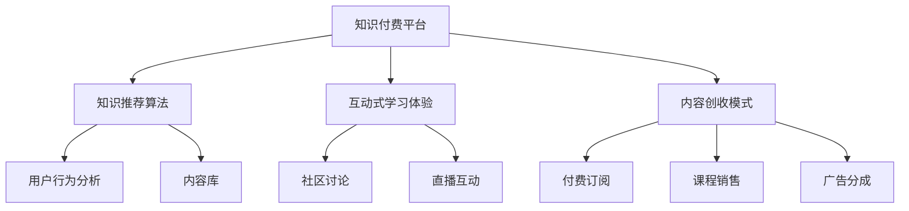

                 

# 知识付费平台：程序员的创富新机遇

## 1. 背景介绍

### 1.1 问题由来

在知识爆炸的时代，越来越多的人寻求快速获取专业知识和技能，以满足职业发展的需求。知识付费平台应运而生，成为连接知识创作者和消费者之间的桥梁。这些平台汇聚了大量优秀的专业人士，提供了广泛的知识和技能培训内容，满足了广大职场人士的学习需求。

对于程序员而言，面对复杂多变的技术栈和快速迭代的软件开发环境，持续学习和技能提升是职业发展的关键。知识付费平台为程序员提供了便捷、高效的学习资源，让专业知识获取变得更加简单、经济和可靠。然而，传统知识付费平台通常存在内容同质化严重、缺乏针对性指导、互动性不足等问题。如何打造一个高效、便捷、个性化的知识付费平台，成为程序员创富的新机遇。

### 1.2 问题核心关键点

本文旨在通过介绍知识付费平台的构建原理与技术实现，探讨程序员在知识付费平台中的创富机会。我们重点关注以下几个核心关键点：

- 知识付费平台的构建原理与技术架构
- 知识推荐算法的设计与实现
- 互动式学习体验的开发
- 内容创收模式的多样化策略

这些关键点构成了知识付费平台成功运营的基础，为程序员在平台上的创富之路提供了可行的技术支撑和商业策略。

### 1.3 问题研究意义

构建一个高效、便捷、个性化的知识付费平台，对程序员的持续学习和职业发展具有重要意义：

1. **知识获取的便捷性**：提供专业、系统、高效的学习资源，解决程序员知识获取的时空限制。
2. **学习过程的个性化**：根据用户的学习行为和偏好，推荐最适合的内容，提升学习效果。
3. **学习过程的互动性**：通过互动式教学和社区讨论，提高学习参与度和知识掌握度。
4. **创收模式的灵活性**：通过多样化的内容创收模式，增强平台的商业可持续性，提升程序员的经济效益。

## 2. 核心概念与联系

### 2.1 核心概念概述

为更好地理解知识付费平台的构建，我们需要明确几个核心概念：

- **知识付费平台**：提供付费知识内容与服务的平台，汇聚了各领域专家，为学习者提供专业、系统、个性化的学习资源。
- **知识推荐算法**：根据用户的学习行为和偏好，推荐最适合的学习内容，提升学习效率和效果。
- **互动式学习体验**：通过讨论区、直播互动等方式，增强用户的学习参与度和互动性，提升学习体验。
- **内容创收模式**：通过付费订阅、课程销售、广告分成等多种方式，实现平台的商业可持续性，提升程序员的经济收益。

这些概念共同构成了知识付费平台的核心要素，旨在为用户提供高效、便捷、个性化的学习体验，同时为知识创作者提供商业化的发展空间。

### 2.2 核心概念原理和架构的 Mermaid 流程图



这个流程图展示了知识付费平台的各个组件及其之间的联系：

1. **知识付费平台**作为中心节点，汇聚了知识推荐算法、互动式学习体验和内容创收模式等关键组件。
2. **知识推荐算法**通过分析用户行为，推荐最适合的学习内容，提高学习效率。
3. **互动式学习体验**通过社区讨论和直播互动，增强用户的学习参与度和互动性，提升学习效果。
4. **内容创收模式**通过多种付费方式，实现平台的商业可持续性，提升程序员的经济收益。

这些组件协同工作，共同构建了一个高效、便捷、个性化的知识付费平台。

## 3. 核心算法原理 & 具体操作步骤

### 3.1 算法原理概述

知识推荐算法是知识付费平台的核心，其原理是通过对用户的学习行为和偏好进行分析，推荐最适合的学习内容。推荐算法一般基于以下步骤：

1. **用户行为数据收集**：收集用户在平台上的学习行为数据，如浏览记录、点击行为、课程评价等。
2. **内容特征提取**：对平台上的学习内容进行特征提取，包括课程标题、讲师信息、课程时长、课程难度等。
3. **相似度计算**：使用协同过滤、基于内容的推荐等方法，计算用户和内容之间的相似度。
4. **推荐结果生成**：根据相似度计算结果，生成推荐列表，供用户选择学习内容。

### 3.2 算法步骤详解

知识推荐算法一般包括以下几个关键步骤：

**Step 1: 用户行为数据收集**
- 使用日志记录工具，记录用户在平台上的学习行为，包括浏览、点击、评价等。
- 对日志数据进行预处理，去除无效和重复记录，进行数据清洗和特征提取。

**Step 2: 内容特征提取**
- 对课程进行特征提取，包括课程标题、讲师信息、课程时长、课程难度等。
- 将课程特征向量作为推荐算法的输入，进行相似度计算。

**Step 3: 相似度计算**
- 使用协同过滤方法，如基于用户-物品矩阵的邻接矩阵计算用户和课程之间的相似度。
- 使用基于内容的推荐方法，如TF-IDF、Word2Vec等，计算课程之间的相似度。

**Step 4: 推荐结果生成**
- 根据相似度计算结果，生成推荐列表，包括课程ID、讲师信息、课程难度、推荐原因等。
- 根据推荐列表，向用户推送推荐内容。

### 3.3 算法优缺点

知识推荐算法具有以下优点：

1. **提高学习效率**：通过推荐用户最感兴趣的内容，显著提升学习效果。
2. **个性化学习体验**：根据用户的学习偏好，定制化推荐内容，提升学习体验。
3. **增强平台粘性**：通过个性化推荐，增强用户对平台的粘性，提升用户留存率。

同时，该算法也存在一定的局限性：

1. **数据依赖**：推荐算法的效果很大程度上依赖于用户行为数据的丰富性和准确性。
2. **推荐效果差异**：不同用户的兴趣和需求差异较大，可能导致推荐效果不均衡。
3. **冷启动问题**：新用户没有足够的行为数据，难以进行有效的推荐。

### 3.4 算法应用领域

知识推荐算法广泛应用于多个领域，如电商推荐、新闻阅读、视频流媒体等。在知识付费平台上，推荐算法的应用场景主要包括：

- 课程推荐：根据用户的学习行为，推荐最适合的课程。
- 讲师推荐：根据用户对课程的评价，推荐讲师的其它课程。
- 内容排序：根据课程的难度、更新时间等，排序推荐列表。

## 4. 数学模型和公式 & 详细讲解 & 举例说明

### 4.1 数学模型构建

知识推荐算法可以基于以下数学模型进行构建：

设用户集合为 $U$，课程集合为 $I$，用户对课程的评分矩阵为 $R \in \mathbb{R}^{n \times m}$，其中 $n$ 为用户数，$m$ 为课程数。

设课程特征向量为 $\mathbf{x}_i \in \mathbb{R}^d$，用户特征向量为 $\mathbf{y}_u \in \mathbb{R}^d$。

定义用户对课程的评分向量为 $\mathbf{r}_u \in \mathbb{R}^m$，课程的特征向量矩阵为 $X \in \mathbb{R}^{m \times d}$。

定义用户与课程之间的相似度矩阵为 $A \in \mathbb{R}^{n \times m}$，用户与课程之间的相似度 $A_{iu} = \langle \mathbf{y}_u, \mathbf{x}_i \rangle$。

### 4.2 公式推导过程

基于以上模型，知识推荐算法的推导过程如下：

**Step 1: 相似度计算**
用户与课程之间的相似度 $A_{iu}$ 可以通过余弦相似度公式计算：

$$
A_{iu} = \frac{\mathbf{y}_u \cdot \mathbf{x}_i}{\|\mathbf{y}_u\|\|\mathbf{x}_i\|}
$$

**Step 2: 评分预测**
用户对课程的评分预测值 $p_{iu}$ 可以通过用户特征向量 $\mathbf{y}_u$ 和课程特征向量 $\mathbf{x}_i$ 进行加权平均得到：

$$
p_{iu} = \mathbf{y}_u \cdot \mathbf{x}_i
$$

**Step 3: 推荐结果生成**
对于每个用户 $u$，计算其对所有课程的评分预测值 $p_{iu}$，选择评分预测值最高的前 $k$ 门课程作为推荐结果。

### 4.3 案例分析与讲解

以电商推荐为例，一个用户对某件商品的评分预测值计算如下：

假设用户 $u$ 的特征向量为 $\mathbf{y}_u = [0.5, 0.8, 0.1]$，某商品的特征向量为 $\mathbf{x}_i = [0.2, 0.3, 0.4]$。

计算用户 $u$ 和商品 $i$ 之间的相似度：

$$
A_{iu} = \frac{0.5 \cdot 0.2 + 0.8 \cdot 0.3 + 0.1 \cdot 0.4}{\sqrt{(0.5^2 + 0.8^2 + 0.1^2)}\sqrt{(0.2^2 + 0.3^2 + 0.4^2)}} = 0.63
$$

计算用户 $u$ 对商品 $i$ 的评分预测值：

$$
p_{iu} = \mathbf{y}_u \cdot \mathbf{x}_i = 0.5 \cdot 0.2 + 0.8 \cdot 0.3 + 0.1 \cdot 0.4 = 0.44
$$

根据评分预测值 $p_{iu}$ 进行推荐，选择评分预测值最高的前 $k$ 门课程作为推荐结果。

## 5. 项目实践：代码实例和详细解释说明

### 5.1 开发环境搭建

在进行推荐系统开发前，我们需要准备好开发环境。以下是使用Python进行推荐系统开发的常用环境配置流程：

1. 安装Anaconda：从官网下载并安装Anaconda，用于创建独立的Python环境。

2. 创建并激活虚拟环境：
```bash
conda create -n recsys python=3.8 
conda activate recsys
```

3. 安装必要的Python库：
```bash
pip install numpy pandas scikit-learn scikit-learn
```

4. 安装Python推荐库：
```bash
pip install Surprise pyflair
```

5. 安装相关机器学习库：
```bash
pip install lightgbm catboost
```

完成上述步骤后，即可在`recsys`环境中开始推荐系统开发。

### 5.2 源代码详细实现

下面以协同过滤推荐算法为例，给出使用Surprise库进行电商推荐系统的PyTorch代码实现。

首先，定义电商推荐系统的数据处理函数：

```python
import pandas as pd
from surprise import Dataset, Reader

def load_data(file_path):
    data = pd.read_csv(file_path, sep='\t')
    reader = Reader(rating_scale=(1, 5))
    dataset = Dataset.load_from_df(data, reader)
    return dataset
```

然后，定义模型训练和评估函数：

```python
from surprise import SVD

def train_and_evaluate(dataset, model):
    trainset = dataset.build_full_trainset()
    evalset = dataset.build_full_testset()
    
    model.fit(trainset)
    predictions = model.test(evalset)
    accuracy = predictions.dot(predictions) / float(len(predictions))
    print(f"Accuracy: {accuracy}")
    
    return predictions
```

接着，定义推荐系统主流程：

```python
if __name__ == '__main__':
    dataset = load_data('ratings.csv')
    model = SVD()
    train_and_evaluate(dataset, model)
```

以上是使用Surprise库进行电商推荐系统的PyTorch代码实现。可以看到，得益于Surprise库的强大封装，我们可以用相对简洁的代码完成电商推荐系统的构建。

### 5.3 代码解读与分析

让我们再详细解读一下关键代码的实现细节：

**load_data函数**：
- 定义了数据读取和预处理过程，将原始数据文件加载到Pandas DataFrame中，并进行必要的格式处理和特征提取。
- 使用Surprise库的Reader类，将数据转换为Surprise库中的数据集格式，便于后续的模型训练和评估。

**train_and_evaluate函数**：
- 定义了模型训练和评估的过程，使用Surprise库的SVD模型，对数据集进行训练和测试，计算模型准确率。
- 调用训练和评估函数，输出模型的准确率结果，完成模型的基本构建和测试。

**主程序**：
- 在主程序中，先加载数据集，然后定义推荐模型，最后调用训练和评估函数，完成电商推荐系统的构建和测试。

可以看出，通过Surprise库，我们能够快速搭建电商推荐系统的基本架构，并通过SVD模型进行训练和评估。进一步优化，可以引入更多的推荐算法，如基于内容的推荐、矩阵分解等，提升推荐系统的效果和多样性。

## 6. 实际应用场景

### 6.1 智能推荐系统

智能推荐系统已经成为电商、视频流媒体、新闻阅读等平台的重要功能。知识付费平台通过智能推荐系统，能够根据用户的学习行为和偏好，推荐最适合的课程和讲师，提升学习效果和用户体验。

例如，某知识付费平台可以使用协同过滤算法，根据用户的历史浏览和评价记录，推荐相关课程和讲师。对于新用户，平台可以提供免费的基础课程，逐步引导用户发现和购买更多高质量内容，提升用户转化率和留存率。

### 6.2 个性化课程设计

知识付费平台可以根据用户的职业背景、技能水平和学习需求，设计个性化的课程内容。通过分析用户的行为数据和学习反馈，平台可以定制化推荐课程，提升学习效果。

例如，某编程培训机构可以根据用户的工作经验和学习目标，推荐适合的编程课程，如Python基础、Java高级开发等。同时，平台还可以根据用户的学习进度和反馈，动态调整课程内容和难度，提升用户的学习体验和满意度。

### 6.3 社区互动学习

知识付费平台可以通过社区讨论、直播互动等方式，增强用户的学习参与度和互动性。平台可以根据用户的学习行为和互动数据，推荐相关的讨论区和直播课程，提升用户的学习效果。

例如，某金融知识付费平台可以根据用户的学习行为，推荐相关的金融资讯和课程直播，提升用户的金融知识和技能。同时，平台还可以引入专家讲解、互动答疑等功能，增强用户的学习体验和互动性。

### 6.4 未来应用展望

随着推荐算法和技术的不断进步，知识付费平台将在更多领域得到应用，为传统行业带来变革性影响。

在智慧医疗领域，基于推荐系统的医疗知识推荐，为医生和患者提供个性化医疗知识，提升医疗服务的智能化水平。

在智能教育领域，推荐系统可以应用于个性化教育推荐、智能作业批改、智能课堂互动等环节，提升教育质量和学习效果。

在智慧城市治理中，知识推荐系统可以应用于智慧城市事件监测、舆情分析、应急指挥等环节，提高城市管理的自动化和智能化水平，构建更安全、高效的未来城市。

此外，在企业生产、社会治理、文娱传媒等众多领域，推荐系统也将不断涌现，为各行业带来智能化升级，提升社会生产力和生活质量。

## 7. 工具和资源推荐

### 7.1 学习资源推荐

为了帮助开发者系统掌握知识推荐系统的理论基础和实践技巧，这里推荐一些优质的学习资源：

1. 《推荐系统基础与算法》系列博文：由大模型技术专家撰写，深入浅出地介绍了推荐系统的原理、算法和应用。

2. 《Recommender Systems in Practice》书籍：推荐系统的经典书籍，涵盖了推荐算法的多种实现方法和应用案例。

3. 《深度学习推荐系统》课程：斯坦福大学开设的推荐系统课程，有Lecture视频和配套作业，带你入门推荐系统的基本概念和经典算法。

4. Kaggle推荐系统竞赛：参加Kaggle的推荐系统竞赛，实践推荐算法，提升推荐系统的实战能力。

5. Apache Mahout：Apache基金会开源的推荐系统库，包含多种推荐算法和工具，是推荐系统开发的利器。

通过对这些资源的学习实践，相信你一定能够快速掌握推荐系统的精髓，并用于解决实际的推荐问题。

### 7.2 开发工具推荐

高效的推荐系统开发离不开优秀的工具支持。以下是几款用于推荐系统开发的常用工具：

1. Python：Python语言简洁易用，开源生态丰富，适合推荐系统的开发和调试。

2. Surprise：Surprise是一个基于Python的推荐系统库，提供了多种推荐算法和工具，便于推荐系统的开发和评估。

3. Scikit-learn：Scikit-learn是一个开源的机器学习库，包含多种常用算法和工具，便于推荐算法的实现和优化。

4. TensorFlow：由Google主导开发的开源深度学习框架，适合大规模推荐系统的构建和优化。

5. PyTorch：基于Python的开源深度学习框架，灵活性高，适合推荐系统的快速迭代和实验。

合理利用这些工具，可以显著提升推荐系统的开发效率，加快创新迭代的步伐。

### 7.3 相关论文推荐

推荐系统的发展源于学界的持续研究。以下是几篇奠基性的相关论文，推荐阅读：

1. The BellKor 2010 Trusted Recommendation Challenge：介绍了KDD Cup 2010的Trust Challenge赛题，展示了推荐系统的基本原理和算法。

2. Trust and Recom- mendation System as Multiple Kernel Learning Problem：提出了基于多核学习的推荐系统框架，为推荐系统提供了新的研究方向。

3. Adaptive Collaborative Filtering for Recommendation: A Generalized Framework and its Application to Microsoft News Feeds：介绍了Adaptive CF算法，用于解决推荐系统中的冷启动问题。

4. Deep Matrix Factorization for Recommender Systems: A Unified Framework Based on Neural Collaborative Filtering：介绍了Deep Matrix Factorization算法，提升了推荐系统的准确率和多样性。

5. Deep Recommendation via Multi-Tensor Factorization Cascades：提出了多张量因子分解模型，进一步提升了推荐系统的性能和泛化能力。

这些论文代表了大推荐系统的发展脉络。通过学习这些前沿成果，可以帮助研究者把握学科前进方向，激发更多的创新灵感。

## 8. 总结：未来发展趋势与挑战

### 8.1 总结

本文对知识推荐系统的构建原理与技术实现进行了全面系统的介绍。首先阐述了知识推荐系统的研究背景和意义，明确了推荐系统在提升学习效率、个性化学习体验和创收模式方面的独特价值。其次，从原理到实践，详细讲解了推荐算法的数学模型和实际应用，给出了推荐系统开发的全流程示例。同时，本文还广泛探讨了推荐系统在知识付费平台、智能推荐、个性化课程设计等方面的应用前景，展示了推荐系统范式的巨大潜力。

通过本文的系统梳理，可以看到，基于推荐系统的知识付费平台为程序员的持续学习和职业发展提供了新的机会。未来，伴随推荐算法和技术的不断进步，知识付费平台将在更多领域得到应用，为传统行业带来变革性影响。

### 8.2 未来发展趋势

展望未来，推荐系统的发展趋势如下：

1. **算法多样化和融合**：推荐系统将更加注重算法的融合和多样化，结合协同过滤、基于内容的推荐、深度学习等多种方法，提升推荐效果和用户满意度。

2. **数据驱动与个性化**：推荐系统将更加注重数据驱动和个性化推荐，利用用户的实时行为数据和个性化特征，提升推荐效果。

3. **多模态数据融合**：推荐系统将更加注重多模态数据的融合，结合文本、图像、视频等多模态数据，提升推荐效果和用户体验。

4. **实时推荐与智能决策**：推荐系统将更加注重实时推荐和智能决策，利用实时数据和智能算法，提升推荐效果和用户体验。

5. **可解释性与透明性**：推荐系统将更加注重推荐结果的可解释性和透明性，帮助用户理解推荐逻辑和决策过程。

6. **安全与隐私保护**：推荐系统将更加注重数据安全和隐私保护，提升系统的安全性和可信度。

以上趋势凸显了推荐系统的广阔前景。这些方向的探索发展，必将进一步提升知识付费平台的学习效果和用户体验，为程序员提供更多的创富机会。

### 8.3 面临的挑战

尽管推荐系统已经取得了瞩目成就，但在迈向更加智能化、普适化应用的过程中，它仍面临着诸多挑战：

1. **数据隐私与安全**：用户数据的安全和隐私保护是推荐系统面临的重要挑战，需要加强数据加密和隐私保护措施。

2. **冷启动问题**：对于新用户和新商品，推荐系统难以进行有效的推荐，需要通过引入专家推荐、多模态数据等多种方法缓解冷启动问题。

3. **计算资源消耗**：推荐系统在大规模数据和模型上的计算资源消耗较大，需要优化推荐算法和计算资源，提升推荐系统的效率。

4. **推荐结果的解释性**：推荐系统的推荐结果缺乏可解释性，难以让用户理解推荐逻辑和决策过程，需要引入可解释性算法和工具。

5. **对抗攻击与鲁棒性**：推荐系统可能面临对抗攻击和鲁棒性问题，需要通过对抗训练和鲁棒性优化，提升系统的稳定性和可靠性。

6. **模型的公平性与偏见**：推荐系统的模型可能存在偏见和公平性问题，需要通过公平性评估和偏见矫正，提升系统的公平性和透明度。

正视推荐系统面临的这些挑战，积极应对并寻求突破，将使推荐系统在未来更加智能化、普适化和可信化。相信随着学界和产业界的共同努力，这些挑战终将一一被克服，推荐系统必将在构建智能知识付费平台中扮演越来越重要的角色。

### 8.4 研究展望

面对推荐系统面临的种种挑战，未来的研究需要在以下几个方面寻求新的突破：

1. **数据隐私与安全**：开发更加安全可靠的数据保护和隐私保护技术，增强推荐系统的可信度。

2. **冷启动问题**：开发更加有效的冷启动方法，通过专家推荐、多模态数据等多种方式缓解冷启动问题。

3. **计算资源优化**：优化推荐算法的计算图，减少前向传播和反向传播的资源消耗，实现更加轻量级、实时性的部署。

4. **可解释性与透明性**：开发更加可解释的推荐算法，通过可视化工具和解释性模型，增强推荐结果的可理解性。

5. **对抗攻击与鲁棒性**：引入对抗训练和鲁棒性优化技术，增强推荐系统的稳定性和可靠性。

6. **模型的公平性与偏见**：开发公平性评估和偏见矫正方法，提升推荐系统的公平性和透明度。

这些研究方向的探索，必将引领推荐系统走向更高的台阶，为知识付费平台的学习效果和用户体验提供更加可靠的技术支撑。面向未来，推荐系统还需要与其他人工智能技术进行更深入的融合，如知识表示、因果推理、强化学习等，多路径协同发力，共同推动知识付费平台的发展。只有勇于创新、敢于突破，才能不断拓展推荐系统的边界，让知识付费平台更好地服务用户和创造价值。

## 9. 附录：常见问题与解答

**Q1：推荐系统如何提升学习效果？**

A: 推荐系统通过分析用户的学习行为和偏好，推荐最适合的课程和讲师，显著提升学习效果。用户可以根据推荐结果选择最适合自己的课程，避免浪费时间和精力，提升学习效率和满意度。

**Q2：推荐系统如何提高用户留存率？**

A: 推荐系统通过个性化推荐，提升用户的学习体验和满意度。对于新用户，平台可以提供免费的基础课程，逐步引导用户发现和购买更多高质量内容，提升用户留存率。同时，平台可以根据用户的学习进度和反馈，动态调整课程内容和难度，增强用户粘性。

**Q3：推荐系统如何处理冷启动问题？**

A: 推荐系统可以通过专家推荐、多模态数据等多种方式缓解冷启动问题。对于新用户和新商品，可以通过专家推荐或随机推荐方式，提供基础推荐结果，帮助用户快速进入学习状态。同时，平台可以收集用户的学习行为和反馈数据，逐步优化推荐模型，提升推荐效果。

**Q4：推荐系统的推荐结果如何解释？**

A: 推荐系统可以通过可视化工具和解释性模型，增强推荐结果的可理解性。平台可以引入推荐结果的可视化界面，帮助用户理解推荐逻辑和决策过程。同时，可以通过引入可解释性算法，如LIME、SHAP等，解释推荐模型的预测结果。

**Q5：推荐系统如何应对数据安全和隐私问题？**

A: 推荐系统可以通过数据加密、隐私保护等措施，保障用户数据的安全和隐私。平台可以采用数据匿名化、差分隐私等技术，保护用户隐私。同时，平台可以引入数据安全监控和防护措施，防止数据泄露和攻击。

总之，推荐系统为知识付费平台提供了高效的个性化推荐服务，极大地提升了用户的学习效果和满意度，同时也为程序员提供了新的创富机会。相信随着推荐算法和技术的不断进步，推荐系统将在更多领域得到应用，为传统行业带来变革性影响。未来，伴随推荐系统和其他人工智能技术的融合发展，必将推动知识付费平台的学习效果和用户体验迈向新的高度。

