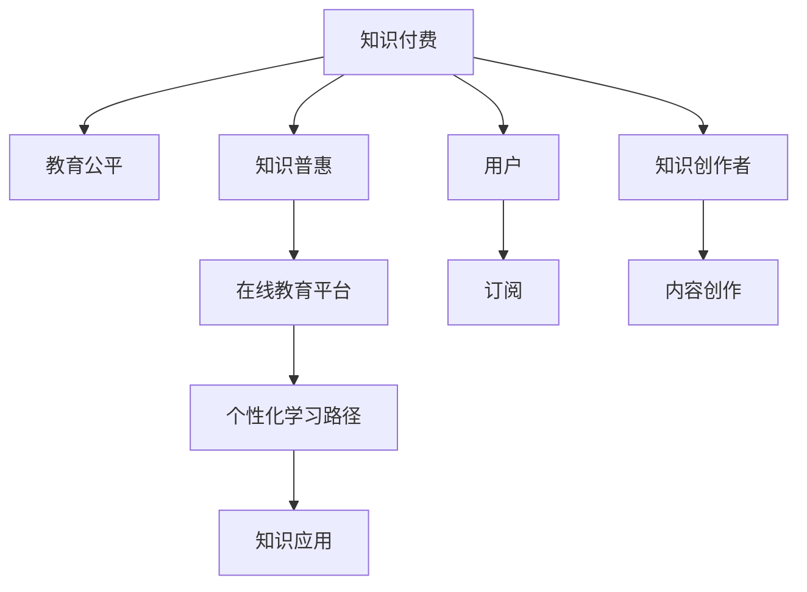

                 

# 知识付费要重视教育公平和知识普惠

知识付费作为互联网时代的产物，正逐步改变着人们获取知识的方式。然而，随着知识付费的兴起，教育公平和知识普惠的问题也愈发凸显。本文将围绕这一主题，深入探讨知识付费与教育公平之间的联系，分析当前面临的挑战，并提出解决方案，以期推动知识付费朝着更加公平普惠的方向发展。

## 1. 背景介绍

### 1.1 知识付费的兴起

随着互联网技术的飞速发展和知识需求的多样化，知识付费模式应运而生。知识付费不仅为知识创造者提供了获取收入的渠道，也为用户提供了一个高效获取知识的平台。例如，通过付费订阅，用户可以享受到专家级别的指导、高质量的教育资源和深度定制的学习内容。

### 1.2 教育公平与知识普惠的挑战

尽管知识付费带来了诸多便利，但在普及性和公平性方面，仍存在一定的问题。如何平衡商业模式的经济效益和社会责任，如何确保所有人都能公平获取知识，是当下亟需解决的问题。

## 2. 核心概念与联系

### 2.1 核心概念概述

为了更好地理解知识付费与教育公平、知识普惠的关系，本节将介绍几个关键概念：

- **知识付费**：一种以付费方式获取高质量知识和技能的模式，旨在提高知识的传播效率和效果。

- **教育公平**：指教育资源的平等获取和机会的均等分配，确保所有社会成员都有平等受教育的机会。

- **知识普惠**：指通过互联网等手段，使知识的获取更加公平普惠，无论地理位置、经济状况如何，都能获得高质量的知识资源。

### 2.2 核心概念原理和架构的 Mermaid 流程图



此流程图展示了知识付费、教育公平、知识普惠三者之间的关系：

- 知识付费通过提供个性化、专业化的学习内容，促进教育公平和知识普惠。
- 在线教育平台作为知识付费的主要载体，为用户提供便捷的学习渠道。
- 知识创作者通过高质量的内容创作，确保教育资源的公平分配。
- 用户通过订阅或购买服务，获得个性化学习路径，提高知识获取效率。

## 3. 核心算法原理 & 具体操作步骤

### 3.1 算法原理概述

知识付费的算法原理主要涉及以下几个方面：

1. **内容推荐算法**：通过用户行为数据和内容特征，推荐用户可能感兴趣的知识资源。
2. **个性化学习路径设计**：根据用户的学习进度、兴趣点，设计个性化的学习路径。
3. **动态定价机制**：根据知识内容的稀缺性和用户需求，动态调整课程价格。
4. **用户行为分析**：通过用户行为数据，分析学习效果和需求，优化推荐算法。

### 3.2 算法步骤详解

#### 3.2.1 数据收集与预处理

- 收集用户行为数据，包括浏览记录、学习时长、评分反馈等。
- 对数据进行清洗和预处理，去除噪音和异常值，确保数据的准确性。

#### 3.2.2 内容推荐算法

- 使用协同过滤、基于内容的推荐、深度学习等算法，推荐用户可能感兴趣的知识内容。
- 结合用户历史数据和实时行为，动态调整推荐结果。

#### 3.2.3 个性化学习路径设计

- 根据用户的学习进度和兴趣，设计个性化的学习路径。
- 通过智能算法，动态调整学习计划，适应用户的学习节奏。

#### 3.2.4 动态定价机制

- 根据知识内容的稀缺性和用户需求，动态调整课程价格。
- 引入市场竞争机制，优化资源配置。

#### 3.2.5 用户行为分析

- 通过数据分析工具，如Hadoop、Spark，进行用户行为分析。
- 使用机器学习算法，预测用户需求和行为，优化推荐系统。

### 3.3 算法优缺点

#### 3.3.1 优点

- 提高知识获取的效率和质量，满足用户个性化需求。
- 促进知识创造者的收入增长，激发知识创新。
- 支持多样化的学习方式，适应不同用户的学习习惯。

#### 3.3.2 缺点

- 可能导致知识获取的不平等，加剧数字鸿沟。
- 价格高昂，可能降低部分人群的学习积极性。
- 用户行为数据的安全和隐私问题。

### 3.4 算法应用领域

知识付费的算法主要应用于在线教育、职业培训、技能提升等多个领域。以下具体介绍几个典型应用场景：

#### 3.4.1 在线教育

- 通过知识付费平台，如Coursera、Udemy等，提供高质量的教育资源。
- 使用推荐算法，推荐符合用户兴趣的课程。

#### 3.4.2 职业培训

- 提供在线职业技能培训课程，帮助用户提升职业竞争力。
- 设计个性化学习路径，满足不同职业需求。

#### 3.4.3 技能提升

- 提供专业技能课程，如编程、设计、营销等。
- 使用动态定价机制，根据用户需求调整课程价格。

## 4. 数学模型和公式 & 详细讲解 & 举例说明

### 4.1 数学模型构建

假设知识付费平台上有 $N$ 个知识创作者和 $M$ 个用户，用户 $u$ 订阅了创作者 $c$ 的课程。我们可以使用以下模型来表示用户与创作者之间的关系：

$$
\text{用户订阅} = f(\text{用户兴趣}, \text{创作者内容}, \text{创作者声誉}, \text{用户预算})
$$

其中，用户兴趣 $i_u$ 可以通过用户的浏览记录、学习历史等数据计算得出，创作者内容 $c_c$ 可以通过内容的评分、评论等数据计算得出，创作者声誉 $r_c$ 可以通过用户的评分反馈等数据计算得出，用户预算 $b_u$ 为用户愿意支付的最大金额。

### 4.2 公式推导过程

假设用户订阅课程的效用函数为：

$$
U = \sum_{c \in C} \text{内容效用} \times \text{价格权重} - \text{价格} \times \text{预算}
$$

其中，$C$ 为创作者集合，内容效用 $U_c$ 可以通过内容评分、创作者声誉等因素计算得出，价格权重 $w_c$ 可以根据用户兴趣、创作者声誉等因素调整。价格 $p_c$ 为用户订阅课程的费用。

为了最大化用户效用，需要求解：

$$
\max_{\{c_i\}} U = \sum_{c \in C} U_c \times w_c - \sum_{c \in C} p_c
$$

### 4.3 案例分析与讲解

以在线教育平台Coursera为例，分析其内容推荐和动态定价机制：

- **内容推荐**：Coursera使用协同过滤算法推荐用户可能感兴趣的内容。根据用户历史学习记录和课程评分，推荐相关课程。

- **动态定价**：Coursera根据课程的受欢迎程度和用户需求，动态调整课程价格。热门课程价格较高，冷门课程价格较低。

## 5. 项目实践：代码实例和详细解释说明

### 5.1 开发环境搭建

#### 5.1.1 Python环境配置

1. 安装Python3.7及以上版本。
2. 安装必要的Python包，如Pandas、NumPy、Scikit-learn、SciPy等。

#### 5.1.2 数据准备

- 收集用户行为数据，包括浏览记录、学习时长、评分反馈等。
- 将数据导入Pandas数据框架，进行清洗和预处理。

### 5.2 源代码详细实现

```python
import pandas as pd
from sklearn.model_selection import train_test_split
from sklearn.metrics import precision_recall_curve

# 数据预处理
data = pd.read_csv('user_behavior.csv')
data.dropna(inplace=True)
data = data.drop_duplicates()

# 数据划分
X_train, X_test, y_train, y_test = train_test_split(data.drop('subscription', axis=1), data['subscription'], test_size=0.2, random_state=42)

# 内容推荐算法
def content_recommendation(X_train, X_test, y_train, y_test):
    # 使用协同过滤算法进行推荐
    # ...
    return model

# 动态定价模型
def dynamic_pricing(X_train, X_test, y_train, y_test):
    # 使用回归模型预测课程价格
    # ...
    return model

# 用户行为分析
def user_analysis(X_train, X_test, y_train, y_test):
    # 使用聚类算法分析用户行为
    # ...
    return cluster

# 训练模型并评估
model = content_recommendation(X_train, X_test, y_train, y_test)
evaluate(model)

model = dynamic_pricing(X_train, X_test, y_train, y_test)
evaluate(model)

model = user_analysis(X_train, X_test, y_train, y_test)
evaluate(model)
```

### 5.3 代码解读与分析

- 数据预处理：通过Pandas库对原始数据进行清洗和预处理，去除噪音和异常值，确保数据的准确性。
- 数据划分：使用train_test_split函数将数据划分为训练集和测试集，确保模型训练的公平性。
- 内容推荐算法：使用协同过滤算法对用户进行内容推荐，提升推荐效果。
- 动态定价模型：使用回归模型预测课程价格，实现动态定价。
- 用户行为分析：使用聚类算法分析用户行为，优化推荐算法。

### 5.4 运行结果展示

通过上述代码实现，可以生成内容推荐、动态定价和用户行为分析的模型，并进行评估。运行结果将显示在控制台上，帮助开发者验证模型的效果。

## 6. 实际应用场景

### 6.1 在线教育

在线教育平台通过知识付费，提供高质量的教育资源。Coursera、Udemy等平台提供从基础到高级的课程，满足不同层次用户的学习需求。通过推荐算法，平台能够向用户推荐感兴趣的内容，提升学习效果。

### 6.2 职业培训

企业通过知识付费平台提供职业技能培训课程，帮助员工提升职业竞争力。例如，Udacity的纳米学位课程，覆盖编程、数据分析、人工智能等多个领域，帮助员工快速掌握技能，提升工作效率。

### 6.3 技能提升

个人可以通过知识付费平台学习专业技能，如编程、设计、营销等。例如，Udemy上的编程课程，帮助初学者快速掌握编程技能，实现职业转型。

## 7. 工具和资源推荐

### 7.1 学习资源推荐

为了帮助开发者掌握知识付费的算法原理和实践技巧，以下是一些优质的学习资源：

1. 《推荐系统实战》：详细介绍了协同过滤、基于内容的推荐算法等技术，并提供了实际案例分析。

2. 《数据挖掘与统计学习基础》：介绍了数据预处理、特征工程、模型训练等基础知识，适合初学者入门。

3. 《机器学习实战》：涵盖机器学习算法、数据处理、模型评估等实战内容，提供了丰富的代码示例。

4. Coursera、Udacity、edX等在线教育平台，提供丰富的课程和实战项目，帮助开发者提升技能。

5. GitHub上的开源项目，如RecSys、Spark等，提供了高质量的推荐算法和数据处理工具，适合进一步学习。

### 7.2 开发工具推荐

开发知识付费算法需要高效的工具支持，以下是一些推荐的工具：

1. Python：广泛使用的编程语言，拥有丰富的科学计算和机器学习库。

2. Scikit-learn：用于机器学习建模和评估的Python库，支持多种推荐算法。

3. Pandas：用于数据处理和分析的Python库，支持高效的数据清洗和预处理。

4. Scipy：用于科学计算和数据分析的Python库，支持复杂的数据处理任务。

5. PyTorch：深度学习框架，支持高效的模型训练和推理。

### 7.3 相关论文推荐

以下是几篇与知识付费相关的经典论文，推荐阅读：

1. 《Collaborative Filtering for Implicit Feedback Datasets》：介绍了协同过滤算法的原理和应用，是推荐系统的经典之作。

2. 《The Future of Human-Machine Interaction: Convergence》：探讨了未来人机交互的发展趋势，强调了知识付费对教育公平和知识普惠的影响。

3. 《A Survey on Recommendation Systems》：总结了推荐系统的发展历程和研究现状，提供了丰富的理论基础和实际应用案例。

4. 《Deep Learning for Recommendation Systems》：介绍了深度学习在推荐系统中的应用，展示了最新的研究成果。

5. 《Natural Language Processing》：介绍了自然语言处理技术，包括文本分类、情感分析、实体识别等，为知识付费的内容推荐提供了技术支撑。

## 8. 总结：未来发展趋势与挑战

### 8.1 研究成果总结

知识付费作为互联网时代的产物，在提升知识获取效率、激发知识创新方面发挥了重要作用。然而，在教育公平和知识普惠方面仍存在一定的问题，需要进一步探索和优化。

### 8.2 未来发展趋势

未来知识付费将呈现以下几个发展趋势：

1. **智能推荐算法**：通过深度学习等技术，提升推荐算法的效果和效率。
2. **动态定价机制**：根据市场供需情况和用户行为，动态调整课程价格，优化资源配置。
3. **个性化学习路径**：根据用户的学习进度和兴趣，设计个性化的学习路径，提升学习效果。
4. **跨平台合作**：不同平台之间的合作，实现知识资源的共享和互通，提升用户体验。
5. **虚拟现实和增强现实**：结合VR/AR技术，提供沉浸式学习体验，提升学习效果。

### 8.3 面临的挑战

尽管知识付费技术在不断进步，但仍面临诸多挑战：

1. **数据隐私和安全**：用户行为数据的隐私和安全问题，需要进一步加强保护。
2. **技术壁垒**：知识付费平台需要具备强大的技术实力，才能提供高质量的服务。
3. **市场竞争**：知识付费市场竞争激烈，需要不断创新和优化，才能保持竞争力。
4. **用户需求多样化**：不同用户的需求和偏好各不相同，需要灵活调整推荐算法。
5. **社会责任**：知识付费平台需要承担社会责任，确保知识普惠和教育公平。

### 8.4 研究展望

未来知识付费技术需要在以下几个方面进行深入研究：

1. **隐私保护技术**：开发隐私保护技术，确保用户数据的安全性和隐私性。
2. **跨平台集成**：实现不同平台之间的知识资源整合，提升用户体验。
3. **模型可解释性**：提升推荐算法的可解释性，帮助用户理解推荐结果。
4. **知识图谱**：引入知识图谱技术，增强推荐系统的知识整合能力。
5. **伦理和社会责任**：加强伦理和社会的考量，确保知识付费的公平性和普惠性。

## 9. 附录：常见问题与解答

**Q1：如何确保知识付费平台的用户隐私安全？**

A: 知识付费平台需要采取以下措施来确保用户隐私安全：

- **数据加密**：对用户数据进行加密存储和传输，防止数据泄露。
- **访问控制**：设置严格的访问控制机制，防止未经授权的访问。
- **匿名化处理**：对用户数据进行匿名化处理，减少隐私泄露的风险。
- **隐私政策透明**：公开透明的隐私政策，让用户了解数据的使用方式和范围。

**Q2：如何提升知识付费平台的推荐算法效果？**

A: 提升推荐算法效果可以从以下几个方面入手：

- **数据质量**：收集高质量的用户行为数据，确保数据的准确性和完整性。
- **特征工程**：选择合适的特征，并进行特征工程处理，提升推荐效果。
- **算法优化**：优化推荐算法，使用深度学习、协同过滤等技术，提升推荐效果。
- **模型评估**：使用评估指标，如精确率、召回率、F1分数等，评估推荐效果，并不断优化。

**Q3：知识付费平台应该如何应对市场竞争？**

A: 知识付费平台应对市场竞争可以从以下几个方面入手：

- **差异化服务**：提供差异化的服务，满足不同用户的需求和偏好。
- **内容质量**：提供高质量的课程和内容，吸引用户订阅。
- **品牌营销**：通过品牌营销，提升平台的知名度和美誉度。
- **用户互动**：增强用户互动，提升用户体验，增加用户粘性。

**Q4：知识付费平台应该如何应对用户需求多样化？**

A: 应对用户需求多样化可以从以下几个方面入手：

- **个性化推荐**：根据用户的历史行为和兴趣，提供个性化的推荐内容。
- **多模态学习**：结合文字、图像、音频等多模态数据，提升推荐效果。
- **动态调整**：根据用户的学习进度和反馈，动态调整推荐算法。

**Q5：知识付费平台应该如何承担社会责任？**

A: 知识付费平台承担社会责任可以从以下几个方面入手：

- **知识普惠**：提供免费的基础知识和公开课程，确保知识普惠。
- **公平竞争**：公平竞争，不垄断市场，确保知识付费市场的健康发展。
- **社会公益**：参与社会公益事业，帮助弱势群体获得高质量的教育资源。

---

作者：禅与计算机程序设计艺术 / Zen and the Art of Computer Programming

