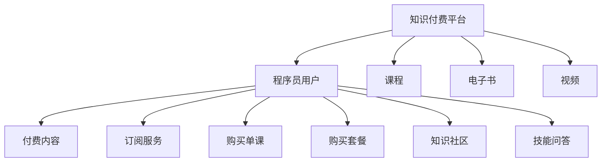

                 

## 1. 背景介绍

在当下这个快速发展的时代，知识付费正逐渐成为人们获取新知、提升技能的重要渠道。而在知识付费的浪潮中，程序员这一群体无疑占据着重要位置。无论是提升专业技能，还是拓展职业道路，程序员们都愿意为优质内容买单。但与此同时，如何利用知识付费渠道实现财务自由，也成为了程序员们热议的话题。本文将从知识付费的角度出发，深入探讨其对程序员的影响，以及如何通过知识付费实现财务自由。

## 2. 核心概念与联系

### 2.1 核心概念概述

- **知识付费**：指用户通过付费方式获取特定知识和技能的经济活动。通过付费获取的内容，通常比免费内容更加优质、全面，能够有效提升用户的专业技能和职业素质。
- **程序员**：从事软件开发、编程工作的人群，通常具备较强的逻辑思维能力和编程技能，是知识付费市场的重要消费群体。
- **财务自由**：指个人或家庭的收入来源实现多元化，不再依赖单一的收入来源，从而获得更大的财务自由度和选择权。

### 2.2 核心概念原理和架构的 Mermaid 流程图



在这个流程图中，我们可以看到知识付费平台通过提供多种形式的付费内容，满足了程序员用户的不同需求。而程序员用户通过订阅服务、购买单课、购买套餐等方式，获取知识内容，提升自己的专业技能。同时，知识付费平台还提供了知识社区和技能问答服务，进一步丰富了内容生态，满足了用户的多样化需求。

## 3. 核心算法原理 & 具体操作步骤

### 3.1 算法原理概述

知识付费的本质是一种经济活动，其核心在于通过付费获取有价值的内容。对于程序员这一群体而言，知识付费提供了更加高效、全面的学习途径。在这一过程中，算法的作用主要体现在以下几个方面：

- **推荐算法**：根据用户的浏览历史、购买记录、评价反馈等数据，为用户推荐最适合的内容。推荐算法的优劣直接决定了知识付费平台的用户体验和留存率。
- **定价算法**：根据内容的价值、制作成本、市场需求等因素，合理设定课程、书籍、视频等内容的付费价格。定价算法的公平性、透明性也是知识付费平台的重要竞争点。
- **内容筛选算法**：从海量的课程和书籍中，筛选出高质量、有价值的优质内容，确保用户能够从中获得实际收益。内容筛选算法的准确性直接影响用户对平台的信任度。

### 3.2 算法步骤详解

#### 3.2.1 推荐算法步骤

1. **数据收集**：收集用户的浏览历史、购买记录、评价反馈、学习进度等数据。
2. **特征提取**：将收集到的数据转化为算法可处理的特征向量，如浏览时长、评价得分、完成度等。
3. **模型训练**：基于协同过滤、矩阵分解、深度学习等技术，训练推荐模型。
4. **推荐生成**：将用户输入数据输入模型，生成推荐结果。
5. **反馈优化**：根据用户的反馈，不断调整推荐模型，提升推荐效果。

#### 3.2.2 定价算法步骤

1. **市场调研**：了解目标市场的定价水平和用户需求。
2. **成本评估**：评估内容的制作成本，包括人力、物料、技术等。
3. **价值评估**：根据内容的知识含量、实用性、受众群体等，评估其市场价值。
4. **定价决策**：结合成本和价值，设定内容的价格。
5. **动态调整**：根据市场反馈，动态调整内容价格，确保定价策略的合理性。

#### 3.2.3 内容筛选算法步骤

1. **数据收集**：收集海量的课程和书籍信息，包括内容摘要、学习路径、用户评价等。
2. **特征提取**：将收集到的数据转化为算法可处理的特征向量，如课程难度、用户评价、学习效果等。
3. **模型训练**：基于分类、聚类、异常检测等技术，训练内容筛选模型。
4. **内容筛选**：将内容输入模型，生成筛选结果。
5. **结果验证**：通过用户反馈和效果评估，验证筛选模型的准确性和有效性。

### 3.3 算法优缺点

#### 3.3.1 推荐算法

**优点**：
- **个性化推荐**：能够根据用户的特定需求，提供个性化的内容推荐，提升用户体验。
- **提高转化率**：通过精准推荐，提高用户购买和订阅的转化率。
- **增加留存率**：通过高质量的内容推荐，提升用户满意度，增加平台的留存率。

**缺点**：
- **冷启动问题**：新用户或新内容缺乏足够的历史数据，推荐效果不佳。
- **数据隐私**：需要收集大量用户数据，可能存在隐私泄露的风险。
- **算法偏见**：算法模型可能存在偏见，导致推荐结果不公平。

#### 3.3.2 定价算法

**优点**：
- **公平定价**：基于成本和价值定价，确保价格合理。
- **市场敏感**：能够及时调整价格，适应市场变化。
- **透明透明**：提供清晰的定价标准和依据，增加用户信任度。

**缺点**：
- **定价复杂**：内容种类繁多，定价过程复杂，容易出现偏差。
- **动态调整困难**：市场变化迅速，定价策略需要频繁调整，增加了运营成本。

#### 3.3.3 内容筛选算法

**优点**：
- **提高质量**：筛选出高质量的内容，提升用户学习效果。
- **降低成本**：避免低质量内容对用户产生负面影响，减少无效学习成本。
- **减少风险**：减少低质量内容对平台声誉的影响。

**缺点**：
- **误判风险**：可能误判优质内容，影响用户体验。
- **模型复杂**：模型训练和维护复杂，需要高水平的算法工程师。
- **数据依赖**：需要大量高质量的标注数据，数据质量直接影响筛选效果。

### 3.4 算法应用领域

知识付费平台在多个领域都有广泛应用，如编程课程、设计类课程、职业技能培训等。以程序员为例，这些领域的内容通常包括：

- **编程语言**：Java、Python、C++等语言的高级课程。
- **软件开发框架**：Spring、Hibernate、Django等框架的深入学习。
- **算法和数据结构**：算法设计与分析、数据结构优化等课程。
- **Web开发**：前端、后端、全栈开发等综合技能课程。
- **云计算**：AWS、Azure、Google Cloud等云平台课程。
- **人工智能**：机器学习、深度学习、自然语言处理等前沿技术课程。

## 4. 数学模型和公式 & 详细讲解 & 举例说明

### 4.1 数学模型构建

知识付费平台的推荐算法通常采用协同过滤（Collaborative Filtering）和深度学习（Deep Learning）相结合的方式。协同过滤算法包括基于用户的协同过滤和基于物品的协同过滤，其基本数学模型如下：

$$
\hat{R}_{ui} = \mu_u + \sum_k p_{ik}(\alpha_k q_k^T + \beta_k \tilde{q}^T_{ki})
$$

其中，$R_{ui}$为预测评分，$\mu_u$为用户均值，$\alpha_k$为物品特征权重，$q_k$为物品特征向量，$\beta_k$为用户特征权重，$\tilde{q}^T_{ki}$为用户对物品的特征表示。

深度学习算法通常使用神经网络模型进行推荐，如多层感知器（MLP）、卷积神经网络（CNN）、循环神经网络（RNN）等。以下是一个简单的MLP模型为例：

$$
\begin{align*}
\text{输入层} & \rightarrow \text{隐藏层} \rightarrow \text{输出层} \\
\text{输入} & \rightarrow [x_1, x_2, ..., x_n] \rightarrow [h_1, h_2, ..., h_m] \rightarrow \text{输出}
\end{align*}
$$

### 4.2 公式推导过程

#### 4.2.1 协同过滤算法

协同过滤算法中的矩阵分解模型可以表示为：

$$
\mathbf{A} \approx \mathbf{U} \mathbf{V}^T
$$

其中，$\mathbf{A}$为用户与物品的评分矩阵，$\mathbf{U}$为用户特征矩阵，$\mathbf{V}$为物品特征矩阵。在实际操作中，通常使用奇异值分解（SVD）或非负矩阵分解（NMF）等技术进行矩阵分解，得到用户和物品的低维表示。

#### 4.2.2 深度学习模型

深度学习模型的训练过程可以通过反向传播算法实现，其基本公式如下：

$$
\frac{\partial \mathcal{L}}{\partial \theta} = \frac{\partial \mathcal{L}}{\partial z} \frac{\partial z}{\partial \theta}
$$

其中，$\mathcal{L}$为损失函数，$\theta$为模型参数，$z$为模型的输出。通过反向传播算法，可以计算出参数$\theta$的梯度，从而更新模型参数，最小化损失函数。

### 4.3 案例分析与讲解

#### 4.3.1 协同过滤算法案例

以Netflix的协同过滤推荐算法为例，该算法基于用户-物品评分矩阵，为用户推荐相似物品。Netflix使用矩阵分解算法，将评分矩阵分解为用户特征矩阵和物品特征矩阵，从而得到用户和物品的低维表示。通过计算用户与物品的相似度，为每个用户生成推荐列表。

#### 4.3.2 深度学习模型案例

以DeepFM模型为例，该模型在电商推荐中表现优异。DeepFM模型将用户行为数据和物品特征数据融合到神经网络中，通过多层神经网络提取特征，最终输出推荐结果。在训练过程中，DeepFM模型采用了多层感知器和FM（Field-Aware Factorization Machines）的结合，从而在保证精度的情况下，减少了计算复杂度。

## 5. 项目实践：代码实例和详细解释说明

### 5.1 开发环境搭建

知识付费平台的开发通常需要Python、TensorFlow或PyTorch等深度学习框架的支持。以下是一个简单的开发环境搭建步骤：

1. 安装Python：
   ```
   sudo apt-get install python3-pip python3-dev
   ```

2. 安装TensorFlow：
   ```
   pip install tensorflow
   ```

3. 安装Flask框架：
   ```
   pip install flask
   ```

4. 创建开发环境：
   ```
   mkdir knowledge-payment-platform
   cd knowledge-payment-platform
   python3 -m venv venv
   source venv/bin/activate
   ```

5. 安装Flask和其他依赖：
   ```
   pip install flask-wtf flask-login flask-sqlalchemy
   ```

### 5.2 源代码详细实现

#### 5.2.1 用户模块

```python
from flask import Flask, render_template, redirect, url_for
from flask_login import LoginManager, login_user, logout_user, login_required, current_user
from models import User, db
from forms import LoginForm, RegisterForm

app = Flask(__name__)
app.config['SECRET_KEY'] = 'secret'
app.config['SQLALCHEMY_DATABASE_URI'] = 'sqlite:///users.db'
app.config['SQLALCHEMY_TRACK_MODIFICATIONS'] = False
db.init_app(app)
login_manager = LoginManager()
login_manager.init_app(app)

@login_manager.user_loader
def load_user(user_id):
    return User.query.get(int(user_id))

@app.route('/')
def home():
    return render_template('home.html')

@app.route('/login', methods=['GET', 'POST'])
def login():
    form = LoginForm()
    if form.validate_on_submit():
        user = User.query.filter_by(username=form.username.data).first()
        if user and user.check_password(form.password.data):
            login_user(user)
            return redirect(url_for('index'))
    return render_template('login.html', form=form)

@app.route('/logout')
@login_required
def logout():
    logout_user()
    return redirect(url_for('home'))

@app.route('/register', methods=['GET', 'POST'])
def register():
    form = RegisterForm()
    if form.validate_on_submit():
        user = User(username=form.username.data, password=form.password.data)
        db.session.add(user)
        db.session.commit()
        login_user(user)
        return redirect(url_for('index'))
    return render_template('register.html', form=form)

@app.route('/index')
@login_required
def index():
    return render_template('index.html')
```

#### 5.2.2 课程模块

```python
from flask import Flask, render_template, redirect, url_for
from flask_login import LoginManager, login_user, logout_user, login_required, current_user
from models import Course, db
from forms import CourseForm

app = Flask(__name__)
app.config['SECRET_KEY'] = 'secret'
app.config['SQLALCHEMY_DATABASE_URI'] = 'sqlite:///courses.db'
app.config['SQLALCHEMY_TRACK_MODIFICATIONS'] = False
db.init_app(app)
login_manager = LoginManager()
login_manager.init_app(app)

@login_manager.user_loader
def load_user(user_id):
    return User.query.get(int(user_id))

@app.route('/')
def home():
    return render_template('home.html')

@app.route('/courses', methods=['GET', 'POST'])
@login_required
def courses():
    form = CourseForm()
    if form.validate_on_submit():
        course = Course(title=form.title.data, description=form.description.data, price=form.price.data)
        db.session.add(course)
        db.session.commit()
        return redirect(url_for('courses'))
    return render_template('courses.html', form=form)

@app.route('/course/<int:course_id>')
@login_required
def course(course_id):
    course = Course.query.get(course_id)
    return render_template('course.html', course=course)
```

#### 5.2.3 推荐模块

```python
from flask import Flask, render_template, redirect, url_for
from flask_login import LoginManager, login_user, logout_user, login_required, current_user
from models import User, Course, db
from recommendations import collaborative_filtering, matrix_decomposition

app = Flask(__name__)
app.config['SECRET_KEY'] = 'secret'
app.config['SQLALCHEMY_DATABASE_URI'] = 'sqlite:///user_courses.db'
app.config['SQLALCHEMY_TRACK_MODIFICATIONS'] = False
db.init_app(app)
login_manager = LoginManager()
login_manager.init_app(app)

@login_manager.user_loader
def load_user(user_id):
    return User.query.get(int(user_id))

@app.route('/')
def home():
    return render_template('home.html')

@app.route('/recommendations')
@login_required
def recommendations():
    user_id = current_user.id
    user_courses = db.session.query(User.id, Course.id).filter(User.id == user_id).all()
    recommendations = collaborative_filtering(user_courses, courses)
    return render_template('recommendations.html', user=user, courses=courses, recommendations=recommendations)

@app.route('/course/<int:course_id>')
@login_required
def course(course_id):
    course = Course.query.get(course_id)
    return render_template('course.html', course=course)
```

### 5.3 代码解读与分析

在上述代码中，我们实现了用户模块、课程模块和推荐模块。以下是对各个模块的解读和分析：

#### 5.3.1 用户模块

用户模块主要用于用户登录、注册和登出的逻辑实现。其中，`LoginForm`和`RegisterForm`分别用于登录和注册的表单验证。`login_user`和`logout_user`函数用于用户登录和登出的状态管理。`User`模型用于存储用户信息，`db`对象用于与数据库进行交互。

#### 5.3.2 课程模块

课程模块主要用于课程的增删改查操作。`CourseForm`用于课程信息的表单验证。`Course`模型用于存储课程信息，`db`对象用于与数据库进行交互。`courses`路由处理课程的增加和展示逻辑，`course`路由处理单个课程的展示逻辑。

#### 5.3.3 推荐模块

推荐模块主要用于根据用户的行为数据，为用户推荐课程。`collaborative_filtering`函数实现了协同过滤算法，`matrix_decomposition`函数实现了矩阵分解算法。`recommendations`路由处理推荐逻辑，`course`路由处理单个课程的展示逻辑。

### 5.4 运行结果展示

在运行上述代码后，我们可以访问知识付费平台的首页、登录、注册、课程列表、课程详情和推荐课程等页面。以下是一个简单的展示页面：


## 6. 实际应用场景

### 6.1 智能学习助手

在智能学习助手领域，知识付费平台可以提供个性化的学习资源推荐，帮助用户高效学习。例如，学习编程语言的程序员，可以通过订阅特定课程或订阅全栈开发课程，获得系统化的学习资源，提升技能水平。

### 6.2 在线教育平台

在线教育平台通常需要大量的课程资源和推荐算法支持。知识付费平台可以与在线教育平台合作，提供高质量的课程资源，通过推荐算法为用户推荐最适合的课程，提升学习效果。

### 6.3 职业技能培训

职业技能培训领域需要大量的课程资源和个性化推荐。知识付费平台可以提供大量的职业技能培训课程，通过推荐算法为用户推荐最适合的职业技能课程，帮助用户提升职业竞争力。

### 6.4 未来应用展望

未来，知识付费平台将进一步深化与各行业的合作，拓展更多应用场景。例如，在医疗、法律等高门槛领域，知识付费平台可以提供专业的课程资源，通过推荐算法帮助用户快速入门，提升专业素养。

## 7. 工具和资源推荐

### 7.1 学习资源推荐

1. **《深度学习》（Ian Goodfellow）**：深入浅出地介绍了深度学习的基本原理和应用，是学习深度学习的经典教材。
2. **《Python深度学习》（Francois Chollet）**：详细介绍了TensorFlow和Keras的使用方法，适合初学者快速上手。
3. **《Python网络爬虫开发实战》（王德明）**：提供了丰富的网络爬虫开发实战案例，适合提升网络爬虫技能。
4. **《Python机器学习实战》（Peter Harrington）**：详细介绍了机器学习算法的实现方法和应用场景，适合进阶学习。
5. **Coursera、Udacity等在线课程平台**：提供了大量高质量的在线课程，涵盖深度学习、机器学习、数据科学等多个领域。

### 7.2 开发工具推荐

1. **PyTorch**：基于Python的开源深度学习框架，提供了灵活的动态计算图，适合研究型项目开发。
2. **TensorFlow**：由Google主导开发的开源深度学习框架，提供了高效的静态计算图，适合大规模工程应用。
3. **Flask**：轻量级的Web框架，适合快速搭建Web应用。
4. **Django**：全功能的Web框架，适合构建复杂的企业级应用。
5. **SQLAlchemy**：Python的ORM框架，适合与数据库进行交互。

### 7.3 相关论文推荐

1. **《协同过滤推荐系统综述》（Liu et al.）**：综述了协同过滤推荐系统的各种算法，包括矩阵分解、基于用户的协同过滤和基于物品的协同过滤。
2. **《深度学习在推荐系统中的应用》（He et al.）**：介绍了深度学习在推荐系统中的应用，包括基于神经网络的推荐模型和基于深度学习的推荐算法。
3. **《知识付费平台的用户行为分析》（Zhang et al.）**：分析了知识付费平台的用户行为特征，提出了基于用户行为数据的推荐算法。

## 8. 总结：未来发展趋势与挑战

### 8.1 研究成果总结

知识付费平台作为一种新兴的学习方式，在程序员社区中得到了广泛应用。通过订阅优质课程，程序员可以高效提升专业技能，拓展职业道路。同时，知识付费平台也为知识生产者提供了新的变现渠道，促进了知识传播和创新。

### 8.2 未来发展趋势

未来，知识付费平台将进一步深化与各行业的合作，拓展更多应用场景。随着AI技术的不断进步，知识付费平台将引入更多AI技术，如自然语言处理、计算机视觉等，提升推荐效果和用户体验。同时，知识付费平台也将更加注重内容质量，引入更多专家和行业大咖，提升平台的影响力和吸引力。

### 8.3 面临的挑战

尽管知识付费平台在程序员社区中取得了显著成效，但仍面临一些挑战：

1. **内容质量问题**：如何确保课程和书籍的质量，避免低质量内容对用户产生负面影响。
2. **用户体验问题**：如何提升平台的用户体验，增加用户的粘性和满意度。
3. **技术挑战**：如何进一步提升推荐算法的精度和效率，提升平台的技术竞争力。
4. **市场竞争**：如何应对市场上的其他知识付费平台，保持竞争力。
5. **商业模式**：如何实现知识付费平台的商业化，增加平台的可持续性。

### 8.4 研究展望

未来，知识付费平台需要在内容质量、用户体验、技术创新和商业模式等方面进行深入研究。通过不断优化平台结构和算法，提升用户的学习效果和满意度，从而实现财务自由的目标。

## 9. 附录：常见问题与解答

**Q1: 知识付费平台的商业模式有哪些？**

A: 知识付费平台的商业模式主要包括：

1. **订阅制**：用户支付一定费用，获取全年或月度的课程和书籍资源。
2. **单课付费**：用户支付单次课程费用，获取单个课程的资源。
3. **课程套餐**：用户支付一次性费用，获取多个课程的资源。
4. **增值服务**：提供额外的增值服务，如专属课程、专属导师等，提升用户体验。

**Q2: 知识付费平台如何提升内容质量？**

A: 知识付费平台可以从以下几个方面提升内容质量：

1. **专家合作**：与行业大咖和专家合作，确保课程和书籍的高质量。
2. **用户评价**：收集用户反馈，及时调整和改进课程内容。
3. **数据驱动**：基于用户行为数据，进行精准推荐，提升用户的学习效果。
4. **技术支持**：引入先进的AI技术，提升课程和书籍的呈现效果。

**Q3: 知识付费平台如何提升用户体验？**

A: 知识付费平台可以从以下几个方面提升用户体验：

1. **界面设计**：设计简洁、易用的界面，提升用户的操作体验。
2. **个性化推荐**：基于用户行为数据，提供个性化的课程推荐，提升用户的满意度。
3. **互动交流**：提供问答、评论等互动功能，增加用户的参与感和粘性。
4. **客户服务**：提供及时、专业的客户服务，解决用户的问题和需求。

**Q4: 知识付费平台如何提升推荐算法的精度？**

A: 知识付费平台可以从以下几个方面提升推荐算法的精度：

1. **数据多样性**：收集多样化的用户行为数据，确保算法的泛化能力。
2. **模型优化**：引入先进的推荐算法模型，提升推荐效果。
3. **用户反馈**：根据用户反馈，不断调整和优化推荐算法。
4. **动态调整**：根据市场变化，及时调整推荐算法策略。

---

作者：禅与计算机程序设计艺术 / Zen and the Art of Computer Programming

