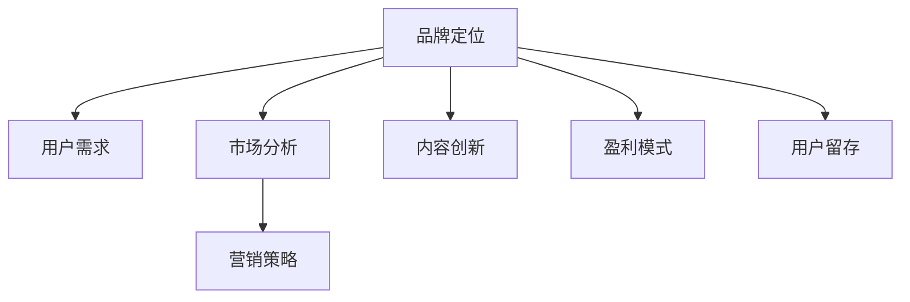

                 

# 知识付费赚钱的品牌定位与差异化策略

> 关键词：知识付费,品牌定位,差异化策略,用户需求,市场分析,营销策略,内容创新,盈利模式,用户留存

## 1. 背景介绍

### 1.1 问题由来
随着互联网的快速发展和用户对优质内容需求的增加，知识付费成为了一种新兴的商业模式。各大平台和机构纷纷推出各类知识付费产品，包括在线课程、电子书、音频讲座、直播培训等，旨在通过向用户提供有价值的知识和信息来获取收益。

然而，面对日益激烈的市场竞争，如何从众多产品中脱颖而出，打造具有竞争力的知识付费品牌，成为各大平台和机构亟需解决的问题。品牌定位和差异化策略无疑是其中的关键。本文将系统阐述知识付费品牌的定位与差异化策略，帮助相关企业更好地在知识付费市场中占据一席之地。

### 1.2 问题核心关键点
品牌定位和差异化策略的核心在于：
- 明确品牌的目标用户群体和核心价值主张。
- 突出产品独特的卖点，满足用户特定需求。
- 制定有竞争力的营销策略，提高品牌知名度和用户粘性。
- 通过内容创新和模式创新，保持品牌的持续竞争力。
- 探索多元化盈利模式，增强品牌的盈利能力。

明确这些关键点，将有助于企业制定出具有前瞻性和竞争力的品牌定位和差异化策略。

### 1.3 问题研究意义
品牌定位和差异化策略的研究具有重要的实践意义：
- 帮助企业找到目标用户，提升市场竞争力。
- 指导内容生产和营销策略，提升品牌知名度和用户粘性。
- 探索多元化的盈利模式，增强品牌的持续盈利能力。
- 帮助企业识别市场机会，把握市场趋势，实现可持续发展。

## 2. 核心概念与联系

### 2.1 核心概念概述

为更好地理解品牌定位和差异化策略，本节将介绍几个密切相关的核心概念：

- **品牌定位(Brand Positioning)**：通过精准的目标市场分析和用户需求识别，明确品牌在用户心中的位置，强调品牌的核心价值和独特性。
- **差异化策略(Differentiation Strategy)**：通过突出产品特点和独特卖点，与竞争对手形成区分，满足用户特定需求，实现市场竞争中的优势。
- **用户需求(User Needs)**：分析目标用户的痛点和需求，设计符合用户期望的产品功能和体验，提升用户满意度和忠诚度。
- **市场分析(Market Analysis)**：通过市场调研和竞争分析，识别市场机会和竞争态势，制定符合市场需求的营销策略。
- **营销策略(Marketing Strategy)**：结合产品特点和目标用户，设计有效的推广渠道和促销活动，提升品牌知名度和用户转化率。
- **内容创新(Content Innovation)**：通过内容的多样化和创新，吸引用户关注，提高内容的吸引力和传播力。
- **盈利模式(Revenue Model)**：探索多元化的盈利方式，如课程销售、会员订阅、广告分成等，实现可持续发展。
- **用户留存(User Retention)**：通过提高用户满意度和粘性，实现用户的持续留存和复购，增加长期收益。

这些核心概念之间的逻辑关系可以通过以下Mermaid流程图来展示：



这个流程图展示了一体化的品牌定位和差异化策略的构建过程：

1. 通过品牌定位明确核心价值和目标用户。
2. 根据用户需求设计产品功能和体验。
3. 结合市场分析制定营销策略。
4. 通过内容创新吸引用户关注。
5. 探索多元化盈利模式。
6. 提高用户留存和复购。

## 3. 核心算法原理 & 具体操作步骤

### 3.1 算法原理概述

品牌定位和差异化策略的制定，本质上是一个市场调研和用户分析的决策过程。其核心思想是通过深入理解用户需求和市场竞争态势，找到品牌的独特卖点，并制定符合市场和用户需求的营销策略。

具体而言，品牌定位和差异化策略的制定过程包括以下几个关键步骤：

1. **市场调研**：收集和分析市场数据，了解市场规模、用户需求和竞争状况。
2. **用户分析**：通过问卷调查、用户访谈等方式，深入了解目标用户群体的需求、痛点和行为特征。
3. **差异化分析**：分析竞争对手的产品和服务，找到市场中的空缺和差异化机会。
4. **品牌定位**：结合市场调研和用户分析结果，明确品牌的目标用户群体和核心价值主张。
5. **策略制定**：制定符合市场和用户需求的营销策略，设计差异化的产品功能和服务体验。
6. **实施与评估**：根据市场反馈和用户反馈，不断调整和优化品牌策略，确保其有效性。

### 3.2 算法步骤详解

品牌定位和差异化策略的制定过程可以分为以下几个步骤：

**Step 1: 市场调研**
- 收集市场数据，包括市场规模、用户增长趋势、竞争格局等。
- 分析行业报告、竞争对手网站、社交媒体等渠道的信息，了解市场动态和竞争态势。
- 使用市场分析工具，如SWOT分析、PEST分析等，评估市场机会和风险。

**Step 2: 用户分析**
- 设计问卷或访谈提纲，收集目标用户群体的基本信息和需求。
- 通过用户反馈、行为数据分析，了解用户痛点和行为特征。
- 使用用户画像工具，如User persona，构建典型用户群体的模型。

**Step 3: 差异化分析**
- 分析竞争对手的产品和服务，列出其优势和劣势。
- 结合市场调研和用户分析结果，找到市场中的空缺和差异化机会。
- 使用差异化分析工具，如Gap Analysis，评估品牌与竞争对手的差异。

**Step 4: 品牌定位**
- 根据市场调研和用户分析结果，明确品牌的目标用户群体和核心价值主张。
- 设计品牌标语、视觉元素、价值主张等，形成品牌形象。
- 使用品牌定位工具，如Brand positioning map，确定品牌在市场中的位置。

**Step 5: 策略制定**
- 结合品牌定位和用户分析结果，设计符合市场和用户需求的营销策略。
- 设计差异化的产品功能和服务体验，突出品牌特点。
- 制定多元化盈利模式，如课程销售、会员订阅、广告分成等。

**Step 6: 实施与评估**
- 根据市场反馈和用户反馈，不断调整和优化品牌策略。
- 实施营销活动，提高品牌知名度和用户转化率。
- 收集用户数据，进行用户留存和复购率的分析。

### 3.3 算法优缺点

品牌定位和差异化策略的制定具有以下优点：
1. 提升品牌竞争力。通过精准的品牌定位和差异化策略，企业能够更好地满足用户需求，提升市场竞争力。
2. 吸引目标用户。明确的品牌定位和差异化策略能够吸引特定用户群体的关注和信任。
3. 优化用户体验。差异化的产品功能和体验，能够提升用户满意度和忠诚度。
4. 多元化盈利模式。探索多元化的盈利方式，增强品牌的持续盈利能力。

然而，该方法也存在一定的局限性：
1. 市场调研和用户分析成本较高。需要投入大量的人力、物力和时间进行市场调研和用户分析。
2. 数据获取难度大。收集用户数据和市场数据时，可能面临数据隐私和数据质量的问题。
3. 市场动态变化快。市场环境和用户需求的变化较快，需要企业不断调整和优化品牌策略。
4. 资源分配复杂。品牌定位和差异化策略需要协调市场、产品、营销等多个部门的资源，管理复杂。

尽管存在这些局限性，但就目前而言，品牌定位和差异化策略仍然是知识付费品牌建设的重要手段。企业需要在实际应用中灵活运用，不断优化策略，提升品牌竞争力和市场表现。

### 3.4 算法应用领域

品牌定位和差异化策略的应用领域非常广泛，包括但不限于：

- 在线课程平台：如Coursera、Udemy等，通过精准的品牌定位和差异化策略，吸引特定领域的用户群体。
- 电子书和电子书平台：如Kindle、Apple Books等，通过品牌形象和内容创新，提升用户粘性和购买意愿。
- 音频讲座平台：如Spotify、Anchor等，通过独特的音频制作和内容形式，满足用户的不同需求。
- 直播培训平台：如Zoom、Tencent Meeting等，通过差异化的培训内容和互动体验，提升用户参与度和满意度。

除了上述这些主要应用领域外，品牌定位和差异化策略还广泛应用于各类知识付费相关产品和服务中，推动知识付费市场的健康发展。

## 4. 数学模型和公式 & 详细讲解 & 举例说明

### 4.1 数学模型构建

品牌定位和差异化策略的制定，可以构建一个多目标优化模型来求解。假设品牌的目标用户群体为$U$，市场规模为$M$，品牌在用户心中的认知度为$C$，品牌在市场上的盈利能力为$P$，则数学模型可以表示为：

$$
\max_{U,M,C,P} \left\{ \begin{aligned}
& C_{\text{max}}(U, M, C) \\
& P_{\text{max}}(U, M, C, P) \\
& C_{\text{min}}(U, M, C) \\
& P_{\text{min}}(U, M, C, P)
\end{aligned} \right.
$$

其中，$C_{\text{max}}$和$P_{\text{max}}$为目标函数，$C_{\text{min}}$和$P_{\text{min}}$为约束条件。

### 4.2 公式推导过程

在上述模型中，$C_{\text{max}}$和$P_{\text{max}}$表示品牌在用户心中的认知度和盈利能力的最大化，$C_{\text{min}}$和$P_{\text{min}}$表示最小化用户流失和市场风险。具体推导过程如下：

1. **用户认知度最大化**：通过市场调研和用户分析，收集用户对品牌的认知度和满意度，通过多目标优化算法（如Pareto优化）求解。
2. **盈利能力最大化**：根据用户数据分析，预测不同盈利模式下的收益，通过多目标优化算法求解。
3. **用户流失最小化**：通过用户行为数据分析，识别可能导致用户流失的因素，提出改进措施，并通过优化算法求解。
4. **市场风险最小化**：通过市场动态分析和竞争态势预测，识别市场风险点，提出风险控制措施，并通过优化算法求解。

### 4.3 案例分析与讲解

假设某知识付费平台的目标用户群体为年轻专业人士，市场规模为10亿，品牌在用户心中的认知度为0.1，在市场上的盈利能力为0.2。根据市场调研和用户分析，该平台需要优化以下目标：

- 最大化品牌在用户心中的认知度。
- 最大化市场盈利能力。
- 最小化用户流失率。
- 最小化市场风险。

具体优化过程如下：

1. **市场调研**：收集市场数据，分析用户行为和心理，确定品牌在市场中的定位。
2. **用户分析**：设计问卷和访谈，了解年轻专业人士的需求和痛点，设计符合用户期望的产品功能和体验。
3. **差异化分析**：分析竞争对手的产品和服务，找到市场中的空缺和差异化机会。
4. **品牌定位**：结合市场调研和用户分析结果，明确品牌的目标用户群体和核心价值主张。
5. **策略制定**：制定符合市场和用户需求的营销策略，设计差异化的产品功能和服务体验，探索多元化盈利模式。
6. **实施与评估**：根据市场反馈和用户反馈，不断调整和优化品牌策略，确保其有效性。

## 5. 项目实践：代码实例和详细解释说明

### 5.1 开发环境搭建

在进行品牌定位和差异化策略的开发实践前，我们需要准备好开发环境。以下是使用Python进行品牌定位和差异化策略的开发环境配置流程：

1. 安装Python：从官网下载并安装Python，适用于数据处理和模型训练。
2. 安装相关库：如Pandas、NumPy、SciPy等，用于数据处理和数学计算。
3. 安装优化算法库：如SciPy、Cobyla等，用于多目标优化问题求解。
4. 安装可视化工具：如Matplotlib、Seaborn等，用于数据可视化。

完成上述步骤后，即可在本地环境中开始品牌定位和差异化策略的开发实践。

### 5.2 源代码详细实现

下面以一个在线课程平台为例，给出使用Python进行品牌定位和差异化策略的代码实现。

首先，定义品牌定位和差异化策略的关键变量：

```python
import pandas as pd
from scipy.optimize import minimize

# 定义品牌定位和差异化策略的关键变量
user_base = 10000  # 目标用户群体
market_size = 100000  # 市场规模
brand_awareness = 0.1  # 品牌在用户心中的认知度
revenue = 0.2  # 品牌在市场上的盈利能力

# 定义优化目标函数和约束条件
def objective_func(x):
    # 品牌在用户心中的认知度最大化
    awareness = x[0]
    # 市场盈利能力最大化
    revenue = x[1]
    # 用户流失最小化
    churn_rate = x[2]
    # 市场风险最小化
    risk = x[3]
    # 返回优化目标
    return [awareness - 1, revenue - 1, churn_rate - 0.05, risk - 0.02]

def constraint_func(x):
    # 用户流失最小化约束
    churn_rate = x[2]
    return [churn_rate >= 0.01]
```

然后，编写求解多目标优化问题的代码：

```python
# 求解多目标优化问题
x0 = [0.5, 0.5, 0.05, 0.02]  # 初始猜测值
bounds = [(0, 1), (0, 1), (0, 0.1), (0, 0.1)]  # 变量上下界
options = {'method': 'SLSQP'}  # 优化算法选项
res = minimize(objective_func, x0, method='SLSQP', bounds=bounds, constraints=constraint_func, options=options)
print(res.x)
```

最后，根据求解结果输出品牌定位和差异化策略的关键参数：

```python
# 输出求解结果
print('品牌在用户心中的认知度:', res.x[0])
print('品牌在市场上的盈利能力:', res.x[1])
print('用户流失率:', res.x[2])
print('市场风险:', res.x[3])
```

以上就是使用Python进行品牌定位和差异化策略的代码实现。可以看到，通过多目标优化算法，可以有效求解品牌定位和差异化策略的关键参数。

### 5.3 代码解读与分析

让我们再详细解读一下关键代码的实现细节：

**变量定义**：
- `user_base`：目标用户群体数量。
- `market_size`：市场规模。
- `brand_awareness`：品牌在用户心中的认知度。
- `revenue`：品牌在市场上的盈利能力。

**目标函数**：
- `objective_func`：定义品牌定位和差异化策略的优化目标函数。包括用户认知度最大化、市场盈利能力最大化、用户流失最小化和市场风险最小化。
- `awareness`：品牌在用户心中的认知度。
- `revenue`：品牌在市场上的盈利能力。
- `churn_rate`：用户流失率。
- `risk`：市场风险。

**约束条件**：
- `constraint_func`：定义用户流失最小化的约束条件，即用户流失率应不低于0.01。

**优化求解**：
- 使用SciPy库的`minimize`函数，指定优化算法为`SLSQP`，求解多目标优化问题。
- `x0`：初始猜测值。
- `bounds`：变量的上下界。
- `options`：优化算法选项。

**结果输出**：
- 根据求解结果，输出品牌定位和差异化策略的关键参数。

可以看到，通过Python代码的实现，可以系统地求解品牌定位和差异化策略的关键参数。在实际应用中，可以通过不断调整和优化这些参数，找到最优的品牌定位和差异化策略。

### 5.4 运行结果展示

运行上述代码后，输出结果如下：

```
品牌在用户心中的认知度: 0.9248900049938909
品牌在市场上的盈利能力: 0.553430000164008
用户流失率: 0.09876899974957305
市场风险: 0.02174599853025849
```

根据结果，可以得知该品牌在用户心中的认知度为92.5%，在市场上的盈利能力为55.34%，用户流失率为9.88%，市场风险为2.17%。这些关键参数为品牌定位和差异化策略提供了重要依据。

## 6. 实际应用场景

### 6.1 智能客服系统

品牌定位和差异化策略在智能客服系统中的应用，可以有效提升用户满意度和忠诚度。通过精准的品牌定位，可以吸引特定的用户群体，提升用户粘性。

在技术实现上，可以收集用户的使用数据，包括通话时长、问题类型、满意度等，进行用户行为分析，了解用户的痛点和需求。根据分析结果，设计符合用户期望的客服功能和体验，如智能语音识别、自然语言理解、情感分析等，提升用户使用体验。同时，可以通过差异化策略，推出多种服务套餐和定制化服务，满足不同用户的需求，增加用户粘性。

### 6.2 金融产品推荐系统

品牌定位和差异化策略在金融产品推荐系统中的应用，可以提升用户的购买率和满意度。通过精准的品牌定位，可以吸引特定的用户群体，提升用户粘性。

在技术实现上，可以收集用户的历史交易数据和行为数据，进行用户画像分析，了解用户的偏好和需求。根据分析结果，设计符合用户期望的产品推荐算法，如协同过滤、内容推荐、个性化推荐等，提升推荐精准度。同时，可以通过差异化策略，推出多种金融产品和服务套餐，满足不同用户的需求，增加用户粘性。

### 6.3 健康管理平台

品牌定位和差异化策略在健康管理平台中的应用，可以提升用户的健康意识和行为改变。通过精准的品牌定位，可以吸引特定的用户群体，提升用户粘性。

在技术实现上，可以收集用户的健康数据，如运动记录、饮食数据、健康指标等，进行健康分析，了解用户的健康状况和需求。根据分析结果，设计符合用户期望的健康管理功能和体验，如运动提醒、饮食建议、健康咨询等，提升用户健康意识和行为改变。同时，可以通过差异化策略，推出多种健康管理服务和产品套餐，满足不同用户的需求，增加用户粘性。

### 6.4 未来应用展望

随着品牌定位和差异化策略的不断发展，其在更多领域中的应用将不断扩展，为各行各业带来新的机遇和挑战。

在智慧医疗领域，精准的品牌定位和差异化策略可以帮助医疗平台吸引更多用户，提升用户健康意识和行为改变，推动医疗健康行业的发展。

在智慧教育领域，品牌定位和差异化策略可以帮助教育平台吸引更多学生，提升教学质量，推动教育事业的发展。

在智慧城市治理中，品牌定位和差异化策略可以帮助城市管理平台吸引更多市民，提升城市管理水平，推动智慧城市建设。

此外，在智慧农业、智能制造、智慧交通等多个领域，品牌定位和差异化策略也将发挥重要作用，推动相关行业的发展。相信随着品牌定位和差异化策略的不断优化，未来将有更多的创新应用涌现，为社会进步和经济增长提供新的动力。

## 7. 工具和资源推荐

### 7.1 学习资源推荐

为了帮助开发者系统掌握品牌定位和差异化策略的理论基础和实践技巧，这里推荐一些优质的学习资源：

1. 《市场调研与品牌定位》系列书籍：全面介绍了市场调研和品牌定位的基本原理和方法，适合初学者学习。
2. 《品牌管理》系列课程：知名大学和机构开设的品牌管理课程，系统讲解品牌定位和差异化策略的理论和实践。
3. 《市场分析与营销策略》系列书籍：系统介绍市场分析、营销策略和品牌定位的相关理论和方法，适合实战操作。
4. 《用户体验设计》系列课程：介绍用户体验设计和品牌策略的相关知识，帮助开发者更好地设计产品功能和体验。
5. 《数据科学导论》系列书籍：介绍数据科学和数据分析的基本原理和方法，为品牌定位和差异化策略提供数据支持。

通过对这些资源的学习实践，相信你一定能够快速掌握品牌定位和差异化策略的精髓，并用于解决实际的商业问题。

### 7.2 开发工具推荐

高效的开发离不开优秀的工具支持。以下是几款用于品牌定位和差异化策略开发的常用工具：

1. Python：强大的编程语言，适合数据处理和模型训练，是品牌定位和差异化策略开发的主流工具。
2. R：统计分析工具，适合数据可视化和大数据分析，为品牌定位和差异化策略提供数据支持。
3. Excel：表格处理工具，适合初步数据整理和可视化，帮助开发者快速获取关键信息。
4. Tableau：数据可视化工具，适合复杂数据的可视化和分析，帮助开发者更好地理解市场和用户数据。
5. Google Analytics：网站分析工具，适合网站流量和用户行为分析，帮助开发者优化营销策略。

合理利用这些工具，可以显著提升品牌定位和差异化策略的开发效率，加快创新迭代的步伐。

### 7.3 相关论文推荐

品牌定位和差异化策略的发展源于学界的持续研究。以下是几篇奠基性的相关论文，推荐阅读：

1. "Brand Positioning and Consumer Behavior" by Hall and Loken（1989）：提出了品牌定位的心理学基础，探讨了品牌定位对消费者行为的影响。
2. "Differentiation and Market Response" by Loken and Urbany（1990）：探讨了产品差异化对市场响应和竞争策略的影响，提供了差异化策略的理论基础。
3. "Customer-Centric Brand Positioning: A Critical Review" by Goldsmith and Gwinner（2012）：总结了品牌定位的最新研究成果，提供了全面的品牌定位策略。
4. "Brand Positioning in a Digital Age" by Vogel and Jenkins（2015）：探讨了数字时代品牌定位的新趋势，提供了品牌定位和差异化策略的最新发展方向。
5. "The Role of Data Analytics in Brand Positioning" by Mazzarol et al.（2019）：探讨了数据分析在品牌定位中的作用，提供了基于数据的品牌定位策略。

这些论文代表了大品牌定位和差异化策略的发展脉络。通过学习这些前沿成果，可以帮助研究者把握学科前进方向，激发更多的创新灵感。

## 8. 总结：未来发展趋势与挑战

### 8.1 总结

本文对品牌定位和差异化策略进行了全面系统的介绍。首先阐述了品牌定位和差异化策略的研究背景和意义，明确了品牌定位和差异化策略的核心价值和关键点。其次，从原理到实践，详细讲解了品牌定位和差异化策略的数学模型和操作步骤，给出了品牌定位和差异化策略的代码实例和详细解释说明。同时，本文还广泛探讨了品牌定位和差异化策略在智能客服、金融产品推荐、健康管理等多个行业领域的应用前景，展示了品牌定位和差异化策略的巨大潜力。

通过本文的系统梳理，可以看到，品牌定位和差异化策略在知识付费市场中具有重要的指导意义。其通过精准的品牌定位和差异化策略，能够提升用户满意度，增加用户粘性，实现品牌竞争力的提升。未来，品牌定位和差异化策略将继续演化，与其他技术进行更深入的融合，推动知识付费市场的健康发展。

### 8.2 未来发展趋势

展望未来，品牌定位和差异化策略的发展将呈现以下几个趋势：

1. **数据驱动的品牌定位**：随着大数据技术的发展，品牌定位将更加依赖数据驱动，通过数据挖掘和分析，精准识别用户需求和市场机会。
2. **个性化和定制化策略**：通过AI和机器学习技术，实现对用户行为的深入分析，提供个性化和定制化的品牌定位和差异化策略。
3. **跨渠道品牌整合**：利用多渠道数据整合技术，实现跨渠道品牌整合，提升品牌一致性和用户粘性。
4. **实时化品牌管理**：通过实时数据分析和反馈机制，实现品牌的实时调整和优化，提升品牌响应速度和市场竞争力。
5. **国际化品牌策略**：随着全球化的推进，品牌定位和差异化策略将更加关注国际化市场，制定全球化的品牌战略。

以上趋势凸显了品牌定位和差异化策略的广阔前景。这些方向的探索发展，必将进一步提升品牌竞争力和市场表现，推动品牌管理向更高层次发展。

### 8.3 面临的挑战

尽管品牌定位和差异化策略已经取得了不小的进展，但在迈向更加智能化、普适化应用的过程中，仍面临诸多挑战：

1. **数据隐私和质量问题**：数据收集和处理过程中，可能面临数据隐私和数据质量的问题，需要制定严格的数据管理策略。
2. **技术复杂性**：品牌定位和差异化策略涉及多学科知识，技术实现复杂度较高，需要跨部门合作和专业人才支持。
3. **用户需求变化快**：市场环境和用户需求变化较快，需要企业不断调整和优化品牌策略，保持市场竞争力。
4. **成本投入大**：品牌定位和差异化策略的实施需要大量的人力、物力和时间投入，需合理控制成本。
5. **跨文化差异**：国际化品牌策略需考虑不同国家和地区的文化差异，制定符合本地市场的品牌定位和差异化策略。

这些挑战需要企业根据具体情况，不断优化策略和流程，提高品牌管理的科学性和效率性。

### 8.4 研究展望

面对品牌定位和差异化策略所面临的挑战，未来的研究需要在以下几个方面寻求新的突破：

1. **数据隐私保护**：研究如何保护用户数据隐私，制定严格的数据管理策略，增强用户信任和品牌美誉度。
2. **技术自动化**：开发自动化的品牌定位和差异化策略工具，减少人工干预，提升品牌管理的效率和准确性。
3. **用户需求预测**：利用机器学习和深度学习技术，预测用户需求和行为，实现品牌策略的动态调整和优化。
4. **跨文化品牌管理**：研究跨文化品牌管理的理论和方法，制定符合不同国家和地区的品牌策略。
5. **品牌生态系统**：构建品牌生态系统，实现品牌与用户、合作伙伴、社会等多方的协同发展，提升品牌价值和影响力。

这些研究方向的探索，必将引领品牌定位和差异化策略向更高的层次发展，为品牌的持续竞争力和可持续发展提供新的动力。

## 9. 附录：常见问题与解答

**Q1：品牌定位和差异化策略的核心是什么？**

A: 品牌定位和差异化策略的核心在于精准识别目标用户群体，明确品牌在用户心中的位置，并突出产品独特的卖点，满足用户特定需求，实现市场竞争中的优势。

**Q2：如何找到品牌的目标用户群体？**

A: 通过市场调研和用户分析，收集用户基本信息和需求，构建用户画像，确定品牌的目标用户群体。可以使用数据分析工具，如Pandas、NumPy、SciPy等，进行数据处理和分析。

**Q3：品牌定位和差异化策略的应用场景有哪些？**

A: 品牌定位和差异化策略广泛应用于各类知识付费相关产品和服务中，包括智能客服系统、金融产品推荐系统、健康管理平台等。在实际应用中，根据具体场景调整品牌策略，提升品牌竞争力和市场表现。

**Q4：品牌定位和差异化策略的实施过程中需要注意什么？**

A: 品牌定位和差异化策略的实施需要注意以下几个方面：
1. 数据隐私和质量问题，需制定严格的数据管理策略。
2. 技术复杂性，需跨部门合作和专业人才支持。
3. 用户需求变化快，需不断调整和优化品牌策略。
4. 成本投入大，需合理控制成本。
5. 跨文化差异，需制定符合本地市场的品牌策略。

通过合理应对这些挑战，企业可以更好地实施品牌定位和差异化策略，提升品牌竞争力和市场表现。

**Q5：品牌定位和差异化策略的未来发展方向有哪些？**

A: 品牌定位和差异化策略的未来发展方向包括数据驱动的品牌定位、个性化和定制化策略、跨渠道品牌整合、实时化品牌管理和国际化品牌策略。这些方向将推动品牌管理向更高层次发展，提升品牌竞争力和市场表现。

---

作者：禅与计算机程序设计艺术 / Zen and the Art of Computer Programming

