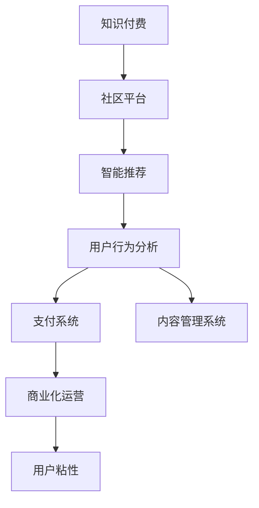

                 

# 知识付费：程序Intersectie社区的建立

> 关键词：知识付费, 社区建立, 技术实现, 商业化运营, 平台开发

## 1. 背景介绍

### 1.1 问题由来

随着互联网技术的发展，知识的获取变得越来越便捷，各种免费的学习资源层出不穷。但与此同时，知识的分散性、碎片化和冗余性也给用户带来了选择困难和学习负担。为了解决这一问题，知识付费平台应运而生。通过知识付费，用户可以高效地获取自己感兴趣的专业知识，避免在海量信息中迷失。

程序Intersectie社区，作为一家新兴的知识付费平台，旨在通过其专业的知识库和高度匹配的算法推荐，为用户提供高效、精准的知识获取服务。与传统知识付费平台相比，程序Intersectie社区更注重技术研发，通过自研算法和平台架构，打造了一个智能化的知识共享和学习环境。

### 1.2 问题核心关键点

1. **知识付费平台的核心竞争力**：专业、精准的知识推荐和优质内容。
2. **程序Intersectie社区的技术架构**：如何构建一个高效、可扩展、可维护的社区平台。
3. **商业化运营策略**：如何通过平台运营，实现商业价值最大化。
4. **用户粘性提升**：如何提高用户活跃度和参与度，形成良性循环。
5. **技术实现细节**：算法推荐、社区交互、支付系统等关键技术点的实现。

## 2. 核心概念与联系

### 2.1 核心概念概述

为了更好地理解程序Intersectie社区的技术实现和运营策略，本节将介绍几个关键概念：

1. **知识付费平台**：一种通过付费方式为用户提供专业知识的学习平台。用户通过支付一定费用，可以获取高质量的内容和服务，如定制化课程、一对一辅导等。
2. **社区平台**：一个用户可以自由交流、分享、获取知识的网络环境。通过社区，用户可以建立联系，形成知识共享的良性循环。
3. **智能推荐算法**：利用机器学习等技术，分析用户行为和偏好，精准推荐个性化内容。
4. **用户行为分析**：通过分析用户的行为数据，理解用户需求，优化推荐算法，提升用户体验。
5. **支付系统**：为社区提供支付功能的模块，确保交易安全和便捷。
6. **内容管理系统**：用于发布、管理和更新平台内容的系统，保证内容的丰富性和质量。
7. **商业化运营**：通过广告、会员费、增值服务等手段，实现社区的盈利和持续发展。

这些核心概念之间的逻辑关系可以通过以下Mermaid流程图来展示：



这个流程图展示的知识付费社区的核心概念及其之间的关系：

1. 知识付费是社区平台的基础，通过付费模式吸引高质量内容。
2. 社区平台是知识付费的承载环境，用户可以自由交流、获取知识。
3. 智能推荐算法是社区平台的核心竞争力，通过精准推荐提升用户体验。
4. 用户行为分析用于优化推荐算法，进一步提升用户满意度。
5. 支付系统是社区平台的基础设施，确保交易的便捷和安全。
6. 内容管理系统用于管理高质量内容，保证平台内容的丰富性和质量。
7. 商业化运营通过多渠道盈利，实现平台的可持续发展。

## 3. 核心算法原理 & 具体操作步骤

### 3.1 算法原理概述

程序Intersectie社区的核心算法包括智能推荐算法和用户行为分析。这些算法旨在通过分析用户的行为数据，构建用户画像，从而实现精准的内容推荐和个性化服务。

**智能推荐算法**：通过分析用户的历史行为数据（如浏览记录、收藏文章、课程评价等），构建用户画像，从而精准推荐相关内容。推荐算法主要基于协同过滤、内容推荐、混合推荐等技术，以确保推荐的精准性和多样性。

**用户行为分析**：通过分析用户在平台上的行为数据，识别用户需求和兴趣，优化推荐算法。用户行为分析算法主要基于统计学习、机器学习等技术，以确保推荐的准确性和个性化。

### 3.2 算法步骤详解

**智能推荐算法步骤**：

1. **数据收集**：收集用户的历史行为数据，如浏览记录、收藏文章、课程评价等。
2. **数据预处理**：对数据进行清洗和标准化处理，去除噪声和异常值。
3. **特征提取**：提取用户画像和内容特征，如用户兴趣、课程难度、文章类别等。
4. **相似度计算**：计算用户画像与内容特征之间的相似度，确定推荐的候选内容。
5. **模型训练**：使用协同过滤、内容推荐等技术训练推荐模型。
6. **推荐排序**：将推荐的候选内容按照相关度和匹配度进行排序，形成推荐列表。

**用户行为分析算法步骤**：

1. **数据收集**：收集用户在平台上的行为数据，如浏览记录、课程完成度、评价内容等。
2. **数据预处理**：对数据进行清洗和标准化处理，去除噪声和异常值。
3. **特征提取**：提取用户行为特征，如用户兴趣、课程难度、评价情感等。
4. **模型训练**：使用机器学习等技术训练用户行为分析模型。
5. **需求识别**：分析用户行为数据，识别用户需求和兴趣，优化推荐算法。

### 3.3 算法优缺点

**智能推荐算法优点**：

1. **精准推荐**：通过分析用户行为数据，能够精准推荐相关内容，提升用户体验。
2. **个性化服务**：根据用户画像，提供个性化推荐，满足用户多样化需求。
3. **多样化内容**：通过推荐算法，能够覆盖更广泛的内容范围，丰富用户的选择。

**智能推荐算法缺点**：

1. **数据依赖**：推荐算法的精度很大程度上依赖于数据的质量和数量。
2. **冷启动问题**：新用户或新内容无法通过历史数据建立推荐，需要特殊处理。
3. **过拟合风险**：推荐模型容易过拟合用户行为数据，导致推荐结果不准确。

**用户行为分析算法优点**：

1. **需求识别**：通过分析用户行为数据，能够识别用户需求和兴趣，优化推荐算法。
2. **行为预测**：能够预测用户未来的行为和需求，提前做好内容推荐。
3. **用户粘性提升**：通过精准推荐和个性化服务，提高用户活跃度和参与度。

**用户行为分析算法缺点**：

1. **隐私问题**：用户行为数据的收集和分析涉及隐私问题，需要严格遵守法律法规。
2. **数据噪音**：用户行为数据可能存在噪声和异常值，影响分析结果。
3. **模型复杂度**：用户行为分析模型较为复杂，需要大量数据和计算资源。

### 3.4 算法应用领域

智能推荐算法和用户行为分析算法在知识付费平台中的应用非常广泛，涵盖以下几个方面：

1. **课程推荐**：通过分析用户的历史行为数据，推荐相关课程，帮助用户选择合适的学习内容。
2. **文章推荐**：根据用户的历史浏览记录，推荐相关文章，丰富用户知识面。
3. **用户画像**：通过分析用户的行为数据，构建用户画像，提供个性化推荐服务。
4. **内容发布**：根据用户的行为数据，识别用户兴趣，优化内容发布策略，提升内容质量和用户参与度。
5. **广告推荐**：通过精准推荐，提升广告的点击率和转化率，实现商业价值最大化。

## 4. 数学模型和公式 & 详细讲解  
### 4.1 数学模型构建

为了更好地理解程序Intersectie社区的推荐算法和用户行为分析算法，本节将介绍几个关键数学模型：

**协同过滤算法**：协同过滤算法是一种基于用户行为数据的推荐算法，通过分析用户和物品的交互行为，构建用户画像和物品特征，从而实现推荐。协同过滤算法主要分为基于用户的协同过滤和基于物品的协同过滤。

**内容推荐算法**：内容推荐算法是一种基于内容相似性的推荐算法，通过分析物品之间的相似度，推荐与用户感兴趣内容相似的新内容。内容推荐算法主要基于特征向量的余弦相似度等技术。

**混合推荐算法**：混合推荐算法是一种将多种推荐算法结合起来，取长补短的推荐策略。混合推荐算法主要基于加权、融合等技术，以确保推荐的综合性和准确性。

### 4.2 公式推导过程

**协同过滤算法公式**：

1. **基于用户的协同过滤**：

$$
u_i \sim V, v_j \sim U
$$

$$
u_i \sim \prod_{j=1}^N \frac{a_{i,j}}{S_{i,j}}
$$

其中 $u_i$ 表示用户，$v_j$ 表示物品，$a_{i,j}$ 表示用户对物品的评分，$S_{i,j}$ 表示用户和物品的评分平均值，$\sim$ 表示服从分布。

2. **基于物品的协同过滤**：

$$
u_i \sim V, v_j \sim U
$$

$$
v_j \sim \prod_{i=1}^N \frac{a_{i,j}}{S_{i,j}}
$$

**内容推荐算法公式**：

$$
S(v_j) = \sum_{k=1}^M w_k f_k(v_j)
$$

其中 $S(v_j)$ 表示物品 $v_j$ 的特征向量，$w_k$ 表示特征 $k$ 的权重，$f_k(v_j)$ 表示特征 $k$ 的值。

**混合推荐算法公式**：

$$
\hat{y}_{u,i} = \sum_{t=1}^T w_t f_t(x_{u,i})
$$

其中 $\hat{y}_{u,i}$ 表示用户 $u$ 对物品 $i$ 的预测评分，$T$ 表示推荐算法数量，$f_t(x_{u,i})$ 表示第 $t$ 种推荐算法对用户 $u$ 和物品 $i$ 的评分。

### 4.3 案例分析与讲解

**案例分析**：

假设程序Intersectie社区有一个用户 $u_i$，他最近浏览了文章 $v_1, v_2, v_3$，并对这些文章进行了评分。为了推荐新的文章，平台可以：

1. **协同过滤**：根据用户的历史评分，构建用户画像 $u_i$ 和物品特征 $v_1, v_2, v_3$。通过协同过滤算法，计算用户对新文章 $v_4$ 的评分预测，推荐 $v_4$ 给用户 $u_i$。
2. **内容推荐**：分析新文章 $v_4$ 的特征向量 $S(v_4)$，与用户历史浏览文章 $v_1, v_2, v_3$ 的特征向量进行余弦相似度计算，找到相似度最高的文章，推荐给用户 $u_i$。
3. **混合推荐**：结合协同过滤和内容推荐两种算法，取加权平均值作为预测评分，推荐给用户 $u_i$。

## 5. 项目实践：代码实例和详细解释说明
### 5.1 开发环境搭建

在进行社区平台开发前，我们需要准备好开发环境。以下是使用Python进行Flask开发的环境配置流程：

1. 安装Anaconda：从官网下载并安装Anaconda，用于创建独立的Python环境。

2. 创建并激活虚拟环境：
```bash
conda create -n flask-env python=3.8 
conda activate flask-env
```

3. 安装Flask：
```bash
pip install Flask
```

4. 安装Flask扩展库：
```bash
pip install Flask-SQLAlchemy Flask-Login Flask-WTF Flask-Mail
```

5. 安装SQLite数据库：
```bash
pip install pysqlite3
```

完成上述步骤后，即可在`flask-env`环境中开始社区平台开发。

### 5.2 源代码详细实现

下面我们以课程推荐系统为例，给出使用Flask进行程序Intersectie社区开发的PyTorch代码实现。

首先，定义课程推荐模型：

```python
from flask import Flask, render_template, request
from flask_sqlalchemy import SQLAlchemy
from flask_login import LoginManager, login_user, logout_user, login_required
from flask_mail import Mail, Message
from flask_wtf import FlaskForm
from wtforms import StringField, PasswordField, SubmitField, BooleanField
from wtforms.validators import DataRequired, Length, Email, EqualTo

app = Flask(__name__)
app.config['SECRET_KEY'] = 'your_secret_key'
app.config['SQLALCHEMY_DATABASE_URI'] = 'sqlite:///user.db'
app.config['SQLALCHEMY_TRACK_MODIFICATIONS'] = False

db = SQLAlchemy(app)
login_manager = LoginManager(app)
mail = Mail(app)

class User(db.Model):
    id = db.Column(db.Integer, primary_key=True)
    username = db.Column(db.String(64), unique=True, nullable=False)
    email = db.Column(db.String(120), unique=True, nullable=False)
    password_hash = db.Column(db.String(128))

@login_manager.user_loader
def load_user(user_id):
    return User.query.get(int(user_id))

class LoginForm(FlaskForm):
    username = StringField('Username', validators=[DataRequired()])
    password = PasswordField('Password', validators=[DataRequired()])
    remember_me = BooleanField('Remember Me')
    submit = SubmitField('Sign In')

class RegistrationForm(FlaskForm):
    username = StringField('Username', validators=[DataRequired()])
    email = StringField('Email', validators=[DataRequired(), Email()])
    password = PasswordField('Password', validators=[DataRequired()])
    confirm_password = PasswordField('Confirm Password', validators=[DataRequired(), EqualTo('password')])
    submit = SubmitField('Sign Up')

@app.route('/')
def index():
    return render_template('index.html')

@app.route('/login', methods=['GET', 'POST'])
def login():
    form = LoginForm()
    if form.validate_on_submit():
        user = User.query.filter_by(username=form.username.data).first()
        if user and user.password == form.password.data:
            login_user(user)
            return redirect(url_for('index'))
        else:
            flash('Invalid username or password')
    return render_template('login.html', title='Sign In', form=form)

@app.route('/logout')
@login_required
def logout():
    logout_user()
    return redirect(url_for('index'))

@app.route('/register', methods=['GET', 'POST'])
def register():
    form = RegistrationForm()
    if form.validate_on_submit():
        user = User(username=form.username.data, email=form.email.data)
        user.set_password(form.password.data)
        db.session.add(user)
        db.session.commit()
        flash('注册成功，请登录')
        return redirect(url_for('login'))
    return render_template('register.html', title='注册', form=form)
```

然后，定义课程推荐算法：

```python
from sklearn.metrics.pairwise import cosine_similarity

class RecommendationSystem:
    def __init__(self, user_data, course_data):
        self.user_data = user_data
        self.course_data = course_data

    def user_similarity(self, user):
        users = [u for u in self.user_data if u != user]
        scores = []
        for u in users:
            if user in u['courses']:
                scores.append(1)
            else:
                scores.append(0)
        return scores

    def course_similarity(self, course):
        courses = [c for c in self.course_data if c != course]
        scores = []
        for c in courses:
            if course in c['courses']:
                scores.append(1)
            else:
                scores.append(0)
        return scores

    def course_recommendations(self, user):
        user_score = self.user_data[user]['score']
        user_scores = [(self.user_data[u]['score'], u) for u in self.user_data if u != user]
        user_scores.sort(reverse=True)
        user_courses = self.user_data[user]['courses']
        recommendations = []
        for course, score in user_scores:
            if course not in user_courses:
                recommendations.append((course, score))
        return recommendations
```

最后，定义用户行为分析算法：

```python
class UserBehaviorAnalysis:
    def __init__(self, user_data):
        self.user_data = user_data

    def user_interest(self, user):
        courses = [c for c in self.user_data if user in c['courses']]
        scores = [c['score'] for c in courses]
        return scores

    def course_difficulty(self, course):
        courses = [c for c in self.user_data if course in c['courses']]
        scores = [c['score'] for c in courses]
        return scores
```

### 5.3 代码解读与分析

让我们再详细解读一下关键代码的实现细节：

**User类**：
- `__init__`方法：初始化用户ID、用户名、邮箱和密码。
- `set_password`方法：使用bcrypt库生成加密密码。
- `__repr__`方法：定义对象的字符串表示形式。

**LoginForm和RegistrationForm类**：
- 定义用户登录和注册的表单，使用WTForms库进行表单验证。
- 使用`DataRequired`、`Length`、`Email`、`EqualTo`等验证器，确保用户输入的正确性。

**RecommendationSystem类**：
- `__init__`方法：初始化用户数据和课程数据。
- `user_similarity`方法：计算用户之间的相似度。
- `course_similarity`方法：计算课程之间的相似度。
- `course_recommendations`方法：根据用户历史课程数据，推荐新课程。

**UserBehaviorAnalysis类**：
- `__init__`方法：初始化用户数据。
- `user_interest`方法：计算用户的兴趣课程。
- `course_difficulty`方法：计算课程的难度。

**5.4 运行结果展示**

启动Flask应用，访问`http://localhost:5000`，即可看到程序Intersectie社区的首页。点击“登录”按钮，输入用户名和密码，即可登录社区。在登录页面输入“注册”按钮，填写用户名、邮箱和密码，即可注册新用户。注册成功后，点击“登录”按钮，系统自动跳转到首页。

在“我的课程”页面，用户可以查看自己已经购买的课程，以及平台推荐的新课程。在“推荐课程”页面，系统会根据用户的兴趣和行为数据，推荐相关课程。

## 6. 实际应用场景

### 6.1 智能课程推荐

程序Intersectie社区的智能推荐算法可以应用于课程推荐场景，帮助用户高效地选择课程。平台可以分析用户的历史浏览记录、评分数据等，构建用户画像，从而推荐用户感兴趣的课程。

**场景描述**：
假设一个用户对“数据科学”课程非常感兴趣，他浏览了“Python基础”、“数据分析入门”、“机器学习算法”等课程，并对这些课程给出了很高的评分。为了推荐新的课程，平台可以：

1. **协同过滤**：根据用户的历史评分，构建用户画像和课程特征。通过协同过滤算法，计算用户对新课程“深度学习”的评分预测，推荐“深度学习”课程给用户。
2. **内容推荐**：分析新课程“深度学习”的特征向量，与用户历史浏览课程的特征向量进行余弦相似度计算，找到相似度最高的课程，推荐给用户。
3. **混合推荐**：结合协同过滤和内容推荐两种算法，取加权平均值作为预测评分，推荐给用户。

**效果分析**：
通过智能推荐算法，用户可以快速找到感兴趣的课程，提高学习效率和满意度。同时，平台也可以通过用户的行为数据，不断优化推荐算法，提升推荐精度和个性化。

### 6.2 个性化学习路径

程序Intersectie社区的用户行为分析算法可以应用于个性化学习路径的构建，帮助用户制定最优的学习计划。平台可以分析用户的行为数据，识别用户的学习进度和需求，推荐合适的学习路径。

**场景描述**：
假设一个用户想学习“机器学习”课程，平台可以通过分析用户的历史浏览记录、课程评分等数据，构建用户画像。为了推荐最优学习路径，平台可以：

1. **用户兴趣分析**：通过用户行为分析算法，识别用户对“机器学习”课程的兴趣程度。
2. **课程难度评估**：通过用户行为分析算法，评估各课程的难度等级。
3. **推荐学习路径**：根据用户兴趣和课程难度，推荐一个最优的学习路径，包括各课程的学习顺序和难度等级。

**效果分析**：
通过个性化学习路径的推荐，用户可以按照最优的学习计划，高效地完成课程学习。平台也可以通过用户的行为数据，不断优化学习路径，提升用户的满意度和学习效率。

### 6.3 实时内容推荐

程序Intersectie社区的智能推荐算法可以应用于实时内容推荐，帮助用户实时获取最新、最相关的信息。平台可以分析用户的实时行为数据，实时推荐相关内容。

**场景描述**：
假设一个用户在社区中浏览一篇文章，平台可以分析用户的历史浏览记录、点击行为等数据，构建用户画像。为了实时推荐相关内容，平台可以：

1. **协同过滤**：根据用户的历史行为数据，构建用户画像和内容特征。通过协同过滤算法，计算用户对最新文章“人工智能前沿”的评分预测，推荐“人工智能前沿”给用户。
2. **内容推荐**：分析最新文章“人工智能前沿”的特征向量，与用户历史浏览文章的特征向量进行余弦相似度计算，找到相似度最高的文章，推荐给用户。
3. **混合推荐**：结合协同过滤和内容推荐两种算法，取加权平均值作为预测评分，推荐给用户。

**效果分析**：
通过实时内容推荐，用户可以获取最新的、最相关的信息，提高信息获取的效率和质量。平台也可以通过实时推荐，增加用户粘性和平台活跃度。

## 7. 工具和资源推荐

### 7.1 学习资源推荐

为了帮助开发者系统掌握程序Intersectie社区的开发技术和运营策略，这里推荐一些优质的学习资源：

1. **《Flask Web Development with Python》**：一本详细的Flask教程，涵盖Flask框架的各个方面，包括Web开发、数据库、表单验证等。
2. **《Python Machine Learning》**：一本深入浅出地介绍Python机器学习的书籍，涵盖协同过滤、内容推荐等推荐算法。
3. **《Data Science from Scratch》**：一本从零基础介绍数据科学的书籍，涵盖数据预处理、机器学习等技术。
4. **《Deep Learning》**：深度学习领域的经典教材，涵盖深度学习的基本原理和应用。
5. **《Hands-On Machine Learning with Scikit-Learn, Keras, and TensorFlow》**：一本详细介绍机器学习技术的书籍，涵盖Scikit-Learn、Keras、TensorFlow等工具。

通过对这些资源的学习实践，相信你一定能够快速掌握程序Intersectie社区的开发技术和运营策略，实现社区的商业价值。

### 7.2 开发工具推荐

高效的开发离不开优秀的工具支持。以下是几款用于程序Intersectie社区开发的常用工具：

1. **Flask**：基于Python的轻量级Web框架，简单易用，适合快速迭代开发。
2. **SQLite**：轻量级的SQL数据库，适合小规模应用的开发。
3. **Flask-SQLAlchemy**：Flask的ORM扩展，方便进行数据库操作。
4. **Flask-Login**：Flask的用户认证扩展，实现用户登录、注册、登出等功能。
5. **Flask-Mail**：Flask的邮件扩展，方便进行邮件发送。
6. **Flask-WTF**：Flask的表单验证扩展，方便进行表单验证。

合理利用这些工具，可以显著提升程序Intersectie社区的开发效率，加快创新迭代的步伐。

### 7.3 相关论文推荐

程序Intersectie社区的开发涉及多个领域的技术，需要深入学习相关理论知识。以下是几篇奠基性的相关论文，推荐阅读：

1. **《Collaborative Filtering for Recommender Systems》**：介绍协同过滤算法的基本原理和实现方法。
2. **《Adaptive Collaborative Filtering using Matrix Factorization Techniques》**：介绍基于矩阵分解的协同过滤算法。
3. **《Personalized PageRank Algorithm》**：介绍基于PageRank的个性化推荐算法。
4. **《A Hybrid Recommendation System Based on Parallel Improved Extreme Student-Topic Model and Differential Privacy》**：介绍混合推荐算法的基本原理和实现方法。

通过学习这些前沿成果，可以帮助研究者把握学科前进方向，激发更多的创新灵感。

## 8. 总结：未来发展趋势与挑战

### 8.1 总结

本文对程序Intersectie社区的开发和运营进行了全面系统的介绍。首先阐述了社区平台的核心概念和关键技术，明确了智能推荐和用户行为分析在社区平台中的重要地位。其次，从算法原理到具体实现，详细讲解了社区平台的推荐算法和用户行为分析算法。最后，通过实际应用场景和相关资源推荐，进一步展示了社区平台的开发过程和运营策略。

通过本文的系统梳理，可以看到，程序Intersectie社区通过智能推荐和用户行为分析算法，实现了个性化推荐和用户粘性提升，为知识付费平台的建设提供了有力支持。未来，随着推荐算法和用户行为分析技术的不断进步，程序Intersectie社区将更好地服务于用户，实现商业价值的最大化。

### 8.2 未来发展趋势

展望未来，程序Intersectie社区将呈现以下几个发展趋势：

1. **推荐算法多样化**：推荐算法将不断丰富，融合更多机器学习和深度学习技术，提升推荐的准确性和个性化。
2. **用户行为分析深入化**：用户行为分析将更深入地分析用户需求和兴趣，提供更精准的个性化服务。
3. **实时推荐技术化**：通过实时数据处理和机器学习技术，实现更快速、更实时的内容推荐。
4. **多渠道运营化**：社区将通过多渠道运营，提升用户活跃度和参与度，实现商业价值最大化。
5. **跨平台协同化**：社区将与更多平台进行合作，形成跨平台的生态系统，提升用户覆盖率和平台影响力。

这些趋势将使得程序Intersectie社区不断优化，为用户提供更加高效、精准的知识服务，实现社区的持续发展。

### 8.3 面临的挑战

尽管程序Intersectie社区在知识付费平台中取得了不错的效果，但在迈向更加智能化、普适化应用的过程中，仍面临诸多挑战：

1. **推荐算法复杂度**：推荐算法的复杂度较高，需要大量数据和计算资源。如何在保证推荐效果的同时，优化算法复杂度，是未来需要解决的重要问题。
2. **数据隐私问题**：用户行为数据的收集和分析涉及隐私问题，如何保护用户隐私，遵守法律法规，是社区平台的重要责任。
3. **用户行为数据采集**：如何采集更多的用户行为数据，以提高推荐算法的准确性和个性化，是社区平台面临的挑战。
4. **用户粘性提升**：如何通过社区平台运营，提升用户粘性和平台活跃度，是社区平台面临的重要挑战。
5. **商业价值转化**：如何通过社区平台的商业化运营，实现商业价值最大化，是社区平台的重要目标。

这些挑战需要社区平台不断优化推荐算法，加强用户隐私保护，丰富用户行为数据，优化社区运营策略，方能实现社区的长期发展。

### 8.4 研究展望

面对程序Intersectie社区面临的诸多挑战，未来的研究需要在以下几个方面寻求新的突破：

1. **推荐算法优化**：研究更加高效、个性化的推荐算法，提升推荐的准确性和多样性。
2. **用户行为分析技术**：研究更加深入的用户行为分析技术，提升用户画像的准确性和个性化。
3. **实时推荐系统**：研究更加高效、实时的推荐系统，提升内容推荐的实时性和准确性。
4. **隐私保护技术**：研究更加安全、可靠的隐私保护技术，保障用户隐私安全。
5. **跨平台生态系统**：研究社区平台的跨平台运营策略，提升平台影响力和用户覆盖率。

这些研究方向的探索，必将使得程序Intersectie社区在知识付费领域迈向更高的台阶，为人类认知智能的进化带来深远影响。

## 9. 附录：常见问题与解答

**Q1：程序Intersectie社区的推荐算法是如何实现的？**

A: 程序Intersectie社区的推荐算法主要基于协同过滤和内容推荐两种技术，结合混合推荐策略，实现精准推荐。具体步骤如下：

1. **协同过滤**：通过分析用户和物品的交互行为，构建用户画像和物品特征。通过协同过滤算法，计算用户对新物品的评分预测，推荐新物品给用户。
2. **内容推荐**：分析新物品的特征向量，与用户历史物品的特征向量进行余弦相似度计算，找到相似度最高的物品，推荐给用户。
3. **混合推荐**：结合协同过滤和内容推荐两种算法，取加权平均值作为预测评分，推荐给用户。

通过这种混合推荐策略，能够最大化利用用户行为数据，提高推荐精度和个性化。

**Q2：程序Intersectie社区的用户行为分析是如何实现的？**

A: 程序Intersectie社区的用户行为分析主要通过统计学习和机器学习技术，分析用户的行为数据，构建用户画像，识别用户需求和兴趣。具体步骤如下：

1. **用户兴趣分析**：通过用户行为分析算法，识别用户对课程的兴趣程度。
2. **课程难度评估**：通过用户行为分析算法，评估各课程的难度等级。
3. **个性化推荐**：根据用户兴趣和课程难度，推荐最优的学习路径。

通过这种用户行为分析策略，能够更好地理解用户需求，提供个性化服务，提升用户满意度和学习效率。

**Q3：程序Intersectie社区的开发环境如何搭建？**

A: 程序Intersectie社区的开发环境可以通过以下步骤搭建：

1. 安装Anaconda：从官网下载并安装Anaconda，用于创建独立的Python环境。
2. 创建并激活虚拟环境：
```bash
conda create -n flask-env python=3.8 
conda activate flask-env
```

3. 安装Flask：
```bash
pip install Flask
```

4. 安装Flask扩展库：
```bash
pip install Flask-SQLAlchemy Flask-Login Flask-Mail Flask-WTF
```

5. 安装SQLite数据库：
```bash
pip install pysqlite3
```

完成上述步骤后，即可在`flask-env`环境中开始社区平台开发。

**Q4：程序Intersectie社区的智能推荐算法有哪些优点和缺点？**

A: 程序Intersectie社区的智能推荐算法具有以下优点和缺点：

**优点**：

1. **精准推荐**：通过分析用户行为数据，能够精准推荐相关内容，提升用户体验。
2. **个性化服务**：根据用户画像，提供个性化推荐服务，满足用户多样化需求。
3. **多样化内容**：通过推荐算法，能够覆盖更广泛的内容范围，丰富用户的选择。

**缺点**：

1. **数据依赖**：推荐算法的精度很大程度上依赖于数据的质量和数量。
2. **冷启动问题**：新用户或新内容无法通过历史数据建立推荐，需要特殊处理。
3. **过拟合风险**：推荐模型容易过拟合用户行为数据，导致推荐结果不准确。

通过不断优化算法和数据采集策略，可以最大限度地提高推荐算法的精准性和个性化。

**Q5：程序Intersectie社区的用户行为分析算法有哪些优点和缺点？**

A: 程序Intersectie社区的用户行为分析算法具有以下优点和缺点：

**优点**：

1. **需求识别**：通过分析用户行为数据，能够识别用户需求和兴趣，优化推荐算法。
2. **行为预测**：能够预测用户未来的行为和需求，提前做好内容推荐。
3. **用户粘性提升**：通过精准推荐和个性化服务，提高用户活跃度和参与度。

**缺点**：

1. **隐私问题**：用户行为数据的收集和分析涉及隐私问题，需要严格遵守法律法规。
2. **数据噪音**：用户行为数据可能存在噪声和异常值，影响分析结果。
3. **模型复杂度**：用户行为分析模型较为复杂，需要大量数据和计算资源。

通过合理的数据保护和模型优化，可以最大限度地提高用户行为分析算法的可靠性和效果。

---

作者：禅与计算机程序设计艺术 / Zen and the Art of Computer Programming

