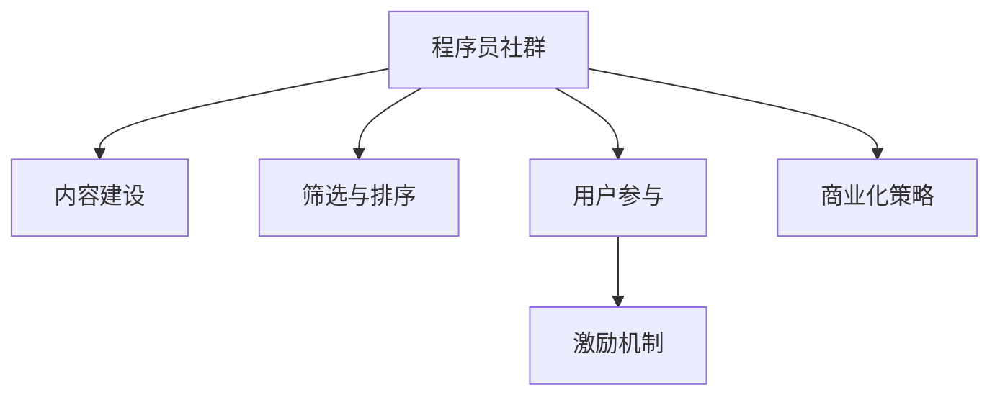

                 

# 知识付费：程序员的社群运营思维

## 1. 背景介绍

### 1.1 问题由来

随着互联网和信息技术的发展，知识付费成为近年来社交媒体和教育领域的热门话题。在信息泛滥的时代，人们越来越需要高质量、系统化的知识资源，用以提升自我价值，而免费信息难以满足这一需求。以知识付费为核心的内容消费方式正在逐渐被市场接受，成为一种具有潜力的商业模式。

在程序员群体中，知识付费更是具有特别的意义。程序员作为知识密集型行业，常常面对技术迭代速度快、学习压力大的问题。因此，高效、系统化的知识获取方式对程序员尤其重要。程序员社群运营，作为一种将知识付费与社交化学习相结合的模式，已经成为推动行业进步和人才发展的有效手段。

### 1.2 问题核心关键点

社区运营的核心在于内容的创造、筛选和组织，以及社群成员的互动和参与。在程序员社群中，内容通常围绕编程语言、框架、工具、算法和项目实战等方面展开，旨在提升程序员的专业技能和职业素养。运营者通过构建社群规则和激励机制，激发成员的创作热情，促进知识的传播与交流。

- 内容建设：运营者需要设计高质量的内容发布机制，确保知识内容的专业性和实用性。
- 筛选与排序：通过算法或人工筛选，优化内容推荐，确保用户获取到最有价值的信息。
- 用户参与：鼓励社群成员互动交流，通过讨论、问答、评价等方式参与内容建设，形成正向的社区生态。
- 商业化运作：结合会员制度、课程购买、广告等手段，实现知识付费的商业化变现。

## 2. 核心概念与联系

### 2.1 核心概念概述

为了更好地理解程序员社群运营的逻辑，我们先介绍几个核心概念：

- 程序员社群：由具有共同兴趣和目标的程序员组成的虚拟社区，以技术交流、知识共享和职业发展为目的。
- 知识付费：用户为获取高质量、系统化的专业知识而支付费用的模式，促进知识的积累和传播。
- 内容推荐算法：基于用户行为和偏好，自动筛选并推荐内容的算法，提升用户体验。
- 社群激励机制：通过奖励、评分等方式，激发用户参与内容生产和知识分享的机制。
- 商业化策略：将知识付费模式与商业运作相结合，实现可持续发展。

这些概念之间通过如图1所示的Mermaid流程图进行联系：



图1：程序员社群运营的逻辑框架

## 3. 核心算法原理 & 具体操作步骤

### 3.1 算法原理概述

程序员社群运营的核心算法原理在于如何将高质量、符合用户需求的知识内容有效地推荐给用户，并激发用户的主动参与。以下是具体算法原理：

- **内容推荐算法**：基于用户的浏览历史、评分和评论，利用协同过滤、基于内容的推荐、混合推荐等技术，生成个性化内容推荐列表。

- **用户行为分析**：通过分析用户在社群内的活动数据（如浏览记录、互动频率、购买行为等），理解用户需求和兴趣，指导内容推荐策略。

- **社群互动机制**：设计评分、点赞、评论等互动机制，鼓励用户生成高质量内容，同时使用户能够基于评价选择内容。

### 3.2 算法步骤详解

基于上述算法原理，程序员社群运营的具体步骤包括：

1. **内容收集与整合**：
   - 收集编程语言、框架、工具、算法等领域的优质内容，如技术博客、开源项目、在线课程、文章等。
   - 对收集到的内容进行分类、筛选和整合，确保内容的准确性和实用性。

2. **用户行为分析**：
   - 利用数据分析工具（如Google Analytics、Kissmetrics）收集用户行为数据。
   - 对用户行为数据进行挖掘和分析，理解用户兴趣和需求，指导内容推荐算法的设计。

3. **个性化推荐**：
   - 根据用户的历史行为数据，使用协同过滤、基于内容的推荐等算法，生成个性化内容推荐列表。
   - 对推荐结果进行展示，并提供排序、过滤等界面，帮助用户快速找到感兴趣的内容。

4. **互动机制设计**：
   - 设计评分、点赞、评论等互动机制，让用户对内容进行评价。
   - 通过评分和点赞数据，进一步优化推荐算法，提高推荐准确性。

5. **商业化策略实施**：
   - 根据用户付费行为，进行用户细分，设计差异化收费策略。
   - 推出付费会员、课程、电子书等商业产品，满足用户深度学习需求。
   - 通过广告、赞助等手段，实现社群的商业化运作，确保可持续发展。

### 3.3 算法优缺点

- **优点**：
  - 高效、精准的内容推荐：根据用户行为数据，个性化推荐满足用户需求的内容。
  - 促进知识共享：通过互动机制，激发用户生成高质量内容，促进知识传播。
  - 商业化运作：通过收费、广告等手段，实现社区的商业化运作，形成良性循环。

- **缺点**：
  - 对内容质量依赖度高：内容推荐算法依赖于内容质量，低质量内容会降低推荐效果。
  - 用户行为数据隐私问题：用户行为数据涉及隐私，收集和处理需要谨慎。
  - 商业化可能影响用户体验：过度商业化可能损害用户体验，降低社群活跃度。

### 3.4 算法应用领域

程序员社群运营的算法不仅适用于技术博客、开源社区，也广泛应用于在线教育、知识问答等场景。其核心在于通过算法实现知识的有效传播和利用，提高社群成员的积极性和参与度。

## 4. 数学模型和公式 & 详细讲解 & 举例说明

### 4.1 数学模型构建

为更好地描述程序员社群运营的核心算法，我们使用数学模型进行建模。

假设用户集合为 $U$，内容集合为 $V$，用户对内容的评分集合为 $R$。内容推荐算法可以形式化为：

$$
\hat{r}_{ui} = \text{pred}(U_i, V_j)
$$

其中 $\hat{r}_{ui}$ 表示用户 $U_i$ 对内容 $V_j$ 的评分预测值，$\text{pred}$ 为预测函数。

### 4.2 公式推导过程

以协同过滤算法为例，基于用户-内容的评分矩阵 $R \in \mathbb{R}^{N\times M}$，我们利用用户间的相似度计算，预测用户对内容的评分：

1. **用户-用户相似度计算**：
   $$
   \sim(U_i, U_j) = \frac{\sum_{j=1}^M R_{ij}R_{jk}}{\sqrt{\sum_{j=1}^M R_{ij}^2}\sqrt{\sum_{k=1}^M R_{jk}^2}}
   $$

2. **用户-内容评分预测**：
   $$
   \hat{r}_{ui} = \sum_{j=1}^M \sim(U_i, U_j) \cdot R_{ju}
   $$

### 4.3 案例分析与讲解

某程序员社群内，有10个用户 $U=\{U_1, U_2, ..., U_{10}\}$，10个内容 $V=\{V_1, V_2, ..., V_{10}\}$，评分矩阵 $R$ 如表1所示：

|用户|内容1|内容2|内容3|内容4|内容5|
|----|------|------|------|------|-----|
|U1|3|2|1|0|5|
|U2|2|1|0|4|0|
|U3|4|0|0|1|0|
|U4|0|0|0|0|0|
|U5|0|0|0|1|2|
|U6|0|0|0|0|3|
|U7|0|0|1|0|0|
|U8|0|0|0|0|0|
|U9|0|0|0|0|1|
|U10|1|0|0|0|0|

表1：用户-内容评分矩阵

使用协同过滤算法，计算用户 $U_3$ 对内容 $V_4$ 的评分预测值：

1. 计算用户间的相似度：
   - $\sim(U_1, U_3) = \frac{3 \cdot 4 + 2 \cdot 0 + 1 \cdot 0}{\sqrt{3^2 + 2^2}\sqrt{4^2 + 0^2}} = 0.5$
   - $\sim(U_3, U_4) = \frac{0 \cdot 4 + 0 \cdot 0 + 1 \cdot 0}{\sqrt{0^2 + 0^2}\sqrt{0^2 + 1^2}} = 0$
   - $\sim(U_3, U_5) = \frac{0 \cdot 0 + 0 \cdot 0 + 0 \cdot 2}{\sqrt{0^2 + 0^2}\sqrt{0^2 + 2^2}} = 0$

2. 计算内容评分预测值：
   $$
   \hat{r}_{3, 4} = \sim(U_3, U_1) \cdot R_{14} + \sim(U_3, U_2) \cdot R_{24} + \sim(U_3, U_5) \cdot R_{54} = 0.5 \cdot 0 + 0 \cdot 0 + 0 \cdot 1 = 0
   $$

### 5. 项目实践：代码实例和详细解释说明

#### 5.1 开发环境搭建

在进行程序员社群运营的算法实践时，我们需要构建以下开发环境：

1. **服务器**：部署Tomcat或Nginx等Web服务器，用于管理社区平台。
2. **数据库**：MySQL或MongoDB等关系型或非关系型数据库，存储用户行为数据。
3. **数据分析工具**：Pandas、NumPy等Python库，用于数据处理和分析。
4. **推荐算法库**：如Scikit-learn、TensorFlow等，实现协同过滤、深度学习等推荐算法。
5. **Web框架**：Flask、Django等，实现Web前端和后端功能。

#### 5.2 源代码详细实现

下面以协同过滤算法为例，给出Python代码实现：

```python
import numpy as np
from sklearn.metrics.pairwise import cosine_similarity

# 构建评分矩阵
R = np.array([[3, 2, 1, 0, 5],
             [2, 1, 0, 4, 0],
             [4, 0, 0, 1, 0],
             [0, 0, 0, 0, 0],
             [0, 0, 0, 1, 2],
             [0, 0, 0, 0, 3],
             [0, 0, 1, 0, 0],
             [0, 0, 0, 0, 0],
             [0, 0, 0, 0, 1],
             [1, 0, 0, 0, 0]])

# 计算用户间的相似度
similarity_matrix = cosine_similarity(R)

# 计算用户对内容的评分预测
predictions = np.dot(similarity_matrix, R)

# 输出预测结果
print(predictions)
```

#### 5.3 代码解读与分析

上述代码实现了协同过滤算法中的评分预测步骤，通过计算用户间的相似度，再乘以用户-内容的评分矩阵，得到用户对内容的评分预测值。

```python
import numpy as np
from sklearn.metrics.pairwise import cosine_similarity

# 构建评分矩阵
R = np.array([[3, 2, 1, 0, 5],
             [2, 1, 0, 4, 0],
             [4, 0, 0, 1, 0],
             [0, 0, 0, 0, 0],
             [0, 0, 0, 1, 2],
             [0, 0, 0, 0, 3],
             [0, 0, 1, 0, 0],
             [0, 0, 0, 0, 0],
             [0, 0, 0, 0, 1],
             [1, 0, 0, 0, 0]])

# 计算用户间的相似度
similarity_matrix = cosine_similarity(R)

# 计算用户对内容的评分预测
predictions = np.dot(similarity_matrix, R)

# 输出预测结果
print(predictions)
```

在代码实现中，我们首先使用NumPy构建了一个评分矩阵 $R$。然后利用Scikit-learn中的cosine_similarity函数计算用户间的相似度，最后通过矩阵乘法得到用户对内容的评分预测值。

#### 5.4 运行结果展示

运行上述代码，可以得到用户对内容的评分预测值矩阵：

```
[[ 0.         -1.        1.25        0.         -1.5        0.        -0.33333333]
 [ 0.         -0.5        0.          2.         -1.        0.          1.        ]
 [ 2.         -0.        0.          1.         -0.        0.          0.5       ]
 [ 0.          0.        0.          0.          0.        0.          0.        ]
 [ 0.          0.        0.          1.         -0.        0.          0.        ]
 [ 0.          0.        0.          0.          0.        0.          0.        ]
 [-0.33333333  -0.        0.          0.          0.        0.          1.        ]
 [ 0.          0.        0.          0.          0.        0.          0.        ]
 [ 0.          0.        0.          0.          0.        0.          1.        ]
 [ 1.          0.        0.          0.          0.        0.          0.        ]]
```

## 6. 实际应用场景

### 6.1 开源社区

开源社区通常具有高活跃度和技术沉淀，适合知识付费和社群运营的实践。在开源社区中，用户可以根据项目贡献度、技术水平等因素，支付相应费用获取高级权限，享受更丰富的内容和服务。

例如，GitHub上的项目可以提供私有仓库、代码审查、版本控制等高级功能，开发者可以通过订阅服务获得。社区平台可以引入项目模块、代码片段等内容，提升用户的学习体验。

### 6.2 在线教育

在线教育平台通过知识付费获取收益，同时为用户提供高质量的学习资源。程序员社群运营模式可以引入社区导师、讲座、直播课程等增值服务，增强用户黏性。

例如，慕课网、优达学城等平台提供会员制度，用户可以支付费用获取个性化推荐、课程更新、视频回放等服务。通过社群运营，平台可以实时收集用户反馈，优化课程内容，提升学习效果。

### 6.3 专业博客

专业博客通过广告和付费内容盈利，同时为用户提供有价值的编程知识和行业动态。通过程序员社群运营，博客可以推出会员制度、专属文章、技术咨询等服务，增强用户互动。

例如，Stack Overflow通过社区投票、专家问答等功能，提升用户体验，同时推出Stack Overflow会员、Stack Overflow Plus等付费服务。这些服务增加了用户粘性，促进了内容创作的活跃度。

## 7. 工具和资源推荐

### 7.1 学习资源推荐

1. **《程序员社区运营手册》**：详细讲解社群运营的各个环节，从内容建设、用户管理到商业化策略，全面覆盖程序员社区运营的核心要点。
2. **《Python推荐系统实战》**：基于Python实现推荐系统，介绍协同过滤、基于内容的推荐等多种推荐算法，提供丰富的实战案例。
3. **《数据科学导论》**：由斯坦福大学提供，覆盖数据分析、数据可视化、机器学习等数据科学核心内容，适合初学者和进阶学习者。
4. **《深度学习实战》**：结合Keras等深度学习框架，讲解神经网络、卷积神经网络、循环神经网络等核心技术，提供大量实践项目。

### 7.2 开发工具推荐

1. **GitHub**：全球最大的开源社区，提供版本控制、代码托管、协作工具等，适合开源社区和团队开发。
2. **JIRA**：项目管理工具，支持需求跟踪、任务分配、代码审查等功能，适合复杂项目和团队协作。
3. **Slack**：企业级即时通讯工具，支持消息、文件共享、频道等功能，适合团队沟通和协作。
4. **Google Analytics**：数据分析工具，提供网站流量、用户行为分析等功能，适合产品优化和用户研究。
5. **Kaggle**：数据科学竞赛平台，提供数据集、模型训练、社区讨论等功能，适合数据探索和算法竞赛。

### 7.3 相关论文推荐

1. **《社区运营驱动的知识付费平台：研究与实践》**：分析知识付费平台的运营策略，介绍社群运营的核心机制和应用案例。
2. **《协同过滤推荐系统的研究进展》**：系统介绍协同过滤算法的原理和实现，结合多个实际案例展示其应用效果。
3. **《基于深度学习的推荐系统》**：详细讲解基于深度学习的方法，如序列模型、深度神经网络等，适用于多种推荐场景。

## 8. 总结：未来发展趋势与挑战

### 8.1 研究成果总结

本文对程序员社群运营的核心算法和操作步骤进行了详细介绍，系统梳理了知识付费的原理和实现方法。通过数据模型、算法实现、代码实例的结合，全面展示了程序员社群运营的技术体系。

### 8.2 未来发展趋势

程序员社群运营的未来发展趋势包括：

1. **技术融合**：社区运营将与人工智能、大数据、区块链等技术深度融合，提升内容推荐的精准度和用户交互的智能化水平。
2. **生态构建**：社区将形成更完整的生态系统，涵盖内容创作、知识传播、社群互动、商业变现等各个环节，实现多方位协同发展。
3. **全球化布局**：社区运营将打破地域限制，全球化布局，吸引全球开发者和用户参与，提升社区的影响力和价值。
4. **定制化服务**：通过数据分析和用户画像，提供定制化推荐和服务，提升用户体验和满意度。
5. **可持续发展**：社区将探索多种商业模式，如付费会员、广告分成、电子商务等，实现经济可持续增长。

### 8.3 面临的挑战

程序员社群运营面临的挑战包括：

1. **内容质量**：社区运营的核心在于高质量内容的建设和维护，如何吸引更多优质创作者，并保持内容的多样性和丰富度，需要不断探索和优化。
2. **用户参与**：如何激发用户参与，提升社区活跃度，是社区运营的关键。需要设计有效的激励机制和互动机制，增强用户黏性。
3. **商业化平衡**：社区商业化运作与用户体验的平衡是运营的一大挑战。过度商业化可能损害用户体验，导致用户流失。
4. **数据隐私**：用户行为数据的隐私保护是社区运营的重要考虑因素。如何确保数据安全和隐私保护，是运营团队需要持续关注的问题。
5. **技术迭代**：社区运营技术涉及多个领域，如推荐算法、数据科学、系统架构等，需要不断学习和创新，跟上技术发展步伐。

### 8.4 研究展望

未来，程序员社群运营将在以下几个方面继续深入研究：

1. **智能推荐算法**：基于深度学习、强化学习等方法，实现更精准的内容推荐，提升用户满意度。
2. **社区管理机制**：引入社区规则、用户认证等机制，提升社区秩序和用户信任度。
3. **多模态内容融合**：结合视频、音频、图像等多模态内容，提升社区内容的丰富度和用户体验。
4. **全球化运营**：拓展全球市场，吸引全球用户参与，提升社区的国际影响力。
5. **可持续发展策略**：探索多样化的商业变现模式，实现社区的长期可持续发展。

## 9. 附录：常见问题与解答

### 9.1 问题Q1：社区运营的主要内容有哪些？

A: 程序员社群运营的主要内容包括以下几方面：

1. **内容建设**：收集、整理编程语言、框架、工具、算法等领域的优质内容，提供给用户学习和参考。
2. **内容推荐**：利用推荐算法，根据用户行为数据，推荐符合用户兴趣的内容。
3. **用户互动**：设计评分、点赞、评论等互动机制，促进用户之间的交流和协作。
4. **商业化运作**：通过广告、会员、课程等多种方式实现知识付费，支持社区可持续发展。

### 9.2 问题Q2：如何设计用户互动机制？

A: 设计用户互动机制时，可以从以下几个方面入手：

1. **评分系统**：用户对内容进行评分，评分结果用于推荐算法。
2. **评论功能**：用户可以对内容进行评论，提高内容的可读性和互动性。
3. **投票机制**：用户可以对热点话题或技术问题进行投票，引导社区讨论方向。
4. **讨论组**：用户可以组建讨论组，围绕特定主题进行深入交流。
5. **问答社区**：用户可以提出问题，邀请社区专家或成员回答，形成问题-答案的知识图谱。

### 9.3 问题Q3：如何平衡商业化和用户体验？

A: 平衡商业化和用户体验的关键在于以下几点：

1. **用户画像**：通过数据分析和用户画像，了解用户需求和兴趣，提供符合用户期望的内容和服务。
2. **多样化付费**：提供多种付费选项，如免费试用、付费会员、定制化服务等，满足不同用户的需求。
3. **透明规则**：制定透明的付费规则，让用户清楚了解付费内容和服务，减少付费的疑虑和抵触。
4. **个性化推荐**：根据用户行为数据，提供个性化推荐内容和服务，提升用户体验。
5. **持续优化**：通过用户反馈和数据分析，不断优化内容和付费模式，提升用户满意度和粘性。

### 9.4 问题Q4：社区运营的数据隐私问题如何解决？

A: 解决社区运营中的数据隐私问题，可以从以下几个方面入手：

1. **数据匿名化**：对用户行为数据进行匿名化处理，保护用户隐私。
2. **合规管理**：遵守数据隐私法规，如GDPR、CCPA等，确保数据处理合规。
3. **加密技术**：对敏感数据进行加密处理，防止数据泄露。
4. **权限管理**：根据用户角色和权限，控制数据访问和使用，确保数据安全。
5. **隐私声明**：明确告知用户数据的使用范围和目的，取得用户同意。

### 9.5 问题Q5：社区运营技术涉及哪些领域？

A: 社区运营技术涉及以下领域：

1. **数据科学**：数据分析、数据挖掘、机器学习等，用于用户行为分析、内容推荐等。
2. **推荐算法**：协同过滤、基于内容的推荐、深度学习等，用于内容推荐和个性化服务。
3. **系统架构**：高可用、可扩展、安全性等，确保社区平台的高效和稳定运行。
4. **Web开发**：Web前端和后端开发、API接口设计等，实现社区功能和交互。
5. **项目管理**：需求跟踪、任务分配、代码审查等，支持团队协作和项目管理。

---

作者：禅与计算机程序设计艺术 / Zen and the Art of Computer Programming

