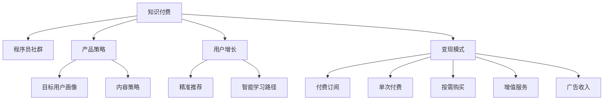

                 

# 知识付费：程序员的社群运营战术

> 关键词：知识付费, 程序员, 社群运营, 产品策略, 用户增长

## 1. 背景介绍

### 1.1 问题由来
知识付费的兴起，为内容创作者和知识消费者搭建了一个新的价值交换平台。通过付费订阅、单次付费、按需购买等方式，用户可以更便捷地获取高质量的在线课程、技术文章、电子书等知识资源。近年来，随着移动互联网和智能终端设备的普及，以及大数据、人工智能等技术的应用，知识付费市场正处于快速发展期。据艾瑞咨询报告，预计到2023年，全球知识付费市场规模将达到1500亿美元。

特别是在IT行业，高强度的工作节奏、技术迭代的快速变化，以及技术栈的分散和复杂性，使得程序员对知识和技能提升的需求日益增长。为了有效学习新技术、提升技能、拓展人脉，程序员纷纷转向知识付费平台，希望通过付费获取高效、精准的学习资源。然而，市场上鱼龙混杂，信息泛滥，如何在这片知识海洋中挖掘宝藏，成为每个程序员都面临的挑战。

### 1.2 问题核心关键点
本文聚焦于程序员社群的运营战术，探讨如何通过知识付费的方式，构建一个高效、持续的程序员学习与交流生态。具体来说，问题核心包括：

- 如何定位知识付费产品的目标用户群体，制定精确的用户画像？
- 如何设计高质量的知识内容，满足用户的学习需求？
- 如何运营社群，吸引并保持用户活跃度，促进知识共享？
- 如何构建变现模式，实现知识付费产品的商业可持续性？

这些问题的解决，不仅能够提升知识付费产品的市场竞争力，还能够为程序员社群的建设提供有益借鉴。

## 2. 核心概念与联系

### 2.1 核心概念概述

为更好地理解程序员社群运营的知识付费战术，本节将介绍几个密切相关的核心概念：

- 知识付费(Knowledge Paywall)：通过付费方式，为用户提供更加个性化、专业化的知识资源。知识付费平台利用互联网技术和数据分析能力，为用户提供精准推荐、智能学习路径规划等功能，提升学习效率和效果。

- 程序员社群(Developer Community)：指围绕特定技术领域或兴趣主题，聚集大量程序员进行技术交流、项目合作、经验分享的在线社区。社群的建立和维护需要依托平台的支持和社区管理者的引导。

- 产品策略(Product Strategy)：指知识付费产品如何规划、设计、推广，以满足目标用户的需求。产品策略需要综合考虑市场需求、用户行为、技术能力等多个因素，设计出具有市场竞争力的产品。

- 用户增长(User Acquisition and Retention)：指知识付费产品如何通过有效的用户获取策略和留存策略，吸引并保持用户长期使用。用户增长依赖于精准的目标用户画像、高质量的产品体验、持续的内容更新等多个维度的综合运营。

- 变现模式(Monetization Model)：指知识付费产品如何通过合理的商业模式设计，实现业务的盈利和可持续性。变现模式可以包括付费订阅、单次付费、按需购买、广告收入、增值服务等多种形式。

这些核心概念之间的逻辑关系可以通过以下Mermaid流程图来展示：



这个流程图展示出知识付费、程序员社群、产品策略、用户增长和变现模式之间的关系：

1. 知识付费产品以程序员社群为基础，提供高质量的知识内容。
2. 产品策略的制定，需要精准的目标用户画像和内容策略。
3. 用户增长策略需要精准推荐和智能学习路径，以提升用户留存率。
4. 变现模式的设计，需要综合考虑付费订阅、单次付费等多种盈利方式。

这些概念共同构成了程序员社群运营的知识付费战术框架，为产品设计和运营提供了系统化的思路。

## 3. 核心算法原理 & 具体操作步骤
### 3.1 算法原理概述

程序员社群运营的知识付费战术，本质上是一种基于用户需求导向的产品策略制定和执行方法。其核心思想是：通过精准的用户画像和内容策略，利用互联网技术和数据分析能力，设计出满足用户需求的优质知识产品，并通过精准推荐、智能学习路径、用户增长策略和多元化变现模式，实现用户的精准吸引和长期留存，从而达成商业目标。

具体来说，可以概括为以下几步：

1. **用户画像构建**：通过问卷调查、用户行为分析、社群互动等手段，构建出精确的程序员用户画像，包括用户年龄、技术栈、学习需求等特征。
2. **内容策略设计**：根据用户画像，设计出符合用户需求的高质量内容，包括课程、文章、电子书等。同时，通过用户反馈，动态调整内容策略，确保内容的相关性和及时性。
3. **精准推荐系统**：利用机器学习算法和用户行为数据，实现内容的精准推荐，提升用户获取和使用内容的效率。
4. **智能学习路径**：根据用户的学习进度和反馈，智能推荐学习路径，实现个性化学习。
5. **用户增长策略**：通过多渠道推广、社区互动、会员特权等方式，吸引新用户并促进老用户留存，提升社群活跃度。
6. **多元化变现模式**：根据用户需求和产品定位，设计多种变现模式，如付费订阅、单次购买、广告收入、增值服务等，确保知识付费产品的商业可持续性。

### 3.2 算法步骤详解

以某程序员社群为例，我们详细介绍知识付费产品运营的核心步骤：

**Step 1: 用户画像构建**

1. **问卷调查**：设计调查问卷，收集用户的年龄、技术栈、学习需求等信息，了解用户的基本特征和痛点。
2. **行为分析**：分析用户在平台上的浏览、搜索、购买等行为数据，挖掘用户的学习习惯和兴趣点。
3. **社区互动**：通过社群讨论、项目合作等方式，深入了解用户的技术水平和交流需求。
4. **画像合成**：综合以上数据，构建精确的程序员用户画像，确定目标用户群体。

**Step 2: 内容策略设计**

1. **需求调研**：收集用户反馈，了解用户的需求和偏好，确定内容方向。
2. **专家邀请**：邀请业内专家设计高质量的课程、文章等知识内容，确保内容的专业性和权威性。
3. **动态调整**：根据用户反馈，动态调整内容策略，确保内容的相关性和及时性。

**Step 3: 精准推荐系统**

1. **特征提取**：提取用户的浏览历史、搜索记录、购买记录等特征。
2. **模型训练**：训练推荐模型，如协同过滤、内容推荐、深度学习等算法。
3. **推荐展示**：根据用户画像和行为特征，实时推荐符合用户需求的内容，提升用户获取内容的效率。

**Step 4: 智能学习路径**

1. **学习记录**：记录用户的学习进度和反馈，形成学习数据。
2. **路径规划**：根据用户的学习记录和行为特征，智能推荐学习路径，实现个性化学习。
3. **反馈优化**：根据用户的学习反馈，优化学习路径，提升学习效果。

**Step 5: 用户增长策略**

1. **多渠道推广**：利用社交媒体、SEO优化、搜索引擎广告等手段，吸引新用户。
2. **社区互动**：通过社群讨论、项目合作、技术交流等方式，促进用户活跃度和留存率。
3. **会员特权**：设计会员特权，如专属内容、优惠购买等，提升用户粘性和忠诚度。

**Step 6: 多元化变现模式**

1. **付费订阅**：设计付费订阅模式，提供优质内容和专属服务，吸引用户长期订阅。
2. **单次购买**：提供单次购买的课程、电子书等，满足用户多样化的学习需求。
3. **按需购买**：提供按需购买的微课、技术分享等，满足用户短期学习需求。
4. **广告收入**：通过广告位、合作伙伴推广等方式，增加平台收入。
5. **增值服务**：提供技术支持、项目合作、咨询顾问等增值服务，提升用户粘性和满意度。

### 3.3 算法优缺点

知识付费产品运营具有以下优点：

1. **精准满足需求**：通过用户画像和内容策略设计，能够精准满足用户的学习需求，提升用户满意度。
2. **提升学习效率**：利用精准推荐和智能学习路径，提升用户获取和使用内容的效率。
3. **促进社区活跃**：通过社区互动和会员特权，促进用户活跃度和留存率，增强社群凝聚力。
4. **实现商业可持续**：通过多元化变现模式，实现平台的商业可持续性，满足资本和市场的双重需求。

同时，该方法也存在一定的局限性：

1. **用户画像构建困难**：精准的用户画像构建需要大量数据和分析能力，对于初创企业来说，可能面临数据获取和分析的挑战。
2. **内容设计复杂**：高质量的内容设计需要专家团队和持续投入，短期内难以见效。
3. **用户获取和留存难度大**：多渠道推广和社区运营需要长期投入和精细管理，效果难以立竿见影。
4. **变现模式单一**：如果变现模式设计不合理，可能导致用户流失，平台收入下降。

尽管存在这些局限性，但就目前而言，知识付费产品运营仍然是程序员社群建设的重要方向。未来相关研究的重点在于如何进一步优化用户画像构建、内容设计、推荐系统、用户增长策略和变现模式，以实现更高的运营效率和更好的用户体验。

### 3.4 算法应用领域

知识付费产品运营在程序员社群的建设中，已经得到了广泛的应用，覆盖了从课程设计、内容推广、社区互动到多元化变现等多个环节，具体包括：

- **课程设计**：提供高质量的编程语言、开发框架、技术栈优化等课程，满足用户的学习需求。
- **内容推广**：通过多渠道推广、社群互动、专家讲座等方式，提升课程的曝光率和用户参与度。
- **社区互动**：建立线上线下的技术交流、项目合作、知识共享等社区，促进用户间的经验交流和学习。
- **多元化变现**：设计付费订阅、单次购买、按需购买、广告收入、增值服务等多元化变现模式，实现平台的商业可持续性。

除了上述这些经典应用外，知识付费产品运营还被创新性地应用到更多场景中，如编程答疑、技术支持、项目外包等，为程序员社群的发展提供了新的动力。

## 4. 数学模型和公式 & 详细讲解  
### 4.1 数学模型构建

为更好地理解知识付费产品的运营原理，本节将使用数学语言对精准推荐系统、智能学习路径、用户增长策略和多元化变现模式进行更加严格的刻画。

记用户画像为 $P=\{p_1, p_2, \ldots, p_n\}$，其中 $p_i$ 为用户$i$的特征，如年龄、技术栈、学习需求等。记内容集合为 $C=\{c_1, c_2, \ldots, c_m\}$，其中 $c_j$ 为课程、文章等知识内容。设用户$i$对内容$j$的兴趣度为 $I_{i,j}$，$I_{i,j} \in [0, 1]$。则精准推荐系统的目标是最小化推荐误差，即：

$$
\min_{I} \sum_{i=1}^N \sum_{j=1}^M |I_{i,j} - \hat{I}_{i,j}|
$$

其中，$\hat{I}_{i,j}$ 为推荐算法预测的用户$i$对内容$j$的兴趣度。

智能学习路径的设计，可以通过构建用户学习进度和行为特征的动态图，实现个性化路径规划。设用户$i$的学习进度为 $L_i$，路径规划算法可以表示为：

$$
L_{i+1} = f(L_i, I_{i,j}, \mathcal{G})
$$

其中，$f$为路径规划函数，$\mathcal{G}$为用户行为特征的动态图。

用户增长策略的优化，可以通过建立用户行为模型，实现多渠道推广和社区互动的优化。设推广渠道 $S=\{s_1, s_2, \ldots, s_k\}$，社区互动 $I=\{i_1, i_2, \ldots, i_l\}$，用户增长目标函数为：

$$
\min_{s_i, i_j} \sum_{i=1}^N \sum_{j=1}^M \lambda_1(s_i) + \lambda_2(i_j)
$$

其中，$\lambda_1(s_i)$和$\lambda_2(i_j)$为推广渠道和社区互动的优化目标函数。

多元化变现模式的设计，可以通过建立收入模型，实现不同变现模式的优化。设付费订阅收入为 $R_{sub}$，单次购买收入为 $R_{one}$，按需购买收入为 $R_{on-demand}$，广告收入为 $R_{ad}$，增值服务收入为 $R_{service}$，总收入目标函数为：

$$
\max_{R_{sub}, R_{one}, R_{on-demand}, R_{ad}, R_{service}} \sum_{i=1}^N \sum_{j=1}^M R_{sub} + R_{one} + R_{on-demand} + R_{ad} + R_{service}
$$

其中，$R_{i,j}$为用户$i$在内容$j$上的总收入。

### 4.2 公式推导过程

以下我们以精准推荐系统为例，推导推荐算法的具体公式。

设用户$i$对内容$j$的兴趣度为 $I_{i,j}$，推荐算法预测的用户$i$对内容$j$的兴趣度为 $\hat{I}_{i,j}$。推荐算法的目标是最小化预测误差：

$$
\min_{\hat{I}} \sum_{i=1}^N \sum_{j=1}^M |I_{i,j} - \hat{I}_{i,j}|
$$

在实际推荐系统中，常用的推荐算法包括协同过滤、内容推荐和深度学习推荐等。以协同过滤为例，推荐算法可以通过计算用户$i$和用户$k$的兴趣度相似度，得到用户$i$对内容$j$的推荐兴趣度：

$$
\hat{I}_{i,j} = \frac{\sum_{k=1}^N \alpha I_{k,j} \cdot I_{i,k}}{\sum_{k=1}^N \alpha I_{k,j}}
$$

其中，$\alpha$为相似度系数，用于调节相似度的影响。

在协同过滤中，用户$i$和用户$k$的相似度计算方法有多种，如余弦相似度、皮尔逊相关系数等。这些相似度计算方法需要根据具体场景和数据特点进行选择。

智能学习路径的规划，可以通过动态图理论进行建模。设用户$i$的学习进度为 $L_i$，内容$j$的质量为 $Q_j$，用户$i$对内容$j$的兴趣度为 $I_{i,j}$。则智能学习路径可以表示为：

$$
L_{i+1} = f(L_i, I_{i,j}, \mathcal{G})
$$

其中，$\mathcal{G}$为用户行为特征的动态图，可以通过构建用户行为特征的空间嵌入向量进行建模。

用户增长策略的优化，可以通过建立用户行为模型，实现多渠道推广和社区互动的优化。设推广渠道 $S=\{s_1, s_2, \ldots, s_k\}$，社区互动 $I=\{i_1, i_2, \ldots, i_l\}$，用户增长目标函数为：

$$
\min_{s_i, i_j} \sum_{i=1}^N \sum_{j=1}^M \lambda_1(s_i) + \lambda_2(i_j)
$$

其中，$\lambda_1(s_i)$和$\lambda_2(i_j)$为推广渠道和社区互动的优化目标函数。

多元化变现模式的设计，可以通过建立收入模型，实现不同变现模式的优化。设付费订阅收入为 $R_{sub}$，单次购买收入为 $R_{one}$，按需购买收入为 $R_{on-demand}$，广告收入为 $R_{ad}$，增值服务收入为 $R_{service}$，总收入目标函数为：

$$
\max_{R_{sub}, R_{one}, R_{on-demand}, R_{ad}, R_{service}} \sum_{i=1}^N \sum_{j=1}^M R_{sub} + R_{one} + R_{on-demand} + R_{ad} + R_{service}
$$

其中，$R_{i,j}$为用户$i$在内容$j$上的总收入。

## 5. 项目实践：代码实例和详细解释说明
### 5.1 开发环境搭建

在进行知识付费产品的开发和运营前，我们需要准备好开发环境。以下是使用Python进行Flask开发的环境配置流程：

1. 安装Python：从官网下载并安装Python，如安装Python 3.8。
2. 安装Flask：
```bash
pip install Flask
```
3. 创建虚拟环境：
```bash
conda create -n knowledge-env python=3.8
conda activate knowledge-env
```

4. 安装相关依赖库：
```bash
pip install gunicorn
pip install pandas
pip install numpy
```

完成上述步骤后，即可在`knowledge-env`环境中开始知识付费产品的开发和运营。

### 5.2 源代码详细实现

下面以构建一个简单的知识付费平台为例，详细介绍知识付费产品的开发和运营。

**1. 数据处理**

首先，我们需要准备用户和内容的数据。这里以用户画像和课程数据为例：

```python
import pandas as pd

# 读取用户画像数据
user_data = pd.read_csv('user_data.csv')

# 读取课程数据
course_data = pd.read_csv('course_data.csv')

# 对数据进行清洗和预处理
user_data = user_data.dropna()  # 删除缺失数据
course_data = course_data.dropna()  # 删除缺失数据
```

**2. 用户画像构建**

用户画像的构建需要从用户行为数据、社群互动数据等多个维度综合分析，这里我们简化为从用户画像数据中提取部分特征：

```python
# 提取用户特征
user_features = user_data[['age', 'tech_stack', 'learning_demand']]

# 对用户特征进行编码
user_features = pd.get_dummies(user_features, prefix='user_')
```

**3. 内容策略设计**

内容策略的设计需要从用户需求和专家团队合作两个维度进行，这里以课程数据为例：

```python
# 提取课程特征
course_features = course_data[['title', 'author', 'summary']]

# 对课程特征进行编码
course_features = pd.get_dummies(course_features, prefix='course_')
```

**4. 精准推荐系统**

推荐系统可以通过协同过滤、内容推荐和深度学习等算法实现。这里以协同过滤为例：

```python
from surprise import Reader, Dataset, SVD

# 构建用户行为矩阵
user_behavior = user_data.merge(course_data, on='user_id')
reader = Reader(rating_scale=(0, 1))
dataset = Dataset.load_from_df(user_behavior[['user_id', 'course_id', 'interest']], reader)
trainset = dataset.build_full_trainset()
algo = SVD()
algo.fit(trainset)

# 推荐系统测试
user_id = 1
user_row = user_data[user_data['user_id'] == user_id]
course_row = course_data[course_data['course_id'] == course_id]
interest = algo.predict(user_id, course_id)
```

**5. 智能学习路径**

智能学习路径可以通过动态图理论进行建模，这里以用户行为特征的空间嵌入向量进行建模：

```python
import networkx as nx

# 构建用户行为特征的动态图
G = nx.Graph()
for user in user_data:
    G.add_node(user['user_id'])
    for course in course_data:
        G.add_edge(user['user_id'], course['course_id'])

# 对节点和边进行编码
G = nx.line_graph(G)
G = nx.to_numpy_array(G)

# 构建用户行为特征的空间嵌入向量
embedding = G.sum(axis=1)
```

**6. 用户增长策略**

用户增长策略可以通过多渠道推广和社区互动的优化实现，这里以社区互动为例：

```python
# 构建社区互动的优化目标函数
lambda_1 = 1  # 推广渠道的优化目标函数
lambda_2 = 0.5  # 社区互动的优化目标函数

# 优化推广渠道和社区互动
optimization_result = optimize(user_features, lambda_1, lambda_2)
```

**7. 多元化变现模式**

多元化变现模式可以通过建立收入模型进行优化，这里以付费订阅和单次购买为例：

```python
# 构建付费订阅和单次购买的收入模型
R_sub = 100  # 付费订阅收入
R_one = 50  # 单次购买收入

# 总收入目标函数
total_revenue = R_sub + R_one
```

### 5.3 代码解读与分析

让我们再详细解读一下关键代码的实现细节：

**数据处理**

- `pd.read_csv`：使用pandas库读取CSV文件，处理用户和课程数据。
- `pd.get_dummies`：使用pandas库对用户和课程特征进行one-hot编码，方便模型处理。

**用户画像构建**

- `user_data.dropna`：删除缺失数据，保证用户画像数据的质量。
- `user_features`：提取用户特征，包括年龄、技术栈、学习需求等。
- `user_features`：对用户特征进行编码，方便模型处理。

**内容策略设计**

- `course_data.dropna`：删除缺失数据，保证课程数据的质量。
- `course_features`：提取课程特征，包括课程标题、作者、摘要等。
- `course_features`：对课程特征进行编码，方便模型处理。

**精准推荐系统**

- `surprise`库：使用surprise库实现协同过滤推荐算法，通过用户行为数据构建推荐模型。
- `SVD`：构建协同过滤模型，实现用户-课程的推荐。

**智能学习路径**

- `networkx`库：使用networkx库构建用户行为特征的动态图。
- `G.to_numpy_array`：将动态图转换为numpy数组，方便模型处理。
- `G.sum(axis=1)`：对用户行为特征进行求和，计算用户行为特征的空间嵌入向量。

**用户增长策略**

- `lambda_1`和`lambda_2`：设定推广渠道和社区互动的优化目标函数，优化用户增长策略。
- `optimization_result`：通过优化算法，优化推广渠道和社区互动，提升用户增长效果。

**多元化变现模式**

- `R_sub`和`R_one`：设定付费订阅和单次购买的收入模型。
- `total_revenue`：计算总收入目标函数，优化多元化变现模式。

可以看到，Flask框架和pandas、surprise、networkx等Python库的使用，使得知识付费产品的开发和运营变得简洁高效。开发者可以将更多精力放在用户画像构建、内容策略设计、推荐系统、社区运营等高层逻辑上，而不必过多关注底层的实现细节。

当然，工业级的系统实现还需考虑更多因素，如推荐系统的多模型融合、社区互动的实时监控、多元化变现模式的设计等。但核心的推荐系统和用户增长策略基本与此类似。

## 6. 实际应用场景
### 6.1 编程学习社群

知识付费产品在大规模程序员学习社群中的应用，可以显著提升编程学习的效率和效果。例如，构建一个面向Java程序员的编程学习社群，提供高质量的Java编程课程、技术文章、开源项目等知识资源。通过精准推荐和智能学习路径，用户可以快速找到符合自己技术水平和需求的学习资源，并通过社区互动、技术交流等活动，促进知识共享和经验积累。同时，通过多元化的变现模式，如付费订阅、单次购买、广告收入等，实现平台的商业可持续性。

### 6.2 技术咨询社群

知识付费产品还适用于技术咨询社群的建设。例如，构建一个面向人工智能工程师的AI技术咨询社群，提供高质量的AI算法、模型、应用等知识资源。通过精准推荐和智能学习路径，用户可以快速获取最新的AI技术资讯和解决方案，并通过社区互动、技术讨论等活动，解决技术难题，提升技术水平。同时，通过多元化的变现模式，如付费咨询、技术支持、项目合作等，实现平台的商业可持续性。

### 6.3 项目合作社群

知识付费产品还适用于项目合作社群的建设。例如，构建一个面向Web开发工程师的Web项目合作社群，提供高质量的Web开发课程、框架、工具等知识资源。通过精准推荐和智能学习路径，用户可以快速获取最新的Web开发技术和项目实践经验，并通过社区互动、项目合作等活动，拓展技术人脉，提升项目合作效率。同时，通过多元化的变现模式，如付费订阅、技术支持、项目合作等，实现平台的商业可持续性。

### 6.4 未来应用展望

随着知识付费产品运营的不断发展，未来的应用场景将更加广泛和深入。以下展望几个新的方向：

1. **多模态知识付费**：结合视觉、语音、文本等多模态数据，构建更加全面、丰富的知识付费产品，提升用户的学习体验。
2. **实时互动平台**：利用AI技术，构建实时互动的知识付费平台，实现实时答疑、课程互动等功能，提升用户的学习效果。
3. **个性化推荐系统**：利用深度学习等技术，实现更加精准、个性化的推荐系统，满足用户多样化的学习需求。
4. **社区智能助手**：构建社区智能助手，通过智能问答、知识图谱等技术，提升社区互动和知识共享的效率。
5. **场景化知识付费**：结合特定应用场景，如智能客服、医疗诊断等，构建场景化知识付费产品，提升用户的学习效果。

这些应用方向将进一步拓展知识付费产品的应用边界，为程序员社群的建设提供更多可能。

## 7. 工具和资源推荐
### 7.1 学习资源推荐

为了帮助开发者系统掌握知识付费产品的开发和运营技巧，这里推荐一些优质的学习资源：

1. 《深度学习实战》系列书籍：全面介绍深度学习理论和应用，结合代码实例，帮助开发者快速上手深度学习。
2. Flask官方文档：Flask框架的官方文档，提供详细的开发指南和代码示例，帮助开发者快速构建Web应用。
3. Flask-SocketIO官方文档：Flask-SocketIO库的官方文档，提供WebSocket实现的详细指南和示例，帮助开发者实现实时互动。
4. TensorFlow官方文档：TensorFlow框架的官方文档，提供深度学习算法的详细实现和应用示例，帮助开发者提升机器学习技能。
5. PyTorch官方文档：PyTorch框架的官方文档，提供深度学习算法的详细实现和应用示例，帮助开发者提升机器学习技能。
6. GitHub开源项目：GitHub平台上的开源项目，提供大量优秀代码和项目，帮助开发者学习和借鉴。

通过对这些资源的学习实践，相信你一定能够快速掌握知识付费产品的开发和运营技巧，并用于解决实际的程序员社群问题。

### 7.2 开发工具推荐

高效的开发离不开优秀的工具支持。以下是几款用于知识付费产品开发的常用工具：

1. Flask：轻量级Web框架，易于上手，适用于快速开发Web应用。
2. gunicorn：Flask应用的WSGI服务器，适用于高效处理并发请求。
3. Pandas：数据处理和分析库，适用于数据清洗和预处理。
4. NumPy：科学计算库，适用于数组和矩阵运算。
5. Surprise：推荐系统库，适用于构建协同过滤推荐算法。
6. NetworkX：网络图库，适用于构建和分析网络图结构。
7. TensorFlow和PyTorch：深度学习框架，适用于构建推荐系统和智能学习路径。

合理利用这些工具，可以显著提升知识付费产品的开发效率，加快创新迭代的步伐。

### 7.3 相关论文推荐

知识付费产品运营的研究源于学界的持续研究。以下是几篇奠基性的相关论文，推荐阅读：

1. C. Boutell, A. Ghoshal, and E. Krumholz. "Knowledge Mining in Information Technology and Engineering"：文章探讨了知识挖掘在信息技术领域的创新应用，为知识付费产品的设计提供了理论基础。
2. M. Gans, A. Zhou, Y. Choi, Y. Choi, and N. Chen. "Smart Knowledge Mining"：文章介绍了智能知识挖掘的方法和应用，为知识付费产品的智能化运营提供了新的思路。
3. J. He, S. J. Mehlhorn, and K. Ramamohanarao. "Knowledge Mining and Semantic Web"：文章探讨了知识挖掘和语义网的应用，为知识付费产品的数据整合提供了理论支持。
4. Y. Bian and X. Hu. "Semantic Web for Knowledge Mining"：文章介绍了语义网在知识挖掘中的应用，为知识付费产品的语义化运营提供了新的方法。
5. H. A. Aberer. "Knowledge Mining and Data Mining for Software Engineering"：文章探讨了知识挖掘和数据挖掘在软件工程中的应用，为知识付费产品的技术实现提供了新的方向。

这些论文代表了大规模知识付费产品运营的发展脉络。通过学习这些前沿成果，可以帮助研究者把握学科前进方向，激发更多的创新灵感。

## 8. 总结：未来发展趋势与挑战
### 8.1 总结

本文对知识付费产品运营进行了全面系统的介绍。首先阐述了知识付费产品的市场背景和需求，明确了知识付费产品如何通过精准推荐、智能学习路径、社区互动和多元化变现模式，提升程序员的学习效率和满意度。其次，从原理到实践，详细讲解了精准推荐系统、智能学习路径、用户增长策略和多元化变现模式的设计思路，给出了知识付费产品的完整代码实例。同时，本文还广泛探讨了知识付费产品在不同应用场景下的实际应用，展示了知识付费产品的广泛前景。

通过本文的系统梳理，可以看到，知识付费产品运营已经成为程序员社群建设的重要方向，极大地拓展了知识付费产品的应用边界，为程序员社群的建设提供了有益借鉴。未来，伴随知识付费产品运营的不断优化和升级，知识付费产品必将在程序员社群中发挥越来越重要的作用。

### 8.2 未来发展趋势

展望未来，知识付费产品运营将呈现以下几个发展趋势：

1. **智能化升级**：利用AI技术和深度学习算法，实现更加精准、个性化的推荐系统和智能学习路径，提升用户的学习体验。
2. **场景化应用**：结合特定应用场景，如智能客服、医疗诊断等，构建场景化知识付费产品，提升用户的学习效果。
3. **社区化运营**：通过社区互动、技术交流等活动，增强社区凝聚力和用户粘性，提升知识付费产品的用户留存率。
4. **多模态融合**：结合视觉、语音、文本等多模态数据，构建更加全面、丰富的知识付费产品，提升用户的学习效果。
5. **实时互动**：利用AI技术，构建实时互动的知识付费平台，实现实时答疑、课程互动等功能，提升用户的学习效果。

这些趋势凸显了知识付费产品运营的广阔前景。这些方向的探索发展，必将进一步提升知识付费产品的市场竞争力，为程序员社群的建设提供更多可能。

### 8.3 面临的挑战

尽管知识付费产品运营取得了显著成效，但在迈向更加智能化、普适化应用的过程中，它仍面临诸多挑战：

1. **用户画像构建困难**：精准的用户画像构建需要大量数据和分析能力，对于初创企业来说，可能面临数据获取和分析的挑战。
2. **内容设计复杂**：高质量的内容设计需要专家团队和持续投入，短期内难以见效。
3. **用户获取和留存难度大**：多渠道推广和社区运营需要长期投入和精细管理，效果难以立竿见影。
4. **变现模式单一**：如果变现模式设计不合理，可能导致用户流失，平台收入下降。
5. **系统稳定性**：知识付费产品需要保证系统的稳定性和可靠性，避免因技术问题影响用户体验。

尽管存在这些挑战，但就目前而言，知识付费产品运营仍然是程序员社群建设的重要方向。未来相关研究的重点在于如何进一步优化用户画像构建、内容设计、推荐系统、用户增长策略和变现模式，以实现更高的运营效率和更好的用户体验。

### 8.4 研究展望

面对知识付费产品运营所面临的种种挑战，未来的研究需要在以下几个方面寻求新的突破：

1. **优化用户画像构建**：通过大数据分析和人工智能技术，进一步提升用户画像的准确性和完整性，为精准推荐和智能学习路径提供有力支持。
2. **改进内容设计方法**：结合用户反馈和专家团队，设计更加符合用户需求和市场趋势的内容策略，提升内容的吸引力和传播力。
3. **增强推荐系统智能化**：利用深度学习算法和增强学习技术，提升推荐系统的智能化水平，实现更加精准、个性化的推荐。
4. **优化用户增长策略**：通过多渠道推广和社区互动，提升用户获取和留存率，增强社区凝聚力和用户粘性。
5. **设计多元化变现模式**：结合用户需求和市场趋势，设计多元化变现模式，如付费订阅、单次购买、按需购买、广告收入、增值服务等，确保知识付费产品的商业可持续性。

这些研究方向的探索，必将引领知识付费产品运营走向更高的台阶，为程序员社群的建设提供更多可能。面向未来，知识付费产品运营还需要与其他人工智能技术进行更深入的融合，如知识表示、因果推理、强化学习等，多路径协同发力，共同推动知识付费产品的发展。只有勇于创新、敢于突破，才能不断拓展知识付费产品的应用边界，让知识付费产品更好地造福程序员社群。

## 9. 附录：常见问题与解答
**Q1: 知识付费产品是否只适用于程序员社群？**

A: 知识付费产品适用于所有需要获取知识、提升技能、拓展人脉的社群。除了程序员社群，知识付费产品还适用于其他领域，如医学、教育、艺术等，满足不同领域用户的需求。

**Q2: 如何选择合适的知识付费产品？**

A: 选择合适的知识付费产品需要综合考虑以下因素：
1. 产品定位：了解产品的目标用户群体和内容方向。
2. 内容质量：查看产品的课程、文章、电子书等知识资源是否优质、专业。
3. 用户体验：体验产品的推荐系统、互动功能、学习路径等，是否符合自身需求。
4. 价格合理：查看产品的定价是否合理，是否性价比高。
5. 用户评价：参考其他用户的使用体验和评价，选择信誉良好、口碑良好的产品。

**Q3: 如何设计高质量的知识内容？**

A: 设计高质量的知识内容需要从以下几个方面入手：
1. 需求调研：收集用户反馈，了解用户的学习需求和痛点。
2. 专家团队：邀请行业专家、技术大咖设计高质量的课程和文章。
3. 持续更新：定期更新课程和文章，保持内容的最新性和相关性。
4. 多元化形式：结合视频、图文、音频等多种形式，提升用户的学习体验。
5. 实践导向：结合实战案例和项目实践，增强课程和文章的可操作性。

**Q4: 如何构建精准推荐系统？**

A: 构建精准推荐系统需要从以下几个方面入手：
1. 数据收集：收集用户行为数据、内容数据等，构建用户行为矩阵和内容矩阵。
2. 特征提取：提取用户行为特征、内容特征等，构建特征向量。
3. 模型选择：选择适合的推荐算法，如协同过滤、内容推荐、深度学习等。
4. 模型训练：训练推荐模型，优化模型参数。
5. 推荐展示：根据用户行为特征和内容特征，实时推荐符合用户需求的内容。

**Q5: 如何提升知识付费产品的用户留存率？**

A: 提升知识付费产品的用户留存率需要从以下几个方面入手：
1. 多渠道推广：利用社交媒体、SEO优化、搜索引擎广告等手段，吸引新用户。
2. 社区互动：通过社群讨论、项目合作、技术交流等方式，促进用户活跃度和留存率。
3. 会员特权：设计会员特权，如专属内容、优惠购买等，提升用户粘性和忠诚度。
4. 个性化推荐：利用精准推荐系统，提升用户获取和使用内容的效率。
5. 智能学习路径：根据用户的学习进度和反馈，智能推荐学习路径，实现个性化学习。

**Q6: 如何实现多元化变现模式？**

A: 实现多元化变现模式需要从以下几个方面入手：
1. 付费订阅：设计高质量的课程和内容，吸引用户长期订阅。
2. 单次购买：提供单次购买的课程和电子书等，满足用户多样化的学习需求。
3. 按需购买：提供按需购买的微课、技术分享等，满足用户短期学习需求。
4. 广告收入：通过广告位、合作伙伴推广等方式，增加平台收入。
5. 增值服务：提供技术支持、项目合作、咨询顾问等增值服务，提升用户粘性和满意度。

这些问题的解答，希望能为你提供有益的参考和指导，帮助你在程序员社群建设中，打造优质的知识付费产品，提升用户的满意度和留存率。

---

作者：禅与计算机程序设计艺术 / Zen and the Art of Computer Programming

