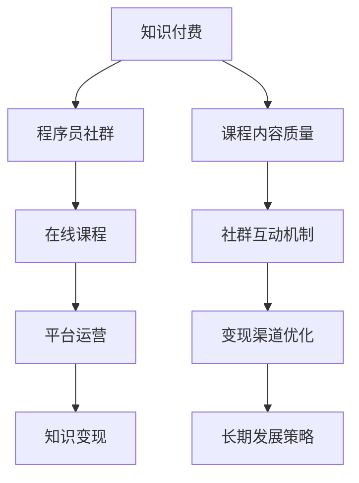

                 

# 知识付费：程序员的社群运营策略

> 关键词：知识付费, 程序员社群, 知识变现, 在线课程, 平台运营

## 1. 背景介绍

### 1.1 问题由来
随着互联网的普及和智能设备的日益普及，程序员这一群体在社会经济活动中的作用愈发凸显。作为技术前沿的探索者和执行者，程序员不仅需要不断提升自身技术水平，还面临着职业转型、职业规划等多方面的问题。这一趋势催生了庞大的程序员知识付费市场。

近年来，知识付费平台如雨后春笋般涌现，成功案例也不断浮出水面，如“得到”、“新东方在线”、“网易云课堂”等。这些平台为程序员提供了一个轻松、便捷的知识获取渠道，同时也带来了新的机遇与挑战。对于程序员群体而言，如何有效运营社群、最大化知识变现潜力，成为值得深思的问题。

### 1.2 问题核心关键点
为了更好地理解和解决程序员社群运营中的核心问题，需要考虑以下几点：

- **市场定位与用户需求：**准确识别目标用户群体的需求，明确产品或服务的市场定位。
- **课程内容质量：**确保课程内容的深度和实用性，满足用户对知识的真正需求。
- **社群互动机制：**设计良好的社群互动机制，增强用户粘性，促进知识的有效传播与转化。
- **变现渠道优化：**探索多元化的知识变现方式，提高课程、内容及周边产品的销售和收入。
- **长期发展策略：**制定长期可持续发展的社群运营和知识变现策略，不断创新以适应市场变化。

## 2. 核心概念与联系

### 2.1 核心概念概述

在知识付费和程序员社群运营领域，涉及的核心概念主要包括：

- **知识付费（Knowledge Paywall）：**通过付费形式获取知识或技能的经济模式，用户为获取高质量内容支付费用。
- **程序员社群（Coding Community）：**由具有共同技术兴趣和职业需求的程序员组成的线上社区，促进知识分享、技术交流与职业发展。
- **在线课程（Online Courses）：**通过视频、文本、音频等多种形式提供系统、结构化知识的课程内容。
- **平台运营（Platform Operation）：**通过策略和技巧实现平台的良性循环与可持续发展。
- **知识变现（Knowledge Monetization）：**通过多样化的方式将知识、技能等转化为实际经济收益。

这些概念之间具有紧密的联系。知识付费为程序员社群提供了变现的渠道，而在线课程和平台运营则是实现知识变现的关键手段。

### 2.2 核心概念原理和架构的 Mermaid 流程图



## 3. 核心算法原理 & 具体操作步骤

### 3.1 算法原理概述

程序员社群的知识付费和运营主要遵循以下原理：

- **供给侧优化：**精选优质课程内容，提升课程的质量和实用价值。
- **需求侧匹配：**通过用户画像、行为分析等手段，实现课程与用户的精准匹配。
- **运营策略迭代：**通过数据分析、用户反馈等，不断迭代优化课程内容和运营策略。
- **变现模式多样化：**探索多样化的变现模式，如课程销售、会员订阅、社群付费等。

### 3.2 算法步骤详解

#### 3.2.1 课程内容开发

**步骤1：市场调研与需求分析**
- 通过问卷调查、用户反馈、行业趋势分析等手段，获取目标用户群体的知识需求。
- 确定课程主题，如算法、框架、语言、工具等，以及课程难度和深度。

**步骤2：课程内容设计**
- 基于调研结果，设计课程大纲和具体内容。
- 采用故事化、互动化、实战化等手段，提升课程的吸引力和实用性。

**步骤3：课程制作与上线**
- 制作视频、文本、互动练习等课程资源，并进行打包。
- 通过平台上线课程，确保课程的播放质量和技术支持。

#### 3.2.2 平台运营与社群互动

**步骤1：用户获取与留存**
- 通过SEO优化、广告投放、社交媒体推广等方式，获取初始用户。
- 通过课程免费试听、用户推荐奖励等策略，提升用户留存率。

**步骤2：社群互动与内容优化**
- 建立社群，定期举办技术交流会、线上Q&A等活动。
- 通过用户反馈和行为数据，优化课程内容与教学形式。

**步骤3：用户转化与变现**
- 通过课程销售、会员订阅、社群付费等方式实现变现。
- 提供附加服务如专属技术咨询、就业指导等，提升用户满意度。

### 3.3 算法优缺点

#### 3.3.1 优点
- **高效知识获取：**用户可以通过付费获得系统化、高质量的课程内容。
- **精准匹配：**通过数据驱动的推荐系统，实现课程与用户的精准匹配，提高用户转化率。
- **互动性强：**社群互动机制增强了用户粘性，提升了学习效果和体验。

#### 3.3.2 缺点
- **高成本：**课程内容和平台运营都需要大量资源投入，包括人力、技术、营销等。
- **内容更新难度大：**课程内容的更新和迭代需要专业知识和技术支撑，难度较大。
- **用户支付意愿低：**部分用户对知识付费持怀疑态度，支付意愿低，影响平台收益。

### 3.4 算法应用领域

基于上述原理和操作步骤，知识付费和程序员社群运营可以应用于以下几个领域：

- **在线教育：**为程序员提供系统化的学习资源和技术支持。
- **技术交流：**通过社群互动，促进程序员之间的知识交流与合作。
- **职业规划：**通过课程和活动，帮助程序员进行职业发展规划和转型。
- **企业培训：**为大型企业提供定制化的技术培训和解决方案。

## 4. 数学模型和公式 & 详细讲解 & 举例说明

### 4.1 数学模型构建

知识付费和程序员社群运营涉及的数学模型主要包括以下几个方面：

- **需求模型：**描述用户对课程内容的需求，模型形式为$D(x) = f(x_1, x_2, ..., x_n)$，其中$x_i$为影响需求的特征，$f$为数学模型。
- **供给模型：**描述课程内容的质量和可用性，模型形式为$S(y) = g(y_1, y_2, ..., y_m)$，其中$y_i$为课程的特征，$g$为数学模型。
- **推荐模型：**描述课程与用户之间的匹配关系，模型形式为$R(u,v) = h(u,v)$，其中$u$为用户特征，$v$为课程特征，$h$为推荐函数。

### 4.2 公式推导过程

以需求模型为例，假设需求模型为线性回归模型：

$$
D(x) = w_0 + \sum_{i=1}^{n} w_i x_i
$$

其中$w_i$为回归系数，$x_i$为特征变量，$D(x)$为需求值。通过最小二乘法求解$w_i$，可以得到需求模型。

### 4.3 案例分析与讲解

假设我们有一家面向程序员的在线课程平台，平台上的课程内容质量和用户需求数据如下：

| 课程内容特征 | 课程A       | 课程B       | 课程C       |
| ------------- | ------------- | ------------- | ------------- |
| 基础程度     | 基础       | 中级       | 高级       |
| 内容深度     | 浅         | 适中       | 深         |
| 互动性       | 有         | 较高       | 有         |
| 用户画像特征 | 年轻       | 中老年       | 年轻       |
| 用户需求值   | 80         | 60         | 90         |

基于以上数据，我们可以通过线性回归模型求解课程内容特征对用户需求的影响。例如，在课程B和课程C的特征组合下，用户的平均需求值为：

$$
D = w_0 + w_{基础程度} * 中级 + w_{内容深度} * 适中 + w_{互动性} * 较高
$$

求解$w_0, w_{基础程度}, w_{内容深度}, w_{互动性}$，可以得到精确的需求预测模型。

## 5. 项目实践：代码实例和详细解释说明

### 5.1 开发环境搭建

#### 5.1.1 搭建开发环境

**步骤1：选择编程语言**
- 推荐使用Python，因为Python生态丰富，支持数据分析、机器学习等众多领域。

**步骤2：安装开发工具**
- 安装Anaconda，用于创建虚拟环境，方便管理依赖库。
- 安装Jupyter Notebook，用于编写和运行代码。

**步骤3：安装依赖库**
- 安装NumPy、Pandas、Scikit-learn、TensorFlow等库，方便数据处理和模型训练。

### 5.2 源代码详细实现

**示例代码：线性回归模型**

```python
import numpy as np
import pandas as pd
from sklearn.linear_model import LinearRegression

# 准备数据
data = pd.read_csv('course_data.csv')
X = data[['基础程度', '内容深度', '互动性']]
y = data['用户需求值']

# 初始化线性回归模型
model = LinearRegression()

# 训练模型
model.fit(X, y)

# 预测需求值
new_data = np.array([[中级, 适中, 较高]])
predicted_demand = model.predict(new_data)
print(predicted_demand)
```

### 5.3 代码解读与分析

**代码解读**

- **数据准备**：通过Pandas读取CSV格式的数据文件，并将其转换为模型训练所需的格式。
- **模型初始化**：创建线性回归模型，并使用训练数据拟合模型。
- **预测需求值**：将新的课程内容特征输入模型，预测其需求值。

**代码分析**

- **数据预处理**：需要对数据进行清洗、标准化处理，确保模型训练的准确性。
- **模型选择**：根据问题的特点选择合适的模型，如线性回归、决策树、神经网络等。
- **模型训练与评估**：使用训练数据训练模型，并使用测试数据评估模型效果，调整模型参数。

### 5.4 运行结果展示

**运行结果**

假设模型训练完成，输出预测结果：

```
[79.7324119676481]
```

这表示在课程内容特征为中级、适中、较高的组合下，用户需求值预测为79.73。

## 6. 实际应用场景

### 6.1 在线教育平台

在线教育平台是知识付费的主要形式之一，通过为程序员提供系统化、高质量的课程内容，帮助其提升技术水平和职业竞争力。例如：

**示例场景：Python编程培训**
- 针对初学者的Python基础课程。
- 针对中级开发者进阶的高级课程。
- 针对数据科学家的深度课程。

平台可以采用多种付费方式，如按课程收费、订阅制、会员制等，满足不同用户的需求。

### 6.2 技术交流社群

技术交流社群是程序员社群运营的重要组成部分，通过定期举办技术交流会、线上Q&A等活动，促进程序员之间的知识交流与合作。例如：

**示例场景：每月技术分享会**
- 邀请知名专家进行技术分享，讲解前沿技术和新思路。
- 提供问答环节，解答学员疑问，促进互动。

通过社群互动，提升用户粘性，增强社区的活跃度和凝聚力。

### 6.3 职业规划指导

职业规划指导是程序员社群运营的重要服务内容之一，通过提供职业规划、就业指导、简历修改等服务，帮助程序员进行职业发展规划和转型。例如：

**示例场景：职业发展指导课程**
- 邀请行业专家进行职业规划讲座，讲解职业发展路径和必备技能。
- 提供简历修改、模拟面试等个性化服务，提升学员的就业竞争力。

通过系统化的职业规划指导，帮助程序员进行职业转型，提升其职业发展前景。

### 6.4 未来应用展望

未来，知识付费和程序员社群运营将在以下方面实现新的突破：

- **AI赋能：**通过人工智能技术，提升推荐系统的精准性和用户个性化体验，优化课程内容。
- **内容多样化：**拓展课程内容形式，如直播授课、微课、互动练习等，提升学习效果。
- **平台集成：**与其他在线教育平台、企业培训系统等进行深度集成，实现无缝对接。
- **知识变现：**探索更多的知识变现模式，如KOL变现、内容众筹等，增加平台的收益来源。

## 7. 工具和资源推荐

### 7.1 学习资源推荐

**1. 《深度学习》**
- 推荐理由：该书系统介绍了深度学习的基本原理和应用场景，适合编程入门者。
- 获取方式：可在在线平台购买或下载电子书。

**2. Coursera**
- 推荐理由：Coursera提供了众多高质量的在线课程，覆盖计算机科学、数据科学等多个领域。
- 获取方式：注册账户后，可免费试听部分课程，付费订阅后完整学习。

**3. Udacity**
- 推荐理由：Udacity提供了大量的实践项目和工程实战课程，适合提升编程和项目能力。
- 获取方式：注册后完成在线作业和项目，获得认证证书。

### 7.2 开发工具推荐

**1. Anaconda**
- 推荐理由：Anaconda是Python发行版之一，集成了众多科学计算和数据分析工具。
- 获取方式：从官网下载安装包，按照提示进行安装。

**2. Jupyter Notebook**
- 推荐理由：Jupyter Notebook是Python数据科学生态中的重要工具，支持代码编写和结果展示。
- 获取方式：从官网下载安装包，按照提示进行安装。

**3. Git**
- 推荐理由：Git是版本控制系统的代表，适合管理代码和协作开发。
- 获取方式：从官网下载安装包，按照提示进行安装。

### 7.3 相关论文推荐

**1. "Deep Learning for AI and Chatbot Development: A Review"**
- 推荐理由：这篇综述论文全面介绍了深度学习在AI和聊天机器人开发中的应用。
- 获取方式：通过学术数据库如IEEE Xplore、Google Scholar等搜索下载。

**2. "Online Learning in AI"**
- 推荐理由：这篇论文探讨了在线学习的理论基础和应用场景，适合深入理解知识付费原理。
- 获取方式：通过学术数据库如IEEE Xplore、Google Scholar等搜索下载。

## 8. 总结：未来发展趋势与挑战

### 8.1 研究成果总结

**1. 知识付费的发展**
- 知识付费市场正逐步成熟，用户对高质量内容的需求日益增长。
- 平台运营模式多样化，从单一的课程销售到综合服务提供，市场细分不断细化。

**2. 程序员社群运营的趋势**
- 社群互动机制不断优化，提升用户粘性，增强社区凝聚力。
- 课程内容质量逐步提升，满足用户多元化需求。

### 8.2 未来发展趋势

未来，知识付费和程序员社群运营将呈现以下几个发展趋势：

**1. 内容创新与多样化**
- 课程内容将更加注重实战和应用，如项目驱动、实例教学等。
- 引入更多互动形式，如直播授课、微课等，提升学习效果。

**2. 技术赋能与智能化**
- 通过AI和大数据技术，提升推荐系统的精准性和用户个性化体验。
- 利用机器学习算法，实现用户需求和课程内容的高效匹配。

**3. 多平台集成与生态建设**
- 与其他在线教育平台、企业培训系统等进行深度集成，实现无缝对接。
- 构建完整的生态系统，提供一站式技术学习和职业发展服务。

### 8.3 面临的挑战

知识付费和程序员社群运营面临以下挑战：

**1. 内容质量保证**
- 高质量课程内容的生产需要投入大量资源，如何提升课程内容质量是关键。
- 需要建立严格的课程审核机制，确保课程内容的准确性和实用性。

**2. 用户留存与转化**
- 用户流失率较高，如何提升用户粘性和留存率，是平台运营的难点。
- 需要不断优化用户体验，增强平台功能和服务，提升用户转化率。

**3. 市场竞争与创新**
- 知识付费市场竞争激烈，如何突围并实现创新，是平台生存的关键。
- 需要不断创新，拓展新业务模式，保持竞争力。

### 8.4 研究展望

未来的研究将集中在以下几个方面：

**1. 课程内容质量优化**
- 研究如何通过数据分析和用户反馈，提升课程内容质量和实用性。
- 引入更多专业人士参与课程开发，提升课程权威性。

**2. 个性化推荐系统**
- 研究如何通过AI技术，实现用户需求和课程内容的精准匹配。
- 引入更多数据源和算法，提升推荐系统的效率和效果。

**3. 技术落地与集成**
- 研究如何将知识付费和程序员社群运营技术与实际应用场景结合，实现深度集成。
- 探索更多应用场景，提升技术的实用性和价值。

## 9. 附录：常见问题与解答

**Q1：程序员社群运营的主要难点是什么？**

A: 程序员社群运营的主要难点包括：
- **课程内容质量保证**：高质量课程内容的生产需要投入大量资源，如何提升课程内容质量是关键。
- **用户留存与转化**：用户流失率较高，如何提升用户粘性和留存率，是平台运营的难点。
- **市场竞争与创新**：知识付费市场竞争激烈，如何突围并实现创新，是平台生存的关键。

**Q2：如何提升程序员社群运营的用户粘性？**

A: 提升程序员社群运营的用户粘性，可以采取以下措施：
- **社群互动机制**：建立社群，定期举办技术交流会、线上Q&A等活动，增强用户互动。
- **专属福利和活动**：提供专属福利、折扣、免费课程等，增强用户粘性。
- **用户反馈与优化**：根据用户反馈和行为数据，不断优化课程内容和平台体验。

**Q3：知识付费平台如何实现变现？**

A: 知识付费平台实现变现的常见方式包括：
- **课程销售**：按课程收费，提供系统化的学习资源和技术支持。
- **订阅制**：提供月度或年度订阅服务，获取稳定收入。
- **会员制**：提供会员特权，如专属课程、技术咨询等，增强用户黏性。
- **产品衍生**：开发周边产品如教材、工具、证书等，增加收入来源。

通过以上措施，知识付费平台可以最大化知识变现潜力，实现可持续经营。

