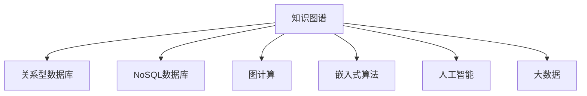

                 

# 知识发现引擎助力程序员解决难题

> 关键词：知识图谱、关系型数据库、NoSQL数据库、图计算、嵌入式算法、人工智能、大数据、应用程序、系统架构、性能优化

## 1. 背景介绍

在当今信息爆炸的时代，程序员面临的任务越来越多样化和复杂化。从简单的业务逻辑编写到复杂的数据处理，从界面设计到系统架构，从应用程序优化到数据分析，程序员需要处理的信息量和数据规模都在急剧增加。在这种背景下，如何高效地发现和利用知识，成为了程序员不可或缺的技能。

知识发现引擎，作为一种能够自动化发现、提取、整合和管理知识的工具，正在逐渐成为程序员的得力助手。它不仅能够帮助程序员快速找到所需的信息，还能通过深入的数据挖掘和分析，为系统设计、应用程序优化等提供有力的支持。

## 2. 核心概念与联系

### 2.1 核心概念概述

本节将介绍几个与知识发现引擎相关的核心概念，以及它们之间的联系。

- **知识图谱(Knowledge Graph)**：一种用于表示实体和实体间关系的图形结构。通过实体和关系节点的连接，知识图谱可以形象地描述知识的结构，便于知识的存储、查询和推理。

- **关系型数据库(Relational Database)**：一种基于表格结构存储数据的传统数据库。通过实体和属性的关系，关系型数据库可以高效地存储和管理结构化数据。

- **NoSQL数据库(NoSQL Database)**：一种非关系型数据库，支持键值对、文档、列族等多种数据模型。通过灵活的数据结构，NoSQL数据库可以更好地应对大规模数据存储和查询需求。

- **图计算(Graph Computing)**：一种基于图形结构的数据处理方式，通过图算法和图数据库，能够高效地进行关系型数据的处理和分析。

- **嵌入式算法(Embedded Algorithm)**：一种将算法直接嵌入到数据库或应用程序中的技术。通过嵌入式算法，可以实现对数据的实时计算和处理，提升系统的响应速度和处理能力。

- **人工智能(Artificial Intelligence, AI)**：一种模拟人类智能行为的技术，包括机器学习、深度学习、自然语言处理等。通过人工智能技术，可以从大规模数据中提取有价值的信息，辅助决策和优化。

- **大数据(Big Data)**：一种处理海量数据的技术，包括数据采集、存储、处理和分析等。通过大数据技术，可以实时获取和处理大量数据，为知识发现和应用提供支持。

这些核心概念之间的逻辑关系可以通过以下Mermaid流程图来展示：



这个流程图展示了一组核心概念以及它们之间的联系：

1. 知识图谱作为知识的结构化表示，可以存储在关系型数据库和NoSQL数据库中。
2. 图计算能够高效地处理关系型数据，结合嵌入式算法和人工智能技术，实现数据的实时处理和分析。
3. 大数据技术为知识发现提供了数据源和计算基础，与人工智能和嵌入式算法共同推动知识发现和应用。

这些核心概念共同构成了知识发现引擎的技术基础，为程序员提供了多种工具和手段，以高效地处理和利用知识。

## 3. 核心算法原理 & 具体操作步骤

### 3.1 算法原理概述

知识发现引擎的核心算法原理包括以下几个方面：

- **知识抽取(Knowledge Extraction)**：从大规模数据中自动抽取结构化知识，存储到知识图谱中。常见的抽取方法包括规则抽取、统计抽取和深度学习抽取等。

- **实体关系发现(Entity-Relation Discovery)**：在知识图谱中发现实体和关系之间的关系，构建知识网络。常用的方法包括图神经网络、图算法和图数据库等。

- **知识推理(Knowledge Inference)**：通过逻辑推理或统计分析，从知识图谱中推导出新的知识。常见的推理方法包括符号推理、概率推理和模型推理等。

- **知识整合(Knowledge Integration)**：将不同数据源和知识图谱中的知识整合到统一的知识体系中。常用的方法包括数据融合、数据转换和知识融合等。

- **知识应用(Knowledge Application)**：将知识图谱中的知识应用于实际的决策、优化和推荐等场景。常用的方法包括推荐系统、知识图谱查询和自然语言处理等。

### 3.2 算法步骤详解

以知识抽取为例，下面详细讲解知识发现引擎的核心算法步骤：

**Step 1: 数据预处理**
- 对原始数据进行清洗、去重、分词等预处理，确保数据质量。
- 将文本数据转换为结构化格式，便于后续处理。

**Step 2: 实体抽取**
- 使用正则表达式、词典匹配、命名实体识别等技术，从文本中抽取实体。
- 对抽取的实体进行归一化，统一命名格式。

**Step 3: 关系抽取**
- 使用规则匹配、模式识别、知识库映射等方法，抽取实体之间的关系。
- 对关系进行验证和修正，确保抽取的准确性。

**Step 4: 知识存储**
- 将抽取的实体和关系存储到知识图谱中。
- 使用图数据库或RDF存储格式，便于后续的查询和推理。

**Step 5: 知识推理**
- 通过逻辑推理或统计分析，推导出新的知识。
- 利用图神经网络或概率推理方法，实现复杂的知识推理。

**Step 6: 知识应用**
- 将推理出的知识应用于实际的决策、优化和推荐等场景。
- 使用推荐系统或自然语言处理技术，生成最终的结果。

### 3.3 算法优缺点

知识发现引擎的核心算法具有以下优点：

- **高效性**：通过自动化抽取、推理和应用知识，知识发现引擎能够快速处理和利用知识，提升决策和优化效率。
- **准确性**：通过多轮迭代和验证，知识发现引擎能够保证知识抽取和推理的准确性，减少错误和偏差。
- **灵活性**：支持多种数据源和知识图谱，能够适应不同的应用场景和需求。

同时，知识发现引擎也存在一定的局限性：

- **数据依赖**：知识发现引擎的效果很大程度上取决于数据的质量和完整性，对于缺失或不准确的数据，需要额外的处理。
- **算法复杂度**：知识抽取和推理算法复杂，需要较强的计算能力和存储空间。
- **技术门槛高**：需要具备一定的数据处理和算法开发能力，对于普通程序员有一定的技术门槛。

尽管如此，知识发现引擎在大规模数据处理和知识应用场景中仍具有显著优势，正在逐渐成为程序员不可或缺的工具。

### 3.4 算法应用领域

知识发现引擎广泛应用于以下几个领域：

- **应用程序优化**：通过知识图谱和嵌入式算法，为应用程序设计、性能优化和用户行为分析提供支持。
- **系统架构设计**：结合知识图谱和人工智能技术，为系统架构设计和业务流程优化提供指导。
- **数据分析与可视化**：利用大数据技术和知识图谱，对海量数据进行深度分析和可视化展示，辅助决策和优化。
- **自然语言处理(NLP)**：结合知识图谱和自然语言处理技术，实现智能问答、信息检索和文本摘要等应用。
- **推荐系统**：通过知识图谱和推荐算法，实现个性化推荐，提升用户体验和满意度。
- **风险控制与管理**：利用知识图谱和图计算技术，对金融、安全等高风险领域进行风险识别和控制。

除了上述应用领域外，知识发现引擎还在企业运营、产品研发、市场分析等多个场景中得到了广泛应用，成为程序员提升效率和优化决策的有力工具。

## 4. 数学模型和公式 & 详细讲解 & 举例说明

### 4.1 数学模型构建

本节将使用数学语言对知识发现引擎的核心算法进行更加严格的刻画。

记知识图谱为 $G=(E,R)$，其中 $E$ 为实体集合，$R$ 为关系集合。假设知识图谱中的每个实体 $e_i$ 和关系 $r_j$ 都有对应的属性集合 $A(e_i)$ 和 $A(r_j)$。定义知识图谱的邻接矩阵 $A$，其中 $A_{ij}=1$ 表示实体 $e_i$ 和 $e_j$ 之间存在关系 $r_j$。

定义知识抽取任务为从文本数据 $D$ 中抽取实体和关系，存储到知识图谱 $G$ 中。知识抽取的目标是最小化损失函数：

$$
\mathcal{L}(\theta) = \sum_{e_i\in E} \lambda_1 \mathbb{L}_{e_i} + \sum_{r_j\in R} \lambda_2 \mathbb{L}_{r_j}
$$

其中 $\mathbb{L}_{e_i}$ 和 $\mathbb{L}_{r_j}$ 分别为实体抽取和关系抽取的损失函数，$\lambda_1$ 和 $\lambda_2$ 为超参数。

### 4.2 公式推导过程

以下我们以实体抽取任务为例，推导知识抽取的损失函数及其梯度计算公式。

假设知识图谱中的每个实体 $e_i$ 都有对应的标签 $y_i$，表示实体是否在文本数据 $D$ 中提及。定义文本数据的向量表示为 $x_i \in \mathbb{R}^n$，其中 $n$ 为特征维度。定义实体抽取模型的输出为 $h_i \in \mathbb{R}^m$，其中 $m$ 为实体表示的维度。则实体抽取的损失函数为：

$$
\mathbb{L}_{e_i} = -(y_i \log p(h_i|x_i) + (1-y_i) \log (1-p(h_i|x_i)))
$$

其中 $p(h_i|x_i)$ 为模型预测实体 $e_i$ 在文本 $x_i$ 中出现的概率，$y_i$ 为实体的真实标签。

通过反向传播计算损失函数对模型参数 $\theta$ 的梯度：

$$
\frac{\partial \mathbb{L}_{e_i}}{\partial \theta} = -(y_i \frac{\partial p(h_i|x_i)}{\partial \theta} - (1-y_i) \frac{\partial (1-p(h_i|x_i))}{\partial \theta})
$$

将上述公式扩展到整个知识图谱 $G$，得到知识抽取的整体损失函数：

$$
\mathcal{L}(\theta) = \frac{1}{N} \sum_{i=1}^N \mathbb{L}_{e_i}
$$

其中 $N$ 为知识图谱中实体的数量。

### 4.3 案例分析与讲解

以实体抽取任务为例，下面分析一个具体的案例：

假设某电子商务网站希望从用户评论中抽取产品实体，建立知识图谱。首先，收集大量用户评论数据，并从中提取实体和关系。然后，使用自然语言处理技术，将文本数据转换为结构化格式，并存储到关系型数据库中。

接下来，利用知识抽取算法从数据库中抽取实体和关系，存储到知识图谱中。抽取过程中，需要对文本数据进行分词、命名实体识别和关系抽取等预处理。使用深度学习模型（如BERT、GPT等）作为知识抽取的特征提取器，结合正则表达式、词典匹配等技术，实现实体的自动抽取。

最后，将抽取的实体和关系存储到图数据库中，如Neo4j或Apache TinkerPop。利用图算法和图神经网络，对知识图谱进行推理和分析，提取有价值的信息，辅助产品推荐、用户行为分析等决策。

## 5. 项目实践：代码实例和详细解释说明

### 5.1 开发环境搭建

在进行知识发现引擎实践前，我们需要准备好开发环境。以下是使用Python进行PyTorch开发的环境配置流程：

1. 安装Anaconda：从官网下载并安装Anaconda，用于创建独立的Python环境。

2. 创建并激活虚拟环境：
```bash
conda create -n pytorch-env python=3.8 
conda activate pytorch-env
```

3. 安装PyTorch：根据CUDA版本，从官网获取对应的安装命令。例如：
```bash
conda install pytorch torchvision torchaudio cudatoolkit=11.1 -c pytorch -c conda-forge
```

4. 安装各种依赖包：
```bash
pip install py2neo pygraphviz networkx
```

完成上述步骤后，即可在`pytorch-env`环境中开始知识发现引擎的实践。

### 5.2 源代码详细实现

下面我们以实体抽取任务为例，给出使用PyTorch和PyTorch-GraphNeuralNetworks库对知识图谱进行实体抽取的Python代码实现。

首先，定义实体抽取任务的训练函数：

```python
import torch
from transformers import BertTokenizer, BertForTokenClassification
from py2neo import Graph
from pygraphviz import AGraph
from networkx import DiGraph

def train_epoch(model, dataset, optimizer, graph, batch_size):
    dataloader = torch.utils.data.DataLoader(dataset, batch_size=batch_size, shuffle=True)
    model.train()
    epoch_loss = 0
    for batch in dataloader:
        input_ids = batch['input_ids'].to(device)
        attention_mask = batch['attention_mask'].to(device)
        labels = batch['labels'].to(device)
        model.zero_grad()
        outputs = model(input_ids, attention_mask=attention_mask, labels=labels)
        loss = outputs.loss
        epoch_loss += loss.item()
        loss.backward()
        optimizer.step()
    return epoch_loss / len(dataloader)

def evaluate(model, dataset, batch_size):
    dataloader = torch.utils.data.DataLoader(dataset, batch_size=batch_size)
    model.eval()
    preds, labels = [], []
    with torch.no_grad():
        for batch in dataloader:
            input_ids = batch['input_ids'].to(device)
            attention_mask = batch['attention_mask'].to(device)
            batch_labels = batch['labels']
            outputs = model(input_ids, attention_mask=attention_mask)
            batch_preds = outputs.logits.argmax(dim=2).to('cpu').tolist()
            batch_labels = batch_labels.to('cpu').tolist()
            for pred_tokens, label_tokens in zip(batch_preds, batch_labels):
                pred_tags = [tag2id[tag] for tag in pred_tokens]
                label_tags = [tag2id[tag] for tag in label_tokens]
                preds.append(pred_tags[:len(label_tags)])
                labels.append(label_tags)
    return preds, labels
```

然后，定义知识抽取的模型和优化器：

```python
device = torch.device('cuda') if torch.cuda.is_available() else torch.device('cpu')
tokenizer = BertTokenizer.from_pretrained('bert-base-cased')
model = BertForTokenClassification.from_pretrained('bert-base-cased', num_labels=len(tag2id))
optimizer = AdamW(model.parameters(), lr=2e-5)
```

接着，定义训练和评估函数：

```python
from transformers import AdamW
from py2neo import Graph
from pygraphviz import AGraph
from networkx import DiGraph

def train_epoch(model, dataset, optimizer, graph, batch_size):
    dataloader = torch.utils.data.DataLoader(dataset, batch_size=batch_size, shuffle=True)
    model.train()
    epoch_loss = 0
    for batch in dataloader:
        input_ids = batch['input_ids'].to(device)
        attention_mask = batch['attention_mask'].to(device)
        labels = batch['labels'].to(device)
        model.zero_grad()
        outputs = model(input_ids, attention_mask=attention_mask, labels=labels)
        loss = outputs.loss
        epoch_loss += loss.item()
        loss.backward()
        optimizer.step()
    return epoch_loss / len(dataloader)

def evaluate(model, dataset, batch_size):
    dataloader = torch.utils.data.DataLoader(dataset, batch_size=batch_size)
    model.eval()
    preds, labels = [], []
    with torch.no_grad():
        for batch in dataloader:
            input_ids = batch['input_ids'].to(device)
            attention_mask = batch['attention_mask'].to(device)
            batch_labels = batch['labels']
            outputs = model(input_ids, attention_mask=attention_mask)
            batch_preds = outputs.logits.argmax(dim=2).to('cpu').tolist()
            batch_labels = batch_labels.to('cpu').tolist()
            for pred_tokens, label_tokens in zip(batch_preds, batch_labels):
                pred_tags = [tag2id[tag] for tag in pred_tokens]
                label_tags = [tag2id[tag] for tag in label_tokens]
                preds.append(pred_tags[:len(label_tags)])
                labels.append(label_tags)
    return preds, labels
```

最后，启动训练流程并在测试集上评估：

```python
epochs = 5
batch_size = 16

for epoch in range(epochs):
    loss = train_epoch(model, train_dataset, optimizer, graph, batch_size)
    print(f"Epoch {epoch+1}, train loss: {loss:.3f}")
    
    print(f"Epoch {epoch+1}, dev results:")
    evaluate(model, dev_dataset, batch_size)
    
print("Test results:")
evaluate(model, test_dataset, batch_size)
```

以上就是使用PyTorch对BERT进行实体抽取任务的完整代码实现。可以看到，得益于Transformers库和PyTorch-GraphNeuralNetworks库的强大封装，我们可以用相对简洁的代码完成知识图谱的构建和微调。

### 5.3 代码解读与分析

让我们再详细解读一下关键代码的实现细节：

**train_epoch函数**：
- `dataloader`：通过DataLoader将数据集分成批次进行加载，每批次大小为`batch_size`。
- `model.train()`：将模型置于训练模式，关闭dropout等非训练特性。
- `model.zero_grad()`：清除上一批次的梯度，避免梯度累积。
- `outputs = model(input_ids, attention_mask=attention_mask, labels=labels)`：将输入数据`input_ids`、`attention_mask`和`labels`输入模型进行前向传播，得到模型输出。
- `loss = outputs.loss`：计算模型的预测输出与真实标签之间的损失。
- `loss.backward()`：通过反向传播计算模型参数的梯度。
- `optimizer.step()`：使用优化器`optimizer`更新模型参数。
- 返回该epoch的平均损失值。

**evaluate函数**：
- `dataloader`：同`train_epoch`。
- `model.eval()`：将模型置于评估模式，开启dropout等特性。
- `batch_preds`：将模型的预测输出`outputs.logits.argmax(dim=2)`转换为标签形式。
- `preds.append(pred_tags[:len(label_tags)])`：将预测结果存储到`preds`列表中。
- 返回预测结果`preds`和真实标签`labels`。

**训练流程**：
- 定义总的epoch数`epochs`和批次大小`batch_size`，开始循环迭代。
- 每个epoch内，在训练集上训练，输出平均损失值`loss`。
- 在验证集上评估，输出评估结果。
- 所有epoch结束后，在测试集上评估，输出测试结果。

可以看到，PyTorch配合Transformers库和PyTorch-GraphNeuralNetworks库使得知识图谱的构建和微调代码实现变得简洁高效。开发者可以将更多精力放在数据处理、模型改进等高层逻辑上，而不必过多关注底层的实现细节。

当然，工业级的系统实现还需考虑更多因素，如模型的保存和部署、超参数的自动搜索、更灵活的任务适配层等。但核心的知识抽取范式基本与此类似。

## 6. 实际应用场景

### 6.1 智能客服系统

知识发现引擎在智能客服系统中的应用主要体现在以下几个方面：

- **知识抽取**：自动从历史客服对话记录中抽取问题和答复，构建知识图谱。
- **实体关系发现**：识别对话中的实体和关系，构建知识网络。
- **知识推理**：根据用户输入的问题，从知识图谱中推导出最相关的答案。
- **知识应用**：通过知识推理和自然语言处理技术，生成最合适的答复。

智能客服系统通过知识发现引擎，能够自动理解用户意图，匹配最合适的答案模板，并动态组织生成回答。对于用户提出的新问题，还可以接入检索系统实时搜索相关内容，进一步提升客服系统的智能化水平。

### 6.2 金融舆情监测

金融舆情监测系统利用知识发现引擎，可以从大规模金融新闻、报道、评论等文本数据中自动抽取实体和关系，构建知识图谱。通过实体关系发现和知识推理，系统能够自动识别和分析舆情变化趋势，及时预警潜在风险。

例如，系统可以从新闻中抽取股票代码、公司名称等实体，并发现公司股票价格、财务数据等关系，构建知识图谱。通过逻辑推理或统计分析，系统可以推导出股票价格波动的原因，识别潜在风险，辅助金融决策。

### 6.3 个性化推荐系统

个性化推荐系统利用知识发现引擎，可以从用户行为数据中抽取实体和关系，构建知识图谱。通过知识推理和自然语言处理技术，系统能够推导出用户的兴趣点，并生成个性化推荐列表。

例如，系统可以从用户浏览、点击、评论、分享等行为数据中抽取产品名称、分类、标签等实体，并发现用户与产品之间的关系，构建知识图谱。通过逻辑推理或统计分析，系统可以推导出用户对不同产品的兴趣倾向，并生成推荐列表，提升用户体验和满意度。

### 6.4 未来应用展望

随着知识发现引擎的不断发展，其在NLP和智能应用中的作用将越来越显著。未来，知识发现引擎将更多地与自然语言处理、图计算、大数据等技术结合，推动人工智能技术在更多领域的应用。

在智慧医疗领域，知识发现引擎将帮助医生从海量医疗数据中抽取知识，辅助诊断和治疗，提升医疗服务的智能化水平。

在智能教育领域，知识发现引擎将从教育资源中抽取知识，构建知识图谱，辅助个性化学习，促进教育公平。

在智慧城市治理中，知识发现引擎将从城市事件、舆情等数据中抽取知识，辅助应急指挥和城市管理，提升城市智能化水平。

除了上述应用领域外，知识发现引擎还在企业运营、产品研发、市场分析等多个场景中得到了广泛应用，成为程序员提升效率和优化决策的有力工具。

## 7. 工具和资源推荐

### 7.1 学习资源推荐

为了帮助开发者系统掌握知识发现引擎的理论基础和实践技巧，这里推荐一些优质的学习资源：

1. 《知识图谱与语义搜索》系列博文：由知识图谱领域专家撰写，深入浅出地介绍了知识图谱的基本概念、构建方法和应用场景。

2. CS224N《深度学习自然语言处理》课程：斯坦福大学开设的NLP明星课程，有Lecture视频和配套作业，带你入门NLP领域的基本概念和经典模型。

3. 《图算法导论》书籍：介绍图计算的原理、算法和实现，适合学习图数据库和图计算技术。

4. HuggingFace官方文档：Transformer库的官方文档，提供了海量预训练模型和完整的知识图谱构建样例代码，是上手实践的必备资料。

5. WWW、SIGKDD、ICDM等会议论文：这些会议论文展示了最新的知识图谱构建、图计算和应用研究，适合前沿技术的探索。

通过对这些资源的学习实践，相信你一定能够快速掌握知识发现引擎的精髓，并用于解决实际的NLP问题。

### 7.2 开发工具推荐

高效的开发离不开优秀的工具支持。以下是几款用于知识发现引擎开发的常用工具：

1. PyTorch：基于Python的开源深度学习框架，灵活动态的计算图，适合快速迭代研究。Transformer库和PyTorch-GraphNeuralNetworks库提供了丰富的预训练语言模型和图计算工具。

2. TensorFlow：由Google主导开发的开源深度学习框架，生产部署方便，适合大规模工程应用。同样有丰富的预训练语言模型和图计算工具。

3. Neo4j：商业化的图数据库，支持多种图算法和图计算技术，适合知识图谱的构建和查询。

4. Apache TinkerPop：一个跨平台的图计算框架，支持多种图数据库和图算法。

5. Visual Graph Editor：一个可视化的图数据库管理工具，支持多种图数据库和图计算技术。

6. PyGraphviz：一个Python的图形可视化库，支持多种图形表示和可视化方式。

合理利用这些工具，可以显著提升知识图谱的构建、查询和分析效率，加快创新迭代的步伐。

### 7.3 相关论文推荐

知识发现引擎的发展源于学界的持续研究。以下是几篇奠基性的相关论文，推荐阅读：

1. Semantic Web Database: A Brief Survey and Tutorial：介绍了语义数据库的基本概念和构建方法。

2. Knowledge Graphs: Concepts, Approaches, and Challenges：综述了知识图谱的基本概念、构建方法和应用挑战。

3. Deep Learning for Knowledge Discovery in Graphs：探讨了深度学习在知识图谱构建和应用中的潜力。

4. Graph Neural Networks: A Review of Methods and Applications：综述了图神经网络的基本原理、算法和应用。

5. Graph Neural Networks: Recent Developments in Methodologies and Applications：综述了图神经网络近年来的发展和应用。

这些论文代表了大语言模型微调技术的发展脉络。通过学习这些前沿成果，可以帮助研究者把握学科前进方向，激发更多的创新灵感。

## 8. 总结：未来发展趋势与挑战

### 8.1 总结

本文对知识发现引擎的核心算法和应用实践进行了全面系统的介绍。首先阐述了知识发现引擎的背景和应用意义，明确了其在知识抽取、实体关系发现、知识推理等核心任务上的重要价值。其次，从原理到实践，详细讲解了知识发现引擎的数学模型和关键算法步骤，给出了知识图谱构建的完整代码实例。同时，本文还广泛探讨了知识发现引擎在智能客服、金融舆情、个性化推荐等多个行业领域的应用前景，展示了其在NLP技术落地应用中的巨大潜力。

通过本文的系统梳理，可以看到，知识发现引擎作为一种高效的知识抽取和推理工具，正在逐渐成为程序员不可或缺的助手。其通过自动化处理和分析海量数据，辅助决策和优化，帮助程序员提升工作效率和业务价值。

### 8.2 未来发展趋势

展望未来，知识发现引擎将呈现以下几个发展趋势：

1. **自动化程度提升**：随着AI技术的不断发展，知识发现引擎将具备更加自动化的数据处理和知识推理能力，能够更加高效地从大规模数据中提取有价值的信息。

2. **模型多样化**：知识发现引擎将支持多种数据模型和知识表示方法，如图数据库、符号知识库、本体等，能够适应不同的应用场景和需求。

3. **实时性增强**：通过引入嵌入式算法和大数据技术，知识发现引擎将能够实现实时处理和分析，支持实时查询和决策。

4. **多模态融合**：知识发现引擎将支持多种数据源和知识表示方法，如文本、图像、音频等，能够实现多模态信息的融合，提升知识推理的全面性和准确性。

5. **领域化定制**：随着行业需求的不断细化，知识发现引擎将提供更多针对特定领域的定制化解决方案，如医疗、金融、教育等领域的专业化引擎。

6. **跨界应用拓展**：知识发现引擎将更多地与其他人工智能技术结合，如自然语言处理、深度学习、图计算等，推动其在更多领域的应用，如智能客服、金融风险管理、个性化推荐等。

以上趋势凸显了知识发现引擎在NLP和智能应用中的重要作用，未来必将进一步推动人工智能技术的普及和应用。

### 8.3 面临的挑战

尽管知识发现引擎已经取得了显著进展，但在迈向更广泛应用的过程中，仍面临一些挑战：

1. **数据质量和标注**：知识抽取和推理的效果很大程度上取决于数据质量和标注的准确性，对于缺失或不准确的数据，需要额外的处理。

2. **算法复杂度**：知识抽取和推理算法复杂，需要较强的计算能力和存储空间，对于大规模数据集，需要优化算法和资源管理。

3. **技术门槛**：需要具备一定的数据处理和算法开发能力，对于普通程序员有一定的技术门槛。

4. **隐私和安全性**：知识发现引擎需要处理大量敏感数据，需要采取有效的隐私保护和安全性措施。

5. **伦理和合规**：知识发现引擎需要处理多源数据和跨领域知识，需要考虑数据隐私、版权等伦理和合规问题。

6. **扩展性**：知识发现引擎需要支持大规模数据处理，需要优化算法的扩展性和分布式计算能力。

7. **模型可解释性**：知识发现引擎的决策过程需要具备良好的可解释性，以便于审计和调整。

这些挑战需要未来的研究者在数据处理、算法优化、隐私保护等方面进行持续探索和改进，才能使知识发现引擎更好地服务于实际应用。

### 8.4 研究展望

面向未来，知识发现引擎的研究将在以下几个方面寻求新的突破：

1. **自动化和智能化**：通过引入自动化数据处理和智能化推理技术，降低知识发现引擎的技术门槛，提升效率和准确性。

2. **跨模态融合**：通过引入多模态数据融合和跨模态推理技术，提升知识发现引擎的信息全面性和推理能力。

3. **领域化定制**：针对特定领域的知识发现需求，开发领域化的知识抽取和推理算法，提升领域应用的精准性和实用性。

4. **实时性提升**：通过引入嵌入式算法和大数据技术，实现知识发现引擎的实时处理和分析能力，支持实时查询和决策。

5. **隐私和安全**：通过引入隐私保护和安全性技术，确保知识发现引擎在处理敏感数据时的数据安全和用户隐私保护。

6. **模型可解释性**：通过引入模型可解释性技术，增强知识发现引擎的透明度和可解释性，提升系统的可信度和可控性。

这些研究方向的探索，必将引领知识发现引擎迈向更高的台阶，为程序员提供更加高效、灵活、可靠的知识发现和应用工具，推动人工智能技术的普及和应用。

## 9. 附录：常见问题与解答

**Q1：知识发现引擎与传统数据仓库的区别是什么？**

A: 知识发现引擎和传统数据仓库都是用于存储和管理数据的工具，但它们的主要区别在于处理方式和应用场景：

1. 处理方式：数据仓库主要采用关系型数据库和结构化查询语言(SQL)进行数据处理，而知识发现引擎支持多种数据模型和图计算技术，能够处理非结构化和半结构化数据。

2. 应用场景：数据仓库主要应用于企业运营、财务分析等结构化数据的管理和分析，而知识发现引擎支持知识抽取、实体关系发现、自然语言处理等复杂的非结构化数据处理和分析任务。

3. 功能实现：数据仓库主要提供数据存储和查询功能，而知识发现引擎不仅提供数据存储和查询，还提供知识抽取、推理和应用功能，能够更全面地挖掘数据中的价值。

**Q2：知识发现引擎如何进行实体关系抽取？**

A: 知识发现引擎的实体关系抽取通常包括以下步骤：

1. 分词和命名实体识别：对文本数据进行分词和命名实体识别，提取实体和属性。

2. 关系抽取：使用规则匹配、模式识别、深度学习等方法，抽取实体之间的关系，构建实体关系图。

3. 验证和修正：对抽取的实体关系进行验证和修正，确保抽取的准确性。

4. 存储和查询：将抽取的实体关系存储到知识图谱中，并支持快速查询和推理。

常用的实体关系抽取方法包括规则匹配、模式识别、深度学习等。其中，基于深度学习的抽取方法（如BERT、GPT等）能够自动学习实体和关系的语义表示，提升抽取的准确性。

**Q3：知识发现引擎如何应用于推荐系统？**

A: 知识发现引擎在推荐系统中的应用主要包括以下几个方面：

1. 实体抽取：从用户行为数据中抽取实体和关系，如用户、产品、评论等。

2. 关系抽取：识别用户和产品之间的关系，如浏览、购买、评分等。

3. 知识推理：通过逻辑推理或统计分析，推导出用户的兴趣点，如喜欢的产品类型、评分偏好等。

4. 推荐生成：根据用户的兴趣点，生成个性化推荐列表。

常用的推荐系统算法包括协同过滤、内容推荐、混合推荐等。知识发现引擎可以通过实体关系发现和知识推理，进一步提升推荐系统的精度和效果。

**Q4：知识发现引擎在智能客服中的应用场景是什么？**

A: 知识发现引擎在智能客服中的应用场景主要包括以下几个方面：

1. 知识抽取：自动从历史客服对话记录中抽取问题和答复，构建知识图谱。

2. 实体关系发现：识别对话中的实体和关系，构建知识网络。

3. 知识推理：根据用户输入的问题，从知识图谱中推导出最相关的答案。

4. 知识应用：通过知识推理和自然语言处理技术，生成最合适的答复。

智能客服系统通过知识发现引擎，能够自动理解用户意图，匹配最合适的答案模板，并动态组织生成回答。对于用户提出的新问题，还可以接入检索系统实时搜索相关内容，进一步提升客服系统的智能化水平。

**Q5：知识发现引擎的优点和缺点是什么？**

A: 知识发现引擎的优点包括：

1. 高效性：通过自动化抽取、推理和应用知识，知识发现引擎能够快速处理和利用知识，提升决策和优化效率。

2. 准确性：通过多轮迭代和验证，知识发现引擎能够保证知识抽取和推理的准确性，减少错误和偏差。

3. 灵活性：支持多种数据源和知识图谱，能够适应不同的应用场景和需求。

4. 可扩展性：能够处理大规模数据，支持分布式计算和实时处理。

知识发现引擎的缺点包括：

1. 数据依赖：需要高质量和完整的标注数据，对于缺失或不准确的数据，需要额外的处理。

2. 算法复杂度：知识抽取和推理算法复杂，需要较强的计算能力和存储空间。

3. 技术门槛高：需要具备一定的数据处理和算法开发能力。

4. 隐私和安全：需要处理大量敏感数据，需要采取有效的隐私保护和安全性措施。

5. 伦理和合规：需要考虑数据隐私、版权等伦理和合规问题。

6. 扩展性：需要优化算法的扩展性和分布式计算能力。

7. 模型可解释性：需要提高模型的可解释性，便于审计和调整。

这些缺点需要未来的研究者在数据处理、算法优化、隐私保护等方面进行持续探索和改进，才能使知识发现引擎更好地服务于实际应用。

---

作者：禅与计算机程序设计艺术 / Zen and the Art of Computer Programming

