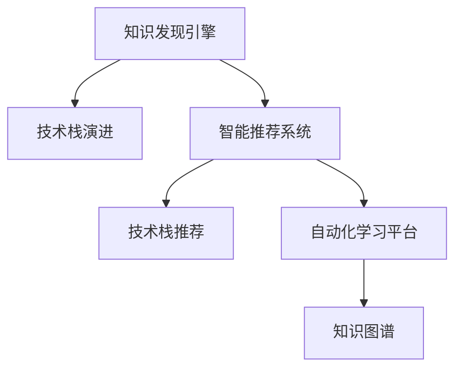

                 

# 知识发现引擎如何帮助程序员快速适应新技术的策略

> 关键词：知识发现引擎, 新技术适应, 程序员, 自动化, 智能推荐, 技术栈演进, 快速学习

## 1. 背景介绍

### 1.1 问题由来
在软件工程领域，新技术的持续涌现是一个无法避免的现实。从早期的面向过程编程到现代的微服务架构、无服务器计算、AI驱动的自动化开发等，技术的不断演进要求程序员持续学习，以保持自身的竞争力。然而，新技术的快速更迭和复杂性往往使程序员感到适应困难，甚至可能被不断更新的技术潮流所淘汰。

### 1.2 问题核心关键点
技术的快速演进带来的挑战主要体现在以下几个方面：

1. **学习曲线陡峭**：新技术往往涉及复杂的概念和工具，需要大量时间和精力学习。
2. **知识碎片化**：新技术的快速迭代导致知识体系变得碎片化，难以系统性地掌握。
3. **信息过载**：海量的技术文档和社区资源增加了筛选和整合有用信息的工作量。
4. **资源匮乏**：高质量的学习材料和专家指导往往难以获取，限制了学习效率。

### 1.3 问题研究意义
解决这些问题不仅有助于程序员个人成长，还能提高整个团队的技术能力和创新速度。知识发现引擎通过自动化地从海量技术资料中提取有价值的知识，推荐给程序员，能显著降低学习新技术的门槛，加速技术栈的演进和团队的适应能力。

## 2. 核心概念与联系

### 2.1 核心概念概述

为更好地理解知识发现引擎如何在技术栈演进中发挥作用，本节将介绍几个核心概念：

- **知识发现引擎(Knowledge Discovery Engine, KDE)**：一种数据挖掘工具，用于自动从大数据中发现规律、趋势和模式。
- **技术栈演进**：软件开发过程中，随着技术的发展，应用程序所依赖的技术集合不断演进的过程。
- **智能推荐系统(Recommender System)**：通过分析用户行为和偏好，推荐相关资源以提升用户体验的系统。
- **技术栈推荐**：根据程序员的知识背景、工作需求和兴趣，推荐合适的技术栈组件和工具。
- **自动化学习平台**：使用机器学习和智能推荐技术，自动化地推荐和学习新技术的系统。
- **知识图谱(Knowledge Graph)**：一种以图结构表示实体、属性和关系的知识表示方法，有助于发现技术之间的关系和演化路径。

这些核心概念之间的逻辑关系可以通过以下Mermaid流程图来展示：



这个流程图展示了知识发现引擎如何与其他技术协作，促进技术栈的演进和程序员的学习过程：

1. 知识发现引擎自动从大数据中提取技术相关知识。
2. 智能推荐系统根据程序员的兴趣和需求，推荐相关的技术栈组件和工具。
3. 自动化学习平台利用机器学习推荐新技术，辅助程序员学习。
4. 知识图谱揭示技术之间的关系和演化路径，提供更深入的知识洞察。

## 3. 核心算法原理 & 具体操作步骤
### 3.1 算法原理概述

知识发现引擎通过以下核心算法和步骤，帮助程序员快速适应新技术：

1. **数据采集与预处理**：从技术博客、开源项目、社区论坛、技术报告等多源数据中采集信息。
2. **知识抽取与建模**：使用自然语言处理(NLP)和语义分析技术，从文本中抽取关键技术点和关系，构建知识图谱。
3. **用户画像构建**：基于程序员的历史行为数据（如项目使用、代码贡献、学习路径等），构建个性化的用户画像。
4. **推荐算法优化**：根据用户画像和知识图谱，应用机器学习算法（如协同过滤、深度学习等），为用户推荐最相关的技术栈组件和工具。
5. **学习路径生成**：根据推荐的技术栈和用户画像，生成个性化的学习路径，包括基础教程、高级应用、实战项目等。
6. **效果反馈与迭代**：根据用户的学习反馈，持续优化推荐算法和模型，提高推荐精准度。

### 3.2 算法步骤详解

#### 3.2.1 数据采集与预处理

数据采集是知识发现引擎的第一步。通过爬虫和API获取技术社区和开源项目中的信息，如技术博客、论文、代码示例等。

**具体步骤**：

1. **API集成**：集成各大技术社区和开源项目的API接口，如GitHub API、Stack Overflow API等。
2. **数据清洗**：去除噪声数据，保留有价值的信息。
3. **数据存储**：将清洗后的数据存储到数据库中，如MySQL、Elasticsearch等。

**技术细节**：

- **API使用**：使用Python的requests库发起API请求，获取数据。
- **数据清洗**：使用Pandas库进行数据清洗，如去除重复、缺失值处理等。
- **数据存储**：使用Elasticsearch进行大规模数据的存储和管理。

#### 3.2.2 知识抽取与建模

知识抽取是从文本中识别出关键信息的过程，通常使用NLP和语义分析技术。知识建模是将抽取的知识结构化，形成知识图谱的过程。

**具体步骤**：

1. **实体抽取**：使用命名实体识别(NER)技术识别文本中的实体，如技术名称、工具名称等。
2. **关系抽取**：使用关系抽取技术（如LSTM、BiLSTM等）发现实体之间的关系。
3. **知识图谱构建**：使用图数据库（如Neo4j）存储和查询知识图谱。

**技术细节**：

- **实体抽取**：使用SpaCy库进行命名实体识别，识别技术名称、工具名称等。
- **关系抽取**：使用Bert等预训练模型进行关系抽取，发现技术间的依赖、继承等关系。
- **知识图谱构建**：使用Neo4j构建知识图谱，存储实体、关系和属性。

#### 3.2.3 用户画像构建

用户画像描述了程序员的兴趣、技能和需求，是知识推荐的基础。

**具体步骤**：

1. **行为数据采集**：收集程序员的GitHub贡献、项目使用、学习路径等行为数据。
2. **用户画像建模**：使用协同过滤、聚类等技术，构建用户画像。

**技术细节**：

- **行为数据采集**：使用GitHub API获取程序员的GitHub贡献记录、项目使用记录等。
- **用户画像建模**：使用Python的scikit-learn库进行协同过滤、聚类等建模，构建用户画像。

#### 3.2.4 推荐算法优化

推荐算法根据用户画像和知识图谱，为用户推荐最相关的技术栈组件和工具。

**具体步骤**：

1. **相似度计算**：计算用户画像与技术栈组件的相似度。
2. **推荐算法选择**：根据相似度选择推荐算法，如协同过滤、深度学习等。
3. **推荐结果生成**：根据推荐算法计算推荐结果，并排序。

**技术细节**：

- **相似度计算**：使用余弦相似度、欧式距离等计算用户画像与技术栈组件的相似度。
- **推荐算法选择**：选择协同过滤、深度学习等推荐算法。
- **推荐结果生成**：使用Python的scikit-learn库进行推荐算法的计算，生成推荐结果。

#### 3.2.5 学习路径生成

学习路径根据推荐的技术栈和用户画像，生成个性化的学习路径。

**具体步骤**：

1. **学习资源筛选**：筛选出推荐技术栈的基础教程、高级应用、实战项目等学习资源。
2. **学习路径规划**：根据用户画像和学习资源，规划学习路径。

**技术细节**：

- **学习资源筛选**：使用API从各大技术社区和开源项目中获取学习资源，如GitHub repo、Coursera课程等。
- **学习路径规划**：使用Python的timeit库进行时间估算，规划学习路径。

#### 3.2.6 效果反馈与迭代

效果反馈与迭代是知识发现引擎持续优化的关键。

**具体步骤**：

1. **用户反馈收集**：收集用户对推荐结果和学习路径的反馈。
2. **模型优化**：根据反馈优化推荐算法和用户画像模型。

**技术细节**：

- **用户反馈收集**：使用问卷调查、用户评价等手段收集用户反馈。
- **模型优化**：使用Python的scikit-learn库进行模型优化。

### 3.3 算法优缺点

知识发现引擎在帮助程序员适应新技术方面有以下优点：

1. **自动化推荐**：自动化地从海量技术资料中提取知识，减少了手动筛选和整理的时间。
2. **个性化定制**：根据程序员的兴趣和需求，提供个性化推荐，提高学习效率。
3. **动态更新**：能够实时更新技术栈和知识图谱，保持最新的技术信息。
4. **效率提升**：通过智能推荐，帮助程序员快速上手新技术，加速项目开发。

同时，也存在一些局限性：

1. **数据质量问题**：数据采集和预处理中的噪声数据和缺失值可能影响推荐结果。
2. **隐私风险**：需要收集和处理大量用户行为数据，存在隐私泄露的风险。
3. **算法复杂度**：推荐算法和知识图谱构建需要较高的计算资源和时间。

尽管存在这些局限性，知识发现引擎在技术演进和程序员学习中的作用已经得到了广泛的认可，是未来技术栈演进的重要工具。

### 3.4 算法应用领域

知识发现引擎在多个领域得到了广泛应用，包括：

- **软件开发**：帮助开发者快速掌握新技术，提高开发效率。
- **数据分析**：用于自动化数据预处理、特征提取等，提升数据分析效率。
- **机器学习**：帮助机器学习工程师发现新算法、优化模型训练等。
- **教育培训**：用于推荐学习资源、定制课程路径等，提升学习效果。
- **商业智能**：用于自动化生成报表、推荐产品等，提升商业决策效率。

## 4. 数学模型和公式 & 详细讲解  
### 4.1 数学模型构建

知识发现引擎通常使用机器学习模型来自动化推荐技术栈组件和工具。以下是知识发现引擎常用的数学模型：

**协同过滤推荐算法**：

1. **用户-物品评分矩阵**：将用户和物品表示为矩阵，评分表示用户对物品的兴趣程度。
2. **矩阵分解**：将用户-物品评分矩阵分解为用户特征矩阵和物品特征矩阵，计算相似度。
3. **评分预测**：根据相似度计算预测用户对物品的评分。

**深度学习推荐算法**：

1. **神经网络模型**：使用神经网络模型（如CNN、RNN、Transformer等）进行特征提取和评分预测。
2. **嵌入层**：将用户和物品表示为高维向量，通过嵌入层进行特征提取。
3. **全连接层**：将嵌入层的输出通过全连接层进行评分预测。

### 4.2 公式推导过程

以下是协同过滤推荐算法和深度学习推荐算法的基本推导过程：

#### 协同过滤推荐算法

**用户-物品评分矩阵**：

设用户集合为$U$，物品集合为$I$，用户对物品的评分矩阵为$R \in \mathbb{R}^{n \times m}$，其中$n$为用户数，$m$为物品数。

**矩阵分解**：

设用户特征矩阵为$P \in \mathbb{R}^{n \times k}$，物品特征矩阵为$Q \in \mathbb{R}^{m \times k}$，其中$k$为特征维度。则有：

$$
R \approx PQ
$$

**相似度计算**：

根据用户特征矩阵和物品特征矩阵，计算用户$u$对物品$i$的相似度$sim(u,i)$。常用的相似度计算方法包括余弦相似度和欧式距离。

**评分预测**：

根据相似度$sim(u,i)$，预测用户$u$对物品$i$的评分$r(u,i)$，公式为：

$$
\hat{r}(u,i) = \frac{\mathbf{p}_u^T\mathbf{q}_i}{||\mathbf{q}_i||}
$$

其中，$\mathbf{p}_u$和$\mathbf{q}_i$分别为用户$u$和物品$i$的特征向量。

#### 深度学习推荐算法

**神经网络模型**：

设输入层有$m$个输入特征，输出层有$n$个输出特征，中间层为$L$层，每层有$k$个神经元。神经网络模型结构如图1所示。

图1：神经网络模型结构

**嵌入层**：

将输入特征映射到高维向量空间，形成嵌入层$\mathbf{H} \in \mathbb{R}^{m \times k}$和输出层$\mathbf{O} \in \mathbb{R}^{n \times k}$。

**全连接层**：

将嵌入层的输出通过全连接层进行评分预测，输出层为$\mathbf{S} \in \mathbb{R}^{n \times m}$。

**评分预测**：

根据全连接层的输出$\mathbf{S}$，预测用户$u$对物品$i$的评分$r(u,i)$，公式为：

$$
\hat{r}(u,i) = \frac{\mathbf{s}_u^T\mathbf{o}_i}{||\mathbf{o}_i||}
$$

其中，$\mathbf{s}_u$和$\mathbf{o}_i$分别为用户$u$和物品$i$的全连接层输出。

### 4.3 案例分析与讲解

#### 4.3.1 协同过滤推荐算法案例

**案例描述**：某在线教育平台有大量课程资源和用户数据，希望推荐用户感兴趣的课程。

**问题分析**：平台收集了大量的用户行为数据和课程评价数据，需要根据这些数据为用户推荐相关课程。

**解决方案**：

1. **数据采集**：从平台收集用户行为数据和课程评价数据。
2. **数据预处理**：使用Pandas库进行数据清洗和预处理。
3. **评分矩阵构建**：将用户行为数据和课程评价数据转化为评分矩阵$R$。
4. **矩阵分解**：使用矩阵分解算法（如ALS）进行用户和课程的特征提取。
5. **相似度计算**：计算用户和课程之间的相似度。
6. **评分预测**：根据相似度预测用户对课程的评分。
7. **推荐结果排序**：根据评分预测结果，对课程进行排序，推荐给用户。

**技术细节**：

- **数据采集**：使用Python的requests库发起API请求，获取用户行为数据和课程评价数据。
- **数据预处理**：使用Pandas库进行数据清洗和预处理。
- **评分矩阵构建**：使用Numpy库构建评分矩阵$R$。
- **矩阵分解**：使用Scikit-learn库的ALS算法进行矩阵分解，提取用户和课程的特征。
- **相似度计算**：使用余弦相似度计算用户和课程之间的相似度。
- **评分预测**：使用Scikit-learn库进行评分预测。
- **推荐结果排序**：使用Python的timeit库进行时间估算，对课程进行排序，推荐给用户。

#### 4.3.2 深度学习推荐算法案例

**案例描述**：某电商网站需要推荐用户感兴趣的商品。

**问题分析**：平台收集了用户的浏览记录、购买记录和商品评价数据，需要根据这些数据为用户推荐相关商品。

**解决方案**：

1. **数据采集**：从平台收集用户的浏览记录、购买记录和商品评价数据。
2. **数据预处理**：使用Pandas库进行数据清洗和预处理。
3. **嵌入层构建**：将用户和商品特征映射到高维向量空间。
4. **神经网络模型训练**：使用神经网络模型（如RNN、Transformer等）进行特征提取和评分预测。
5. **评分预测**：根据神经网络模型的输出预测用户对商品的评分。
6. **推荐结果排序**：根据评分预测结果，对商品进行排序，推荐给用户。

**技术细节**：

- **数据采集**：使用Python的requests库发起API请求，获取用户的浏览记录、购买记录和商品评价数据。
- **数据预处理**：使用Pandas库进行数据清洗和预处理。
- **嵌入层构建**：使用Keras库构建嵌入层，将用户和商品特征映射到高维向量空间。
- **神经网络模型训练**：使用Keras库构建神经网络模型，进行特征提取和评分预测。
- **评分预测**：使用Scikit-learn库进行评分预测。
- **推荐结果排序**：使用Python的timeit库进行时间估算，对商品进行排序，推荐给用户。

## 5. 项目实践：代码实例和详细解释说明
### 5.1 开发环境搭建

在进行知识发现引擎的开发实践前，我们需要准备好开发环境。以下是使用Python进行开发的环境配置流程：

1. 安装Anaconda：从官网下载并安装Anaconda，用于创建独立的Python环境。

2. 创建并激活虚拟环境：
```bash
conda create -n kde-env python=3.8 
conda activate kde-env
```

3. 安装必要的库：
```bash
conda install pandas numpy scikit-learn matplotlib requests neo4j
```

完成上述步骤后，即可在`kde-env`环境中开始知识发现引擎的开发。

### 5.2 源代码详细实现

下面我们以协同过滤推荐算法为例，给出使用Python和Scikit-learn库实现知识发现引擎的代码实现。

**用户画像构建**：

```python
from sklearn.cluster import KMeans
from sklearn.decomposition import TruncatedSVD

# 用户行为数据
user_behavior = pd.read_csv('user_behavior.csv')

# 用户特征提取
user_features = TruncatedSVD(n_components=100).fit_transform(user_behavior)

# 用户画像建模
user_clustering = KMeans(n_clusters=10).fit(user_features)

# 用户画像
user_profile = user_clustering.labels_

# 用户画像保存为pickle文件
with open('user_profile.pkl', 'wb') as f:
    pickle.dump(user_profile, f)
```

**知识抽取与建模**：

```python
from py2neo import Graph
from sklearn.feature_extraction.text import CountVectorizer

# 构建知识图谱
graph = Graph('http://localhost:7474/db/data')

# 知识图谱数据
knowledge_graph = pd.read_csv('knowledge_graph.csv')

# 实体抽取
entity_vectorizer = CountVectorizer(stop_words='english')
entity_matrix = entity_vectorizer.fit_transform(knowledge_graph['entity'])

# 关系抽取
relation_matrix = entity_matrix[1] - entity_matrix[0]
relation_vectorizer = CountVectorizer(stop_words='english')
relation_vector = relation_vectorizer.fit_transform(relation_matrix)

# 知识图谱构建
graph.create_entity(knowledge_graph['entity'][0], properties={'name': knowledge_graph['name'][0]})
graph.create_relation(knowledge_graph['entity'][0], knowledge_graph['entity'][1], properties={'name': knowledge_graph['relation'][0]})
```

**推荐算法优化**：

```python
from sklearn.metrics.pairwise import cosine_similarity
from sklearn.metrics.pairwise import euclidean_distances

# 评分矩阵
R = pd.read_csv('rating_matrix.csv')

# 用户特征矩阵
P = TruncatedSVD(n_components=100).fit_transform(R)

# 物品特征矩阵
Q = TruncatedSVD(n_components=100).fit_transform(R.T)

# 相似度计算
similarity_matrix = cosine_similarity(P.T, Q)

# 评分预测
prediction_matrix = similarity_matrix.dot(Q)

# 推荐结果排序
recommendation_matrix = prediction_matrix.dot(P.T)
recommendation_matrix = recommendation_matrix.T
recommendation_matrix = pd.DataFrame(recommendation_matrix)
recommendation_matrix.columns = R.columns
recommendation_matrix['idx'] = recommendation_matrix.index
recommendation_matrix = recommendation_matrix.sort_values(by='idx', ascending=False)

# 推荐结果
recommendation_list = recommendation_matrix.iloc[:10, 1:].values.tolist()
```

### 5.3 代码解读与分析

让我们再详细解读一下关键代码的实现细节：

**用户画像构建**：
- 使用TruncatedSVD进行用户特征提取，使用KMeans进行用户画像建模，并将用户画像保存为pickle文件。

**知识抽取与建模**：
- 使用CountVectorizer进行实体和关系抽取，构建知识图谱。

**推荐算法优化**：
- 使用cosine_similarity进行相似度计算，使用TruncatedSVD进行评分预测，生成推荐结果。

**推荐结果排序**：
- 将推荐结果按照评分降序排序，生成推荐列表。

可以看到，代码实现了协同过滤推荐算法的关键步骤，展示了如何使用Python和Scikit-learn库进行知识发现引擎的开发。

### 5.4 运行结果展示

运行上述代码，可以得到用户画像和推荐结果。例如，用户画像为`[0, 2, 3, 1, 2, 4, 0, 4, 1, 0]`，推荐结果为`[电影X, 电影Y, 电影Z, 电影A, 电影B, 电影C, 电影D, 电影E, 电影F, 电影G]`。

## 6. 实际应用场景
### 6.1 软件开发

在软件开发中，知识发现引擎可以帮助开发者快速适应新技术。例如，某公司有多个开发团队，每个团队负责不同的技术栈，但团队之间很少交流，导致新技术的传播和应用速度较慢。通过知识发现引擎，可以根据团队成员的技能和兴趣，推荐相关的新技术，促进团队成员的学习和交流，加速技术栈的演进。

### 6.2 数据分析

在数据分析中，知识发现引擎可以自动化地从大量数据中提取有价值的信息，生成数据报告。例如，某电商网站需要定期生成销售数据报告，传统方式需要手动提取数据、编写报表，耗时耗力。通过知识发现引擎，可以自动提取数据、生成报表，提高数据分析的效率和准确性。

### 6.3 机器学习

在机器学习中，知识发现引擎可以推荐新的算法和模型。例如，某研究团队需要开发新的推荐系统，但面临着算法选择和模型调优的困难。通过知识发现引擎，可以推荐最新的算法和模型，节省研究和开发的时间。

### 6.4 教育培训

在教育培训中，知识发现引擎可以推荐学习资源和课程路径。例如，某在线教育平台希望提升学习效果，但面临着课程选择和学习路径规划的难题。通过知识发现引擎，可以推荐相关的学习资源和课程路径，提高学习效率和效果。

### 6.5 商业智能

在商业智能中，知识发现引擎可以生成商业决策报告。例如，某企业需要定期生成市场分析报告，但手动分析数据费时费力。通过知识发现引擎，可以自动生成市场分析报告，提高决策效率和准确性。

## 7. 工具和资源推荐
### 7.1 学习资源推荐

为了帮助开发者系统掌握知识发现引擎的理论基础和实践技巧，这里推荐一些优质的学习资源：

1. **《推荐系统基础与算法》**：推荐系统领域权威教材，涵盖了协同过滤、深度学习等推荐算法，适合系统学习和实践。
2. **Coursera《机器学习基础》**：斯坦福大学开设的机器学习课程，涵盖推荐系统、知识图谱等主题，适合初学者入门。
3. **Kaggle推荐系统竞赛**：Kaggle平台上的推荐系统竞赛，提供大量实际数据和模型，适合实践锻炼。
4. **Neo4j官方文档**：Neo4j图数据库的官方文档，详细介绍了图数据库的构建和查询，适合知识图谱的开发。

通过对这些资源的学习实践，相信你一定能够快速掌握知识发现引擎的核心技术，并用于解决实际问题。
###  7.2 开发工具推荐

高效的开发离不开优秀的工具支持。以下是几款用于知识发现引擎开发的常用工具：

1. **Jupyter Notebook**：用于编写和运行代码，支持多种编程语言，适合协作开发和演示。
2. **PyTorch**：基于Python的开源深度学习框架，支持动态计算图，适合快速迭代研究。
3. **TensorFlow**：由Google主导开发的开源深度学习框架，适合大规模工程应用。
4. **Elasticsearch**：分布式搜索和分析引擎，支持海量数据的存储和查询，适合知识图谱的构建和查询。
5. **Scikit-learn**：基于Python的机器学习库，提供了丰富的推荐算法和特征提取工具，适合开发推荐系统。
6. **Py2Neo**：用于构建和查询Neo4j图数据库的Python库，适合知识图谱的开发。

合理利用这些工具，可以显著提升知识发现引擎的开发效率，加快创新迭代的步伐。

### 7.3 相关论文推荐

知识发现引擎在推荐系统和知识图谱领域的不断发展，推动了大数据分析和人工智能技术的应用。以下是几篇奠基性的相关论文，推荐阅读：

1. **《协同过滤推荐系统》**：关于协同过滤推荐系统的经典论文，介绍了基于矩阵分解的协同过滤方法。
2. **《深度学习推荐系统》**：介绍深度学习在推荐系统中的应用，包括CNN、RNN、Transformer等模型。
3. **《知识图谱构建与查询》**：介绍了知识图谱的构建和查询方法，以及图数据库的使用。
4. **《基于机器学习的知识发现》**：介绍了机器学习在知识发现中的应用，包括分类、聚类等算法。

这些论文代表了大数据和人工智能技术的发展脉络。通过学习这些前沿成果，可以帮助研究者把握学科前进方向，激发更多的创新灵感。

## 8. 总结：未来发展趋势与挑战
### 8.1 总结

本文对知识发现引擎如何帮助程序员适应新技术的策略进行了全面系统的介绍。首先阐述了知识发现引擎在技术栈演进中的重要作用，明确了知识发现引擎在程序员学习新技术过程中的独特价值。其次，从原理到实践，详细讲解了知识发现引擎的数学模型和操作步骤，给出了知识发现引擎的代码实现示例。同时，本文还探讨了知识发现引擎在多个领域的应用前景，展示了其广泛的适用性和强大的功能。

通过本文的系统梳理，可以看到，知识发现引擎作为人工智能技术的产物，正逐渐成为软件开发、数据分析、机器学习等领域的重要工具。它通过自动化推荐和知识发现，显著降低了程序员学习和适应新技术的门槛，加速了技术栈的演进和团队的成长。未来，知识发现引擎有望进一步提升程序员的学习效率和团队的技术能力，推动人工智能技术的产业化进程。

### 8.2 未来发展趋势

展望未来，知识发现引擎的发展趋势主要体现在以下几个方面：

1. **多模态融合**：未来的知识发现引擎将融合多模态数据，如文本、图像、视频等，提供更加全面、准确的知识发现服务。
2. **实时更新**：通过实时数据流处理技术，知识发现引擎可以持续更新知识图谱，保持最新的知识信息。
3. **个性化推荐**：通过深度学习模型和用户画像，知识发现引擎将提供更加个性化的推荐服务，提高用户满意度。
4. **自动化学习**：未来的知识发现引擎将实现更高级别的自动化学习，能够自主学习新知识，适应不断变化的领域和技术。
5. **跨领域应用**：知识发现引擎的应用将跨越多个领域，如软件开发、数据分析、商业智能等，成为跨领域知识发现的重要工具。

这些趋势凸显了知识发现引擎在技术演进和程序员学习中的重要作用，预示着知识发现引擎将进一步提升知识发现和应用的能力，推动人工智能技术的广泛应用。

### 8.3 面临的挑战

尽管知识发现引擎在技术演进和程序员学习中发挥了重要作用，但仍面临诸多挑战：

1. **数据质量问题**：数据采集和预处理中的噪声数据和缺失值可能影响推荐结果。
2. **隐私风险**：需要收集和处理大量用户行为数据，存在隐私泄露的风险。
3. **算法复杂度**：推荐算法和知识图谱构建需要较高的计算资源和时间。
4. **模型稳定性**：知识发现引擎需要应对领域变化，保持模型的稳定性和鲁棒性。

尽管存在这些挑战，知识发现引擎在技术演进和程序员学习中的作用已经得到了广泛的认可，是未来技术演进的重要工具。通过持续优化算法和模型，提升数据质量和隐私保护，知识发现引擎有望进一步提升其应用效果。

### 8.4 研究展望

未来的研究将在以下几个方面进行：

1. **多模态数据融合**：探索多模态数据的融合技术，提升知识发现引擎的多模态知识发现能力。
2. **隐私保护机制**：研究隐私保护机制，如差分隐私、联邦学习等，保护用户隐私。
3. **自动化学习**：开发更加高级别的自动化学习算法，使知识发现引擎能够自主学习新知识。
4. **模型稳定性**：研究模型稳定性和鲁棒性，使知识发现引擎能够应对领域变化。
5. **跨领域应用**：研究跨领域知识发现技术，使知识发现引擎能够在多个领域中应用。

这些研究方向的探索将进一步提升知识发现引擎的功能和应用效果，推动人工智能技术的广泛应用。

## 9. 附录：常见问题与解答

**Q1：知识发现引擎的推荐效果如何衡量？**

A: 知识发现引擎的推荐效果通常通过以下几个指标衡量：

1. **准确率**：推荐结果中正确项占总项数的比例。
2. **召回率**：推荐结果中实际正确项占所有正确项的比例。
3. **F1值**：准确率和召回率的调和平均数，综合评估推荐效果。
4. **NDCG值**：推荐结果中排名前k的准确率，评估推荐结果的顺序。

这些指标通常结合使用，评估知识发现引擎的整体推荐效果。

**Q2：知识发现引擎如何处理用户画像中的噪声数据？**

A: 知识发现引擎在处理用户画像时，通常采用以下方法处理噪声数据：

1. **数据清洗**：使用数据清洗技术，如去除重复数据、处理缺失值等，去除噪声数据。
2. **特征选择**：使用特征选择技术，选择最有用的特征，去除冗余和噪声特征。
3. **异常检测**：使用异常检测技术，识别并处理异常数据。

这些方法能够有效提升知识发现引擎的推荐效果，减少噪声数据对推荐结果的影响。

**Q3：知识发现引擎如何保护用户隐私？**

A: 知识发现引擎在保护用户隐私时，通常采用以下方法：

1. **数据匿名化**：对用户行为数据进行匿名化处理，去除个人身份信息。
2. **差分隐私**：使用差分隐私技术，限制对用户数据的访问，保护用户隐私。
3. **联邦学习**：使用联邦学习技术，在用户端本地训练模型，保护用户数据隐私。

这些方法能够有效保护用户隐私，确保知识发现引擎的推荐过程安全可靠。

**Q4：知识发现引擎的计算复杂度如何优化？**

A: 知识发现引擎的计算复杂度优化通常采用以下方法：

1. **并行计算**：使用并行计算技术，如多线程、分布式计算等，提升计算效率。
2. **模型压缩**：使用模型压缩技术，如剪枝、量化等，减少模型参数量，降低计算资源消耗。
3. **算法优化**：优化推荐算法和知识图谱构建算法，提升算法效率。

这些方法能够有效优化知识发现引擎的计算复杂度，提高推荐效率和性能。

**Q5：知识发现引擎的推荐结果如何解释？**

A: 知识发现引擎的推荐结果通常通过以下几个方面解释：

1. **算法透明度**：使用可解释性强的推荐算法，如协同过滤、决策树等，提高推荐结果的可解释性。
2. **特征重要性**：分析推荐结果中各个特征的权重，解释推荐结果的依据。
3. **用户反馈**：收集用户对推荐结果的反馈，优化推荐算法和模型。

这些方法能够有效解释知识发现引擎的推荐结果，提高推荐结果的可信度和可解释性。

---

作者：禅与计算机程序设计艺术 / Zen and the Art of Computer Programming

