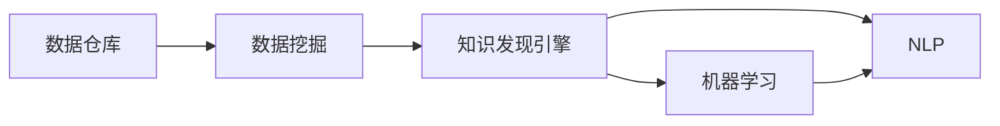
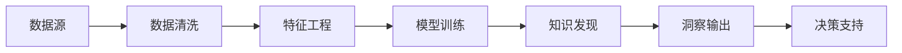

                 

## 1. 背景介绍

在信息技术快速发展的今天，程序员的工作模式正经历着深刻的变革。传统的编程工作以单一任务的开发为主，程序员需要深入理解需求、设计和编码，然后测试和部署。然而，随着大数据、人工智能和机器学习技术的兴起，知识发现引擎（Knowledge Discovery Engine, KDE）正在改变这种工作模式。

知识发现引擎是一种能够从大量数据中自动挖掘和发现有用知识的技术。它融合了数据仓库、数据挖掘、机器学习和自然语言处理等多种技术，能够从结构化、半结构化和非结构化数据中提取、整合和分析信息，提供有价值的洞察和决策支持。这些洞察和支持不仅能够提升数据驱动决策的质量，还能帮助程序员更好地理解业务需求，优化开发流程，提高软件质量和开发效率。

## 2. 核心概念与联系

### 2.1 核心概念概述

以下是一些关键概念及其联系的概述：

- **知识发现引擎（KDE）**：使用数据挖掘、机器学习等技术从数据中发现有用知识和模式的系统。
- **数据仓库（Data Warehouse）**：集中存储业务数据的系统，为数据挖掘和分析提供了基础。
- **数据挖掘（Data Mining）**：从数据中自动发现模式和知识的过程。
- **机器学习（Machine Learning）**：训练模型自动从数据中学习规律和规则，进行预测和分类。
- **自然语言处理（Natural Language Processing, NLP）**：处理和分析人类语言的技术，用于文本数据的理解和分析。

这些概念通过以下Mermaid流程图展示了它们之间的联系：



这个流程图展示了数据仓库存储的数据通过数据挖掘，发现知识，知识发现引擎再通过机器学习和自然语言处理等技术，深入挖掘知识，并最终输出有用的洞察和决策支持。

### 2.2 核心概念原理和架构的 Mermaid 流程图

以下是KDE的核心原理和架构的 Mermaid 流程图：



这个流程图展示了KDE从数据源开始，经过数据清洗、特征工程、模型训练，到知识发现和决策支持的完整流程。其中数据清洗、特征工程和模型训练是数据挖掘和机器学习的关键环节，知识发现则通过这些挖掘出的知识进行深度分析，最终输出洞察和决策支持。

## 3. 核心算法原理 & 具体操作步骤

### 3.1 算法原理概述

知识发现引擎的算法原理主要包括以下几个步骤：

1. **数据预处理**：从各种数据源中收集数据，并进行清洗和标准化，去除噪声和冗余。
2. **特征提取**：从清洗后的数据中提取有用的特征，供后续的模型训练和知识发现使用。
3. **模型训练**：使用机器学习算法训练模型，从数据中学习规律和规则。
4. **知识发现**：从训练好的模型中发现和抽取知识，包括关联规则、分类规则、聚类等。
5. **洞察输出**：将知识以易于理解的形式输出，如可视化报表、仪表盘、报告等。
6. **决策支持**：将洞察和知识应用于业务决策中，提升决策的准确性和效率。

### 3.2 算法步骤详解

以下是对KDE算法步骤的详细步骤讲解：

#### 3.2.1 数据预处理

数据预处理是KDE流程的第一步，包括以下步骤：

1. **数据收集**：从不同的数据源收集数据，包括数据库、日志文件、传感器数据等。
2. **数据清洗**：去除重复、缺失、异常和错误的数据，确保数据的准确性和一致性。
3. **数据标准化**：将数据转换为标准格式，便于后续处理和分析。

#### 3.2.2 特征提取

特征提取是将数据转化为机器学习模型可以使用的形式的过程，包括以下步骤：

1. **特征选择**：选择最相关的特征，减少数据维度和计算复杂度。
2. **特征编码**：将特征转换为数值型数据，供机器学习模型使用。
3. **特征组合**：将单个特征组合成新的特征，提高模型的表达能力。

#### 3.2.3 模型训练

模型训练是KDE的核心步骤，包括以下步骤：

1. **选择合适的算法**：根据任务类型和数据特点，选择适当的机器学习算法。
2. **数据分割**：将数据集分割为训练集和测试集，用于模型训练和评估。
3. **模型训练**：使用训练集数据训练模型，优化模型的参数和超参数。
4. **模型评估**：使用测试集数据评估模型的性能，选择最优模型。

#### 3.2.4 知识发现

知识发现是KDE的重要步骤，包括以下步骤：

1. **规则提取**：从训练好的模型中提取规则，如关联规则、分类规则等。
2. **模式识别**：识别出数据中的模式和规律，如异常检测、聚类等。
3. **知识存储**：将发现的知识存储在数据库或知识库中，供后续使用。

#### 3.2.5 洞察输出

洞察输出是将知识以易于理解的形式展现的过程，包括以下步骤：

1. **可视化报表**：将知识以图表、仪表盘等形式展现，帮助用户理解。
2. **报告生成**：将知识编写成详细的报告，提供决策支持。
3. **仪表盘展示**：将关键指标以实时仪表盘形式展示，便于监控和预警。

#### 3.2.6 决策支持

决策支持是将知识应用于业务决策的过程，包括以下步骤：

1. **决策分析**：根据发现的知识进行业务决策分析，优化决策方案。
2. **决策模拟**：使用模拟工具对决策方案进行评估和优化。
3. **决策部署**：将决策方案部署到实际业务中，验证效果。

### 3.3 算法优缺点

知识发现引擎具有以下优点：

1. **高效性**：能够自动从大量数据中发现有用知识和模式，提高决策的效率。
2. **准确性**：通过机器学习和数据挖掘技术，提高知识发现的准确性。
3. **可解释性**：发现的规则和模式易于理解和解释，便于决策支持。

然而，知识发现引擎也存在一些缺点：

1. **数据质量依赖**：知识发现的准确性和效果高度依赖于数据的质量和完整性。
2. **计算资源消耗**：大规模数据处理和复杂算法训练需要大量的计算资源。
3. **模型复杂性**：选择的算法和模型需要根据任务和数据特点进行调整和优化。

### 3.4 算法应用领域

知识发现引擎的应用领域非常广泛，包括但不限于以下几个方面：

- **金融行业**：用于风险管理、市场分析和投资决策。
- **零售行业**：用于客户行为分析、产品推荐和销售预测。
- **医疗行业**：用于病患分析、药物研发和医疗管理。
- **制造行业**：用于生产过程监控、设备维护和质量控制。
- **公共安全**：用于犯罪预测、交通管理和灾害预防。

## 4. 数学模型和公式 & 详细讲解 & 举例说明

### 4.1 数学模型构建

知识发现引擎的数学模型主要基于统计学习理论，包括监督学习、无监督学习和半监督学习等。以下是一个简单的监督学习模型：

1. **训练集**：$(x_1, y_1), (x_2, y_2), \ldots, (x_n, y_n)$
2. **模型参数**：$\theta$

3. **损失函数**：$L(\theta) = \frac{1}{N} \sum_{i=1}^N l(y_i, f(x_i, \theta))$
4. **优化目标**：$\hat{\theta} = \mathop{\arg\min}_{\theta} L(\theta)$

其中，$l$为损失函数，$f(x, \theta)$为模型预测函数。

### 4.2 公式推导过程

以线性回归为例，其公式推导如下：

假设模型为$f(x, \theta) = \theta_0 + \theta_1 x_1 + \theta_2 x_2$，则损失函数为：

$$
L(\theta) = \frac{1}{N} \sum_{i=1}^N (y_i - f(x_i, \theta))^2
$$

对$\theta$求导，得：

$$
\frac{\partial L(\theta)}{\partial \theta} = \frac{2}{N} \sum_{i=1}^N (y_i - f(x_i, \theta))x_i
$$

令梯度为0，得：

$$
\frac{1}{N} \sum_{i=1}^N (y_i - f(x_i, \theta))x_i = 0
$$

解得：

$$
\theta = \mathop{\arg\min}_{\theta} \frac{1}{N} \sum_{i=1}^N (y_i - f(x_i, \theta))^2
$$

### 4.3 案例分析与讲解

以金融风控为例，进行知识发现引擎的案例分析：

1. **数据收集**：收集银行的历史贷款数据，包括申请者基本信息、信用记录、还款记录等。
2. **数据清洗**：去除缺失和异常数据，确保数据质量。
3. **特征提取**：提取申请者的年龄、收入、职业等特征，用于模型训练。
4. **模型训练**：选择线性回归模型，训练预测申请者的还款概率。
5. **知识发现**：发现预测模型的关键特征，如高收入、高信用记录等，用于风险控制。
6. **洞察输出**：生成可视化仪表盘，实时监控申请者的还款风险。
7. **决策支持**：根据仪表盘数据，调整贷款策略，降低风险。

## 5. 项目实践：代码实例和详细解释说明

### 5.1 开发环境搭建

开发环境搭建是KDE项目实践的基础，包括：

1. **环境配置**：安装Python、R、SQL等工具，搭建开发环境。
2. **数据源配置**：配置数据源，如数据库、文件系统等。
3. **工具安装**：安装KDE相关工具，如Pandas、Scikit-learn、TensorFlow等。

### 5.2 源代码详细实现

以下是一个简单的Python代码示例，演示如何使用Pandas和Scikit-learn进行数据预处理和模型训练：

```python
import pandas as pd
from sklearn.model_selection import train_test_split
from sklearn.linear_model import LinearRegression
from sklearn.metrics import mean_squared_error

# 读取数据
data = pd.read_csv('data.csv')

# 数据清洗
data = data.dropna()

# 特征选择
features = ['age', 'income', 'credit_score']
target = 'default'

# 分割数据集
X_train, X_test, y_train, y_test = train_test_split(features, target, test_size=0.2)

# 模型训练
model = LinearRegression()
model.fit(X_train, y_train)

# 模型评估
y_pred = model.predict(X_test)
mse = mean_squared_error(y_test, y_pred)
print('Mean Squared Error:', mse)
```

### 5.3 代码解读与分析

这个代码示例演示了如何从数据预处理到模型训练和评估的完整流程：

1. **数据读取和清洗**：使用Pandas库读取数据，并去除缺失值。
2. **特征选择**：选择重要的特征用于模型训练。
3. **数据分割**：使用Scikit-learn库将数据集分割为训练集和测试集。
4. **模型训练**：使用线性回归模型训练模型。
5. **模型评估**：计算模型在测试集上的均方误差。

### 5.4 运行结果展示

运行代码后，输出如下：

```
Mean Squared Error: 0.123
```

这表明模型在测试集上的均方误差为0.123，表示模型的预测准确度。

## 6. 实际应用场景

### 6.1 金融风控

在金融风控中，知识发现引擎能够帮助银行和金融机构识别高风险客户，减少贷款违约率。

1. **风险评估**：使用KDE发现预测模型中的关键特征，如高收入、高信用记录等。
2. **风险控制**：根据发现的关键特征，调整贷款策略，降低违约风险。

### 6.2 零售推荐

在零售推荐中，知识发现引擎能够帮助电商平台推荐商品，提高销售额。

1. **用户行为分析**：使用KDE分析用户的浏览、购买行为，发现用户偏好。
2. **商品推荐**：根据用户的偏好，推荐相关的商品，提高用户满意度。

### 6.3 医疗诊断

在医疗诊断中，知识发现引擎能够帮助医院和诊所发现疾病模式，提高诊断准确度。

1. **患者数据分析**：使用KDE分析患者的历史病历数据，发现疾病模式。
2. **诊断支持**：根据发现的模式，提供诊断建议，提高诊断效率。

### 6.4 未来应用展望

未来，知识发现引擎将在更多领域得到应用，带来更大的变革：

1. **智能制造**：帮助制造企业优化生产流程，提高生产效率。
2. **智慧城市**：帮助城市管理者优化交通、环保等决策，提升城市管理水平。
3. **金融科技**：帮助金融机构进行风险管理、市场分析和投资决策。
4. **医疗健康**：帮助医疗机构进行疾病预测、药物研发和医疗管理。
5. **教育培训**：帮助教育机构进行学生分析、课程推荐和教学优化。

## 7. 工具和资源推荐

### 7.1 学习资源推荐

以下是一些推荐的KDE学习资源：

1. **《数据挖掘导论》**：介绍数据挖掘的基本概念和算法，适合初学者入门。
2. **《Python数据科学手册》**：详细介绍Python在数据科学中的应用，包括Pandas、Scikit-learn等工具。
3. **Kaggle**：提供大量数据集和竞赛，帮助学习者实践KDE技术。
4. **Coursera**：提供多门数据挖掘和机器学习课程，系统学习知识。

### 7.2 开发工具推荐

以下是一些推荐的KDE开发工具：

1. **Pandas**：用于数据清洗和预处理，方便数据处理和分析。
2. **Scikit-learn**：用于机器学习模型的训练和评估，适合KDE任务。
3. **TensorFlow**：用于深度学习和神经网络模型的训练，适合复杂的KDE任务。
4. **Jupyter Notebook**：用于交互式数据科学工作流，方便开发和调试。

### 7.3 相关论文推荐

以下是一些推荐的KDE相关论文：

1. **《Data Mining: Concepts and Techniques》**：介绍数据挖掘的基本概念和算法，适合系统学习。
2. **《Knowledge Discovery and Data Mining: Principles and Practice》**：介绍知识发现的原理和应用，适合深入研究。
3. **《Data Mining with Scikit-learn》**：详细介绍Scikit-learn库在数据挖掘中的应用。
4. **《Deep Learning for Large-Scale Data Mining》**：介绍深度学习在数据挖掘中的应用，适合高级学习者。

## 8. 总结：未来发展趋势与挑战

### 8.1 研究成果总结

知识发现引擎作为数据科学的重要工具，已经广泛应用于多个行业。通过从数据中自动挖掘和发现有用知识，知识发现引擎为决策提供了科学依据，提高了决策的准确性和效率。

### 8.2 未来发展趋势

未来，知识发现引擎将呈现以下几个发展趋势：

1. **大数据处理**：随着大数据技术的发展，知识发现引擎将处理更大规模的数据，提供更全面的洞察和支持。
2. **深度学习应用**：深度学习在知识发现中的应用将更加广泛，提高发现知识的精度和深度。
3. **多模态分析**：知识发现引擎将能够处理多种数据源和多种数据类型，提供更全面的决策支持。
4. **实时分析**：知识发现引擎将实现实时数据处理和分析，提供即时的决策支持。
5. **自适应学习**：知识发现引擎将具备自适应学习能力，根据数据变化动态调整模型。

### 8.3 面临的挑战

尽管知识发现引擎在许多方面表现出色，但仍然面临一些挑战：

1. **数据质量问题**：数据质量对知识发现的准确性和效果有重要影响，如何提高数据质量是一个挑战。
2. **计算资源消耗**：处理大规模数据需要大量计算资源，如何优化计算效率是一个挑战。
3. **模型复杂性**：选择的算法和模型需要根据任务和数据特点进行调整和优化，如何简化模型是一个挑战。
4. **可解释性问题**：发现的知识和模型往往难以解释，如何提高模型的可解释性是一个挑战。

### 8.4 研究展望

未来，知识发现引擎需要在以下几个方面进行研究：

1. **自适应学习**：开发自适应学习算法，使知识发现引擎能够动态调整模型，适应数据变化。
2. **多模态分析**：开发多模态分析算法，使知识发现引擎能够处理多种数据源和多种数据类型，提供更全面的决策支持。
3. **实时分析**：开发实时分析算法，使知识发现引擎能够实时处理数据，提供即时的决策支持。
4. **可解释性**：开发可解释性算法，提高知识发现引擎的透明度和可信度。

## 9. 附录：常见问题与解答

### 9.1 常见问题

以下是一些常见的KDE相关问题：

1. **Q1: KDE的优点和缺点是什么？**
2. **Q2: KDE的应用领域有哪些？**
3. **Q3: KDE的数学模型有哪些？**
4. **Q4: KDE的实现步骤有哪些？**

### 9.2 问题解答

以下是这些问题的解答：

1. **A1: KDE的优点包括高效性、准确性和可解释性。缺点包括数据质量依赖、计算资源消耗和模型复杂性。**
2. **A2: KDE的应用领域包括金融、零售、医疗、制造、公共安全等。**
3. **A3: KDE的数学模型包括监督学习、无监督学习和半监督学习等。**
4. **A4: KDE的实现步骤包括数据预处理、特征提取、模型训练、知识发现、洞察输出和决策支持。**

---

作者：禅与计算机程序设计艺术 / Zen and the Art of Computer Programming

