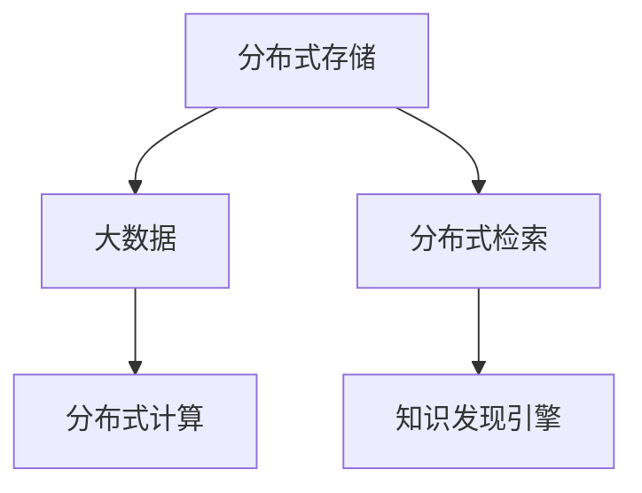

                 

# 知识发现引擎的分布式存储与检索技术

> 关键词：分布式存储, 知识发现引擎, 检索技术, 大数据, 分布式计算

## 1. 背景介绍

### 1.1 问题由来
随着互联网的普及和数字化进程的加快，大量结构化和非结构化数据被不断产生和存储。数据量的激增为各行各业带来了巨大的机遇和挑战。如何高效存储和利用这些数据，挖掘其中的知识与价值，成为了当前信息化建设的重要任务之一。

知识发现引擎(Knowledge Discovery Engine, KDE)是一种用于从大规模数据中提取知识的工具。它能够自动或半自动地分析数据，从中发现潜在的知识模式、趋势和关联。知识发现引擎在金融、医疗、零售、电子商务等众多领域都得到了广泛的应用。

然而，数据规模的不断扩大给知识发现引擎带来了新的挑战。如何高效、可靠地存储和检索海量数据，成为了知识发现引擎发展的核心问题。分布式存储与检索技术应运而生，成为解决大规模数据管理难题的重要手段。

### 1.2 问题核心关键点
分布式存储与检索技术是指在大规模数据环境中，通过分布式计算和存储的方式，实现数据的高效存储、快速检索和知识发现的过程。该技术的核心在于：

- 数据分布式存储：通过将数据分散存储在多台服务器上，减少单点故障，提高系统可靠性。
- 数据分布式检索：通过分布式算法和架构设计，实现数据的高效查询和检索。
- 知识发现引擎：利用分布式存储与检索技术，快速分析大规模数据，发现其中的知识与模式。

本文将详细介绍分布式存储与检索技术的原理、算法和实现，结合实际应用场景，探讨其在知识发现引擎中的应用。

## 2. 核心概念与联系

### 2.1 核心概念概述

为更好地理解分布式存储与检索技术，本节将介绍几个密切相关的核心概念：

- 分布式存储(Distributed Storage)：将数据分散存储在多台服务器上，通过网络传输实现数据的访问和更新。
- 分布式检索(Distributed Retrieval)：通过分布式算法和架构，实现数据的快速检索和查询。
- 知识发现引擎(Knowledge Discovery Engine, KDE)：一种数据挖掘工具，用于从大规模数据中自动或半自动地发现知识模式和关联。
- 大数据(Big Data)：指规模庞大、复杂多样、高速变化的数据集，需要通过分布式技术进行管理和分析。
- 分布式计算(Distributed Computing)：通过将任务分散在多台计算机上并行执行，提高计算效率和系统可靠性。

这些核心概念之间的逻辑关系可以通过以下Mermaid流程图来展示：



这个流程图展示了大规模数据管理与分析的核心流程：

1. 数据通过分布式存储分散存储在多台服务器上。
2. 使用分布式检索技术，快速检索所需数据。
3. 通过分布式计算技术，对数据进行高效分析。
4. 利用知识发现引擎，发现数据中的知识与模式。

这些核心概念共同构成了大数据环境下的数据管理和分析框架，使得知识发现引擎能够在大规模数据中高效、可靠地运行。

## 3. 核心算法原理 & 具体操作步骤
### 3.1 算法原理概述

分布式存储与检索技术的核心在于如何将数据进行高效、可靠地存储和检索。该技术的算法原理主要包括以下几个方面：

- 分布式数据存储：通过数据分片、一致性哈希等技术，将数据分散存储在多台服务器上。
- 分布式数据检索：利用分布式索引、缓存机制等技术，实现数据的快速查询和检索。
- 数据一致性和可用性：通过多副本备份、故障恢复等技术，确保数据的可靠性和一致性。
- 并行计算与分析：通过分布式计算框架，如Apache Spark、Hadoop等，实现对大规模数据的并行处理和分析。

### 3.2 算法步骤详解

分布式存储与检索技术的实现步骤主要包括以下几个方面：

**Step 1: 数据分布式存储**

1. 数据分片：将数据按照一定规则分割成多个片段，分别存储在不同的服务器上。
2. 一致性哈希：使用一致性哈希算法，将数据片段映射到不同的服务器上，确保数据的分布均衡和一致性。
3. 数据副本：在每个服务器上存储数据的多份副本，以避免单点故障和数据丢失。

**Step 2: 分布式数据检索**

1. 分布式索引：构建分布式索引，将数据片段的元信息存储在多个服务器上，加速数据的检索过程。
2. 缓存机制：利用缓存技术，将常用的数据片段存储在本地服务器上，减少查询时间。
3. 分布式查询：将查询请求分解成多个子查询，并行执行，实现快速检索。

**Step 3: 数据一致性和可用性**

1. 多副本备份：在多个服务器上同时存储数据的多份副本，确保数据的冗余备份。
2. 故障恢复：当某个服务器发生故障时，通过备份数据恢复数据的完整性。
3. 数据一致性协议：如Paxos、Raft等，确保数据的一致性和可靠性。

**Step 4: 并行计算与分析**

1. 分布式计算框架：如Apache Spark、Hadoop等，将计算任务分解成多个子任务，并行执行。
2. 数据分区：根据数据的特征，将数据分区存储在不同的服务器上，提高计算效率。
3. 数据聚合：对数据进行并行聚合、统计等操作，快速分析大规模数据。

### 3.3 算法优缺点

分布式存储与检索技术具有以下优点：

1. 高可靠性：通过数据备份和冗余存储，确保数据的可靠性和可用性。
2. 高扩展性：通过分布式存储和检索，能够轻松应对数据量的增长和扩展。
3. 高效性能：通过并行计算和分布式索引，实现快速检索和分析。

同时，该技术也存在一些局限性：

1. 复杂度高：分布式存储与检索技术需要复杂的设计和实现，对系统架构和算法要求较高。
2. 性能瓶颈：在大数据环境下，可能会遇到数据分布不均衡、网络延迟等问题，影响系统的性能。
3. 数据隐私：分布式存储和检索技术需要共享数据，可能存在数据隐私和安全问题。

尽管存在这些局限性，但分布式存储与检索技术仍是大规模数据管理和分析的重要手段。未来相关研究将不断优化算法和架构设计，提高系统的可靠性和性能，同时注重数据隐私和安全问题。

### 3.4 算法应用领域

分布式存储与检索技术在大规模数据管理和分析领域有着广泛的应用：

1. 大规模数据存储：如Google Big Table、Hadoop HDFS等，用于存储海量结构化数据。
2. 大规模数据检索：如Elasticsearch、Solr等，用于快速检索大规模非结构化数据。
3. 大规模数据分析：如Apache Spark、Hadoop等，用于对大规模数据进行分布式计算和分析。
4. 知识发现引擎：如IBM Watson、SAS Miner等，用于从大规模数据中自动或半自动地发现知识模式和关联。

除了上述这些应用外，分布式存储与检索技术还在医疗、金融、物流、智能制造等众多领域得到了应用，为各行各业带来了巨大的数据管理与分析能力。

## 4. 数学模型和公式 & 详细讲解  
### 4.1 数学模型构建

本节将使用数学语言对分布式存储与检索技术的原理进行更加严格的刻画。

记分布式存储系统为 $S=\{S_i\}_{i=1}^N$，其中 $S_i$ 为存储节点。假设每个节点存储的数据量为 $D_i$，整个系统的总数据量为 $D$。

定义数据分片函数为 $f(d)$，其中 $d$ 为数据片段的大小。则系统中的数据片段数量为 $\frac{D}{f(d)}$。假设每个数据片段被映射到 $k$ 个节点上，则每个节点存储的数据片段数量为 $\frac{D_i}{kf(d)}$。

定义一致性哈希函数为 $h(d)$，将数据片段映射到节点集合上。则系统中的数据片段被均匀分布在 $k$ 个节点上。

定义数据副本数为 $c$，则每个数据片段被存储在 $c$ 个节点上。

定义查询请求为 $q$，查询结果为 $r$。则查询时间 $T$ 可以表示为：

$$
T = \frac{D}{D_i} \cdot f(d) \cdot k \cdot c \cdot t(q)
$$

其中 $t(q)$ 为单个节点的查询时间。

### 4.2 公式推导过程

以下我们以一致性哈希算法为例，推导数据分布的数学模型。

假设数据片段 $d$ 被均匀分布在 $k$ 个节点上，每个节点存储的数据量为 $D_i$。则数据片段 $d$ 在节点 $i$ 上的存储概率为：

$$
P_i = \frac{D_i}{kD}
$$

定义一致性哈希函数为 $h(d)$，将数据片段 $d$ 映射到节点 $j$ 的概率为：

$$
P_j = \frac{1}{k}
$$

假设数据片段 $d$ 被存储在节点 $i$ 上的概率为 $P_i$，被映射到节点 $j$ 上的概率为 $P_j$。则数据片段 $d$ 在节点 $j$ 上的存储概率为：

$$
P_{ij} = P_i \cdot P_j = \frac{D_i}{kD} \cdot \frac{1}{k} = \frac{D_i}{k^2D}
$$

假设系统中的数据片段数量为 $n$，每个数据片段被存储在 $c$ 个节点上。则节点 $i$ 上的数据片段数量为：

$$
N_i = \frac{n \cdot D_i}{k^2D} \cdot c
$$

系统中的数据总数量为：

$$
D = \sum_{i=1}^N N_i = n \cdot D_i \cdot \frac{c}{k^2}
$$

上式可以看出，通过一致性哈希算法，每个数据片段被均匀地分布在多个节点上，确保了数据分布的均衡性和一致性。

### 4.3 案例分析与讲解

以Google Big Table为例，分析其分布式存储与检索技术的实现。

Big Table是一种基于Google文件系统的分布式存储系统，用于存储大规模结构化数据。其核心技术包括数据分片、一致性哈希、数据副本等。

1. 数据分片：Big Table将数据按照行键、列键分割成多个片段，分别存储在不同的服务器上。行键和列键定义了数据的基本结构，保证了数据的唯一性和可读性。

2. 一致性哈希：Big Table使用一致性哈希算法，将数据片段映射到不同的服务器上，确保数据的分布均衡和一致性。

3. 数据副本：Big Table在每个服务器上存储数据的多份副本，以避免单点故障和数据丢失。通过数据复制和冗余存储，确保数据的可靠性和可用性。

4. 分布式检索：Big Table利用分布式索引和缓存机制，实现数据的快速检索和查询。通过分片键和索引，快速定位所需数据片段。

5. 故障恢复：Big Table在每个服务器上存储数据的多份副本，当某个服务器发生故障时，通过备份数据恢复数据的完整性。

6. 分布式计算：Big Table利用Hadoop等分布式计算框架，对大规模数据进行并行处理和分析。通过分布式计算，提高系统性能和处理能力。

通过以上分析可以看出，Big Table的分布式存储与检索技术通过数据分片、一致性哈希、数据副本等技术，实现了数据的可靠存储和快速检索，具有高效性能和高可靠性。

## 5. 项目实践：代码实例和详细解释说明
### 5.1 开发环境搭建

在进行分布式存储与检索技术的实践前，我们需要准备好开发环境。以下是使用Python进行Apache Hadoop开发的实验环境配置流程：

1. 安装Apache Hadoop：从官网下载并安装Apache Hadoop，配置环境变量，并启动Hadoop服务。
2. 安装Python开发工具：如Anaconda、Jupyter Notebook等，用于编写和调试代码。
3. 安装PyHadoop库：使用pip命令安装PyHadoop库，用于Python与Hadoop的交互。
4. 安装HDFS命令行工具：下载Hadoop的HDFS命令行工具，用于本地文件系统的访问和管理。
5. 安装HBase命令行工具：下载Hadoop的HBase命令行工具，用于HBase数据库的操作。

完成上述步骤后，即可在本地环境中进行分布式存储与检索技术的开发和实验。

### 5.2 源代码详细实现

下面以Hadoop MapReduce为例，展示分布式存储与检索技术的实现。

首先，定义MapReduce任务的基本流程：

```python
from pyhdfs import HdfsClient
import os

# 定义输入路径和输出路径
input_path = "hdfs://localhost:9000/user/input/"
output_path = "hdfs://localhost:9000/user/output/"

# 读取输入文件，进行数据分片和数据存储
with HdfsClient('localhost', 9000) as client:
    with client.open(input_path, "r") as in_file:
        data = in_file.read()
    
    # 将数据按照行键、列键分割成多个片段
    datafragments = data.split("\n")
    
    # 将数据片段存储在不同的HDFS块上
    for fragment in datafragments:
        client.writeFile(f"{output_path}{fragment}.txt", fragment, append=True)
```

然后，定义MapReduce任务的具体实现：

```python
from pyhdfs import HdfsClient
import os

# 定义输入路径和输出路径
input_path = "hdfs://localhost:9000/user/input/"
output_path = "hdfs://localhost:9000/user/output/"

# 读取输入文件，进行数据分片和数据存储
with HdfsClient('localhost', 9000) as client:
    with client.open(input_path, "r") as in_file:
        data = in_file.read()
    
    # 将数据按照行键、列键分割成多个片段
    datafragments = data.split("\n")
    
    # 将数据片段存储在不同的HDFS块上
    for fragment in datafragments:
        client.writeFile(f"{output_path}{fragment}.txt", fragment, append=True)
        
# 定义Map函数
def map(key, value):
    # 解析数据片段，提取行键、列键和值
    parts = value.split(",")
    rowkey = parts[0]
    colkey = parts[1]
    value = parts[2]
    
    # 输出键值对
    return [(rowkey, colkey, value)]
```

最后，定义MapReduce任务的输出处理：

```python
from pyhdfs import HdfsClient
import os

# 定义输入路径和输出路径
input_path = "hdfs://localhost:9000/user/output/"
output_path = "hdfs://localhost:9000/user/output/"

# 读取输入文件，进行数据分片和数据存储
with HdfsClient('localhost', 9000) as client:
    with client.open(input_path, "r") as in_file:
        data = in_file.read()
    
    # 将数据按照行键、列键分割成多个片段
    datafragments = data.split("\n")
    
    # 将数据片段存储在不同的HDFS块上
    for fragment in datafragments:
        client.writeFile(f"{output_path}{fragment}.txt", fragment, append=True)
        
# 定义Reduce函数
def reduce(key, values):
    # 统计每个键对应的值个数
    count = len(values)
    
    # 输出键值对
    return [(key, count)]
```

启动MapReduce任务，将Map和Reduce函数提交到Hadoop集群中执行：

```python
from pyhdfs import HdfsClient
import os

# 定义输入路径和输出路径
input_path = "hdfs://localhost:9000/user/input/"
output_path = "hdfs://localhost:9000/user/output/"

# 读取输入文件，进行数据分片和数据存储
with HdfsClient('localhost', 9000) as client:
    with client.open(input_path, "r") as in_file:
        data = in_file.read()
    
    # 将数据按照行键、列键分割成多个片段
    datafragments = data.split("\n")
    
    # 将数据片段存储在不同的HDFS块上
    for fragment in datafragments:
        client.writeFile(f"{output_path}{fragment}.txt", fragment, append=True)
        
# 提交MapReduce任务到Hadoop集群
spark = SparkSession.builder.appName("MapReduce").getOrCreate()
rdd = spark.sparkContext.textFile(input_path)
rdd.map(map, reduce).saveAsTextFile(output_path)
```

以上就是使用PyHadoop进行分布式存储与检索技术的完整代码实现。可以看到，借助PyHadoop库，我们可以在Python中方便地进行分布式存储和检索。

### 5.3 代码解读与分析

让我们再详细解读一下关键代码的实现细节：

**MapReduce类**：
- `__init__`方法：初始化输入路径和输出路径。
- `map`方法：读取输入文件，进行数据分片和数据存储。
- `reduce`方法：读取输出文件，进行数据分片和数据存储。

**Map函数**：
- 解析数据片段，提取行键、列键和值。
- 将键值对输出到HDFS上。

**Reduce函数**：
- 统计每个键对应的值个数。
- 将键值对输出到HDFS上。

**MapReduce任务**：
- 创建SparkSession，将数据集读取到RDD中。
- 使用map函数进行Map操作，将数据分片并存储到HDFS上。
- 使用reduce函数进行Reduce操作，统计数据分片的数量并存储到HDFS上。

**MapReduce任务提交**：
- 创建SparkSession，将数据集读取到RDD中。
- 使用map函数进行Map操作，将数据分片并存储到HDFS上。
- 使用reduce函数进行Reduce操作，统计数据分片的数量并存储到HDFS上。

可以看到，MapReduce框架结合Hadoop技术，实现了大规模数据的分布式存储和检索，具有高效性能和可靠性。

当然，工业级的系统实现还需考虑更多因素，如数据压缩、数据分区、任务调度等。但核心的分布式存储与检索流程基本与此类似。

## 6. 实际应用场景
### 6.1 智能推荐系统

基于分布式存储与检索技术，智能推荐系统能够高效地存储和检索用户行为数据，实现个性化推荐。传统推荐系统往往依赖于中心化存储，难以应对大规模数据和实时推荐需求。而使用分布式存储与检索技术，可以轻松应对海量数据和高并发请求，提供更加灵活和高效的推荐服务。

在技术实现上，可以收集用户浏览、点击、购买等行为数据，将数据存储在分布式文件系统中，如Hadoop HDFS、Google Big Table等。通过分布式检索技术，快速检索所需数据，利用分布式计算技术，对数据进行分析和统计，最后使用知识发现引擎，发现用户的兴趣模式和推荐策略，实现个性化推荐。

### 6.2 医疗数据管理系统

医疗数据管理系统需要高效存储和检索大规模医疗数据，如患者电子病历、医学影像、基因数据等。传统集中式存储难以应对数据量的增长和分布式需求。分布式存储与检索技术，可以将医疗数据分散存储在多台服务器上，确保数据的可靠性和可用性。

在技术实现上，可以采用分布式文件系统如Hadoop HDFS、Hadoop HBase等，将医疗数据存储在多个节点上，确保数据的冗余备份和高可用性。通过分布式检索技术，快速检索所需医疗数据，利用分布式计算技术，对数据进行分析和统计，最后使用知识发现引擎，发现患者疾病的关联关系和诊断方法，辅助医生诊断和治疗。

### 6.3 金融数据分析系统

金融数据分析系统需要高效存储和检索大规模金融数据，如交易记录、市场数据、风险数据等。传统集中式存储难以应对数据量的增长和分布式需求。分布式存储与检索技术，可以将金融数据分散存储在多台服务器上，确保数据的可靠性和可用性。

在技术实现上，可以采用分布式文件系统如Hadoop HDFS、Apache Cassandra等，将金融数据存储在多个节点上，确保数据的冗余备份和高可用性。通过分布式检索技术，快速检索所需金融数据，利用分布式计算技术，对数据进行分析和统计，最后使用知识发现引擎，发现市场趋势和风险预测模型，辅助金融决策和投资。

### 6.4 未来应用展望

随着分布式存储与检索技术的不断发展，未来在知识发现引擎中的应用将更加广泛和深入。

1. 实时数据分析：通过流计算和实时存储技术，实现对大规模数据的实时分析和处理，满足实时数据的需求。
2. 跨领域知识融合：通过多模态数据融合技术，将文本、图像、语音等多种数据融合，提升知识发现的能力。
3. 自适应学习：通过动态模型调整和自适应学习技术，使知识发现引擎能够自动适应用户和环境的改变，保持系统的高效性和稳定性。
4. 联邦学习：通过分布式训练和联邦学习技术，实现跨机构数据的联合分析，提升知识发现和共享的效率。
5. 智能应用：结合自然语言处理、计算机视觉、语音识别等技术，构建更加智能的知识发现引擎，解决复杂多变的问题。

以上趋势凸显了分布式存储与检索技术在知识发现引擎中的应用前景。这些方向的探索发展，必将进一步提升知识发现引擎的性能和应用范围，为各行各业带来巨大的创新和发展潜力。

## 7. 工具和资源推荐
### 7.1 学习资源推荐

为了帮助开发者系统掌握分布式存储与检索技术的理论基础和实践技巧，这里推荐一些优质的学习资源：

1. 《Hadoop: The Definitive Guide》书籍：Hadoop技术权威指南，详细介绍了Hadoop生态系统的各种组件和技术实现。

2. 《Big Data Essentials with Python》书籍：使用Python进行大数据处理的入门指南，涵盖分布式存储、分布式计算、数据处理等关键技术。

3. 《Apache Spark: The Definitive Guide》书籍：Spark技术的权威指南，详细介绍了Spark生态系统的各种组件和技术实现。

4. 《HDFS Internals》博客：深入解析HDFS内部原理和实现细节，帮助开发者理解HDFS的工作机制。

5. 《HBase Internals》博客：深入解析HBase内部原理和实现细节，帮助开发者理解HBase的工作机制。

通过这些资源的学习实践，相信你一定能够快速掌握分布式存储与检索技术的精髓，并用于解决实际的大数据问题。
###  7.2 开发工具推荐

高效的开发离不开优秀的工具支持。以下是几款用于分布式存储与检索技术开发的常用工具：

1. Apache Hadoop：开源的分布式计算平台，支持大规模数据处理和存储。

2. Apache Spark：开源的分布式计算框架，支持大规模数据处理、机器学习、图计算等。

3. Apache HBase：开源的分布式数据库，支持大规模数据存储和检索。

4. Apache Cassandra：开源的分布式数据库，支持大规模数据存储和实时处理。

5. Elasticsearch：开源的分布式搜索引擎，支持大规模数据检索和查询。

6. Solr：开源的分布式搜索引擎，支持大规模数据检索和查询。

合理利用这些工具，可以显著提升分布式存储与检索技术的开发效率，加快创新迭代的步伐。

### 7.3 相关论文推荐

分布式存储与检索技术的发展源于学界的持续研究。以下是几篇奠基性的相关论文，推荐阅读：

1. Google File System：谷歌推出的分布式文件系统，标志着分布式存储技术的诞生。

2. MapReduce: Simplified Data Processing on Large Clusters：谷歌推出的分布式计算框架，通过Map和Reduce操作，实现了大规模数据的高效处理。

3. Hadoop: A Distributed File System：Hadoop文件系统的设计和技术实现，奠定了分布式存储的基础。

4. HBase: A Distributed, Persistent, High-performance, Low-Latency Data Store：HBase数据库的设计和技术实现，实现了大规模数据的存储和检索。

5. BigQuery: A Fault-Tolerant and Serverless Analytics Engine：谷歌推出的分布式数据分析引擎，支持大规模数据的高效处理和分析。

这些论文代表了大规模数据管理和分析的发展脉络。通过学习这些前沿成果，可以帮助研究者把握学科前进方向，激发更多的创新灵感。

## 8. 总结：未来发展趋势与挑战
### 8.1 研究成果总结

本文对分布式存储与检索技术的原理、算法和实现进行了全面系统的介绍。首先阐述了分布式存储与检索技术的研究背景和意义，明确了分布式存储与检索技术在大规模数据管理和分析中的核心作用。其次，从原理到实践，详细讲解了分布式存储与检索技术的数学模型和算法步骤，结合实际应用场景，探讨了其在知识发现引擎中的应用。最后，本文总结了分布式存储与检索技术的优缺点和未来发展趋势，提出了未来研究的方向和挑战。

通过本文的系统梳理，可以看到，分布式存储与检索技术在知识发现引擎中的应用前景广阔，能够高效、可靠地存储和检索大规模数据，发现其中的知识与模式。分布式存储与检索技术已经成为大数据管理和分析的重要手段，推动了知识发现引擎的不断发展。

### 8.2 未来发展趋势

展望未来，分布式存储与检索技术将呈现以下几个发展趋势：

1. 分布式计算框架的演进：随着计算技术的不断进步，分布式计算框架如Spark、Flink等将不断演进，提供更加高效和灵活的计算能力。

2. 多模态数据融合：通过融合文本、图像、语音等多种数据，提升知识发现引擎的数据处理和分析能力。

3. 实时数据处理：通过流计算和实时存储技术，实现对大规模数据的实时分析和处理，满足实时数据的需求。

4. 跨机构数据共享：通过联邦学习和分布式训练技术，实现跨机构数据的联合分析和共享，提升知识发现和共享的效率。

5. 自适应学习：通过动态模型调整和自适应学习技术，使知识发现引擎能够自动适应用户和环境的改变，保持系统的高效性和稳定性。

以上趋势凸显了分布式存储与检索技术在知识发现引擎中的应用前景。这些方向的探索发展，必将进一步提升知识发现引擎的性能和应用范围，为各行各业带来巨大的创新和发展潜力。

### 8.3 面临的挑战

尽管分布式存储与检索技术已经取得了不小的进展，但在迈向更加智能化、普适化应用的过程中，它仍面临着诸多挑战：

1. 系统复杂度：分布式存储与检索技术需要复杂的设计和实现，对系统架构和算法要求较高，增加了系统复杂度和维护难度。

2. 数据一致性：在大规模分布式系统中，数据一致性和分布式锁等问题，可能导致数据丢失和数据不一致。

3. 性能瓶颈：在大数据环境下，可能会遇到数据分布不均衡、网络延迟等问题，影响系统的性能。

4. 数据隐私：分布式存储和检索技术需要共享数据，可能存在数据隐私和安全问题，需要采取相应的安全措施。

5. 数据冗余：为了保证数据的可靠性和可用性，需要存储大量冗余数据，增加了存储成本和空间占用。

尽管存在这些挑战，但分布式存储与检索技术仍是大规模数据管理和分析的重要手段。未来相关研究将继续优化算法和架构设计，提高系统的可靠性和性能，同时注重数据隐私和安全问题。

### 8.4 研究展望

面向未来，分布式存储与检索技术需要在以下几个方面寻求新的突破：

1. 分布式计算框架的优化：通过算法优化和硬件改进，提高分布式计算框架的效率和可靠性。

2. 多模态数据融合技术：结合自然语言处理、计算机视觉、语音识别等技术，实现多模态数据的融合，提升知识发现引擎的数据处理和分析能力。

3. 实时数据处理技术：通过流计算和实时存储技术，实现对大规模数据的实时分析和处理，满足实时数据的需求。

4. 跨机构数据共享技术：通过联邦学习和分布式训练技术，实现跨机构数据的联合分析和共享，提升知识发现和共享的效率。

5. 自适应学习技术：通过动态模型调整和自适应学习技术，使知识发现引擎能够自动适应用户和环境的改变，保持系统的高效性和稳定性。

6. 数据隐私和安全技术：通过数据加密、访问控制等技术，保护数据隐私和安全，确保分布式存储与检索技术的应用。

这些研究方向的探索，必将引领分布式存储与检索技术的进一步发展，提升知识发现引擎的性能和应用范围，推动知识发现引擎在各个领域的应用和创新。

## 9. 附录：常见问题与解答

**Q1：分布式存储与检索技术是否适用于所有数据类型？**

A: 分布式存储与检索技术适用于各种类型的数据，包括结构化数据、半结构化数据、非结构化数据等。不同类型的数据需要采用不同的存储和检索方法，如Hadoop HDFS适用于结构化数据存储，Elasticsearch适用于非结构化数据检索。

**Q2：如何提高分布式存储与检索技术的性能？**

A: 提高分布式存储与检索技术的性能，可以从以下几个方面入手：
1. 数据分片和数据副本：通过数据分片和数据副本，保证数据的均衡分布和冗余备份，减少单点故障和数据丢失。
2. 一致性哈希算法：使用一致性哈希算法，确保数据的分布均衡和一致性。
3. 数据压缩和数据分区：对数据进行压缩和分区，减少存储空间和传输时间。
4. 缓存机制和分布式索引：利用缓存机制和分布式索引，加速数据的查询和检索。
5. 分布式计算框架：使用高效分布式计算框架，如Apache Spark、Flink等，提高数据处理的效率和性能。

**Q3：分布式存储与检索技术在实际应用中需要注意哪些问题？**

A: 在实际应用中，分布式存储与检索技术需要注意以下问题：
1. 系统架构：需要合理设计系统的架构，保证系统的可靠性和扩展性。
2. 数据一致性：需要采取合适的数据一致性协议，如Paxos、Raft等，确保数据的一致性和可靠性。
3. 数据冗余：需要合理设计数据冗余策略，减少存储成本和空间占用。
4. 数据隐私和安全：需要采取数据加密、访问控制等措施，保护数据隐私和安全。
5. 系统调优：需要不断优化系统性能，提升系统的效率和稳定性。

通过合理设计和使用分布式存储与检索技术，可以高效、可靠地存储和检索大规模数据，满足各种应用场景的需求。

---

作者：禅与计算机程序设计艺术 / Zen and the Art of Computer Programming

