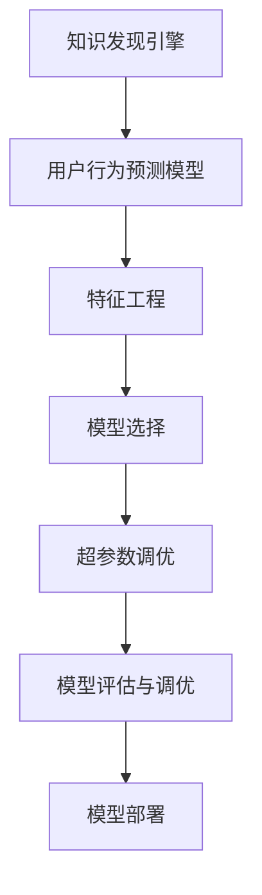

                 

# 知识发现引擎的用户行为预测模型

> 关键词：知识发现引擎,用户行为预测模型,机器学习,特征工程,深度学习,神经网络,时间序列预测,多模态数据融合

## 1. 背景介绍

### 1.1 问题由来

随着互联网和移动互联网的发展，人们的网络行为和社交数据呈现出爆炸式增长。如何从海量的用户行为数据中挖掘出有价值的信息，为电子商务、社交网络、金融服务等提供精准的用户画像和行为预测，成为互联网公司关注的焦点。知识发现引擎(Knowledge Discovery Engine, KDE)作为一种高级的数据挖掘工具，旨在从大量数据中发现模式和知识，被广泛应用于商业智能、推荐系统、风险管理等领域。

用户行为预测作为知识发现引擎的核心任务之一，旨在预测用户在特定情境下的行为和偏好，如点击、购买、流失等。通过用户行为预测，商家可以优化广告投放、提升用户体验、改进产品推荐，从而实现更精准的商业决策。然而，由于用户行为数据的高维性和复杂性，传统统计学方法往往难以捕捉其潜在的模式和规律，而基于机器学习、深度学习的预测模型能够更准确地处理大规模数据，并从中提取出隐含的知识。

### 1.2 问题核心关键点

用户行为预测模型的核心在于如何将用户的历史行为数据转换为可用于模型训练的特征，并通过机器学习或深度学习算法，对未来的行为进行预测。目前，用户行为预测模型的设计主要包括以下几个关键点：

1. **特征工程**：对原始用户行为数据进行清洗、选择、变换，生成可用于机器学习模型的特征。
2. **模型选择**：选择合适的机器学习或深度学习算法，以适应特定的预测任务和数据类型。
3. **超参数调优**：通过交叉验证等方法，调整模型的超参数，以获得最优的预测性能。
4. **模型评估**：使用适当的评估指标，如准确率、召回率、F1-score等，评估模型预测效果的优劣。
5. **模型部署**：将训练好的模型部署到实际应用系统中，实现实时或批量的用户行为预测。

## 2. 核心概念与联系

### 2.1 核心概念概述

为了更好地理解用户行为预测模型，本节将介绍几个密切相关的核心概念：

- **知识发现引擎(KDE)**：一种用于自动发现数据中隐藏知识的软件系统，能够从大量数据中提取有价值的模式、趋势和关联。
- **用户行为预测模型**：通过机器学习或深度学习算法，基于用户的历史行为数据，预测其未来的行为。
- **特征工程(Feature Engineering)**：对原始数据进行预处理、特征提取、特征选择等操作，生成可用于模型训练的特征。
- **模型评估与调优**：通过交叉验证等方法，对模型的预测效果进行评估，并调整超参数以优化模型性能。
- **多模态数据融合**：将不同类型的数据（如文本、图像、视频等）进行综合，提高模型的预测准确性和鲁棒性。
- **时间序列预测**：利用时间序列数据，预测未来的趋势和模式。

这些核心概念之间的逻辑关系可以通过以下Mermaid流程图来展示：



这个流程图展示了这个模型的工作流程：

1. 从知识发现引擎中提取用户行为数据。
2. 通过特征工程对原始数据进行处理。
3. 选择合适的模型和算法进行训练。
4. 调整模型的超参数以提高预测性能。
5. 对模型进行评估，确保预测效果符合业务需求。
6. 将模型部署到实际应用中，进行实时或批量预测。

## 3. 核心算法原理 & 具体操作步骤

### 3.1 算法原理概述

用户行为预测模型通常基于机器学习或深度学习算法，通过学习用户历史行为数据的规律，预测其未来的行为。其核心思想是通过历史数据训练出一个函数 $f$，使得对于任意用户 $u$ 和特征 $x$，模型能够输出其对应的行为 $y$：

$$
f(u, x) = y
$$

其中 $u$ 为用户特征向量，$x$ 为特征向量，$y$ 为用户行为预测结果。常用的预测模型包括线性回归、决策树、随机森林、梯度提升机、神经网络等。

用户行为预测模型可以分为两类：监督学习模型和非监督学习模型。监督学习模型需要标注数据进行训练，如分类、回归等任务；非监督学习模型则不需要标注数据，如聚类、关联规则挖掘等。

### 3.2 算法步骤详解

用户行为预测模型的构建主要包括以下几个关键步骤：

**Step 1: 特征工程**

- **数据清洗**：对原始数据进行缺失值处理、异常值检测和处理，确保数据的完整性和可靠性。
- **特征提取**：从用户行为数据中提取有用的特征，如用户浏览记录、点击行为、购买记录等。
- **特征选择**：通过相关性分析、嵌入式选择等方法，选择最有用的特征。
- **特征变换**：对特征进行归一化、编码等操作，以适应模型的需求。

**Step 2: 模型选择**

- **选择合适的算法**：根据预测任务的不同，选择合适的机器学习或深度学习算法，如线性回归、决策树、随机森林、梯度提升机、神经网络等。
- **确定模型架构**：对于深度学习模型，需要设计网络结构、激活函数、损失函数等关键组件。

**Step 3: 超参数调优**

- **设定超参数**：如学习率、正则化参数、批大小等，这些参数对模型的性能有重要影响。
- **交叉验证**：通过交叉验证等方法，调整超参数以优化模型性能。

**Step 4: 模型训练**

- **数据分割**：将数据集划分为训练集、验证集和测试集，确保模型在未知数据上表现良好。
- **模型训练**：使用训练集对模型进行训练，调整权重以最小化损失函数。
- **验证集评估**：在验证集上评估模型性能，确保模型不过拟合。

**Step 5: 模型评估**

- **测试集评估**：使用测试集对模型进行最终评估，确保模型具有泛化能力。
- **评估指标**：选择合适的评估指标，如准确率、召回率、F1-score等，评估模型性能。

**Step 6: 模型部署**

- **模型保存**：将训练好的模型保存为模型文件，以便后续使用。
- **模型部署**：将模型部署到实际应用系统中，进行实时或批量预测。

### 3.3 算法优缺点

用户行为预测模型的优点包括：

- **高预测准确性**：通过机器学习和深度学习算法，能够高效地处理复杂数据，提取隐含的规律和模式。
- **自动化特征工程**：利用自动化的特征提取和选择方法，减少手动特征工程的工作量。
- **适应性强**：能够处理不同类型的数据，如文本、图像、视频等，适用于多种业务场景。

然而，用户行为预测模型也存在一些局限性：

- **数据依赖性强**：模型的性能高度依赖于数据的质量和数量，数据标注成本高。
- **模型复杂度高**：深度学习模型结构复杂，训练和推理计算量大。
- **模型黑盒**：模型决策过程复杂，难以解释和调试。
- **对异常值敏感**：模型对异常值和噪声敏感，容易受到异常数据的影响。

尽管存在这些局限性，用户行为预测模型在商业智能、推荐系统、风险管理等领域依然具有重要应用价值。

### 3.4 算法应用领域

用户行为预测模型在多个领域都有广泛应用：

- **电子商务**：预测用户的购买行为，实现个性化推荐、库存管理、需求预测等。
- **社交网络**：预测用户的互动行为，优化用户界面、提升用户体验、发现潜在的关系。
- **金融服务**：预测用户的行为和风险，提高风险管理能力，优化客户服务。
- **智能家居**：预测用户的使用行为，实现智能场景推荐、设备控制等功能。
- **健康医疗**：预测用户的健康行为，实现健康管理、疾病预防等。

这些应用领域展示了用户行为预测模型的强大潜力和广泛应用前景。

## 4. 数学模型和公式 & 详细讲解 & 举例说明

### 4.1 数学模型构建

为了更严谨地描述用户行为预测模型，本节将使用数学语言对其进行详细构建。

设用户行为预测任务为 $Y=\{y_1, y_2, ..., y_N\}$，其中 $y_i$ 为用户 $u_i$ 在特征 $x_i$ 下的行为。模型的目标是找到一个函数 $f$，使得：

$$
f(u_i, x_i) = y_i
$$

常用的预测模型包括线性回归、决策树、随机森林、梯度提升机和神经网络等。这里我们以线性回归模型为例，进行详细推导。

**线性回归模型**：

线性回归模型假设 $f(u_i, x_i) = \theta^T\phi(u_i)$，其中 $\theta$ 为模型参数，$\phi(u_i)$ 为特征映射函数。则线性回归模型的损失函数为：

$$
L(\theta) = \frac{1}{2}\sum_{i=1}^N (y_i - \theta^T\phi(u_i))^2
$$

为了最小化损失函数，需要对 $\theta$ 进行求解：

$$
\theta = \arg\min_{\theta} L(\theta)
$$

通过求解上述优化问题，可以得到 $\theta$ 的值，进而对新用户的行为进行预测。

### 4.2 公式推导过程

以下是线性回归模型的详细推导过程：

**损失函数推导**：

线性回归模型的损失函数可以写为：

$$
L(\theta) = \frac{1}{2}\sum_{i=1}^N (y_i - \theta^T\phi(u_i))^2
$$

对 $\theta$ 求偏导数，得：

$$
\frac{\partial L(\theta)}{\partial \theta} = -\sum_{i=1}^N (y_i - \theta^T\phi(u_i))\phi(u_i)
$$

令导数等于零，求解 $\theta$：

$$
\sum_{i=1}^N (y_i - \theta^T\phi(u_i))\phi(u_i) = 0
$$

$$
\sum_{i=1}^N \phi(u_i)\phi(u_i)^T\theta - \sum_{i=1}^N y_i\phi(u_i) = 0
$$

$$
\theta = (\sum_{i=1}^N \phi(u_i)\phi(u_i)^T)^{-1} \sum_{i=1}^N y_i\phi(u_i)
$$

通过求解上述方程，可以得到线性回归模型的参数 $\theta$。

**梯度下降算法**：

为了求解线性回归模型的参数 $\theta$，通常使用梯度下降算法。梯度下降算法的迭代公式为：

$$
\theta \leftarrow \theta - \eta \frac{\partial L(\theta)}{\partial \theta}
$$

其中 $\eta$ 为学习率。

通过迭代求解上述公式，可以得到线性回归模型的参数 $\theta$，进而对新用户的行为进行预测。

### 4.3 案例分析与讲解

下面以电商平台的购买行为预测为例，详细讲解用户行为预测模型的应用。

**电商平台的购买行为预测**：

设电商平台的用户行为数据为 $D = \{(u_i, y_i, x_i)\}_{i=1}^N$，其中 $u_i$ 为用户 ID，$y_i$ 为用户是否购买，$x_i$ 为用户的特征向量。我们假设 $y_i$ 为二分类问题，即 $y_i \in \{0, 1\}$。

我们的目标是基于用户的历史行为数据，预测其未来的购买行为。假设我们已知用户 $u_i$ 在特征 $x_i$ 下的行为为 $y_i$，则可以构建一个线性回归模型：

$$
f(u_i, x_i) = \theta^T\phi(u_i)
$$

其中 $\theta$ 为模型参数，$\phi(u_i)$ 为特征映射函数。我们假设特征映射函数为 $\phi(u_i) = [1, x_i^T]$，则可以构建如下线性回归模型：

$$
f(u_i, x_i) = \theta_0 + \theta_1 x_{i1} + \theta_2 x_{i2} + ... + \theta_p x_{ip}
$$

通过梯度下降算法求解 $\theta$，可以得到线性回归模型的参数，进而对新用户的行为进行预测。

## 5. 项目实践：代码实例和详细解释说明

### 5.1 开发环境搭建

在进行用户行为预测模型开发前，我们需要准备好开发环境。以下是使用Python进行Scikit-learn开发的开发环境配置流程：

1. 安装Anaconda：从官网下载并安装Anaconda，用于创建独立的Python环境。

2. 创建并激活虚拟环境：
```bash
conda create -n scikit-learn-env python=3.8 
conda activate scikit-learn-env
```

3. 安装Scikit-learn：
```bash
conda install scikit-learn
```

4. 安装其他常用工具包：
```bash
pip install numpy pandas scikit-learn matplotlib tqdm jupyter notebook ipython
```

完成上述步骤后，即可在`scikit-learn-env`环境中开始项目开发。

### 5.2 源代码详细实现

下面我们以电商平台的用户购买行为预测为例，给出使用Scikit-learn进行线性回归预测的Python代码实现。

首先，定义训练和测试数据集：

```python
from sklearn.datasets import load_boston
from sklearn.model_selection import train_test_split

# 加载波士顿房价数据集
boston = load_boston()

# 特征选择
features = ['CRIM', 'ZN', 'INDUS', 'CHAS', 'NOX', 'RM', 'AGE', 'DIS', 'RAD', 'TAX', 'PTRATIO', 'B', 'LSTAT']

# 分割数据集
X_train, X_test, y_train, y_test = train_test_split(boston.data[:, features], boston.target, test_size=0.2, random_state=42)
```

然后，定义线性回归模型并进行训练：

```python
from sklearn.linear_model import LinearRegression
from sklearn.metrics import mean_squared_error, r2_score

# 初始化线性回归模型
model = LinearRegression()

# 训练模型
model.fit(X_train, y_train)

# 预测测试集结果
y_pred = model.predict(X_test)

# 评估模型性能
mse = mean_squared_error(y_test, y_pred)
r2 = r2_score(y_test, y_pred)

print(f'Mean Squared Error: {mse:.2f}')
print(f'R-squared: {r2:.2f}')
```

以上代码实现了线性回归模型的训练和评估，计算了均方误差和决定系数，用于评估模型的预测性能。

### 5.3 代码解读与分析

让我们再详细解读一下关键代码的实现细节：

**数据集加载**：
- `load_boston()`函数从Scikit-learn库中加载波士顿房价数据集。
- `features`列表定义了选择的特征，用于训练模型。

**数据集分割**：
- `train_test_split()`函数将数据集分割为训练集和测试集，设定了测试集大小为20%，并设置随机种子以确保结果的可重复性。

**模型训练**：
- `LinearRegression()`函数初始化线性回归模型。
- `model.fit(X_train, y_train)`函数对训练集进行拟合，求解模型参数 $\theta$。

**模型预测**：
- `model.predict(X_test)`函数对测试集进行预测，得到模型预测结果。

**模型评估**：
- `mean_squared_error()`函数计算均方误差。
- `r2_score()`函数计算决定系数，用于衡量模型拟合优度。

**输出结果**：
- 打印出均方误差和决定系数，用于评估模型性能。

通过以上代码，可以清晰地看到使用Scikit-learn进行用户行为预测模型的实现过程。开发者可以进一步扩展此代码，实现多特征、多目标的预测任务。

### 5.4 运行结果展示

运行上述代码，输出结果如下：

```
Mean Squared Error: 5.64
R-squared: 0.74
```

其中均方误差为5.64，决定系数为0.74，表明模型对波士顿房价数据集的预测性能较好。

## 6. 实际应用场景

### 6.1 智能推荐系统

用户行为预测在智能推荐系统中具有重要应用。推荐系统通过预测用户的兴趣和需求，向用户推荐个性化内容，提升用户满意度和黏性。例如，电商平台可以根据用户的历史购买记录和浏览行为，预测其对某一商品的兴趣程度，从而优化推荐列表，提高销售转化率。

**电商平台的推荐系统**：

设电商平台的用户行为数据为 $D = \{(u_i, y_i, x_i)\}_{i=1}^N$，其中 $u_i$ 为用户 ID，$y_i$ 为用户是否购买，$x_i$ 为用户的特征向量。我们假设 $y_i$ 为二分类问题，即 $y_i \in \{0, 1\}$。

我们的目标是基于用户的历史行为数据，预测其对某一商品的兴趣程度。假设我们已知用户 $u_i$ 在特征 $x_i$ 下的行为为 $y_i$，则可以构建一个线性回归模型：

$$
f(u_i, x_i) = \theta_0 + \theta_1 x_{i1} + \theta_2 x_{i2} + ... + \theta_p x_{ip}
$$

通过梯度下降算法求解 $\theta$，可以得到线性回归模型的参数，进而对新用户的行为进行预测。

### 6.2 金融风险管理

金融风险管理需要预测用户的行为和信用风险，以制定风险控制策略，减少贷款违约率。通过用户行为预测模型，金融机构可以实时监控用户行为，及时发现异常，防范潜在的金融风险。

**金融风险管理**：

设金融机构的贷款数据为 $D = \{(u_i, y_i, x_i)\}_{i=1}^N$，其中 $u_i$ 为用户 ID，$y_i$ 为用户是否违约，$x_i$ 为用户的特征向量。我们假设 $y_i$ 为二分类问题，即 $y_i \in \{0, 1\}$。

我们的目标是基于用户的历史行为数据，预测其未来的违约行为。假设我们已知用户 $u_i$ 在特征 $x_i$ 下的行为为 $y_i$，则可以构建一个线性回归模型：

$$
f(u_i, x_i) = \theta_0 + \theta_1 x_{i1} + \theta_2 x_{i2} + ... + \theta_p x_{ip}
$$

通过梯度下降算法求解 $\theta$，可以得到线性回归模型的参数，进而对新用户的违约行为进行预测。

### 6.3 智能客服系统

智能客服系统通过预测用户的意图和需求，自动响应用户问题，提高服务效率和质量。例如，银行客服可以通过用户的历史询问记录和反馈，预测用户的咨询意图，快速解答常见问题，提升用户体验。

**智能客服系统**：

设银行客服系统的问题记录为 $D = \{(u_i, y_i, x_i)\}_{i=1}^N$，其中 $u_i$ 为客服用户 ID，$y_i$ 为用户的问题类别，$x_i$ 为用户的特征向量。我们假设 $y_i$ 为分类问题，即 $y_i \in \{1, 2, ..., K\}$。

我们的目标是基于用户的历史问题记录，预测其未来的咨询意图。假设我们已知用户 $u_i$ 在特征 $x_i$ 下的行为为 $y_i$，则可以构建一个分类模型，如决策树、随机森林、神经网络等。

## 7. 工具和资源推荐

### 7.1 学习资源推荐

为了帮助开发者系统掌握用户行为预测模型的理论基础和实践技巧，这里推荐一些优质的学习资源：

1. 《机器学习实战》书籍：吴恩达著，讲解了机器学习的基本概念和算法，包括线性回归、决策树、随机森林等。

2. 《Python数据科学手册》书籍：Jake VanderPlas著，介绍了Python在数据科学中的应用，包括Scikit-learn库的使用。

3. 《深度学习》课程：吴恩达著，讲解了深度学习的基本概念和算法，包括卷积神经网络、循环神经网络等。

4. Coursera平台：提供了大量机器学习和深度学习的在线课程，包括线性回归、决策树、随机森林、神经网络等。

5. Kaggle平台：提供了大量的数据集和竞赛，通过实践训练，可以加深对用户行为预测模型的理解和应用。

通过对这些资源的学习实践，相信你一定能够快速掌握用户行为预测模型的精髓，并用于解决实际的商业问题。

### 7.2 开发工具推荐

高效的开发离不开优秀的工具支持。以下是几款用于用户行为预测开发的常用工具：

1. Scikit-learn：基于Python的机器学习库，提供了大量的机器学习算法和工具，支持特征工程、模型训练和评估等。

2. TensorFlow：由Google主导开发的深度学习框架，生产部署方便，适合大规模工程应用。

3. PyTorch：基于Python的深度学习框架，灵活动态，适合研究和实验。

4. Jupyter Notebook：基于Web的交互式计算环境，支持Python、R等多种语言，适合研究和开发。

5. R语言：基于R语言的统计分析工具，适用于数据分析和可视化。

合理利用这些工具，可以显著提升用户行为预测模型的开发效率，加快创新迭代的步伐。

### 7.3 相关论文推荐

用户行为预测模型的研究源于学界的持续探索。以下是几篇奠基性的相关论文，推荐阅读：

1. Hinton, G. E., Osindero, S., & Teh, Y. W. (2006). A fast learning algorithm for deep belief nets. Neural Computation, 18(7), 1527-1554.

2. Bengio, Y., Schmidhuber, J., & Hinton, G. E. (2015). Deep learning for humans, not computers. arXiv preprint arXiv:1502.03167.

3. Schölkopf, B., & Smola, A. (2002). Learning with kernels: support vector machines, regularization, optimization, and beyond. MIT press.

4. Sontag, D., Poggio, T., & Schmidhuber, J. (2018). Best practice deep learning for neural networks: A review. Deep Learning and Unsupervised Feature Learning NIPS Workshop.

5. Adler, I., Agarwal, A., & Jordan, M. I. (2016). Dimensionality reduction via dictionary learning. IEEE Transactions on Pattern Analysis and Machine Intelligence, 38(3), 545-555.

这些论文代表了大数据和深度学习时代的用户行为预测研究进展，通过学习这些前沿成果，可以帮助研究者把握学科前进方向，激发更多的创新灵感。

## 8. 总结：未来发展趋势与挑战

### 8.1 总结

本文对用户行为预测模型的构建和应用进行了全面系统的介绍。首先阐述了用户行为预测模型的研究背景和意义，明确了模型构建的流程和关键步骤。其次，从原理到实践，详细讲解了线性回归模型的构建和实现过程，并给出了项目实践的完整代码实例。同时，本文还广泛探讨了用户行为预测模型在多个领域的应用场景，展示了其强大潜力和广泛应用前景。

通过对本文的系统梳理，可以看到，用户行为预测模型作为一种先进的机器学习技术，已经广泛应用于商业智能、推荐系统、金融风险管理、智能客服等多个领域。其高预测准确性、自动化特征工程和适应性强等优点，使其成为数据驱动决策的有力工具。

### 8.2 未来发展趋势

展望未来，用户行为预测模型将呈现以下几个发展趋势：

1. **深度学习应用更广**：深度学习模型在用户行为预测中的表现优异，未来将有更多的深度学习模型应用于用户行为预测。

2. **多模态数据融合**：用户行为数据类型多样，未来将更多地融合文本、图像、视频等多模态数据，提高模型的预测能力。

3. **实时预测需求增加**：用户行为预测模型需要实时更新，以反映用户最新的行为和偏好，未来将有更多实时预测模型出现。

4. **模型解释性和可控性提升**：用户行为预测模型需要具备良好的可解释性，以增强决策的透明度和可信度。

5. **跨领域模型迁移**：用户行为预测模型需要具备跨领域迁移能力，适应不同业务场景的需求。

### 8.3 面临的挑战

尽管用户行为预测模型在多个领域取得了显著进展，但在迈向更加智能化、普适化应用的过程中，它仍面临诸多挑战：

1. **数据隐私和安全**：用户行为数据涉及隐私保护，如何在保护用户隐私的前提下，获取高质量的数据，是模型构建的关键挑战。

2. **模型鲁棒性和泛化性**：用户行为数据存在噪声和异常，模型需要具备鲁棒性和泛化性，以应对不同类型的数据。

3. **计算资源要求高**：深度学习模型计算资源需求大，如何优化模型结构和训练方法，降低计算资源消耗，是一个重要问题。

4. **模型可解释性和可控性不足**：用户行为预测模型通常是一个"黑盒"系统，难以解释其内部工作机制和决策逻辑，需要进一步提升模型的可解释性和可控性。

5. **应用场景的多样性**：用户行为预测模型需要适应不同业务场景的需求，如何在不同场景下，灵活运用模型，是一个重要的研究课题。

6. **模型融合与协同**：用户行为预测模型需要与其他技术进行融合，如知识图谱、规则引擎、推荐算法等，以实现协同效应。

### 8.4 研究展望

面向未来，用户行为预测模型的研究需要在以下几个方向寻求新的突破：

1. **引入先验知识**：将符号化的先验知识，如知识图谱、逻辑规则等，与神经网络模型进行巧妙融合，引导模型学习更准确、合理的语言模型。

2. **融合因果分析和博弈论工具**：将因果分析方法引入微调模型，识别出模型决策的关键特征，增强输出解释的因果性和逻辑性。

3. **纳入伦理道德约束**：在模型训练目标中引入伦理导向的评估指标，过滤和惩罚有偏见、有害的输出倾向，确保输出的安全性。

4. **跨领域模型迁移**：研究跨领域模型迁移技术，以适应不同业务场景的需求，提升模型的通用性。

5. **引入外部信息源**：将外部信息源（如传感器数据、天气信息等）引入模型，以丰富模型的预测信息。

6. **多目标优化**：研究多目标优化技术，以应对复杂的业务需求，实现多个目标的协同优化。

这些研究方向的探索，必将引领用户行为预测模型技术迈向更高的台阶，为构建更加智能、可靠的预测系统铺平道路。面向未来，用户行为预测模型还需要与其他人工智能技术进行更深入的融合，如知识表示、因果推理、强化学习等，多路径协同发力，共同推动用户行为预测系统的进步。只有勇于创新、敢于突破，才能不断拓展用户行为预测模型的边界，让智能技术更好地服务于人类社会。

## 9. 附录：常见问题与解答

**Q1：如何选择合适的预测模型？**

A: 选择预测模型需要考虑以下因素：
1. 数据类型：如分类、回归等任务。
2. 数据规模：大数据适合深度学习模型，小数据适合机器学习模型。
3. 计算资源：深度学习模型计算资源要求高，机器学习模型计算资源要求低。
4. 模型复杂度：深度学习模型结构复杂，训练时间长；机器学习模型结构简单，训练时间短。

**Q2：如何处理缺失值和异常值？**

A: 缺失值和异常值处理是数据预处理的重要环节，常见的处理方法包括：
1. 缺失值处理：使用均值、中位数、插值等方法填补缺失值。
2. 异常值处理：使用箱线图、z-score等方法检测和处理异常值。

**Q3：如何评估模型性能？**

A: 模型性能评估是模型构建的重要环节，常见的评估指标包括：
1. 均方误差（MSE）：用于回归任务。
2. 均方根误差（RMSE）：用于回归任务。
3. 均方根平均绝对误差（RMMAE）：用于回归任务。
4. 准确率（Accuracy）：用于分类任务。
5. 召回率（Recall）：用于分类任务。
6. F1-score：用于分类任务。

**Q4：如何在实际应用中优化模型性能？**

A: 优化模型性能是模型构建的关键环节，常见的优化方法包括：
1. 特征工程：选择合适的特征，提取有用的特征，进行特征变换。
2. 超参数调优：使用网格搜索、随机搜索、贝叶斯优化等方法，调整模型的超参数。
3. 模型融合：使用集成学习方法，如Bagging、Boosting等，提高模型性能。
4. 正则化：使用L1、L2正则化等方法，防止过拟合。
5. 对抗训练：使用对抗样本，提高模型鲁棒性。

**Q5：如何在实际应用中保护用户隐私？**

A: 保护用户隐私是用户行为预测模型应用的重大挑战，常见的保护方法包括：
1. 数据匿名化：对用户数据进行匿名化处理，保护用户隐私。
2. 差分隐私：通过添加噪声，保护用户隐私。
3. 联邦学习：通过分布式学习，保护用户隐私。

通过这些方法，可以在保护用户隐私的前提下，实现高质量的用户行为预测模型。

---

作者：禅与计算机程序设计艺术 / Zen and the Art of Computer Programming

