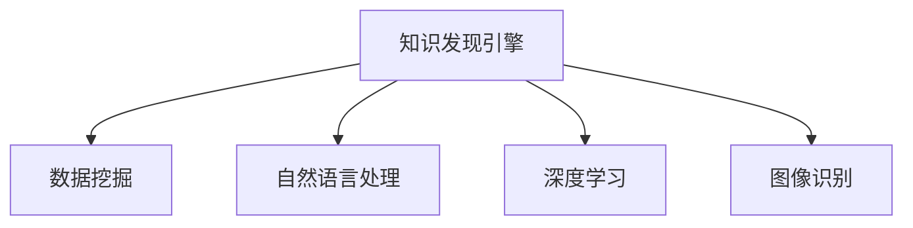

                 

# 知识发现引擎：推动创意产业的内容升级

> 关键词：知识发现引擎, 创意产业, 内容升级, 数据驱动, 机器学习, 自然语言处理, 深度学习, 图像识别

## 1. 背景介绍

### 1.1 问题由来
创意产业作为21世纪的新兴经济形态，涵盖了文学、艺术、设计、影视、音乐、动漫等多个领域。与传统产业不同，创意产业的核心驱动在于原创性和创新性，需要源源不断的创意内容作为支撑。然而，传统的内容生产方式往往依赖于人工创作，效率低下，且创意内容的同质化问题较为严重。

### 1.2 问题核心关键点
如何通过技术手段，从海量数据中挖掘出有价值的创意内容，加速内容生产，提升内容质量，成为当前创意产业面临的重要挑战。随着人工智能和大数据技术的迅猛发展，知识发现引擎应运而生，通过智能化分析，深度挖掘数据中的知识，推动创意产业的内容升级。

### 1.3 问题研究意义
知识发现引擎的应用，对于创意产业的内容生产、创新驱动、市场竞争等方面具有重要意义：

1. **提升内容生产效率**：自动化挖掘数据中的创意素材，快速生成内容，缩短创作周期。
2. **增强内容质量**：利用数据分析和机器学习技术，识别高价值内容，提升创意水平。
3. **促进创新突破**：从数据中发现新颖的创作主题和趋势，推动创意产业的持续创新。
4. **增强市场竞争力**：基于精准的内容推荐和数据分析，把握市场需求，提升产品竞争力。
5. **探索数据驱动模式**：以数据为驱动，减少对经验性决策的依赖，提升内容生产的科学性和客观性。

## 2. 核心概念与联系

### 2.1 核心概念概述

为更好地理解知识发现引擎及其在创意产业中的应用，本节将介绍几个密切相关的核心概念：

- **知识发现引擎(Knowledge Discovery Engine, KDE)**：通过智能分析海量数据，从隐性知识中挖掘出显性知识，为创意产业提供数据支持和决策依据的智能系统。

- **数据挖掘(Data Mining)**：从数据中自动发现有意义的模式、规则、关联和趋势，是知识发现引擎的核心技术之一。

- **自然语言处理(Natural Language Processing, NLP)**：利用计算机技术处理和理解自然语言，是知识发现引擎的重要组成部分，用于文本数据的挖掘和分析。

- **深度学习(Deep Learning)**：基于神经网络的学习模型，能够从大量数据中自动学习特征和规律，为知识发现引擎提供强有力的算法支持。

- **图像识别(Image Recognition)**：利用计算机视觉技术，自动识别和分类图像数据，是知识发现引擎在图像领域的应用。

这些核心概念之间的逻辑关系可以通过以下Mermaid流程图来展示：



这个流程图展示的知识发现引擎的核心概念及其之间的关系：

1. 知识发现引擎通过数据挖掘技术，从数据中提取知识。
2. NLP技术用于文本数据的智能化分析，挖掘出语义、情感等隐性信息。
3. 深度学习提供强大的算法支持，实现自动特征提取和模式识别。
4. 图像识别技术，用于分析和理解视觉数据。

这些概念共同构成了知识发现引擎的理论基础，使其能够在多个领域中发挥作用。

## 3. 核心算法原理 & 具体操作步骤
### 3.1 算法原理概述

知识发现引擎的核心思想是利用数据挖掘和机器学习技术，从海量数据中自动发现模式和规律，为创意产业提供有价值的信息和知识。其基本流程包括数据预处理、特征提取、模型训练和结果解释。

形式化地，假设数据集为 $D=\{(x_i,y_i)\}_{i=1}^N$，其中 $x_i$ 为输入数据，$y_i$ 为标签或输出结果。知识发现引擎的目标是找到一个模型 $f$，使得 $f(x)$ 能够最小化预测误差，即：

$$
\hat{f} = \mathop{\arg\min}_{f} \mathcal{L}(f,D)
$$

其中 $\mathcal{L}$ 为损失函数，通常包括交叉熵损失、均方误差损失等。知识发现引擎的输出 $f(x)$ 可以是分类、回归、聚类等形式，具体取决于应用场景。

### 3.2 算法步骤详解

知识发现引擎的实现通常包括以下关键步骤：

**Step 1: 数据预处理**
- 数据清洗：去除数据中的噪声和异常值，保证数据质量。
- 数据归一化：将数据转换为标准格式，便于模型训练。
- 特征选择：选择对模型预测有帮助的特征，减少数据维度。
- 数据划分：将数据集划分为训练集、验证集和测试集。

**Step 2: 特征提取**
- 文本特征：使用NLP技术提取文本的词向量、主题、情感等特征。
- 图像特征：利用计算机视觉技术提取图像的颜色、纹理、形状等特征。
- 混合特征：结合文本和图像特征，提升特征表示的全面性。

**Step 3: 模型训练**
- 选择模型：根据应用场景选择合适的模型，如决策树、神经网络、支持向量机等。
- 参数优化：使用梯度下降等优化算法，最小化损失函数，找到最优模型参数。
- 模型验证：在验证集上评估模型性能，调整模型参数，防止过拟合。

**Step 4: 结果解释**
- 模型解释：使用特征重要性、局部可解释模型等方法，解释模型的预测结果。
- 结果可视化：将模型结果可视化，帮助用户更好地理解分析结果。

### 3.3 算法优缺点

知识发现引擎具有以下优点：
1. 自动化挖掘：通过自动化分析数据，减少人工干预，提高效率。
2. 数据驱动：基于大量数据，发现潜在规律和模式，增强决策依据的客观性。
3. 多模态支持：可以处理文本、图像、音频等多种数据类型，适应多领域应用。
4. 灵活扩展：随着数据和需求的变化，可以灵活扩展模型和算法。

同时，该方法也存在一定的局限性：
1. 数据依赖：知识发现引擎的性能高度依赖于数据的质量和数量，数据偏差可能导致结果错误。
2. 复杂性高：需要处理多种数据类型和复杂的特征提取，技术难度较大。
3. 结果可解释性不足：部分复杂模型难以解释其决策过程，降低用户信任度。
4. 对标注数据的需求：部分算法需要标注数据进行训练，标注成本较高。

尽管存在这些局限性，但知识发现引擎以其强大的数据挖掘能力，已经广泛应用于创意产业的多项任务中，展现了其广阔的应用前景。

### 3.4 算法应用领域

知识发现引擎在创意产业中的应用已经涉及多个领域，包括但不限于：

- **文本内容分析**：分析文本中的关键词、主题、情感等信息，挖掘热点和趋势，为内容创作提供灵感。
- **图像内容识别**：利用图像识别技术，分析图片中的物体、场景、颜色等信息，用于图像分类、风格转换等任务。
- **音乐内容推荐**：分析用户听歌记录，挖掘用户的音乐喜好，推荐符合用户口味的新歌曲。
- **艺术作品创作**：利用NLP和图像识别技术，自动生成绘画、雕塑等艺术作品，为艺术家提供创作参考。
- **影视剧推荐**：分析用户观看记录，挖掘用户的观看偏好，推荐符合用户口味的影视剧作品。
- **设计方案生成**：利用文本和图像特征，自动生成设计方案，辅助设计师进行创意构思。

除了上述这些具体应用外，知识发现引擎还可以用于创意产业的市场分析和趋势预测，提供更具洞见的内容创作指导，推动创意产业的健康发展。

## 4. 数学模型和公式 & 详细讲解 & 举例说明
### 4.1 数学模型构建

本节将使用数学语言对知识发现引擎的数学模型进行更加严格的刻画。

假设输入数据为 $x=\{x_1,x_2,\dots,x_N\}$，输出数据为 $y=\{y_1,y_2,\dots,y_N\}$，知识发现引擎的目标是找到一个函数 $f(x)$，使得 $f(x)$ 能够最小化预测误差。

定义模型的预测结果为 $\hat{y}=f(x)$，则预测误差可以表示为：

$$
\mathcal{L}(f) = \frac{1}{N} \sum_{i=1}^N \ell(f(x_i),y_i)
$$

其中 $\ell$ 为损失函数，如交叉熵损失：

$$
\ell(f(x_i),y_i) = -y_i\log f(x_i) - (1-y_i)\log(1-f(x_i))
$$

为了最小化损失函数，需要对 $f(x)$ 进行优化，通常使用梯度下降等优化算法：

$$
\hat{f} = \mathop{\arg\min}_{f} \mathcal{L}(f)
$$

在实际应用中，还需对模型进行特征选择、数据清洗、模型验证等预处理步骤，确保最终输出的准确性和可靠性。

### 4.2 公式推导过程

以下我们以文本情感分析为例，推导情感分析的数学模型及其梯度的计算公式。

假设输入文本为 $x$，输出情感标签为 $y$，模型预测情感概率为 $f(x)$。则二分类交叉熵损失函数定义为：

$$
\ell(f(x),y) = -[y\log f(x) + (1-y)\log(1-f(x))]
$$

将其代入经验风险公式，得：

$$
\mathcal{L}(f) = -\frac{1}{N}\sum_{i=1}^N [y_i\log f(x_i)+(1-y_i)\log(1-f(x_i))]
$$

根据链式法则，损失函数对模型参数 $w$ 的梯度为：

$$
\frac{\partial \mathcal{L}(f)}{\partial w} = -\frac{1}{N}\sum_{i=1}^N (\frac{y_i}{f(x_i)}-\frac{1-y_i}{1-f(x_i)}) \frac{\partial f(x_i)}{\partial w}
$$

其中 $\frac{\partial f(x_i)}{\partial w}$ 可进一步递归展开，利用自动微分技术完成计算。

在得到损失函数的梯度后，即可带入梯度下降等优化算法，完成模型的迭代优化。重复上述过程直至收敛，最终得到适应情感分析任务的最优模型参数 $\hat{w}$。

## 5. 项目实践：代码实例和详细解释说明
### 5.1 开发环境搭建

在进行知识发现引擎的开发实践前，我们需要准备好开发环境。以下是使用Python进行Scikit-learn开发的环境配置流程：

1. 安装Anaconda：从官网下载并安装Anaconda，用于创建独立的Python环境。

2. 创建并激活虚拟环境：
```bash
conda create -n kde-env python=3.8 
conda activate kde-env
```

3. 安装Scikit-learn：
```bash
conda install scikit-learn
```

4. 安装各类工具包：
```bash
pip install numpy pandas scikit-learn matplotlib tqdm jupyter notebook ipython
```

完成上述步骤后，即可在`kde-env`环境中开始知识发现引擎的开发实践。

### 5.2 源代码详细实现

这里我们以文本情感分析任务为例，给出使用Scikit-learn进行知识发现引擎开发的PyTorch代码实现。

首先，定义情感分析任务的数据处理函数：

```python
from sklearn.feature_extraction.text import CountVectorizer
from sklearn.model_selection import train_test_split
from sklearn.metrics import accuracy_score

def preprocess_data(texts, labels):
    vectorizer = CountVectorizer()
    X = vectorizer.fit_transform(texts)
    y = labels
    return X, y

# 加载文本和标签
texts = ["I love this movie", "This is a terrible movie", "This movie is okay", "I hate this movie"]
labels = ["positive", "negative", "neutral", "negative"]

X, y = preprocess_data(texts, labels)

# 划分数据集
X_train, X_test, y_train, y_test = train_test_split(X, y, test_size=0.2, random_state=42)
```

然后，定义模型和评估函数：

```python
from sklearn.svm import SVC
from sklearn.metrics import classification_report

def train_model(X_train, y_train):
    model = SVC(kernel='linear')
    model.fit(X_train, y_train)
    return model

def evaluate_model(model, X_test, y_test):
    y_pred = model.predict(X_test)
    print(classification_report(y_test, y_pred))
```

接着，启动训练流程并在测试集上评估：

```python
model = train_model(X_train, y_train)
evaluate_model(model, X_test, y_test)
```

以上就是使用Scikit-learn进行文本情感分析任务知识发现引擎的完整代码实现。可以看到，Scikit-learn提供了丰富且易用的机器学习算法，使得开发过程更加简洁高效。

### 5.3 代码解读与分析

让我们再详细解读一下关键代码的实现细节：

**preprocess_data函数**：
- 将文本数据转换为词向量表示，方便模型处理。
- 将标签进行标准化处理，如将其转换为数值形式。

**train_model函数**：
- 定义模型为线性支持向量机，利用训练数据拟合模型。

**evaluate_model函数**：
- 在测试集上评估模型性能，使用分类报告输出各个类别的准确率、召回率、F1值等指标。

**训练流程**：
- 定义训练数据和标签。
- 在训练集上训练模型，得到模型参数。
- 在测试集上评估模型性能，对比模型预测和真实标签。

可以看到，Scikit-learn的机器学习库使得知识发现引擎的代码实现变得简单高效。开发者可以更多地关注于数据处理和模型改进等高层逻辑，而不必过多关注底层的实现细节。

当然，工业级的系统实现还需考虑更多因素，如模型的保存和部署、超参数的自动搜索、更灵活的任务适配层等。但核心的知识发现引擎基本与此类似。

## 6. 实际应用场景
### 6.1 智能创作平台

基于知识发现引擎的智能创作平台，可以极大地提升内容创作的效率和质量。平台通过智能化分析用户历史创作记录和网络热点，生成推荐素材和创作提示，帮助创作者快速产生创意内容。

在技术实现上，知识发现引擎可以分析用户的历史创作记录，挖掘出用户偏好的题材、风格、语言特点等，并生成相关领域的推荐素材。同时，知识发现引擎还可以实时监测网络上的流行话题和热点，自动生成创作提示，引导创作者创作符合市场需求的新内容。

### 6.2 艺术设计工具

知识发现引擎在艺术设计领域的应用，可以辅助设计师进行创意构思和方案生成。平台通过分析大量艺术作品和设计方案，挖掘出设计元素的组合规律和趋势，生成创意方案参考。

具体而言，知识发现引擎可以分析设计师的历史设计作品，挖掘出常用的设计元素、颜色搭配、空间布局等特征，生成相关领域的推荐方案。同时，知识发现引擎还可以实时监测最新的设计趋势，生成符合市场需求的创意方案，帮助设计师进行创新设计。

### 6.3 影视制作辅助

知识发现引擎在影视制作中的应用，可以辅助制片人进行剧本创作和内容策划。平台通过分析大量的影视剧作品和观众反馈，挖掘出剧本主题、情节走向、角色设定等特征，生成剧本创作和内容策划的建议。

具体而言，知识发现引擎可以分析影视剧的故事情节、角色设定、画面风格等特征，生成相关领域的推荐素材。同时，知识发现引擎还可以实时监测观众的反馈和市场趋势，生成符合市场需求的创作建议，帮助制片人进行创新创作。

### 6.4 未来应用展望

随着知识发现引擎技术的不断发展，其应用场景将进一步拓展，为创意产业带来更多的创新突破。

在智慧城市建设中，知识发现引擎可以用于城市事件监测、舆情分析、应急指挥等环节，提供实时数据支持和智能决策，构建更安全、高效的未来城市。

在教育领域，知识发现引擎可以用于个性化学习、智能教学等任务，提供定制化的学习方案和智能推荐，提高教学质量和学生体验。

在商业情报分析中，知识发现引擎可以用于市场趋势分析、竞争对手分析等任务，提供深入的数据洞察和决策支持，帮助企业制定更科学的市场策略。

此外，在智慧农业、金融投资、公共安全等多个领域，知识发现引擎也将发挥重要作用，为各行各业提供智能决策支持，推动产业数字化转型升级。相信随着技术的不断进步，知识发现引擎必将在创意产业乃至全社会中发挥更大的价值。

## 7. 工具和资源推荐
### 7.1 学习资源推荐

为了帮助开发者系统掌握知识发现引擎的理论基础和实践技巧，这里推荐一些优质的学习资源：

1. 《Python数据科学手册》系列博文：由数据科学家撰写，深入浅出地介绍了Python在数据科学中的应用，包括知识发现引擎的核心技术和算法。

2. Coursera《机器学习基础》课程：由斯坦福大学和Coursera合作开设，系统讲解了机器学习的原理和应用，涵盖了从数据预处理到模型评估的完整流程。

3. 《数据挖掘与统计学习》书籍：结合数学、统计学和计算机科学知识，全面介绍了数据挖掘的核心概念和算法，是知识发现引擎的理论基础。

4. Kaggle：全球最大的数据科学竞赛平台，提供海量数据集和竞赛任务，可以实践知识发现引擎的算法和模型。

5. GitHub开源项目：知识发现引擎的许多经典算法和模型都可以在GitHub上找到源代码和文档，是学习和研究知识发现引擎的重要资源。

通过对这些资源的学习实践，相信你一定能够快速掌握知识发现引擎的精髓，并用于解决实际的创意产业问题。

### 7.2 开发工具推荐

高效的开发离不开优秀的工具支持。以下是几款用于知识发现引擎开发的常用工具：

1. Scikit-learn：基于Python的机器学习库，提供了丰富的算法实现和工具函数，是知识发现引擎的常用工具。

2. TensorFlow：由Google主导开发的深度学习框架，提供了灵活的计算图和高效的计算能力，支持大规模模型训练。

3. PyTorch：基于Python的深度学习框架，提供了动态计算图和高效的模型实现，适合快速迭代研究。

4. Weights & Biases：模型训练的实验跟踪工具，可以记录和可视化模型训练过程中的各项指标，方便对比和调优。

5. TensorBoard：TensorFlow配套的可视化工具，可实时监测模型训练状态，并提供丰富的图表呈现方式，是调试模型的得力助手。

6. Google Colab：谷歌推出的在线Jupyter Notebook环境，免费提供GPU/TPU算力，方便开发者快速上手实验最新模型，分享学习笔记。

合理利用这些工具，可以显著提升知识发现引擎的开发效率，加快创新迭代的步伐。

### 7.3 相关论文推荐

知识发现引擎的发展源于学界的持续研究。以下是几篇奠基性的相关论文，推荐阅读：

1. A Brief Survey on Data Mining Techniques（数据挖掘综述论文）：详细介绍了数据挖掘的核心技术和应用场景，是知识发现引擎的理论基础。

2. Predictive Text Input for Mobile Phones（移动设备预测文本）：提出了一种基于知识发现引擎的移动设备预测文本技术，展示了数据挖掘技术在实际应用中的效果。

3. Mining and Summarizing Customer Reviews（挖掘和总结客户评论）：通过知识发现引擎对客户评论进行挖掘和分析，生成有用信息，用于产品改进和市场分析。

4. Market basket analysis using association rule mining（市场篮子分析）：利用数据挖掘技术分析市场篮子数据，挖掘出顾客购物行为规律，用于市场趋势预测和产品推荐。

5. Recommender systems based on collaborative filtering（基于协同过滤的推荐系统）：介绍了基于数据挖掘技术的推荐系统，展示了数据挖掘在推荐系统中的应用效果。

这些论文代表了大规模数据挖掘技术的发展脉络。通过学习这些前沿成果，可以帮助研究者把握学科前进方向，激发更多的创新灵感。

## 8. 总结：未来发展趋势与挑战
### 8.1 总结

本文对知识发现引擎及其在创意产业中的应用进行了全面系统的介绍。首先阐述了知识发现引擎的研究背景和意义，明确了其在创意产业中的重要作用。其次，从原理到实践，详细讲解了知识发现引擎的数学模型和核心算法，给出了知识发现引擎开发的具体代码实现。同时，本文还广泛探讨了知识发现引擎在多个创意产业领域的应用前景，展示了其广泛的应用潜力。此外，本文精选了知识发现引擎的学习资源和开发工具，力求为开发者提供全方位的技术指引。

通过本文的系统梳理，可以看到，知识发现引擎在创意产业中的巨大应用潜力。未来，伴随技术的发展和算法的创新，知识发现引擎将进一步推动创意产业的内容升级和创新驱动，为各行各业提供智能决策支持。

### 8.2 未来发展趋势

展望未来，知识发现引擎的发展趋势如下：

1. 多模态知识融合：随着知识发现引擎的应用场景不断扩展，需要处理文本、图像、音频等多种数据类型。未来的知识发现引擎将更加注重多模态数据的融合，提升信息的全面性和准确性。

2. 自适应学习算法：知识发现引擎需要根据数据和任务的变化，自适应地调整算法和模型。未来的知识发现引擎将引入更多的自适应学习算法，提高模型的灵活性和鲁棒性。

3. 实时数据处理：创意产业的内容创作和产品设计需要实时数据支持。未来的知识发现引擎将更加注重实时数据处理，支持动态数据更新和快速决策。

4. 深度学习与强化学习的结合：深度学习在知识发现中的应用日益广泛，未来的知识发现引擎将结合强化学习技术，提升模型的自主学习能力和决策效率。

5. 知识发现引擎的个性化应用：随着个性化需求的不断提升，未来的知识发现引擎将更加注重个性化服务，提供定制化的数据支持和智能推荐。

以上趋势凸显了知识发现引擎的广阔前景。这些方向的探索发展，必将进一步提升知识发现引擎的性能和应用范围，为创意产业带来更多创新突破。

### 8.3 面临的挑战

尽管知识发现引擎在创意产业中已展现出其强大的潜力，但在迈向更加智能化、普适化应用的过程中，仍面临诸多挑战：

1. 数据质量和多样性：创意产业的数据来源广泛，数据质量和多样性难以保证，数据偏差可能导致模型性能下降。

2. 技术复杂性和实现难度：知识发现引擎涉及多种数据类型和复杂算法，技术难度较大，对开发者要求较高。

3. 结果可解释性不足：部分复杂模型难以解释其决策过程，降低用户信任度，影响模型应用效果。

4. 数据隐私和安全：创意产业涉及大量用户数据，数据隐私和安全问题需要得到充分保障。

5. 模型复杂度和资源消耗：大规模知识发现引擎的模型参数较多，资源消耗较大，需要在性能和效率之间找到平衡。

尽管存在这些挑战，但知识发现引擎的发展前景依然广阔。解决这些挑战需要学界和产业界的共同努力，提升技术水平，优化算法和模型，确保知识发现引擎的应用效果和数据安全。

### 8.4 研究展望

未来，知识发现引擎的研究应在以下几个方向继续深入探索：

1. 增强数据的预处理能力：开发更加高效的文本、图像、音频等多模态数据的预处理技术，提升数据质量和多样性。

2. 开发更加高效的算法：引入更多自适应学习算法、深度学习与强化学习的结合技术，提升知识发现引擎的智能水平和决策效率。

3. 强化结果的解释能力：引入可解释性技术，增强知识发现引擎的决策透明度，提升用户信任度。

4. 保障数据隐私和安全：引入数据隐私保护和加密技术，确保数据安全和用户隐私。

5. 优化模型性能和资源消耗：开发更加轻量级的知识发现引擎模型，提升模型效率，降低资源消耗。

这些方向的研究将推动知识发现引擎技术不断进步，为创意产业乃至全社会带来更多的创新突破。

## 9. 附录：常见问题与解答

**Q1：知识发现引擎是否适用于所有创意产业任务？**

A: 知识发现引擎在创意产业中的应用范围较广，但并非所有任务都适用。对于需要大量实时互动和用户参与的任务，如社交网络、即时通讯等，知识发现引擎的性能可能不如其他技术。而对于数据驱动的创意创作和内容生成任务，知识发现引擎往往能够提供更好的支持。

**Q2：如何选择合适的知识发现引擎算法？**

A: 知识发现引擎算法的选择需要根据具体任务的需求进行综合考虑。通常，首先应确定数据类型（文本、图像、音频等），然后根据任务目标（分类、回归、聚类等）选择合适的算法。如文本情感分析可使用朴素贝叶斯、SVM等算法，图像分类可使用卷积神经网络等。

**Q3：知识发现引擎在实际应用中如何保证数据安全？**

A: 数据安全和隐私保护是知识发现引擎应用中极为重要的一环。可以通过数据加密、去标识化处理、访问控制等技术手段，保障数据安全和用户隐私。此外，还需建立健全的数据使用协议，明确数据使用范围和权限。

**Q4：知识发现引擎在实际应用中如何提高结果可解释性？**

A: 提高知识发现引擎的可解释性，可以从以下几个方面入手：
1. 选择可解释性较高的算法，如线性模型、决策树等。
2. 引入可解释模型解释技术，如LIME、SHAP等，解释模型的决策过程。
3. 结合可视化技术，将模型结果可视化，帮助用户更好地理解分析结果。

**Q5：知识发现引擎在实际应用中如何处理多样性和噪声数据？**

A: 处理多样性和噪声数据，可以从以下几个方面入手：
1. 数据清洗：去除数据中的噪声和异常值，保证数据质量。
2. 数据预处理：利用数据归一化、特征选择等技术，提升数据质量和多样性。
3. 多模态数据融合：结合文本、图像、音频等多模态数据，提升信息的全面性和准确性。

这些策略往往需要根据具体任务和数据特点进行灵活组合。只有在数据、模型、训练、推理等各环节进行全面优化，才能最大限度地发挥知识发现引擎的威力。

---

作者：禅与计算机程序设计艺术 / Zen and the Art of Computer Programming

