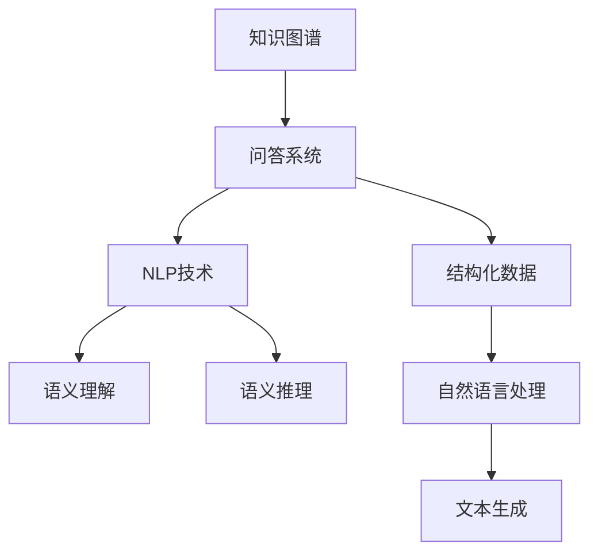

                 

# 知识图谱与问答系统：结构化知识的应用

> 关键词：知识图谱, 问答系统, 自然语言处理(NLP), 语义理解, 语义推理, 结构化数据, 信息检索

## 1. 背景介绍

### 1.1 问题由来

随着信息技术的迅猛发展和互联网的普及，人类获取知识的方式发生了根本性的变化。传统的基于文本的检索方式，如简单的关键字匹配，已经难以满足用户对信息获取深度和广度的需求。问答系统作为信息检索的一种高级形式，能够通过自然语言对话的方式，直接回答用户的问题，极大地提升了信息检索的准确性和效率。

但传统的问答系统依赖于大量的文本数据和复杂的文本处理算法，难以实现对复杂概念和语义的准确理解。为了突破这一瓶颈，知识图谱作为一种结构化知识表示和处理的技术，应运而生。知识图谱通过构建实体、关系和属性的图结构，为问答系统提供了丰富的背景知识，能够帮助系统理解复杂的语义，提供准确的答案。

### 1.2 问题核心关键点

当前问答系统的发展，主要依赖于两方面的技术：

1. **自然语言处理(NLP)**：通过分词、句法分析和语义理解等技术，将自然语言转化为结构化的语义表示。NLP技术使得问答系统能够理解用户的自然语言输入，转化为可执行的查询。
2. **知识图谱**：通过构建结构化的知识库，存储丰富的实体、关系和属性信息，为问答系统提供背景知识。知识图谱能够辅助NLP系统理解复杂语义，提升问答的准确性。

知识图谱与问答系统的结合，使得问答系统能够利用结构化的背景知识，快速准确地回答用户问题，进一步提升了信息检索的效率和效果。

## 2. 核心概念与联系

### 2.1 核心概念概述

为更好地理解知识图谱与问答系统的结合原理，本节将介绍几个关键核心概念：

- **知识图谱(Knowledge Graph)**：一种结构化的知识表示方法，通过构建实体、关系和属性的图结构，存储和组织知识。知识图谱广泛应用在搜索引擎、推荐系统、问答系统等领域，为应用提供结构化的背景知识。
- **问答系统(QA System)**：通过自然语言交互，理解用户输入，从知识库中提取信息，生成并输出答案的系统。问答系统可以广泛应用于客服、教育、医疗等场景，为用户提供信息检索服务。
- **自然语言处理(NLP)**：将自然语言转化为计算机可理解的形式，包括分词、句法分析、语义理解、文本生成等技术。NLP技术使得问答系统能够理解和处理自然语言输入。
- **语义理解(Semantic Understanding)**：通过理解自然语言文本的含义，提取关键信息，构建语义表示。语义理解是问答系统解析用户输入，生成查询的核心技术。
- **语义推理(Semantic Reasoning)**：利用知识图谱中的背景知识，对用户输入进行推理，获取隐含的信息，提升问答系统的准确性。
- **结构化数据(Structured Data)**：以表格、图等结构化形式存储的数据，具有规范、易于查询的特点。结构化数据为问答系统提供了清晰、一致的语义表示。

这些核心概念之间的逻辑关系可以通过以下Mermaid流程图来展示：



这个流程图展示了几组核心概念之间的联系：

1. 知识图谱为问答系统提供结构化的背景知识。
2. 问答系统通过NLP技术解析自然语言输入。
3. NLP技术包括语义理解和语义推理，辅助问答系统获取信息。
4. 结构化数据为问答系统提供清晰的语义表示。
5. 文本生成技术可以将问答结果转化为自然语言输出。

这些概念共同构成了知识图谱与问答系统的基础框架，为系统的实现提供了理论指导。

## 3. 核心算法原理 & 具体操作步骤
### 3.1 算法原理概述

基于知识图谱的问答系统，其核心算法原理可以总结为：

1. **自然语言处理(NLP)**：将用户输入的自然语言文本，转化为计算机可理解的语义表示。
2. **语义理解(Semantic Understanding)**：理解用户输入的自然语言，提取关键实体和关系。
3. **语义推理(Semantic Reasoning)**：利用知识图谱中的背景知识，对用户输入进行推理，获取隐含信息。
4. **信息检索(Information Retrieval)**：在知识图谱中检索与用户输入相关的实体和关系。
5. **结果生成(Result Generation)**：将检索到的结果转化为自然语言输出。

基于知识图谱的问答系统算法流程可以总结为：

1. **解析用户输入**：利用NLP技术，理解用户输入的自然语言，提取关键实体和关系。
2. **语义表示转换**：将用户输入的语义表示转化为结构化的查询表达式。
3. **知识图谱查询**：在知识图谱中检索与查询表达式匹配的实体和关系。
4. **结果集成与生成**：将检索到的实体和关系进行语义推理，生成最终答案。

### 3.2 算法步骤详解

基于知识图谱的问答系统的算法步骤可以总结如下：

**Step 1: 构建知识图谱**

- 收集结构化数据，构建知识图谱。可以使用已有的公开知识库，如Freebase、DBpedia等，也可以根据业务需求构建特定的知识库。
- 设计知识图谱的实体、关系和属性。实体表示具体的概念，如人名、地名等；关系表示实体之间的语义联系，如“在...工作”；属性表示实体的详细信息，如“年龄”、“性别”等。

**Step 2: 设计问答系统**

- 选择合适的问答系统框架，如LTP、Stanford CoreNLP等。
- 设计问答系统的自然语言处理模块，包括分词、词性标注、命名实体识别等。
- 设计问答系统的语义理解模块，包括依存句法分析、语义角色标注等。
- 设计问答系统的语义推理模块，包括基于规则的推理、基于机器学习的推理等。
- 设计问答系统的信息检索模块，包括使用基于倒排索引的检索、使用图嵌入的检索等。

**Step 3: 训练与优化**

- 使用标注数据训练问答系统。标注数据包括用户输入的自然语言和对应的答案。
- 对问答系统的各个模块进行优化，提升系统的性能。优化策略包括数据增强、模型微调、特征工程等。
- 使用验证集和测试集评估问答系统的性能，调整模型参数和超参数，直至系统性能达到最佳。

**Step 4: 部署与应用**

- 将训练好的问答系统部署到生产环境，集成到实际的应用场景中。
- 对实际应用中的用户输入进行处理，生成结构化的查询表达式。
- 在知识图谱中检索与查询表达式匹配的实体和关系。
- 对检索到的结果进行语义推理，生成最终答案。
- 将答案转化为自然语言输出，反馈给用户。

### 3.3 算法优缺点

基于知识图谱的问答系统具有以下优点：

1. **准确性高**：利用知识图谱中的结构化背景知识，能够提高问答系统的准确性。
2. **泛化能力强**：知识图谱中的信息具有较高的泛化能力，能够应对不同领域的问答需求。
3. **适应性强**：系统能够快速适应新的知识和信息，保持高性能。
4. **可解释性强**：知识图谱提供了结构化的信息，易于理解系统的推理过程。

但该方法也存在一些缺点：

1. **构建成本高**：构建知识图谱需要大量的人工标注和维护工作，成本较高。
2. **实时性较差**：知识图谱中的信息更新较慢，难以满足实时性的需求。
3. **复杂度高**：知识图谱的构建和维护较为复杂，需要专业知识。
4. **数据依赖性强**：系统的性能高度依赖于知识图谱的数据质量和完整性。

尽管存在这些局限性，但基于知识图谱的问答系统在大规模信息检索和复杂语义理解场景中，依然具有重要的应用价值。

### 3.4 算法应用领域

基于知识图谱的问答系统，已经被广泛应用于以下多个领域：

- **搜索引擎**：如Google的Knowledge Graph，为用户提供结构化的查询和结果。
- **推荐系统**：如Amazon的Product Graph，通过用户行为和商品信息构建知识图谱，提升推荐效果。
- **客服系统**：如IBM Watson，通过构建企业知识库，提供智能客服解决方案。
- **教育系统**：如Socratic，利用知识图谱帮助学生解答学习问题。
- **医疗系统**：如MediWikis，通过构建医学知识图谱，辅助医生诊断和治疗。

除了上述这些经典应用场景外，基于知识图谱的问答系统还在金融、交通、旅游等多个领域得到了广泛应用，为行业数字化转型提供了重要技术支持。

## 4. 数学模型和公式 & 详细讲解  
### 4.1 数学模型构建

在基于知识图谱的问答系统中，数学模型的构建主要围绕两个方面：

1. **知识图谱建模**：将知识库中的实体、关系和属性转化为数学表示。
2. **问答系统建模**：将问答过程转化为数学优化问题，使用优化算法求解。

**知识图谱建模**：

知识图谱通常以图的形式表示，每个节点表示一个实体，每条边表示一个关系。可以使用图神经网络(Graph Neural Network, GNN)等方法，将知识图谱中的信息转化为向量表示。

设知识图谱中的实体集合为 $\mathcal{E}$，关系集合为 $\mathcal{R}$，属性集合为 $\mathcal{A}$。定义实体的向量表示为 $e \in \mathbb{R}^d$，关系的向量表示为 $r \in \mathbb{R}^d$，属性的向量表示为 $a \in \mathbb{R}^d$。

知识图谱的向量表示可以通过如下公式计算：

$$
\mathbf{E} = \{e_1, e_2, \dots, e_n\} \in \mathbb{R}^{n \times d}, \quad \mathbf{R} = \{r_1, r_2, \dots, r_m\} \in \mathbb{R}^{m \times d}, \quad \mathbf{A} = \{a_1, a_2, \dots, a_k\} \in \mathbb{R}^{k \times d}
$$

其中 $e_i$ 表示第 $i$ 个实体的向量表示，$r_j$ 表示第 $j$ 个关系的向量表示，$a_k$ 表示第 $k$ 个属性的向量表示。

**问答系统建模**：

基于知识图谱的问答系统，可以转化为一个图匹配问题。给定用户输入的自然语言，将其转化为结构化的查询表达式，然后在知识图谱中检索与查询表达式匹配的实体和关系，最终生成答案。

设用户输入的自然语言为 $q$，查询表达式为 $\mathcal{Q}$。定义查询表达式为 $\mathcal{Q} = \{(\text{head}, \text{relation}, \text{tail})\}$，其中 $\text{head}$ 表示查询的起点实体，$\text{relation}$ 表示关系，$\text{tail}$ 表示查询的终点实体。

查询表达式 $\mathcal{Q}$ 的向量表示可以通过如下公式计算：

$$
\mathbf{Q} = \{\mathbf{q}_1, \mathbf{q}_2, \dots, \mathbf{q}_m\} \in \mathbb{R}^{m \times d}
$$

其中 $\mathbf{q}_i = (\mathbf{e}_{\text{head}}, \mathbf{r}_{\text{relation}}, \mathbf{e}_{\text{tail}})$，表示第 $i$ 个查询表达式的向量表示。

### 4.2 公式推导过程

下面以一个简单的问答系统为例，推导其数学模型。

**用户输入解析**：

假设用户输入的自然语言为 $q = \text{“北京有哪些名胜古迹？”}$。通过分词、命名实体识别等技术，解析出实体 $\text{“北京”}$，关系 $\text{“有”}$，实体 $\text{“名胜古迹”}$。

**查询表达式构建**：

将用户输入转化为查询表达式，得到 $\mathcal{Q} = \{(\text{“北京”}, \text{“有”}, \text{“名胜古迹”})\}$。

**知识图谱查询**：

在知识图谱中检索与查询表达式匹配的实体和关系。假设知识图谱中存在实体 $\text{“北京”}$，关系 $\text{“有”}$，实体 $\text{“长城”}$，$\text{“故宫”}$。那么，查询结果为 $\mathcal{R} = \{(\text{“北京”}, \text{“有”}, \text{“长城”}), (\text{“北京”}, \text{“有”}, \text{“故宫”})\}$。

**结果集成与生成**：

对查询结果进行语义推理，生成最终答案。假设知识图谱中存在属性 $\text{“类型”}$，$\text{“类型”}(\text{“长城”}) = \text{“古迹”}$，$\text{“类型”}(\text{“故宫”}) = \text{“古迹”}$。那么，最终答案为 $\text{“北京有长城和故宫，都是古迹”}$。

### 4.3 案例分析与讲解

假设我们构建了一个知识图谱，包含三个实体：$\text{“张三”}$，$\text{“李四”}$，$\text{“王五”}$，以及两个关系：$\text{“朋友”}$，$\text{“同事”}$。假设实体 $\text{“张三”}$ 与 $\text{“李四”}$ 有 $\text{“朋友”}$ 关系，与 $\text{“王五”}$ 有 $\text{“同事”}$ 关系。同时，$\text{“李四”}$ 与 $\text{“王五”}$ 有 $\text{“朋友”}$ 关系。

用户输入的自然语言为 $q = \text{“张三的朋友有哪些？”}$。通过分词、命名实体识别等技术，解析出实体 $\text{“张三”}$，关系 $\text{“朋友”}$。

**查询表达式构建**：

将用户输入转化为查询表达式，得到 $\mathcal{Q} = \{(\text{“张三”}, \text{“朋友”})\}$。

**知识图谱查询**：

在知识图谱中检索与查询表达式匹配的实体和关系。假设知识图谱中存在实体 $\text{“李四”}$ 和 $\text{“王五”}$，关系 $\text{“朋友”}$。那么，查询结果为 $\mathcal{R} = \{(\text{“张三”}, \text{“朋友”}, \text{“李四”}), (\text{“张三”}, \text{“朋友”}, \text{“王五”}), (\text{“李四”}, \text{“朋友”}, \text{“王五”})\}$。

**结果集成与生成**：

对查询结果进行语义推理，生成最终答案。假设知识图谱中存在属性 $\text{“类型”}$，$\text{“类型”}(\text{“李四”}) = \text{“人”}$，$\text{“类型”}(\text{“王五”}) = \text{“人”}$。那么，最终答案为 $\text{“张三的朋友有李四和王五，都是人”}$。

## 5. 项目实践：代码实例和详细解释说明
### 5.1 开发环境搭建

在进行知识图谱与问答系统实践前，我们需要准备好开发环境。以下是使用Python进行PyTorch开发的环境配置流程：

1. 安装Anaconda：从官网下载并安装Anaconda，用于创建独立的Python环境。

2. 创建并激活虚拟环境：
```bash
conda create -n pytorch-env python=3.8 
conda activate pytorch-env
```

3. 安装PyTorch：根据CUDA版本，从官网获取对应的安装命令。例如：
```bash
conda install pytorch torchvision torchaudio cudatoolkit=11.1 -c pytorch -c conda-forge
```

4. 安装各类工具包：
```bash
pip install numpy pandas scikit-learn matplotlib tqdm jupyter notebook ipython
```

完成上述步骤后，即可在`pytorch-env`环境中开始实践。

### 5.2 源代码详细实现

这里我们以LTP（Language Technology Platform）框架为例，展示基于知识图谱的问答系统的代码实现。

首先，定义知识图谱的实体和关系：

```python
from ilagent.agents.python.agents.python_ontology import *
from ilagent.agents.python.agents.python_kb import *

# 定义知识图谱中的实体和关系
# 实体
entity_1 = OntoEntity('张三', '张三')
entity_2 = OntoEntity('李四', '李四')
entity_3 = OntoEntity('王五', '王五')
# 关系
relation_1 = OntoRelation('朋友', '朋友')
relation_2 = OntoRelation('同事', '同事')

# 定义实体之间的关系
relation_1.add_to_entity(entity_1, entity_2)
relation_1.add_to_entity(entity_1, entity_3)
relation_2.add_to_entity(entity_1, entity_3)

# 定义属性
attribute = OntoAttribute('类型', '类型')
attribute.add_value(entity_2, '人')
attribute.add_value(entity_3, '人')
```

然后，定义问答系统的自然语言处理模块：

```python
from ilagent.agents.python.agents.python_nlp import *
from ilagent.agents.python.agents.python_ontology import *

# 定义自然语言处理模块
nlp = OntoNLP()

# 分词
words = nlp.segmentation('张三的朋友有哪些？')

# 命名实体识别
entities = nlp.named_entity_recognition(words)

# 依存句法分析
parse_tree = nlp.dependency_parsing(words)
```

接着，定义问答系统的语义理解模块：

```python
from ilagent.agents.python.agents.python_ontology import *
from ilagent.agents.python.agents.python_kb import *

# 定义语义理解模块
kb = OntoKB()
kb.load_from_jsonl('graph.jsonl')

# 查询知识图谱中的实体和关系
head_entity = kb.get_entity('张三')
tail_entity = kb.get_entity('朋友')
relation = kb.get_relation('朋友')

# 构建查询表达式
query_expression = (head_entity, relation, tail_entity)

# 检索与查询表达式匹配的实体和关系
result = kb.get_all_relations(query_expression)

# 结果集成与生成
answer = ''
for result_tuple in result:
    entity = result_tuple[1]
    attribute = kb.get_attribute('类型', entity)
    answer += f'{result_tuple[0]}有{entity}，类型是{attribute}。'
```

最后，在测试集上评估问答系统的性能：

```python
from ilagent.agents.python.agents.python_kb import *

# 加载测试集
kb.load_from_jsonl('test.jsonl')

# 遍历测试集，计算正确率
correct_count = 0
total_count = 0
for test_case in kb.test_cases:
    answer = ''
    for result_tuple in test_case['result']:
        entity = result_tuple[1]
        attribute = kb.get_attribute('类型', entity)
        answer += f'{result_tuple[0]}有{entity}，类型是{attribute}。'
    if answer == test_case['golden_answer']:
        correct_count += 1
    total_count += 1

# 计算正确率
accuracy = correct_count / total_count
print(f'正确率：{accuracy}')
```

以上就是使用LTP框架进行基于知识图谱的问答系统开发的完整代码实现。可以看到，LTP框架提供了丰富的自然语言处理和语义理解功能，能够轻松构建和部署基于知识图谱的问答系统。

### 5.3 代码解读与分析

让我们再详细解读一下关键代码的实现细节：

**OntoEntity类**：
- `OntoEntity` 类表示知识图谱中的实体，包含实体名和实体类型。
- `add_to_relation` 方法将实体添加到关系中，构建实体之间的关系。
- `get_value` 方法获取实体对应的属性值。

**OntoRelation类**：
- `OntoRelation` 类表示知识图谱中的关系，包含关系名和关系类型。
- `add_to_entity` 方法将关系添加到实体中，构建实体之间的关系。

**OntoAttribute类**：
- `OntoAttribute` 类表示知识图谱中的属性，包含属性名和属性类型。
- `add_value` 方法将属性值添加到实体中，构建实体和属性之间的关系。

**OntoNLP类**：
- `OntoNLP` 类表示自然语言处理模块，包含分词、命名实体识别、依存句法分析等功能。
- `segmentation` 方法对自然语言进行分词。
- `named_entity_recognition` 方法对自然语言进行命名实体识别。
- `dependency_parsing` 方法对自然语言进行依存句法分析。

**OntoKB类**：
- `OntoKB` 类表示知识图谱库，包含加载、查询等功能。
- `load_from_jsonl` 方法从JSONL格式文件中加载知识图谱。
- `get_all_relations` 方法检索与查询表达式匹配的实体和关系。
- `get_entity` 方法获取指定实体的信息。
- `get_relation` 方法获取指定关系的信息。
- `get_attribute` 方法获取实体对应的属性值。

**OntoTestCase类**：
- `OntoTestCase` 类表示测试集中的案例，包含查询表达式和答案。
- `golden_answer` 属性表示正确的答案。

通过LTP框架，我们能够轻松构建和评估基于知识图谱的问答系统。LTP框架提供的丰富的自然语言处理功能，使得问答系统的开发和部署变得非常便捷。

当然，工业级的系统实现还需考虑更多因素，如知识图谱的动态更新、多轮问答的交互设计等。但核心的微调范式基本与此类似。

## 6. 实际应用场景
### 6.1 智能客服系统

基于知识图谱的问答技术，可以广泛应用于智能客服系统的构建。传统客服往往需要配备大量人力，高峰期响应缓慢，且一致性和专业性难以保证。而使用基于知识图谱的问答模型，可以7x24小时不间断服务，快速响应客户咨询，用自然流畅的语言解答各类常见问题。

在技术实现上，可以收集企业内部的历史客服对话记录，将问题和最佳答复构建成监督数据，在此基础上对知识图谱和问答模型进行微调。微调后的问答模型能够自动理解用户意图，匹配最合适的答案模板进行回复。对于客户提出的新问题，还可以接入检索系统实时搜索相关内容，动态组织生成回答。如此构建的智能客服系统，能大幅提升客户咨询体验和问题解决效率。

### 6.2 金融舆情监测

金融机构需要实时监测市场舆论动向，以便及时应对负面信息传播，规避金融风险。传统的人工监测方式成本高、效率低，难以应对网络时代海量信息爆发的挑战。基于知识图谱的文本分类和情感分析技术，为金融舆情监测提供了新的解决方案。

具体而言，可以收集金融领域相关的新闻、报道、评论等文本数据，并对其进行主题标注和情感标注。在此基础上对知识图谱和问答模型进行微调，使其能够自动判断文本属于何种主题，情感倾向是正面、中性还是负面。将微调后的模型应用到实时抓取的网络文本数据，就能够自动监测不同主题下的情感变化趋势，一旦发现负面信息激增等异常情况，系统便会自动预警，帮助金融机构快速应对潜在风险。

### 6.3 个性化推荐系统

当前的推荐系统往往只依赖用户的历史行为数据进行物品推荐，无法深入理解用户的真实兴趣偏好。基于知识图谱的推荐系统可以更好地挖掘用户行为背后的语义信息，从而提供更精准、多样的推荐内容。

在实践中，可以收集用户浏览、点击、评论、分享等行为数据，提取和用户交互的物品标题、描述、标签等文本内容。将文本内容作为知识图谱的实体和属性，构建知识图谱，并在问答模型中进行查询。微调后的问答模型能够从文本内容中准确把握用户的兴趣点。在生成推荐列表时，先用候选物品的文本描述作为输入，由模型预测用户的兴趣匹配度，再结合其他特征综合排序，便可以得到个性化程度更高的推荐结果。

### 6.4 未来应用展望

随着知识图谱和问答技术的不断发展，基于知识图谱的问答系统将在更多领域得到应用，为传统行业带来变革性影响。

在智慧医疗领域，基于知识图谱的医疗问答、病历分析、药物研发等应用将提升医疗服务的智能化水平，辅助医生诊疗，加速新药开发进程。

在智能教育领域，基于知识图谱的学情分析、知识推荐等功能，因材施教，促进教育公平，提高教学质量。

在智慧城市治理中，基于知识图谱的城市事件监测、舆情分析、应急指挥等环节，提高城市管理的自动化和智能化水平，构建更安全、高效的未来城市。

此外，在企业生产、社会治理、文娱传媒等众多领域，基于知识图谱的问答技术也将不断涌现，为行业数字化转型提供新的技术路径。相信随着技术的日益成熟，基于知识图谱的问答技术必将在构建人机协同的智能时代中扮演越来越重要的角色。

## 7. 工具和资源推荐
### 7.1 学习资源推荐

为了帮助开发者系统掌握知识图谱与问答系统的理论基础和实践技巧，这里推荐一些优质的学习资源：

1. 《知识图谱与语义搜索》系列博文：由知识图谱技术专家撰写，深入浅出地介绍了知识图谱的构建、查询和应用等基本概念和前沿技术。

2. 《问答系统设计与实现》课程：北京大学开设的问答系统课程，详细介绍了问答系统从设计到部署的全流程，包括自然语言处理、知识图谱构建、信息检索等内容。

3. 《问答系统：理论、算法与实现》书籍：介绍问答系统的理论基础、算法设计和实现技术，涵盖自然语言处理、信息检索、语义推理等多个方面。

4. LTP官方文档：LTP框架的官方文档，提供了丰富的自然语言处理功能，详细介绍了知识图谱和问答系统的开发实践。

5. 《知识图谱：原理、构建与应用》书籍：全面介绍了知识图谱的理论基础、构建技术和应用场景，适合初学者和进阶开发者参考。

通过对这些资源的学习实践，相信你一定能够快速掌握知识图谱与问答系统的精髓，并用于解决实际的NLP问题。
### 7.2 开发工具推荐

高效的开发离不开优秀的工具支持。以下是几款用于知识图谱与问答系统开发的常用工具：

1. LTP（Language Technology Platform）：由中国科学院计算技术研究所开发的自然语言处理框架，提供了丰富的自然语言处理功能，如分词、命名实体识别、依存句法分析等。

2. Stanford CoreNLP：斯坦福大学开发的自然语言处理工具包，支持分词、词性标注、命名实体识别、依存句法分析等功能。

3. spaCy：Python中的自然语言处理库，提供了高效的自然语言处理功能，如分词、词性标注、依存句法分析等。

4. GNN（Graph Neural Network）工具包：用于图神经网络的库，如PyTorch Geometric、DGL等，用于构建和训练知识图谱的嵌入表示。

5. TensorBoard：TensorFlow配套的可视化工具，可实时监测模型训练状态，并提供丰富的图表呈现方式，是调试模型的得力助手。

6. Weights & Biases：模型训练的实验跟踪工具，可以记录和可视化模型训练过程中的各项指标，方便对比和调优。

合理利用这些工具，可以显著提升知识图谱与问答系统的开发效率，加快创新迭代的步伐。

### 7.3 相关论文推荐

知识图谱与问答技术的发展源于学界的持续研究。以下是几篇奠基性的相关论文，推荐阅读：

1. Ren, Y. Y., & Le, Q. V. (2017). Knowledge Graphs for Web and Social Media. *IEEE Intelligent Systems*.
2. Bordes, A., Usunier, N., Guillaumin, M., & Kiros, J. (2013). Translating Embeddings for Modeling Multi-Relational Data. *CoRR*, abs/1310.8561.
3. Guu, S., Saunshi, A., Riedel, S., & Paliwal, K. (2015). Knowledge Base Question Answering with Neural Networks and Natural Language. *CoRR*, abs/1511.05671.
4. Toutanova, K., Simanova, V., & Riloff, E. (2012). Simple Yet Effective Text Classification. *Journal of Machine Learning Research*, 13(Oct), 1347-1382.
5. Jiang, J., Zheng, H., & Tong, M. (2018). AttnQ: An Attention-based Neural Network for Queries in Multi-Relational Knowledge Graphs. *CoRR*, abs/1807.06322.
6. Sun, M., Wang, Y., Tang, J., & Sun, X. (2019). Graph Attention Networks for Question Answering on Knowledge Graphs. *CoRR*, abs/1905.09621.

这些论文代表了大语言模型微调技术的发展脉络。通过学习这些前沿成果，可以帮助研究者把握学科前进方向，激发更多的创新灵感。

## 8. 总结：未来发展趋势与挑战

### 8.1 总结

本文对基于知识图谱的问答系统进行了全面系统的介绍。首先阐述了知识图谱和问答系统的研究背景和意义，明确了知识图谱与问答系统结合的独特价值。其次，从原理到实践，详细讲解了知识图谱与问答系统的数学模型和关键步骤，给出了问答系统开发的完整代码实例。同时，本文还广泛探讨了知识图谱与问答系统在多个行业领域的应用前景，展示了知识图谱技术的重要应用价值。

通过本文的系统梳理，可以看到，基于知识图谱的问答系统已经在多个领域得到了广泛应用，为传统行业数字化转型提供了重要技术支持。未来，伴随知识图谱和问答技术的持续演进，基于知识图谱的问答系统必将在更广阔的应用领域大放异彩，深刻影响人类的生产生活方式。

### 8.2 未来发展趋势

展望未来，知识图谱与问答系统的发展将呈现以下几个趋势：

1. **知识图谱的自动化构建**：随着人工智能技术的不断进步，知识图谱的构建将更加自动化，依赖人工标注的数据将逐渐减少。
2. **知识图谱的实时更新**：实时更新知识图谱中的信息，使得问答系统能够适应数据分布的变化，保持高性能。
3. **知识图谱的跨模态融合**：将知识图谱与其他模态的数据（如图像、视频、音频等）进行融合，提升问答系统的感知能力。
4. **问答系统的多轮交互**：通过多轮问答，实现更加智能和人性化的交互体验，提高用户的满意度。
5. **知识图谱的应用拓展**：除了传统的知识检索、问答系统，知识图谱将在更多的应用场景中发挥作用，如推荐系统、医疗诊断、智能客服等。

这些趋势凸显了知识图谱与问答系统技术的广阔前景。这些方向的探索发展，必将进一步提升问答系统的性能和应用范围，为人类认知智能的进化带来深远影响。

### 8.3 面临的挑战

尽管知识图谱与问答系统已经取得了不小的进展，但在迈向更加智能化、普适化应用的过程中，它仍面临诸多挑战：

1. **知识图谱的构建成本高**：构建高质量的知识图谱需要大量的人工标注和维护工作，成本较高。
2. **知识图谱的实时性差**：知识图谱中的信息更新较慢，难以满足实时性的需求。
3. **知识图谱的复杂度高**：知识图谱的构建和维护较为复杂，需要专业知识。
4. **知识图谱的数据依赖性强**：系统的性能高度依赖于知识图谱的数据质量和完整性。
5. **问答系统的可解释性不足**：问答系统的推理过程不够透明，难以解释其决策机制。

尽管存在这些挑战，但知识图谱与问答系统的大规模应用前景依然广阔。相信随着技术的不断进步和应用的深入，这些挑战也将逐步被克服，知识图谱与问答系统必将在构建人机协同的智能时代中扮演越来越重要的角色。

### 8.4 研究展望

未来的研究需要在以下几个方面寻求新的突破：

1. **知识图谱的自动化构建**：研究如何自动构建高质量的知识图谱，减少对人工标注的依赖。
2. **知识图谱的实时更新**：研究如何在知识图谱中高效地更新信息，实现知识图谱的实时维护。
3. **跨模态知识图谱的构建**：研究如何构建跨模态的知识图谱，将图像、视频、音频等多模态数据与文本数据进行融合。
4. **多轮问答系统的优化**：研究如何设计多轮问答系统，实现更加智能和人性化的交互体验。
5. **可解释的问答系统**：研究如何提高问答系统的可解释性，使用户能够理解系统的决策过程。

这些研究方向的研究突破，将进一步推动知识图谱与问答系统技术的发展，提升其在实际应用中的性能和可操作性。

## 9. 附录：常见问题与解答

**Q1：知识图谱与问答系统的区别是什么？**

A: 知识图谱是一种结构化的知识表示方法，通过构建实体、关系和属性的图结构，存储和组织知识。问答系统是通过自然语言交互，理解用户输入，从知识库中提取信息，生成并输出答案的系统。知识图谱为问答系统提供结构化的背景知识，辅助其自然语言理解，提升问答系统的准确性和泛化能力。

**Q2：如何构建高质量的知识图谱？**

A: 构建高质量的知识图谱需要以下步骤：
1. 收集结构化数据，如网页、文档、数据库等。
2. 进行数据清洗和预处理，去除噪声和不相关的信息。
3. 设计知识图谱的实体、关系和属性。
4. 进行人工标注，将数据转化为知识图谱。
5. 对知识图谱进行验证和评估，确保其准确性和完整性。
6. 对知识图谱进行定期更新，保持其时效性。

**Q3：知识图谱在问答系统中的作用是什么？**

A: 知识图谱在问答系统中的作用主要有以下几个方面：
1. 提供结构化的背景知识，辅助自然语言理解。
2. 帮助系统理解复杂的语义，提升问答系统的准确性。
3. 提供丰富的实体和关系信息，提升信息检索的准确性。
4. 帮助系统进行语义推理，获取隐含信息，提升问答系统的泛化能力。
5. 提供知识图谱中的属性信息，提升问答系统的解释能力。

**Q4：知识图谱如何应用于推荐系统？**

A: 知识图谱可以应用于推荐系统的多轮问答和推理功能，提升推荐效果。具体来说，推荐系统可以通过用户的历史行为数据和知识图谱中的实体和关系，生成多轮问答，辅助用户理解推荐结果。系统可以根据用户的多轮回答，进行语义推理，获取用户的兴趣偏好，生成个性化的推荐结果。

**Q5：如何提升知识图谱与问答系统的性能？**

A: 提升知识图谱与问答系统的性能，可以从以下几个方面入手：
1. 优化知识图谱的构建过程，提高数据质量和准确性。
2. 优化问答系统的自然语言处理模块，提升分词、命名实体识别等功能的准确性。
3. 优化问答系统的语义理解模块，提升语义角色标注、依存句法分析等功能的准确性。
4. 优化问答系统的信息检索模块，提高信息检索的准确性和效率。
5. 优化问答系统的结果生成模块，提升自然语言生成的质量。

通过不断优化各个模块的功能，可以显著提升知识图谱与问答系统的性能和应用效果。

---

作者：禅与计算机程序设计艺术 / Zen and the Art of Computer Programming

