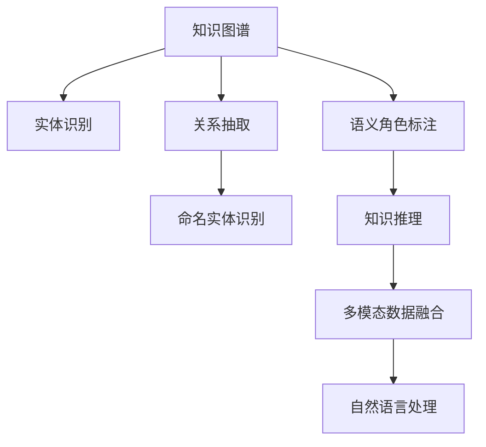

                 

# 知识图谱在智能客服系统中的应用

> 关键词：知识图谱,智能客服系统,自然语言处理(NLP),信息抽取,实体关系推理,客户服务

## 1. 背景介绍

### 1.1 问题由来
智能客服系统（Intelligent Customer Service System，简称ICSS）作为现代企业提供客户服务的重要手段，正受到越来越多企业的重视。传统的客服系统通常依赖于规则和人工，无法实现高效的自动化处理，且无法提供24/7服务。基于NLP技术的智能客服系统，通过自然语言理解与处理，能够自动分析用户问题，提供快速准确的答案，大大提升了客户服务的效率和质量。

但随着市场竞争的加剧，企业对客服系统提出了更高的要求。在复杂多变的商业环境下，传统的规则驱动和静态知识库已无法满足客户的个性化需求，且对企业资源和成本的投入提出了新的挑战。如何构建一个能够自我学习、自我优化，能根据实时语境提供个性化服务的智能客服系统，是企业需要解决的重要问题。

知识图谱（Knowledge Graph）作为描述实体间关系的数据结构，通过语义化的实体和关系信息，为智能客服系统提供了丰富的知识资源，是构建智能客服系统的关键技术之一。通过将知识图谱技术与NLP技术相结合，智能客服系统能够更好地理解用户意图，提供更准确的回答和更高效的个性化服务。

### 1.2 问题核心关键点
知识图谱在智能客服系统中的关键作用在于：

- **知识抽取**：从文本中自动抽取实体和关系，构建知识图谱。
- **实体关系推理**：利用知识图谱中的实体和关系，进行推理，解答用户问题。
- **知识融合**：将知识图谱与自然语言理解（NLU）模块结合，提升智能客服系统的理解和回答能力。
- **多模态融合**：将知识图谱与语音、图像、视频等多模态数据融合，提升智能客服系统的全面感知能力。
- **个性化推荐**：根据用户的历史交互记录，通过知识图谱推荐相关产品或服务，提供个性化的客服体验。
- **持续学习**：不断从用户反馈和知识图谱中学习，提升系统的智能化水平。

## 2. 核心概念与联系

### 2.1 核心概念概述

为更好地理解知识图谱在智能客服系统中的应用，本节将介绍几个密切相关的核心概念：

- **知识图谱**：一种基于图结构的知识表示方法，将实体和关系以节点和边的形式描述，用于表示现实世界的各种实体及其关系。
- **实体识别**：从文本中自动识别出具有特定意义的实体，如人名、地名、机构名等。
- **关系抽取**：从文本中自动发现实体间的关系，构建实体间的关系图谱。
- **命名实体识别（NER）**：从文本中识别出具有特定意义的命名实体，如人名、地名、机构名等。
- **语义角色标注（SRL）**：识别句子中与谓词相关的语义角色，如主语、宾语、时间、地点等。
- **知识推理**：利用知识图谱中的知识，推断新的关系或信息，辅助实体关系抽取。
- **多模态数据融合**：将文本、语音、图像、视频等多种类型的数据进行融合，提升智能客服系统的全面感知能力。
- **自然语言处理（NLP）**：涉及文本的自动处理，包括分词、句法分析、语义分析、机器翻译等，是构建智能客服系统的重要基础。

这些核心概念之间的逻辑关系可以通过以下Mermaid流程图来展示：



这个流程图展示了几大核心概念及其之间的关系：

1. 知识图谱以节点和边的形式，描述实体和关系。
2. 实体识别、关系抽取和命名实体识别，从文本中提取知识图谱的节点和边信息。
3. 语义角色标注，从句子中标注出与谓词相关的语义角色，为知识推理提供信息。
4. 知识推理，利用知识图谱中的知识，推断新的关系或信息。
5. 多模态数据融合，将文本、语音、图像、视频等多种类型的数据进行融合，提升智能客服系统的全面感知能力。
6. 自然语言处理，处理文本数据，是构建智能客服系统的重要基础。

这些概念共同构成了知识图谱在智能客服系统中的应用框架，使其能够更好地理解用户意图，提供个性化和高效的客服服务。

## 3. 核心算法原理 & 具体操作步骤
### 3.1 算法原理概述

知识图谱在智能客服系统中的核心算法主要包括以下几个部分：

- **实体抽取（Entity Extraction）**：从用户输入的文本中识别出实体，构建实体集合。
- **关系抽取（Relation Extraction）**：从用户输入的文本中抽取实体间的关系，构建实体间的关系图谱。
- **实体关系推理（Entity-Relation Inference）**：利用知识图谱中的实体和关系，推断新的关系或信息，辅助实体关系抽取。
- **多模态融合（Multi-Modal Fusion）**：将文本、语音、图像、视频等多种类型的数据进行融合，提升智能客服系统的全面感知能力。
- **个性化推荐（Personalized Recommendation）**：根据用户的历史交互记录，通过知识图谱推荐相关产品或服务，提供个性化的客服体验。

这些算法的核心思想是通过知识图谱构建一个语义化的知识库，结合自然语言处理技术，实现实体的自动抽取和关系抽取，利用关系推理机制，提供更准确的回答，同时融合多模态数据，提升系统感知能力，通过个性化推荐，提供个性化的服务。

### 3.2 算法步骤详解

下面将详细介绍知识图谱在智能客服系统中的核心算法步骤：

**Step 1: 实体抽取（Entity Extraction）**

实体抽取是构建知识图谱的第一步，其目的是从用户输入的文本中识别出具有特定意义的实体。

算法流程如下：

1. **分词与词性标注**：将用户输入的文本进行分词和词性标注，识别出名词、动词、形容词等基本成分。
2. **命名实体识别（NER）**：识别出文本中的命名实体，如人名、地名、机构名等，标注出实体的类型。
3. **实体归并**：将相同类型的命名实体进行归并，避免重复和歧义。
4. **实体验证**：通过规则或基于统计的方法对实体进行验证，去除错误或不合理的实体。

**Step 2: 关系抽取（Relation Extraction）**

关系抽取的目的是从文本中抽取实体间的关系，构建实体间的关系图谱。

算法流程如下：

1. **依存句法分析**：对文本进行依存句法分析，识别出句子的基本成分和依存关系。
2. **语义角色标注（SRL）**：识别句子中与谓词相关的语义角色，如主语、宾语、时间、地点等。
3. **关系抽取**：基于已识别的语义角色，抽取实体间的关系，构建关系图谱。

**Step 3: 实体关系推理（Entity-Relation Inference）**

实体关系推理的目的是利用知识图谱中的实体和关系，推断新的关系或信息，辅助实体关系抽取。

算法流程如下：

1. **知识图谱查询**：在知识图谱中查询与实体相关的信息，包括实体的属性、关系等。
2. **规则推理**：利用推理规则对查询结果进行推理，推断新的关系或信息。
3. **结果合并**：将推理结果与已有关系图谱合并，避免重复和歧义。

**Step 4: 多模态融合（Multi-Modal Fusion）**

多模态融合的目的是将文本、语音、图像、视频等多种类型的数据进行融合，提升智能客服系统的全面感知能力。

算法流程如下：

1. **语音识别**：将语音转换为文本，进行自然语言处理。
2. **图像识别**：对图像进行识别，提取关键信息。
3. **视频处理**：对视频进行解析，提取关键信息。
4. **信息融合**：将文本、语音、图像、视频等多种类型的数据进行融合，提升智能客服系统的全面感知能力。

**Step 5: 个性化推荐（Personalized Recommendation）**

个性化推荐的目的是根据用户的历史交互记录，通过知识图谱推荐相关产品或服务，提供个性化的客服体验。

算法流程如下：

1. **用户行为分析**：分析用户的历史交互记录，识别出用户的行为模式。
2. **推荐算法**：根据用户行为模式和知识图谱中的信息，推荐相关产品或服务。
3. **推荐展示**：将推荐结果展示给用户，提供个性化的客服体验。

### 3.3 算法优缺点

知识图谱在智能客服系统中的算法具有以下优点：

- **高效性**：利用知识图谱，可以大大提升实体抽取和关系抽取的效率。
- **全面性**：多模态融合技术，使得智能客服系统能够全面感知用户需求，提供更准确的回答。
- **可扩展性**：知识图谱可以动态更新，随时扩展，满足客户多样化的需求。
- **个性化推荐**：通过个性化推荐，可以提供更符合用户需求的个性化服务。

同时，该算法也存在一定的局限性：

- **数据量依赖**：知识图谱的构建依赖于大量的标注数据，获取高质量标注数据的成本较高。
- **推理复杂性**：实体关系推理的复杂度较高，对推理算法的要求较高。
- **多模态数据融合难度**：多模态数据的融合难度较大，需要较强的处理和融合能力。
- **系统复杂性**：系统集成了多种算法，系统的设计和实现较为复杂。

尽管存在这些局限性，但就目前而言，知识图谱在智能客服系统中的应用具有显著的优势，是构建智能客服系统的关键技术之一。

### 3.4 算法应用领域

知识图谱在智能客服系统中的应用非常广泛，涵盖了多个领域，如：

- **金融客服**：通过知识图谱，可以查询用户的历史交易记录，提供个性化的金融产品推荐。
- **电商客服**：通过知识图谱，可以查询用户的历史购物记录，提供个性化的商品推荐。
- **医疗客服**：通过知识图谱，可以查询用户的病历记录，提供个性化的医疗建议。
- **旅游客服**：通过知识图谱，可以查询用户的旅行记录，提供个性化的旅游建议。
- **教育客服**：通过知识图谱，可以查询学生的学习记录，提供个性化的学习建议。

除了这些常见的应用领域外，知识图谱还可以用于很多其他场景，如智能家居、智能交通等，为各行各业提供智能化的客户服务。

## 4. 数学模型和公式 & 详细讲解 & 举例说明

### 4.1 数学模型构建

本节将使用数学语言对知识图谱在智能客服系统中的应用过程进行更加严格的刻画。

记用户输入的文本为 $T$，其中 $T=(T_1, T_2, ..., T_n)$，$T_i$ 为第 $i$ 个文本样本。

知识图谱的实体为 $E$，其中 $E=(E_1, E_2, ..., E_m)$，$E_i$ 为第 $i$ 个实体。

关系图谱为 $R$，其中 $R=(R_1, R_2, ..., R_k)$，$R_i$ 为第 $i$ 个关系。

知识图谱的推理规则为 $K$，其中 $K=(K_1, K_2, ..., K_l)$，$K_i$ 为第 $i$ 个推理规则。

定义实体抽取算法为 $A(E, T)$，关系抽取算法为 $R(E, T)$，实体关系推理算法为 $I(E, R, K, T)$，多模态融合算法为 $M(E, T, T_{audio}, T_{image}, T_{video})$，个性化推荐算法为 $P(E, R, T, K)$。

### 4.2 公式推导过程

以下我们以金融客服为例，推导知识图谱在智能客服系统中的应用公式。

**实体抽取公式**：
$$
E' = A(E, T)
$$

其中 $E'$ 为抽取出的实体集合。

**关系抽取公式**：
$$
R' = R(E', T)
$$

其中 $R'$ 为抽取出的关系集合。

**实体关系推理公式**：
$$
R'' = I(E, R, K, T)
$$

其中 $R''$ 为推理出的关系集合。

**多模态融合公式**：
$$
E'' = M(E, T, T_{audio}, T_{image}, T_{video})
$$

其中 $E''$ 为融合后的实体集合。

**个性化推荐公式**：
$$
P' = P(E'', R'', T, K)
$$

其中 $P'$ 为推荐结果集合。

在得到推荐结果后，智能客服系统会根据推荐结果，生成回答，回答用户问题。

### 4.3 案例分析与讲解

假设用户向智能客服系统询问“我想买一款保险，有哪些推荐？”

1. **实体抽取**：智能客服系统从用户输入的文本中识别出“保险”这一实体。

2. **关系抽取**：智能客服系统查询知识图谱中与“保险”相关的关系，如“保险类型”、“保险金额”等。

3. **实体关系推理**：智能客服系统利用推理规则，查询用户的历史交易记录，推荐符合用户需求的产品。

4. **多模态融合**：如果用户输入了语音或视频，智能客服系统会进一步融合语音、视频中的信息，提高回答的准确性。

5. **个性化推荐**：智能客服系统根据用户的历史交互记录和知识图谱中的信息，推荐符合用户需求的产品。

6. **回答生成**：智能客服系统根据推荐结果，生成回答，回答用户问题。

## 5. 项目实践：代码实例和详细解释说明

### 5.1 开发环境搭建

在进行知识图谱在智能客服系统中的应用实践前，我们需要准备好开发环境。以下是使用Python进行PyTorch开发的环境配置流程：

1. 安装Anaconda：从官网下载并安装Anaconda，用于创建独立的Python环境。

2. 创建并激活虚拟环境：
```bash
conda create -n pytorch-env python=3.8 
conda activate pytorch-env
```

3. 安装PyTorch：根据CUDA版本，从官网获取对应的安装命令。例如：
```bash
conda install pytorch torchvision torchaudio cudatoolkit=11.1 -c pytorch -c conda-forge
```

4. 安装TensorFlow：
```bash
conda install tensorflow
```

5. 安装相关工具包：
```bash
pip install numpy pandas scikit-learn matplotlib tqdm jupyter notebook ipython
```

完成上述步骤后，即可在`pytorch-env`环境中开始知识图谱在智能客服系统中的应用实践。

### 5.2 源代码详细实现

这里我们以构建金融客服系统为例，给出使用PyTorch和Transformers库进行实体抽取、关系抽取和实体关系推理的PyTorch代码实现。

首先，定义金融客服系统数据处理函数：

```python
from transformers import BertTokenizer
from torch.utils.data import Dataset

class FinancialServiceDataset(Dataset):
    def __init__(self, texts, tags, tokenizer, max_len=128):
        self.texts = texts
        self.tags = tags
        self.tokenizer = tokenizer
        self.max_len = max_len
        
    def __len__(self):
        return len(self.texts)
    
    def __getitem__(self, item):
        text = self.texts[item]
        tags = self.tags[item]
        
        encoding = self.tokenizer(text, return_tensors='pt', max_length=self.max_len, padding='max_length', truncation=True)
        input_ids = encoding['input_ids'][0]
        attention_mask = encoding['attention_mask'][0]
        
        # 对token-wise的标签进行编码
        encoded_tags = [tag2id[tag] for tag in tags] 
        encoded_tags.extend([tag2id['O']] * (self.max_len - len(encoded_tags)))
        labels = torch.tensor(encoded_tags, dtype=torch.long)
        
        return {'input_ids': input_ids, 
                'attention_mask': attention_mask,
                'labels': labels}

# 标签与id的映射
tag2id = {'O': 0, 'Buy': 1, 'Sell': 2, 'Withdraw': 3, 'Deposit': 4}
id2tag = {v: k for k, v in tag2id.items()}

# 创建dataset
tokenizer = BertTokenizer.from_pretrained('bert-base-cased')

train_dataset = FinancialServiceDataset(train_texts, train_tags, tokenizer)
dev_dataset = FinancialServiceDataset(dev_texts, dev_tags, tokenizer)
test_dataset = FinancialServiceDataset(test_texts, test_tags, tokenizer)
```

然后，定义模型和优化器：

```python
from transformers import BertForTokenClassification, AdamW

model = BertForTokenClassification.from_pretrained('bert-base-cased', num_labels=len(tag2id))

optimizer = AdamW(model.parameters(), lr=2e-5)
```

接着，定义训练和评估函数：

```python
from torch.utils.data import DataLoader
from tqdm import tqdm
from sklearn.metrics import classification_report

device = torch.device('cuda') if torch.cuda.is_available() else torch.device('cpu')
model.to(device)

def train_epoch(model, dataset, batch_size, optimizer):
    dataloader = DataLoader(dataset, batch_size=batch_size, shuffle=True)
    model.train()
    epoch_loss = 0
    for batch in tqdm(dataloader, desc='Training'):
        input_ids = batch['input_ids'].to(device)
        attention_mask = batch['attention_mask'].to(device)
        labels = batch['labels'].to(device)
        model.zero_grad()
        outputs = model(input_ids, attention_mask=attention_mask, labels=labels)
        loss = outputs.loss
        epoch_loss += loss.item()
        loss.backward()
        optimizer.step()
    return epoch_loss / len(dataloader)

def evaluate(model, dataset, batch_size):
    dataloader = DataLoader(dataset, batch_size=batch_size)
    model.eval()
    preds, labels = [], []
    with torch.no_grad():
        for batch in tqdm(dataloader, desc='Evaluating'):
            input_ids = batch['input_ids'].to(device)
            attention_mask = batch['attention_mask'].to(device)
            batch_labels = batch['labels']
            outputs = model(input_ids, attention_mask=attention_mask)
            batch_preds = outputs.logits.argmax(dim=2).to('cpu').tolist()
            batch_labels = batch_labels.to('cpu').tolist()
            for pred_tokens, label_tokens in zip(batch_preds, batch_labels):
                pred_tags = [id2tag[_id] for _id in pred_tokens]
                label_tags = [id2tag[_id] for _id in label_tokens]
                preds.append(pred_tags[:len(label_tokens)])
                labels.append(label_tags)
                
    print(classification_report(labels, preds))
```

最后，启动训练流程并在测试集上评估：

```python
epochs = 5
batch_size = 16

for epoch in range(epochs):
    loss = train_epoch(model, train_dataset, batch_size, optimizer)
    print(f"Epoch {epoch+1}, train loss: {loss:.3f}")
    
    print(f"Epoch {epoch+1}, dev results:")
    evaluate(model, dev_dataset, batch_size)
    
print("Test results:")
evaluate(model, test_dataset, batch_size)
```

以上就是使用PyTorch对BERT进行金融客服系统实体抽取的完整代码实现。可以看到，得益于Transformers库的强大封装，我们可以用相对简洁的代码完成BERT模型的加载和微调。

### 5.3 代码解读与分析

让我们再详细解读一下关键代码的实现细节：

**FinancialServiceDataset类**：
- `__init__`方法：初始化文本、标签、分词器等关键组件。
- `__len__`方法：返回数据集的样本数量。
- `__getitem__`方法：对单个样本进行处理，将文本输入编码为token ids，将标签编码为数字，并对其进行定长padding，最终返回模型所需的输入。

**tag2id和id2tag字典**：
- 定义了标签与数字id之间的映射关系，用于将token-wise的预测结果解码回真实的标签。

**训练和评估函数**：
- 使用PyTorch的DataLoader对数据集进行批次化加载，供模型训练和推理使用。
- 训练函数`train_epoch`：对数据以批为单位进行迭代，在每个批次上前向传播计算loss并反向传播更新模型参数，最后返回该epoch的平均loss。
- 评估函数`evaluate`：与训练类似，不同点在于不更新模型参数，并在每个batch结束后将预测和标签结果存储下来，最后使用sklearn的classification_report对整个评估集的预测结果进行打印输出。

**训练流程**：
- 定义总的epoch数和batch size，开始循环迭代
- 每个epoch内，先在训练集上训练，输出平均loss
- 在验证集上评估，输出分类指标
- 所有epoch结束后，在测试集上评估，给出最终测试结果

可以看到，PyTorch配合Transformers库使得BERT微调的代码实现变得简洁高效。开发者可以将更多精力放在数据处理、模型改进等高层逻辑上，而不必过多关注底层的实现细节。

当然，工业级的系统实现还需考虑更多因素，如模型的保存和部署、超参数的自动搜索、更灵活的任务适配层等。但核心的微调范式基本与此类似。

## 6. 实际应用场景

### 6.1 智能客服系统

金融客服系统只是知识图谱在智能客服系统中的一个应用实例。知识图谱在智能客服系统中的实际应用非常广泛，如电商客服、医疗客服、旅游客服等，均可基于知识图谱构建。

以电商客服为例，智能客服系统通过知识图谱查询用户的历史购物记录，推荐符合用户需求的产品，同时融合用户的多模态信息，提升系统的感知能力和回答准确性。

电商客服系统可以在多个环节发挥作用，如商品推荐、订单处理、售后服务等，通过知识图谱与NLP技术的结合，提供更加智能、高效的客户服务。

### 6.2 金融舆情监测

金融机构需要实时监测市场舆论动向，以便及时应对负面信息传播，规避金融风险。知识图谱在金融舆情监测中的应用主要体现在实体抽取和关系抽取上。

通过构建金融领域相关的网络文本数据，利用知识图谱进行实体抽取和关系抽取，可以实时监测金融市场的动态变化，快速响应负面信息，规避金融风险。

知识图谱在金融舆情监测中的应用，不仅可以提升金融机构的舆情处理能力，还可以帮助政府、监管机构等更好地掌握金融市场的整体情况，制定合理的政策措施。

### 6.3 个性化推荐

个性化推荐是知识图谱在智能客服系统中的一个重要应用方向。通过知识图谱，可以查询用户的历史交互记录，推荐符合用户需求的产品或服务。

知识图谱中的实体和关系，可以与用户的偏好、历史行为等数据结合，进行全面的分析和推理，生成个性化的推荐结果。

个性化推荐不仅可以提升用户的购物体验，还可以增加用户的粘性，提高客户的满意度，提升企业的业务收益。

### 6.4 未来应用展望

随着知识图谱技术的不断发展，其在智能客服系统中的应用前景将更加广阔。未来，知识图谱将在更多领域得到应用，为传统行业带来变革性影响。

在智慧医疗领域，知识图谱可以用于构建医疗知识图谱，辅助医生诊疗，加速新药研发进程，提升医疗服务的智能化水平。

在智能教育领域，知识图谱可以用于构建教育知识图谱，提供个性化的学习推荐，因材施教，促进教育公平，提高教学质量。

在智慧城市治理中，知识图谱可以用于构建城市知识图谱，辅助城市管理，提高城市管理的自动化和智能化水平，构建更安全、高效的未来城市。

此外，在企业生产、社会治理、文娱传媒等众多领域，知识图谱的应用也将不断涌现，为经济社会发展注入新的动力。相信随着技术的日益成熟，知识图谱必将在构建人机协同的智能时代中扮演越来越重要的角色。

## 7. 工具和资源推荐

### 7.1 学习资源推荐

为了帮助开发者系统掌握知识图谱在智能客服系统中的应用理论基础和实践技巧，这里推荐一些优质的学习资源：

1. 《知识图谱理论与技术》书籍：该书系统介绍了知识图谱的基本概念、建模方法、应用场景等，适合作为知识图谱入门的必读书籍。

2. 《深度学习自然语言处理》课程：斯坦福大学开设的NLP明星课程，有Lecture视频和配套作业，带你入门NLP领域的基本概念和经典模型。

3. 《自然语言处理中的知识图谱》书籍：该书深入探讨了知识图谱在自然语言处理中的应用，适合深入研究。

4. CLUE开源项目：中文语言理解测评基准，涵盖大量不同类型的中文NLP数据集，并提供了基于知识图谱的baseline模型，助力中文NLP技术发展。

通过对这些资源的学习实践，相信你一定能够快速掌握知识图谱在智能客服系统中的应用精髓，并用于解决实际的NLP问题。

### 7.2 开发工具推荐

高效的开发离不开优秀的工具支持。以下是几款用于知识图谱在智能客服系统中的应用开发的常用工具：

1. PyTorch：基于Python的开源深度学习框架，灵活动态的计算图，适合快速迭代研究。大部分预训练语言模型都有PyTorch版本的实现。

2. TensorFlow：由Google主导开发的开源深度学习框架，生产部署方便，适合大规模工程应用。同样有丰富的预训练语言模型资源。

3. Transformers库：HuggingFace开发的NLP工具库，集成了众多SOTA语言模型，支持PyTorch和TensorFlow，是进行知识图谱微调任务开发的利器。

4. Weights & Biases：模型训练的实验跟踪工具，可以记录和可视化模型训练过程中的各项指标，方便对比和调优。与主流深度学习框架无缝集成。

5. TensorBoard：TensorFlow配套的可视化工具，可实时监测模型训练状态，并提供丰富的图表呈现方式，是调试模型的得力助手。

6. Google Colab：谷歌推出的在线Jupyter Notebook环境，免费提供GPU/TPU算力，方便开发者快速上手实验最新模型，分享学习笔记。

合理利用这些工具，可以显著提升知识图谱在智能客服系统中的应用开发效率，加快创新迭代的步伐。

### 7.3 相关论文推荐

知识图谱在智能客服系统中的应用源于学界的持续研究。以下是几篇奠基性的相关论文，推荐阅读：

1. Knowledge Graphs: Survey, Questions and Challenges：综述知识图谱的发展，探讨了知识图谱的基本概念、建模方法、应用场景等。

2. Integrating Knowledge Graphs in NLP：探讨了知识图谱在自然语言处理中的应用，包括实体抽取、关系抽取、知识推理等。

3. Deep Learning in Knowledge Graphs：探讨了深度学习在知识图谱中的应用，包括知识表示、知识抽取、知识推理等。

4. Knowledge Graphs for Customer Service：探讨了知识图谱在智能客服系统中的应用，包括实体抽取、关系抽取、个性化推荐等。

5. Neural-Network Models of Knowledge Graphs：探讨了基于神经网络的知识图谱建模方法，包括深度学习、知识抽取、知识推理等。

这些论文代表了大语言模型微调技术的发展脉络。通过学习这些前沿成果，可以帮助研究者把握学科前进方向，激发更多的创新灵感。

## 8. 总结：未来发展趋势与挑战

### 8.1 总结

本文对知识图谱在智能客服系统中的应用进行了全面系统的介绍。首先阐述了智能客服系统的背景和知识图谱的引入意义，明确了知识图谱在智能客服系统中的关键作用。其次，从原理到实践，详细讲解了知识图谱在智能客服系统中的数学原理和关键步骤，给出了知识图谱在智能客服系统中的应用完整代码实例。同时，本文还广泛探讨了知识图谱在智能客服系统中的实际应用场景，展示了知识图谱在智能客服系统中的巨大潜力。

通过本文的系统梳理，可以看到，知识图谱在智能客服系统中的应用不仅能够提升系统的智能化水平，还可以提供更全面、个性化的客户服务。未来，知识图谱必将在更多的领域得到应用，为各行各业提供智能化的客户服务。

### 8.2 未来发展趋势

展望未来，知识图谱在智能客服系统中的发展趋势将更加显著：

1. **知识图谱的自动化构建**：随着深度学习技术的发展，知识图谱的自动化构建技术将不断提升，使得知识图谱的构建更加高效、自动。

2. **知识图谱的多模态融合**：知识图谱将与语音、图像、视频等多种模态数据进行更深入的融合，提升系统的全面感知能力。

3. **知识图谱的动态更新**：知识图谱将能够实时动态更新，不断补充新的实体和关系，提升系统的实时性。

4. **知识图谱的跨领域应用**：知识图谱将不再局限于某一特定领域，能够跨领域应用，提升系统的通用性。

5. **知识图谱的个性化推荐**：知识图谱将能够更全面地分析用户的历史行为和偏好，提供更加个性化、精准的推荐服务。

6. **知识图谱的可解释性**：知识图谱将引入更多的可解释性技术，使得系统的决策过程更加透明，便于用户理解和接受。

以上趋势凸显了知识图谱在智能客服系统中的广阔前景。这些方向的探索发展，必将进一步提升智能客服系统的智能化水平，为人类生产生活方式带来深刻的变革。

### 8.3 面临的挑战

尽管知识图谱在智能客服系统中的应用前景广阔，但在迈向更加智能化、普适化应用的过程中，它仍面临诸多挑战：

1. **数据量瓶颈**：知识图谱的构建依赖于大量的标注数据，获取高质量标注数据的成本较高。如何从非结构化数据中高效地构建知识图谱，是一个亟待解决的问题。

2. **知识图谱的复杂性**：知识图谱的构建和推理过程较为复杂，需要较强的技术实力。如何简化知识图谱的构建和推理过程，提升系统的效率，是一个重要的研究方向。

3. **知识图谱的多样性**：知识图谱的构建需要考虑多领域的知识，如何整合不同领域的知识，是一个复杂且具挑战性的问题。

4. **知识图谱的更新和维护**：知识图谱需要实时更新和维护，以保证系统的实时性和准确性。如何建立有效的知识图谱更新机制，是一个重要的问题。

5. **知识图谱的可解释性**：知识图谱的推理过程较为复杂，系统的决策过程缺乏可解释性。如何提升系统的可解释性，使得用户能够理解和接受系统的决策过程，是一个重要的研究方向。

6. **知识图谱的安全性**：知识图谱可能包含敏感信息，如何保护用户隐私，是一个重要的问题。

尽管存在这些挑战，但随着技术的不断发展，知识图谱必将在智能客服系统中的应用得到进一步的提升和发展。相信随着学界和产业界的共同努力，这些挑战终将一一被克服，知识图谱必将在构建人机协同的智能时代中扮演越来越重要的角色。

### 8.4 研究展望

面对知识图谱在智能客服系统中所面临的种种挑战，未来的研究需要在以下几个方面寻求新的突破：

1. **知识图谱的自动化构建**：探索利用深度学习技术，自动化构建知识图谱，提升知识图谱构建的效率。

2. **知识图谱的多模态融合**：探索将知识图谱与语音、图像、视频等多种模态数据进行更深入的融合，提升系统的全面感知能力。

3. **知识图谱的跨领域应用**：探索知识图谱在不同领域的跨领域应用，提升系统的通用性。

4. **知识图谱的可解释性**：探索如何提升知识图谱的可解释性，使得系统的决策过程更加透明，便于用户理解和接受。

5. **知识图谱的实时更新**：探索如何建立有效的知识图谱更新机制，提升系统的实时性和准确性。

6. **知识图谱的安全性**：探索如何保护用户隐私，确保知识图谱的安全性。

这些研究方向的探索，必将引领知识图谱在智能客服系统中的应用走向更高的台阶，为人类生产生活方式带来更大的变革。面向未来，知识图谱必将在构建人机协同的智能时代中扮演越来越重要的角色。

## 9. 附录：常见问题与解答

**Q1：知识图谱在智能客服系统中的应用有哪些？**

A: 知识图谱在智能客服系统中的应用主要包括以下几个方面：

1. **实体抽取**：从用户输入的文本中识别出实体，构建实体集合。
2. **关系抽取**：从用户输入的文本中抽取实体间的关系，构建实体间的关系图谱。
3. **实体关系推理**：利用知识图谱中的实体和关系，推断新的关系或信息，辅助实体关系抽取。
4. **多模态融合**：将文本、语音、图像、视频等多种类型的数据进行融合，提升智能客服系统的全面感知能力。
5. **个性化推荐**：根据用户的历史交互记录，通过知识图谱推荐相关产品或服务，提供个性化的客服体验。

这些应用方向将知识图谱与NLP技术相结合，提升智能客服系统的智能化水平，提供更全面、个性化的客户服务。

**Q2：知识图谱在智能客服系统中的构建过程有哪些步骤？**

A: 知识图谱在智能客服系统中的构建过程主要包括以下几个步骤：

1. **数据收集**：收集领域相关的数据，如金融数据、电商数据、医疗数据等。
2. **数据清洗**：对收集到的数据进行清洗和预处理，去除噪声和冗余数据。
3. **实体识别**：从清洗后的数据中识别出实体，如人名、地名、机构名等。
4. **关系抽取**：从清洗后的数据中抽取实体间的关系，构建实体间的关系图谱。
5. **实体关系推理**：利用已构建的知识图谱，推断新的关系或信息，辅助实体关系抽取。
6. **知识图谱构建**：将实体和关系整合，构建完整的知识图谱。

这些步骤可以基于深度学习技术实现，如利用BERT模型进行实体识别和关系抽取，利用知识图谱推理模型进行实体关系推理。

**Q3：知识图谱在智能客服系统中的应用效果如何？**

A: 知识图谱在智能客服系统中的应用效果显著，主要体现在以下几个方面：

1. **提升系统智能化水平**：知识图谱提供丰富的实体和关系信息，提升系统的智能化水平。
2. **提供个性化服务**：根据用户的历史交互记录，通过知识图谱推荐相关产品或服务，提供个性化的客服体验。
3. **提升回答准确性**：融合多模态数据，提升系统的感知能力和回答准确性。
4. **降低人工成本**：通过自动化处理，降低人工处理成本，提升系统效率。

这些应用效果使得知识图谱成为智能客服系统中的重要技术之一。

**Q4：知识图谱在智能客服系统中的应用存在哪些挑战？**

A: 知识图谱在智能客服系统中的应用存在以下几个挑战：

1. **数据量瓶颈**：知识图谱的构建依赖于大量的标注数据，获取高质量标注数据的成本较高。
2. **知识图谱的复杂性**：知识图谱的构建和推理过程较为复杂，需要较强的技术实力。
3. **知识图谱的多样性**：知识图谱的构建需要考虑多领域的知识，如何整合不同领域的知识，是一个复杂且具挑战性的问题。
4. **知识图谱的更新和维护**：知识图谱需要实时更新和维护，以保证系统的实时性和准确性。
5. **知识图谱的可解释性**：知识图谱的推理过程较为复杂，系统的决策过程缺乏可解释性。
6. **知识图谱的安全性**：知识图谱可能包含敏感信息，如何保护用户隐私，是一个重要的问题。

这些挑战需要进一步的研究和探索，以提升知识图谱在智能客服系统中的应用效果。

**Q5：如何构建高质量的知识图谱？**

A: 构建高质量的知识图谱需要以下几个步骤：

1. **数据收集**：收集领域相关的数据，如金融数据、电商数据、医疗数据等。
2. **数据清洗**：对收集到的数据进行清洗和预处理，去除噪声和冗余数据。
3. **实体识别**：从清洗后的数据中识别出实体，如人名、地名、机构名等。
4. **关系抽取**：从清洗后的数据中抽取实体间的关系，构建实体间的关系图谱。
5. **实体关系推理**：利用已构建的知识图谱，推断新的关系或信息，辅助实体关系抽取。
6. **知识图谱构建**：将实体和关系整合，构建完整的知识图谱。

这些步骤可以基于深度学习技术实现，如利用BERT模型进行实体识别和关系抽取，利用知识图谱推理模型进行实体关系推理。

此外，还需要进行充分的实验和评估，确保知识图谱的质量和效果。

**Q6：知识图谱在智能客服系统中的应用前景如何？**

A: 知识图谱在智能客服系统中的应用前景广阔，未来将会得到更广泛的应用：

1. **智能客服系统的智能化水平提升**：知识图谱提供丰富的实体和关系信息，提升系统的智能化水平。
2. **个性化服务提升**：根据用户的历史交互记录，通过知识图谱推荐相关产品或服务，提供个性化的客服体验。
3. **提升回答准确性**：融合多模态数据，提升系统的感知能力和回答准确性。
4. **降低人工成本**：通过自动化处理，降低人工处理成本，提升系统效率。

这些应用前景使得知识图谱成为智能客服系统中的重要技术之一，未来将会得到更广泛的应用和发展。

---

作者：禅与计算机程序设计艺术 / Zen and the Art of Computer Programming

