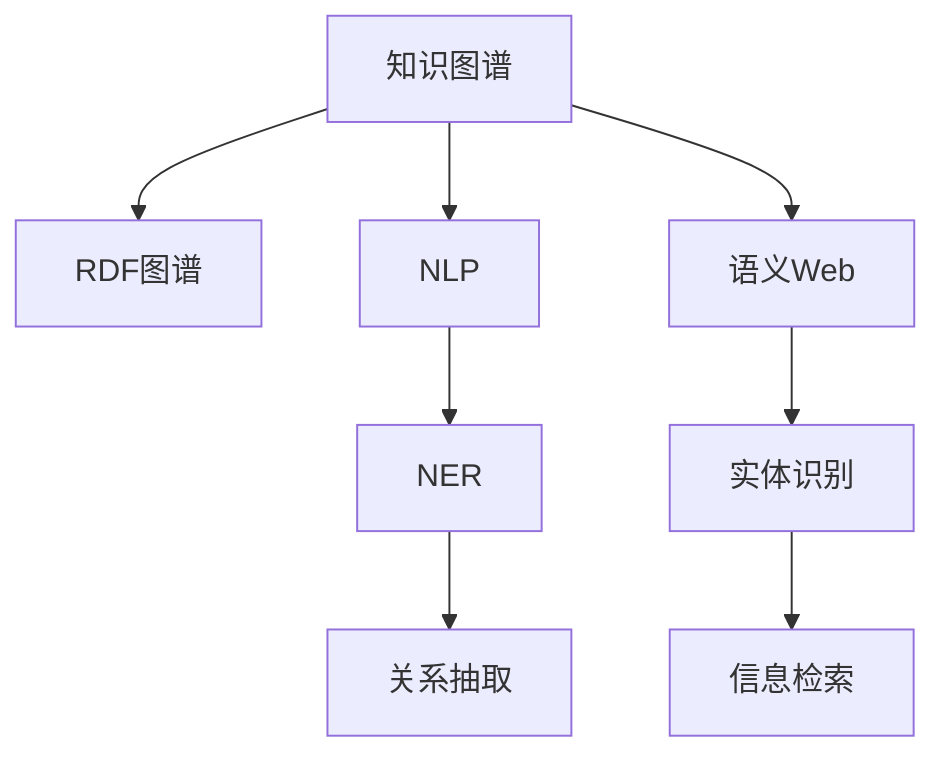

                 

# 知识图谱在程序员技能提升中的应用

> 关键词：知识图谱, 程序员, 技能提升, 数据驱动, 自然语言处理, 机器学习, 推理引擎, 编程语言, 软件开发工具

## 1. 背景介绍

### 1.1 问题由来
现代软件开发是一个高度复杂和动态变化的过程，涉及众多技术和领域。随着软件生态的不断演化，新的编程语言、开发工具和框架层出不穷，开发人员需要不断学习和更新自身技能以跟上技术进步。然而，随着技术栈的日益复杂，开发人员在技能获取和提升上遇到了越来越大的挑战：

1. **知识碎片化**：技术日新月异，开发者需不断掌握新的工具和框架。然而，由于时间和精力的限制，很难系统性地学习各种技术。

2. **知识查找效率低**：开发过程中常常需要查找特定技术或解决方案，但网络上的信息碎片化、更新不及时，导致查找过程繁琐且效果不佳。

3. **经验传递困难**：即使有经验丰富的开发者，他们也很难系统地将自己的知识传递给其他开发者。

面对这些问题，知识图谱提供了一种高效、结构化地组织和传播知识的方法，为开发人员技能提升提供了新的途径。

### 1.2 问题核心关键点
知识图谱是一个结构化的知识库，用于描述实体、关系和属性之间的语义联系。在程序员技能提升中，知识图谱能够帮助开发者：

1. **系统化学习**：提供结构化的知识框架，使开发者能系统地学习和掌握新技能。

2. **高效查询**：利用图谱的查询能力，快速获取特定技术或解决方案的信息。

3. **知识复用**：通过分享和复用图谱中的知识，实现经验的有效传递和积累。

4. **辅助决策**：提供决策支持，帮助开发者在复杂的技术选择中做出最优决策。

## 2. 核心概念与联系

### 2.1 核心概念概述

为更好地理解知识图谱在程序员技能提升中的应用，本节将介绍几个密切相关的核心概念：

- **知识图谱(Knowledge Graph)**：一种结构化的语义知识库，用于描述实体、关系和属性之间的语义联系。通常由节点（实体）和边（关系）组成。

- **RDF图谱(RDF Graph)**：一种用于描述知识图谱的标准数据格式，采用三元组形式表示实体、关系和属性。

- **自然语言处理(NLP)**：一种计算机科学和人工智能的分支，用于让计算机理解和处理人类语言。

- **语义Web**：一种使用Web语言（如HTML和XML）表示语义信息的Web技术。

- **实体识别(NER)**：从文本中识别出具有特定意义的实体（如人名、地名、组织名等）。

- **关系抽取(RE)**：从文本中提取实体之间的语义关系。

- **信息检索(IR)**：一种信息获取技术，用于从大量文本中快速找到相关信息。

这些核心概念之间的逻辑关系可以通过以下Mermaid流程图来展示：



这个流程图展示了这个主题相关的核心概念及其之间的关系：

1. 知识图谱通过RDF图谱进行表示，是构建语义Web的基础。
2. 知识图谱利用NLP技术，进行实体识别和关系抽取。
3. 信息检索技术用于从知识图谱中高效获取信息。

## 3. 核心算法原理 & 具体操作步骤
### 3.1 算法原理概述

知识图谱在程序员技能提升中的应用主要通过两个步骤实现：知识图谱构建和知识图谱查询。

1. **知识图谱构建**：构建一个包含程序员相关技能的图谱，包括编程语言、框架、工具、开发方法论等实体和它们之间的关系。

2. **知识图谱查询**：利用图谱的查询功能，帮助开发者查找特定技能、框架或工具的相关信息，辅助技能学习、项目开发和问题解决。

### 3.2 算法步骤详解

**Step 1: 知识图谱构建**
- 收集相关领域的技术文档、开发手册、博客文章等，提取其中的技能、技术、工具和框架等信息。
- 利用NLP技术对文本进行实体识别，识别出具体的技术名称、概念和属性。
- 利用关系抽取技术，分析文本中的实体关系，构建实体间的关联。
- 将提取的信息构建成RDF三元组，形成初步的知识图谱。

**Step 2: 知识图谱查询**
- 确定查询目标（如某种编程语言、开发框架或工具）。
- 利用图谱的查询语言（如SPARQL）构建查询语句，检索相关实体和关系。
- 根据查询结果，获取相关的文档、教程和示例代码。
- 结合搜索结果，进行系统的学习和实践。

### 3.3 算法优缺点

知识图谱在程序员技能提升中具有以下优点：

1. **系统化学习**：知识图谱提供了一个结构化的知识框架，帮助开发者系统地学习各种技能。

2. **高效查询**：通过结构化查询语言，可以快速获取特定技能的信息。

3. **知识复用**：图谱中的知识可以共享和复用，促进经验的积累和传递。

4. **辅助决策**：通过分析实体和关系，帮助开发者在技术选择中做出最优决策。

同时，知识图谱也存在一些局限性：

1. **构建成本高**：构建知识图谱需要大量的人工标注和数据收集工作，成本较高。

2. **数据更新难**：知识图谱需要定期更新，以保持其时效性和准确性，但更新过程复杂。

3. **复杂度高**：对于复杂的技术栈，构建和维护知识图谱的难度较大。

4. **可用性问题**：知识图谱的查询语言和查询复杂度可能会影响用户的体验。

### 3.4 算法应用领域

知识图谱在程序员技能提升中的应用广泛，以下是几个典型的应用领域：

- **技术栈管理**：构建公司或个人的技术栈图谱，帮助管理者或开发者清晰了解技术栈的布局和关系。

- **项目文档管理**：将项目文档、API文档等结构化，形成知识图谱，方便团队成员快速查找和使用。

- **技能培训系统**：构建技能培训图谱，通过图谱查询，推荐合适的学习资源和培训课程。

- **技术决策支持**：通过分析技术栈中的实体和关系，帮助开发者在选择新技术时做出最优决策。

## 4. 数学模型和公式 & 详细讲解 & 举例说明

### 4.1 数学模型构建

本节将使用数学语言对知识图谱的构建和查询过程进行更加严格的刻画。

假设知识图谱中的实体为 $E$，关系为 $R$，属性为 $A$。知识图谱可以表示为一个 RDF 图谱，其中每个节点 $e \in E$ 包含一个或多个属性，每个边 $r \in R$ 表示两个实体之间的关系。

定义实体 $e$ 的属性向量 $\vec{a}(e)$ 和关系 $r$ 的属性向量 $\vec{a}(r)$，则 RDF 图谱可以表示为一个三元组集合：

$$
\{(e_1,r_1,e_2),(e_1,r_2,e_3), \cdots\}
$$

其中 $e_1, e_2, \cdots$ 为实体，$r_1, r_2, \cdots$ 为关系。

### 4.2 公式推导过程

以下我们以构建一个简单的编程语言知识图谱为例，推导 RDF 三元组及其查询语句。

假设图谱中包含编程语言 $L_1, L_2, L_3$，以及它们之间的关系 $R_1, R_2, R_3$。具体来说，我们可以构建以下 RDF 三元组：

- $(e_1,r_1,e_2)$：$L_1$ 和 $L_2$ 的相似性 $r_1$，并赋值 $e_1,e_2$ 的属性 $A_1$。

- $(e_1,r_2,e_3)$：$L_1$ 和 $L_3$ 的相似性 $r_2$，并赋值 $e_1,e_3$ 的属性 $A_2$。

- $(e_2,r_3,e_3)$：$L_2$ 和 $L_3$ 的相似性 $r_3$，并赋值 $e_2,e_3$ 的属性 $A_3$。

其中 $A_1, A_2, A_3$ 为相似性度量属性。

查询语句如下：

```sparql
PREFIX ex: <http://example.org/>
SELECT ?x ?y ?z
WHERE {
  ex:L1 ex:r1 ex:L2 .
  ex:L1 ex:r2 ex:L3 .
  ex:L2 ex:r3 ex:L3 .
}
```

根据查询结果，可以得到 $L_1, L_2, L_3$ 之间的相似性关系。

### 4.3 案例分析与讲解

**案例1：技术栈图谱构建**

假设我们要构建一个公司内部技术栈的图谱，步骤如下：

1. 收集公司所有技术栈相关的文档、手册、博客等。

2. 使用NLP技术对文本进行实体识别，识别出所有技术栈中的实体，如编程语言、框架、工具等。

3. 使用关系抽取技术，提取实体之间的关系，如某编程语言支持的框架、某框架依赖的库等。

4. 将提取的信息构建成RDF三元组，形成初步的技术栈图谱。

**案例2：技术栈查询**

假设我们要查询一种新的编程语言 $L_1$ 相关的框架，步骤如下：

1. 确定查询目标为 $L_1$ 及其支持的框架。

2. 利用图谱查询语言构建查询语句：

```sparql
PREFIX ex: <http://example.org/>
SELECT ?x WHERE {
  ex:L1 ex:r1 ?x
}
```

3. 根据查询结果，获取 $L_1$ 支持的框架列表。

4. 结合这些框架的相关文档和教程，系统学习 $L_1$ 的使用。

## 5. 项目实践：代码实例和详细解释说明

### 5.1 开发环境搭建

在进行知识图谱实践前，我们需要准备好开发环境。以下是使用Python进行知识图谱开发的简单环境配置流程：

1. 安装Anaconda：从官网下载并安装Anaconda，用于创建独立的Python环境。

2. 创建并激活虚拟环境：
```bash
conda create -n kg-env python=3.8 
conda activate kg-env
```

3. 安装相关库：
```bash
conda install py2neo pandas rdflib sklearn
```

完成上述步骤后，即可在`kg-env`环境中开始知识图谱的开发。

### 5.2 源代码详细实现

下面以构建一个简单的编程语言知识图谱为例，给出使用Py2neo进行RDF图谱的PyTorch代码实现。

首先，定义知识图谱的实体和关系：

```python
from py2neo import Graph, Node, Relationship

graph = Graph("http://localhost:7474/db/data/")
# 定义实体
L1 = Node("L1", name="Python")
L2 = Node("L2", name="Java")
L3 = Node("L3", name="C#")

# 定义关系
R1 = Relationship(L1, "similar", L2)
R2 = Relationship(L1, "similar", L3)
R3 = Relationship(L2, "similar", L3)

graph.create(R1)
graph.create(R2)
graph.create(R3)
```

然后，定义查询语句并执行：

```python
query = """
SELECT ?x WHERE {
  L1 <similar> ?x
}
"""
result = graph.run(query)
for record in result:
    print(record.values())
```

### 5.3 代码解读与分析

让我们再详细解读一下关键代码的实现细节：

**实体和关系定义**：
- 使用 `py2neo` 库创建图谱的连接和节点。
- 定义了三个实体 `L1, L2, L3` 分别表示三种编程语言。
- 定义了三条边 `R1, R2, R3` 表示实体之间的相似性关系。

**查询语句执行**：
- 定义查询语句，使用 `GRAPH` 语法来查询符合条件的关系。
- 运行查询语句，获取查询结果。
- 遍历结果，输出匹配的关系。

可以看到，通过使用 `py2neo` 库，我们可以较为方便地构建和查询知识图谱。当然，在实际应用中，还需要进一步完善数据收集、实体关系抽取等环节，才能构建起功能完善的图谱系统。

## 6. 实际应用场景

### 6.1 技术栈管理

技术栈管理是知识图谱在程序员技能提升中最直接的应用场景之一。构建公司的技术栈图谱，可以帮助管理者清晰了解公司技术栈的布局和关系，便于资源的分配和优化。

技术栈图谱通常包括编程语言、框架、中间件、数据库等实体，以及它们之间的关系，如依赖、兼容性等。通过查询技术栈图谱，可以：

- 快速识别技术栈中的关键组件和依赖关系。
- 分析技术栈中的冗余和低效部分，优化资源配置。
- 推荐适合的新技术，避免技术债务积累。

### 6.2 项目文档管理

项目文档管理是知识图谱在项目管理中的重要应用。通过将项目文档、API文档等结构化，形成知识图谱，可以方便团队成员快速查找和使用。

项目文档图谱通常包括代码库、文档、API、示例等实体，以及它们之间的关系，如文档引用、API调用关系等。通过查询项目文档图谱，可以：

- 快速查找项目相关的技术文档和示例代码。
- 分析文档之间的关系，识别技术债务和冗余文档。
- 推荐相关文档和教程，帮助团队成员快速上手。

### 6.3 技能培训系统

技能培训系统是知识图谱在职业培训中的重要应用。构建技能培训图谱，可以通过图谱查询，推荐合适的学习资源和培训课程，提升开发人员的职业技能。

技能培训图谱通常包括编程语言、框架、工具、开发方法论等实体，以及它们之间的关系，如学习路径、技能树等。通过查询技能培训图谱，可以：

- 推荐适合的学习路径和培训课程。
- 分析技能树中的关键技能和关联技能。
- 推荐相关的学习资源和教程，加速技能提升。

### 6.4 技术决策支持

技术决策支持是知识图谱在技术选型中的重要应用。通过分析技术栈中的实体和关系，可以帮助开发者在选择新技术时做出最优决策。

技术决策支持通常包括编程语言、框架、工具、库等实体，以及它们之间的关系，如兼容性、性能、成本等。通过查询技术决策支持图谱，可以：

- 分析新技术的兼容性、性能和成本。
- 识别技术栈中的瓶颈和改进点。
- 推荐最适合的技术方案，优化技术选型。

## 7. 工具和资源推荐

### 7.1 学习资源推荐

为了帮助开发者系统掌握知识图谱的理论基础和实践技巧，这里推荐一些优质的学习资源：

1. 《知识图谱：概念与技术》系列博文：由知识图谱技术专家撰写，深入浅出地介绍了知识图谱的概念、技术和应用。

2. 《知识图谱：从理论到实践》书籍：深入介绍知识图谱的理论基础和实践方法，涵盖构建、查询、应用等各个环节。

3. 《语义Web基础》课程：由斯坦福大学开设的语义Web课程，提供丰富的课程资料和实践项目，适合初学者和进阶开发者。

4. 《自然语言处理入门》课程：由北京大学开设的自然语言处理课程，涵盖NLP基础和应用，适合有志于进入NLP领域的开发者。

5. 《Python for Data Science》书籍：适合编程语言知识图谱构建，提供Python编程和数据科学的知识和工具。

通过对这些资源的学习实践，相信你一定能够快速掌握知识图谱的精髓，并用于解决实际的NLP问题。

### 7.2 开发工具推荐

高效的开发离不开优秀的工具支持。以下是几款用于知识图谱开发的常用工具：

1. Py2neo：一个 Python 库，用于构建、查询和操作 Neo4j 图数据库，适合构建和查询 RDF 图谱。

2. Neo4j：一个高性能的图形数据库，支持复杂的图查询和分析，适合存储大规模知识图谱。

3. RDFLib：一个 Python 库，用于处理 RDF 数据，支持多种数据格式和查询语言。

4. SPARQL Query Analyzer：一个在线查询工具，用于分析和调试 SPARQL 查询语句。

5. Protégé：一个知识图谱构建工具，支持创建、查询和分析知识图谱。

合理利用这些工具，可以显著提升知识图谱构建的效率和准确性，加快知识图谱的迭代优化。

### 7.3 相关论文推荐

知识图谱技术的发展源于学界的持续研究。以下是几篇奠基性的相关论文，推荐阅读：

1. Borgo, P., Fong, S., & Robson, S. (2015). Knowledge graphs for semantic search. Foundations and Trends® in Information Retrieval, 11(1-2), 1-237.

2. Havasi, C., & altmann, M. (2015). Generating structured knowledge from semi-structured text data: A review. Knowledge and Information Systems, 46(1), 1-43.

3. Wang, L., & Hossain, S. (2018). A comprehensive survey on knowledge graphs. Knowledge and Information Systems, 54(1), 33-88.

4. Zhang, H., Zhou, W., & Xu, K. (2019). A systematic review of knowledge graph-based information extraction and semantic search. IEEE Transactions on Knowledge and Data Engineering, 31(9), 1750-1766.

5. He, Y., Hu, Y., & Qu, Y. (2019). Semantic retrieval for knowledge graph. International Journal of Data Science and Data Mining, 17(5), 547-562.

这些论文代表了大数据、知识图谱技术的发展脉络。通过学习这些前沿成果，可以帮助研究者把握学科前进方向，激发更多的创新灵感。

## 8. 总结：未来发展趋势与挑战

### 8.1 总结

本文对知识图谱在程序员技能提升中的应用进行了全面系统的介绍。首先阐述了知识图谱的概念、构建和查询方法，明确了其在新技能学习、项目管理和技术选型中的重要价值。其次，从原理到实践，详细讲解了知识图谱的数学模型和关键算法，给出了知识图谱构建和查询的完整代码实例。同时，本文还探讨了知识图谱在多个实际应用场景中的具体应用，展示了其广泛的适用性。

通过本文的系统梳理，可以看到，知识图谱为程序员技能提升提供了一种高效、结构化的方法，能够帮助开发者系统化地学习新技能，高效地查询相关知识，促进经验的传递和积累。知识图谱技术的不断发展，必将在软件开发和项目管理中发挥越来越重要的作用，推动软件开发行业的持续进步。

### 8.2 未来发展趋势

展望未来，知识图谱在程序员技能提升中的应用将呈现以下几个发展趋势：

1. **智能化**：未来的知识图谱将更智能化，能够通过自然语言理解技术，自动构建和查询知识图谱。

2. **自动化**：知识图谱的构建将更多地利用自动化技术，如自动化实体识别、关系抽取等，降低构建成本。

3. **跨领域**：知识图谱将跨领域融合，涵盖更多领域的知识和技能，提供更全面的技术支持。

4. **实时化**：未来的知识图谱将具备实时更新和查询能力，适应技术栈的快速变化。

5. **可视化**：知识图谱将提供更丰富的可视化展示，帮助开发者更直观地理解和利用知识图谱。

6. **跨模态**：未来的知识图谱将支持多模态数据（如文本、图像、语音等）的整合，提供更全面的技术支持。

以上趋势凸显了知识图谱在程序员技能提升中的广阔前景。这些方向的探索发展，必将进一步提升知识图谱的实用性和效率，为开发人员提供更全面、更高效的技术支持。

### 8.3 面临的挑战

尽管知识图谱在程序员技能提升中取得了显著效果，但在迈向更加智能化、普适化应用的过程中，它仍面临着诸多挑战：

1. **构建成本高**：知识图谱的构建需要大量的人工标注和数据收集工作，成本较高。

2. **更新难**：知识图谱需要定期更新，以保持其时效性和准确性，但更新过程复杂。

3. **复杂度高**：对于复杂的技术栈，构建和维护知识图谱的难度较大。

4. **可用性问题**：知识图谱的查询语言和查询复杂度可能会影响用户的体验。

5. **数据隐私**：知识图谱中可能包含敏感信息，如何保护数据隐私和安全是一个重要问题。

6. **模型鲁棒性**：知识图谱的构建和查询过程可能面临噪声数据和异常情况，如何提升模型鲁棒性是一个挑战。

7. **跨领域融合**：将不同领域的知识整合到知识图谱中，是一个复杂且具有挑战性的任务。

正视知识图谱面临的这些挑战，积极应对并寻求突破，将使其在程序员技能提升中发挥更大的作用。相信随着技术的不断进步，知识图谱将更加智能、易用，成为软件开发中不可或缺的工具。

### 8.4 研究展望

面对知识图谱面临的挑战，未来的研究需要在以下几个方面寻求新的突破：

1. **自动化构建**：开发自动化实体识别和关系抽取工具，降低知识图谱构建的成本。

2. **跨领域融合**：研究如何将不同领域的知识整合到知识图谱中，提供更全面的技术支持。

3. **实时更新**：开发实时知识图谱构建和更新机制，适应技术栈的快速变化。

4. **鲁棒性提升**：研究如何提高知识图谱的鲁棒性，确保其在噪声数据和异常情况下的稳定性。

5. **数据隐私保护**：开发数据隐私保护技术，确保知识图谱中的数据安全。

6. **跨模态知识图谱**：研究如何构建和查询跨模态知识图谱，提供更全面的技术支持。

这些研究方向的探索，必将引领知识图谱技术迈向更高的台阶，为程序员技能提升提供更全面、更高效的技术支持。面向未来，知识图谱必将在软件开发和项目管理中发挥更大的作用，推动软件开发行业的持续进步。

## 9. 附录：常见问题与解答

**Q1：知识图谱的构建需要哪些步骤？**

A: 知识图谱的构建通常包括以下几个关键步骤：

1. 数据收集：收集领域相关的文本、图表、代码等数据。

2. 实体识别：使用NLP技术识别文本中的实体，提取实体信息。

3. 关系抽取：分析实体之间的关系，构建实体间的关联。

4. 构建图谱：将实体和关系构建成RDF三元组，形成初步的知识图谱。

5. 图谱查询：利用图谱查询语言，获取相关实体和关系。

6. 图谱应用：结合查询结果，系统学习新技能，优化技术栈。

**Q2：如何使用知识图谱进行技能培训？**

A: 使用知识图谱进行技能培训的步骤如下：

1. 收集相关技术文档、培训课程、教程等。

2. 使用NLP技术提取实体、关系和属性。

3. 构建技能培训图谱，将文档、课程、工具等实体和关系构建成RDF三元组。

4. 查询图谱，获取相关文档、课程和工具。

5. 结合查询结果，系统学习新技能，完成培训任务。

**Q3：知识图谱在实际应用中面临哪些挑战？**

A: 知识图谱在实际应用中面临以下挑战：

1. 构建成本高：需要大量的人工标注和数据收集工作。

2. 更新难：需要定期更新，以保持其时效性和准确性。

3. 复杂度高：对于复杂的技术栈，构建和维护知识图谱的难度较大。

4. 可用性问题：查询语言和查询复杂度可能会影响用户体验。

5. 数据隐私：需要保护数据隐私和安全。

6. 模型鲁棒性：需要提高模型鲁棒性，确保其在噪声数据和异常情况下的稳定性。

7. 跨领域融合：需要研究如何将不同领域的知识整合到知识图谱中。

**Q4：知识图谱如何应用于技术栈管理？**

A: 知识图谱在技术栈管理中的应用步骤如下：

1. 收集公司所有技术栈相关的文档、手册、博客等。

2. 使用NLP技术提取实体、关系和属性。

3. 构建技术栈图谱，将编程语言、框架、中间件等实体和依赖关系构建成RDF三元组。

4. 查询图谱，获取技术栈中的关键组件和依赖关系。

5. 分析技术栈中的冗余和低效部分，优化资源配置。

6. 推荐适合的新技术，避免技术债务积累。

通过这些步骤，管理者可以清晰了解技术栈的布局和关系，便于资源的分配和优化。

**Q5：知识图谱的查询语言有哪些？**

A: 常用的知识图谱查询语言包括：

1. SPARQL（Semantic Query and Reasoning Protocol）：一种用于查询语义网络的数据查询语言。

2. Turtle：一种基于RDF的文本语法，用于表示和交换RDF数据。

3. RDF Query Language（RQL）：一种用于查询RDF数据的标准查询语言。

4. OWL Query Language（OWL-QL）：一种用于查询OWL本体语义信息的查询语言。

这些查询语言都支持复杂的图查询和关系分析，适合在知识图谱中高效地检索和分析数据。

---

作者：禅与计算机程序设计艺术 / Zen and the Art of Computer Programming

