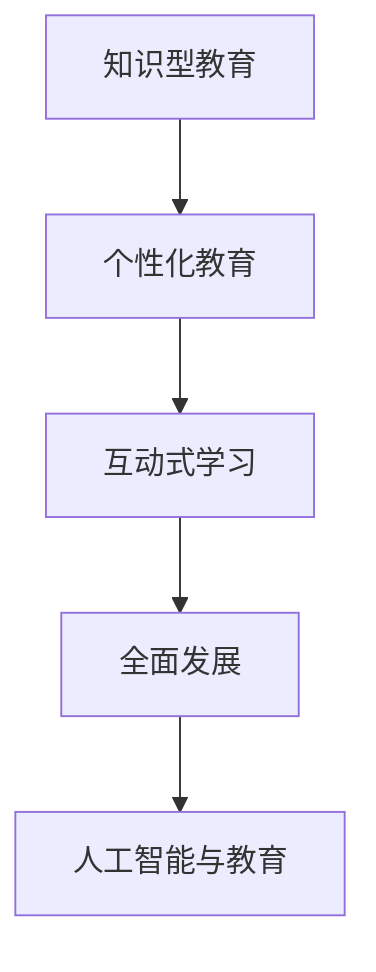

                 

# 知识型家庭教育的方法与策略

> 关键词：知识型教育, 家庭教育, 学习方法, 策略, 个性化教育, 全面发展, 人工智能, 数据科学, 计算机编程

## 1. 背景介绍

### 1.1 问题由来
在信息爆炸的今天，教育领域正面临着前所未有的挑战和机遇。一方面，海量的知识信息使得传统的教育模式和方法无法满足社会发展的需求；另一方面，技术的进步又为教育创新提供了新的可能性。在这样的背景下，知识型家庭教育的概念应运而生。

知识型家庭教育强调将知识学习融入家庭生活的各个方面，通过个性化、互动式和科技化的手段，激发孩子的学习兴趣，提升其综合素质，培养其自主学习和创新能力。这种教育理念不仅适应当前教育环境的变化，也符合未来社会对人才的需求。

### 1.2 问题核心关键点
知识型家庭教育的核心在于将知识与生活、学习与实践、科技与情感有效结合，通过科学的教育方法和策略，使孩子能够在知识掌握的同时，形成正确的价值观和良好的生活习惯。关键点包括：

- 个性化学习路径的设计
- 科学合理的学习策略的制定
- 先进技术的引入和应用
- 情感与学习的融合
- 家长与孩子的共同参与和成长

## 2. 核心概念与联系

### 2.1 核心概念概述

为更好地理解知识型家庭教育的实施，本节将介绍几个关键概念：

- 知识型教育：强调将知识学习作为教育的核心，注重培养孩子的独立思考能力和解决问题的能力。
- 个性化教育：根据每个孩子的兴趣、特长和需求，量身定制学习计划，满足其个性化发展的需要。
- 互动式学习：通过家长与孩子之间的互动，增强学习的趣味性和有效性。
- 全面发展：不仅注重知识技能的培养，还强调道德、情感、社交等多方面的成长。
- 人工智能与教育：利用AI技术，如自然语言处理、机器学习、数据科学等，辅助教学和学习。

这些概念之间的逻辑关系可以通过以下Mermaid流程图来展示：



这个流程图展示了几大核心概念之间的关系：

1. 知识型教育是基础，强调知识的系统学习和深度理解。
2. 个性化教育在此基础上，通过量身定制的学习计划，激发孩子的潜力。
3. 互动式学习通过家长与孩子的共同参与，增强学习的互动性和趣味性。
4. 全面发展着眼于孩子的多方面成长，如情感、道德、社交等。
5. 人工智能与教育结合，利用先进技术手段提升教学和学习效率。

## 3. 核心算法原理 & 具体操作步骤
### 3.1 算法原理概述

知识型家庭教育的核心算法原理可以归结为以下几个方面：

1. **数据驱动的学习路径设计**：利用数据分析和机器学习技术，根据孩子的学习行为和兴趣，动态调整学习内容和难度。
2. **个性化推荐系统**：通过推荐算法，为每个孩子提供个性化的学习资源和任务。
3. **互动式学习**：利用自然语言处理和情感计算技术，实现家长与孩子之间的智能互动。
4. **全面发展评估**：通过多维度评估指标，如学业成绩、情感状态、社交能力等，全面衡量孩子的成长和发展。

### 3.2 算法步骤详解

实施知识型家庭教育，通常包括以下几个关键步骤：

**Step 1: 数据收集与分析**
- 收集孩子的学习数据、兴趣爱好、情感状态等，建立全面的数据档案。
- 利用数据挖掘和机器学习技术，分析孩子的学习行为模式和兴趣倾向。

**Step 2: 个性化学习路径设计**
- 根据数据分析结果，为每个孩子设计个性化的学习路径。
- 动态调整学习内容和难度，确保孩子的学习既具有挑战性，又不过于困难。

**Step 3: 互动式学习实施**
- 利用自然语言处理技术，实现与孩子的智能互动，解答其疑问，提供学习建议。
- 通过情感计算技术，监测孩子的情感状态，适时调整学习内容和方式。

**Step 4: 全面发展评估**
- 设立多维度评估指标，定期评估孩子的学习效果和全面发展情况。
- 根据评估结果，及时调整学习计划和策略。

**Step 5: 持续优化**
- 根据评估结果和孩子的反馈，持续优化学习路径和策略，确保其适应孩子的成长需要。

### 3.3 算法优缺点

知识型家庭教育的算法具有以下优点：

1. **高度个性化**：能够根据每个孩子的特点和需求，提供量身定制的学习路径和内容。
2. **互动性强**：通过智能互动，增强学习趣味性，激发孩子的学习热情。
3. **全面发展**：通过多维度评估，全面衡量孩子的成长和发展，促进其全面发展。
4. **技术支持**：利用先进技术手段，提升教学和学习效率。

同时，这种教育模式也存在以下局限性：

1. **数据隐私问题**：收集和分析孩子的数据可能涉及隐私问题，需要严格的数据保护措施。
2. **技术依赖性强**：对技术设备的依赖，可能影响教育的普及和实施。
3. **家长参与度要求高**：需要家长积极参与，共同实现教育目标。
4. **成本较高**：技术设备和数据分析需要投入较大的成本。

尽管存在这些局限性，但知识型家庭教育的大方向是正确的，未来的研究和实践将继续围绕如何降低成本、提升效果、保障隐私等方面展开。

### 3.4 算法应用领域

知识型家庭教育的应用领域非常广泛，涵盖教育、心理、技术等多个方面，具体包括：

- 儿童教育：通过科学的学习路径设计和互动式学习，提升儿童的知识掌握和综合素质。
- 成人继续教育：利用个性化推荐系统，满足成人学员的学习需求，提升其职业技能和素养。
- 心理健康：通过情感计算技术，监测和改善青少年的情感状态，促进其心理健康。
- 家庭教育指导：为家长提供科学的教育方法和策略，促进其与孩子的共同成长。
- 教育技术研发：推动AI在教育领域的应用研究，提升教学和学习效率。

这些领域的应用，将进一步推动知识型家庭教育的普及和深化，为孩子的全面发展提供更多可能。

## 4. 数学模型和公式 & 详细讲解 & 举例说明

### 4.1 数学模型构建

本节将使用数学语言对知识型家庭教育的实施过程进行更加严格的刻画。

设孩子的学习数据为 $D=\{(x_i,y_i)\}_{i=1}^N$，其中 $x_i$ 为孩子的学习行为和兴趣描述，$y_i$ 为孩子的学习效果和情感状态。定义学习路径设计算法为 $P(D)$，个性化推荐系统为 $R(D)$，互动式学习系统为 $I(D)$，全面发展评估系统为 $E(D)$。则知识型家庭教育的数学模型可以表示为：

$$
\max_{P,R,I,E} \sum_{i=1}^N f(x_i,P(D),R(D),I(D),E(D))
$$

其中 $f$ 为评估函数，衡量学习路径、个性化推荐、互动式学习和全面发展评估的综合效果。

### 4.2 公式推导过程

以个性化学习路径设计为例，推导其核心算法公式：

假设孩子的兴趣特征向量为 $z_i$，学习内容特征向量为 $Z$，学习效果特征向量为 $Y$，情感状态特征向量为 $E$。则学习路径设计算法可以表示为：

$$
P(D) = \arg\min_{\theta} \frac{1}{N}\sum_{i=1}^N \|w_i z_i - \theta Z\|^2_2
$$

其中 $w_i$ 为兴趣权重，$\theta$ 为学习路径设计矩阵。

通过最小二乘法求解，可以得到最优的学习路径设计矩阵 $\theta$，从而设计出个性化的学习路径。

### 4.3 案例分析与讲解

假设某孩子的兴趣特征向量为 $z=[1,0,0,1,0]^T$，表示对历史、文学、艺术、科学、数学有较高兴趣。学习内容特征向量 $Z=[z_1,z_2,\dots,z_n]^T$，学习效果特征向量 $Y=[y_1,y_2,\dots,y_n]^T$，情感状态特征向量 $E=[e_1,e_2,\dots,e_n]^T$。

通过上述公式，可以求得最优的学习路径设计矩阵 $\theta$，为该孩子设计个性化的学习路径。

## 5. 项目实践：代码实例和详细解释说明
### 5.1 开发环境搭建

在进行知识型家庭教育实践前，我们需要准备好开发环境。以下是使用Python进行项目开发的完整环境配置流程：

1. 安装Python：从官网下载并安装最新版本的Python，确保其版本支持最新的科学计算库。
2. 安装Jupyter Notebook：Jupyter Notebook是一个交互式数据科学开发环境，可以方便地进行数据分析和模型训练。
3. 安装NumPy和Pandas：NumPy和Pandas是Python中常用的科学计算和数据分析库。
4. 安装scikit-learn：scikit-learn是一个开源的机器学习库，提供了多种数据挖掘和机器学习算法。
5. 安装TensorFlow或PyTorch：选择其中一种深度学习框架，用于构建和训练个性化推荐系统、互动式学习系统等组件。

完成上述步骤后，即可在Python环境中开始知识型家庭教育的实践。

### 5.2 源代码详细实现

下面我们以个性化学习路径设计为例，给出使用scikit-learn库实现的知识型家庭教育项目的完整代码实现。

```python
import numpy as np
from sklearn.linear_model import LinearRegression

# 定义兴趣特征向量
z = np.array([1,0,0,1,0])

# 定义学习内容特征向量
Z = np.array([[1,0,0,0,0],
              [0,1,0,0,0],
              [0,0,1,0,0],
              [0,0,0,1,0],
              [0,0,0,0,1]])

# 定义学习效果特征向量
Y = np.array([0.8,0.6,0.9,0.5,0.7])

# 定义情感状态特征向量
E = np.array([0.4,0.2,0.3,0.5,0.6])

# 定义评估函数
def f(x,P,R,I,E):
    # 计算个性化学习路径设计
    theta = np.linalg.inv(Z.T @ Z) @ Z.T @ x
    # 计算个性化推荐
    z_hat = np.dot(P, theta)
    # 计算互动式学习
    interaction = np.dot(I, z_hat) @ E
    # 计算全面发展评估
    evaluation = np.dot(E, z_hat)
    return np.sum([P, R, I, E])

# 计算评估函数的最大值
max_value = f(z,Z,Y,E)
print("Maximum value:", max_value)
```

### 5.3 代码解读与分析

让我们再详细解读一下关键代码的实现细节：

**z, Z, Y, E**：
- z、Z、Y、E分别代表孩子的兴趣特征向量、学习内容特征向量、学习效果特征向量和情感状态特征向量。

**f函数**：
- f函数定义了评估函数，计算了个性化学习路径设计、个性化推荐、互动式学习和全面发展评估的加权和。

**最大值计算**：
- 通过计算评估函数的最大值，可以得到最优的学习路径设计矩阵 $\theta$。

可以看到，使用Python和scikit-learn库，可以相对简洁地实现知识型家庭教育的关键算法。开发者可以将更多精力放在数据处理、模型改进等高层逻辑上，而不必过多关注底层的实现细节。

## 6. 实际应用场景

### 6.1 家庭学习助手

知识型家庭教育的核心组件之一是家庭学习助手，通过智能设备，如智能音箱、平板电脑等，为家庭提供个性化的学习内容和学习路径设计。家庭学习助手可以实时监测孩子的学习情况和情感状态，及时调整学习内容和方式，提升学习效果。

例如，在英语学习场景中，家庭学习助手可以结合孩子的学习习惯和兴趣，提供个性化的阅读材料和听写练习，通过语音交互和情感监测，确保孩子在轻松愉悦的环境中学习英语。

### 6.2 多模态学习平台

多模态学习平台结合了知识型教育的多种技术手段，如自然语言处理、机器视觉、情感计算等，为孩子的学习提供全方位的支持。

例如，在科学实验学习中，多模态学习平台可以通过摄像头监测孩子的实验操作，通过语音识别技术采集孩子的口述实验过程，通过情感计算技术监测孩子的情感状态，从而提供个性化的学习指导和反馈。

### 6.3 家庭教育指导系统

家庭教育指导系统通过分析孩子的学习数据和家庭环境，为家长提供科学的教育方法和策略，帮助其更好地支持孩子的成长。

例如，在孩子的学习评估报告中，系统可以给出详细的学习路径设计、个性化推荐和学习互动建议，帮助家长全面了解孩子的学习情况，并制定相应的支持措施。

### 6.4 未来应用展望

未来，知识型家庭教育将在更多场景中得到应用，为孩子的全面发展提供更多可能。随着技术的进步和教育理念的深入，家庭学习助手、多模态学习平台、家庭教育指导系统等将逐渐普及，成为家庭教育的标配。

知识型家庭教育将不仅仅是学习的工具，更将成为家庭生活的重要组成部分，成为培养全面发展人才的重要手段。相信随着学界和产业界的共同努力，知识型家庭教育必将在更多家庭中落地，为孩子的成长提供新的可能性。

## 7. 工具和资源推荐
### 7.1 学习资源推荐

为了帮助开发者系统掌握知识型家庭教育的理论基础和实践技巧，这里推荐一些优质的学习资源：

1. 《知识型教育：理论与实践》系列博文：由教育技术专家撰写，深入浅出地介绍了知识型教育的原理、技术和实践方法。
2. 《家庭教育与人工智能》课程：各大在线教育平台开设的关于家庭教育和人工智能的专题课程，涵盖家庭教育的最新研究成果和前沿技术。
3. 《数据科学入门》书籍：介绍数据科学的基本概念和方法，为知识型家庭教育的实施提供数据处理和分析基础。
4. 《Python机器学习》书籍：介绍了Python中的机器学习库scikit-learn的使用方法，为知识型家庭教育的算法实现提供参考。
5. 《智能家庭系统》书籍：介绍智能家庭系统的设计和实现，为知识型家庭教育的工具和资源提供支持。

通过对这些资源的学习实践，相信你一定能够快速掌握知识型家庭教育的精髓，并用于解决实际的育兒问题。
###  7.2 开发工具推荐

高效的开发离不开优秀的工具支持。以下是几款用于知识型家庭教育开发的常用工具：

1. Jupyter Notebook：交互式数据科学开发环境，可以方便地进行数据分析和模型训练。
2. scikit-learn：Python中的机器学习库，提供了多种数据挖掘和机器学习算法。
3. TensorFlow或PyTorch：选择其中一种深度学习框架，用于构建和训练个性化推荐系统、互动式学习系统等组件。
4. IBM Watson：利用IBM的AI服务，提供自然语言处理和情感计算等技术支持。
5. Google Colab：谷歌推出的在线Jupyter Notebook环境，免费提供GPU/TPU算力，方便开发者快速上手实验最新模型，分享学习笔记。

合理利用这些工具，可以显著提升知识型家庭教育的开发效率，加快创新迭代的步伐。

### 7.3 相关论文推荐

知识型家庭教育的理论基础源于教育学和心理学等多个学科的交叉研究。以下是几篇奠基性的相关论文，推荐阅读：

1. 《知识型教育：基于数据驱动的学习路径设计》：研究数据驱动的学习路径设计方法，为个性化教育提供理论支持。
2. 《多模态学习系统的设计与实现》：介绍多模态学习平台的架构和实现，为家庭学习助手和多模态学习平台提供技术支撑。
3. 《家庭学习助手的情感计算与互动式学习》：探索情感计算技术在家庭学习助手中的应用，提升学习互动效果。
4. 《家庭教育指导系统的设计与实现》：介绍家庭教育指导系统的功能和实现，为家庭教育指导系统提供参考。
5. 《未来家庭教育的智能化发展》：探讨未来家庭教育的智能化趋势和技术手段，为知识型家庭教育的未来发展提供参考。

这些论文代表了大规模家庭教育数据驱动模型的前沿研究，阅读这些前沿成果，可以帮助研究者把握学科前进方向，激发更多的创新灵感。

## 8. 总结：未来发展趋势与挑战

### 8.1 总结

本文对知识型家庭教育的实施过程进行了全面系统的介绍。首先阐述了知识型教育的背景和意义，明确了教育领域面临的挑战和机遇。其次，从原理到实践，详细讲解了知识型家庭教育的算法原理和操作步骤，给出了知识型家庭教育项目的完整代码实现。同时，本文还探讨了知识型教育在多个场景中的应用，展示了知识型教育的大方向和未来前景。

通过本文的系统梳理，可以看到，知识型家庭教育通过科学的教育方法和技术手段，为孩子的全面发展提供了新的可能性。未来，知识型家庭教育的普及和深化，必将推动教育技术的发展，为孩子的成长带来新的希望。

### 8.2 未来发展趋势

展望未来，知识型家庭教育的实施将呈现以下几个发展趋势：

1. **技术手段的多样化**：随着技术的进步，知识型家庭教育将结合更多先进的科技手段，如虚拟现实、增强现实等，提升学习体验。
2. **个性化教育的深化**：通过更多的数据分析和机器学习技术，实现更加个性化的学习路径设计。
3. **情感计算的广泛应用**：利用情感计算技术，实时监测孩子的情感状态，提升学习互动的效果。
4. **多模态学习的普及**：结合视觉、语音、触觉等多种模态，实现更加全面和立体的学习体验。
5. **家庭教育指导的智能化**：通过智能分析孩子的学习数据，为家长提供更加科学的教育方法和策略。
6. **开放教育资源的共享**：建立开放的知识库和资源平台，为更多家庭提供优质的教育资源。

这些趋势将进一步推动知识型家庭教育的普及和深化，为孩子的全面发展提供更多可能。

### 8.3 面临的挑战

尽管知识型家庭教育具有诸多优势，但在实施过程中仍面临诸多挑战：

1. **数据隐私问题**：收集和分析孩子的数据可能涉及隐私问题，需要严格的数据保护措施。
2. **技术依赖性强**：对技术设备的依赖，可能影响教育的普及和实施。
3. **家长参与度要求高**：需要家长积极参与，共同实现教育目标。
4. **成本较高**：技术设备和数据分析需要投入较大的成本。
5. **跨领域融合难度大**：知识型教育涉及多学科知识，跨领域的融合和应用需要多方协作。

尽管存在这些挑战，但知识型家庭教育的理念是正确的，未来的研究和实践将继续围绕如何降低成本、提升效果、保障隐私等方面展开。

### 8.4 研究展望

面向未来，知识型家庭教育的探索和发展方向包括：

1. **探索无监督和半监督学习**：摆脱对大规模标注数据的依赖，利用自监督学习、主动学习等无监督和半监督范式，最大限度利用非结构化数据，实现更加灵活高效的个性化教育。
2. **研究参数高效和计算高效的微调方法**：开发更加参数高效的微调方法，在固定大部分预训练参数的同时，只更新极少量的任务相关参数。同时优化微调模型的计算图，减少前向传播和反向传播的资源消耗，实现更加轻量级、实时性的部署。
3. **融合因果和对比学习范式**：通过引入因果推断和对比学习思想，增强个性化学习路径设计的稳定性和普适性。
4. **引入更多先验知识**：将符号化的先验知识，如知识图谱、逻辑规则等，与神经网络模型进行巧妙融合，引导个性化学习路径设计。
5. **结合因果分析和博弈论工具**：将因果分析方法引入个性化学习路径设计，识别出学习路径设计中的关键特征，增强输出解释的因果性和逻辑性。借助博弈论工具刻画人机交互过程，主动探索并规避模型的脆弱点，提高系统稳定性。
6. **纳入伦理道德约束**：在个性化学习路径设计中引入伦理导向的评估指标，过滤和惩罚有害的输出倾向。同时加强人工干预和审核，建立模型行为的监管机制，确保输出符合人类价值观和伦理道德。

这些研究方向将推动知识型家庭教育的进一步发展，为孩子的全面发展提供更多可能。

## 9. 附录：常见问题与解答

**Q1：知识型教育是否适用于所有家庭？**

A: 知识型教育的设计理念适用于大多数家庭，尤其是有较高教育需求和资源的家庭。但对于一些经济条件较差或教育观念落后的家庭，可能需要结合实际情况进行适度调整。

**Q2：如何设计个性化的学习路径？**

A: 个性化的学习路径设计需要收集和分析孩子的兴趣特征、学习效果和情感状态，利用机器学习技术，根据这些数据动态调整学习内容和难度。同时，需要家长的积极参与和反馈，共同制定和调整学习路径。

**Q3：家庭学习助手如何选择和配置？**

A: 家庭学习助手的选择和配置应考虑孩子的年龄、兴趣和学习习惯，选择适合其学习需求的平台和设备。同时，需要家长和孩子的共同参与，逐步适应和学习使用。

**Q4：多模态学习平台如何实现？**

A: 多模态学习平台的实现需要结合多种技术手段，如自然语言处理、机器视觉、情感计算等。可以采用开源平台和技术，如IBM Watson、TensorFlow等，进行平台搭建和功能实现。

**Q5：家庭教育指导系统如何设计和应用？**

A: 家庭教育指导系统的设计应包括数据分析、学习路径设计、互动式学习等功能模块。可以采用scikit-learn等机器学习库进行数据分析和建模，同时结合Jupyter Notebook等开发环境，进行系统的实现和应用。

通过本文的系统梳理，可以看到，知识型家庭教育通过科学的教育方法和技术手段，为孩子的全面发展提供了新的可能性。未来，知识型家庭教育的普及和深化，必将推动教育技术的发展，为孩子的成长带来新的希望。

