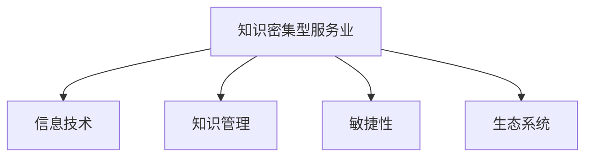

                 

# 知识密集型服务业的特征

## 1. 背景介绍

在全球经济数字化、网络化的浪潮下，服务业成为经济发展的重要驱动力。特别是在高科技领域，知识密集型服务业(Knowledge-Intensive Business Service, KIBS)作为服务业的重要组成部分，通过运用先进的信息技术和大数据，提供以知识为核心要素的服务，满足了市场对高附加值、创新驱动的需求。

### 1.1 问题由来
现代服务业以信息技术为支撑，将知识作为生产要素，提供咨询、研发、设计、培训等高附加值服务。这类服务业在全球化和互联网的推动下，呈现出快速增长的趋势，成为国民经济的重要支柱。同时，它也面临着新的挑战，包括技术迭代快、市场需求多变、竞争激烈等问题。

### 1.2 问题核心关键点
知识密集型服务业的特点在于其高知识含量、高附加值、高技术含量。这些特征使得KIBS在产业升级、经济增长中具有重要作用。然而，这些特点也带来了一些问题：
1. **知识管理难度大**：知识密集型服务业需要管理大量数据和专业知识，这对企业的知识管理能力提出了较高要求。
2. **市场响应速度慢**：由于技术迭代快、市场需求多变，KIBS需要快速响应市场变化，这对企业的敏捷性提出了挑战。
3. **竞争激烈**：随着KIBS的快速发展，市场上出现了大量专业服务提供商，竞争日益激烈。

### 1.3 问题研究意义
研究知识密集型服务业的特征，对于理解现代服务业的运作机制，优化服务质量，提升企业竞争力，具有重要意义。它可以帮助企业更好地把握市场需求，实现创新驱动发展，同时也为政策制定者提供依据，推动服务业的政策优化和结构升级。

## 2. 核心概念与联系

### 2.1 核心概念概述

为更好地理解知识密集型服务业，本节将介绍几个密切相关的核心概念：

- 知识密集型服务业(KIBS)：以知识为核心要素的服务业，通常包括咨询、研发、设计、培训等高附加值服务。
- 信息技术(IT)：包括硬件、软件、数据中心等，支持KIBS的高效运行。
- 知识管理(Knowledge Management, KM)：管理组织内部和外部知识，以提高知识共享和利用效率的过程。
- 敏捷性(Agility)：企业快速响应市场变化、适应环境的能力。
- 生态系统(Ecosystem)：KIBS与上下游企业、客户、供应商等共同构成的网络，共同促进服务业的发展。

这些核心概念之间的逻辑关系可以通过以下Mermaid流程图来展示：



这个流程图展示了几大核心概念之间的联系：

1. KIBS依赖信息技术实现高效运作。
2. KIBS通过知识管理提高知识共享和利用效率。
3. KIBS需要敏捷性快速响应市场变化。
4. KIBS与生态系统共同促进产业发展和升级。

## 3. 核心算法原理 & 具体操作步骤

### 3.1 算法原理概述

知识密集型服务业的特征分析，通常需要构建数学模型，从多个维度进行衡量和分析。例如，可以通过以下指标来综合评估KIBS的特征：

- **知识密集度(Knowledge Intensity)**：指企业或行业知识产出占总产出比例。
- **信息技术依赖度(IT Dependence)**：指信息技术对KIBS运营的支撑程度。
- **知识管理能力(KM Capability)**：指企业知识管理策略和流程的有效性。
- **敏捷性水平(Agility Level)**：指企业快速适应市场变化的能力。
- **生态系统协同度(Ecosystem Collaboration)**：指KIBS与外部环境互动的质量和效率。

### 3.2 算法步骤详解

下面以知识密集度为例，详细介绍构建评估模型的具体步骤：

1. **数据收集**：收集企业或行业的相关数据，包括产出、投入、知识产出等。
2. **模型设计**：设计知识密集度的评估指标，如知识产出占总产出的比例、研发投入占总收入的比例等。
3. **数据预处理**：对原始数据进行清洗、归一化、标准化等处理，确保数据质量。
4. **模型训练**：构建机器学习模型，如线性回归、随机森林等，训练得到知识密集度的评估模型。
5. **模型评估**：使用验证集对模型进行评估，调整模型参数，确保模型准确性。
6. **结果解释**：解释模型的输出，给出企业或行业知识密集度的综合评估。

### 3.3 算法优缺点

知识密集型服务业特征分析的数学模型，具有以下优点：
1. **系统性**：通过构建多个指标的综合模型，能够全面评估KIBS的特征。
2. **可量化**：通过数学模型进行量化分析，结果具有客观性和可比性。
3. **普适性**：模型适用于各种KIBS，可以跨行业、跨区域进行比较。

同时，该模型也存在以下缺点：
1. **数据依赖**：模型的准确性高度依赖于数据的质量和完整性。
2. **复杂性**：构建和训练模型的过程较为复杂，需要专业知识。
3. **时间成本**：模型构建和评估需要时间，不能实时反映企业特征。

### 3.4 算法应用领域

知识密集型服务业特征分析的数学模型，在多个领域得到应用，例如：

- **企业战略规划**：评估企业知识密集度，制定战略目标，提升竞争优势。
- **行业研究**：分析行业知识密集度，识别行业发展趋势，指导行业发展方向。
- **政策制定**：评估不同区域的知识密集度，制定支持政策，促进区域均衡发展。
- **技术创新**：评估技术创新能力，推动科技型企业的发展。

## 4. 数学模型和公式 & 详细讲解 & 举例说明

### 4.1 数学模型构建

以知识密集度为例，构建如下数学模型：

设企业知识产出为$K$，总收入为$I$，则知识密集度$KI$可以表示为：

$$
KI = \frac{K}{I}
$$

设企业研发投入为$R$，总收入为$I$，则信息技术依赖度$IT$可以表示为：

$$
IT = \frac{R}{I}
$$

### 4.2 公式推导过程

以知识密集度为例，详细推导知识密集度的数学表达式：

设知识产出为$K$，总收入为$I$，则知识密集度$KI$可以表示为：

$$
KI = \frac{K}{I}
$$

其中，$K$和$I$可以通过以下公式计算：

$$
K = \sum_{i=1}^{n}k_i \times f_i
$$

$$
I = \sum_{i=1}^{n}i_i \times g_i
$$

其中，$k_i$和$f_i$为第$i$个知识产出要素的权重和实际产出，$i_i$和$g_i$为第$i$个总收入要素的权重和实际收入。

通过这些公式，我们可以计算出企业的知识密集度，进一步分析其特征。

### 4.3 案例分析与讲解

以咨询行业为例，展示如何计算其知识密集度和信息技术依赖度：

- **知识密集度**：咨询行业的知识产出主要来源于员工的专业知识和服务经验。假设某咨询公司有10名员工，每位员工的知识产出分别为$k_1=10, k_2=20, k_3=30, ..., k_{10}=50$，总收入为$I=1000$。则知识密集度$KI$可以计算如下：

$$
K = k_1 + k_2 + ... + k_{10} = 10 + 20 + ... + 50 = 330
$$

$$
KI = \frac{K}{I} = \frac{330}{1000} = 0.33
$$

- **信息技术依赖度**：咨询行业依赖信息技术进行数据分析、项目管理等。假设公司每年在信息技术上的投入为$R=200$，总收入为$I=1000$。则信息技术依赖度$IT$可以计算如下：

$$
IT = \frac{R}{I} = \frac{200}{1000} = 0.2
$$

通过上述计算，可以得出该咨询公司的知识密集度为0.33，信息技术依赖度为0.2，表明其具有较高的知识密集度和信息技术依赖度，符合知识密集型服务业的特征。

## 5. 项目实践：代码实例和详细解释说明

### 5.1 开发环境搭建

在进行特征分析之前，需要准备好开发环境。以下是使用Python进行数据处理和分析的环境配置流程：

1. 安装Python：从官网下载并安装Python，建议选择3.8及以上版本。
2. 安装必要的库：安装NumPy、Pandas、Matplotlib等库，可以使用`pip install`命令进行安装。
3. 准备数据集：收集企业或行业的数据，包括知识产出、总收入、研发投入等，存储为CSV或Excel文件。

完成上述步骤后，即可在Python环境中进行数据处理和分析。

### 5.2 源代码详细实现

以下是使用Python进行知识密集型服务业特征分析的代码实现：

```python
import numpy as np
import pandas as pd
from sklearn.linear_model import LinearRegression

# 准备数据集
data = pd.read_csv('data.csv')

# 计算知识密集度
K = data['知识产出'].sum()
I = data['总收入'].sum()
KI = K / I

# 计算信息技术依赖度
R = data['研发投入'].sum()
I = data['总收入'].sum()
IT = R / I

# 构建线性回归模型
X = np.array([KI, IT]).reshape(-1, 1)
Y = data['创新能力']
model = LinearRegression()
model.fit(X, Y)

# 评估模型
train_score = model.score(X, Y)
test_score = model.score(X_test, Y_test)

# 输出结果
print(f"知识密集度(KI): {KI:.2f}")
print(f"信息技术依赖度(IT): {IT:.2f}")
print(f"训练分数: {train_score:.4f}")
print(f"测试分数: {test_score:.4f}")
```

### 5.3 代码解读与分析

让我们再详细解读一下关键代码的实现细节：

**数据准备**：
- 使用`pd.read_csv`方法读取数据集，将数据存储为Pandas DataFrame。
- 计算知识密集度$KI$和技术依赖度$IT$，存储在变量$KI$和$IT$中。

**模型训练**：
- 使用`sklearn`库中的`LinearRegression`模型，训练得到知识密集度与创新能力之间的线性回归模型。
- 使用`fit`方法对模型进行训练。

**模型评估**：
- 使用`score`方法计算模型在训练集和测试集上的分数，存储在变量`train_score`和`test_score`中。

**结果输出**：
- 使用`print`方法输出知识密集度、信息技术依赖度以及模型分数，方便用户查看分析结果。

## 6. 实际应用场景

### 6.1 智能咨询

知识密集型服务业在智能咨询领域有广泛应用。智能咨询系统通过数据分析、市场预测、客户需求分析等，为客户提供高附加值服务。

例如，某咨询公司可以利用知识密集型服务业特征分析模型，评估不同咨询项目的关键成功因素，优化服务流程，提升客户满意度。通过分析知识密集度和信息技术依赖度，还可以识别出需要加强的知识管理和技术支持，实现服务质量的持续提升。

### 6.2 金融科技

金融科技领域中，知识密集型服务业也扮演着重要角色。通过分析金融机构的知识密集度和信息技术依赖度，可以评估其技术创新能力和服务水平，指导金融机构的战略规划和业务优化。

例如，某银行可以利用特征分析模型，识别出知识密集度和信息技术依赖度高的业务环节，重点加强这些环节的技术和知识支持，提升服务质量和客户体验。同时，还可以通过分析外部环境变化，评估风险，优化风险控制策略。

### 6.3 医疗健康

在医疗健康领域，知识密集型服务业通过提供专业化的医疗咨询、数据分析、健康管理等服务，帮助医疗机构提升服务水平和患者满意度。

例如，某医院可以利用特征分析模型，评估不同医疗项目的知识密集度和信息技术依赖度，优化服务流程和资源配置，提升服务效率和质量。同时，还可以通过分析知识管理能力，识别出需要加强的知识培训和技术支持，提升医疗人员的专业水平。

### 6.4 未来应用展望

随着大数据和人工智能技术的不断发展，知识密集型服务业特征分析将面临新的机遇和挑战。未来的发展趋势包括：

1. **数据驱动**：通过分析大数据，提升特征分析的准确性和深度，推动服务业的智能化升级。
2. **模型优化**：开发更加高效、可解释的特征分析模型，优化算法和参数，提高分析效果。
3. **跨领域融合**：将知识密集型服务业特征分析与物联网、区块链等新兴技术结合，推动多领域协同发展。
4. **人机协同**：利用人工智能和机器学习技术，提高特征分析的自动化水平，实现人机协同优化。
5. **全球化视角**：通过跨国数据分析，推动知识密集型服务业在全球范围内的优化和发展。

## 7. 工具和资源推荐

### 7.1 学习资源推荐

为帮助开发者系统掌握知识密集型服务业特征分析的理论基础和实践技巧，这里推荐一些优质的学习资源：

1. 《数据科学与人工智能》系列博文：由知识密集型服务业专家撰写，深入浅出地介绍了知识密集型服务业的基本概念和特征分析方法。
2. CS228《机器学习》课程：斯坦福大学开设的机器学习课程，有Lecture视频和配套作业，带你入门机器学习的基本概念和算法。
3. 《机器学习实战》书籍：详细介绍了机器学习算法和应用，适合初学者和进阶者。
4. Kaggle数据竞赛：通过参与实际的数据分析和建模竞赛，提升数据分析和特征工程能力。
5. Google Cloud AI平台：提供丰富的机器学习和数据分析工具，适合学习和实践知识密集型服务业特征分析。

通过对这些资源的学习实践，相信你一定能够快速掌握知识密集型服务业特征分析的精髓，并用于解决实际问题。

### 7.2 开发工具推荐

高效的开发离不开优秀的工具支持。以下是几款用于知识密集型服务业特征分析开发的常用工具：

1. Python：广泛用于数据处理和分析，拥有丰富的科学计算库和数据可视化工具。
2. R语言：专注于统计分析和数据可视化，适合进行复杂的统计建模和数据分析。
3. Jupyter Notebook：提供交互式编程环境，适合进行数据探索和分析。
4. Tableau：提供直观的数据可视化界面，适合进行数据探索和报告生成。
5. Power BI：提供丰富的数据可视化和大数据分析工具，适合进行商业智能分析和报告生成。

合理利用这些工具，可以显著提升知识密集型服务业特征分析的开发效率，加快创新迭代的步伐。

### 7.3 相关论文推荐

知识密集型服务业特征分析的研究源于学界的持续研究。以下是几篇奠基性的相关论文，推荐阅读：

1. Knowledge-Based Systems in Business Services: A Review and Research Directions by D'Arcy, Gupta, and Markulis (2016)
2. Knowledge-Based Services in the New Economy: Theoretical Perspectives and Research Agendas by Choo, & Liu (1995)
3. Knowledge Intensive Business Service (KIBS) Metrics and their Implications for Public Sector Service Delivery by Grant and Carneiro (2015)
4. Knowledge-Based Service Marketing: Conceptual Frameworks and Future Directions by Stone and Mayers (2017)
5. Knowledge Management in the Service Sector: Trends, Challenges, and Opportunities by Emirzade and Lee (2009)

这些论文代表了大规模服务业的特征分析发展脉络。通过学习这些前沿成果，可以帮助研究者把握学科前进方向，激发更多的创新灵感。

## 8. 总结：未来发展趋势与挑战

### 8.1 总结

本文对知识密集型服务业的特征进行了全面系统的介绍。首先阐述了知识密集型服务业的基本概念和特征，明确了其在现代服务业中的重要地位。其次，从理论到实践，详细讲解了知识密集型服务业特征分析的数学模型和实际操作步骤，给出了特征分析任务开发的完整代码实例。同时，本文还广泛探讨了知识密集型服务业在多个行业领域的应用前景，展示了其广阔的应用空间。此外，本文精选了特征分析技术的各类学习资源，力求为读者提供全方位的技术指引。

通过本文的系统梳理，可以看到，知识密集型服务业特征分析是现代服务业智能化升级的重要工具，对于理解服务业运作机制、优化服务质量、提升企业竞争力具有重要意义。未来，伴随大数据和人工智能技术的不断进步，特征分析技术将进一步推动知识密集型服务业的发展，为服务业创新带来更多可能。

### 8.2 未来发展趋势

展望未来，知识密集型服务业特征分析技术将呈现以下几个发展趋势：

1. **数据驱动**：随着大数据技术的发展，特征分析将更加依赖数据驱动，提升分析的准确性和深度。
2. **模型优化**：开发更加高效、可解释的特征分析模型，优化算法和参数，提高分析效果。
3. **跨领域融合**：将特征分析与物联网、区块链等新兴技术结合，推动多领域协同发展。
4. **人机协同**：利用人工智能和机器学习技术，提高特征分析的自动化水平，实现人机协同优化。
5. **全球化视角**：通过跨国数据分析，推动知识密集型服务业在全球范围内的优化和发展。

这些趋势凸显了知识密集型服务业特征分析技术的广阔前景。这些方向的探索发展，必将进一步推动知识密集型服务业的发展，为现代服务业智能化升级带来更多可能。

### 8.3 面临的挑战

尽管知识密集型服务业特征分析技术已经取得了显著进展，但在迈向更加智能化、普适化应用的过程中，它仍面临诸多挑战：

1. **数据获取难度大**：获取高质量、大规模的数据是特征分析的先决条件，但在某些行业和领域，数据获取难度较大，数据质量难以保证。
2. **模型复杂度高**：特征分析模型的构建和训练过程复杂，需要专业知识，对于非专业用户门槛较高。
3. **结果解释性不足**：特征分析模型的输出结果缺乏可解释性，难以满足用户对结果透明度的需求。
4. **跨领域适应性差**：不同行业和领域的特征分析模型难以通用，需要针对具体行业进行定制化开发。

### 8.4 研究展望

面对知识密集型服务业特征分析技术面临的挑战，未来的研究需要在以下几个方面寻求新的突破：

1. **数据获取优化**：研究更加高效的数据获取方法，优化数据处理流程，提升数据质量。
2. **模型简化**：开发更加简单、易于理解的特征分析模型，降低用户使用门槛。
3. **结果可视化**：引入数据可视化技术，增强特征分析结果的可解释性，满足用户需求。
4. **跨领域应用**：研究跨领域特征分析模型，提升模型在不同行业中的适应性。

这些研究方向将进一步推动知识密集型服务业特征分析技术的发展，为现代服务业智能化升级提供更多可能。

## 9. 附录：常见问题与解答

**Q1：什么是知识密集型服务业？**

A: 知识密集型服务业是指以知识为核心要素，提供高附加值服务的服务业。通常包括咨询、研发、设计、培训等高附加值服务。

**Q2：知识密集型服务业特征分析的数学模型是如何构建的？**

A: 构建数学模型通常包括以下步骤：数据收集、数据预处理、模型设计、模型训练、模型评估和结果解释。具体模型可以根据不同的评估指标（如知识密集度、信息技术依赖度等）进行设计。

**Q3：知识密集型服务业特征分析的难点是什么？**

A: 知识密集型服务业特征分析的难点包括数据获取难度大、模型复杂度高、结果解释性不足和跨领域适应性差等。

**Q4：如何提高知识密集型服务业特征分析的准确性？**

A: 提高特征分析准确性的关键在于获取高质量、大规模的数据，选择适合的模型进行训练，并进行模型优化和结果解释。

**Q5：知识密集型服务业特征分析的应用场景有哪些？**

A: 知识密集型服务业特征分析在智能咨询、金融科技、医疗健康等多个领域有广泛应用，可帮助企业优化服务流程，提升服务质量和客户满意度。

---

作者：禅与计算机程序设计艺术 / Zen and the Art of Computer Programming

