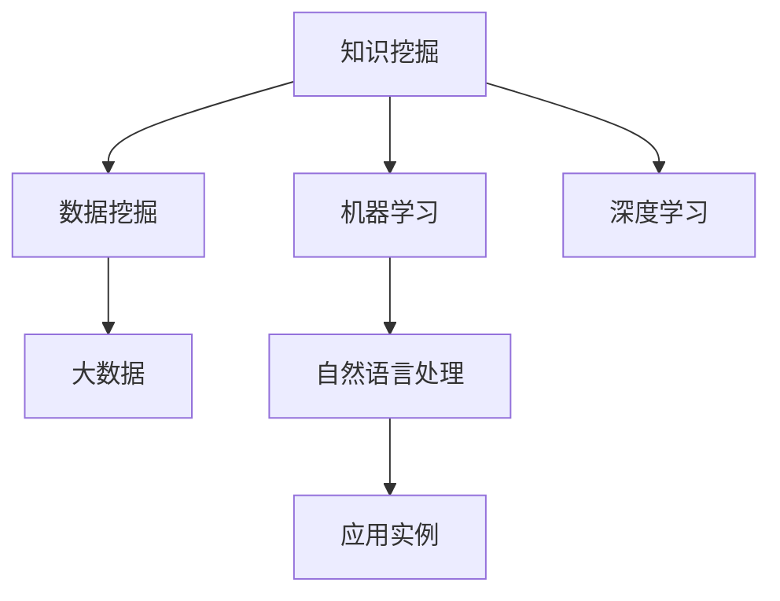

                 

# 知识挖掘技术的发展与未来

> 关键词：知识挖掘,数据挖掘,机器学习,深度学习,大数据,自然语言处理,应用实例

## 1. 背景介绍

### 1.1 问题由来

在信息爆炸的当今社会，数据呈现出爆炸性的增长，而如何从海量数据中挖掘出有价值的知识，是各个领域所面临的共同挑战。知识挖掘作为数据挖掘领域的一个重要分支，通过融合多种技术和方法，从数据中提取和发现知识，实现自动化、智能化的信息处理，从而帮助人类更好地理解和利用信息。

知识挖掘技术已经在诸多行业得到广泛应用，如金融、医疗、零售、电子商务等，对决策制定、产品设计、客户分析等方面产生了深远影响。随着技术的不断演进和数据的日益丰富，知识挖掘技术也在不断进步，从传统的数据统计、规则匹配，逐渐发展到基于机器学习和深度学习的方法，极大地提升了知识挖掘的深度和广度。

### 1.2 问题核心关键点

知识挖掘的核心问题在于如何从大规模数据中高效、准确地提取有用的知识和模式。随着技术的发展，知识挖掘方法也逐渐从简单的数据统计和规则匹配，向基于机器学习和深度学习的方法演进。这些方法通过对数据进行高维特征提取、自动特征学习，实现了更复杂、更高效的知识发现。

关键点包括：

- 数据预处理：对原始数据进行清洗、归一化、降维等处理，以提高后续挖掘算法的效率和效果。
- 特征选择：选择合适的特征，提取特征子集，以提升模型的泛化能力和鲁棒性。
- 模型选择：根据任务类型和数据特点选择合适的挖掘算法，如分类、聚类、关联规则等。
- 参数调优：对模型参数进行优化，以提高挖掘结果的精度和可解释性。
- 结果解释：对挖掘结果进行解释和可视化，帮助用户理解模型的输出。

## 2. 核心概念与联系

### 2.1 核心概念概述

为了更好地理解知识挖掘的核心概念，本节将介绍几个密切相关的核心概念：

- **知识挖掘(Knowledge Mining)**：从大规模数据集中提取、发现和利用有价值的知识和模式的过程。
- **数据挖掘(Data Mining)**：从数据集中发现模式、规则和异常，进行数据探索和知识发现的技术。
- **机器学习(Machine Learning)**：通过数据训练模型，自动进行特征学习，发现数据中的规律和模式。
- **深度学习(Deep Learning)**：通过多层神经网络进行特征提取和学习，实现更高级的知识发现和决策制定。
- **大数据(Big Data)**：超大规模数据集，需要分布式存储和处理。
- **自然语言处理(Natural Language Processing, NLP)**：处理和理解自然语言的技术，包括文本分类、情感分析、信息抽取等。
- **应用实例**：如金融风险评估、客户推荐系统、智能问答系统等。

这些概念之间的逻辑关系可以通过以下Mermaid流程图来展示：



这个流程图展示了一些核心概念之间的关系：

1. 知识挖掘是数据挖掘的一部分，侧重于发现和利用知识。
2. 数据挖掘和机器学习、深度学习都是知识挖掘的重要工具和技术。
3. 大数据是知识挖掘的基础数据环境。
4. 自然语言处理是知识挖掘的重要应用领域。
5. 应用实例则是知识挖掘的具体应用场景。

## 3. 核心算法原理 & 具体操作步骤

### 3.1 算法原理概述

知识挖掘的核心算法包括基于统计的方法、基于规则的方法、基于机器学习的方法和基于深度学习的方法。这里重点介绍基于机器学习和深度学习的知识挖掘算法。

基于机器学习的知识挖掘方法，通过构建分类、聚类、关联规则等模型，自动从数据中发现规律和模式。常见的算法包括决策树、随机森林、支持向量机(SVM)、K均值聚类等。

基于深度学习的知识挖掘方法，通过多层神经网络进行特征提取和模式学习，实现更高级的知识发现。常见的算法包括卷积神经网络(CNN)、循环神经网络(RNN)、长短期记忆网络(LSTM)、生成对抗网络(GAN)等。

### 3.2 算法步骤详解

以下以基于深度学习的情感分析为例，介绍知识挖掘的具体操作步骤：

**Step 1: 数据准备**

1. 收集数据集，包括原始文本和相应的情感标签。
2. 对文本进行预处理，包括分词、去除停用词、词形还原等。
3. 将文本转换为向量形式，常见的有词袋模型、TF-IDF模型、Word2Vec模型等。

**Step 2: 模型选择**

1. 选择合适的深度学习模型，如卷积神经网络、循环神经网络等。
2. 设置模型的超参数，如网络层数、神经元个数、学习率等。

**Step 3: 模型训练**

1. 将处理后的文本数据分为训练集和测试集。
2. 使用训练集数据对模型进行训练，通过反向传播算法更新模型参数。
3. 在测试集上评估模型性能，调整超参数，优化模型。

**Step 4: 结果解释**

1. 对模型输出的情感标签进行解释，如情感得分、情感类别等。
2. 使用可视化工具展示挖掘结果，如情感分布图、情感趋势图等。

**Step 5: 应用部署**

1. 将训练好的模型部署到实际应用场景中，进行情感分析。
2. 实时采集文本数据，输入模型进行推理预测。
3. 根据预测结果，进行相应的业务决策。

### 3.3 算法优缺点

基于深度学习的知识挖掘方法具有以下优点：

1. 强大的特征学习能力：通过多层神经网络自动提取特征，能够发现更加复杂的模式和规律。
2. 高泛化能力：能够处理大规模数据，适应多种数据类型。
3. 灵活的模型结构：网络结构可调，适合不同的任务和数据。

但同时也存在一些缺点：

1. 模型复杂度高：需要大量的计算资源和时间，训练和推理速度较慢。
2. 数据需求量大：需要大量的标注数据进行训练，标注成本较高。
3. 模型可解释性差：深度学习模型通常被视为"黑盒"系统，难以解释其内部工作机制。

## 4. 数学模型和公式 & 详细讲解

### 4.1 数学模型构建

知识挖掘的数学模型通常包括数据预处理模型、特征选择模型、模型训练模型和结果解释模型。

以基于卷积神经网络的情感分析为例，其数学模型可以表示为：

$$
\text{output} = \text{CNN}(\text{input}, \theta)
$$

其中，$\text{input}$为输入文本的向量表示，$\text{output}$为模型输出的情感得分，$\theta$为模型参数。

### 4.2 公式推导过程

以CNN模型为例，其核心思想是通过卷积和池化操作提取局部特征，通过多层卷积和池化进行特征提取和融合，最终通过全连接层输出情感得分。

假设输入文本长度为$n$，卷积核大小为$s$，池化窗口大小为$p$，输出向量大小为$k$，则卷积操作可以表示为：

$$
\text{Conv}(x) = \sum_{i=1}^n \sum_{j=1}^s w_{ij} x_{i-j+1} + b
$$

其中，$w_{ij}$为卷积核权重，$b$为偏置项。

池化操作可以表示为：

$$
\text{Pooling}(x) = \max\limits_{i=1}^p x_{i}, \min\limits_{i=1}^p x_{i}
$$

池化操作可以在一定程度上减少特征维度和计算量，提高模型效率。

通过多次卷积和池化操作，最终得到一个大小为$k$的特征向量，再经过全连接层进行分类：

$$
\text{softmax}(\text{Fully Connected}(\text{Pooling}))
$$

其中，$\text{softmax}$为softmax激活函数，用于将输出转换为概率分布。

### 4.3 案例分析与讲解

以Netflix的推荐系统为例，Netflix通过分析用户的观看历史数据，挖掘用户的偏好和行为模式，实现个性化推荐。其核心步骤如下：

1. 数据预处理：收集用户的历史观看记录，进行数据清洗和归一化。
2. 特征选择：提取用户行为特征，如观看时间、观看时长、观看类型等。
3. 模型训练：使用基于协同过滤或矩阵分解的模型进行训练，挖掘用户-物品的潜在关系。
4. 结果解释：通过模型输出预测用户对新电影的评分，解释评分依据。
5. 应用部署：将训练好的模型部署到推荐引擎中，进行实时推荐。

Netflix的推荐系统展示了知识挖掘技术在实际应用中的巨大潜力，极大地提升了用户体验和满意度。

## 5. 项目实践：代码实例和详细解释说明

### 5.1 开发环境搭建

在进行知识挖掘项目实践前，我们需要准备好开发环境。以下是使用Python进行Keras和TensorFlow开发的环境配置流程：

1. 安装Anaconda：从官网下载并安装Anaconda，用于创建独立的Python环境。

2. 创建并激活虚拟环境：
```bash
conda create -n tf-env python=3.8 
conda activate tf-env
```

3. 安装TensorFlow和Keras：
```bash
conda install tensorflow tensorflow-hub tensorflow-addons
pip install keras tensorflow
```

4. 安装TensorBoard：
```bash
pip install tensorboard
```

5. 安装各类工具包：
```bash
pip install numpy pandas scikit-learn matplotlib tqdm jupyter notebook ipython
```

完成上述步骤后，即可在`tf-env`环境中开始知识挖掘实践。

### 5.2 源代码详细实现

这里我们以情感分析为例，给出使用Keras和TensorFlow进行情感分析的代码实现。

首先，定义数据预处理函数：

```python
import tensorflow as tf
from tensorflow.keras.preprocessing.text import Tokenizer
from tensorflow.keras.preprocessing.sequence import pad_sequences
from tensorflow.keras.layers import Embedding, Conv1D, MaxPooling1D, GlobalMaxPooling1D, Dense, Dropout

def preprocess_text(texts, max_len=128):
    tokenizer = Tokenizer()
    tokenizer.fit_on_texts(texts)
    sequences = tokenizer.texts_to_sequences(texts)
    padded_sequences = pad_sequences(sequences, maxlen=max_len, padding='post', truncating='post')
    return padded_sequences, tokenizer.word_index
```

然后，定义模型：

```python
from tensorflow.keras.models import Sequential
from tensorflow.keras.layers import Embedding, Conv1D, MaxPooling1D, GlobalMaxPooling1D, Dense, Dropout

def build_model(input_dim, output_dim):
    model = Sequential()
    model.add(Embedding(input_dim, 32))
    model.add(Conv1D(32, 3, activation='relu'))
    model.add(MaxPooling1D(2))
    model.add(Conv1D(32, 3, activation='relu'))
    model.add(MaxPooling1D(2))
    model.add(GlobalMaxPooling1D())
    model.add(Dense(64, activation='relu'))
    model.add(Dropout(0.5))
    model.add(Dense(output_dim, activation='softmax'))
    return model
```

接着，定义训练和评估函数：

```python
from tensorflow.keras.preprocessing import sequence
from tensorflow.keras.utils import to_categorical
from tensorflow.keras.callbacks import EarlyStopping

def train_model(model, train_data, validation_data, epochs=5, batch_size=32, early_stopping=True):
    if early_stopping:
        early_stop = EarlyStopping(monitor='val_loss', patience=3)
    else:
        early_stop = None
    
    model.compile(loss='categorical_crossentropy', optimizer='adam', metrics=['accuracy'])
    model.fit(train_data, validation_data, epochs=epochs, batch_size=batch_size, callbacks=[early_stop])
    
    test_loss, test_acc = model.evaluate(validation_data, verbose=0)
    print('Test loss:', test_loss)
    print('Test accuracy:', test_acc)
    
    return model
```

最后，启动训练流程并在测试集上评估：

```python
train_data = preprocess_text(train_texts, max_len=128)
val_data = preprocess_text(dev_texts, max_len=128)
test_data = preprocess_text(test_texts, max_len=128)

model = build_model(len(tokenizer.word_index) + 1, num_classes)
trained_model = train_model(model, train_data, val_data, epochs=5, batch_size=32, early_stopping=True)

print('Trained model:', trained_model.summary())
```

以上就是使用Keras和TensorFlow进行情感分析的完整代码实现。可以看到，Keras和TensorFlow的高级API使得模型构建和训练变得简单高效。

### 5.3 代码解读与分析

让我们再详细解读一下关键代码的实现细节：

**preprocess_text函数**：
- 定义了文本预处理函数，包括分词、去除停用词、填充等操作。
- 使用Keras的Tokenizer类将文本转换为序列。
- 使用Keras的pad_sequences函数进行填充，保证序列长度一致。

**build_model函数**：
- 定义了卷积神经网络模型。
- 使用Keras的Sequential类构建模型。
- 添加Embedding层、卷积层、池化层、全连接层等组件。
- 设置激活函数、dropout等超参数。

**train_model函数**：
- 定义了模型训练函数。
- 使用Keras的compile方法编译模型，指定损失函数和优化器。
- 使用Keras的fit方法训练模型，并设置EarlyStopping回调函数。
- 在训练完成后，使用evaluate方法评估模型性能。

**训练流程**：
- 调用train_model函数进行模型训练。
- 在训练完成后，打印模型摘要。

可以看到，Keras和TensorFlow的API使得知识挖掘模型的构建和训练变得简单易用，开发者可以专注于算法设计和数据处理等核心环节。

## 6. 实际应用场景

### 6.1 金融风险评估

金融行业需要对海量交易数据进行实时分析，以识别潜在的风险和机会。知识挖掘技术可以应用于金融风险评估，通过分析交易数据、客户行为数据、市场数据等，挖掘风险特征和模式，预测违约概率、信用评级等。

例如，某金融机构可以通过知识挖掘技术，分析客户的交易记录和行为模式，挖掘出高风险客户特征，实现风险预警和客户管理。

### 6.2 客户推荐系统

零售和电子商务行业需要为客户提供个性化的商品推荐，提高客户满意度和销售额。知识挖掘技术可以应用于客户推荐系统，通过分析用户的历史购买记录、浏览记录、评论记录等，挖掘出用户偏好和行为模式，实现个性化的商品推荐。

例如，某电商平台可以通过知识挖掘技术，分析用户的行为数据，挖掘出用户的偏好和兴趣，实现精准的商品推荐。

### 6.3 智能问答系统

智能问答系统可以帮助用户快速获取所需信息，提升用户体验。知识挖掘技术可以应用于智能问答系统，通过分析用户的问题和上下文，挖掘出相关知识和答案，实现智能回答。

例如，某问答平台可以通过知识挖掘技术，分析用户的问题和历史数据，挖掘出相关的答案，实现智能回答。

### 6.4 未来应用展望

随着知识挖掘技术的不断演进，未来将在更多领域得到应用，为各行各业带来变革性影响。

在医疗领域，知识挖掘技术可以应用于疾病诊断、药物研发、医疗知识库构建等方面，提升医疗服务的智能化水平。

在教育领域，知识挖掘技术可以应用于智能辅导、学习行为分析、课程推荐等方面，提升教育质量。

在智慧城市治理中，知识挖掘技术可以应用于城市事件监测、舆情分析、应急指挥等方面，提高城市管理的自动化和智能化水平。

此外，在企业生产、社会治理、文娱传媒等众多领域，知识挖掘技术也将不断涌现，为各行各业提供新的技术路径。相信随着技术的日益成熟，知识挖掘技术必将在构建智能系统、推动经济社会发展方面发挥越来越重要的作用。

## 7. 工具和资源推荐

### 7.1 学习资源推荐

为了帮助开发者系统掌握知识挖掘技术，这里推荐一些优质的学习资源：

1. 《Python深度学习》：Francois Chollet所著，详细介绍了深度学习的基础知识和应用，涵盖Keras和TensorFlow的使用。
2. 《数据挖掘导论》：Jeffrey K. H. Liu所著，介绍了数据挖掘的基本概念和方法，适合入门和进阶阅读。
3. 《TensorFlow实战》：Jite Li等著，介绍了TensorFlow的使用方法和应用案例，适合实战练习。
4. Kaggle平台：提供丰富的数据集和竞赛任务，适合实践和挑战自我。
5. GitHub开源项目：提供丰富的开源代码和项目，适合学习和借鉴。

通过对这些资源的学习实践，相信你一定能够快速掌握知识挖掘技术的精髓，并用于解决实际的NLP问题。

### 7.2 开发工具推荐

高效的开发离不开优秀的工具支持。以下是几款用于知识挖掘开发的常用工具：

1. Python：基于Python的开源深度学习框架，灵活易用，适合快速迭代研究。
2. Keras：基于TensorFlow和Theano的高级API，使得模型构建和训练变得简单高效。
3. TensorFlow：由Google主导开发的开源深度学习框架，生产部署方便，适合大规模工程应用。
4. PyTorch：基于Python的开源深度学习框架，动态计算图，灵活性高，适合研究和原型开发。
5. Jupyter Notebook：交互式编程环境，方便展示和分享代码和结果。
6. Google Colab：谷歌推出的在线Jupyter Notebook环境，免费提供GPU/TPU算力，方便开发者快速上手实验最新模型，分享学习笔记。

合理利用这些工具，可以显著提升知识挖掘任务的开发效率，加快创新迭代的步伐。

### 7.3 相关论文推荐

知识挖掘技术的发展源于学界的持续研究。以下是几篇奠基性的相关论文，推荐阅读：

1. "Introduction to Statistical Learning" by Gareth James, Daniela Witten, Trevor Hastie and Robert Tibshirani，介绍了统计学习的基础知识和应用。
2. "Pattern Recognition and Machine Learning" by Christopher M. Bishop，介绍了机器学习的基础理论和算法。
3. "Deep Learning" by Ian Goodfellow, Yoshua Bengio and Aaron Courville，介绍了深度学习的基础理论和应用。
4. "Knowledge Mining and Statistical Learning" by John P. H. Lee and John L. G. Guo，介绍了知识挖掘的基础理论和应用。
5. "Knowledge Mining: Foundations, Methods, and Challenges" by George Papadakis and Adam Chang，介绍了知识挖掘的最新研究进展。

这些论文代表了大数据、机器学习和知识挖掘领域的发展脉络。通过学习这些前沿成果，可以帮助研究者把握学科前进方向，激发更多的创新灵感。

## 8. 总结：未来发展趋势与挑战

### 8.1 总结

本文对知识挖掘技术进行了全面系统的介绍。首先阐述了知识挖掘的背景和意义，明确了知识挖掘在数据处理和信息发现方面的独特价值。其次，从原理到实践，详细讲解了知识挖掘的数学模型和操作步骤，给出了知识挖掘任务开发的完整代码实例。同时，本文还广泛探讨了知识挖掘技术在金融、医疗、零售、电子商务等众多领域的应用前景，展示了知识挖掘范式的巨大潜力。此外，本文精选了知识挖掘技术的各类学习资源，力求为读者提供全方位的技术指引。

通过本文的系统梳理，可以看到，知识挖掘技术在数据挖掘、机器学习和深度学习领域具有重要地位，已经成为人工智能技术的重要组成部分。未来，伴随技术的不断演进和数据的日益丰富，知识挖掘技术必将在更多领域得到应用，为各行各业带来变革性影响。

### 8.2 未来发展趋势

展望未来，知识挖掘技术将呈现以下几个发展趋势：

1. 数据规模持续增大。随着数据收集和存储技术的进步，大数据规模将继续增长，知识挖掘技术将能够处理更大规模的数据。
2. 模型复杂度不断提升。随着深度学习技术的进步，知识挖掘模型将变得更加复杂和高效，能够处理更加复杂的数据模式和关系。
3. 融合多种技术和方法。知识挖掘将结合大数据、人工智能、自然语言处理等多种技术，提升挖掘效果和应用价值。
4. 可解释性和可控性增强。知识挖掘模型将更加注重可解释性和可控性，提升模型的透明度和可靠性。
5. 跨领域应用拓展。知识挖掘技术将进一步拓展到更多领域，如金融、医疗、教育、城市治理等，为各行各业提供新的技术路径。

以上趋势凸显了知识挖掘技术的广阔前景。这些方向的探索发展，必将进一步提升知识挖掘的效果和应用范围，为各行各业带来变革性影响。

### 8.3 面临的挑战

尽管知识挖掘技术已经取得了瞩目成就，但在迈向更加智能化、普适化应用的过程中，它仍面临诸多挑战：

1. 数据质量问题。数据质量差、数据不均衡等问题，可能影响知识挖掘结果的准确性和可靠性。如何提高数据质量，是大规模知识挖掘的重要挑战。
2. 模型鲁棒性不足。知识挖掘模型在面对新数据和新场景时，可能存在泛化能力不足的问题。如何提高模型鲁棒性，确保模型在不同数据和场景下都能保持高效，还需要更多研究和实践。
3. 计算资源消耗高。知识挖掘模型通常需要大量的计算资源进行训练和推理，资源消耗大，计算成本高。如何降低计算资源消耗，提高知识挖掘的效率，是一个亟待解决的问题。
4. 模型可解释性差。知识挖掘模型通常被视为"黑盒"系统，难以解释其内部工作机制。如何提高模型的可解释性，增强用户信任，是大规模知识挖掘的重要挑战。
5. 数据隐私和安全问题。知识挖掘过程中需要处理大量敏感数据，数据隐私和安全问题需要特别关注。如何保护数据隐私，确保数据安全，是大规模知识挖掘的重要挑战。

### 8.4 研究展望

面向未来，知识挖掘技术需要在以下几个方面寻求新的突破：

1. 大数据处理技术。研究大规模数据处理和存储技术，提升知识挖掘的效率和效果。
2. 深度学习算法。研究更高效、更强大的深度学习算法，提升知识挖掘的深度和广度。
3. 知识图谱和语义网络。研究知识图谱和语义网络技术，提升知识挖掘的全面性和准确性。
4. 跨领域知识融合。研究跨领域知识融合技术，提升知识挖掘的泛化能力和应用价值。
5. 可解释性和可控性。研究知识挖掘模型的可解释性和可控性，提升模型的透明度和可靠性。

这些研究方向和探索发展，必将引领知识挖掘技术迈向更高的台阶，为各行各业带来更深远的变革性影响。总之，知识挖掘技术需要在数据质量、模型鲁棒性、计算效率、模型可解释性和数据隐私等方面持续改进和优化，才能真正实现大规模知识挖掘的目标，为各行各业提供更加全面、高效和可靠的知识服务。

## 9. 附录：常见问题与解答

**Q1: 知识挖掘与数据挖掘有什么区别？**

A: 知识挖掘是数据挖掘的一部分，侧重于发现和利用知识，而数据挖掘更侧重于数据探索和发现模式。知识挖掘主要关注从数据中挖掘出有价值的信息和知识，而数据挖掘则更关注发现数据中的规律和异常。

**Q2: 如何提高知识挖掘模型的鲁棒性？**

A: 提高知识挖掘模型的鲁棒性需要从多个方面入手，包括数据预处理、模型选择、参数调优、结果解释等。具体措施包括：

1. 数据预处理：对数据进行清洗、归一化、降维等处理，提高数据质量。
2. 模型选择：选择适合任务的模型，避免模型过度拟合或欠拟合。
3. 参数调优：对模型参数进行优化，提高模型的泛化能力和鲁棒性。
4. 结果解释：对模型输出进行解释，帮助用户理解模型的工作机制和推理逻辑。

**Q3: 如何降低知识挖掘的计算资源消耗？**

A: 降低知识挖掘的计算资源消耗需要从多个方面入手，包括模型压缩、算法优化、硬件加速等。具体措施包括：

1. 模型压缩：采用模型剪枝、量化、蒸馏等技术，减少模型参数和计算量。
2. 算法优化：优化算法流程，减少不必要的计算和内存消耗。
3. 硬件加速：采用GPU/TPU等高性能硬件设备，加速模型训练和推理。

**Q4: 知识挖掘在实际应用中面临哪些挑战？**

A: 知识挖掘在实际应用中面临以下挑战：

1. 数据质量问题：数据质量差、数据不均衡等问题，可能影响知识挖掘结果的准确性和可靠性。
2. 模型鲁棒性不足：知识挖掘模型在面对新数据和新场景时，可能存在泛化能力不足的问题。
3. 计算资源消耗高：知识挖掘模型通常需要大量的计算资源进行训练和推理，资源消耗大，计算成本高。
4. 模型可解释性差：知识挖掘模型通常被视为"黑盒"系统，难以解释其内部工作机制。
5. 数据隐私和安全问题：知识挖掘过程中需要处理大量敏感数据，数据隐私和安全问题需要特别关注。

**Q5: 如何提高知识挖掘模型的可解释性？**

A: 提高知识挖掘模型的可解释性需要从多个方面入手，包括模型设计、结果展示等。具体措施包括：

1. 模型设计：采用可解释性强的模型结构，如规则模型、树模型、线性模型等。
2. 结果展示：使用可视化工具展示模型输出和推理过程，帮助用户理解模型的工作机制和推理逻辑。

以上问题及解答，展示了知识挖掘技术的核心挑战和解决方案，帮助读者更好地理解和应用知识挖掘技术。希望本文能够为你的学习和研究提供一定的帮助。

---

作者：禅与计算机程序设计艺术 / Zen and the Art of Computer Programming

