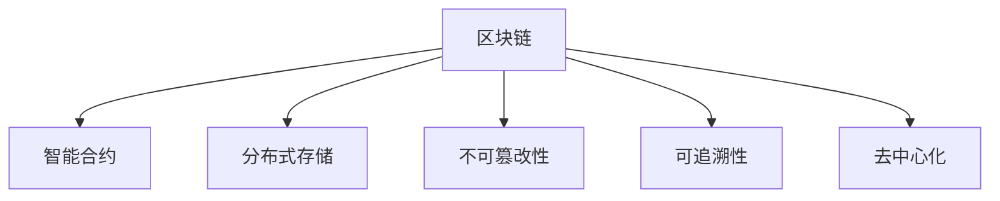

                 

# 知识的分布式存储：区块链技术在教育中的应用

## 1. 背景介绍

### 1.1 问题由来
在现代社会中，教育是每个个体获取知识、提升自我价值的重要途径。然而，传统的教育模式存在着诸多局限性：

- **资源不对等**：优质教育资源主要集中在少数地区和学校，尤其是高等教育资源，往往被少数富裕家庭独占。
- **知识孤岛**：各学科知识之间存在较大的信息壁垒，难以有效整合和共享。
- **学习效率低**：教学内容与实际需求存在脱节，且信息更新不及时，学习效果不理想。
- **信息孤岛**：学习者之间缺乏有效的互动与合作，难以形成知识共享的良性循环。

这些问题严重制约了教育资源的公平分配和高效利用，阻碍了教育质量的提升。随着互联网技术的普及，线上教育的兴起为教育公平提供了新的可能性。但现有在线教育平台也面临一些挑战：

- **数据安全问题**：在线教育平台的数据隐私保护和版权问题亟待解决。
- **信息可靠性问题**：教师和学生反馈信息可能被篡改或丢失，影响教学效果。
- **知识权威性问题**：平台上的课程内容权威性无法保证，存在知识误导风险。

面对这些挑战，区块链技术以其去中心化、不可篡改和可追溯的特性，为教育资源的分布式存储与共享提供了新的思路。

### 1.2 问题核心关键点
区块链技术在教育应用中的关键点在于其核心特性：

- **分布式存储**：通过去中心化的网络节点，实现教育资源的分布式存储，减少单点故障，提高系统的可靠性和可扩展性。
- **不可篡改性**：通过区块链的共识机制，确保教育资源内容的权威性和真实性，防止数据篡改。
- **可追溯性**：通过区块链的记录和验证机制，实现教育资源的使用轨迹追踪，增强透明性和可信度。

这些特性使得区块链技术在教育资源的分布式存储和共享中具有巨大的应用潜力。

## 2. 核心概念与联系

### 2.1 核心概念概述

为了更好地理解区块链技术在教育中的应用，我们需要介绍几个关键概念：

- **区块链(Blockchain)**：一种基于去中心化、不可篡改的分布式账本技术，通过共识机制保证数据的真实性和完整性。
- **智能合约(Smart Contract)**：运行在区块链上的代码合约，自动执行预设条件下的操作，实现无需第三方干预的自动化处理。
- **去中心化(Decentralization)**：系统中的节点不依赖单一的中心化管理机构，而是通过网络节点间的共识机制来维护数据的安全和一致性。
- **分布式存储(Distributed Storage)**：数据存储在多个分散的节点上，以提高系统的可靠性和可扩展性。
- **不可篡改性(Immutability)**：区块链上的数据一旦被记录，就无法被非法篡改，确保数据的真实性和完整性。
- **可追溯性(Traceability)**：通过区块链的记录和验证机制，可以追溯数据来源和使用轨迹，增强数据的可信度。

这些核心概念通过以下Mermaid流程图展示了它们之间的联系：



这个流程图展示了区块链技术在教育中的应用，将分布式存储、不可篡改性和可追溯性作为核心优势，通过智能合约实现自动化处理，最终实现去中心化的教育资源共享。

## 3. 核心算法原理 & 具体操作步骤
### 3.1 算法原理概述

区块链技术在教育中的应用，主要围绕以下几个核心原理展开：

- **分布式存储**：通过将教育资源分布式存储在网络节点上，实现数据的冗余备份和容错能力。
- **不可篡改性**：利用区块链的共识机制，确保教育资源内容的真实性和权威性，防止数据篡改。
- **智能合约**：通过编写智能合约，实现自动化处理教育资源的分发、使用和验证，增强系统的透明度和安全性。

基于以上原理，区块链技术在教育中的应用可以分为以下几个步骤：

1. **资源收集与预处理**：收集教育资源，如教材、视频、考试题等，并进行预处理，确保数据格式和质量。
2. **资源上链**：将预处理后的教育资源上链存储，利用区块链的分布式存储和不可篡改性保证数据的完整性和安全性。
3. **智能合约设计**：根据教育需求，设计智能合约，实现教育资源的自动化管理和验证。
4. **智能合约部署与执行**：将智能合约部署到区块链网络中，并按照预设条件触发执行，实现教育资源的自动化分发和使用。
5. **使用与反馈**：教师和学生根据需求使用教育资源，并反馈使用效果，通过智能合约更新和验证数据，保证资源的质量和效率。

### 3.2 算法步骤详解

以下详细介绍区块链技术在教育中各个步骤的具体操作：

**Step 1: 资源收集与预处理**

- **资源收集**：从不同渠道收集教育资源，如学校、教育平台、图书馆等。确保资源的多样性和全面性。
- **预处理**：对收集到的资源进行格式转换、质量检查、内容筛选等预处理，确保数据的标准化和可用性。

**Step 2: 资源上链**

- **创建区块链节点**：构建分布式区块链网络，选择适合的区块链平台（如Hyperledger Fabric、Ethereum等）。
- **智能合约编码**：编写智能合约代码，定义教育资源的存储、分发、使用和验证规则。
- **资源上链存储**：将预处理后的教育资源上链存储，确保数据的安全性和不可篡改性。

**Step 3: 智能合约设计**

- **用户身份验证**：设计用户身份验证机制，确保只有授权用户才能访问和使用教育资源。
- **资源分发逻辑**：定义教育资源的分配规则，如按需分发、随机分发等，确保资源的公平性和透明性。
- **使用验证机制**：设计资源使用验证机制，确保教育资源的使用质量和效果，如考试成绩验证、学习成果评估等。

**Step 4: 智能合约部署与执行**

- **合约部署**：将智能合约部署到区块链网络中，设定触发条件，等待执行。
- **触发执行**：根据预设条件（如用户需求、学习进度、时间等）触发智能合约执行，实现资源的自动化分发和使用。

**Step 5: 使用与反馈**

- **资源使用**：教师和学生根据需求使用教育资源，进行学习、测试等活动。
- **反馈收集**：收集用户对教育资源的反馈信息，通过智能合约验证和更新数据，确保资源的质量和效率。
- **资源更新**：根据用户反馈和数据验证，更新教育资源，保证其与时俱进。

### 3.3 算法优缺点

区块链技术在教育中的应用具有以下优点：

- **数据安全**：去中心化的存储和不可篡改性，确保了教育资源的安全性和完整性。
- **透明度高**：智能合约的自动化处理和可追溯性，增强了系统的透明度和可信度。
- **高效性**：通过自动化分发和使用，减少了人工干预，提高了资源的使用效率。

同时，也存在一些缺点：

- **技术门槛高**：区块链技术的实施需要较高的技术门槛，需要专业团队进行开发和维护。
- **成本高**：区块链的部署和维护成本较高，对于资源有限的学校和教育平台可能难以承受。
- **可扩展性有限**：现有区块链技术的可扩展性不足，可能无法应对大规模教育资源的需求。

### 3.4 算法应用领域

区块链技术在教育中的应用领域包括但不限于：

- **在线教育资源共享**：实现教育资源的分布式存储和共享，打破地域和学校的限制，提供公平的教育机会。
- **学生成绩验证**：利用区块链的不可篡改性，实现学生成绩的透明和可信验证，确保教育的公平性和公正性。
- **课程内容管理**：通过智能合约管理课程内容的分发和使用，确保课程内容的权威性和真实性。
- **学术合作与交流**：实现学术资源的分布式存储和共享，促进学术合作与交流，推动知识创新。
- **教育资金管理**：利用区块链的透明性和不可篡改性，实现教育资金的透明管理和使用，防止资金滥用。

## 4. 数学模型和公式 & 详细讲解 & 举例说明

### 4.1 数学模型构建

为了更精确地描述区块链技术在教育中的应用，我们可以构建一个数学模型。

设 $E=\{e_1, e_2, ..., e_n\}$ 为教育资源集合，每个资源 $e_i$ 包含 $d$ 个特征 $f_i$。

设 $U=\{u_1, u_2, ..., u_m\}$ 为用户集合，每个用户 $u_j$ 拥有 $k$ 个属性 $a_j$。

设 $C=\{c_1, c_2, ..., c_l\}$ 为智能合约集合，每个合约 $c_k$ 包含 $p$ 个操作 $o_k$。

设 $R=\{r_1, r_2, ..., r_s\}$ 为教育资源的使用记录集合，每个记录 $r_t$ 包含 $q$ 个元素 $g_t$。

基于上述模型，我们可以构建区块链技术在教育中的应用模型，如下：

$$
\begin{aligned}
& \text{模型目标} \rightarrow \text{最大化用户教育资源使用效果} \\
& \text{模型约束} \rightarrow \text{资源上链存储} \\
& \text{智能合约} \rightarrow \text{资源分发、使用验证}
\end{aligned}
$$

### 4.2 公式推导过程

以下我们以学生成绩验证为例，推导智能合约的实现过程。

假设学生 $u_j$ 的成绩为 $s_j$，该成绩存储在区块链上，其智能合约 $c_k$ 包含验证操作 $o_k$，规则如下：

$$
o_k: \text{验证学生成绩是否为真实数据}
$$

智能合约的验证规则为：

1. 智能合约接收用户提交的成绩 $s_j$。
2. 智能合约从区块链上获取学生的原始成绩数据 $s_j^{original}$。
3. 智能合约计算哈希值 $H(s_j) = \text{sha256}(s_j)$。
4. 智能合约验证 $H(s_j) = H(s_j^{original})$，如果相等，则验证通过，返回验证结果为真；否则验证失败，返回结果为假。

具体实现如下：

$$
\begin{aligned}
& \text{输入} \rightarrow (s_j, u_j) \\
& \text{输出} \rightarrow \text{验证结果} \\
& \text{智能合约} \rightarrow c_k
\end{aligned}
$$

其中：

- $s_j$：学生提交的成绩
- $s_j^{original}$：区块链上的原始成绩数据
- $H(s_j)$：计算出的哈希值
- $H(s_j^{original})$：区块链上的原始成绩数据计算出的哈希值
- $\text{sha256}$：哈希函数

### 4.3 案例分析与讲解

我们可以举一个具体的案例来说明区块链技术在教育中的应用。

假设某在线教育平台希望实现学生的考试成绩验证。该平台收集了学生的考试成绩数据，并将其上链存储。当学生申请成绩验证时，智能合约自动触发执行，进行如下操作：

1. 智能合约接收学生提交的考试成绩 $s_j$。
2. 智能合约从区块链上获取该学生的原始考试成绩 $s_j^{original}$。
3. 智能合约计算哈希值 $H(s_j)$ 和 $H(s_j^{original})$。
4. 智能合约验证 $H(s_j) = H(s_j^{original})$，如果相等，则验证通过，返回验证结果为真；否则验证失败，返回结果为假。

如果验证通过，学生即可获取成绩验证的证明，作为其后续学习或就业的依据。这种基于区块链的验证方法，确保了成绩的真实性和可信度，防止了成绩的篡改和作弊现象。

## 5. 项目实践：代码实例和详细解释说明

### 5.1 开发环境搭建

在进行区块链技术在教育中的应用实践前，我们需要准备好开发环境。以下是使用Hyperledger Fabric进行区块链开发的环境配置流程：

1. 安装Docker：从官网下载并安装Docker，用于构建和运行Hyperledger Fabric容器。

2. 安装Hyperledger Fabric SDK：根据官方文档，选择适合的Hyperledger Fabric版本，并从官网下载SDK包进行安装。

3. 安装Go语言：因为Hyperledger Fabric是基于Go语言开发的，所以需要安装Go语言，并设置环境变量。

4. 安装Hyperledger Composer：Composer是Hyperledger Fabric的高级开发工具，用于编写智能合约和管理区块链网络。

5. 安装Hyperledger Fabric CLI：用于与Hyperledger Fabric网络进行交互。

完成上述步骤后，即可在本地搭建Hyperledger Fabric网络，并进行智能合约的编写和测试。

### 5.2 源代码详细实现

以下是一个基于Hyperledger Fabric实现的智能合约代码，用于实现学生成绩验证：

```go
package main

import (
	"bytes"
	"fmt"
	"github.com/hyperledger/fabric-contract-api-go/contractapi"
	"crypto/sha256"
	"encoding/hex"
)

type ExamContract struct {
	contractapi.Contract
}

func (c *ExamContract) Invoke(stub contractapi.TransactionContextInterface) {
	// 获取传递的参数
 method := stub.GetFunctionAndParameters()
 method, args := method[0], method[1:]

	// 根据方法调用相应的操作
	switch method {
	case "verifyExam":
		// 获取学生ID和成绩
		studentID := args[0]
		examScore := args[1]

		// 从区块链上获取学生原始成绩数据
		originalScore, err := stub.getState(studentID)
		if err != nil {
			fmt.Println("Error: ", err)
			return
		}

		// 计算哈希值
		hash := sha256.Sum256([]byte(examScore))
		hashedScore := hex.EncodeToString(hash[:])

		// 验证成绩
		if hashedScore == originalScore {
			fmt.Println("Exam Score Valid: " + examScore)
		} else {
			fmt.Println("Exam Score Invalid: " + examScore)
		}
	default:
		fmt.Println("Invalid Method")
		return
	}
}

func main() {
	contract := new(ExamContract)
	err := contract.Start()
	if err != nil {
		fmt.Println(err)
		return
	}
}
```

这段代码定义了一个智能合约，实现了学生成绩的验证功能。智能合约包含一个 `verifyExam` 方法，用于验证学生提交的成绩是否为真实数据。

### 5.3 代码解读与分析

让我们再详细解读一下关键代码的实现细节：

**ExamContract结构体**：
- 定义了一个 `Invoke` 方法，用于处理用户提交的智能合约调用。
- 根据调用方法，执行相应的操作，如 `verifyExam`。

**verifyExam方法**：
- 获取用户提交的参数，即学生ID和成绩。
- 从区块链上获取学生的原始成绩数据。
- 计算成绩的哈希值，并与区块链上的原始数据比较，验证成绩的真实性。
- 输出验证结果。

**main函数**：
- 创建智能合约实例，并启动智能合约。
- 在启动智能合约时，会自动将智能合约部署到Hyperledger Fabric网络中。

### 5.4 运行结果展示

在Hyperledger Fabric网络上部署智能合约后，可以使用Hyperledger Fabric CLI工具进行智能合约的调用和验证。例如，可以执行以下命令进行验证：

```bash
peer chaincode invoke -o orderer.example.com -n channel -C examContract -f verifyExam '{"Args":["Alice", "90"]}'
```

其中，`Alice` 为学生ID，`90` 为成绩。执行命令后，智能合约会自动从区块链上获取学生的原始成绩数据，并计算哈希值进行验证，最后输出验证结果。

## 6. 实际应用场景

### 6.1 在线教育资源共享

区块链技术在在线教育资源共享中的应用，可以打破地域和学校的限制，提供公平的教育机会。具体实现如下：

1. **资源收集**：从不同渠道收集教育资源，如学校、教育平台、图书馆等。
2. **资源上链**：将收集到的资源上链存储，利用区块链的分布式存储和不可篡改性保证数据的完整性和安全性。
3. **智能合约设计**：定义教育资源的存储、分发和使用规则，确保资源的公平性和透明性。
4. **智能合约部署与执行**：将智能合约部署到区块链网络中，并按照预设条件触发执行，实现资源的自动化分发和使用。

### 6.2 学生成绩验证

区块链技术在学生成绩验证中的应用，可以确保成绩的真实性和可信度，防止成绩的篡改和作弊现象。具体实现如下：

1. **数据收集**：收集学生的考试成绩数据，并将其上链存储。
2. **智能合约设计**：定义成绩验证的规则和操作，确保成绩的真实性。
3. **智能合约部署与执行**：将智能合约部署到区块链网络中，并根据学生的需求触发验证操作。

### 6.3 课程内容管理

区块链技术在课程内容管理中的应用，可以确保课程内容的权威性和真实性，防止课程内容被篡改。具体实现如下：

1. **数据收集**：收集课程内容，并将其上链存储。
2. **智能合约设计**：定义课程内容的存储、分发和使用规则，确保内容的权威性。
3. **智能合约部署与执行**：将智能合约部署到区块链网络中，并按照预设条件触发执行，实现课程内容的自动化分发和使用。

### 6.4 未来应用展望

随着区块链技术的不断发展和完善，其在教育中的应用前景将更加广阔。未来，区块链技术将在以下领域得到广泛应用：

- **教育数据共享**：实现教育数据的分布式存储和共享，促进教育资源的公平分配和高效利用。
- **学习成果认证**：利用区块链的不可篡改性和可追溯性，实现学习成果的认证和验证，增强教育的可信度和公信力。
- **学术合作与交流**：实现学术资源的分布式存储和共享，促进学术合作与交流，推动知识创新。
- **教育资金管理**：利用区块链的透明性和不可篡改性，实现教育资金的透明管理和使用，防止资金滥用。

## 7. 工具和资源推荐
### 7.1 学习资源推荐

为了帮助开发者系统掌握区块链技术在教育中的应用，这里推荐一些优质的学习资源：

1. 《区块链技术与应用》：一本全面介绍区块链技术的经典书籍，内容详实，适合初学者入门。
2. 《Hyperledger Fabric官方文档》：Hyperledger Fabric的官方文档，提供详细的技术实现和开发指南。
3. 《智能合约设计与实现》：一本介绍智能合约设计、实现和应用的书，适合进一步深入学习。
4. 《区块链技术在教育中的应用》：一篇关于区块链技术在教育领域应用的研究论文，内容系统，适合学术研究。
5. 《Hyperledger Composer官方文档》：Composer的官方文档，提供Composer工具的详细介绍和使用指南。

通过对这些资源的学习实践，相信你一定能够快速掌握区块链技术在教育中的应用。

### 7.2 开发工具推荐

高效的开发离不开优秀的工具支持。以下是几款用于区块链技术在教育开发中常用的工具：

1. Docker：用于构建和运行Hyperledger Fabric容器，便于管理和部署区块链网络。
2. Go语言：Hyperledger Fabric基于Go语言开发，是编写智能合约和区块链网络的重要工具。
3. Hyperledger Composer：Composer是Hyperledger Fabric的高级开发工具，用于编写智能合约和管理区块链网络。
4. Hyperledger Fabric CLI：用于与Hyperledger Fabric网络进行交互，进行智能合约的调用和验证。
5. GitLab：GitLab是一个免费的代码托管平台，便于进行区块链项目的版本控制和协作开发。

合理利用这些工具，可以显著提升区块链技术在教育开发中的效率，加快创新迭代的步伐。

### 7.3 相关论文推荐

区块链技术在教育领域的研究始于近年，以下是几篇奠基性的相关论文，推荐阅读：

1. 《Blockchain Technology in Education: Opportunities and Challenges》：一篇关于区块链技术在教育领域应用的研究综述，涵盖各种应用场景和技术实现。
2. 《A Survey on Blockchain for Education》：一篇对区块链在教育领域应用的研究综述，介绍最新研究进展和技术实现。
3. 《Blockchain-Enabled Smart Contracts for Education Data Sharing》：一篇关于区块链技术在教育数据共享中的应用研究论文，介绍技术实现和性能评估。
4. 《Blockchain-Based Student Academic Record Management System》：一篇关于区块链技术在学生成绩验证中的应用研究论文，介绍技术实现和应用效果。
5. 《Blockchain for Academic Collaboration and Knowledge Sharing》：一篇关于区块链技术在学术合作中的应用研究论文，介绍技术实现和应用效果。

这些论文代表了大数据技术在教育领域的研究进展，通过学习这些前沿成果，可以帮助研究者把握学科前进方向，激发更多的创新灵感。

## 8. 总结：未来发展趋势与挑战

### 8.1 研究成果总结

本文对区块链技术在教育中的应用进行了全面系统的介绍。首先阐述了区块链技术在教育领域的研究背景和意义，明确了区块链技术在教育资源分布式存储与共享中的重要价值。其次，从原理到实践，详细讲解了区块链技术在教育中的应用过程，包括资源收集、上链存储、智能合约设计、部署与执行等关键步骤，给出了智能合约实现的代码示例。同时，本文还广泛探讨了区块链技术在在线教育资源共享、学生成绩验证、课程内容管理等诸多教育场景中的应用前景，展示了区块链技术的巨大潜力。

通过本文的系统梳理，可以看到，区块链技术在教育中的应用将大大提升教育资源的公平性和高效性，促进教育的可持续发展。

### 8.2 未来发展趋势

展望未来，区块链技术在教育中的应用将呈现以下几个发展趋势：

1. **分布式存储与共享**：区块链技术的去中心化和分布式存储特性，将使得教育资源能够更广泛地分布和共享，打破地域和学校的限制，提供公平的教育机会。
2. **智能合约自动化处理**：智能合约的自动化处理能力，将使得教育资源的分发、使用和验证更加高效和透明，提升系统的运行效率和安全性。
3. **可追溯性和透明性**：区块链技术的可追溯性和透明性，将使得教育资源的使用轨迹和验证过程更加清晰和可信，增强系统的公信力和可信度。
4. **知识共享与创新**：区块链技术的去中心化和不可篡改性，将使得学术资源的共享和合作更加容易，促进知识创新和学术交流。
5. **教育资金管理**：区块链技术的透明性和不可篡改性，将使得教育资金的管理和监督更加透明和公平，防止资金滥用。

以上趋势凸显了区块链技术在教育领域的广阔应用前景。这些方向的探索发展，必将进一步提升教育的公平性和高效性，推动教育质量的提升。

### 8.3 面临的挑战

尽管区块链技术在教育中的应用前景广阔，但在实施过程中仍面临诸多挑战：

1. **技术门槛高**：区块链技术的实施需要较高的技术门槛，需要专业团队进行开发和维护，技术普及和应用推广难度较大。
2. **成本高**：区块链的部署和维护成本较高，对于资源有限的学校和教育平台可能难以承受，需要寻找更低成本的替代方案。
3. **可扩展性有限**：现有区块链技术的可扩展性不足，可能无法应对大规模教育资源的需求，需要进一步优化和改进。
4. **用户接受度低**：部分用户对区块链技术的信任度较低，需要加强技术宣传和教育，提高用户接受度。
5. **法律法规风险**：区块链技术的实施涉及隐私保护、版权保护等法律问题，需要制定相应的法律法规，规范技术应用。

### 8.4 研究展望

面对区块链技术在教育应用中的挑战，未来的研究需要在以下几个方面寻求新的突破：

1. **降低技术门槛**：开发更加易用的区块链开发工具和框架，降低技术门槛，便于教育机构和开发者的使用。
2. **降低成本**：探索低成本的区块链技术应用方案，如联盟链、公有链等，降低部署和维护成本。
3. **提高可扩展性**：研究并应用更加高效的区块链技术，如分层区块链、分片技术等，提高系统的可扩展性。
4. **增强用户信任**：加强区块链技术的宣传和教育，提高用户对区块链技术的信任度，推动技术普及和应用推广。
5. **制定法律法规**：制定并完善区块链技术的法律法规，规范技术应用，保护用户隐私和版权。

这些研究方向的探索，必将引领区块链技术在教育中的应用走向成熟，为教育资源的公平分配和高效利用提供新的解决方案。

## 9. 附录：常见问题与解答

**Q1：区块链技术在教育中的应用有哪些？**

A: 区块链技术在教育中的应用包括但不限于：

1. **在线教育资源共享**：实现教育资源的分布式存储和共享，打破地域和学校的限制，提供公平的教育机会。
2. **学生成绩验证**：确保成绩的真实性和可信度，防止成绩的篡改和作弊现象。
3. **课程内容管理**：确保课程内容的权威性和真实性，防止课程内容被篡改。
4. **学术合作与交流**：促进学术资源的共享和合作，推动知识创新。
5. **教育资金管理**：实现教育资金的透明管理和使用，防止资金滥用。

**Q2：区块链技术在教育中的应用需要哪些技术支持？**

A: 区块链技术在教育中的应用需要以下技术支持：

1. **区块链平台**：选择适合的区块链平台，如Hyperledger Fabric、Ethereum等，搭建分布式区块链网络。
2. **智能合约**：编写智能合约代码，定义教育资源的存储、分发和使用规则。
3. **开发工具**：使用Docker、Go语言、Hyperledger Composer等工具进行区块链网络的开发和部署。
4. **学习资源**：使用《区块链技术与应用》等书籍和《Hyperledger Fabric官方文档》等资料进行技术学习和实践。

**Q3：区块链技术在教育中的应用有哪些挑战？**

A: 区块链技术在教育中的应用面临以下挑战：

1. **技术门槛高**：区块链技术的实施需要较高的技术门槛，需要专业团队进行开发和维护，技术普及和应用推广难度较大。
2. **成本高**：区块链的部署和维护成本较高，对于资源有限的学校和教育平台可能难以承受，需要寻找更低成本的替代方案。
3. **可扩展性有限**：现有区块链技术的可扩展性不足，可能无法应对大规模教育资源的需求，需要进一步优化和改进。
4. **用户接受度低**：部分用户对区块链技术的信任度较低，需要加强技术宣传和教育，提高用户接受度。
5. **法律法规风险**：区块链技术的实施涉及隐私保护、版权保护等法律问题，需要制定相应的法律法规，规范技术应用。

**Q4：区块链技术在教育中的应用有哪些未来发展方向？**

A: 区块链技术在教育中的应用将呈现以下几个未来发展方向：

1. **分布式存储与共享**：区块链技术的去中心化和分布式存储特性，将使得教育资源能够更广泛地分布和共享，打破地域和学校的限制，提供公平的教育机会。
2. **智能合约自动化处理**：智能合约的自动化处理能力，将使得教育资源的分发、使用和验证更加高效和透明，提升系统的运行效率和安全性。
3. **可追溯性和透明性**：区块链技术的可追溯性和透明性，将使得教育资源的使用轨迹和验证过程更加清晰和可信，增强系统的公信力和可信度。
4. **知识共享与创新**：区块链技术的去中心化和不可篡改性，将使得学术资源的共享和合作更加容易，促进知识创新和学术交流。
5. **教育资金管理**：区块链技术的透明性和不可篡改性，将使得教育资金的管理和监督更加透明和公平，防止资金滥用。

**Q5：区块链技术在教育中的应用有哪些具体案例？**

A: 区块链技术在教育中的应用有以下具体案例：

1. **在线教育资源共享**：如OER Commons平台，通过区块链技术实现开源教育资源的分布式存储和共享。
2. **学生成绩验证**：如Blockchain-based Verifiable Credentials平台，通过智能合约实现学生成绩的验证和认证。
3. **课程内容管理**：如EDUCCR平台，通过区块链技术管理课程内容的版权和分发。
4. **学术合作与交流**：如Google Scholar，通过区块链技术实现学术资源的共享和合作。
5. **教育资金管理**：如EduCoin平台，通过区块链技术管理教育资金的透明和公平。

总之，区块链技术在教育中的应用，为教育的公平、高效和透明提供了新的解决方案，必将推动教育技术的创新和发展。

---

作者：禅与计算机程序设计艺术 / Zen and the Art of Computer Programming

