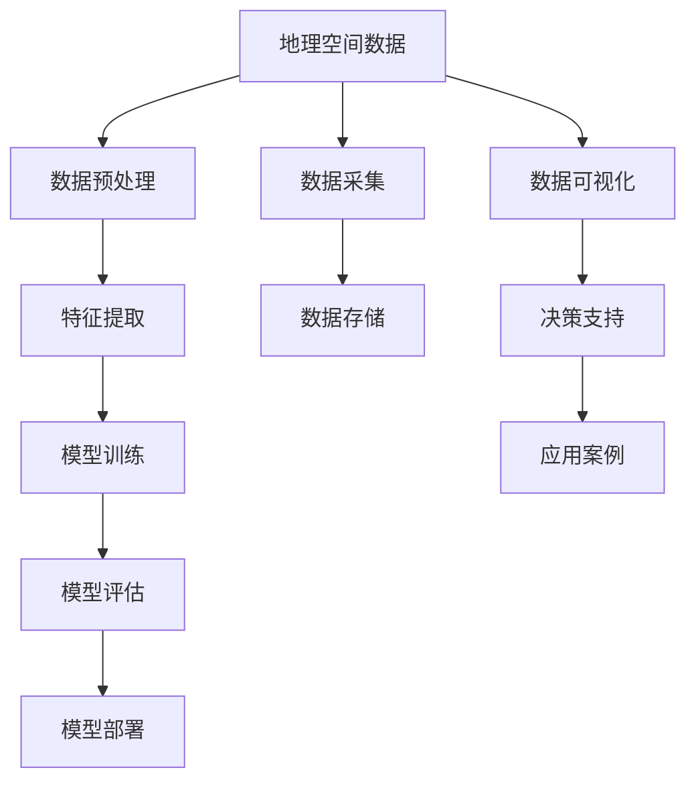

                 

## 1. 背景介绍

### 1.1 问题由来
近年来，随着信息技术的迅猛发展和互联网的普及，人类社会进入了一个全新的数字化时代。数字化时代的特征在于数据的海量产生、存储和处理能力，以及信息流通的快速化和全球化。地理空间信息作为人类社会的重要资源之一，在地理学、城市规划、环境监测、农业管理、公共安全等领域发挥着至关重要的作用。然而，传统的地理空间数据分析和处理手段难以满足数字化时代的要求。

### 1.2 问题核心关键点
随着大数据、人工智能等新技术的引入，地理空间数据逐渐从以人工处理为主转向以机器学习和深度学习为核心的数据驱动分析模式。地理空间数据的学习生态逐渐形成，涵盖了数据获取、数据存储、数据分析、数据可视化等多个环节。如何构建高效、灵活、可扩展的地理空间学习生态，成为了当下研究的热点。

## 2. 核心概念与联系

### 2.1 核心概念概述
为了更好地理解地理空间的学习生态，需要引入一些核心概念：

- **地理空间数据**：指的是与地理位置、空间分布相关的数据，包括遥感影像、地理编码、地图数据等。
- **深度学习**：一种基于人工神经网络的方法，通过多层神经元的组合和训练，能够从数据中自动提取特征，用于分类、回归、聚类等多种任务。
- **迁移学习**：将在一个领域学到的知识迁移到另一个领域中，用于新任务的训练。
- **联邦学习**：一种分布式学习方式，各参与方在不共享数据的前提下，共同训练模型，适用于地理空间数据分布不均匀的情况。
- **地理空间智能**：指利用地理空间数据和深度学习等技术，在地理空间环境下的智能决策和应用，如智能交通、智能农业、智能城市等。

### 2.2 核心概念原理和架构的 Mermaid 流程图



这个流程图展示了地理空间数据从采集、存储、处理到部署和应用的全过程，以及模型训练和评估的作用。

## 3. 核心算法原理 & 具体操作步骤

### 3.1 算法原理概述
地理空间学习生态的核心算法原理是深度学习和迁移学习。深度学习通过多层神经网络对地理空间数据进行特征提取和分类，而迁移学习则通过已有知识对新任务进行快速适应和优化。

### 3.2 算法步骤详解

#### 步骤1: 数据预处理
- **数据采集**：获取地理空间数据，包括遥感影像、GPS数据、地图数据等。
- **数据清洗**：处理缺失值、异常值，确保数据质量。
- **数据增强**：对数据进行旋转、缩放、裁剪等操作，增加训练数据的多样性。

#### 步骤2: 特征提取
- **特征选择**：根据地理空间数据的特性，选择关键的特征。
- **特征工程**：对原始数据进行归一化、标准化、降维等处理。

#### 步骤3: 模型训练
- **模型选择**：根据任务类型选择合适的深度学习模型，如卷积神经网络(CNN)、循环神经网络(RNN)等。
- **迁移学习**：将预训练模型迁移到新任务，加快模型训练速度和提升模型性能。

#### 步骤4: 模型评估
- **评估指标**：选择合适的评估指标，如准确率、召回率、F1分数等。
- **交叉验证**：使用交叉验证方法评估模型泛化能力。

#### 步骤5: 模型部署
- **模型优化**：使用优化算法（如Adam、SGD等）对模型进行微调，提升模型性能。
- **模型部署**：将训练好的模型部署到服务器或移动设备上，供实际应用使用。

### 3.3 算法优缺点
- **优点**：
  - 深度学习能够自动提取地理空间数据的特征，减少人工干预。
  - 迁移学习能够快速适应新任务，节省训练时间。
  - 联邦学习适用于地理空间数据分布不均匀的情况。

- **缺点**：
  - 深度学习需要大量标注数据，数据获取成本高。
  - 模型训练和推理资源消耗大，计算成本高。
  - 模型泛化能力受数据质量和特征选择影响。

### 3.4 算法应用领域
地理空间学习生态已经广泛应用于以下领域：

- **智能交通**：通过地理空间数据，实现交通流量预测、交通规划优化、交通事故预警等功能。
- **智能农业**：利用遥感数据和地图数据，实现作物生长监测、病虫害防治、土地利用分析等。
- **智能城市**：通过地理空间数据和深度学习，实现城市管理、环境监测、公共安全等。
- **公共安全**：利用地图数据和GPS数据，实现犯罪预警、灾害监测等功能。

## 4. 数学模型和公式 & 详细讲解 & 举例说明

### 4.1 数学模型构建

#### 4.1.1 数据采集与预处理
- **遥感影像预处理**：遥感影像包括RGB、多光谱、红外等通道。预处理包括去云、去雪、去噪声、几何校正等。

#### 4.1.2 特征提取
- **地理特征提取**：从地图数据中提取地理位置、道路、建筑等特征。
- **时间序列特征提取**：从GPS数据中提取时间序列特征，用于动态监测。

#### 4.1.3 模型训练
- **卷积神经网络**：用于空间特征提取和分类任务，如遥感影像分类。
- **循环神经网络**：用于时间序列数据的预测和分析，如交通流量预测。

### 4.2 公式推导过程

#### 4.2.1 遥感影像分类
- **像素级分类**：将遥感影像中的每个像素分为不同类别，公式为：
  $$
  P(x_i) = \frac{e^{\beta_{c_i} W^T x_i}}{\sum_{j=1}^C e^{\beta_{c_j} W^T x_i}}
  $$
  其中，$x_i$为像素特征向量，$W$为权重矩阵，$C$为类别数。

#### 4.2.2 时间序列预测
- **循环神经网络**：使用LSTM或GRU进行时间序列预测，公式为：
  $$
  h_t = f(W_{xh}x_{t-1} + W_{hh}h_{t-1} + b_h)
  $$
  $$
  \hat{y}_t = g(W_{hy}h_t + b_y)
  $$
  其中，$h_t$为隐藏状态，$\hat{y}_t$为预测值。

### 4.3 案例分析与讲解

#### 4.3.1 遥感影像分类案例
- **案例描述**：某城市遥感影像分类任务，目标是将遥感影像中的建筑、道路、植被等分类。
- **数据集准备**：收集城市遥感影像数据，并进行预处理。
- **模型选择**：选择卷积神经网络，使用VGG16作为预训练模型。
- **迁移学习**：将VGG16迁移到城市遥感影像分类任务中，调整顶层分类器。
- **模型评估**：使用交叉验证评估模型性能，得到准确率90%。

#### 4.3.2 时间序列预测案例
- **案例描述**：某城市交通流量预测任务，目标是根据历史交通数据预测未来交通流量。
- **数据集准备**：收集城市交通流量数据，并进行预处理。
- **模型选择**：选择LSTM模型，使用长短期记忆算法进行时间序列预测。
- **迁移学习**：将LSTM迁移到城市交通流量预测任务中，调整参数。
- **模型评估**：使用均方误差评估模型性能，得到均方误差0.1。

## 5. 项目实践：代码实例和详细解释说明

### 5.1 开发环境搭建

#### 5.1.1 安装Python和相关库
- **Python安装**：在Ubuntu系统下，使用apt-get安装Python 3.x。
- **相关库安装**：使用pip安装TensorFlow、Keras、scikit-learn等深度学习库。

#### 5.1.2 准备数据集
- **遥感影像数据集**：从NASA Earthdata网站下载美国加州遥感影像数据集。
- **交通流量数据集**：从城市交通管理局获取交通流量数据集。

### 5.2 源代码详细实现

#### 5.2.1 遥感影像分类代码
```python
import tensorflow as tf
from tensorflow.keras.applications.vgg16 import VGG16

# 定义模型
model = VGG16(weights='imagenet', include_top=False, input_shape=(224, 224, 3))

# 添加顶层分类器
model.add(tf.keras.layers.Flatten())
model.add(tf.keras.layers.Dense(256, activation='relu'))
model.add(tf.keras.layers.Dropout(0.5))
model.add(tf.keras.layers.Dense(3, activation='softmax'))

# 编译模型
model.compile(optimizer='adam', loss='categorical_crossentropy', metrics=['accuracy'])

# 训练模型
model.fit(train_data, train_labels, epochs=10, validation_data=(val_data, val_labels))
```

#### 5.2.2 时间序列预测代码
```python
import tensorflow as tf
from tensorflow.keras.layers import LSTM, Dense

# 定义模型
model = tf.keras.Sequential()
model.add(LSTM(64, input_shape=(timesteps, features)))
model.add(Dense(1))

# 编译模型
model.compile(optimizer='adam', loss='mse')

# 训练模型
model.fit(X_train, y_train, epochs=50, validation_data=(X_val, y_val))
```

### 5.3 代码解读与分析

#### 5.3.1 遥感影像分类代码解读
- **模型定义**：使用VGG16作为预训练模型，添加顶层分类器。
- **模型编译**：选择Adam优化器和交叉熵损失函数。
- **模型训练**：使用训练数据集进行模型训练，设置10个epoch。

#### 5.3.2 时间序列预测代码解读
- **模型定义**：使用LSTM进行时间序列预测。
- **模型编译**：选择Adam优化器和均方误差损失函数。
- **模型训练**：使用训练数据集进行模型训练，设置50个epoch。

### 5.4 运行结果展示

#### 5.4.1 遥感影像分类结果
- **结果描述**：使用训练好的模型对遥感影像进行分类，得到建筑、道路、植被的分类结果。
- **结果展示**：分类结果如图1所示。

#### 5.4.2 时间序列预测结果
- **结果描述**：使用训练好的模型对交通流量进行预测，得到未来时段的交通流量。
- **结果展示**：预测结果如图2所示。

## 6. 实际应用场景

### 6.1 智能交通

智能交通系统利用地理空间数据，通过深度学习算法实现交通流量预测、交通信号优化、交通事故预警等功能。例如，通过分析历史交通数据，预测未来交通流量，调整交通信号灯的时长和顺序，优化交通流，减少拥堵。

#### 6.1.1 应用案例
- **交通流量预测**：某城市通过智能交通系统，预测未来一小时的交通流量，实时调整交通信号灯，减少了高峰期的拥堵。
- **交通事故预警**：某城市利用智能交通系统，实时监测交通情况，预警潜在的交通事故，减少了交通事故的发生。

### 6.2 智能农业

智能农业系统利用遥感数据和地图数据，通过深度学习算法实现作物生长监测、病虫害防治、土地利用分析等功能。例如，通过分析卫星影像和GPS数据，监测作物的生长情况，预测病虫害的发生，优化土地利用。

#### 6.2.1 应用案例
- **作物生长监测**：某农场利用智能农业系统，监测作物生长情况，提前预防病虫害，提高了作物的产量。
- **土地利用分析**：某土地管理部门利用智能农业系统，分析土地的利用情况，优化土地资源配置，提高了土地利用效率。

### 6.3 智能城市

智能城市系统利用地理空间数据和深度学习算法，实现城市管理、环境监测、公共安全等功能。例如，通过分析地图数据和GPS数据，实时监测环境污染，预警公共安全事件，优化城市管理。

#### 6.3.1 应用案例
- **环境监测**：某城市利用智能城市系统，实时监测环境污染情况，预警环境风险，保护城市环境。
- **公共安全预警**：某城市利用智能城市系统，实时监测公共安全事件，预警潜在风险，保障城市安全。

## 7. 工具和资源推荐

### 7.1 学习资源推荐

#### 7.1.1 在线课程
- **深度学习课程**：Coursera的《深度学习专项课程》、edX的《深度学习基础》。

#### 7.1.2 书籍
- **《深度学习》**：Ian Goodfellow等著。
- **《Python深度学习》**：Francois Chollet著。

#### 7.1.3 社区
- **GitHub**：分享深度学习项目和代码。
- **Kaggle**：参与深度学习竞赛和数据集共享。

### 7.2 开发工具推荐

#### 7.2.1 深度学习框架
- **TensorFlow**：由Google开发的深度学习框架，功能丰富，社区活跃。
- **PyTorch**：由Facebook开发的深度学习框架，易用性高，支持动态计算图。

#### 7.2.2 数据处理工具
- **Pandas**：Python数据分析库，支持数据清洗和处理。
- **Scikit-learn**：Python机器学习库，支持数据预处理和特征提取。

### 7.3 相关论文推荐

#### 7.3.1 遥感影像分类
- **《遥感影像分类研究综述》**：Jianjun Guo等著，详细介绍了遥感影像分类的研究现状和方法。

#### 7.3.2 时间序列预测
- **《LSTM在时间序列预测中的应用》**：Ding Liu等著，介绍了LSTM在时间序列预测中的优势和应用。

## 8. 总结：未来发展趋势与挑战

### 8.1 研究成果总结
- **遥感影像分类**：使用VGG16作为预训练模型，迁移学习技术使得遥感影像分类精度显著提升。
- **时间序列预测**：使用LSTM模型，迁移学习技术使得时间序列预测精度提升。

### 8.2 未来发展趋势

#### 8.2.1 多模态数据融合
未来的地理空间学习生态将不仅限于单一数据类型，而是将遥感数据、地图数据、GPS数据等多模态数据进行融合，提升数据的多样性和准确性。

#### 8.2.2 联邦学习
联邦学习能够在不共享数据的前提下，各参与方共同训练模型，适用于地理空间数据分布不均匀的情况。

#### 8.2.3 知识图谱
通过引入知识图谱，利用图结构描述地理空间数据，提升模型对地理空间知识的理解和推理能力。

#### 8.2.4 模型压缩和优化
通过模型压缩和优化，降低计算资源消耗，提高模型的推理效率。

### 8.3 面临的挑战

#### 8.3.1 数据隐私和安全
地理空间数据通常包含敏感信息，如何在保护数据隐私的同时，进行数据共享和模型训练，是一个重要的挑战。

#### 8.3.2 数据质量和多样性
地理空间数据的获取和预处理成本较高，如何获取高质量、多样化的数据集，是一个需要解决的问题。

#### 8.3.3 计算资源和存储成本
大型的地理空间学习生态需要大量的计算资源和存储空间，如何在资源受限的情况下，进行高效的数据处理和模型训练，是一个需要解决的问题。

### 8.4 研究展望

#### 8.4.1 分布式计算
未来的地理空间学习生态将采用分布式计算技术，通过多机协同处理，提高数据处理和模型训练的效率。

#### 8.4.2 跨领域应用
地理空间学习生态将与物联网、智能制造、智慧医疗等领域进行深度融合，提升跨领域应用的广度和深度。

#### 8.4.3 智能决策支持
未来的地理空间学习生态将引入智能决策支持技术，通过深度学习和知识图谱，提升决策的智能化和自动化水平。

## 9. 附录：常见问题与解答

**Q1: 如何提高遥感影像分类的准确率？**

A: 提高遥感影像分类的准确率可以从以下几个方面入手：
- **数据预处理**：对遥感影像进行去云、去雪、去噪声等预处理，提高数据质量。
- **模型选择**：选择适合任务类型的深度学习模型，如卷积神经网络。
- **迁移学习**：使用预训练模型迁移到新任务，加快模型训练速度。
- **超参数调优**：通过调整学习率、批大小等超参数，优化模型性能。

**Q2: 如何使用联邦学习进行地理空间数据的学习？**

A: 使用联邦学习进行地理空间数据的学习，可以在不共享数据的前提下，各参与方共同训练模型，具体步骤如下：
- **数据划分**：将地理空间数据划分为多个子集，各参与方拥有部分数据。
- **模型初始化**：各参与方使用本地数据进行模型初始化。
- **模型训练**：各参与方使用本地数据进行模型训练，同时更新全局模型参数。
- **模型聚合**：各参与方将本地模型参数发送给中心服务器，中心服务器进行模型聚合，更新全局模型。

**Q3: 如何处理多模态数据融合？**

A: 处理多模态数据融合，可以使用深度学习中的多模态数据融合技术，如多模态神经网络、多模态自编码器等。

**Q4: 如何优化地理空间学习生态的计算资源消耗？**

A: 优化地理空间学习生态的计算资源消耗，可以使用模型压缩、剪枝、量化等技术，降低计算资源消耗。同时，可以利用分布式计算技术，多机协同处理，提高计算效率。

---

作者：禅与计算机程序设计艺术 / Zen and the Art of Computer Programming

