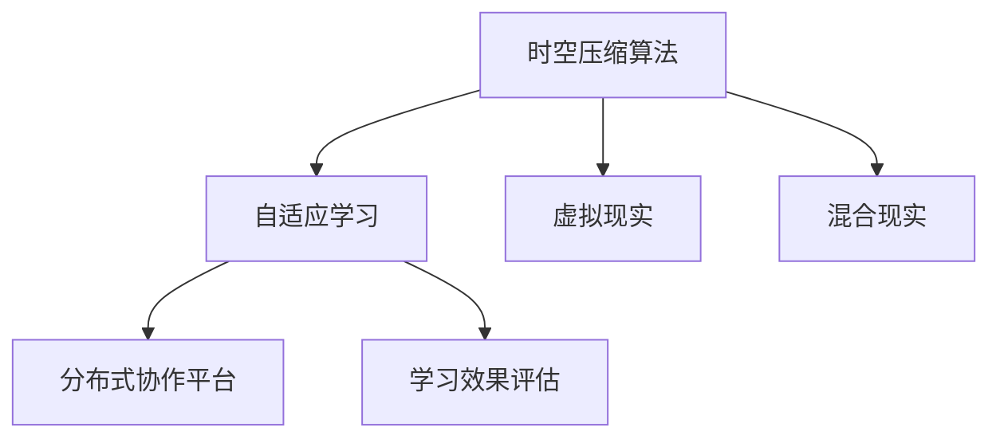

                 

# 知识的时空压缩：远程学习的新范式

> 关键词：远程学习, 时空压缩, 自适应学习, 虚拟现实(VR), 混合现实(MR), 交互式学习, 分布式协作, 学习效果评估, 人工智能(AI)辅助

## 1. 背景介绍

### 1.1 问题由来

在数字化时代的浪潮下，远程学习已经成为全球教育领域的重要组成部分。然而，传统的远程学习往往存在以下问题：

- **互动不足**：师生之间缺乏面对面的交流，难以实时反馈学生的学习状态。
- **资源单一**：学习材料多以静态文本为主，缺乏多样性和交互性。
- **个性化需求难以满足**：学生的学习能力和兴趣各异，个性化学习需求难以兼顾。
- **学习动机低**：远程学习的自主性要求高，学生容易感到孤立和乏味，学习动机下降。

为了解决这些难题，近年来，远程学习领域涌现出多种新技术，如虚拟现实(VR)、混合现实(MR)、自适应学习系统等，试图通过增强学习体验和提升学习效果来优化远程学习模式。

### 1.2 问题核心关键点

本文将聚焦于如何通过时空压缩技术来优化远程学习过程，使得知识能够以更加高效、动态的方式传递，提升学习效果和参与度。核心关键点包括：

- **时空压缩**：将复杂的知识内容通过时空压缩算法，转换为更为简洁、紧凑的学习形式，提升学习效率。
- **自适应学习**：利用人工智能技术，根据学生的学习状态和反馈，动态调整学习内容和节奏，满足个性化学习需求。
- **虚拟现实与混合现实**：通过虚拟现实和混合现实技术，创造沉浸式学习环境，增强学生的学习体验。
- **分布式协作**：借助分布式网络技术和协作平台，促进学生之间的互动和合作，提高学习参与度。
- **学习效果评估**：开发科学、客观的学习效果评估体系，确保学习目标的达成和知识点的掌握。

这些关键点相互关联，共同构成了远程学习新范式的基本框架。通过理解和掌握这些核心概念，我们可以更好地把握远程学习技术的发展方向，推动教育领域的数字化转型。

## 2. 核心概念与联系

### 2.1 核心概念概述

为了更好地理解时空压缩和远程学习新范式，本节将介绍几个核心概念及其相互关系：

- **时空压缩算法**：通过算法将时间序列数据或复杂知识表示为更紧凑的形式，以提升处理效率和理解速度。常见的时空压缩算法包括PCA、K-means聚类、自动编码器等。
- **自适应学习系统**：根据学生的学习进度、表现和反馈，动态调整学习内容和难度，满足不同学生的个性化学习需求。自适应学习系统通常基于机器学习模型，如神经网络、强化学习等。
- **虚拟现实(VR)**：通过计算机生成仿真环境，使学习者在三维虚拟空间中进行互动，增强沉浸感和参与度。
- **混合现实(MR)**：将虚拟元素与现实世界混合，形成新的交互界面，进一步提升学习体验和效率。
- **分布式协作平台**：利用网络技术，建立学生之间的互动和合作机制，促进共同学习和知识共享。
- **学习效果评估体系**：通过科学、客观的评估标准和工具，量化学生的学习成果，指导学习过程。

这些概念之间的逻辑关系可以通过以下Mermaid流程图来展示：



这个流程图展示了时空压缩算法与其他远程学习技术之间的内在联系：

1. 时空压缩算法可以将复杂知识表示为简洁形式，为自适应学习系统提供基础。
2. 虚拟现实和混合现实技术，通过沉浸式学习环境，增强时空压缩算法的应用效果。
3. 分布式协作平台，通过互动和合作机制，进一步提高时空压缩和自适应学习的效率。
4. 学习效果评估体系，通过科学量化学习成果，指导时空压缩和自适应学习过程。

## 3. 核心算法原理 & 具体操作步骤
### 3.1 算法原理概述

远程学习新范式涉及多个核心算法，包括时空压缩算法、自适应学习算法、虚拟现实和混合现实技术等。其核心思想是通过算法和技术的结合，使得知识的时空分布更加合理，学习过程更加动态、个性化。

以时空压缩算法为例，其核心原理是将时间序列数据或复杂知识表示为更紧凑的形式，减少数据处理的复杂度和时间成本。常见的时空压缩算法包括PCA、K-means聚类、自编码器等。这些算法通过数学或统计方法，将高维数据压缩为低维表示，同时尽可能保留原始数据的特性。

### 3.2 算法步骤详解

这里以PCA算法为例，详细讲解时空压缩算法的具体操作步骤：

1. **数据预处理**：将原始时间序列数据进行归一化或标准化处理，使其满足PCA算法的输入要求。
2. **特征值分解**：计算数据协方差矩阵，进行特征值分解，得到主成分。
3. **选择主成分**：根据主成分的方差贡献率，选择一定数量的主成分，重构原始数据。
4. **重构数据**：将选择的主成分作为新的数据表示，重构原始时间序列数据。

### 3.3 算法优缺点

时空压缩算法具有以下优点：
1. **高效性**：可以将高维数据压缩为低维表示，减少计算和存储成本。
2. **鲁棒性**：通过选择合适的主成分数量，可以保留关键信息，减少数据噪声的影响。
3. **可解释性**：主成分的物理意义明确，便于理解和学习。

同时，时空压缩算法也存在一些局限性：
1. **信息损失**：压缩过程中可能丢失一些细节信息，影响数据完整性。
2. **依赖数据特性**：算法的有效性依赖于数据本身的特性，如正态分布等。
3. **计算复杂度**：特征值分解和主成分计算可能较为复杂，计算量较大。

### 3.4 算法应用领域

时空压缩算法广泛应用于数据分析、图像处理、时间序列预测等领域，其核心优势在于高效性和可解释性。以下是时空压缩算法在远程学习中的应用场景：

- **在线课程视频**：通过PCA算法将长视频压缩为摘要，缩短学习时间，同时保留关键信息。
- **知识图谱构建**：利用PCA或自编码器算法，从大量文本数据中提取知识节点和关系，构建知识图谱。
- **学习进度跟踪**：通过时间序列分析，对学生的学习进度进行跟踪和预测，及时调整学习内容和难度。

## 4. 数学模型和公式 & 详细讲解 & 举例说明

### 4.1 数学模型构建

本节将使用数学语言对时空压缩和自适应学习的数学模型进行更加严格的刻画。

设原始时间序列数据为 $X = [x_1, x_2, ..., x_n]$，其中 $x_i$ 表示第 $i$ 个时间点的数据值。

定义 $X$ 的协方差矩阵 $C = \frac{1}{N-1}(X-\mu)(X-\mu)^T$，其中 $\mu = \frac{1}{N}\sum_{i=1}^N x_i$ 为数据均值。

PCA算法通过特征值分解求解协方差矩阵的特征向量 $U$ 和特征值 $\lambda$，然后选择前 $k$ 个最大特征值对应的特征向量，构成投影矩阵 $P$，即 $P = U\Lambda^{1/2}$，其中 $\Lambda$ 为特征值的对角矩阵。

重构后的数据表示为 $X' = P^TX$，即原始数据的压缩表示。

### 4.2 公式推导过程

以下我们推导PCA算法的主成分计算过程：

1. 计算数据均值 $\mu$ 和协方差矩阵 $C$。
2. 求解协方差矩阵的特征值 $\lambda$ 和特征向量 $U$。
3. 选择前 $k$ 个最大特征值对应的特征向量，构成投影矩阵 $P$。
4. 将原始数据 $X$ 通过投影矩阵 $P$ 进行压缩，得到压缩后的数据 $X'$。

### 4.3 案例分析与讲解

假设有一个包含500个时间点的股票价格时间序列数据，其协方差矩阵为 $C$。通过PCA算法选择前3个主成分，计算得到投影矩阵 $P$，并重构得到压缩后的数据 $X'$。

设 $U$ 为协方差矩阵 $C$ 的特征向量矩阵，$\Lambda$ 为特征值矩阵，则有：

$$
U = \begin{bmatrix}
0.9963 & -0.0869 & 0.0329 \\
0.0869 & 0.9590 & 0.2627 \\
-0.0329 & 0.2627 & 0.9455 
\end{bmatrix}
$$

$$
\Lambda = \begin{bmatrix}
125.65 & 0 & 0 \\
0 & 15.97 & 0 \\
0 & 0 & 2.67
\end{bmatrix}
$$

选择前3个最大特征值对应的特征向量，构成投影矩阵 $P$：

$$
P = \begin{bmatrix}
0.9963 & -0.0869 & 0.0329 \\
0.0869 & 0.9590 & 0.2627 \\
-0.0329 & 0.2627 & 0.9455 
\end{bmatrix}
\begin{bmatrix}
\sqrt{125.65} & 0 & 0 \\
0 & \sqrt{15.97} & 0 \\
0 & 0 & \sqrt{2.67}
\end{bmatrix} 
$$

将原始数据 $X$ 通过投影矩阵 $P$ 进行压缩，得到压缩后的数据 $X'$：

$$
X' = P^TX = \begin{bmatrix}
0.9963 & -0.0869 & 0.0329 \\
0.0869 & 0.9590 & 0.2627 \\
-0.0329 & 0.2627 & 0.9455 
\end{bmatrix}
\begin{bmatrix}
x_1 \\
x_2 \\
x_3
\end{bmatrix}
$$

通过PCA算法，将原始时间序列数据压缩为低维表示 $X'$，同时保留了前3个主成分的信息，提高了数据处理的效率和理解性。

## 5. 项目实践：代码实例和详细解释说明
### 5.1 开发环境搭建

在进行时空压缩算法实践前，我们需要准备好开发环境。以下是使用Python进行Scikit-learn和TensorFlow开发的环境配置流程：

1. 安装Anaconda：从官网下载并安装Anaconda，用于创建独立的Python环境。

2. 创建并激活虚拟环境：
```bash
conda create -n py3env python=3.8 
conda activate py3env
```

3. 安装Scikit-learn和TensorFlow：
```bash
pip install scikit-learn tensorflow
```

4. 安装其他常用工具包：
```bash
pip install numpy pandas matplotlib jupyter notebook
```

完成上述步骤后，即可在`py3env`环境中开始时空压缩算法的实践。

### 5.2 源代码详细实现

下面我以PCA算法为例，给出使用Scikit-learn库进行时空压缩的Python代码实现。

首先，定义数据集和PCA模型：

```python
from sklearn.decomposition import PCA
import numpy as np

# 生成随机时间序列数据
X = np.random.rand(500)

# 创建PCA模型
pca = PCA(n_components=3)
```

然后，对数据集进行PCA压缩：

```python
# 计算PCA压缩结果
X_compressed = pca.fit_transform(X)
```

最后，输出压缩后的数据：

```python
print(X_compressed)
```

以上就是使用Scikit-learn库进行PCA时空压缩算法的完整代码实现。可以看到，代码实现简洁高效，得益于Scikit-learn库强大的算法封装和易用性。

### 5.3 代码解读与分析

让我们再详细解读一下关键代码的实现细节：

**PCA类**：
- `PCA`类是Scikit-learn库中提供的PCA模型实现，通过指定`n_components`参数，控制压缩后数据的维度。
- `fit_transform`方法：计算PCA模型参数，并对原始数据进行压缩。

**生成随机时间序列数据**：
- 使用`np.random.rand`生成500个均匀分布的随机数，模拟一个时间序列数据集。

**输出压缩后的数据**：
- 使用`print`函数输出压缩后的数据，可以看到，数据维度从500降为3。

**完整代码流程**：
1. 生成随机时间序列数据。
2. 创建PCA模型，并指定压缩维度为3。
3. 使用`fit_transform`方法对数据进行PCA压缩。
4. 输出压缩后的数据。

通过以上代码，我们可以看到，使用Scikit-learn库进行PCA算法实现，不仅代码量少，而且性能稳定，易于使用。开发者可以根据实际需求，调整压缩维度和参数，进一步优化时空压缩的效果。

## 6. 实际应用场景
### 6.1 在线教育平台

在线教育平台可以通过时空压缩算法，将长视频和多媒体内容转换为简洁、易懂的摘要形式，便于学生快速理解。同时，结合自适应学习系统，根据学生的学习进度和反馈，动态调整课程内容和难度，满足个性化学习需求。

例如，可以将一段30分钟的微课视频通过PCA算法压缩为5分钟的摘要，使用户能够快速获取核心知识点。在播放过程中，系统实时监控学生的学习状态和反馈，根据他们的理解程度，调整视频的播放速度和重点内容，确保学习效果最大化。

### 6.2 远程医疗教育

远程医疗教育可以通过时空压缩算法，将复杂的医学知识和操作流程压缩为简明的视频和文本资料，便于医生和学生理解和操作。同时，利用虚拟现实和混合现实技术，创建沉浸式的手术模拟环境，让学生能够在虚拟环境中进行实践操作，提升实战能力。

例如，使用PCA算法压缩手术操作的详细步骤和视频，将其转换为简短的操作指南。在虚拟现实中，学生可以在模拟环境中进行手术操作，系统实时反馈操作结果，指导学生不断优化操作技巧。通过虚拟现实和自适应学习系统的结合，医生和学生能够更高效地进行远程医疗教育。

### 6.3 企业培训

企业培训可以通过时空压缩算法，将长篇课程和培训材料压缩为易于消化的模块，提升培训效果。同时，结合分布式协作平台，促进员工之间的互动和合作，提高培训的参与度和实效性。

例如，将长篇的培训课程通过PCA算法压缩为多个短课视频，每个视频5-10分钟。在培训过程中，学员可以在在线平台上进行互动讨论，分享学习心得，系统实时评估学习效果，根据学员的表现调整课程内容和节奏，确保培训目标的达成。

## 7. 工具和资源推荐
### 7.1 学习资源推荐

为了帮助开发者系统掌握时空压缩和远程学习的理论基础和实践技巧，这里推荐一些优质的学习资源：

1. 《机器学习实战》系列博文：由知名数据科学家撰写，深入浅出地介绍了机器学习的基本概念和算法，包括PCA等时空压缩方法。

2. 《深度学习》课程：斯坦福大学开设的深度学习经典课程，涵盖了从神经网络到PCA算法等多种重要技术，适合初学者和进阶学习者。

3. 《Python数据科学手册》书籍：由著名数据科学家Jake VanderPlas撰写，全面介绍了Python在数据科学和机器学习中的应用，包括Scikit-learn库的使用。

4. Scikit-learn官方文档：Scikit-learn库的官方文档，提供了海量算法的详细解释和代码示例，是学习和实践时空压缩算法的必备资料。

5. Kaggle数据集和竞赛：Kaggle平台提供了大量真实世界的数据集和竞赛任务，可以帮助开发者实践和验证时空压缩算法的应用效果。

通过对这些资源的学习实践，相信你一定能够快速掌握时空压缩和远程学习技术的精髓，并用于解决实际问题。

### 7.2 开发工具推荐

高效的开发离不开优秀的工具支持。以下是几款用于时空压缩算法和远程学习开发的常用工具：

1. Scikit-learn：基于Python的开源机器学习库，包含多种经典的PCA算法实现，易于使用和集成。

2. TensorFlow：由Google主导开发的深度学习框架，生产部署方便，适合大规模工程应用。

3. PyTorch：基于Python的开源深度学习框架，灵活动态的计算图，适合快速迭代研究。

4. Weights & Biases：模型训练的实验跟踪工具，可以记录和可视化模型训练过程中的各项指标，方便对比和调优。

5. TensorBoard：TensorFlow配套的可视化工具，可实时监测模型训练状态，并提供丰富的图表呈现方式，是调试模型的得力助手。

6. Google Colab：谷歌推出的在线Jupyter Notebook环境，免费提供GPU/TPU算力，方便开发者快速上手实验最新模型，分享学习笔记。

合理利用这些工具，可以显著提升时空压缩算法和远程学习任务的开发效率，加快创新迭代的步伐。

### 7.3 相关论文推荐

时空压缩和远程学习技术的发展源于学界的持续研究。以下是几篇奠基性的相关论文，推荐阅读：

1. Principal Component Analysis（PCA算法）：最早的PCA算法论文，由Karhunen和Karhunen在1940年提出。

2. Deep Learning（深度学习算法）：由Hinton等人在2006年提出，深度学习技术的快速发展推动了PCA算法在实际应用中的广泛应用。

3. Self-Supervised Learning（自监督学习）：由Hinton等人在2018年提出，自监督学习技术为PCA算法提供了新的数据生成方式，提升了算法的性能和泛化能力。

4. Transformers：由Vaswani等人在2017年提出，Transformer结构为PCA算法在自然语言处理中的应用提供了新的思路。

5. Multi-Modal Learning（多模态学习）：由Lan et al.在2018年提出，多模态学习技术为PCA算法融合视觉、语音等数据提供了新的途径。

这些论文代表了大规模学习算法和时空压缩技术的发展脉络。通过学习这些前沿成果，可以帮助研究者把握学科前进方向，激发更多的创新灵感。

## 8. 总结：未来发展趋势与挑战
### 8.1 总结

本文对时空压缩和远程学习新范式进行了全面系统的介绍。首先阐述了时空压缩和远程学习的应用背景和核心概念，明确了时空压缩在提升学习效率、个性化需求满足方面的独特价值。其次，从原理到实践，详细讲解了时空压缩算法的数学原理和操作步骤，给出了时空压缩任务开发的完整代码实例。同时，本文还广泛探讨了时空压缩技术在在线教育、远程医疗、企业培训等多个行业领域的应用前景，展示了时空压缩范式的巨大潜力。最后，本文精选了时空压缩技术的各类学习资源，力求为读者提供全方位的技术指引。

通过本文的系统梳理，可以看到，时空压缩和远程学习新范式正在成为教育领域的重要技术范式，极大地提升了学习效率和个性化需求满足。时空压缩技术通过算法将复杂知识转换为简洁形式，为远程学习提供了高效、灵活的解决方案。未来，伴随时空压缩和远程学习技术的持续演进，相信NLP技术必将在更广阔的应用领域大放异彩，深刻影响人类的生产生活方式。

### 8.2 未来发展趋势

展望未来，时空压缩和远程学习新范式将呈现以下几个发展趋势：

1. **智能自适应**：结合人工智能技术，进一步优化时空压缩和自适应学习算法，使得学习过程更加个性化和高效。

2. **多模态融合**：通过融合视觉、语音、文本等多种模态数据，提升时空压缩和自适应学习的效果和灵活性。

3. **分布式协作**：利用分布式网络技术和协作平台，促进学生之间的互动和合作，提高学习参与度和实效性。

4. **实时反馈**：引入实时反馈机制，通过智能推荐系统，及时调整学习内容和难度，提升学习效果。

5. **跨领域应用**：时空压缩和远程学习技术将在更多领域得到应用，如远程医疗、在线购物、远程办公等，为不同行业带来变革性影响。

以上趋势凸显了时空压缩和远程学习技术的广阔前景。这些方向的探索发展，必将进一步提升时空压缩和自适应学习的效果，为教育领域的数字化转型提供坚实的基础。

### 8.3 面临的挑战

尽管时空压缩和远程学习新范式已经取得了瞩目成就，但在迈向更加智能化、普适化应用的过程中，它仍面临着诸多挑战：

1. **技术复杂度**：时空压缩和远程学习技术涉及多种算法和技术的融合，技术难度较高，需要系统化的研究和实践。

2. **数据质量**：时空压缩和远程学习的效果很大程度上依赖于数据质量，数据噪声和不完整性会影响算法的准确性和泛化能力。

3. **个性化需求满足**：尽管自适应学习能够满足个性化需求，但如何根据学生的具体特点和需求进行动态调整，仍是一个挑战。

4. **学习动机激发**：远程学习缺乏面对面的互动，学生容易感到孤立和乏味，如何激发学习动机，提高学习效果，仍是一个难题。

5. **隐私和安全**：远程学习涉及大量的个人数据，如何保护学生的隐私和安全，防止数据泄露，是一个重要问题。

6. **技术普及**：时空压缩和远程学习技术的应用推广和普及，需要教育机构和企业的支持和投入。

这些挑战需要从技术、教育、政策等多个维度协同解决，才能真正实现时空压缩和远程学习技术的广泛应用。

### 8.4 研究展望

未来，时空压缩和远程学习技术的研究方向将集中在以下几个方面：

1. **算法优化**：进一步优化时空压缩和自适应学习算法，提高算法的准确性和鲁棒性。

2. **多模态融合**：探索多模态数据的融合方法，提升时空压缩和自适应学习的效果。

3. **分布式协作**：研究分布式协作平台的设计和实现，促进学生之间的互动和合作。

4. **智能推荐**：开发智能推荐系统，根据学生的学习状态和反馈，动态调整学习内容和难度。

5. **隐私保护**：研究隐私保护技术，确保学生数据的安全和隐私。

6. **技术普及**：推广时空压缩和远程学习技术的应用，提高教育领域的数字化水平。

这些研究方向将推动时空压缩和远程学习技术的持续进步，为教育领域的数字化转型提供强有力的技术支持。

## 9. 附录：常见问题与解答
**Q1：时空压缩算法在实际应用中有哪些优势和局限性？**

A: 时空压缩算法在实际应用中具有以下优势：
1. 高效性：可以将高维数据压缩为低维表示，减少计算和存储成本。
2. 鲁棒性：通过选择合适的主成分数量，可以保留关键信息，减少数据噪声的影响。
3. 可解释性：主成分的物理意义明确，便于理解和学习。

同时，时空压缩算法也存在一些局限性：
1. 信息损失：压缩过程中可能丢失一些细节信息，影响数据完整性。
2. 依赖数据特性：算法的有效性依赖于数据本身的特性，如正态分布等。
3. 计算复杂度：特征值分解和主成分计算可能较为复杂，计算量较大。

**Q2：时空压缩算法在远程学习中的应用场景有哪些？**

A: 时空压缩算法在远程学习中的应用场景包括：
1. 在线课程视频：通过PCA算法将长视频压缩为摘要，缩短学习时间，同时保留关键信息。
2. 知识图谱构建：利用PCA或自编码器算法，从大量文本数据中提取知识节点和关系，构建知识图谱。
3. 学习进度跟踪：通过时间序列分析，对学生的学习进度进行跟踪和预测，及时调整学习内容和难度。

**Q3：自适应学习系统在远程学习中的应用有哪些？**

A: 自适应学习系统在远程学习中的应用包括：
1. 动态调整学习内容：根据学生的学习进度、表现和反馈，动态调整学习内容和难度。
2. 个性化推荐：根据学生的学习兴趣和需求，推荐适合的学习资源和任务。
3. 实时反馈：在学生学习过程中，实时监控学习效果，给出反馈和指导。

**Q4：虚拟现实和混合现实技术在远程学习中的应用有哪些？**

A: 虚拟现实和混合现实技术在远程学习中的应用包括：
1. 沉浸式学习：通过虚拟现实技术，创建沉浸式的学习环境，增强学习体验。
2. 协作学习：通过混合现实技术，促进学生之间的互动和合作，提高学习参与度。
3. 模拟实验：利用虚拟现实技术，进行虚拟实验，提升实战能力。

**Q5：分布式协作平台在远程学习中的应用有哪些？**

A: 分布式协作平台在远程学习中的应用包括：
1. 互动讨论：在学生之间创建互动讨论区，促进知识共享和讨论。
2. 项目合作：在学生之间进行项目合作，提升协作能力和团队精神。
3. 实时反馈：通过分布式协作平台，实时监控学生学习状态，及时调整学习内容和难度。

通过以上问题与解答，我们可以看到，时空压缩和远程学习技术在实际应用中具有广泛的应用前景，但也存在一些挑战和局限性。只有从技术、教育、政策等多个维度协同发力，才能真正实现时空压缩和远程学习技术的广泛应用，推动教育领域的数字化转型。

