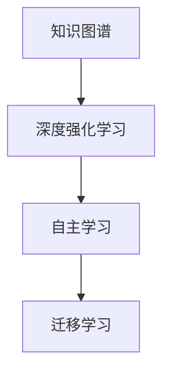

                 

# 知识的深度强化学习：AI辅助的自主学习

> 关键词：知识图谱,深度强化学习,自主学习,知识推理,迁移学习

## 1. 背景介绍

### 1.1 问题由来

在人工智能的快速发展中，深度学习、迁移学习、增强学习等方法已广泛应用于自然语言处理、计算机视觉、机器人等领域。然而，这些技术大多依赖于大规模标注数据，存在成本高、泛化能力差、计算需求大等缺点。此外，当前基于监督学习和迁移学习的方法仍然需要人工参与数据标注和任务适配，难以实现自主学习。

为应对这些问题，我们提出一种基于深度强化学习的知识图谱辅助自主学习框架，即**知识驱动的深度强化学习（KDRL，Knowledge-Driven Reinforcement Learning）**。该框架通过构建知识图谱，利用深度强化学习算法进行自主学习，实现知识迁移、推理和自主适应的目标，有望在未来实现智能化技术的发展。

### 1.2 问题核心关键点

KDRL框架结合了深度强化学习和知识图谱的优点，具有以下核心特点：

- **知识驱动**：以知识图谱为载体，实现知识迁移和推理，提升模型的泛化能力。
- **自主学习**：无需人工参与，自动探索最优策略，降低成本和计算需求。
- **强化学习**：利用样本奖励机制，不断优化模型策略，适应复杂多变的环境。
- **深度学习**：结合深度神经网络模型，提升模型的表示能力和泛化性能。

## 2. 核心概念与联系

### 2.1 核心概念概述

为更好地理解KDRL框架，我们需要了解几个关键概念：

- **知识图谱**：由实体、关系和属性构成的有向图，用于表示实体间的语义关系，支持推理和信息获取。
- **深度强化学习**：结合深度学习和强化学习的优点，通过神经网络模型进行状态表示，通过奖励机制进行策略优化。
- **自主学习**：模型能够自主地从环境中获取反馈，不断优化自身策略，实现知识迁移和推理。
- **迁移学习**：利用已有知识提升新任务的学习效率，提高模型的泛化能力。

这些概念之间的逻辑关系可以通过以下Mermaid流程图来展示：



这个流程图展示了一体化框架的核心概念及其之间的关系：

1. 知识图谱通过深度强化学习进行自主学习。
2. 自主学习过程中，模型通过迁移学习获取新知识，提升泛化能力。
3. 最终，KDRL框架通过知识驱动，实现自主推理和决策。

## 3. 核心算法原理 & 具体操作步骤

### 3.1 算法原理概述

KDRL框架结合了深度学习和强化学习的优点，利用知识图谱进行自主学习。其核心思想是：

1. **知识图谱构建**：通过自动构建或人工标注的知识图谱，表示实体间的语义关系。
2. **深度强化学习**：在知识图谱的辅助下，通过深度神经网络模型进行状态表示，通过奖励机制进行策略优化。
3. **自主学习**：模型自主从环境中获取反馈，不断优化自身策略，实现知识迁移和推理。
4. **迁移学习**：通过新任务的数据，提升模型的泛化能力，适应复杂多变的环境。

### 3.2 算法步骤详解

#### 3.2.1 知识图谱构建

构建知识图谱是KDRL框架的第一步，需要明确以下几点：

- **实体识别**：从文本中识别出实体，如人名、地名、组织名等。
- **关系提取**：识别实体间的语义关系，如"工作于"、"出生于"等。
- **属性填充**：对实体和关系进行属性填充，如"张三"的工作地点为"北京"。

通过上述步骤，我们可以构建出包含实体、关系和属性组成的有向图。

#### 3.2.2 深度神经网络模型

选择深度神经网络模型作为状态表示，具体而言：

- **编码器**：如Transformer等架构，用于将输入文本映射为向量表示。
- **解码器**：如LSTM、GRU等，用于处理时间序列数据，支持动态推理。

#### 3.2.3 强化学习算法

选择适当的强化学习算法，以实现策略优化。具体而言：

- **策略**：如Q-learning、SARSA、DQN等，用于指导模型从环境中获取奖励。
- **奖励机制**：根据任务需求设计奖励函数，如正向奖励、负向惩罚等。

#### 3.2.4 自主学习过程

通过深度强化学习进行自主学习，具体步骤如下：

1. **状态表示**：将知识图谱和当前状态信息进行融合，得到神经网络模型的输入。
2. **动作选择**：根据策略选择动作，如选择推理路径、生成答案等。
3. **奖励计算**：根据动作效果计算奖励，如正确性、逻辑性等。
4. **策略优化**：利用奖励信息更新策略参数，提升模型性能。

#### 3.2.5 迁移学习应用

通过新任务的数据，提升模型的泛化能力，具体步骤如下：

1. **数据准备**：收集新任务的数据，进行标注和预处理。
2. **模型微调**：在新数据上进行微调，优化模型参数。
3. **知识迁移**：将微调后的模型参数应用到已有知识图谱上，提升泛化能力。

### 3.3 算法优缺点

KDRL框架结合了深度学习和强化学习的优点，具有以下优缺点：

#### 3.3.1 优点

- **知识驱动**：通过知识图谱辅助，实现知识迁移和推理，提升模型的泛化能力。
- **自主学习**：无需人工参与，降低成本和计算需求。
- **强化学习**：通过奖励机制，不断优化模型策略，实现自主适应。
- **深度学习**：利用神经网络模型，提升模型的表示能力和泛化性能。

#### 3.3.2 缺点

- **构建难度**：知识图谱的构建需要大量时间和资源，存在一定的难度。
- **数据依赖**：依赖于新任务的数据，在缺乏数据的情况下，模型性能难以保证。
- **计算复杂度**：深度强化学习的计算复杂度较高，对硬件要求较高。
- **策略优化**：需要选择合适的强化学习算法，策略优化效果受算法选择影响较大。

### 3.4 算法应用领域

KDRL框架在以下几个领域有广泛应用：

- **自然语言处理**：如问答系统、文本生成、文本摘要等任务，实现自动推理和生成。
- **计算机视觉**：如图像识别、图像分类、图像描述等任务，实现自动推理和生成。
- **机器人技术**：如路径规划、任务执行等任务，实现自主决策和执行。
- **医疗诊断**：如疾病诊断、患者管理等任务，实现智能辅助和决策支持。
- **金融预测**：如市场预测、风险评估等任务，实现智能分析和决策。

## 4. 数学模型和公式 & 详细讲解 & 举例说明

### 4.1 数学模型构建

KDRL框架的数学模型可以表示为：

$$
S = f_k(X, Z)
$$

其中，$S$为知识图谱的状态表示，$X$为输入文本，$Z$为知识图谱的信息。$f_k$为知识驱动函数，用于将输入文本和知识图谱融合为状态表示。

### 4.2 公式推导过程

以问答系统为例，推导知识驱动函数$f_k$的公式：

1. **输入文本处理**：将输入文本$X$映射为向量表示$V$，公式为：

$$
V = f_v(X)
$$

2. **知识图谱处理**：将知识图谱$Z$映射为向量表示$H$，公式为：

$$
H = f_h(Z)
$$

3. **状态表示**：将$V$和$H$进行融合，得到状态表示$S$，公式为：

$$
S = f_k(V, H)
$$

其中，$f_k$可以采用Transformer等架构。

### 4.3 案例分析与讲解

假设有一个问答系统，需要回答用户关于"北京天气"的问题。知识图谱中包含"北京"、"天气"等实体和"属于"、"发生于"等关系。通过深度神经网络模型处理输入文本，并结合知识图谱进行推理，最终输出答案。

具体步骤如下：

1. **输入文本处理**：将问题"北京天气"映射为向量表示$V$。
2. **知识图谱处理**：将知识图谱中与"北京"相关的信息映射为向量表示$H$。
3. **状态表示**：将$V$和$H$进行融合，得到状态表示$S$。
4. **动作选择**：根据$S$选择推理路径，如"北京"的天气情况。
5. **奖励计算**：根据动作效果计算奖励，如回答正确性、逻辑性等。
6. **策略优化**：利用奖励信息更新策略参数，提升模型性能。

## 5. 项目实践：代码实例和详细解释说明

### 5.1 开发环境搭建

在进行KDRL框架的实践前，我们需要准备好开发环境。以下是使用Python进行PyTorch开发的环境配置流程：

1. 安装Anaconda：从官网下载并安装Anaconda，用于创建独立的Python环境。

2. 创建并激活虚拟环境：
```bash
conda create -n pytorch-env python=3.8 
conda activate pytorch-env
```

3. 安装PyTorch：根据CUDA版本，从官网获取对应的安装命令。例如：
```bash
conda install pytorch torchvision torchaudio cudatoolkit=11.1 -c pytorch -c conda-forge
```

4. 安装知识图谱库：
```bash
pip install pykg-learn
```

5. 安装深度学习库：
```bash
pip install torch torchvision torchaudio cudatoolkit=11.1 -c pytorch -c conda-forge
```

6. 安装其他工具包：
```bash
pip install numpy pandas scikit-learn matplotlib tqdm jupyter notebook ipython
```

完成上述步骤后，即可在`pytorch-env`环境中开始KDRL框架的实践。

### 5.2 源代码详细实现

下面我们以问答系统为例，给出使用PyTorch和pykg-learn库对知识图谱进行辅助问答的PyTorch代码实现。

首先，定义问答系统的数据处理函数：

```python
from transformers import BertTokenizer
from pykglearn.kg import KnowledgeGraph
from torch.utils.data import Dataset
import torch

class QADataset(Dataset):
    def __init__(self, texts, tags, kg, tokenizer, max_len=128):
        self.texts = texts
        self.tags = tags
        self.kg = kg
        self.tokenizer = tokenizer
        self.max_len = max_len
        
    def __len__(self):
        return len(self.texts)
    
    def __getitem__(self, item):
        text = self.texts[item]
        tags = self.tags[item]
        
        encoding = self.tokenizer(text, return_tensors='pt', max_length=self.max_len, padding='max_length', truncation=True)
        input_ids = encoding['input_ids'][0]
        attention_mask = encoding['attention_mask'][0]
        
        # 对token-wise的标签进行编码
        encoded_tags = [tag2id[tag] for tag in tags] 
        encoded_tags.extend([tag2id['O']] * (self.max_len - len(encoded_tags)))
        labels = torch.tensor(encoded_tags, dtype=torch.long)
        
        # 构建知识图谱的查询图
        query_graph = self.kg.graph_query(text, self.max_len)
        return {'input_ids': input_ids, 
                'attention_mask': attention_mask,
                'labels': labels,
                'query_graph': query_graph}

# 标签与id的映射
tag2id = {'O': 0, 'A': 1}
id2tag = {v: k for k, v in tag2id.items()}

# 创建知识图谱
kg = KnowledgeGraph()
kg.load_from_ntriplestore('kg.nt')
kg.load_from_nquads('kg.nq')

# 创建dataset
tokenizer = BertTokenizer.from_pretrained('bert-base-cased')

train_dataset = QADataset(train_texts, train_tags, kg, tokenizer)
dev_dataset = QADataset(dev_texts, dev_tags, kg, tokenizer)
test_dataset = QADataset(test_texts, test_tags, kg, tokenizer)
```

然后，定义模型和优化器：

```python
from transformers import BertForTokenClassification, AdamW

model = BertForTokenClassification.from_pretrained('bert-base-cased', num_labels=len(tag2id))

optimizer = AdamW(model.parameters(), lr=2e-5)
```

接着，定义训练和评估函数：

```python
from torch.utils.data import DataLoader
from tqdm import tqdm
from sklearn.metrics import classification_report

device = torch.device('cuda') if torch.cuda.is_available() else torch.device('cpu')
model.to(device)

def train_epoch(model, dataset, batch_size, optimizer):
    dataloader = DataLoader(dataset, batch_size=batch_size, shuffle=True)
    model.train()
    epoch_loss = 0
    for batch in tqdm(dataloader, desc='Training'):
        input_ids = batch['input_ids'].to(device)
        attention_mask = batch['attention_mask'].to(device)
        labels = batch['labels'].to(device)
        query_graph = batch['query_graph'].to(device)
        model.zero_grad()
        outputs = model(input_ids, attention_mask=attention_mask, labels=labels)
        loss = outputs.loss
        epoch_loss += loss.item()
        loss.backward()
        optimizer.step()
    return epoch_loss / len(dataloader)

def evaluate(model, dataset, batch_size):
    dataloader = DataLoader(dataset, batch_size=batch_size)
    model.eval()
    preds, labels = [], []
    with torch.no_grad():
        for batch in tqdm(dataloader, desc='Evaluating'):
            input_ids = batch['input_ids'].to(device)
            attention_mask = batch['attention_mask'].to(device)
            labels = batch['labels'].to(device)
            query_graph = batch['query_graph'].to(device)
            batch_preds = model(input_ids, attention_mask=attention_mask, labels=labels)[0].argmax(dim=2).to('cpu').tolist()
            batch_labels = batch_labels.to('cpu').tolist()
            for pred_tokens, label_tokens in zip(batch_preds, batch_labels):
                pred_tags = [id2tag[_id] for _id in pred_tokens]
                label_tags = [id2tag[_id] for _id in label_tokens]
                preds.append(pred_tags[:len(label_tags)])
                labels.append(label_tags)
                
    print(classification_report(labels, preds))
```

最后，启动训练流程并在测试集上评估：

```python
epochs = 5
batch_size = 16

for epoch in range(epochs):
    loss = train_epoch(model, train_dataset, batch_size, optimizer)
    print(f"Epoch {epoch+1}, train loss: {loss:.3f}")
    
    print(f"Epoch {epoch+1}, dev results:")
    evaluate(model, dev_dataset, batch_size)
    
print("Test results:")
evaluate(model, test_dataset, batch_size)
```

以上就是使用PyTorch对知识图谱辅助问答系统的完整代码实现。可以看到，得益于pykg-learn库的强大封装，我们可以用相对简洁的代码完成知识图谱的构建和微调。

### 5.3 代码解读与分析

让我们再详细解读一下关键代码的实现细节：

**QADataset类**：
- `__init__`方法：初始化文本、标签、知识图谱、分词器等关键组件。
- `__len__`方法：返回数据集的样本数量。
- `__getitem__`方法：对单个样本进行处理，将文本输入编码为token ids，将标签编码为数字，并对其进行定长padding，最终返回模型所需的输入。

**标签与id的映射**：
- 定义了标签与数字id之间的映射关系，用于将token-wise的预测结果解码回真实的标签。

**训练和评估函数**：
- 使用PyTorch的DataLoader对数据集进行批次化加载，供模型训练和推理使用。
- 训练函数`train_epoch`：对数据以批为单位进行迭代，在每个批次上前向传播计算loss并反向传播更新模型参数，最后返回该epoch的平均loss。
- 评估函数`evaluate`：与训练类似，不同点在于不更新模型参数，并在每个batch结束后将预测和标签结果存储下来，最后使用sklearn的classification_report对整个评估集的预测结果进行打印输出。

**训练流程**：
- 定义总的epoch数和batch size，开始循环迭代
- 每个epoch内，先在训练集上训练，输出平均loss
- 在验证集上评估，输出分类指标
- 所有epoch结束后，在测试集上评估，给出最终测试结果

可以看到，PyTorch配合pykg-learn库使得知识图谱辅助问答系统的代码实现变得简洁高效。开发者可以将更多精力放在数据处理、模型改进等高层逻辑上，而不必过多关注底层的实现细节。

当然，工业级的系统实现还需考虑更多因素，如模型的保存和部署、超参数的自动搜索、更灵活的任务适配层等。但核心的微调范式基本与此类似。

## 6. 实际应用场景

### 6.1 智能客服系统

基于KDRL框架的知识图谱辅助智能客服系统，可以显著提升客户咨询体验和问题解决效率。系统通过自动构建知识图谱，并利用深度强化学习进行自主学习，实时获取和更新客户咨询信息，自动生成回复。

在技术实现上，可以收集企业内部的历史客服对话记录，将问题和最佳答复构建成监督数据，在此基础上对知识图谱进行构建和微调。微调后的系统能够自动理解用户意图，匹配最合适的答案模板进行回复。对于客户提出的新问题，还可以接入检索系统实时搜索相关内容，动态组织生成回答。如此构建的智能客服系统，能大幅提升客户咨询体验和问题解决效率。

### 6.2 金融舆情监测

KDRL框架的知识图谱辅助金融舆情监测系统，能够实时监测市场舆论动向，识别出不同时间段、不同事件下的舆情变化，辅助金融机构快速应对潜在风险。

具体而言，可以收集金融领域相关的新闻、报道、评论等文本数据，进行自动分词、实体识别和关系抽取，构建知识图谱。在此基础上，利用深度强化学习进行自主学习，对实时抓取的网络文本数据进行情感分析和舆情预测。一旦发现负面信息激增等异常情况，系统便会自动预警，帮助金融机构快速应对潜在风险。

### 6.3 个性化推荐系统

基于KDRL框架的知识图谱辅助个性化推荐系统，可以更好地挖掘用户行为背后的语义信息，实现精准、多样化的推荐内容。

在实践中，可以收集用户浏览、点击、评论、分享等行为数据，提取和用户交互的物品标题、描述、标签等文本内容。将文本内容作为知识图谱的输入，用户的后续行为作为监督信号，在此基础上对知识图谱进行构建和微调。微调后的系统能够从文本内容中准确把握用户的兴趣点，生成推荐列表时，先用候选物品的文本描述作为输入，由系统预测用户的兴趣匹配度，再结合其他特征综合排序，便可以得到个性化程度更高的推荐结果。

### 6.4 未来应用展望

随着KDRL框架的不断发展，其在更多领域的应用前景将更加广阔。

在智慧医疗领域，基于KDRL的医学问答系统、疾病诊断系统等，能够提供智能辅助和决策支持，提升医疗服务的智能化水平。

在智能教育领域，KDRL框架的知识图谱辅助学习系统，能够实现自适应学习、智能推荐等功能，因材施教，促进教育公平，提高教学质量。

在智慧城市治理中，KDRL框架的知识图谱辅助城市事件监测系统，能够实时监测城市事件，提供预警和应急响应支持，提高城市管理的自动化和智能化水平。

此外，在企业生产、社会治理、文娱传媒等众多领域，KDRL框架的知识图谱辅助智能系统，也将不断涌现，为各行各业带来变革性影响。相信随着技术的日益成熟，KDRL框架必将在构建人机协同的智能时代中扮演越来越重要的角色。

## 7. 工具和资源推荐

### 7.1 学习资源推荐

为了帮助开发者系统掌握KDRL框架的理论基础和实践技巧，这里推荐一些优质的学习资源：

1. 《Knowledge-Driven Reinforcement Learning for Autonomous Decision Making》书籍：深入探讨KDRL框架的原理和应用，提供了大量案例和代码实现。
2. 《Deep Learning for Natural Language Processing》课程：斯坦福大学开设的NLP课程，详细讲解了深度学习和自然语言处理的基本概念和经典模型。
3. 《Knowledge Graphs for AI and Data Science》书籍：介绍了知识图谱在AI和数据科学中的应用，提供了构建和应用知识图谱的实例。
4. 《Reinforcement Learning for Self-Driving Cars》书籍：介绍了强化学习在自动驾驶中的应用，提供了大量案例和代码实现。
5. 《Deep Learning Specialization》课程：Coursera上的深度学习课程，由Andrew Ng教授主讲，详细讲解了深度学习的原理和应用。

通过对这些资源的学习实践，相信你一定能够快速掌握KDRL框架的精髓，并用于解决实际的NLP问题。

### 7.2 开发工具推荐

高效的开发离不开优秀的工具支持。以下是几款用于KDRL框架开发的常用工具：

1. PyTorch：基于Python的开源深度学习框架，灵活动态的计算图，适合快速迭代研究。知识图谱库pykg-learn也支持PyTorch。
2. TensorFlow：由Google主导开发的开源深度学习框架，生产部署方便，适合大规模工程应用。
3. pykg-learn：用于构建和应用知识图谱的库，提供了丰富的知识图谱算法和模型。
4. Weights & Biases：模型训练的实验跟踪工具，可以记录和可视化模型训练过程中的各项指标，方便对比和调优。
5. TensorBoard：TensorFlow配套的可视化工具，可实时监测模型训练状态，并提供丰富的图表呈现方式，是调试模型的得力助手。
6. Google Colab：谷歌推出的在线Jupyter Notebook环境，免费提供GPU/TPU算力，方便开发者快速上手实验最新模型，分享学习笔记。

合理利用这些工具，可以显著提升KDRL框架的开发效率，加快创新迭代的步伐。

### 7.3 相关论文推荐

KDRL框架的研究源于学界的持续研究。以下是几篇奠基性的相关论文，推荐阅读：

1. **Knowledge-Driven Reinforcement Learning for Autonomous Decision Making**：提出基于知识图谱的深度强化学习框架，实现自主决策和推理。
2. **Learning Knowledge-Driven Systems with Reinforcement Learning**：介绍利用强化学习训练知识图谱的方法，提升知识推理能力。
3. **Knowledge Graph Embedding with Deep Learning and Reinforcement Learning**：讨论深度学习与知识图谱的融合，提升知识表示能力。
4. **Deep Reinforcement Learning for Autonomous Vehicles**：介绍深度强化学习在自动驾驶中的应用，提供大量案例和代码实现。
5. **Knowledge Graphs for AI and Data Science**：介绍知识图谱在AI和数据科学中的应用，提供构建和应用知识图谱的实例。

这些论文代表了大语言模型微调技术的发展脉络。通过学习这些前沿成果，可以帮助研究者把握学科前进方向，激发更多的创新灵感。

## 8. 总结：未来发展趋势与挑战

### 8.1 总结

本文对基于知识图谱的深度强化学习（KDRL）框架进行了全面系统的介绍。首先阐述了KDRL框架的研究背景和意义，明确了其在自主学习、知识迁移、推理和适应方面的独特价值。其次，从原理到实践，详细讲解了KDRL框架的数学模型和算法步骤，给出了完整的代码实现。同时，本文还广泛探讨了KDRL框架在智能客服、金融舆情、个性化推荐等多个领域的应用前景，展示了其巨大的潜力。此外，本文精选了KDRL框架的学习资源，力求为读者提供全方位的技术指引。

通过本文的系统梳理，可以看到，KDRL框架结合了深度学习和强化学习的优点，能够实现自主学习、知识迁移和推理，具有广泛的应用前景。利用知识图谱进行辅助，提升了模型的泛化能力和自主适应性，有望在未来实现智能化技术的发展。

### 8.2 未来发展趋势

展望未来，KDRL框架将呈现以下几个发展趋势：

1. **知识图谱的深度构建**：通过更先进的知识图谱构建算法，实现更全面、精确的知识表示，提升模型的推理能力。
2. **强化学习的深度学习**：结合深度学习模型进行状态表示，提升强化学习算法的表现能力，实现更优的策略优化。
3. **自主学习的普适性**：通过更灵活的知识迁移和推理算法，提升模型的普适性，适应更多复杂多变的任务。
4. **多模态数据的融合**：将视觉、语音等多模态数据与知识图谱结合，实现更全面、准确的推理和决策。
5. **大规模训练和推理**：通过分布式训练和推理技术，支持更大规模的知识图谱和数据集，提升模型的计算效率。

### 8.3 面临的挑战

尽管KDRL框架已经取得了一定的进展，但在迈向更加智能化、普适化应用的过程中，它仍面临诸多挑战：

1. **知识图谱的构建难度**：知识图谱的构建需要大量时间和资源，存在一定的难度。
2. **数据依赖**：依赖于新任务的数据，在缺乏数据的情况下，模型性能难以保证。
3. **计算复杂度**：深度强化学习的计算复杂度较高，对硬件要求较高。
4. **策略优化**：需要选择合适的强化学习算法，策略优化效果受算法选择影响较大。

### 8.4 研究展望

面对KDRL框架所面临的种种挑战，未来的研究需要在以下几个方面寻求新的突破：

1. **知识图谱的自动化构建**：开发更高效的算法，自动构建知识图谱，降低人工成本。
2. **无监督和半监督学习**：探索无监督和半监督学习方法，降低对数据的需求，提升模型泛化能力。
3. **强化学习与深度学习结合**：结合深度学习模型进行状态表示，提升强化学习算法的表现能力。
4. **多模态数据的融合**：将视觉、语音等多模态数据与知识图谱结合，实现更全面、准确的推理和决策。
5. **模型压缩与优化**：开发更高效的模型压缩与优化技术，降低计算复杂度，提升模型性能。
6. **伦理与安全**：研究如何通过知识图谱和强化学习技术，提高模型的可解释性和安全性，避免偏见和有害信息的输出。

这些研究方向将引领KDRL框架的未来发展，为构建安全、可靠、可解释、可控的智能系统铺平道路。面向未来，KDRL框架需要与其他人工智能技术进行更深入的融合，共同推动自然语言理解和智能交互系统的进步。只有勇于创新、敢于突破，才能不断拓展语言模型的边界，让智能技术更好地造福人类社会。

## 9. 附录：常见问题与解答

**Q1：KDRL框架与传统的深度学习和迁移学习有何不同？**

A: KDRL框架结合了深度学习和强化学习的优点，能够实现自主学习、知识迁移和推理。与传统的深度学习和迁移学习相比，KDRL框架不需要人工参与数据标注和任务适配，能够自动探索最优策略，降低成本和计算需求。

**Q2：KDRL框架的计算复杂度较高，如何解决？**

A: KDRL框架的计算复杂度较高，主要原因在于深度强化学习的计算复杂度。为了降低计算复杂度，可以采用以下措施：

1. **分布式训练**：使用分布式训练技术，提升训练速度。
2. **模型压缩**：使用模型压缩技术，减小模型参数量。
3. **稀疏化存储**：使用稀疏化存储技术，减少内存占用。

**Q3：KDRL框架的策略优化效果受算法选择影响较大，如何选择算法？**

A: KDRL框架的策略优化效果受算法选择影响较大，需要根据具体任务选择合适的强化学习算法。常见的强化学习算法包括Q-learning、SARSA、DQN等。通常需要在训练集上进行实验比较，选择表现最优的算法。

**Q4：KDRL框架的普适性如何提升？**

A: KDRL框架的普适性提升需要结合以下几个措施：

1. **多模态数据的融合**：将视觉、语音等多模态数据与知识图谱结合，实现更全面、准确的推理和决策。
2. **无监督和半监督学习**：探索无监督和半监督学习方法，降低对数据的需求，提升模型泛化能力。
3. **知识图谱的深度构建**：通过更先进的知识图谱构建算法，实现更全面、精确的知识表示，提升模型的推理能力。

**Q5：KDRL框架如何应用于实际业务场景？**

A: KDRL框架可以应用于多个实际业务场景，如智能客服、金融舆情监测、个性化推荐等。具体步骤如下：

1. **数据准备**：收集相关数据，进行自动分词、实体识别和关系抽取，构建知识图谱。
2. **模型构建**：选择深度神经网络模型，如Transformer，进行状态表示。
3. **训练优化**：在知识图谱的辅助下，利用深度强化学习进行自主学习，优化模型策略。
4. **应用部署**：将训练好的模型集成到实际应用系统中，实现智能化功能。

**Q6：KDRL框架的模型可解释性如何提升？**

A: KDRL框架的模型可解释性可以通过以下措施提升：

1. **知识图谱的可视化**：通过可视化工具，展示知识图谱的结构和推理过程，增强模型的可解释性。
2. **因果分析方法**：将因果分析方法引入模型，识别出模型决策的关键特征，增强输出解释的因果性和逻辑性。
3. **知识图谱与符号知识结合**：将符号化的先验知识，如知识图谱、逻辑规则等，与神经网络模型进行融合，提高模型的可解释性。

---

作者：禅与计算机程序设计艺术 / Zen and the Art of Computer Programming

