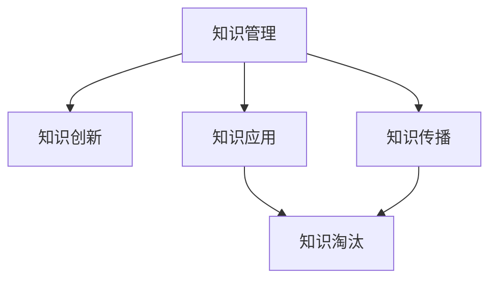

                 

# 知识的生命周期：从创造到过时的动态过程

## 1. 背景介绍

### 1.1 问题由来
在知识驱动的社会中，数据的获取和利用成为推动科技进步和经济发展的重要力量。然而，随着知识的增长和传播速度的加快，知识迅速过时的现象日益严重。如何在知识创造、传播、应用和淘汰的动态过程中，合理利用和管理知识，成为现代信息技术研究的重要课题。本文聚焦于知识管理的全生命周期，探讨从知识创造到过时的动态过程，分析其背后的技术和理念，并提供实际应用建议。

### 1.2 问题核心关键点
知识管理的全生命周期包括知识创造、知识传播、知识应用和知识淘汰四个阶段。每个阶段都有其独特的挑战和需求，需要相应的技术和工具进行支撑。本文将从知识创造的创新和知识传播的扩散两个角度出发，探讨如何通过技术手段提高知识的创造和传播效率，并通过分析知识应用和淘汰的过程，提出解决知识过时问题的策略。

## 2. 核心概念与联系

### 2.1 核心概念概述

为了更好地理解知识管理的全生命周期，本节将介绍几个密切相关的核心概念：

- 知识管理(Knowledge Management, KM)：指通过计划、组织、捕获、存储、传播、更新、应用和评估知识，支持组织目标实现的过程。知识管理强调知识的生命周期管理，涉及知识的获取、组织、共享和应用等各个环节。

- 知识创新(Knowledge Innovation)：指通过创新活动，如研发、设计、艺术创作等，产生新的知识形态。知识创新是知识管理中的核心环节，是推动知识不断发展和更新的动力。

- 知识传播(Knowledge Dissemination)：指将知识从创造者传播给使用者，通过出版、教育、网络等渠道实现。有效的知识传播能够加速知识的扩散，扩大知识的影响力。

- 知识应用(Knowledge Application)：指将知识应用于实际问题解决、技术改进、产品开发等场景中，实现知识的价值。知识应用是知识管理的最终目的，衡量知识管理效果的直接指标。

- 知识淘汰(Knowledge Obsolescence)：指因技术进步、市场变化、知识更新等原因，部分旧知识不再适用，被新知识所取代。知识淘汰是知识管理中不可避免的过程，需要科学管理和评估。

这些核心概念之间的逻辑关系可以通过以下Mermaid流程图来展示：



这个流程图展示了几大核心概念之间的相互关系：

1. 知识创新是知识管理的源泉，通过不断产生新知识，支持知识管理活动的持续进行。
2. 知识传播是知识管理的关键环节，通过多种渠道传递新知识，实现知识从创造者到使用者的转移。
3. 知识应用是知识管理的最终目标，通过应用知识解决实际问题，实现知识管理的价值。
4. 知识淘汰是知识管理的必然环节，旧知识被新知识取代，推动知识不断更新。

这些概念共同构成了知识管理的生命周期框架，通过理解这些核心概念，我们可以更好地把握知识管理的技术和管理路径。

## 3. 核心算法原理 & 具体操作步骤
### 3.1 算法原理概述

知识管理的全生命周期可以分为知识创新、知识传播、知识应用和知识淘汰四个主要阶段。以下是每个阶段的核心算法原理及其具体操作步骤的详细描述。

### 3.2 算法步骤详解

#### 3.2.1 知识创新
知识创新是知识管理的首要环节，涉及知识的创造和组织。该过程主要包括以下几个步骤：

1. **创意生成**：通过头脑风暴、专家讨论、问卷调查等手段，生成新的知识创意。创意生成可以采用多学科团队协作、开放式创新等方法。

2. **原型设计**：对生成的知识创意进行初步验证，构建原型。原型设计可以借助设计思维、快速原型开发等技术。

3. **测试与验证**：对原型进行小规模测试，验证其可行性和效果。测试与验证可以采用A/B测试、实验设计等方法。

4. **知识化**：将测试通过的原型转化为正式知识。知识化可以采用结构化编码、知识图谱等技术手段。

#### 3.2.2 知识传播
知识传播是知识管理的第二个关键环节，涉及知识的传播和扩散。该过程主要包括以下几个步骤：

1. **选择合适的传播渠道**：根据知识的特点和目标受众的需求，选择合适的传播渠道，如出版物、网络平台、教育机构等。

2. **制定传播策略**：制定科学的传播策略，包括内容策划、宣传推广、受众分析等，确保知识传播的效率和效果。

3. **知识分享与互动**：通过社交媒体、论坛、研讨会等形式，促进知识的分享和互动，建立知识社区。

4. **传播效果评估**：定期评估知识传播的效果，收集反馈信息，不断优化传播策略。

#### 3.2.3 知识应用
知识应用是知识管理的核心环节，涉及知识的实际应用。该过程主要包括以下几个步骤：

1. **需求分析**：分析实际问题需求，确定知识应用的方向和目标。

2. **知识匹配与整合**：从知识库中选择合适的知识，进行匹配和整合，构建解决方案。

3. **知识实施与优化**：将知识应用于实际问题解决，进行持续优化和改进。

4. **效果评估**：对知识应用的效果进行评估，收集反馈信息，不断提升知识应用质量。

#### 3.2.4 知识淘汰
知识淘汰是知识管理的必然环节，涉及旧知识的更新和替换。该过程主要包括以下几个步骤：

1. **知识评估**：对现有知识进行评估，识别出过时或失效的知识。

2. **知识更新与替换**：对评估出的旧知识进行更新或替换，引入新知识。

3. **知识存档与复用**：对更新后的知识进行存档，保留其历史价值，为未来知识应用提供参考。

4. **知识淘汰决策**：根据评估结果和业务需求，决定知识淘汰的优先级和时间表。

### 3.3 算法优缺点

知识管理的全生命周期管理方法具有以下优点：

1. **全面覆盖知识管理过程**：通过系统的知识管理方法，覆盖知识从创造到淘汰的全生命周期，确保知识管理的系统性和全面性。

2. **提高知识应用效率**：通过科学的知识匹配和优化，提升知识在实际问题解决中的应用效果。

3. **减少知识过时风险**：通过持续的知识评估和更新，降低旧知识在新环境下的过时风险。

4. **促进知识创新**：通过知识的传播和互动，促进知识的共享和创新，加速新知识的产生。

但该方法也存在一些局限性：

1. **复杂度高**：知识管理的全生命周期涉及多个环节和步骤，管理复杂度较高，需要投入大量的人力和资源。

2. **灵活性不足**：知识管理的流程和方法较为固定，可能无法适应快速变化的环境和需求。

3. **依赖数据质量**：知识管理的各个环节依赖高质量的数据输入，数据质量直接影响知识管理的效率和效果。

4. **效果评估困难**：知识应用的评估和效果的量化存在一定难度，需要通过多种指标进行综合衡量。

### 3.4 算法应用领域

知识管理的全生命周期管理方法在多个领域中得到了广泛应用，例如：

- 科技公司：通过知识管理提高研发效率，加速产品创新和新技术的推广。

- 教育机构：通过知识管理优化教学过程，提升教学质量和效果。

- 医疗机构：通过知识管理优化诊疗流程，提高医疗服务质量和效率。

- 政府和企业：通过知识管理优化决策过程，提升管理效率和决策质量。

以上领域中，知识管理的全生命周期管理方法已经展现出强大的应用潜力和价值。随着知识驱动的社会不断发展，知识管理方法将在更多行业和场景中得到推广和应用。

## 4. 数学模型和公式 & 详细讲解 & 举例说明

### 4.1 数学模型构建

知识管理的全生命周期管理可以通过数学模型进行建模和分析。以下是一个简单的知识传播模型，用于描述知识从创新到应用的传播过程。

设 $K$ 为知识总量，$C$ 为创新速率，$D$ 为传播速率，$A$ 为应用速率，$E$ 为淘汰速率。则知识传播模型的微分方程为：

$$
\frac{dK}{dt} = C - D \cdot K - A \cdot K + E \cdot K
$$

其中 $C$ 和 $E$ 为常数，$D$ 和 $A$ 随时间变化。

### 4.2 公式推导过程

对上述微分方程进行求解，得到知识总量 $K$ 随时间 $t$ 的变化方程：

$$
K(t) = \frac{C}{D - A} \left( e^{Dt} - e^{-A \cdot \int_0^t e^{-A\tau} d\tau} \right)
$$

该方程反映了知识传播的全生命周期过程，其中 $e^{Dt}$ 表示知识传播的累积效果，$e^{-A \cdot \int_0^t e^{-A\tau} d\tau}$ 表示知识应用的累积效果，$e^{E \cdot t}$ 表示知识淘汰的累积效果。

### 4.3 案例分析与讲解

以下是一个简单的案例分析，展示知识传播模型的应用场景。

假设某科技公司每年能生成新的知识 10 项，知识传播速率为 0.5，知识应用速率为 0.2，知识淘汰速率为 0.1。公司希望在 3 年内将知识总量提升到 200。根据上述模型，可以计算出在 3 年末的知识总量：

$$
K(3) = \frac{10}{0.5 - 0.2} \left( e^{0.5 \cdot 3} - e^{-0.2 \cdot 3} \right) \approx 198
$$

这意味着在 3 年末，公司的知识总量能够达到 198 项，基本实现了目标。

## 5. 项目实践：代码实例和详细解释说明

### 5.1 开发环境搭建

在进行知识管理项目实践前，我们需要准备好开发环境。以下是使用Python进行知识传播模型开发的Python环境配置流程：

1. 安装Anaconda：从官网下载并安装Anaconda，用于创建独立的Python环境。

2. 创建并激活虚拟环境：
```bash
conda create -n knowledge-management python=3.8 
conda activate knowledge-management
```

3. 安装必要的库：
```bash
pip install numpy pandas sympy matplotlib scipy jupyter notebook ipython
```

完成上述步骤后，即可在`knowledge-management`环境中开始知识传播模型的开发。

### 5.2 源代码详细实现

下面我们以知识传播模型为例，给出使用Sympy库对知识传播过程进行建模的Python代码实现。

```python
from sympy import symbols, exp, integrate, solve, Eq

# 定义变量
K, C, D, A, E, t = symbols('K C D A E t')

# 知识传播模型的微分方程
diff_eq = Eq(K.diff(t), C - D * K - A * K + E * K)

# 求解微分方程
K_solution = solve(diff_eq, K)[0]

# 代入具体数值
C_val = 10  # 每年新增知识
D_val = 0.5  # 传播速率
A_val = 0.2  # 应用速率
E_val = 0.1  # 淘汰速率

# 计算3年后的知识总量
K_val = K_solution.subs({C: C_val, D: D_val, A: A_val, E: E_val, t: 3})
print(K_val)
```

这段代码实现了知识传播模型的数学建模和求解过程，可以用于分析知识传播的速度和效果。

### 5.3 代码解读与分析

让我们再详细解读一下关键代码的实现细节：

**定义变量**：
- `K`：知识总量
- `C`：每年新增知识量
- `D`：知识传播速率
- `A`：知识应用速率
- `E`：知识淘汰速率
- `t`：时间

**知识传播模型的微分方程**：
- `diff_eq`：定义知识传播的微分方程，其中 $C$、$D$、$A$、$E$ 为模型参数，$K$ 为时间依赖变量。

**求解微分方程**：
- `solve`：求解微分方程，得到知识总量 $K$ 的解析解。

**代入具体数值**：
- 根据具体问题，将 `C_val`、`D_val`、`A_val`、`E_val` 和 `t` 的数值代入解析解中，计算出 3 年末的知识总量。

**输出结果**：
- `print(K_val)`：输出计算结果，展示知识传播模型的应用效果。

可以看到，Python结合Sympy库，能够高效地进行数学建模和求解，为知识管理项目的实际应用提供了有力的支持。

## 6. 实际应用场景

### 6.1 智慧医疗系统

智慧医疗系统通过知识管理方法，可以优化诊疗流程，提升医疗服务质量和效率。知识管理方法可以应用于医学知识库的构建、疾病诊断、药物研发等多个环节。

具体而言，可以收集医学领域的相关文献、病例、实验室数据等知识资源，构建医学知识库。通过知识传播模型，分析知识在医疗实践中的应用效果，及时更新知识库，确保其时效性和准确性。在疾病诊断和药物研发过程中，知识管理方法可以辅助医生快速获取相关知识，优化诊断方案和药物设计。

### 6.2 教育技术平台

教育技术平台通过知识管理方法，可以优化教学过程，提升教学质量和效果。知识管理方法可以应用于在线课程、学习社区、评估系统等多个环节。

具体而言，可以收集教育领域的教学资源、科研成果、学生反馈等知识资源，构建教育知识库。通过知识传播模型，分析知识在教学实践中的应用效果，及时更新知识库，确保其适用性和有效性。在在线课程和评估系统中，知识管理方法可以辅助教师和学生快速获取相关知识，优化教学内容和评估方式。

### 6.3 智能制造系统

智能制造系统通过知识管理方法，可以优化生产流程，提升生产效率和质量。知识管理方法可以应用于设备维护、工艺改进、质量控制等多个环节。

具体而言，可以收集制造业的设备和工艺知识、质量控制标准、故障记录等知识资源，构建制造业知识库。通过知识传播模型，分析知识在生产实践中的应用效果，及时更新知识库，确保其适用性和有效性。在设备维护和工艺改进过程中，知识管理方法可以辅助工程师快速获取相关知识，优化维护方案和工艺设计。

### 6.4 未来应用展望

随着知识驱动的社会不断发展和进步，知识管理方法将在更多领域和场景中得到应用，为各行各业带来变革性影响。

在智慧城市领域，知识管理方法可以应用于城市规划、交通管理、环境监测等多个环节，推动城市管理和公共服务质量的提升。在文化创意领域，知识管理方法可以应用于内容创作、版权保护、版权交易等多个环节，推动文化产业的创新和转型。在农业领域，知识管理方法可以应用于种植技术、农产品质量控制、市场需求分析等多个环节，推动农业产业的现代化和智能化。

未来，随着知识管理技术的不断进步，知识管理方法将在更多领域和场景中得到推广和应用，为各行各业带来新的发展机遇。

## 7. 工具和资源推荐
### 7.1 学习资源推荐

为了帮助开发者系统掌握知识管理的全生命周期方法，这里推荐一些优质的学习资源：

1. 《知识管理与组织智慧》书籍：全面介绍了知识管理的理论基础和实践方法，适合从业者和研究者系统学习。

2. 《知识工程》课程：斯坦福大学开设的课程，涵盖知识工程的多个方面，包括知识获取、知识表示、知识推理等。

3. 《知识管理与信息检索》会议论文集：包含大量关于知识管理和信息检索的最新研究成果，适合深度学习研究者阅读。

4. Semantic Scholar：提供大量与知识管理相关的学术论文和研究成果，方便研究者快速获取最新进展。

5. KTNet：韩国知识技术平台，提供丰富的知识管理工具和资源，适合实践应用。

通过对这些资源的学习实践，相信你一定能够全面掌握知识管理的全生命周期方法，并应用于实际问题解决。

### 7.2 开发工具推荐

高效的开发离不开优秀的工具支持。以下是几款用于知识管理开发的常用工具：

1. Jupyter Notebook：开源的交互式笔记本环境，支持Python、R、MATLAB等多种语言，适合数据分析和建模。

2. GitHub：全球最大的代码托管平台，提供丰富的代码库和社区资源，适合版本控制和协作开发。

3. Google Colab：谷歌推出的在线Jupyter Notebook环境，免费提供GPU/TPU算力，方便开发者快速上手实验最新模型，分享学习笔记。

4. Semantic Scholar：基于知识的学术搜索引擎，提供丰富的学术资源和知识图谱，方便研究者快速获取相关文献和知识。

5. OpenIE：自然语言处理工具，支持从文本中提取结构化知识，适合知识抽取和整合。

合理利用这些工具，可以显著提升知识管理项目的开发效率，加快创新迭代的步伐。

### 7.3 相关论文推荐

知识管理的研究涉及多个领域，包括信息科学、计算机科学、管理学等。以下是几篇奠基性的相关论文，推荐阅读：

1. "A Framework for Building a Knowledge Management System" by E. Salber，A. Levin：提出了知识管理系统的框架，系统阐述了知识管理的基本原则和技术。

2. "Knowledge Management: An Evolutionary Framework for Organizational Knowledge Creation" by G. Magnusson：介绍了知识管理的演化框架，强调了知识创造和组织的重要性。

3. "Towards a Knowledge-Based Organization" by M. Davies，J. Goodwin：探讨了知识基础组织的构建方法，强调了知识共享和组织智慧的培养。

4. "Knowledge Acquisition, Organizing and Retrieving Systems (KARS)" by E. Briggs：介绍了知识管理系统KARS的设计和实现，展示了知识管理系统的具体应用。

5. "Knowledge Discovery in Databases" by G. Menolino：介绍了知识发现的方法和技术，强调了知识管理中的数据挖掘和知识挖掘。

这些论文代表了大规模知识管理的理论和技术发展脉络，通过学习这些前沿成果，可以帮助研究者把握学科前进方向，激发更多的创新灵感。

## 8. 总结：未来发展趋势与挑战

### 8.1 总结

本文对知识管理的全生命周期方法进行了全面系统的介绍。首先阐述了知识管理的四个主要阶段：知识创新、知识传播、知识应用和知识淘汰，明确了知识管理的重要性和意义。其次，从原理到实践，详细讲解了知识管理方法的数学模型和操作步骤，给出了知识传播模型的代码实现。同时，本文还广泛探讨了知识管理方法在智慧医疗、教育技术、智能制造等多个领域的应用前景，展示了知识管理方法的强大潜力。

通过本文的系统梳理，可以看到，知识管理方法在提升组织效率、推动知识创新和促进社会进步方面具有重要作用。未来，伴随知识管理技术的不断演进，知识管理方法将在更多领域和场景中得到应用，为人类社会的智能化转型提供新的动能。

### 8.2 未来发展趋势

展望未来，知识管理方法将呈现以下几个发展趋势：

1. **智能化和自动化**：随着人工智能技术的发展，知识管理方法将更加智能化和自动化，能够自动发现知识、传播知识、应用知识和淘汰知识。

2. **多模态融合**：知识管理方法将越来越多地融合多种信息模态，如文本、图像、视频等，支持更为丰富和复杂的信息处理。

3. **协作化和社交化**：知识管理方法将更加注重协作化和社交化，通过知识社区、知识图谱等技术，促进知识的共享和协作。

4. **标准化和互操作**：知识管理方法将逐步标准化和互操作化，支持不同组织和系统之间的知识共享和协作。

5. **实时化和动态化**：知识管理方法将更加实时化和动态化，能够实时捕捉知识变化和应用效果，快速响应外部环境的变化。

以上趋势凸显了知识管理方法的未来发展方向，这些方向的探索发展，必将推动知识管理方法在更多领域和场景中得到应用，为人类社会的智能化转型提供新的动能。

### 8.3 面临的挑战

尽管知识管理方法已经取得了一定的进展，但在迈向更加智能化和自动化应用的过程中，仍面临诸多挑战：

1. **数据多样性和复杂性**：知识管理方法依赖高质量的数据输入，但不同领域和场景中的数据类型和格式差异较大，数据整合和标准化难度较大。

2. **知识传播和应用的低效率**：知识传播和应用过程涉及多个环节，效率较低，需要进一步优化和自动化。

3. **知识管理的复杂性**：知识管理方法涉及多个环节和步骤，管理复杂度较高，需要投入大量的人力和资源。

4. **知识表示和推理的困难**：知识表示和推理是知识管理的重要基础，但目前仍存在一些技术瓶颈，需要进一步研究和突破。

5. **知识管理和伦理的冲突**：知识管理方法需要处理大量个人隐私和商业机密，如何在知识管理中保护隐私和知识产权，是一个亟待解决的问题。

6. **知识管理的安全性**：知识管理方法需要保证知识的安全性和完整性，防止知识泄露和篡改，需要构建完善的安全机制。

7. **知识管理的可解释性**：知识管理方法需要能够解释知识获取和应用的过程，帮助用户理解和使用知识，需要增强可解释性。

这些挑战凸显了知识管理方法的复杂性和多维度特性，需要在未来的研究中寻求新的突破和解决方案。

### 8.4 研究展望

面对知识管理方法所面临的种种挑战，未来的研究需要在以下几个方面寻求新的突破：

1. **知识表示和推理**：开发更加丰富和灵活的知识表示和推理方法，支持多模态、异构数据的知识管理。

2. **自动化和智能化**：开发自动化的知识管理工具和系统，减少人工干预，提高知识管理的效率和效果。

3. **安全和隐私保护**：构建完善的知识管理安全和隐私保护机制，确保知识管理的可靠性和合法性。

4. **知识管理的可解释性**：增强知识管理的可解释性，帮助用户理解和管理知识，提升知识管理的透明度和可信度。

5. **跨领域知识管理**：开发跨领域知识管理的框架和方法，支持不同领域和场景之间的知识共享和协作。

这些研究方向将推动知识管理方法不断进步，为人类社会的智能化转型提供新的动力。通过这些研究方向的探索，知识管理方法将在更多领域和场景中得到应用，为人类社会的智能化转型提供新的动能。

## 9. 附录：常见问题与解答

**Q1：知识管理方法是否适用于所有组织和行业？**

A: 知识管理方法适用于各类组织和行业，尤其是在数据驱动和知识密集的领域，如科技公司、教育机构、医疗机构等，能够显著提升组织效率和创新能力。但对于一些传统行业，如制造业、农业等，知识管理方法需要结合行业特点进行优化和定制。

**Q2：知识管理方法如何提高组织效率？**

A: 知识管理方法通过优化知识的获取、组织、传播和应用，提升组织的信息化水平和决策支持能力。具体而言，知识管理方法能够加速知识共享和协作，提升团队协作效率；通过知识应用优化决策过程，提高决策质量和效率；通过知识淘汰及时更新知识库，确保知识的时效性和相关性。

**Q3：知识管理方法是否需要大规模数据支持？**

A: 知识管理方法需要高质量的数据输入，但并不要求大规模数据。对于小规模数据，通过知识传播模型等方法，仍可以有效地进行知识管理和优化。大规模数据可以提高知识管理的效率和效果，但对于小型组织和项目，数据量并不是绝对的限制因素。

**Q4：知识管理方法如何适应快速变化的环境？**

A: 知识管理方法需要结合环境的快速变化进行动态调整和优化。具体而言，可以通过以下方法适应快速变化的环境：
1. 实时知识更新：及时捕捉和更新知识库，确保知识的时效性。
2. 灵活的知识传播策略：根据环境变化调整知识传播策略，优化知识传播效果。
3. 自动化知识应用：开发自动化的知识应用工具，减少人工干预，提高知识应用效率。

**Q5：知识管理方法如何保护个人隐私和知识产权？**

A: 知识管理方法需要构建完善的知识安全和隐私保护机制，确保知识的安全性和合法性。具体而言，可以通过以下方法保护个人隐私和知识产权：
1. 数据匿名化：对知识数据进行匿名化处理，防止个人隐私泄露。
2. 访问控制：通过访问控制机制，限制知识数据的访问和使用权限。
3. 知识版权保护：建立知识版权保护机制，确保知识数据的合法使用。

通过这些措施，可以在知识管理过程中保护个人隐私和知识产权，防止知识泄露和滥用。

---

作者：禅与计算机程序设计艺术 / Zen and the Art of Computer Programming

